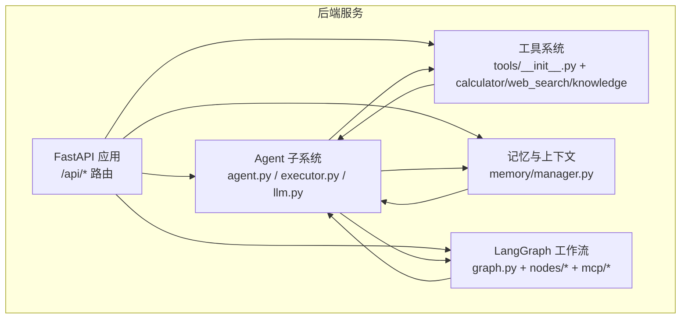
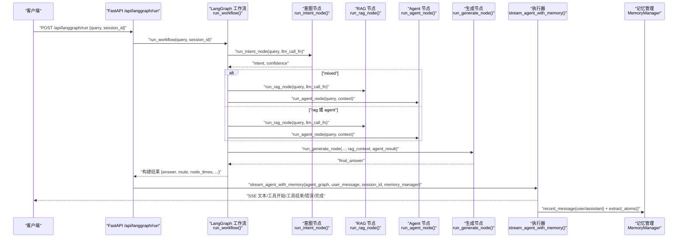
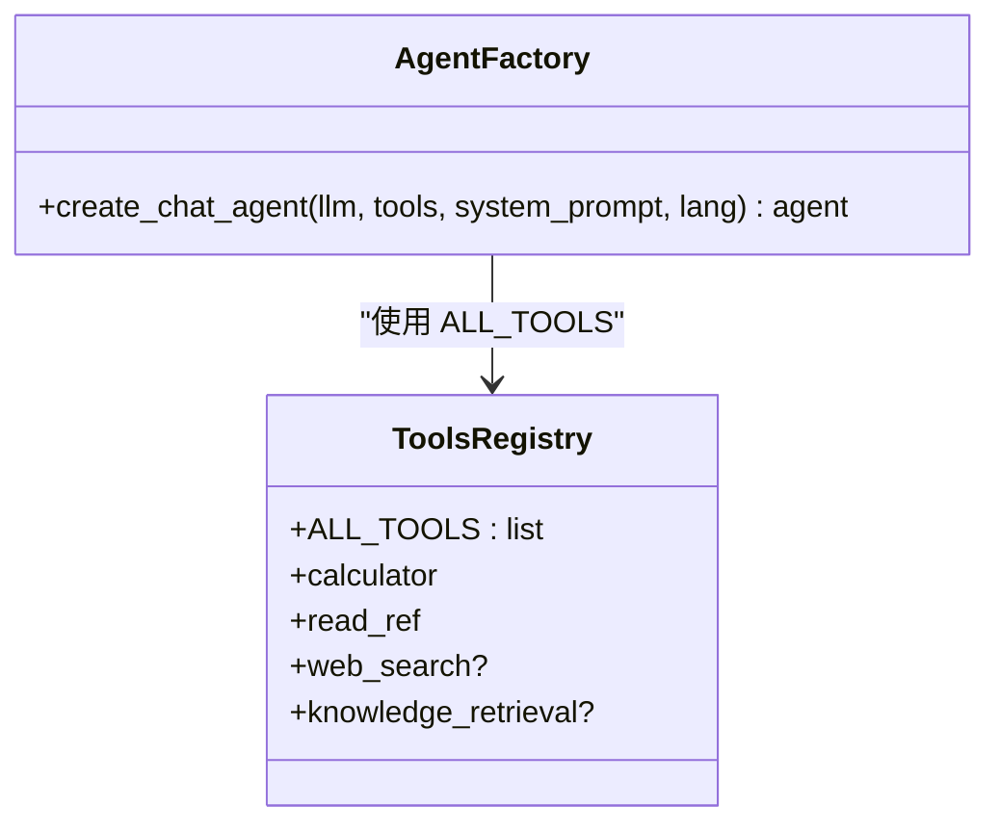
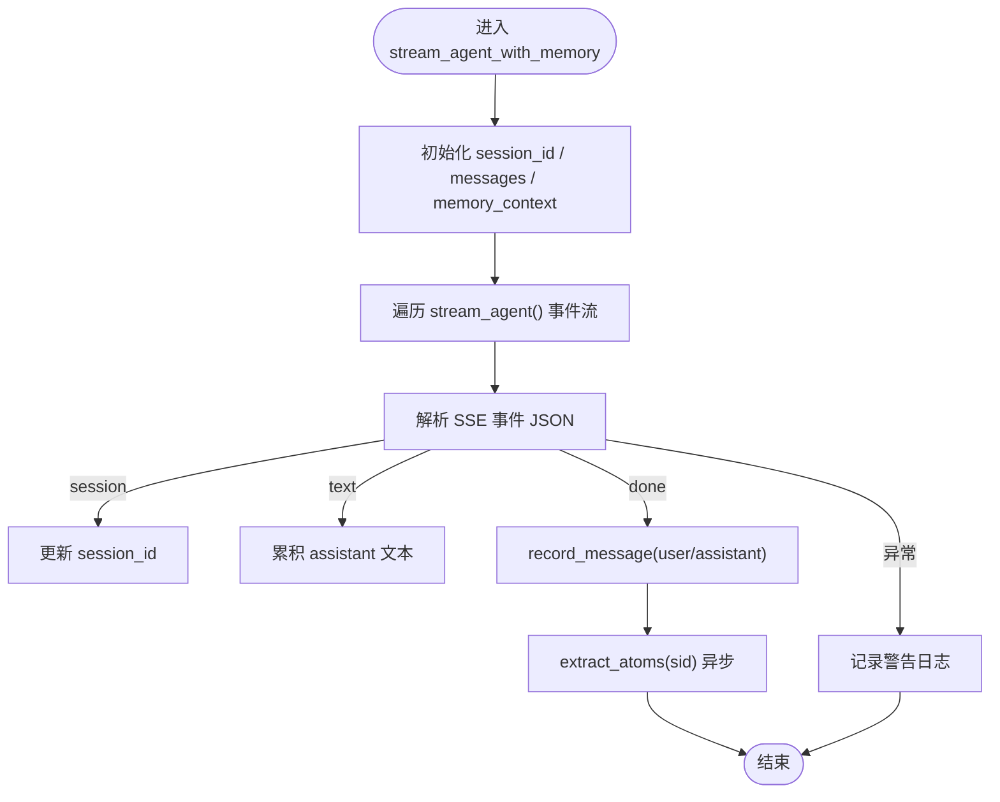
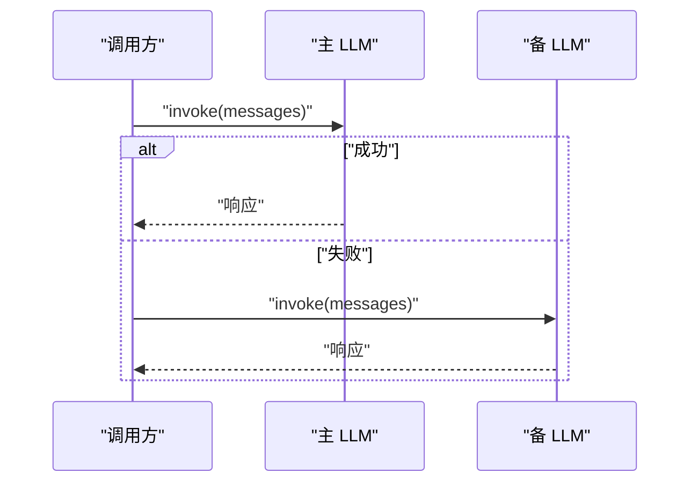
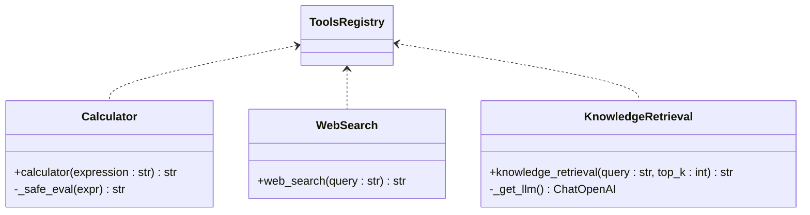
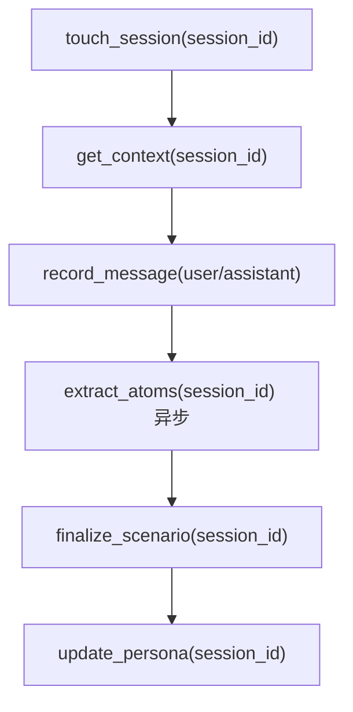
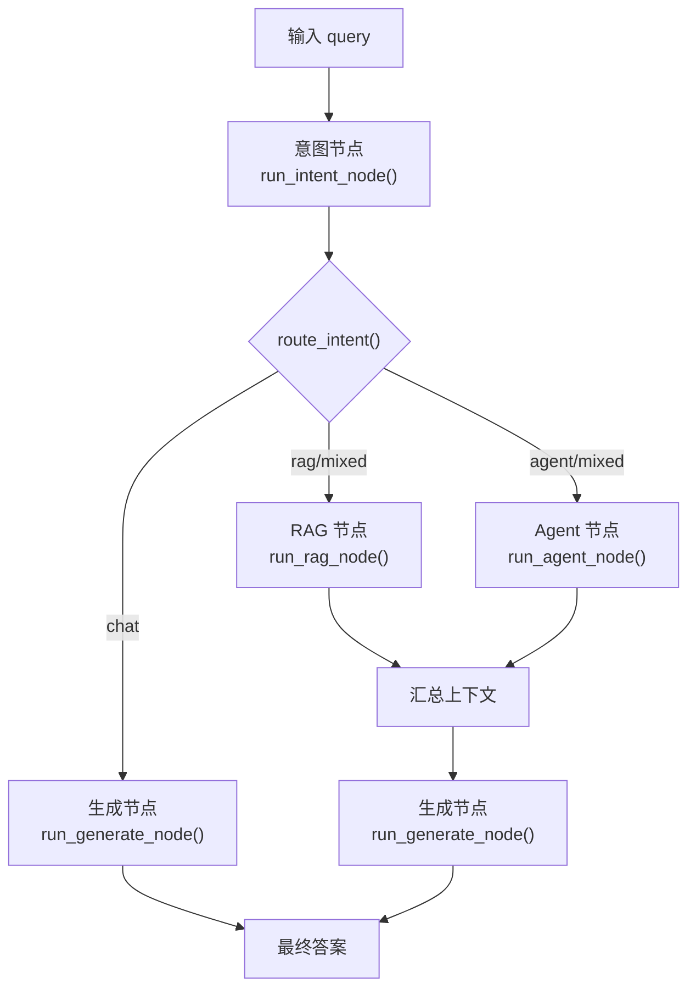
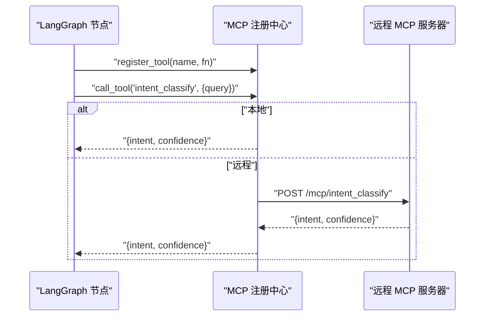
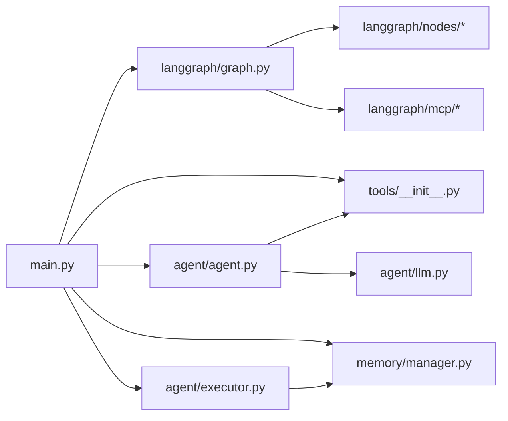

# AI Agent 系统

<cite>
**本文档引用的文件**
- [backend/app/agent/agent.py](file://backend/app/agent/agent.py)
- [backend/app/agent/executor.py](file://backend/app/agent/executor.py)
- [backend/app/agent/llm.py](file://backend/app/agent/llm.py)
- [backend/app/tools/__init__.py](file://backend/app/tools/__init__.py)
- [backend/app/tools/calculator.py](file://backend/app/tools/calculator.py)
- [backend/app/tools/web_search.py](file://backend/app/tools/web_search.py)
- [backend/app/tools/knowledge.py](file://backend/app/tools/knowledge.py)
- [backend/app/memory/manager.py](file://backend/app/memory/manager.py)
- [backend/app/langgraph/graph.py](file://backend/app/langgraph/graph.py)
- [backend/app/langgraph/state.py](file://backend/app/langgraph/state.py)
- [backend/app/langgraph/nodes/agent.py](file://backend/app/langgraph/nodes/agent.py)
- [backend/app/langgraph/nodes/generate.py](file://backend/app/langgraph/nodes/generate.py)
- [backend/app/langgraph/mcp/client.py](file://backend/app/langgraph/mcp/client.py)
- [backend/app/langgraph/mcp/server.py](file://backend/app/langgraph/mcp/server.py)
- [backend/app/main.py](file://backend/app/main.py)
</cite>

## 目录
1. [引言](#引言)
2. [项目结构](#项目结构)
3. [核心组件](#核心组件)
4. [架构总览](#架构总览)
5. [详细组件分析](#详细组件分析)
6. [依赖关系分析](#依赖关系分析)
7. [性能考量](#性能考量)
8. [故障排查指南](#故障排查指南)
9. [结论](#结论)
10. [附录](#附录)

## 引言
本文件面向开发者与运维人员，系统性阐述 Aureon 的 AI Agent 系统：从智能代理的架构设计、编排机制、任务执行流程与工具调用策略，到执行器管理、LLM 集成与多模态处理能力；并提供工具系统的扩展机制、状态管理与记忆集成、上下文维护、性能优化、并发处理与错误恢复策略，以及如何基于现有框架创建自定义代理、添加新工具与优化代理行为。同时，文档详述代理与 LangGraph 工作流的集成方式。

## 项目结构
后端采用模块化分层组织，Agent 子系统位于 backend/app/agent，工具集位于 backend/app/tools，LangGraph 工作流位于 backend/app/langgraph，内存与记忆位于 backend/app/memory，入口服务位于 backend/app/main.py。整体遵循“功能域+分层”的组织方式，便于扩展与维护。

图表来源
- [backend/app/main.py](file://backend/app/main.py)
- [backend/app/agent/agent.py](file://backend/app/agent/agent.py)
- [backend/app/agent/executor.py](file://backend/app/agent/executor.py)
- [backend/app/agent/llm.py](file://backend/app/agent/llm.py)
- [backend/app/tools/__init__.py](file://backend/app/tools/__init__.py)
- [backend/app/memory/manager.py](file://backend/app/memory/manager.py)
- [backend/app/langgraph/graph.py](file://backend/app/langgraph/graph.py)

章节来源
- [backend/app/main.py](file://backend/app/main.py)
- [backend/app/agent/agent.py](file://backend/app/agent/agent.py)
- [backend/app/agent/executor.py](file://backend/app/agent/executor.py)
- [backend/app/agent/llm.py](file://backend/app/agent/llm.py)
- [backend/app/tools/__init__.py](file://backend/app/tools/__init__.py)
- [backend/app/memory/manager.py](file://backend/app/memory/manager.py)
- [backend/app/langgraph/graph.py](file://backend/app/langgraph/graph.py)

## 核心组件
- Agent 子系统：负责创建聊天代理、工具注册与提示词工程，支撑工具调用与对话编排。
- 执行器与流式输出：提供 SSE 流式响应、会话 ID 管理、事件拦截与记忆记录。
- LLM 集成：统一的 LLM 工厂、重试与回退策略，支持多模型注册表。
- 工具系统：计算器、网络搜索、知识检索等内置工具，具备条件注册与安全评估。
- 记忆与上下文：分层记忆（L0-L3）、场景总结、人物画像、离线归档与后台清理。
- LangGraph 工作流：意图识别、RAG、Agent 执行、生成节点的条件路由与并行执行。
- MCP 工具注册：将工作流节点注册为 MCP 工具，支持本地/远程调用。

章节来源
- [backend/app/agent/agent.py](file://backend/app/agent/agent.py)
- [backend/app/agent/executor.py](file://backend/app/agent/executor.py)
- [backend/app/agent/llm.py](file://backend/app/agent/llm.py)
- [backend/app/tools/__init__.py](file://backend/app/tools/__init__.py)
- [backend/app/memory/manager.py](file://backend/app/memory/manager.py)
- [backend/app/langgraph/graph.py](file://backend/app/langgraph/graph.py)
- [backend/app/langgraph/mcp/server.py](file://backend/app/langgraph/mcp/server.py)

## 架构总览
Aureon 的 Agent 系统通过 LangGraph 工作流进行编排：接收用户查询后，先进行意图分类（rag/agent/chat/mixed），再按需并行执行 RAG 检索与 Agent 工具调用，最后由生成节点汇总并输出最终答案。执行器负责将 LangGraph 事件转换为 SSE 流式输出，并在流结束后写入记忆与触发原子抽取。

图表来源
- [backend/app/main.py](file://backend/app/main.py)
- [backend/app/langgraph/graph.py](file://backend/app/langgraph/graph.py)
- [backend/app/langgraph/nodes/agent.py](file://backend/app/langgraph/nodes/agent.py)
- [backend/app/langgraph/nodes/generate.py](file://backend/app/langgraph/nodes/generate.py)
- [backend/app/agent/executor.py](file://backend/app/agent/executor.py)
- [backend/app/memory/manager.py](file://backend/app/memory/manager.py)

## 详细组件分析

### Agent 子系统与工具调用
- 提示词工程：默认系统提示包含工具调用规则与记忆系统说明，支持中英文双语提示拼接语言指令。
- 工具注册：ALL_TOOLS 统一聚合计算器、文件读取、可选的网络搜索与知识检索工具；网络搜索与知识检索工具按配置与索引存在性动态注册。
- LangChain Agent 创建：通过工厂方法创建 v1.x API 的聊天代理，注入工具与系统提示。

图表来源
- [backend/app/agent/agent.py](file://backend/app/agent/agent.py)
- [backend/app/tools/__init__.py](file://backend/app/tools/__init__.py)

章节来源
- [backend/app/agent/agent.py](file://backend/app/agent/agent.py)
- [backend/app/tools/__init__.py](file://backend/app/tools/__init__.py)

### 执行器与流式输出
- 会话管理：若未提供 session_id，则自动生成并以 SSE 事件通知客户端；支持传入历史消息与记忆上下文。
- 事件拦截：捕获 on_chat_model_stream、on_tool_start、on_tool_end 等事件，转换为 SSE 事件流。
- 记忆记录：在“完成”事件后，记录用户与助手消息，并异步触发 L1 原子抽取；对解析与字段缺失进行告警日志。
- 错误处理：捕获异常并以 SSE 错误事件返回，保证流式接口健壮性。

图表来源
- [backend/app/agent/executor.py](file://backend/app/agent/executor.py)
- [backend/app/memory/manager.py](file://backend/app/memory/manager.py)

章节来源
- [backend/app/agent/executor.py](file://backend/app/agent/executor.py)
- [backend/app/memory/manager.py](file://backend/app/memory/manager.py)

### LLM 集成与回退策略
- 模型工厂：支持从 MODEL_REGISTRY 或 settings 中创建 ChatOpenAI 实例，统一温度、流式与最大 token 参数。
- 回退策略：主 LLM 失败时自动切换到备 LLM（如 Zhipu），并带指数退避重试。
- 重试装饰器：对常见 API 错误（APIError、APITimeoutError、RateLimitError）进行透明重试。

图表来源
- [backend/app/agent/llm.py](file://backend/app/agent/llm.py)

章节来源
- [backend/app/agent/llm.py](file://backend/app/agent/llm.py)

### 工具系统与扩展机制
- 计算器：基于 AST 白名单的安全表达式求值，支持四则、幂、三角函数与对数等。
- 网络搜索：基于 Tavily 的实时搜索，按配置开关注册。
- 知识检索：封装 RAG 查询链，返回答案与来源链接，按需懒加载 LLM 实例。
- 扩展指南：新增工具需满足 LangChain 工具签名约定，加入 ALL_TOOLS 并在需要时按条件注册。

图表来源
- [backend/app/tools/calculator.py](file://backend/app/tools/calculator.py)
- [backend/app/tools/web_search.py](file://backend/app/tools/web_search.py)
- [backend/app/tools/knowledge.py](file://backend/app/tools/knowledge.py)
- [backend/app/tools/__init__.py](file://backend/app/tools/__init__.py)

章节来源
- [backend/app/tools/calculator.py](file://backend/app/tools/calculator.py)
- [backend/app/tools/web_search.py](file://backend/app/tools/web_search.py)
- [backend/app/tools/knowledge.py](file://backend/app/tools/knowledge.py)
- [backend/app/tools/__init__.py](file://backend/app/tools/__init__.py)

### 记忆与上下文管理
- 分层记忆：L0 对话、L1 原子、L2 场景、L3 人物画像；支持离线归档与读取引用。
- 会话生命周期：touch_session 记录活跃时间，定期清理超时会话并自动终结场景。
- 上下文拼接：get_context 将人物画像与近期场景合并，注入到执行器的消息流中。
- 自动记录：流结束后记录用户与助手消息，并触发原子抽取。

图表来源
- [backend/app/memory/manager.py](file://backend/app/memory/manager.py)

章节来源
- [backend/app/memory/manager.py](file://backend/app/memory/manager.py)

### LangGraph 工作流与节点编排
- 状态模型：AgentState 定义查询、意图、RAG/Agent 结果、中间结果、耗时、MCP 调用记录与人工审批状态。
- 路由逻辑：根据意图分类（rag/agent/chat/mixed）决定执行路径；混合模式下 RAG 与 Agent 并行。
- 节点执行：意图节点、RAG 节点、Agent 节点、生成节点；生成节点根据语言检测选择模板并汇总上下文。
- MCP 注册：将意图分类、知识检索、Agent 执行注册为 MCP 工具，支持本地/远程调用。

图表来源
- [backend/app/langgraph/graph.py](file://backend/app/langgraph/graph.py)
- [backend/app/langgraph/state.py](file://backend/app/langgraph/state.py)
- [backend/app/langgraph/nodes/agent.py](file://backend/app/langgraph/nodes/agent.py)
- [backend/app/langgraph/nodes/generate.py](file://backend/app/langgraph/nodes/generate.py)
- [backend/app/langgraph/mcp/server.py](file://backend/app/langgraph/mcp/server.py)

章节来源
- [backend/app/langgraph/graph.py](file://backend/app/langgraph/graph.py)
- [backend/app/langgraph/state.py](file://backend/app/langgraph/state.py)
- [backend/app/langgraph/nodes/agent.py](file://backend/app/langgraph/nodes/agent.py)
- [backend/app/langgraph/nodes/generate.py](file://backend/app/langgraph/nodes/generate.py)
- [backend/app/langgraph/mcp/server.py](file://backend/app/langgraph/mcp/server.py)

### MCP 工具调用与集成
- 本地注册：在模块加载时注册意图分类、知识检索、Agent 执行等工具，供 LangGraph 节点调用。
- 远程调用：MCPClient 支持本地与远程（HTTP）两种调用方式，便于跨进程或微服务集成。
- 一致性：工具签名与返回结构统一，便于前端消费与可观测性追踪。

图表来源
- [backend/app/langgraph/mcp/server.py](file://backend/app/langgraph/mcp/server.py)
- [backend/app/langgraph/mcp/client.py](file://backend/app/langgraph/mcp/client.py)

章节来源
- [backend/app/langgraph/mcp/server.py](file://backend/app/langgraph/mcp/server.py)
- [backend/app/langgraph/mcp/client.py](file://backend/app/langgraph/mcp/client.py)

## 依赖关系分析
- 组件耦合：Agent 子系统依赖工具系统与 LLM；执行器依赖记忆管理；LangGraph 工作流依赖各节点与 MCP；API 层统一调度。
- 外部依赖：LangChain（Agent、消息）、OpenAI/ChatOpenAI、Tavily、ChromaDB/BM25（RAG）、Prometheus（指标）、Redis（缓存）。
- 循环依赖：当前结构清晰，未见循环导入；MCP 注册在模块加载期完成，避免运行时循环。

图表来源
- [backend/app/main.py](file://backend/app/main.py)
- [backend/app/agent/agent.py](file://backend/app/agent/agent.py)
- [backend/app/agent/executor.py](file://backend/app/agent/executor.py)
- [backend/app/agent/llm.py](file://backend/app/agent/llm.py)
- [backend/app/tools/__init__.py](file://backend/app/tools/__init__.py)
- [backend/app/memory/manager.py](file://backend/app/memory/manager.py)
- [backend/app/langgraph/graph.py](file://backend/app/langgraph/graph.py)
- [backend/app/langgraph/nodes/agent.py](file://backend/app/langgraph/nodes/agent.py)
- [backend/app/langgraph/mcp/server.py](file://backend/app/langgraph/mcp/server.py)

章节来源
- [backend/app/main.py](file://backend/app/main.py)
- [backend/app/agent/agent.py](file://backend/app/agent/agent.py)
- [backend/app/agent/executor.py](file://backend/app/agent/executor.py)
- [backend/app/agent/llm.py](file://backend/app/agent/llm.py)
- [backend/app/tools/__init__.py](file://backend/app/tools/__init__.py)
- [backend/app/memory/manager.py](file://backend/app/memory/manager.py)
- [backend/app/langgraph/graph.py](file://backend/app/langgraph/graph.py)
- [backend/app/langgraph/nodes/agent.py](file://backend/app/langgraph/nodes/agent.py)
- [backend/app/langgraph/mcp/server.py](file://backend/app/langgraph/mcp/server.py)

## 性能考量
- 并发与阻塞：LangGraph 节点调用通过线程池包装为同步函数，避免阻塞事件循环；生成节点按需调用 LLM，减少不必要的推理。
- 流式输出：执行器以 SSE 形式增量返回文本与工具事件，降低首字延迟与内存占用。
- LLM 回退与重试：主备 LLM 与指数退避重试提升吞吐稳定性，避免单点故障导致全链路降级。
- 记忆与索引：后台线程预热 BM25 与向量索引，空索引时通过 API Embedding 自动重建，避免启动阻塞。
- 指标与限流：集成 Prometheus 指标与慢速限制器，便于容量规划与防护。

章节来源
- [backend/app/langgraph/graph.py](file://backend/app/langgraph/graph.py)
- [backend/app/agent/executor.py](file://backend/app/agent/executor.py)
- [backend/app/agent/llm.py](file://backend/app/agent/llm.py)
- [backend/app/main.py](file://backend/app/main.py)

## 故障排查指南
- LLM 无密钥：启动日志会警告 LLM_API_KEY 未配置，Agent 调用将失败；检查环境变量与 settings。
- 工具不可用：网络搜索工具需 TAVILY_API_KEY；知识检索工具需存在向量索引；检查 ALL_TOOLS 注册状态。
- 流式解析错误：执行器对 SSE JSON 解析失败或字段缺失进行告警日志，确认前端事件格式与编码。
- 记忆记录异常：空助手回复会发出警告；原子抽取失败也会记录告警；检查消息存储与异步任务状态。
- LangGraph 节点报错：工作流捕获异常并返回错误信息与兜底答案；查看日志中的堆栈信息定位根因。

章节来源
- [backend/app/main.py](file://backend/app/main.py)
- [backend/app/tools/__init__.py](file://backend/app/tools/__init__.py)
- [backend/app/agent/executor.py](file://backend/app/agent/executor.py)
- [backend/app/memory/manager.py](file://backend/app/memory/manager.py)
- [backend/app/langgraph/graph.py](file://backend/app/langgraph/graph.py)

## 结论
Aureon 的 AI Agent 系统以 LangGraph 为核心编排引擎，结合工具系统、记忆与 LLM 回退策略，实现了高可用、可观测且可扩展的智能代理平台。通过 SSE 流式输出与后台任务，系统兼顾低延迟与稳定性；通过 MCP 注册与条件工具注册，支持灵活扩展与远程集成。建议在生产环境中配合限流、指标与告警体系，持续优化节点耗时与工具调用成功率。

## 附录

### 开发者指南：创建自定义代理
- 新建工具：遵循 LangChain 工具签名，使用装饰器注册；在 tools/__init__.py 中加入 ALL_TOOLS；必要时按配置/索引条件注册。
- 自定义 Agent：在 agent.py 中扩展 create_chat_agent 的参数或系统提示；确保工具列表与提示词匹配。
- 集成 MCP：在 mcp/server.py 中 register_tool 注册新工具；如需远程调用，使用 mcp/client.py 的远程 URL。

章节来源
- [backend/app/tools/__init__.py](file://backend/app/tools/__init__.py)
- [backend/app/agent/agent.py](file://backend/app/agent/agent.py)
- [backend/app/langgraph/mcp/server.py](file://backend/app/langgraph/mcp/server.py)
- [backend/app/langgraph/mcp/client.py](file://backend/app/langgraph/mcp/client.py)

### 开发者指南：添加新工具
- 安全性：参考计算器的 AST 白名单策略，避免任意代码执行。
- 可观测性：在工具内部记录关键参数与耗时，便于前端展示与审计。
- 条件注册：参考网络搜索与知识检索的条件注册逻辑，按配置或资源可用性动态启用。

章节来源
- [backend/app/tools/calculator.py](file://backend/app/tools/calculator.py)
- [backend/app/tools/web_search.py](file://backend/app/tools/web_search.py)
- [backend/app/tools/knowledge.py](file://backend/app/tools/knowledge.py)
- [backend/app/tools/__init__.py](file://backend/app/tools/__init__.py)

### 开发者指南：优化代理行为
- 提示词工程：针对不同意图与语言，调整系统提示与模板；利用语言检测指令保证输出风格一致。
- 工具优先级：在 Agent 提示词中明确工具调用规则，减少幻觉与多余推理。
- 并发与缓存：复用 LLM 实例（如知识检索工具中的懒加载 LLM），减少初始化开销。

章节来源
- [backend/app/agent/agent.py](file://backend/app/agent/agent.py)
- [backend/app/langgraph/nodes/generate.py](file://backend/app/langgraph/nodes/generate.py)
- [backend/app/tools/knowledge.py](file://backend/app/tools/knowledge.py)