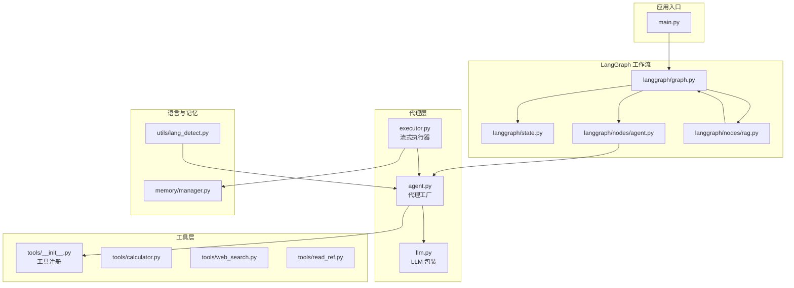
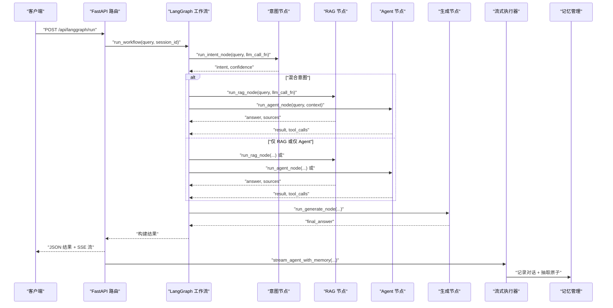
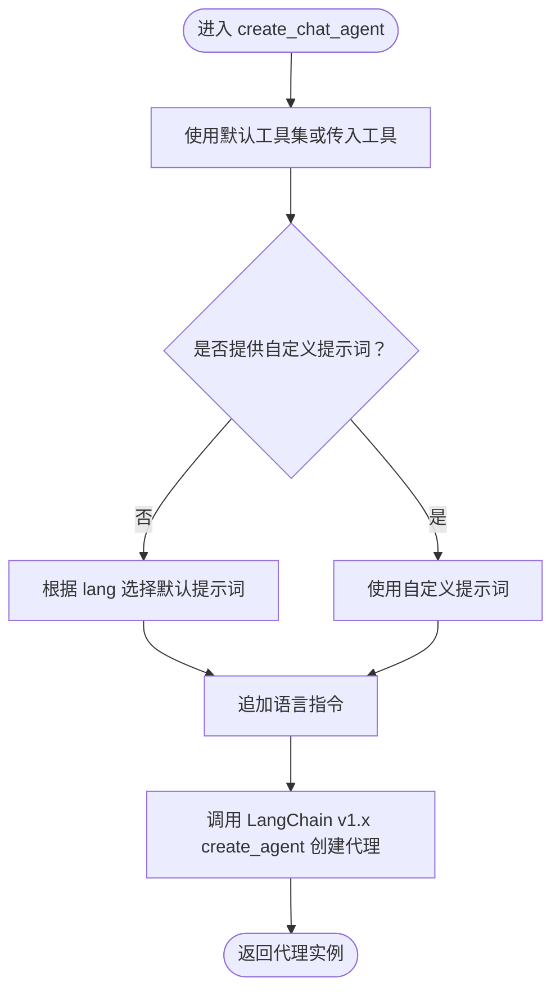
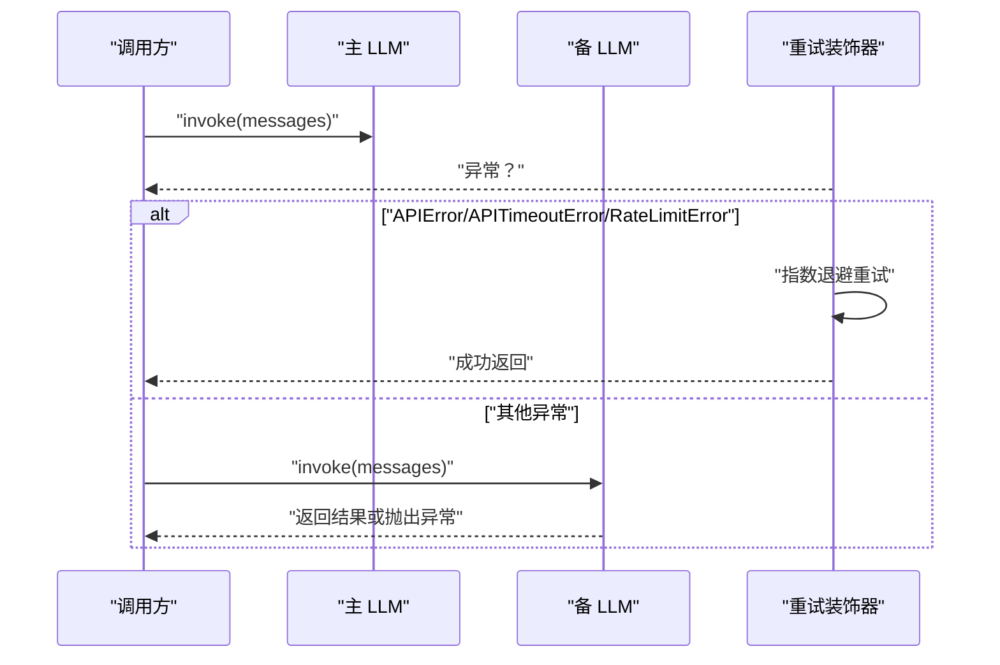
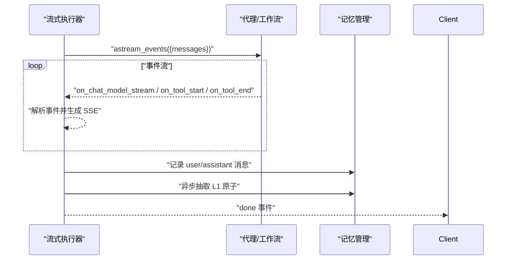
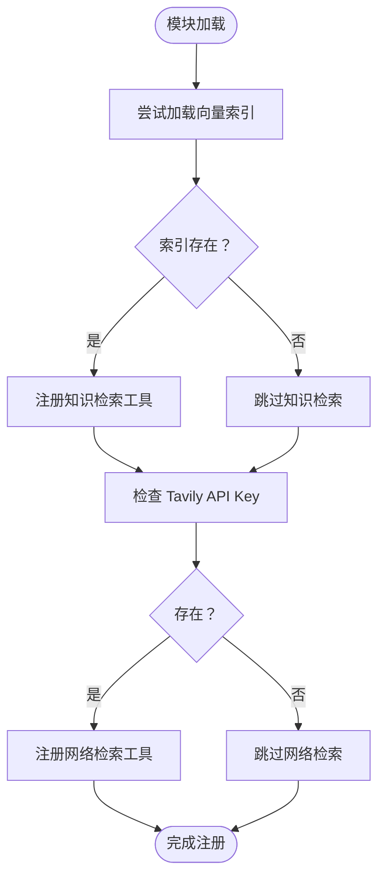
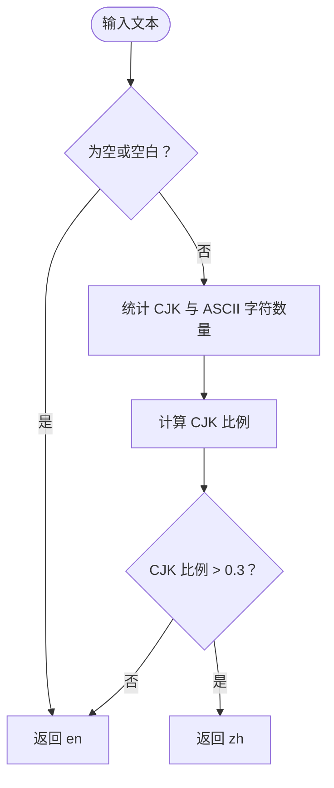
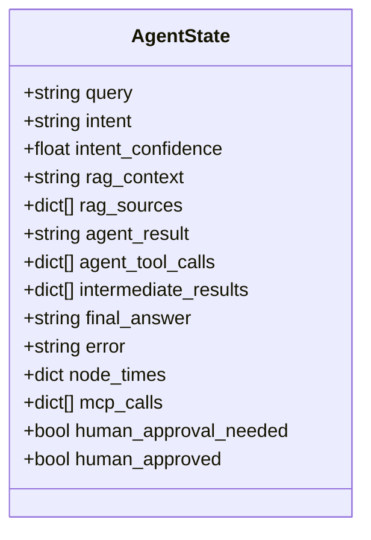
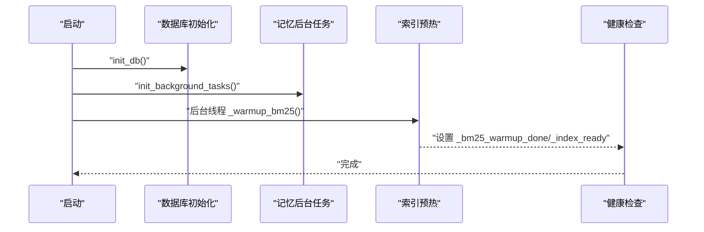
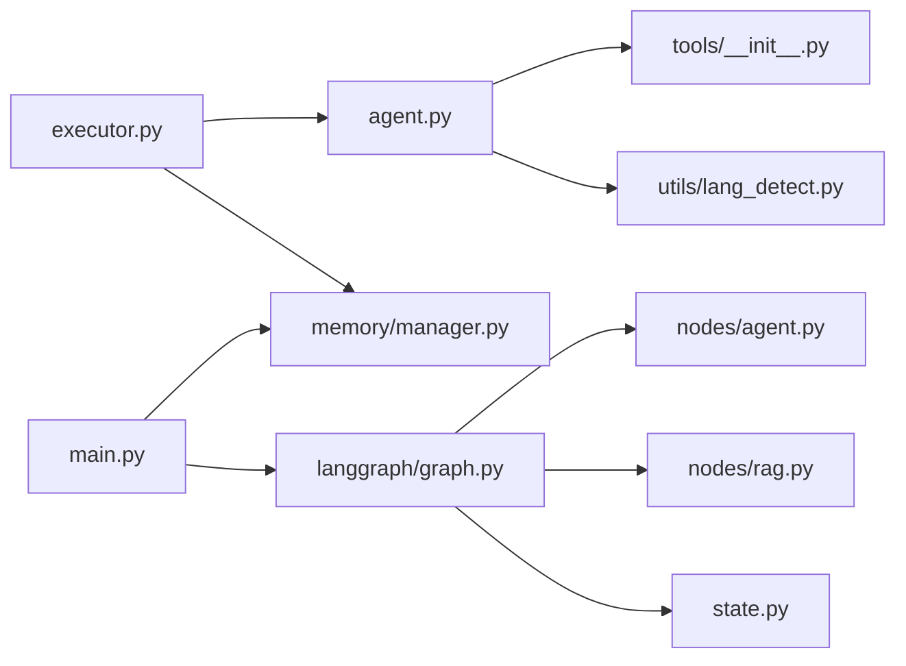

# 代理架构设计

<cite>
**本文引用的文件**
- [backend/app/agent/agent.py](file://backend/app/agent/agent.py)
- [backend/app/agent/executor.py](file://backend/app/agent/executor.py)
- [backend/app/agent/llm.py](file://backend/app/agent/llm.py)
- [backend/app/tools/__init__.py](file://backend/app/tools/__init__.py)
- [backend/app/tools/calculator.py](file://backend/app/tools/calculator.py)
- [backend/app/tools/web_search.py](file://backend/app/tools/web_search.py)
- [backend/app/tools/read_ref.py](file://backend/app/tools/read_ref.py)
- [backend/app/utils/lang_detect.py](file://backend/app/utils/lang_detect.py)
- [backend/app/memory/manager.py](file://backend/app/memory/manager.py)
- [backend/app/langgraph/graph.py](file://backend/app/langgraph/graph.py)
- [backend/app/langgraph/state.py](file://backend/app/langgraph/state.py)
- [backend/app/langgraph/nodes/agent.py](file://backend/app/langgraph/nodes/agent.py)
- [backend/app/langgraph/nodes/rag.py](file://backend/app/langgraph/nodes/rag.py)
- [backend/app/main.py](file://backend/app/main.py)
- [backend/app/config.py](file://backend/app/config.py)
</cite>

## 目录
1. [引言](#引言)
2. [项目结构](#项目结构)
3. [核心组件](#核心组件)
4. [架构总览](#架构总览)
5. [组件详解](#组件详解)
6. [依赖关系分析](#依赖关系分析)
7. [性能考量](#性能考量)
8. [故障排查指南](#故障排查指南)
9. [结论](#结论)
10. [附录](#附录)

## 引言
本文件面向开发者与架构师，系统化阐述 Aureon 的 AI Agent 架构设计与实现要点。重点覆盖：
- 代理核心理念与架构模式：LangChain v1.x API 集成、代理工厂模式、LangGraph 工作流编排
- 系统提示词设计原则：中文与英文提示词的差异与语言适配策略
- 初始化流程、参数配置与语言适配机制
- 代理创建最佳实践与性能优化建议
- 与 LLM 的集成细节与配置项
- 扩展与定制化指导

## 项目结构
后端采用分层与功能域结合的组织方式：
- agent：LangChain 代理工厂、执行器与 LLM 包装
- tools：工具注册与实现（计算器、网络检索、知识检索、引用读取）
- utils：语言检测与提示词拼接
- memory：多层级记忆体系与后台清理任务
- langgraph：工作流编排（意图识别、RAG、Agent、生成节点）
- main：FastAPI 应用入口、启动/关闭钩子、健康检查与路由挂载

**图表来源**
- [backend/app/main.py:218-226](file://backend/app/main.py#L218-L226)
- [backend/app/langgraph/graph.py:43-146](file://backend/app/langgraph/graph.py#L43-L146)
- [backend/app/agent/agent.py:51-71](file://backend/app/agent/agent.py#L51-L71)
- [backend/app/agent/executor.py:11-123](file://backend/app/agent/executor.py#L11-L123)
- [backend/app/agent/llm.py:20-96](file://backend/app/agent/llm.py#L20-L96)
- [backend/app/tools/__init__.py:1-23](file://backend/app/tools/__init__.py#L1-L23)
- [backend/app/utils/lang_detect.py:15-45](file://backend/app/utils/lang_detect.py#L15-L45)
- [backend/app/memory/manager.py:20-130](file://backend/app/memory/manager.py#L20-L130)
- [backend/app/langgraph/nodes/agent.py:13-32](file://backend/app/langgraph/nodes/agent.py#L13-L32)
- [backend/app/langgraph/nodes/rag.py:11-27](file://backend/app/langgraph/nodes/rag.py#L11-L27)

**章节来源**
- [backend/app/main.py:171-205](file://backend/app/main.py#L171-L205)
- [backend/app/config.py:4-90](file://backend/app/config.py#L4-L90)

## 核心组件
- 代理工厂：负责根据语言与工具集合创建 LangChain v1.x 代理实例，并拼接系统提示词与语言指令
- LLM 包装：统一 ChatOpenAI 实例创建、重试与回退策略
- 流式执行器：将 LangGraph/LangChain 事件转换为 SSE 流，支持内存记录与原子抽取
- 工具注册：按环境条件动态注册 RAG/网络检索工具
- 语言检测：基于字符集比例判断语言，注入语言指令
- 记忆管理：多层级记忆（L0 对话、L1 原子、L2 场景、L3 人物画像），含后台清理与归档
- LangGraph 工作流：意图识别、RAG、Agent、生成节点的条件路由与并行执行

**章节来源**
- [backend/app/agent/agent.py:51-71](file://backend/app/agent/agent.py#L51-L71)
- [backend/app/agent/llm.py:20-96](file://backend/app/agent/llm.py#L20-L96)
- [backend/app/agent/executor.py:11-123](file://backend/app/agent/executor.py#L11-L123)
- [backend/app/tools/__init__.py:1-23](file://backend/app/tools/__init__.py#L1-L23)
- [backend/app/utils/lang_detect.py:15-45](file://backend/app/utils/lang_detect.py#L15-L45)
- [backend/app/memory/manager.py:20-130](file://backend/app/memory/manager.py#L20-L130)
- [backend/app/langgraph/graph.py:43-146](file://backend/app/langgraph/graph.py#L43-L146)

## 架构总览
Aureon 的代理架构以“LangGraph 工作流 + LangChain 代理”为核心，结合工具链与记忆系统，形成可扩展的智能体执行框架。

**图表来源**
- [backend/app/main.py:218-226](file://backend/app/main.py#L218-L226)
- [backend/app/langgraph/graph.py:43-146](file://backend/app/langgraph/graph.py#L43-L146)
- [backend/app/langgraph/nodes/agent.py:13-32](file://backend/app/langgraph/nodes/agent.py#L13-L32)
- [backend/app/langgraph/nodes/rag.py:11-27](file://backend/app/langgraph/nodes/rag.py#L11-L27)
- [backend/app/agent/executor.py:64-123](file://backend/app/agent/executor.py#L64-L123)
- [backend/app/memory/manager.py:60-77](file://backend/app/memory/manager.py#L60-L77)

## 组件详解

### 代理工厂与 LangChain v1.x 集成
- 设计理念
  - 工厂模式：集中创建代理实例，屏蔽 LangChain v1.x API 细节
  - 提示词与语言适配：默认中文提示词，英文场景切换英文提示词；附加语言指令确保模型按用户语言输出
  - 工具注入：默认工具集，按环境条件动态启用 RAG/网络检索工具
- 关键行为
  - 若未提供自定义系统提示词，则依据语言选择中文或英文默认提示词
  - 将语言指令追加到提示词末尾，确保模型遵循语言约束
  - 使用 LangChain v1.x 的 create_agent 创建代理
- 参数与配置
  - llm：LangChain ChatOpenAI 实例
  - tools：工具列表，默认 ALL_TOOLS
  - system_prompt：自定义提示词
  - lang：语言代码 "zh"/"en"

**图表来源**
- [backend/app/agent/agent.py:51-71](file://backend/app/agent/agent.py#L51-L71)
- [backend/app/utils/lang_detect.py:42-45](file://backend/app/utils/lang_detect.py#L42-L45)
- [backend/app/tools/__init__.py:1-23](file://backend/app/tools/__init__.py#L1-L23)

**章节来源**
- [backend/app/agent/agent.py:51-71](file://backend/app/agent/agent.py#L51-L71)
- [backend/app/utils/lang_detect.py:15-45](file://backend/app/utils/lang_detect.py#L15-L45)
- [backend/app/tools/__init__.py:1-23](file://backend/app/tools/__init__.py#L1-L23)

### LLM 包装与回退策略
- 设计理念
  - 统一 ChatOpenAI 实例创建，支持多种模型注册表（DeepSeek/OpenAI/Claude）
  - 回退链：主 LLM 失败时自动切换到备 LLM（Zhipu GLM-4-Flash-250414）
  - 重试机制：对瞬时错误进行指数退避重试
- 关键行为
  - create_llm：根据模型名从 MODEL_REGISTRY 获取配置，或使用默认 DeepSeek 设置
  - create_fallback_llm：按配置创建备 LLM，未配置则返回 None
  - llm_invoke_with_retry：对 LLM 调用进行重试包装
  - llm_invoke_with_fallback：主 LLM 失败时回退备 LLM 并记录日志
- 配置项
  - 主 LLM：llm_api_key、llm_model、llm_base_url
  - 备 LLM：fallback_api_key、fallback_model、fallback_base_url
  - 模型注册表：MODEL_REGISTRY

**图表来源**
- [backend/app/agent/llm.py:60-96](file://backend/app/agent/llm.py#L60-L96)
- [backend/app/config.py:67-90](file://backend/app/config.py#L67-L90)

**章节来源**
- [backend/app/agent/llm.py:20-96](file://backend/app/agent/llm.py#L20-L96)
- [backend/app/config.py:4-90](file://backend/app/config.py#L4-L90)

### 流式执行器与内存记录
- 设计理念
  - 将 LangGraph/LangChain 事件流转换为 SSE，支持文本增量、工具开始/结束事件
  - 自动记录对话至 L0，完成后异步抽取 L1 原子，触发场景与人物画像更新
- 关键行为
  - stream_agent：构造消息列表，监听事件流，按类型产出 SSE
  - stream_agent_with_memory：拦截事件，收集完整助手回复，结束后记录并抽取原子
  - 内容安全：对 JSON 解析与字段缺失进行告警，避免静默失败
- 语言与记忆
  - 可传入 memory_context，作为 SystemMessage 注入到会话上下文中
  - 语言指令由上游代理工厂注入，保证响应语言一致性

**图表来源**
- [backend/app/agent/executor.py:11-123](file://backend/app/agent/executor.py#L11-L123)
- [backend/app/memory/manager.py:60-77](file://backend/app/memory/manager.py#L60-L77)

**章节来源**
- [backend/app/agent/executor.py:11-123](file://backend/app/agent/executor.py#L11-L123)
- [backend/app/memory/manager.py:20-130](file://backend/app/memory/manager.py#L20-L130)

### 工具注册与实现
- 工具注册
  - 默认注册：计算器、引用读取
  - 条件注册：若向量索引存在则注册知识检索；若配置 Tavily API 则注册网络检索
- 工具实现
  - 计算器：安全表达式求值，白名单 AST 节点与内置函数
  - 网络检索：Tavily 搜索，限制结果数量与深度
  - 引用读取：受控文件读取，防止路径穿越，支持列出可用文件

**图表来源**
- [backend/app/tools/__init__.py:12-23](file://backend/app/tools/__init__.py#L12-L23)

**章节来源**
- [backend/app/tools/__init__.py:1-23](file://backend/app/tools/__init__.py#L1-L23)
- [backend/app/tools/calculator.py:24-62](file://backend/app/tools/calculator.py#L24-L62)
- [backend/app/tools/web_search.py:6-25](file://backend/app/tools/web_search.py#L6-L25)
- [backend/app/tools/read_ref.py:7-28](file://backend/app/tools/read_ref.py#L7-L28)

### 语言检测与提示词设计
- 语言检测
  - 基于 Unicode 范围统计 CJK 与 ASCII 字符占比，阈值 0.3 判定中文
  - 返回 "zh"/"en"，空或极短文本默认英文
- 提示词设计原则
  - 中文提示词强调工具调用规则、示例与记忆系统说明
  - 英文提示词对应相同规则与示例，确保跨语言一致性
  - 在提示词末尾追加语言指令，强制模型按用户语言回复
- 差异对比
  - 规则条目、示例与记忆说明在中英文版本中语义一致，仅语言不同
  - 工具调用规则与示例在两种语言下保持等价逻辑

**图表来源**
- [backend/app/utils/lang_detect.py:15-35](file://backend/app/utils/lang_detect.py#L15-L35)

**章节来源**
- [backend/app/agent/agent.py:6-48](file://backend/app/agent/agent.py#L6-L48)
- [backend/app/utils/lang_detect.py:15-45](file://backend/app/utils/lang_detect.py#L15-L45)

### LangGraph 工作流与节点
- 工作流
  - 意图识别：基于 LLM 分类 "rag"/"agent"/"chat"/"mixed"
  - 条件路由：根据意图与人工审批状态决定执行路径
  - 并行执行：混合意图下 RAG 与 Agent 并行运行
  - 生成节点：根据意图与上下文生成最终回答
- 状态模型
  - AgentState：包含查询、意图、置信度、RAG 上下文与来源、Agent 结果与工具调用、中间结果、最终答案、错误、节点耗时、MCP 调用记录、人工审批标记等
- 节点实现
  - Agent 节点：封装 LangChain 代理执行，支持上下文拼接
  - RAG 节点：通过 RAG 查询返回答案与来源列表

**图表来源**
- [backend/app/langgraph/state.py:6-47](file://backend/app/langgraph/state.py#L6-L47)

**章节来源**
- [backend/app/langgraph/graph.py:43-146](file://backend/app/langgraph/graph.py#L43-L146)
- [backend/app/langgraph/state.py:29-47](file://backend/app/langgraph/state.py#L29-L47)
- [backend/app/langgraph/nodes/agent.py:13-32](file://backend/app/langgraph/nodes/agent.py#L13-L32)
- [backend/app/langgraph/nodes/rag.py:11-27](file://backend/app/langgraph/nodes/rag.py#L11-L27)

### 应用入口与初始化流程
- 启动阶段
  - 数据库初始化、特征开关、可观测性、安全、评估、成本、可靠性、知识、AI 平台、集成表初始化
  - 启动记忆后台任务（周期性清理不活跃会话）
  - 后台线程预热 BM25 与向量索引，必要时通过 API 重建索引
- 路由与健康
  - /api/langgraph/run：LangGraph 工作流执行
  - /api/health：返回索引状态、工具可用性与模型配置
- CrewAI 集成
  - 文章生成与流式事件，按主题语言选择 LLM 配置

**图表来源**
- [backend/app/main.py:171-205](file://backend/app/main.py#L171-L205)
- [backend/app/main.py:218-226](file://backend/app/main.py#L218-L226)
- [backend/app/main.py:340-348](file://backend/app/main.py#L340-L348)

**章节来源**
- [backend/app/main.py:171-205](file://backend/app/main.py#L171-L205)
- [backend/app/main.py:218-226](file://backend/app/main.py#L218-L226)
- [backend/app/main.py:340-348](file://backend/app/main.py#L340-L348)

## 依赖关系分析
- 组件耦合
  - agent.py 依赖 tools/__init__.py 与 utils/lang_detect.py
  - executor.py 依赖 agent.py 与 memory/manager.py
  - langgraph/graph.py 依赖 nodes/agent.py、nodes/rag.py 与 state.py
  - main.py 依赖 langgraph/graph.py 与 memory/manager.py
- 外部依赖
  - LangChain v1.x（create_agent）、LangGraph（astream_events）
  - OpenAI/ChatOpenAI、tenacity 重试、Tavily 搜索、Redis 缓存
- 潜在循环依赖
  - 当前模块间为单向依赖，未发现循环导入

**图表来源**
- [backend/app/agent/agent.py:1-3](file://backend/app/agent/agent.py#L1-L3)
- [backend/app/agent/executor.py:1-8](file://backend/app/agent/executor.py#L1-L8)
- [backend/app/langgraph/graph.py:1-17](file://backend/app/langgraph/graph.py#L1-L17)
- [backend/app/main.py:37-42](file://backend/app/main.py#L37-L42)

**章节来源**
- [backend/app/agent/agent.py:1-3](file://backend/app/agent/agent.py#L1-L3)
- [backend/app/agent/executor.py:1-8](file://backend/app/agent/executor.py#L1-L8)
- [backend/app/langgraph/graph.py:1-17](file://backend/app/langgraph/graph.py#L1-L17)
- [backend/app/main.py:37-42](file://backend/app/main.py#L37-L42)

## 性能考量
- LLM 调用
  - 使用重试与回退策略降低瞬时错误影响
  - 通过 MODEL_REGISTRY 支持多模型，便于横向扩展
- 工作流执行
  - 意图识别与并行执行减少总体等待时间
  - 节点耗时记录用于性能监控与瓶颈定位
- 流式输出
  - SSE 增量推送提升用户体验，避免长尾阻塞
- 记忆与缓存
  - L0 对话上限与后台清理避免内存膨胀
  - Redis 缓存与向量索引预热减少冷启动延迟

[本节为通用性能建议，无需特定文件来源]

## 故障排查指南
- LLM 未配置
  - 现象：启动警告或代理调用失败
  - 排查：确认主/备 LLM 的 API Key、Base URL、Model 名称
- 工具不可用
  - 现象：工具未注册或调用返回未配置提示
  - 排查：检查向量索引是否存在、Tavily API Key 是否配置
- SSE 解析错误
  - 现象：内存记录阶段出现 JSON 解析告警
  - 排查：检查上游事件格式与编码，确保事件字符串以 "data: " 开头
- 记忆记录异常
  - 现象：空助手回复告警或原子抽取失败
  - 排查：确认会话 ID 有效、消息记录成功、后台任务正常运行

**章节来源**
- [backend/app/main.py:173-175](file://backend/app/main.py#L173-L175)
- [backend/app/agent/llm.py:26-28](file://backend/app/agent/llm.py#L26-L28)
- [backend/app/agent/executor.py:113-118](file://backend/app/agent/executor.py#L113-L118)
- [backend/app/memory/manager.py:104-127](file://backend/app/memory/manager.py#L104-L127)

## 结论
Aureon 的代理架构以 LangGraph 工作流为核心，结合 LangChain v1.x 代理工厂、工具链与记忆系统，实现了可扩展、可观测且具备回退能力的智能体执行框架。通过明确的提示词设计原则与语言适配策略，系统在中文与英文场景下均能稳定输出一致的工具调用与回答质量。建议在生产环境中优先配置主/备 LLM、启用工具注册与索引预热，并结合节点耗时监控持续优化性能。

[本节为总结性内容，无需特定文件来源]

## 附录

### 代理创建最佳实践
- 明确提示词与语言：优先使用默认提示词，必要时注入语言指令
- 工具选择：仅注册必要的工具，避免不必要的外部依赖
- LLM 配置：通过 MODEL_REGISTRY 管理多模型，确保 API Key 与 Base URL 正确
- 回退策略：为主 LLM 配置备 LLM，确保故障转移

### 性能优化建议
- 并行执行：混合意图下并行运行 RAG 与 Agent
- 流式输出：使用 SSE 增量推送，缩短首包延迟
- 缓存与索引：预热向量索引与 BM25，减少首次查询开销
- 监控与告警：记录节点耗时与错误，建立告警机制

### 扩展与定制化指导
- 新增工具：在 tools/__init__.py 中注册，并在代理工厂中纳入 ALL_TOOLS
- 自定义提示词：在 agent.py 中扩展 DEFAULT_SYSTEM_PROMPT 与语言分支
- 新增节点：在 langgraph/nodes 下新增节点并在 graph.py 中接入路由
- LLM 扩展：在 MODEL_REGISTRY 中新增模型配置，或扩展 create_llm/create_fallback_llm

**章节来源**
- [backend/app/tools/__init__.py:1-23](file://backend/app/tools/__init__.py#L1-L23)
- [backend/app/agent/agent.py:6-48](file://backend/app/agent/agent.py#L6-L48)
- [backend/app/langgraph/graph.py:32-41](file://backend/app/langgraph/graph.py#L32-L41)
- [backend/app/agent/llm.py:20-57](file://backend/app/agent/llm.py#L20-L57)