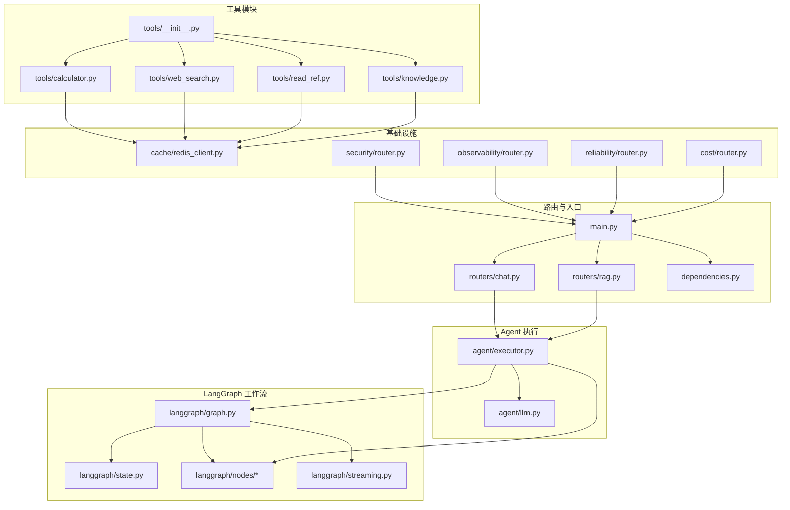
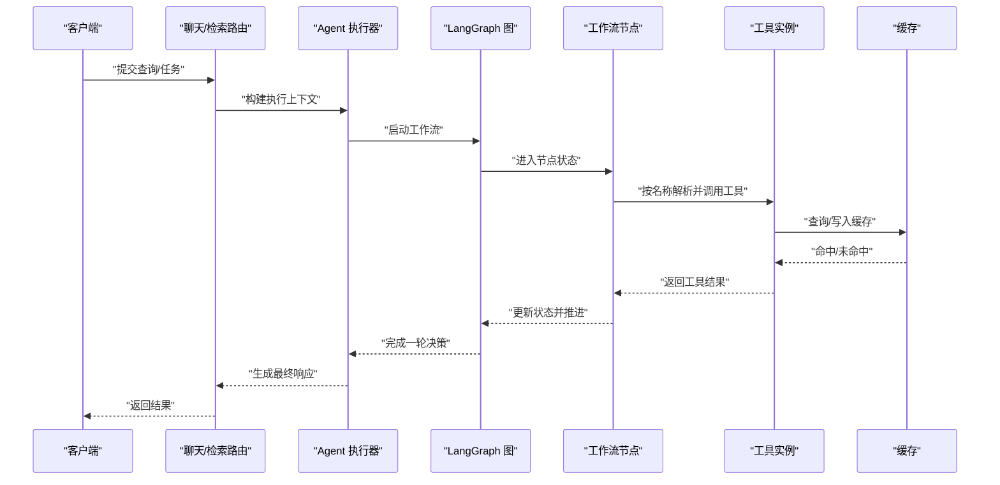
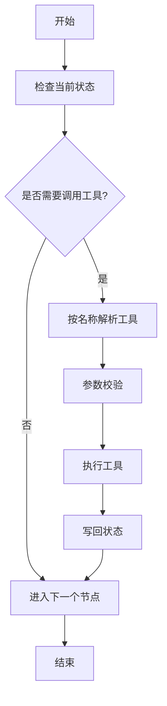
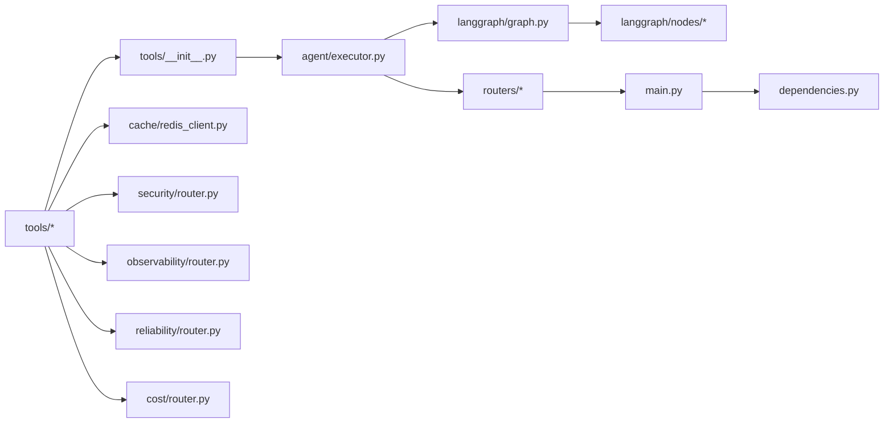

# 工具系统

<cite>
**本文引用的文件**
- [backend/app/tools/__init__.py](file://backend/app/tools/__init__.py)
- [backend/app/tools/calculator.py](file://backend/app/tools/calculator.py)
- [backend/app/tools/knowledge.py](file://backend/app/tools/knowledge.py)
- [backend/app/tools/read_ref.py](file://backend/app/tools/read_ref.py)
- [backend/app/tools/web_search.py](file://backend/app/tools/web_search.py)
- [backend/tests/test_tools.py](file://backend/tests/test_tools.py)
- [backend/app/main.py](file://backend/app/main.py)
- [backend/app/dependencies.py](file://backend/app/dependencies.py)
- [backend/app/exceptions.py](file://backend/app/exceptions.py)
- [backend/app/cache/redis_client.py](file://backend/app/cache/redis_client.py)
- [backend/app/langgraph/nodes/agent.py](file://backend/app/langgraph/nodes/agent.py)
- [backend/app/langgraph/nodes/generate.py](file://backend/app/langgraph/nodes/generate.py)
- [backend/app/langgraph/nodes/intent.py](file://backend/app/langgraph/nodes/intent.py)
- [backend/app/langgraph/nodes/rag.py](file://backend/app/langgraph/nodes/rag.py)
- [backend/app/langgraph/graph.py](file://backend/app/langgraph/graph.py)
- [backend/app/langgraph/state.py](file://backend/app/langgraph/state.py)
- [backend/app/langgraph/streaming.py](file://backend/app/langgraph/streaming.py)
- [backend/app/agent/executor.py](file://backend/app/agent/executor.py)
- [backend/app/agent/llm.py](file://backend/app/agent/llm.py)
- [backend/app/routers/chat.py](file://backend/app/routers/chat.py)
- [backend/app/routers/rag.py](file://backend/app/routers/rag.py)
- [backend/app/security/router.py](file://backend/app/security/router.py)
- [backend/app/observability/router.py](file://backend/app/observability/router.py)
- [backend/app/reliability/router.py](file://backend/app/reliability/router.py)
- [backend/app/cost/router.py](file://backend/app/cost/router.py)
- [backend/app/crew/crew_setup.py](file://backend/app/crew/crew_setup.py)
- [backend/app/crew/tasks.py](file://backend/app/crew/tasks.py)
- [backend/app/crew/agents.py](file://backend/app/crew/agents.py)
- [backend/app/crew/main_events.py](file://backend/app/crew/main_events.py)
</cite>

## 目录
1. [简介](#简介)
2. [项目结构](#项目结构)
3. [核心组件](#核心组件)
4. [架构总览](#架构总览)
5. [详细组件分析](#详细组件分析)
6. [依赖关系分析](#依赖关系分析)
7. [性能考虑](#性能考虑)
8. [故障排查指南](#故障排查指南)
9. [结论](#结论)
10. [附录](#附录)

## 简介
本文件面向 Aureon 的“工具系统”，系统性梳理其架构设计、扩展机制与运行时行为，覆盖内置工具（计算器、网络搜索、文件读取、知识查询）的实现原理与调用协议，并给出工具开发标准接口、安全与权限控制、错误处理策略、性能优化与并发处理建议，以及创建自定义工具、集成第三方服务与工具链组合的实践指南。

## 项目结构
工具系统位于后端 Python 应用中，核心代码集中在 tools 模块，配合 LangGraph 工作流、Agent 执行器、RAG 节点与路由层协同工作。测试用例集中于 backend/tests/test_tools.py，用于验证工具注册、调用与参数校验。

图示来源
- [backend/app/tools/__init__.py](file://backend/app/tools/__init__.py)
- [backend/app/tools/calculator.py](file://backend/app/tools/calculator.py)
- [backend/app/tools/web_search.py](file://backend/app/tools/web_search.py)
- [backend/app/tools/read_ref.py](file://backend/app/tools/read_ref.py)
- [backend/app/tools/knowledge.py](file://backend/app/tools/knowledge.py)
- [backend/app/langgraph/graph.py](file://backend/app/langgraph/graph.py)
- [backend/app/langgraph/nodes/agent.py](file://backend/app/langgraph/nodes/agent.py)
- [backend/app/langgraph/nodes/generate.py](file://backend/app/langgraph/nodes/generate.py)
- [backend/app/langgraph/nodes/intent.py](file://backend/app/langgraph/nodes/intent.py)
- [backend/app/langgraph/nodes/rag.py](file://backend/app/langgraph/nodes/rag.py)
- [backend/app/agent/executor.py](file://backend/app/agent/executor.py)
- [backend/app/agent/llm.py](file://backend/app/agent/llm.py)
- [backend/app/routers/chat.py](file://backend/app/routers/chat.py)
- [backend/app/routers/rag.py](file://backend/app/routers/rag.py)
- [backend/app/main.py](file://backend/app/main.py)
- [backend/app/dependencies.py](file://backend/app/dependencies.py)
- [backend/app/cache/redis_client.py](file://backend/app/cache/redis_client.py)
- [backend/app/security/router.py](file://backend/app/security/router.py)
- [backend/app/observability/router.py](file://backend/app/observability/router.py)
- [backend/app/reliability/router.py](file://backend/app/reliability/router.py)
- [backend/app/cost/router.py](file://backend/app/cost/router.py)

章节来源
- [backend/app/tools/__init__.py](file://backend/app/tools/__init__.py)
- [backend/app/tools/calculator.py](file://backend/app/tools/calculator.py)
- [backend/app/tools/web_search.py](file://backend/app/tools/web_search.py)
- [backend/app/tools/read_ref.py](file://backend/app/tools/read_ref.py)
- [backend/app/tools/knowledge.py](file://backend/app/tools/knowledge.py)
- [backend/app/main.py](file://backend/app/main.py)
- [backend/app/dependencies.py](file://backend/app/dependencies.py)
- [backend/tests/test_tools.py](file://backend/tests/test_tools.py)

## 核心组件
- 工具注册与发现：通过 tools/__init__.py 统一导出工具集合，供执行器与工作流节点按名称解析调用。
- 内置工具集：
  - 计算器：执行数值计算与表达式求值。
  - 网络搜索：基于外部搜索引擎进行检索并返回结果摘要。
  - 文件读取：从指定路径读取文件内容，支持权限与存在性校验。
  - 知识查询：在本地知识库中检索相关文档片段。
- 执行器与工作流：Agent 执行器协调工具调用，LangGraph 节点根据状态流转决定何时调用工具。
- 缓存与可观测性：Redis 缓存用于加速重复请求；安全、可靠性、成本与可观测性路由贯穿工具调用链路。

章节来源
- [backend/app/tools/__init__.py](file://backend/app/tools/__init__.py)
- [backend/app/tools/calculator.py](file://backend/app/tools/calculator.py)
- [backend/app/tools/web_search.py](file://backend/app/tools/web_search.py)
- [backend/app/tools/read_ref.py](file://backend/app/tools/read_ref.py)
- [backend/app/tools/knowledge.py](file://backend/app/tools/knowledge.py)
- [backend/app/agent/executor.py](file://backend/app/agent/executor.py)
- [backend/app/langgraph/nodes/agent.py](file://backend/app/langgraph/nodes/agent.py)
- [backend/app/cache/redis_client.py](file://backend/app/cache/redis_client.py)

## 架构总览
工具系统采用“声明式注册 + 工作流编排”的架构。工具以独立模块存在，统一由工具注册表暴露；执行器在工作流节点中根据当前意图或状态选择合适的工具并传入参数；工具执行结果回写到状态，驱动后续节点继续决策。

图示来源
- [backend/app/routers/chat.py](file://backend/app/routers/chat.py)
- [backend/app/routers/rag.py](file://backend/app/routers/rag.py)
- [backend/app/agent/executor.py](file://backend/app/agent/executor.py)
- [backend/app/langgraph/graph.py](file://backend/app/langgraph/graph.py)
- [backend/app/langgraph/nodes/agent.py](file://backend/app/langgraph/nodes/agent.py)
- [backend/app/tools/__init__.py](file://backend/app/tools/__init__.py)
- [backend/app/cache/redis_client.py](file://backend/app/cache/redis_client.py)

## 详细组件分析

### 工具注册与调用协议
- 注册机制：tools/__init__.py 提供工具注册表，按名称映射到具体工具类或函数，便于执行器按名解析。
- 调用协议：工具需实现统一的调用接口（如名称、输入参数结构、输出格式），并在执行前进行参数校验。
- 参数验证：对必填字段、类型范围、长度限制进行校验；对敏感参数进行脱敏或白名单过滤。
- 错误处理：工具内部捕获异常并转换为标准化错误码与消息，避免泄露内部细节。

章节来源
- [backend/app/tools/__init__.py](file://backend/app/tools/__init__.py)
- [backend/app/exceptions.py](file://backend/app/exceptions.py)

### 计算器工具
- 功能概述：接收数学表达式字符串，返回数值计算结果；支持常见运算符与括号优先级。
- 输入参数：表达式字符串（需进行合法性与安全性校验，防止注入）。
- 输出格式：数值结果或错误信息。
- 安全要点：仅允许数字、运算符与括号；拒绝脚本或函数调用。
- 性能优化：对简单表达式可做缓存；复杂表达式分步计算并设置超时。

章节来源
- [backend/app/tools/calculator.py](file://backend/app/tools/calculator.py)

### 网络搜索工具
- 功能概述：对接外部搜索引擎，返回搜索结果摘要列表。
- 输入参数：关键词、语言偏好、结果数量上限等。
- 输出格式：条目数组（标题、链接、摘要）。
- 安全与权限：限制调用频率与并发数；对关键词进行净化与长度限制；可配置代理与超时。
- 隐私保护：不记录用户输入；对返回结果进行去隐私化处理。

章节来源
- [backend/app/tools/web_search.py](file://backend/app/tools/web_search.py)

### 文件读取工具
- 功能概述：从指定路径读取文件内容，支持文本与二进制文件；受权限与路径白名单控制。
- 输入参数：文件路径、编码方式、最大读取字节数。
- 输出格式：文件内容或错误信息。
- 权限控制：仅允许访问受信任目录；对路径进行规范化与安全检查（如禁止穿越）。
- 并发与缓存：大文件可缓存；并发读取需加锁或队列限流。

章节来源
- [backend/app/tools/read_ref.py](file://backend/app/tools/read_ref.py)

### 知识查询工具
- 功能概述：在本地知识库中检索相关文档片段，返回高相关度条目。
- 输入参数：查询语句、相似度阈值、返回条数。
- 输出格式：条目数组（标题、片段、来源、相似度分数）。
- 向量化与索引：依赖向量存储与检索器；可结合重排序与过滤策略。
- 性能优化：批量查询、缓存热门问题、增量索引更新。

章节来源
- [backend/app/tools/knowledge.py](file://backend/app/tools/knowledge.py)

### 工具执行器与工作流集成
- 执行器职责：解析当前状态，选择合适工具，组装参数，执行工具并回写结果。
- 节点编排：Intent 节点识别意图，Agent 节点调度工具，Generate 节点生成回答，RAG 节点处理检索增强。
- 流式输出：通过 streaming 模块将中间结果逐步返回给前端。

图示来源
- [backend/app/agent/executor.py](file://backend/app/agent/executor.py)
- [backend/app/langgraph/nodes/intent.py](file://backend/app/langgraph/nodes/intent.py)
- [backend/app/langgraph/nodes/agent.py](file://backend/app/langgraph/nodes/agent.py)
- [backend/app/langgraph/nodes/generate.py](file://backend/app/langgraph/nodes/generate.py)
- [backend/app/langgraph/nodes/rag.py](file://backend/app/langgraph/nodes/rag.py)
- [backend/app/langgraph/state.py](file://backend/app/langgraph/state.py)
- [backend/app/langgraph/streaming.py](file://backend/app/langgraph/streaming.py)

章节来源
- [backend/app/agent/executor.py](file://backend/app/agent/executor.py)
- [backend/app/langgraph/nodes/agent.py](file://backend/app/langgraph/nodes/agent.py)
- [backend/app/langgraph/nodes/intent.py](file://backend/app/langgraph/nodes/intent.py)
- [backend/app/langgraph/nodes/generate.py](file://backend/app/langgraph/nodes/generate.py)
- [backend/app/langgraph/nodes/rag.py](file://backend/app/langgraph/nodes/rag.py)
- [backend/app/langgraph/state.py](file://backend/app/langgraph/state.py)
- [backend/app/langgraph/streaming.py](file://backend/app/langgraph/streaming.py)

### 路由与入口
- 路由层：chat.py 与 rag.py 将外部请求转交给执行器，负责鉴权、限流与参数预处理。
- 入口应用：main.py 初始化依赖与路由，dependencies.py 提供全局依赖注入。

章节来源
- [backend/app/routers/chat.py](file://backend/app/routers/chat.py)
- [backend/app/routers/rag.py](file://backend/app/routers/rag.py)
- [backend/app/main.py](file://backend/app/main.py)
- [backend/app/dependencies.py](file://backend/app/dependencies.py)

### 安全、可观测性、可靠性与成本控制
- 安全：security/router.py 对工具调用进行鉴权与审计；对输入进行净化与白名单校验。
- 可观测性：observability/router.py 记录工具调用日志、耗时与成功率。
- 可靠性：reliability/router.py 实现熔断、降级与重试策略。
- 成本：cost/router.py 统计工具调用次数与资源消耗，辅助计费与预算控制。

章节来源
- [backend/app/security/router.py](file://backend/app/security/router.py)
- [backend/app/observability/router.py](file://backend/app/observability/router.py)
- [backend/app/reliability/router.py](file://backend/app/reliability/router.py)
- [backend/app/cost/router.py](file://backend/app/cost/router.py)

## 依赖关系分析
工具系统与执行器、工作流、路由、基础设施之间存在清晰的依赖边界：

图示来源
- [backend/app/tools/__init__.py](file://backend/app/tools/__init__.py)
- [backend/app/tools/calculator.py](file://backend/app/tools/calculator.py)
- [backend/app/tools/web_search.py](file://backend/app/tools/web_search.py)
- [backend/app/tools/read_ref.py](file://backend/app/tools/read_ref.py)
- [backend/app/tools/knowledge.py](file://backend/app/tools/knowledge.py)
- [backend/app/agent/executor.py](file://backend/app/agent/executor.py)
- [backend/app/langgraph/graph.py](file://backend/app/langgraph/graph.py)
- [backend/app/langgraph/nodes/agent.py](file://backend/app/langgraph/nodes/agent.py)
- [backend/app/routers/chat.py](file://backend/app/routers/chat.py)
- [backend/app/routers/rag.py](file://backend/app/routers/rag.py)
- [backend/app/main.py](file://backend/app/main.py)
- [backend/app/dependencies.py](file://backend/app/dependencies.py)
- [backend/app/cache/redis_client.py](file://backend/app/cache/redis_client.py)
- [backend/app/security/router.py](file://backend/app/security/router.py)
- [backend/app/observability/router.py](file://backend/app/observability/router.py)
- [backend/app/reliability/router.py](file://backend/app/reliability/router.py)
- [backend/app/cost/router.py](file://backend/app/cost/router.py)

章节来源
- [backend/app/tools/__init__.py](file://backend/app/tools/__init__.py)
- [backend/app/agent/executor.py](file://backend/app/agent/executor.py)
- [backend/app/langgraph/graph.py](file://backend/app/langgraph/graph.py)
- [backend/app/routers/chat.py](file://backend/app/routers/chat.py)
- [backend/app/routers/rag.py](file://backend/app/routers/rag.py)
- [backend/app/main.py](file://backend/app/main.py)
- [backend/app/dependencies.py](file://backend/app/dependencies.py)
- [backend/app/cache/redis_client.py](file://backend/app/cache/redis_client.py)
- [backend/app/security/router.py](file://backend/app/security/router.py)
- [backend/app/observability/router.py](file://backend/app/observability/router.py)
- [backend/app/reliability/router.py](file://backend/app/reliability/router.py)
- [backend/app/cost/router.py](file://backend/app/cost/router.py)

## 性能考虑
- 缓存策略
  - 命中优先：先查 Redis 缓存，未命中再执行工具。
  - 失效策略：为不同工具设置差异化 TTL；热点数据常驻内存。
  - 分布式一致性：使用分布式锁或版本号避免缓存击穿。
- 并发处理
  - 限流：对工具调用速率与并发数进行配额控制。
  - 异步化：对 IO 密集型工具（如网络搜索、文件读取）采用异步执行。
  - 资源池：数据库连接、HTTP 客户端与线程池按工具类别隔离。
- 超时与重试
  - 为每个工具设置合理超时；失败时按指数退避重试。
- 监控与告警
  - 记录 P95/P99 延迟、错误率与缓存命中率；异常自动告警。

## 故障排查指南
- 常见错误
  - 工具未找到：检查 tools/__init__.py 是否正确注册；确认调用名称大小写与拼写。
  - 参数校验失败：核对必填项、类型与范围；查看异常码与提示信息。
  - 缓存异常：检查 Redis 连接与键空间；清理过期键。
  - 超时与熔断：查看可靠性路由日志；调整超时与重试策略。
- 日志与追踪
  - 开启工具调用链路日志；关联请求 ID 进行端到端追踪。
- 回滚与降级
  - 熔断触发时启用降级路径（如默认回复或简化流程）；快速回滚到上一个稳定版本。

章节来源
- [backend/app/exceptions.py](file://backend/app/exceptions.py)
- [backend/tests/test_tools.py](file://backend/tests/test_tools.py)

## 结论
Aureon 的工具系统通过“声明式注册 + 工作流编排”实现了高内聚、低耦合的扩展能力。内置工具覆盖计算、检索、文件与知识四大场景，配合缓存、安全、可观测性与可靠性保障，满足生产环境的稳定性与性能要求。开发者可遵循统一接口与最佳实践，快速扩展新工具并与现有工作流无缝集成。

## 附录

### 自定义工具开发标准接口与最佳实践
- 接口规范
  - 名称：唯一标识，符合命名约定。
  - 输入：定义 JSON Schema，明确必填与可选字段、类型与约束。
  - 输出：统一结构体，包含结果与元数据（如耗时、来源）。
  - 错误：定义标准化错误码与消息，避免泄露内部实现。
- 最佳实践
  - 单一职责：每个工具专注一个领域。
  - 参数最小化：只暴露必要参数，避免过度配置。
  - 幂等性：尽量保证重复调用不会产生副作用。
  - 文档化：为工具编写使用说明与示例。
  - 测试：覆盖正常路径、边界条件与异常分支。

### 第三方服务集成与工具链组合
- 第三方服务
  - 使用适配器模式封装外部 API，统一错误与限流策略。
  - 对敏感数据进行加密传输与落盘；遵守合规要求。
- 工具链组合
  - 在工作流中串联多个工具，形成复合能力（如先检索再读取文件再生成回答）。
  - 利用状态机在节点间传递中间结果，减少重复计算。