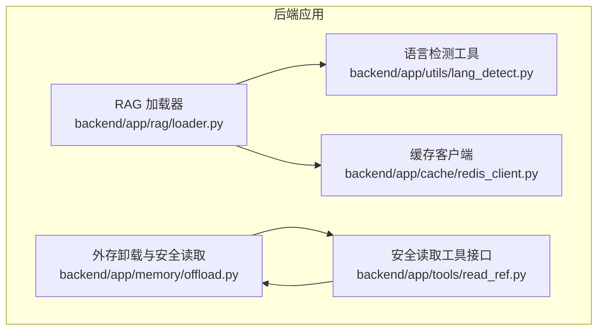
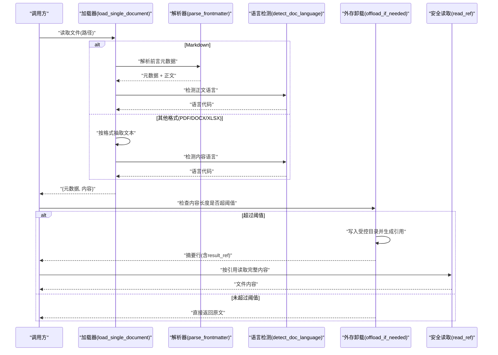
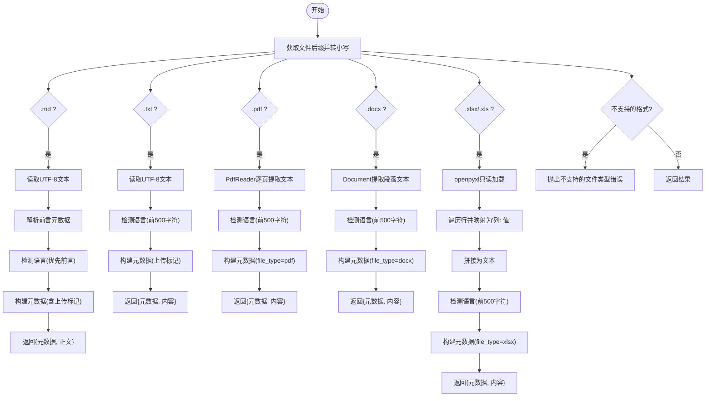
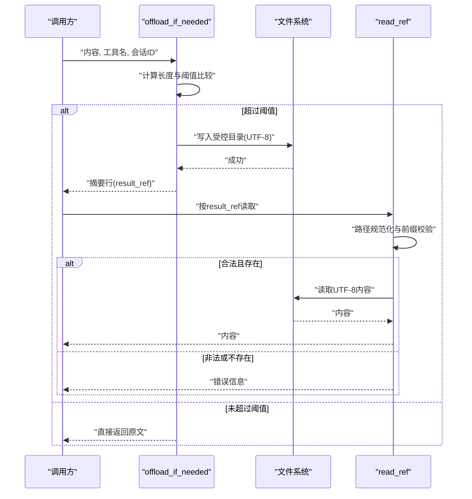
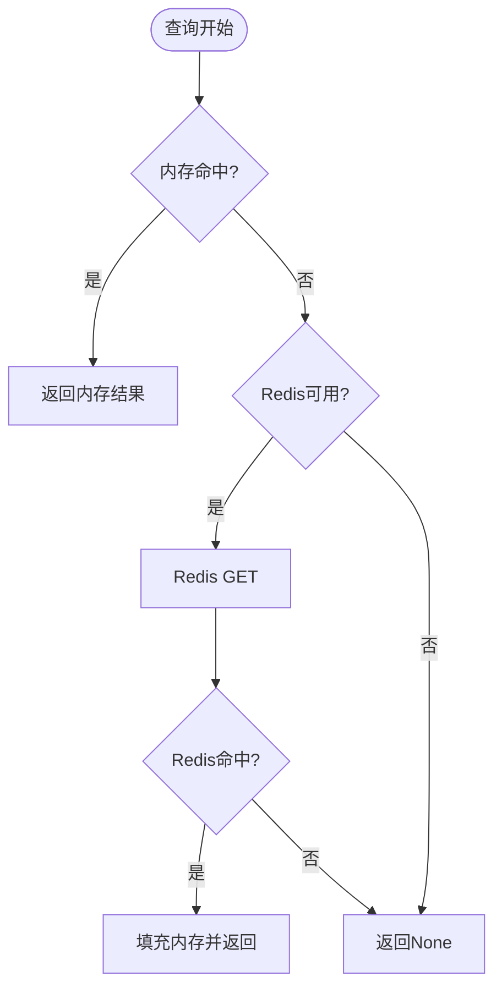
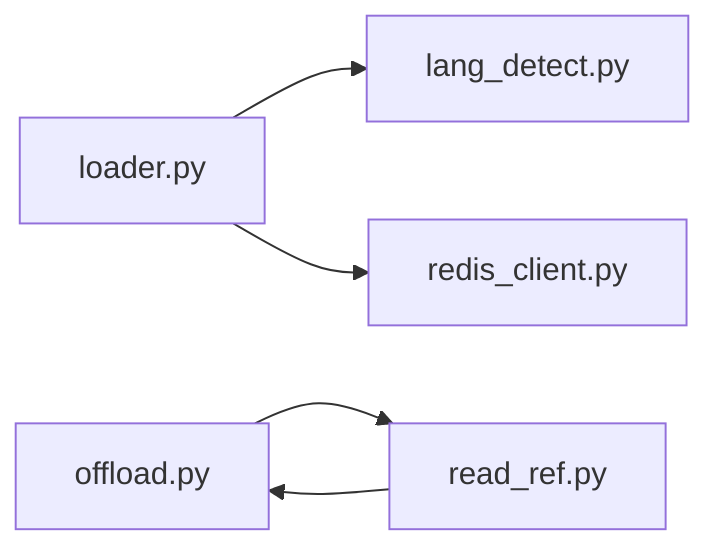

# 文件读取工具

<cite>
**本文档引用的文件**
- [backend/app/rag/loader.py](file://backend/app/rag/loader.py)
- [backend/app/tools/read_ref.py](file://backend/app/tools/read_ref.py)
- [backend/app/memory/offload.py](file://backend/app/memory/offload.py)
- [backend/tests/test_memory_extended.py](file://backend/tests/test_memory_extended.py)
- [backend/app/cache/redis_client.py](file://backend/app/cache/redis_client.py)
- [backend/app/utils/lang_detect.py](file://backend/app/utils/lang_detect.py)
</cite>

## 目录
1. [简介](#简介)
2. [项目结构](#项目结构)
3. [核心组件](#核心组件)
4. [架构总览](#架构总览)
5. [详细组件分析](#详细组件分析)
6. [依赖关系分析](#依赖关系分析)
7. [性能考量](#性能考量)
8. [故障排查指南](#故障排查指南)
9. [结论](#结论)
10. [附录](#附录)

## 简介
本文件读取工具旨在为知识库与检索增强生成（RAG）系统提供统一的多格式文件读取能力，覆盖文本、Markdown、PDF、Word 文档与电子表格等常见格式，并在保证安全性的同时提供内容解析、语言检测与元数据提取。工具同时内置外存卸载与安全读取机制，防止路径穿越与越权访问；并结合内存与 Redis 的两级缓存以提升查询性能。

## 项目结构
围绕文件读取的核心代码主要分布在以下模块：
- 后端 RAG 加载器：负责单文件加载与目录批量加载，解析 Markdown 前言元数据，识别语言，以及对 PDF、DOCX、Excel 的内容抽取。
- 外存卸载与安全读取：将超长内容写入受控目录，提供带路径校验的安全读取接口。
- 缓存层：提供内存与 Redis 双层缓存，用于加速重复查询。
- 工具函数：面向 LangChain 的工具接口，便于在工作流中调用安全读取能力。

图表来源
- [backend/app/rag/loader.py:1-224](file://backend/app/rag/loader.py#L1-L224)
- [backend/app/memory/offload.py:1-53](file://backend/app/memory/offload.py#L1-L53)
- [backend/app/tools/read_ref.py:1-28](file://backend/app/tools/read_ref.py#L1-L28)
- [backend/app/cache/redis_client.py:78-160](file://backend/app/cache/redis_client.py#L78-L160)
- [backend/app/utils/lang_detect.py](file://backend/app/utils/lang_detect.py)

章节来源
- [backend/app/rag/loader.py:1-224](file://backend/app/rag/loader.py#L1-L224)
- [backend/app/memory/offload.py:1-53](file://backend/app/memory/offload.py#L1-L53)
- [backend/app/tools/read_ref.py:1-28](file://backend/app/tools/read_ref.py#L1-L28)
- [backend/app/cache/redis_client.py:78-160](file://backend/app/cache/redis_client.py#L78-L160)

## 核心组件
- 单文件加载器：支持 .md、.txt、.pdf、.docx、.xlsx/.xls，返回标准化的元数据与内容。
- 目录批量加载器：遍历目录递归加载 Markdown 文件。
- 内容解析器：解析 Markdown 前言元数据，提取标题、标签、分类等信息。
- 语言检测器：优先使用前言语言，否则自动检测内容语言。
- 外存卸载器：根据阈值将长内容写入受控目录，返回引用标识。
- 安全读取器：通过路径规范化与前缀校验，阻断路径穿越攻击。
- 缓存客户端：内存 + Redis 双层缓存，自动降级与回填。

章节来源
- [backend/app/rag/loader.py:47-111](file://backend/app/rag/loader.py#L47-L111)
- [backend/app/rag/loader.py:196-224](file://backend/app/rag/loader.py#L196-L224)
- [backend/app/memory/offload.py:11-37](file://backend/app/memory/offload.py#L11-L37)
- [backend/app/tools/read_ref.py:7-27](file://backend/app/tools/read_ref.py#L7-L27)
- [backend/app/cache/redis_client.py:100-145](file://backend/app/cache/redis_client.py#L100-L145)

## 架构总览
下图展示从请求到响应的关键流程：文件加载、内容解析、语言检测、可选的外存卸载与安全读取，以及缓存命中与回填。

图表来源
- [backend/app/rag/loader.py:47-111](file://backend/app/rag/loader.py#L47-L111)
- [backend/app/rag/loader.py:14-21](file://backend/app/rag/loader.py#L14-L21)
- [backend/app/memory/offload.py:11-37](file://backend/app/memory/offload.py#L11-L37)
- [backend/app/tools/read_ref.py:7-27](file://backend/app/tools/read_ref.py#L7-L27)

## 详细组件分析

### 组件A：RAG 文件加载器
职责与特性
- 支持格式：.md、.txt、.pdf、.docx、.xlsx/.xls
- 解析策略：
  - Markdown：读取 UTF-8 文本，解析 YAML 前言元数据，提取标题、标签、分类、语言等。
  - 文本：直接读取 UTF-8 文本，自动检测语言。
  - PDF：逐页提取文本并拼接，自动检测语言。
  - DOCX：提取段落文本并拼接，自动检测语言。
  - Excel：按工作表读取行，将列头与值映射为“列: 值”形式，拼接为文本，自动检测语言。
- 输出结构：统一返回 {metadata, content}，其中 metadata 包含 source、title、slug、tags、category、filepath、language、uploaded 等字段。

图表来源
- [backend/app/rag/loader.py:47-111](file://backend/app/rag/loader.py#L47-L111)
- [backend/app/rag/loader.py:113-193](file://backend/app/rag/loader.py#L113-L193)
- [backend/app/rag/loader.py:196-224](file://backend/app/rag/loader.py#L196-L224)
- [backend/app/utils/lang_detect.py](file://backend/app/utils/lang_detect.py)

章节来源
- [backend/app/rag/loader.py:47-111](file://backend/app/rag/loader.py#L47-L111)
- [backend/app/rag/loader.py:113-193](file://backend/app/rag/loader.py#L113-L193)
- [backend/app/rag/loader.py:196-224](file://backend/app/rag/loader.py#L196-L224)

### 组件B：外存卸载与安全读取
职责与特性
- 外存卸载：
  - 当内容长度超过阈值时，写入受控目录 offloads/refs，文件名包含会话 ID、工具名与时间戳。
  - 返回摘要行，内含 result_ref 引用，便于后续安全读取。
- 安全读取：
  - 使用路径规范化与前缀校验，阻断路径穿越攻击。
  - 支持列出可用文件或读取指定文件，异常时返回错误信息。

图表来源
- [backend/app/memory/offload.py:11-37](file://backend/app/memory/offload.py#L11-L37)
- [backend/app/tools/read_ref.py:7-27](file://backend/app/tools/read_ref.py#L7-L27)

章节来源
- [backend/app/memory/offload.py:11-37](file://backend/app/memory/offload.py#L11-L37)
- [backend/app/tools/read_ref.py:7-27](file://backend/app/tools/read_ref.py#L7-L27)
- [backend/tests/test_memory_extended.py:211-237](file://backend/tests/test_memory_extended.py#L211-L237)

### 组件C：缓存客户端（内存 + Redis）
职责与特性
- 查询流程：
  - 优先内存命中；若未命中再尝试 Redis；失败则回退空值。
  - Redis 命中后同步填充内存，提升后续访问速度。
- 写入流程：
  - 总是写入内存；若 Redis 可用则写入 Redis，不可用时优雅降级。
- 连接与健康：
  - 自动连接与失败计数；连接异常时记录警告并继续运行。

图表来源
- [backend/app/cache/redis_client.py:100-145](file://backend/app/cache/redis_client.py#L100-L145)
- [backend/app/cache/redis_client.py:78-97](file://backend/app/cache/redis_client.py#L78-L97)

章节来源
- [backend/app/cache/redis_client.py:100-145](file://backend/app/cache/redis_client.py#L100-L145)
- [backend/app/cache/redis_client.py:78-97](file://backend/app/cache/redis_client.py#L78-L97)

### 组件D：语言检测工具
职责与特性
- 提供统一的语言检测入口，优先使用 Markdown 前言中声明的语言，否则自动检测内容前 500 字符的语言。

章节来源
- [backend/app/rag/loader.py:14-21](file://backend/app/rag/loader.py#L14-L21)
- [backend/app/utils/lang_detect.py](file://backend/app/utils/lang_detect.py)

## 依赖关系分析
- 加载器依赖语言检测工具进行内容语言识别。
- 加载器与缓存客户端解耦，可通过配置启用或禁用缓存。
- 外存卸载与安全读取相互配合，形成“写入受控目录 + 安全读取”的闭环。
- 安全读取工具与外存模块共享同一受控目录，确保一致性。

图表来源
- [backend/app/rag/loader.py:11-11](file://backend/app/rag/loader.py#L11-L11)
- [backend/app/cache/redis_client.py:84-90](file://backend/app/cache/redis_client.py#L84-L90)
- [backend/app/memory/offload.py:8](file://backend/app/memory/offload.py#L8)
- [backend/app/tools/read_ref.py:4](file://backend/app/tools/read_ref.py#L4)

章节来源
- [backend/app/rag/loader.py:11-11](file://backend/app/rag/loader.py#L11-L11)
- [backend/app/cache/redis_client.py:84-90](file://backend/app/cache/redis_client.py#L84-L90)
- [backend/app/memory/offload.py:8](file://backend/app/memory/offload.py#L8)
- [backend/app/tools/read_ref.py:4](file://backend/app/tools/read_ref.py#L4)

## 性能考量
- 缓存策略
  - 内存命中优先，减少磁盘与网络开销；Redis 命中后同步填充内存，提高后续命中率。
  - Redis 不可用时自动降级至纯内存缓存，保障服务连续性。
- I/O 优化
  - Excel 采用只读模式加载，避免不必要的写操作；按行映射为文本，减少中间结构体积。
  - PDF 与 DOCX 仅提取必要文本，避免加载富媒体内容。
- 大文件处理
  - 通过外存卸载将长内容持久化到受控目录，返回短摘要与引用，降低内存占用与传输成本。
- 并发与资源管理
  - 外存写入为单文件原子写，读取前进行路径规范化与存在性检查，避免并发冲突与越权访问。
  - 缓存客户端在连接失败时记录日志并重试，避免阻塞主流程。

[本节为通用性能建议，无需特定文件来源]

## 故障排查指南
- 不支持的文件类型
  - 现象：抛出“不支持的文件类型”错误。
  - 排查：确认文件扩展名是否在支持列表中；检查大小写与隐藏扩展名。
  - 参考路径：[backend/app/rag/loader.py:109-110](file://backend/app/rag/loader.py#L109-L110)
- 路径穿越与越权访问
  - 现象：安全读取返回“无效文件引用”或“文件未找到”。
  - 排查：确认引用路径位于受控目录；避免 ../ 等相对路径；检查文件是否存在。
  - 参考路径：[backend/app/tools/read_ref.py:19-21](file://backend/app/tools/read_ref.py#L19-L21)，[backend/app/memory/offload.py:42-45](file://backend/app/memory/offload.py#L42-L45)
- Redis 缓存不可用
  - 现象：缓存命中率为 0 或写入失败。
  - 排查：检查 Redis 连接参数与网络连通性；查看日志中的连接警告。
  - 参考路径：[backend/app/cache/redis_client.py:78-97](file://backend/app/cache/redis_client.py#L78-L97)
- 外存写入失败
  - 现象：外存卸载返回原文，日志出现写入失败。
  - 排查：检查受控目录权限与磁盘空间；确认编码为 UTF-8。
  - 参考路径：[backend/app/memory/offload.py:24-29](file://backend/app/memory/offload.py#L24-L29)

章节来源
- [backend/app/rag/loader.py:109-110](file://backend/app/rag/loader.py#L109-L110)
- [backend/app/tools/read_ref.py:19-21](file://backend/app/tools/read_ref.py#L19-L21)
- [backend/app/memory/offload.py:42-45](file://backend/app/memory/offload.py#L42-L45)
- [backend/app/cache/redis_client.py:78-97](file://backend/app/cache/redis_client.py#L78-L97)
- [backend/app/memory/offload.py:24-29](file://backend/app/memory/offload.py#L24-L29)

## 结论
该文件读取工具以“统一接口 + 多格式解析 + 安全控制 + 缓存加速”为核心设计，既满足多样化的文档读取需求，又通过路径校验与外存卸载保障系统安全与稳定性。结合内存与 Redis 的双层缓存，可在高并发场景下显著降低延迟与资源消耗。建议在生产环境中开启缓存与外存卸载，并严格限制受控目录权限，确保长期稳定运行。

[本节为总结性内容，无需特定文件来源]

## 附录

### 支持的文件格式与解析策略
- Markdown (.md)
  - 解析前言元数据，提取标题、标签、分类、语言等；正文作为内容返回。
  - 参考路径：[backend/app/rag/loader.py:59-75](file://backend/app/rag/loader.py#L59-L75)
- 文本 (.txt)
  - 直接读取 UTF-8 文本，自动检测语言。
  - 参考路径：[backend/app/rag/loader.py:76-89](file://backend/app/rag/loader.py#L76-L89)
- PDF (.pdf)
  - 使用 PdfReader 逐页提取文本并拼接，自动检测语言。
  - 参考路径：[backend/app/rag/loader.py:113-136](file://backend/app/rag/loader.py#L113-L136)
- Word (.docx)
  - 使用 Document 提取段落文本并拼接，自动检测语言。
  - 参考路径：[backend/app/rag/loader.py:139-158](file://backend/app/rag/loader.py#L139-L158)
- 电子表格 (.xlsx/.xls)
  - 使用 openpyxl 只读加载，按行映射为“列: 值”，拼接为文本，自动检测语言。
  - 参考路径：[backend/app/rag/loader.py:161-193](file://backend/app/rag/loader.py#L161-L193)

### 使用示例与最佳实践
- 读取单个文件
  - 调用加载器，传入绝对路径；根据返回的元数据与内容进行后续处理。
  - 参考路径：[backend/app/rag/loader.py:47-111](file://backend/app/rag/loader.py#L47-L111)
- 批量读取目录
  - 调用目录加载器，传入文章目录路径；遍历所有 Markdown 文件并返回列表。
  - 参考路径：[backend/app/rag/loader.py:196-224](file://backend/app/rag/loader.py#L196-L224)
- 大文件处理
  - 使用外存卸载接口，超过阈值的内容将被写入受控目录并返回引用；通过安全读取接口按引用读取完整内容。
  - 参考路径：[backend/app/memory/offload.py:11-37](file://backend/app/memory/offload.py#L11-L37)，[backend/app/tools/read_ref.py:7-27](file://backend/app/tools/read_ref.py#L7-L27)
- 编码与语言
  - 统一使用 UTF-8 读取；语言检测优先使用前言声明，否则自动检测。
  - 参考路径：[backend/app/rag/loader.py:14-21](file://backend/app/rag/loader.py#L14-L21)

### 错误处理与异常情况
- 不支持的文件类型：抛出错误，提示具体后缀。
  - 参考路径：[backend/app/rag/loader.py:109-110](file://backend/app/rag/loader.py#L109-L110)
- 路径穿越与文件不存在：安全读取返回错误信息。
  - 参考路径：[backend/app/tools/read_ref.py:19-23](file://backend/app/tools/read_ref.py#L19-L23)，[backend/app/memory/offload.py:42-47](file://backend/app/memory/offload.py#L42-L47)
- Redis 不可用：缓存读写降级为内存。
  - 参考路径：[backend/app/cache/redis_client.py:78-97](file://backend/app/cache/redis_client.py#L78-L97)，[backend/app/cache/redis_client.py:114-128](file://backend/app/cache/redis_client.py#L114-L128)