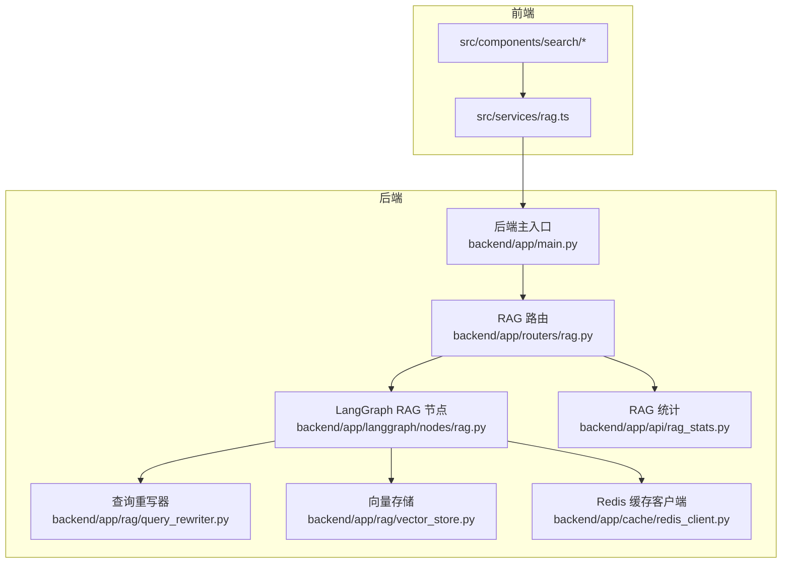
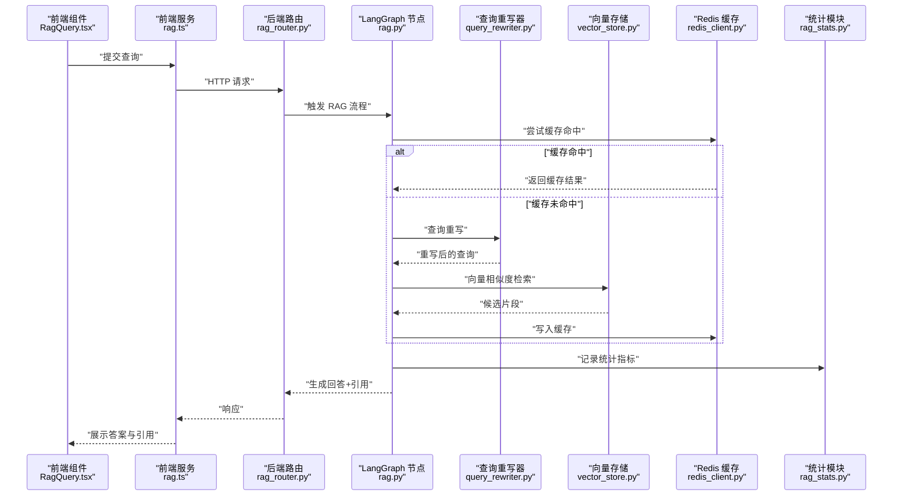
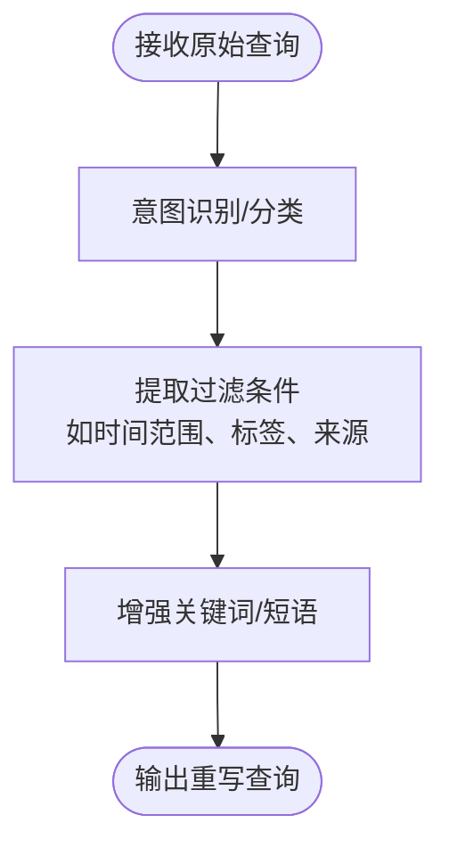
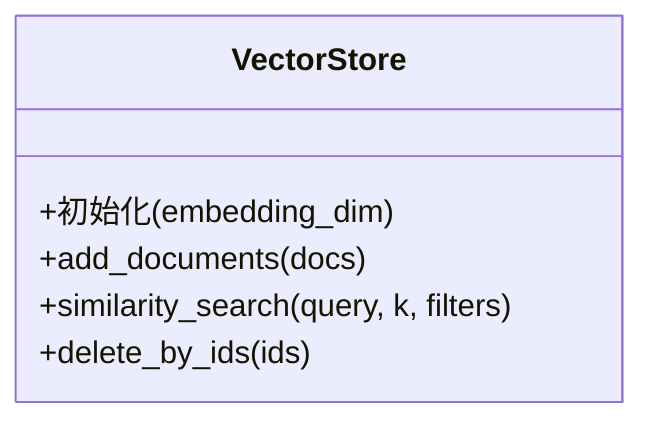
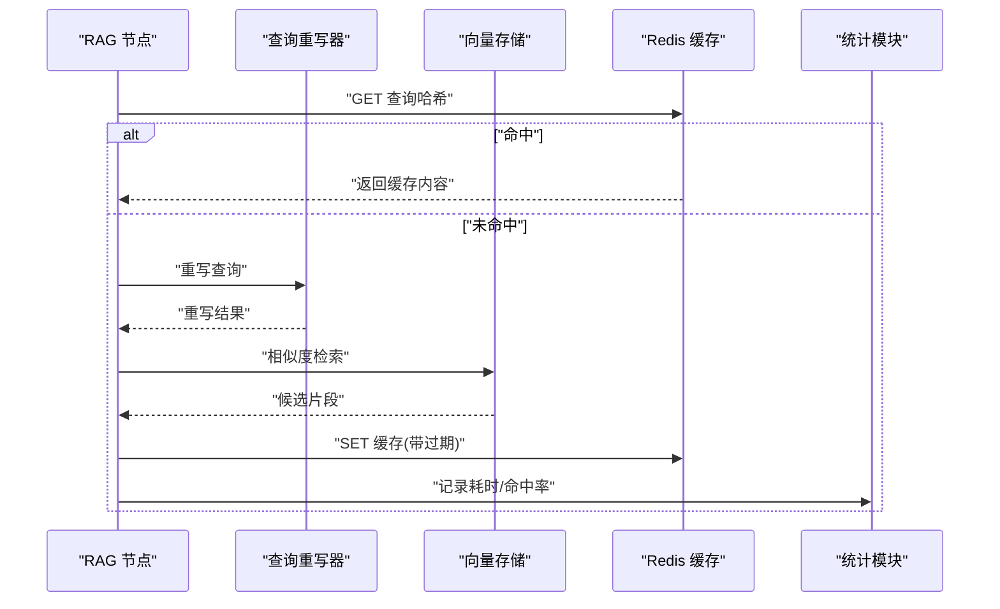
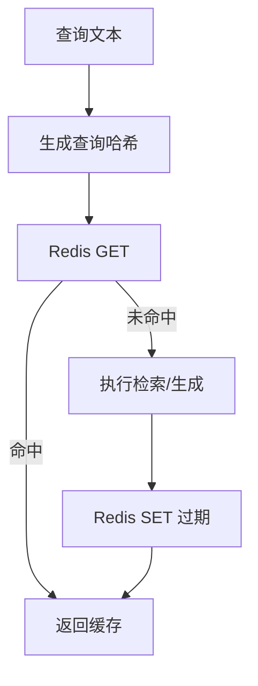
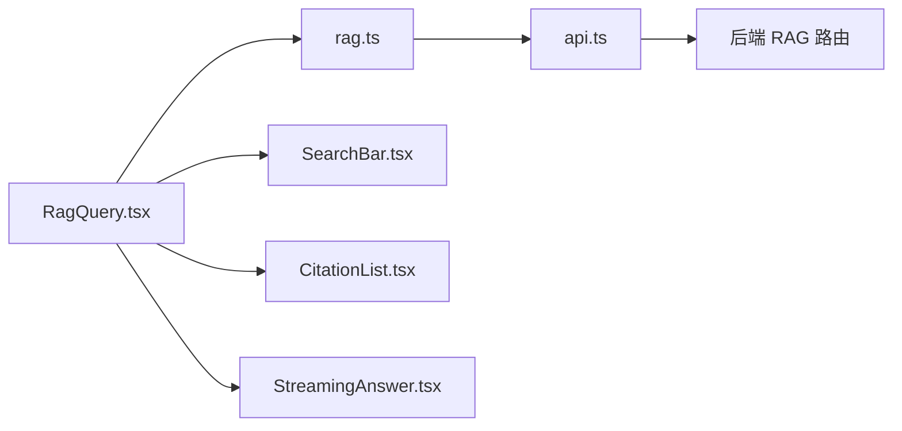
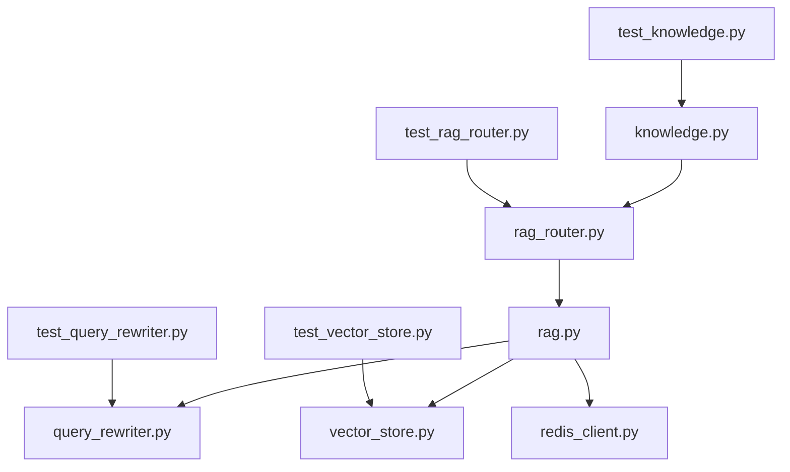

# 知识查询工具

<cite>
**本文引用的文件**
- [knowledge.py](file://backend/app/tools/knowledge.py)
- [vector_store.py](file://backend/app/rag/vector_store.py)
- [query_rewriter.py](file://backend/app/rag/query_rewriter.py)
- [rag.py](file://backend/app/langgraph/nodes/rag.py)
- [rag_router.py](file://backend/app/routers/rag.py)
- [redis_client.py](file://backend/app/cache/redis_client.py)
- [models.py](file://backend/app/api/models.py)
- [rag_stats.py](file://backend/app/api/rag_stats.py)
- [test_knowledge.py](file://backend/tests/test_knowledge.py)
- [test_vector_store.py](file://backend/tests/test_vector_store.py)
- [test_query_rewriter.py](file://backend/tests/test_query_rewriter.py)
- [test_rag_router.py](file://backend/tests/test_rag_router.py)
- [rag.ts](file://src/services/rag.ts)
- [RagQuery.tsx](file://src/components/search/RagQuery.tsx)
- [SearchBar.tsx](file://src/components/search/SearchBar.tsx)
- [CitationList.tsx](file://src/components/search/CitationList.tsx)
- [StreamingAnswer.tsx](file://src/components/search/StreamingAnswer.tsx)
- [api.ts](file://src/services/api.ts)
- [README.md](file://README.md)
- [USER_GUIDE.md](file://USER_GUIDE.md)
- [TECH_DESIGN.md](file://TECH_DESIGN.md)
- [rag-design.md](file://docs/rag-design.md)
- [rag-eval-report-2026-06-05-1759.md](file://docs/rag-evaluation/reports/rag-eval-report-2026-06-05-1759.md)
</cite>

## 目录
1. [简介](#简介)
2. [项目结构](#项目结构)
3. [核心组件](#核心组件)
4. [架构总览](#架构总览)
5. [详细组件分析](#详细组件分析)
6. [依赖关系分析](#依赖关系分析)
7. [性能考虑](#性能考虑)
8. [故障排查指南](#故障排查指南)
9. [结论](#结论)
10. [附录](#附录)

## 简介
本文件面向“知识查询工具”的开发者与使用者，系统性阐述其架构设计与实现原理，覆盖知识库查询、语义匹配与结果排序机制；详解查询接口参数规范、查询语法与过滤条件；解析检索算法（关键词匹配、语义相似度计算、相关性评分）；提供查询示例与高级技巧（复合查询、模糊/精确匹配）；说明性能优化策略（索引利用、缓存机制）以及结果格式化、去重与排序的实现细节。

## 项目结构
后端采用 Python/FastAPI 架构，前端采用 React/Vite。核心查询链路由 RAG 节点与查询重写器组成，向量存储负责嵌入与相似度检索，缓存通过 Redis 提升命中率，统计与评测模块用于质量评估与监控。

图示来源
- [rag_router.py](file://backend/app/routers/rag.py)
- [rag.py](file://backend/app/langgraph/nodes/rag.py)
- [query_rewriter.py](file://backend/app/rag/query_rewriter.py)
- [vector_store.py](file://backend/app/rag/vector_store.py)
- [redis_client.py](file://backend/app/cache/redis_client.py)
- [rag_stats.py](file://backend/app/api/rag_stats.py)

章节来源
- [README.md](file://README.md)
- [USER_GUIDE.md](file://USER_GUIDE.md)
- [TECH_DESIGN.md](file://TECH_DESIGN.md)

## 核心组件
- 查询重写器：对用户输入进行意图识别与改写，提升检索质量。
- 向量存储：管理嵌入维度、相似度计算与候选集生成。
- LangGraph RAG 节点：串联检索、生成与后处理流程。
- 缓存：基于 Redis 的键值缓存，加速重复查询。
- 前端服务与组件：封装查询 API、渲染答案与引用列表、支持流式输出。

章节来源
- [query_rewriter.py](file://backend/app/rag/query_rewriter.py)
- [vector_store.py](file://backend/app/rag/vector_store.py)
- [rag.py](file://backend/app/langgraph/nodes/rag.py)
- [redis_client.py](file://backend/app/cache/redis_client.py)
- [rag.ts](file://src/services/rag.ts)

## 架构总览
整体查询链路从前端发起请求，经后端路由进入 LangGraph RAG 节点，节点内部调用查询重写器与向量存储，结合缓存与统计模块完成最终回答与引用返回。

图示来源
- [rag_router.py](file://backend/app/routers/rag.py)
- [rag.py](file://backend/app/langgraph/nodes/rag.py)
- [query_rewriter.py](file://backend/app/rag/query_rewriter.py)
- [vector_store.py](file://backend/app/rag/vector_store.py)
- [redis_client.py](file://backend/app/cache/redis_client.py)
- [rag_stats.py](file://backend/app/api/rag_stats.py)
- [rag.ts](file://src/services/rag.ts)
- [RagQuery.tsx](file://src/components/search/RagQuery.tsx)

## 详细组件分析

### 查询重写器（Query Rewriter）
职责：将用户自然语言查询转换为更利于向量检索的形式，可能包含意图分类、实体抽取、过滤条件注入等。

图示来源
- [query_rewriter.py](file://backend/app/rag/query_rewriter.py)

章节来源
- [query_rewriter.py](file://backend/app/rag/query_rewriter.py)
- [test_query_rewriter.py](file://backend/tests/test_query_rewriter.py)

### 向量存储（Vector Store）
职责：维护嵌入向量、执行相似度检索、返回候选片段及其元数据。

图示来源
- [vector_store.py](file://backend/app/rag/vector_store.py)

章节来源
- [vector_store.py](file://backend/app/rag/vector_store.py)
- [test_vector_store.py](file://backend/tests/test_vector_store.py)

### LangGraph RAG 节点
职责：编排检索与生成流程，集成缓存与统计。

图示来源
- [rag.py](file://backend/app/langgraph/nodes/rag.py)
- [query_rewriter.py](file://backend/app/rag/query_rewriter.py)
- [vector_store.py](file://backend/app/rag/vector_store.py)
- [redis_client.py](file://backend/app/cache/redis_client.py)
- [rag_stats.py](file://backend/app/api/rag_stats.py)

章节来源
- [rag.py](file://backend/app/langgraph/nodes/rag.py)

### 缓存（Redis）
职责：以查询文本哈希为键缓存检索候选与回答，降低重复查询延迟。

图示来源
- [redis_client.py](file://backend/app/cache/redis_client.py)
- [rag.py](file://backend/app/langgraph/nodes/rag.py)

章节来源
- [redis_client.py](file://backend/app/cache/redis_client.py)
- [rag.py](file://backend/app/langgraph/nodes/rag.py)

### 前端服务与组件
职责：封装查询 API、渲染答案与引用、支持流式输出。

图示来源
- [RagQuery.tsx](file://src/components/search/RagQuery.tsx)
- [rag.ts](file://src/services/rag.ts)
- [api.ts](file://src/services/api.ts)
- [SearchBar.tsx](file://src/components/search/SearchBar.tsx)
- [CitationList.tsx](file://src/components/search/CitationList.tsx)
- [StreamingAnswer.tsx](file://src/components/search/StreamingAnswer.tsx)

章节来源
- [rag.ts](file://src/services/rag.ts)
- [api.ts](file://src/services/api.ts)
- [RagQuery.tsx](file://src/components/search/RagQuery.tsx)
- [SearchBar.tsx](file://src/components/search/SearchBar.tsx)
- [CitationList.tsx](file://src/components/search/CitationList.tsx)
- [StreamingAnswer.tsx](file://src/components/search/StreamingAnswer.tsx)

## 依赖关系分析
- 后端依赖：FastAPI、LangGraph、向量数据库/嵌入模型、Redis。
- 前端依赖：React、自研服务层、UI 组件库。
- 测试覆盖：知识查询、向量存储、查询重写、RAG 路由等模块。

图示来源
- [test_knowledge.py](file://backend/tests/test_knowledge.py)
- [test_vector_store.py](file://backend/tests/test_vector_store.py)
- [test_query_rewriter.py](file://backend/tests/test_query_rewriter.py)
- [test_rag_router.py](file://backend/tests/test_rag_router.py)
- [knowledge.py](file://backend/app/tools/knowledge.py)
- [vector_store.py](file://backend/app/rag/vector_store.py)
- [query_rewriter.py](file://backend/app/rag/query_rewriter.py)
- [rag_router.py](file://backend/app/routers/rag.py)
- [rag.py](file://backend/app/langgraph/nodes/rag.py)
- [redis_client.py](file://backend/app/cache/redis_client.py)

章节来源
- [test_knowledge.py](file://backend/tests/test_knowledge.py)
- [test_vector_store.py](file://backend/tests/test_vector_store.py)
- [test_query_rewriter.py](file://backend/tests/test_query_rewriter.py)
- [test_rag_router.py](file://backend/tests/test_rag_router.py)

## 性能考虑
- 索引与向量化：选择合适的嵌入维度与相似度度量，控制候选数量 k，避免过度召回导致延迟上升。
- 缓存策略：对高频查询进行缓存，设置合理过期时间；对敏感或时效性强内容可禁用缓存或缩短过期。
- 并发与限流：在路由层实施请求限流与超时控制，防止突发流量击垮检索链路。
- 流式输出：前端支持流式渲染，改善感知延迟。
- 检索前置过滤：通过查询重写器注入过滤条件，缩小向量空间，提高命中率与速度。
- 统计与监控：记录检索耗时、命中率、错误率，持续优化阈值与参数。

## 故障排查指南
- 查询无结果
  - 检查向量存储是否已加载文档；确认嵌入模型可用且维度一致。
  - 排查查询重写是否异常，必要时回退到原始查询。
  - 查看缓存是否污染（脏读），可临时禁用缓存验证。
- 结果质量差
  - 调整相似度阈值与候选数 k；优化查询重写规则。
  - 检查过滤条件是否过于严格导致召回不足。
- 前端显示异常
  - 确认服务层 API 返回结构与前端消费一致；检查流式分片拼接逻辑。
  - 校验引用列表渲染组件是否正确映射后端返回字段。
- 性能抖动
  - 观察缓存命中率与过期策略；检查向量检索耗时分布。
  - 审视并发峰值下的限流与降级策略。

章节来源
- [vector_store.py](file://backend/app/rag/vector_store.py)
- [query_rewriter.py](file://backend/app/rag/query_rewriter.py)
- [rag.py](file://backend/app/langgraph/nodes/rag.py)
- [redis_client.py](file://backend/app/cache/redis_client.py)
- [rag.ts](file://src/services/rag.ts)
- [RagQuery.tsx](file://src/components/search/RagQuery.tsx)

## 结论
该知识查询工具通过“查询重写 + 向量检索 + 缓存 + 统计”的组合，实现了高效、可扩展的知识检索能力。前端以流式渲染优化用户体验，后端以 LangGraph 实现可观察、可扩展的 RAG 工作流。建议持续关注检索阈值、缓存策略与并发治理，并结合评测报告迭代优化。

## 附录

### 查询接口与参数规范
- 接口路径：由后端路由定义（参考后端路由文件）。
- 请求体字段（示意）：
  - query：字符串，必填
  - filters：对象，可选（如时间范围、标签、来源）
  - k：整数，可选（候选数量）
  - stream：布尔，可选（是否流式返回）
  - enable_cache：布尔，可选（是否启用缓存）
- 响应字段（示意）：
  - answer：字符串
  - citations：数组（包含片段、来源、得分等）
  - stats：对象（耗时、命中率、候选数等）

章节来源
- [rag_router.py](file://backend/app/routers/rag.py)
- [models.py](file://backend/app/api/models.py)
- [rag.ts](file://src/services/rag.ts)

### 查询语法与过滤条件
- 语法要点：
  - 关键词：直接匹配文档中的词项
  - 语义：通过嵌入相似度匹配
  - 复合查询：支持 AND/OR/NOT 组合（由查询重写器解析）
  - 模糊匹配：通过嵌入近似检索实现
  - 精确匹配：可通过过滤条件限定来源/标签/时间
- 过滤条件（示意）：
  - 时间范围：created_at_start / created_at_end
  - 来源：source_in / source_not_in
  - 标签：tags_contains / tags_all
  - 文档 ID：doc_ids_in

章节来源
- [query_rewriter.py](file://backend/app/rag/query_rewriter.py)
- [vector_store.py](file://backend/app/rag/vector_store.py)
- [models.py](file://backend/app/api/models.py)

### 检索算法与相关性评分
- 关键词匹配：基于倒排索引或全文索引的词项匹配（若存在）
- 语义相似度：余弦相似度或内积，基于嵌入向量
- 相关性评分：综合相似度、过滤权重、时间衰减因子
- 排序规则：按相关性降序，其次按更新时间/权威度等二次排序

章节来源
- [vector_store.py](file://backend/app/rag/vector_store.py)
- [rag.py](file://backend/app/langgraph/nodes/rag.py)

### 查询示例与高级技巧
- 示例
  - “如何部署 RAG 应用？”
  - “嵌入模型对比与选择”
  - “2026 年 6 月新增功能”
- 高级技巧
  - 复合查询：在查询中使用 AND/OR/NOT 组合不同主题
  - 模糊匹配：适当放宽相似度阈值，扩大候选集
  - 精确匹配：通过 filters 锁定特定来源或标签
  - 流式输出：开启 stream 参数获得实时反馈

章节来源
- [USER_GUIDE.md](file://USER_GUIDE.md)
- [rag.ts](file://src/services/rag.ts)
- [RagQuery.tsx](file://src/components/search/RagQuery.tsx)

### 结果格式化、去重与排序
- 格式化：统一引用字段（标题、链接、片段、来源），保证前端渲染一致性
- 去重：按文档 ID 或片段指纹去重，避免重复引用
- 排序：以相关性为主，时间/权威度为辅

章节来源
- [CitationList.tsx](file://src/components/search/CitationList.tsx)
- [StreamingAnswer.tsx](file://src/components/search/StreamingAnswer.tsx)
- [rag.py](file://backend/app/langgraph/nodes/rag.py)

### 评测与质量报告
- 参考评测报告与设计文档，持续评估召回率、准确率与用户体验指标。

章节来源
- [rag-eval-report-2026-06-05-1759.md](file://docs/rag-evaluation/reports/rag-eval-report-2026-06-05-1759.md)
- [rag-design.md](file://docs/rag-design.md)