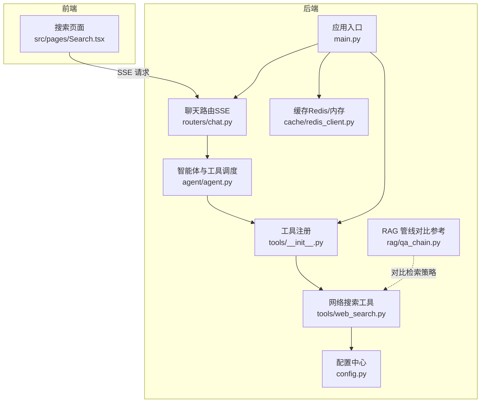
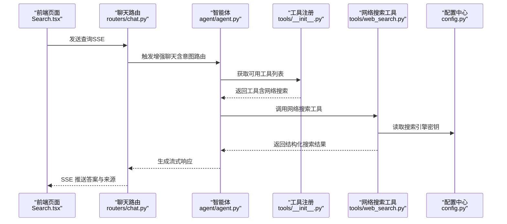
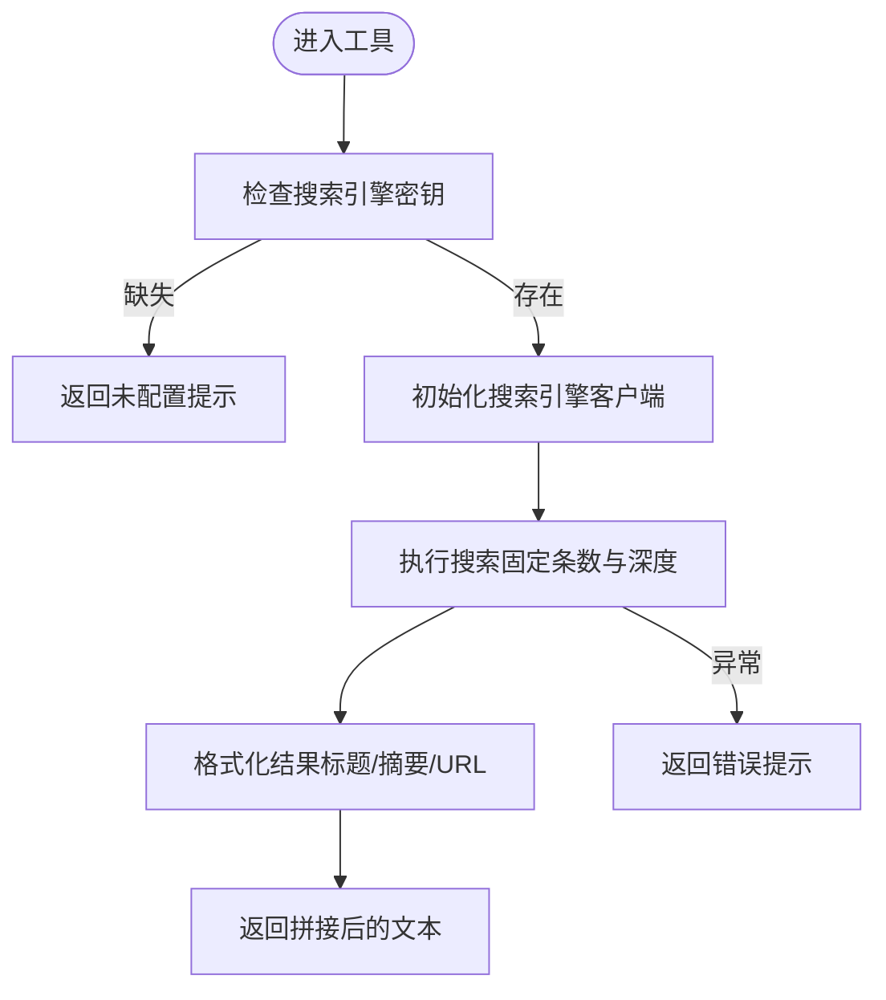
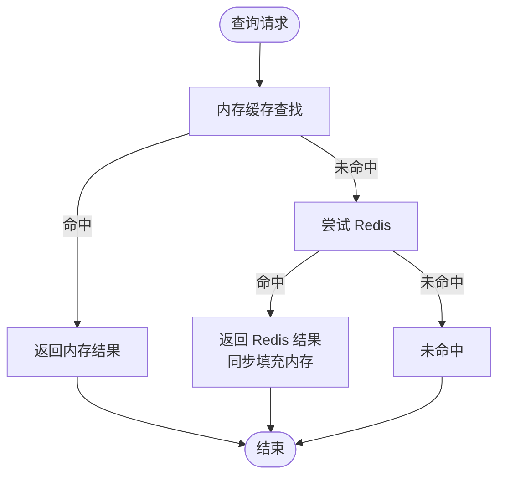
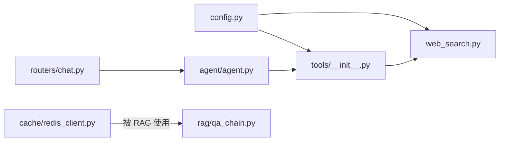

# 网络搜索工具

<cite>
**本文引用的文件**
- [web_search.py](file://backend/app/tools/web_search.py)
- [__init__.py](file://backend/app/tools/__init__.py)
- [config.py](file://backend/app/config.py)
- [main.py](file://backend/app/main.py)
- [agent.py](file://backend/app/agent/agent.py)
- [chat.py](file://backend/app/routers/chat.py)
- [redis_client.py](file://backend/app/cache/redis_client.py)
- [qa_chain.py](file://backend/app/rag/qa_chain.py)
- [Search.tsx](file://src/pages/Search.tsx)
</cite>

## 目录
1. [简介](#简介)
2. [项目结构](#项目结构)
3. [核心组件](#核心组件)
4. [架构总览](#架构总览)
5. [详细组件分析](#详细组件分析)
6. [依赖分析](#依赖分析)
7. [性能考量](#性能考量)
8. [故障排查指南](#故障排查指南)
9. [结论](#结论)
10. [附录](#附录)

## 简介
本文件为“网络搜索工具”的开发与使用文档，聚焦于基于外部搜索引擎的实时信息检索能力。文档涵盖以下方面：
- 搜索引擎集成与请求处理流程
- 支持的搜索参数、API 配置与认证方式
- 结果获取、清洗与格式化处理
- 最佳实践与高级搜索技巧
- 性能优化策略、缓存与错误重试
- 安全与使用限制、与外部搜索引擎的集成注意事项

## 项目结构
网络搜索工具位于后端 Python 应用中，通过 LangChain 工具接口注册，并在智能体工作流中按需调用。前端通过 SSE 流式展示搜索结果。

图表来源
- [main.py:1-371](file://backend/app/main.py#L1-L371)
- [__init__.py:1-23](file://backend/app/tools/__init__.py#L1-L23)
- [web_search.py:1-25](file://backend/app/tools/web_search.py#L1-L25)
- [config.py:1-90](file://backend/app/config.py#L1-L90)
- [agent.py:1-71](file://backend/app/agent/agent.py#L1-L71)
- [chat.py:1-107](file://backend/app/routers/chat.py#L1-L107)
- [redis_client.py:1-161](file://backend/app/cache/redis_client.py#L1-L161)
- [qa_chain.py:1-800](file://backend/app/rag/qa_chain.py#L1-L800)
- [Search.tsx:1-36](file://src/pages/Search.tsx#L1-L36)

章节来源
- [main.py:1-371](file://backend/app/main.py#L1-L371)
- [__init__.py:1-23](file://backend/app/tools/__init__.py#L1-L23)
- [web_search.py:1-25](file://backend/app/tools/web_search.py#L1-L25)
- [config.py:1-90](file://backend/app/config.py#L1-L90)
- [agent.py:1-71](file://backend/app/agent/agent.py#L1-L71)
- [chat.py:1-107](file://backend/app/routers/chat.py#L1-L107)
- [redis_client.py:1-161](file://backend/app/cache/redis_client.py#L1-L161)
- [qa_chain.py:1-800](file://backend/app/rag/qa_chain.py#L1-L800)
- [Search.tsx:1-36](file://src/pages/Search.tsx#L1-L36)

## 核心组件
- 网络搜索工具
  - 通过装饰器注册为 LangChain 工具，调用外部搜索引擎客户端发起搜索请求，返回结构化结果文本。
- 工具注册与条件加载
  - 根据配置决定是否注册网络搜索工具；同时根据索引存在情况动态注册知识检索工具。
- 配置与认证
  - 通过统一配置类读取环境变量，其中包含搜索引擎 API 密钥字段。
- 智能体与路由
  - 智能体系统根据用户输入与工具规则选择调用网络搜索工具；聊天路由提供 SSE 流式响应。
- 缓存与降级
  - 缓存模块支持 Redis 与内存双栈，具备优雅降级与重连控制。

章节来源
- [web_search.py:6-25](file://backend/app/tools/web_search.py#L6-L25)
- [__init__.py:7-23](file://backend/app/tools/__init__.py#L7-L23)
- [config.py:35](file://backend/app/config.py#L35)
- [agent.py:51-71](file://backend/app/agent/agent.py#L51-L71)
- [chat.py:46-93](file://backend/app/routers/chat.py#L46-L93)
- [redis_client.py:67-97](file://backend/app/cache/redis_client.py#L67-L97)

## 架构总览
网络搜索工具在整体系统中的位置如下：

图表来源
- [Search.tsx:28-36](file://src/pages/Search.tsx#L28-L36)
- [chat.py:66-93](file://backend/app/routers/chat.py#L66-L93)
- [agent.py:51-71](file://backend/app/agent/agent.py#L51-L71)
- [__init__.py:7-23](file://backend/app/tools/__init__.py#L7-L23)
- [web_search.py:6-25](file://backend/app/tools/web_search.py#L6-L25)
- [config.py:35](file://backend/app/config.py#L35)

## 详细组件分析

### 组件：网络搜索工具（web_search）
- 功能职责
  - 将用户查询传递给外部搜索引擎客户端，返回前若干条结果摘要与链接。
- 关键行为
  - 参数与限制：固定返回条数与搜索深度；对结果进行截断与格式化。
  - 错误处理：捕获异常并返回可读提示；若未配置密钥则直接提示。
- 数据结构与复杂度
  - 输入：字符串查询。
  - 输出：多行文本，每条包含标题、摘要片段与 URL。
  - 时间复杂度：受外部 API 延迟主导，本地处理为 O(n)（n 为结果条数）。
- 与配置的关系
  - 依赖配置类中的搜索引擎密钥字段；未配置时拒绝执行。

图表来源
- [web_search.py:6-25](file://backend/app/tools/web_search.py#L6-L25)
- [config.py:35](file://backend/app/config.py#L35)

章节来源
- [web_search.py:6-25](file://backend/app/tools/web_search.py#L6-L25)
- [config.py:35](file://backend/app/config.py#L35)

### 组件：工具注册与条件加载（tools/__init__.py）
- 动态注册策略
  - 条件注册知识检索工具：仅当向量索引存在时。
  - 条件注册网络搜索工具：仅当搜索引擎密钥存在时。
- 影响范围
  - 控制智能体可用工具集合，避免在不可用时暴露无效工具。

章节来源
- [__init__.py:7-23](file://backend/app/tools/__init__.py#L7-L23)

### 组件：配置与认证（config.py）
- 配置项
  - 包含搜索引擎 API 密钥字段，用于网络搜索工具鉴权。
- 加载机制
  - 从环境文件加载，支持默认值与类型约束。

章节来源
- [config.py:35](file://backend/app/config.py#L35)

### 组件：智能体与工具调度（agent/agent.py）
- 规则与调用
  - 明确在实时信息场景下优先调用网络搜索工具。
- 语言与提示
  - 根据语言注入系统提示，确保工具调用遵循规则。

章节来源
- [agent.py:51-71](file://backend/app/agent/agent.py#L51-L71)

### 组件：聊天路由与流式输出（routers/chat.py）
- 增强聊天流
  - 提供带 RAG 集成的流式响应，便于前端逐步渲染答案与引用。
- SSE 头部与错误处理
  - 设置必要的缓存与连接头部；异常时返回结构化错误。

章节来源
- [chat.py:66-93](file://backend/app/routers/chat.py#L66-L93)

### 组件：缓存与降级（cache/redis_client.py）
- 缓存策略
  - 先查内存缓存，再查 Redis；命中后互相同步填充。
  - Redis 不可用时降级为内存缓存，维持服务连续性。
- 连接与重连
  - 延迟初始化与失败计数，支持在部署后补配 Redis 地址时自动重连。
- TTL 与容量控制
  - 内存缓存设置 TTL 与最大容量，定期清理过期与最旧条目。

图表来源
- [redis_client.py:106-144](file://backend/app/cache/redis_client.py#L106-L144)

章节来源
- [redis_client.py:67-97](file://backend/app/cache/redis_client.py#L67-L97)
- [redis_client.py:106-144](file://backend/app/cache/redis_client.py#L106-L144)

### 组件：RAG 管线（对比参考）
- 对比意义
  - RAG 管线展示了更复杂的检索融合、重排序与质量评估流程，可作为网络搜索工具在“知识库内检索”场景下的参考实现。
- 关键流程
  - 检索（关键字 + 向量）、RRF 融合、多样性选择、重排序与质量评估、答案生成与引用构建。

章节来源
- [qa_chain.py:155-298](file://backend/app/rag/qa_chain.py#L155-L298)
- [qa_chain.py:582-650](file://backend/app/rag/qa_chain.py#L582-L650)

## 依赖分析
- 组件耦合
  - 网络搜索工具依赖配置类读取密钥；工具注册模块依赖配置与索引状态；智能体依赖工具注册；聊天路由依赖智能体；缓存模块独立但被 RAG 管线复用。
- 外部依赖
  - 第三方搜索引擎客户端；Redis 异步客户端；FastAPI 路由与中间件。
- 潜在循环依赖
  - 未发现直接循环；工具注册与配置之间为单向依赖。

图表来源
- [config.py:35](file://backend/app/config.py#L35)
- [web_search.py:2](file://backend/app/tools/web_search.py#L2)
- [__init__.py:5](file://backend/app/tools/__init__.py#L5)
- [agent.py:1](file://backend/app/agent/agent.py#L1)
- [chat.py:18](file://backend/app/routers/chat.py#L18)
- [redis_client.py:84](file://backend/app/cache/redis_client.py#L84)
- [qa_chain.py:11](file://backend/app/rag/qa_chain.py#L11)

章节来源
- [config.py:35](file://backend/app/config.py#L35)
- [web_search.py:2](file://backend/app/tools/web_search.py#L2)
- [__init__.py:5](file://backend/app/tools/__init__.py#L5)
- [agent.py:1](file://backend/app/agent/agent.py#L1)
- [chat.py:18](file://backend/app/routers/chat.py#L18)
- [redis_client.py:84](file://backend/app/cache/redis_client.py#L84)
- [qa_chain.py:11](file://backend/app/rag/qa_chain.py#L11)

## 性能考量
- 搜索延迟
  - 外部搜索引擎请求为主，本地处理开销极小；建议在前端实现查询长度限制与去抖动。
- 结果截断与格式化
  - 对摘要进行截断与分行格式化，降低前端渲染压力。
- 缓存策略
  - 内存缓存优先、Redis 降级；合理 TTL 与容量上限，避免内存膨胀。
- 并发与限流
  - 应用层具备速率限制中间件与指标暴露，建议结合前端并发控制与后端限流策略。
- 重试与降级
  - 缓存模块具备失败计数与重连阈值；网络搜索工具捕获异常并快速失败，避免阻塞主流程。

章节来源
- [web_search.py:14-24](file://backend/app/tools/web_search.py#L14-L24)
- [redis_client.py:67-97](file://backend/app/cache/redis_client.py#L67-L97)
- [main.py:65-81](file://backend/app/main.py#L65-L81)

## 故障排查指南
- 未配置搜索引擎密钥
  - 现象：工具直接返回未配置提示。
  - 处理：在环境文件中设置相应密钥字段并重启服务。
- 外部搜索异常
  - 现象：工具返回错误提示。
  - 处理：检查网络连通性、密钥有效性与配额；观察日志定位异常。
- 缓存不可用
  - 现象：缓存读写失败或降级为内存缓存。
  - 处理：确认 Redis 地址与可达性；等待自动重连或手动修复后恢复。
- 前端流式渲染异常
  - 现象：SSE 断流或无响应。
  - 处理：检查路由路径、CORS 配置与浏览器网络面板；确保后端中间件与异常处理器正常。

章节来源
- [web_search.py:11-12](file://backend/app/tools/web_search.py#L11-L12)
- [web_search.py:23-24](file://backend/app/tools/web_search.py#L23-L24)
- [redis_client.py:93-96](file://backend/app/cache/redis_client.py#L93-L96)
- [chat.py:100-124](file://backend/app/routers/chat.py#L100-L124)

## 结论
网络搜索工具通过简单可靠的集成模式，为系统提供了实时信息检索能力。其设计强调：
- 明确的工具注册与条件加载，确保运行时可用性；
- 清晰的配置与认证模型，便于运维管理；
- 与智能体与路由的解耦协作，支持流式输出；
- 缓存与降级策略保障稳定性与性能。

## 附录

### 搜索参数与配置清单
- 搜索参数（工具内部固定）
  - 返回条数：固定数量
  - 搜索深度：基础级别
- 认证与配置
  - 搜索引擎 API 密钥：用于鉴权
  - CORS 与速率限制：由应用中间件与限流器控制
- 前端输入限制
  - 建议在前端限制查询长度，避免过长请求影响性能与成本

章节来源
- [web_search.py:16](file://backend/app/tools/web_search.py#L16)
- [config.py:35](file://backend/app/config.py#L35)
- [main.py:73-78](file://backend/app/main.py#L73-L78)
- [main.py:65-71](file://backend/app/main.py#L65-L71)
- [Search.tsx:8](file://src/pages/Search.tsx#L8)

### 最佳实践与高级技巧
- 查询优化
  - 使用具体关键词组合，减少歧义；必要时拆分为多个短查询。
- 结果利用
  - 将返回的标题与 URL 作为引用来源，提升可信度与溯源能力。
- 流式体验
  - 前端按事件逐步渲染，配合加载指示与错误提示，改善交互体验。
- 成本与配额
  - 合理设置返回条数与查询频率，避免超额使用。

### 安全与使用限制
- 认证与密钥管理
  - 密钥应妥善保管，避免硬编码与泄露；建议使用环境变量与密钥管理服务。
- CORS 与中间件
  - 中间件已设置安全响应头与跨域策略，确保前端访问安全可控。
- 错误与可观测性
  - 异常处理器返回结构化错误；应用暴露指标端点，便于监控与告警。

章节来源
- [main.py:100-124](file://backend/app/main.py#L100-L124)
- [main.py:88-97](file://backend/app/main.py#L88-L97)
- [main.py:80](file://backend/app/main.py#L80)