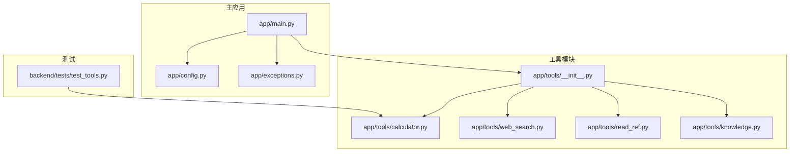
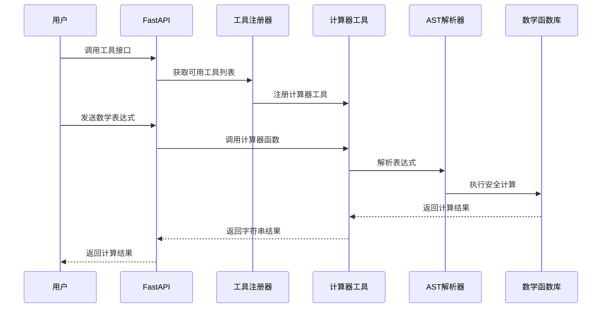
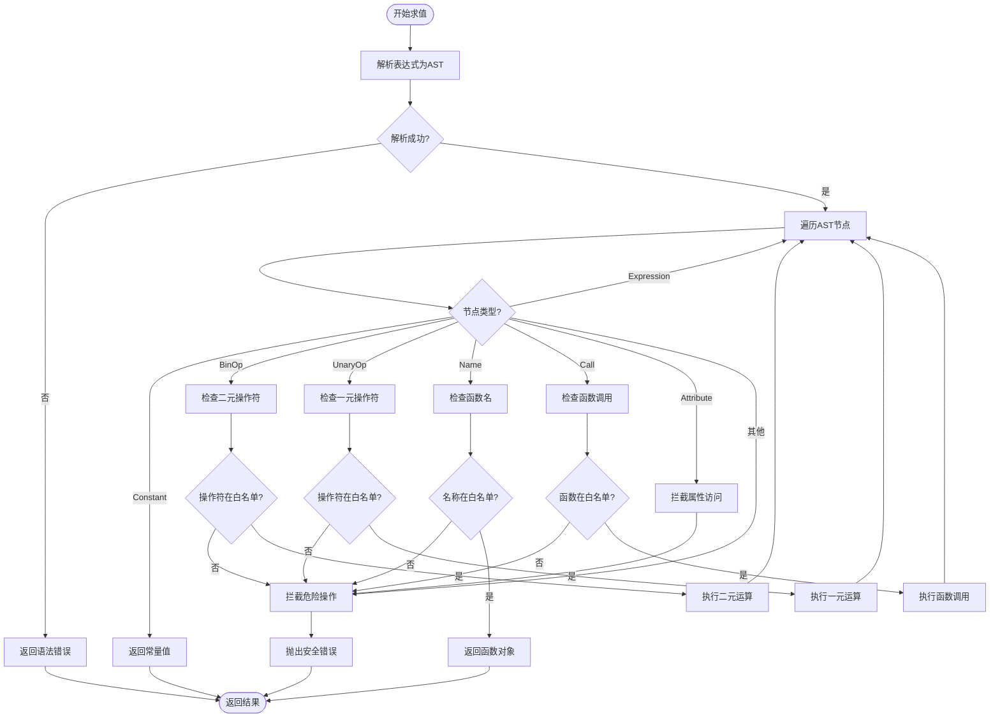
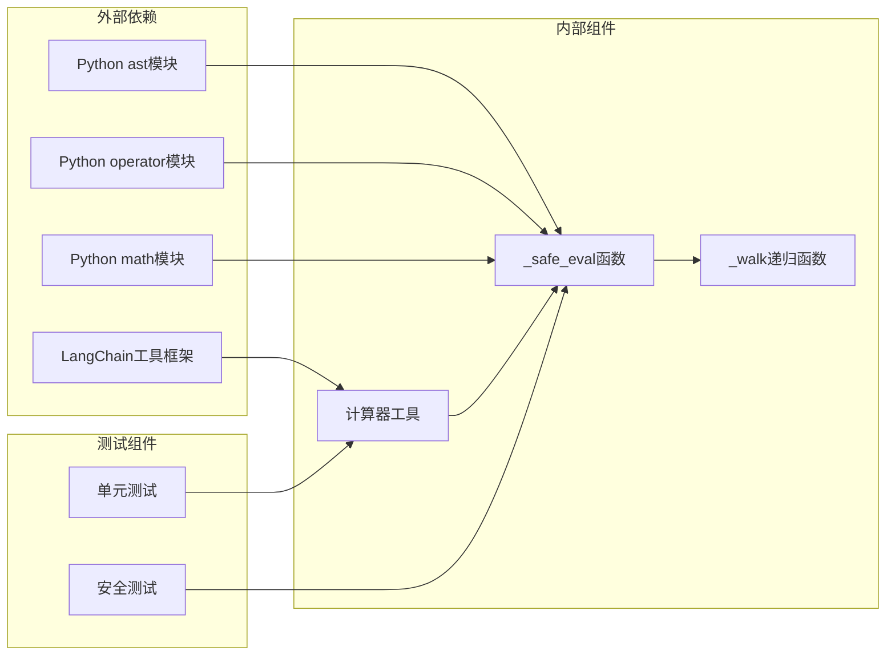
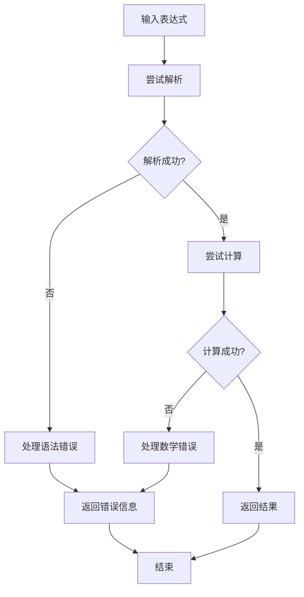

# 计算器工具

<cite>
**本文档引用的文件**
- [calculator.py](file://backend/app/tools/calculator.py)
- [test_tools.py](file://backend/tests/test_tools.py)
- [__init__.py](file://backend/app/tools/__init__.py)
- [main.py](file://backend/app/main.py)
- [config.py](file://backend/app/config.py)
- [exceptions.py](file://backend/app/exceptions.py)
</cite>

## 目录
1. [简介](#简介)
2. [项目结构](#项目结构)
3. [核心组件](#核心组件)
4. [架构概览](#架构概览)
5. [详细组件分析](#详细组件分析)
6. [依赖关系分析](#依赖关系分析)
7. [性能考虑](#性能考虑)
8. [故障排除指南](#故障排除指南)
9. [结论](#结论)
10. [附录](#附录)

## 简介

计算器工具是 Aureon 企业级 AI 知识库平台中的一个关键组件，专门用于安全地执行数学表达式计算。该工具采用先进的 AST 白名单过滤机制，确保在提供强大计算能力的同时保持系统的安全性。

本工具支持多种数学运算类型，包括基础四则运算、幂运算、三角函数、对数函数等，并通过严格的安全检查防止恶意代码注入。计算器工具作为 LangChain 工具集的一部分，可以被 AI 代理和工作流安全地调用。

## 项目结构

计算器工具位于后端应用程序的工具模块中，与其他工具共同构成了完整的工具生态系统：

**图表来源**
- [__init__.py:1-23](file://backend/app/tools/__init__.py#L1-L23)
- [main.py:38](file://backend/app/main.py#L38)
- [test_tools.py:1-25](file://backend/tests/test_tools.py#L1-L25)

**章节来源**
- [__init__.py:1-23](file://backend/app/tools/__init__.py#L1-L23)
- [main.py:38](file://backend/app/main.py#L38)

## 核心组件

计算器工具的核心实现基于以下关键组件：

### 安全评估引擎
- **AST 解析器**: 使用 Python 的内置 `ast` 模块进行语法树解析
- **白名单过滤**: 严格限制允许的操作符和数学函数
- **递归遍历**: 通过深度优先搜索遍历语法树的所有节点

### 支持的数学运算
- **基础运算**: 加法(+)、减法(-)、乘法(*)、除法(/)、取模(%)
- **高级运算**: 幂运算(**)、负号运算
- **数学函数**: 所有 `math` 模块中的非私有函数

### 安全机制
- **操作符限制**: 仅允许白名单中的操作符
- **函数调用控制**: 仅允许白名单中的数学函数
- **属性访问拦截**: 防止方法调用和属性访问
- **异常处理**: 提供清晰的错误信息

**章节来源**
- [calculator.py:6-21](file://backend/app/tools/calculator.py#L6-L21)
- [calculator.py:24-53](file://backend/app/tools/calculator.py#L24-L53)

## 架构概览

计算器工具在整个系统架构中的位置如下：

**图表来源**
- [main.py:340-347](file://backend/app/main.py#L340-L347)
- [__init__.py:7-10](file://backend/app/tools/__init__.py#L7-L10)
- [calculator.py:56-61](file://backend/app/tools/calculator.py#L56-L61)

## 详细组件分析

### 安全表达式求值机制

计算器工具采用 AST 白名单过滤机制来确保表达式求值的安全性：

**图表来源**
- [calculator.py:24-53](file://backend/app/tools/calculator.py#L24-L53)

### AST 白名单过滤实现

计算器工具定义了严格的白名单来控制允许的操作：

#### 允许的操作符
- **二元操作符**: 加法、减法、乘法、除法、幂运算、取模
- **一元操作符**: 负号运算
- **特殊操作符**: 未定义

#### 允许的数学函数
- 来自 `math` 模块的所有非私有函数
- 包括：`sqrt`、`sin`、`cos`、`tan`、`log`、`exp` 等

#### 拦截的危险操作
- **属性访问**: 防止访问对象属性
- **方法调用**: 防止执行对象方法
- **导入语句**: 防止动态导入模块
- **其他危险节点**: 任何不在白名单中的节点类型

**章节来源**
- [calculator.py:7-21](file://backend/app/tools/calculator.py#L7-L21)
- [calculator.py:47-51](file://backend/app/tools/calculator.py#L47-L51)

### 安全评估函数工作机制

安全评估函数 `_safe_eval` 是整个系统的核心组件：

#### 语法解析阶段
1. 使用 `ast.parse()` 将字符串表达式转换为抽象语法树
2. 捕获语法错误并返回友好的错误消息
3. 验证表达式是否为有效的单表达式模式

#### 节点遍历阶段
1. 递归遍历 AST 的每个节点
2. 根据节点类型执行相应的安全检查
3. 对允许的节点执行相应的操作

#### 危险操作拦截
1. 检测属性访问节点并立即拦截
2. 检测方法调用节点并立即拦截
3. 检测不在白名单中的操作符并拦截
4. 检测不在白名单中的函数并拦截

**章节来源**
- [calculator.py:24-53](file://backend/app/tools/calculator.py#L24-L53)

### 支持的数学运算类型

计算器工具支持广泛的数学运算，具体包括：

#### 基础运算
- **加法**: `2 + 3` → `5`
- **减法**: `10 - 4` → `6`
- **乘法**: `6 * 7` → `42`
- **除法**: `15 / 3` → `5.0`
- **取模**: `17 % 5` → `2`

#### 幂运算
- **指数运算**: `2 ** 10` → `1024`
- **平方根**: `sqrt(16)` → `4.0`

#### 三角函数
- **正弦函数**: `sin(pi/2)` → `1.0`
- **余弦函数**: `cos(0)` → `1.0`
- **正切函数**: `tan(pi/4)` → `1.0`

#### 对数函数
- **自然对数**: `log(e)` → `1.0`
- **常用对数**: `log10(100)` → `2.0`

#### 复合运算
- **混合运算**: `2 + 3 * 4` → `14`
- **嵌套函数**: `sqrt(2**2 + 3**2)` → `3.605...`

**章节来源**
- [calculator.py:57-61](file://backend/app/tools/calculator.py#L57-L61)
- [test_tools.py:6-24](file://backend/tests/test_tools.py#L6-L24)

### 表达式格式要求

计算器工具对输入表达式有明确的格式要求：

#### 基本格式
- **数字**: 支持整数和浮点数
- **运算符**: 必须使用标准的 Python 运算符
- **括号**: 可选，用于改变运算优先级
- **空格**: 可选，不影响表达式计算

#### 函数调用格式
- **函数名**: 必须是 `math` 模块中的有效函数
- **参数**: 必须用括号包围，参数之间用逗号分隔
- **嵌套**: 支持函数的嵌套调用

#### 示例格式
- 基本运算: `"2 + 3 * 4"`
- 函数调用: `"sqrt(16) + sin(pi/2)"`
- 复杂表达: `"(2 + 3) * sqrt(16)"`

**章节来源**
- [calculator.py:57-61](file://backend/app/tools/calculator.py#L57-L61)

## 依赖关系分析

计算器工具的依赖关系相对简单但设计精良：

**图表来源**
- [calculator.py:1-4](file://backend/app/tools/calculator.py#L1-L4)
- [test_tools.py:1-2](file://backend/tests/test_tools.py#L1-L2)

### 外部依赖分析

#### Python 标准库依赖
- **ast 模块**: 提供语法树解析功能
- **operator 模块**: 提供安全的操作符映射
- **math 模块**: 提供丰富的数学函数

#### 第三方依赖
- **LangChain**: 提供工具框架和装饰器支持

### 内部耦合度分析

计算器工具具有较低的内部耦合度：
- **高内聚**: 所有计算逻辑集中在单一函数中
- **低耦合**: 与外部系统的交互通过简单的函数接口
- **清晰边界**: 安全检查和计算逻辑分离

**章节来源**
- [calculator.py:1-4](file://backend/app/tools/calculator.py#L1-L4)
- [__init__.py:1](file://backend/app/tools/__init__.py#L1)

## 性能考虑

计算器工具在设计时充分考虑了性能因素：

### 时间复杂度
- **解析阶段**: O(n)，其中 n 是表达式长度
- **遍历阶段**: O(d)，其中 d 是 AST 的深度
- **总体复杂度**: O(n + d)

### 空间复杂度
- **AST 存储**: O(d)，存储语法树节点
- **递归栈**: O(d)，递归调用的深度
- **结果存储**: O(1)，只存储最终结果

### 性能优化策略
1. **白名单预构建**: 在模块加载时构建操作符和函数白名单
2. **早期验证**: 在递归遍历前进行基本的类型检查
3. **短路求值**: 对于简单的常量表达式直接返回结果

### 内存使用
- **静态内存**: 主要用于存储白名单映射
- **动态内存**: 仅在表达式解析和计算时使用
- **垃圾回收**: Python 自动管理内存回收

## 故障排除指南

### 常见错误类型

#### 语法错误
**症状**: 表达式无法解析
**原因**: 语法不正确或包含非法字符
**解决方案**: 检查括号匹配、运算符使用和数字格式

#### 安全错误
**症状**: 抛出 "不允许的操作" 异常
**原因**: 表达式包含被拦截的操作
**解决方案**: 移除危险操作，使用允许的白名单操作

#### 数学错误
**症状**: 计算结果异常或抛出数学异常
**原因**: 数学域错误或数值溢出
**解决方案**: 检查输入范围，使用适当的数学函数

### 错误处理机制

计算器工具提供了多层次的错误处理：

**图表来源**
- [calculator.py:26-29](file://backend/app/tools/calculator.py#L26-L29)
- [calculator.py:47-51](file://backend/app/tools/calculator.py#L47-L51)

### 调试技巧

1. **简化表达式**: 从最简单的表达式开始测试
2. **逐步添加**: 逐个添加运算符和函数进行测试
3. **检查白名单**: 确认使用的函数在允许列表中
4. **验证语法**: 使用在线 Python 语法检查工具

**章节来源**
- [test_tools.py:22-24](file://backend/tests/test_tools.py#L22-L24)
- [exceptions.py:12-22](file://backend/app/exceptions.py#L12-L22)

## 结论

计算器工具是一个设计精良、安全可靠的数学表达式求值系统。通过采用 AST 白名单过滤机制，它在提供强大计算能力的同时确保了系统的安全性。

### 主要优势
1. **安全性**: 严格的安全检查防止恶意代码注入
2. **易用性**: 简洁的 API 接口和清晰的错误信息
3. **可靠性**: 经过充分测试，支持各种复杂的数学运算
4. **可维护性**: 清晰的代码结构和完善的文档

### 应用场景
- AI 代理的数学计算需求
- 数据分析和科学计算
- 教育和学习辅助工具
- 企业级知识库的智能问答

### 未来改进方向
1. **扩展支持**: 添加更多数学函数和运算符
2. **性能优化**: 实现表达式缓存机制
3. **错误诊断**: 提供更详细的错误分析报告
4. **并发处理**: 支持多线程安全的表达式计算

## 附录

### 使用示例

#### 基本运算
- `"1 + 1"` → `"2"`
- `"123 * 456"` → `"56088"`
- `"10 / 3"` → `"3.3333333333333335"`

#### 函数调用
- `"sqrt(16)"` → `"4.0"`
- `"sin(pi/2)"` → `"1.0"`
- `"log(e)"` → `"1.0"`

#### 复杂表达式
- `"2 + 3 * 4"` → `"14"`
- `"(2 + 3) * sqrt(16)"` → `"20"`
- `"sin(pi/2) + cos(0)"` → `"2.0"`

### 安全测试用例

计算器工具经过了全面的安全测试，包括：
- **恶意代码拦截**: 防止 `__import__('os')` 等危险操作
- **属性访问拦截**: 防止 `obj.__dict__` 等属性访问
- **方法调用拦截**: 防止 `system()` 等系统调用

**章节来源**
- [test_tools.py:6-24](file://backend/tests/test_tools.py#L6-L24)