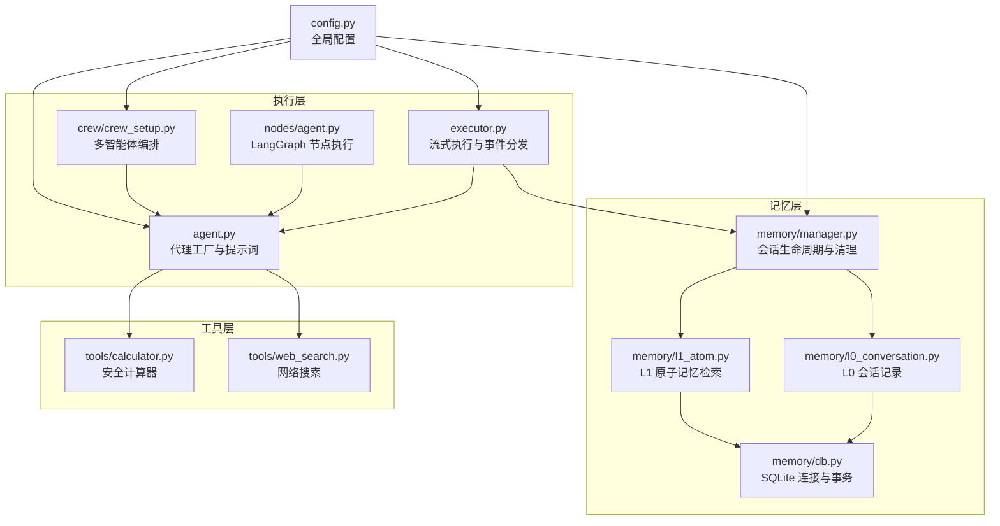
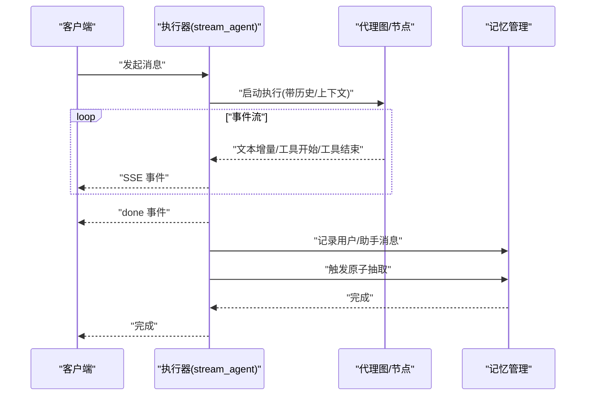
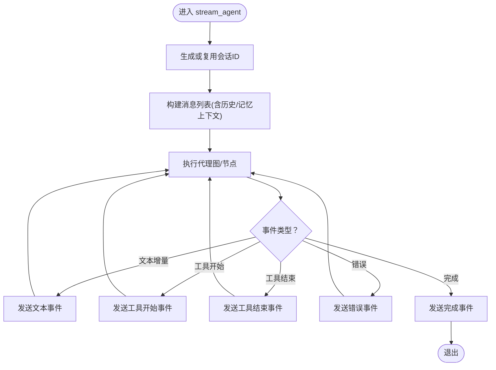
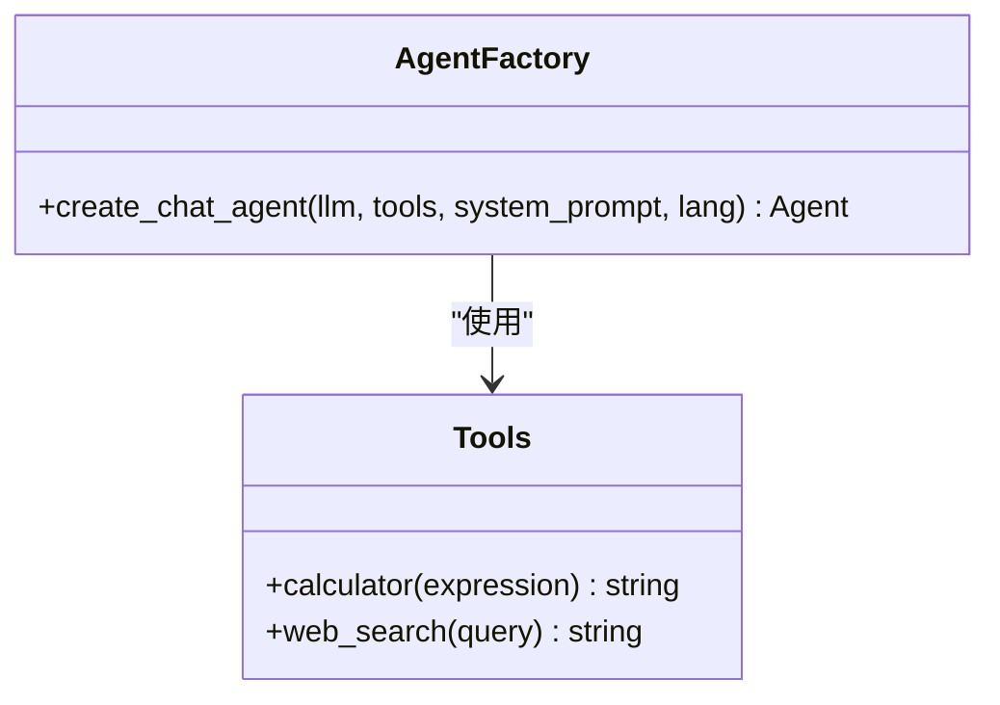
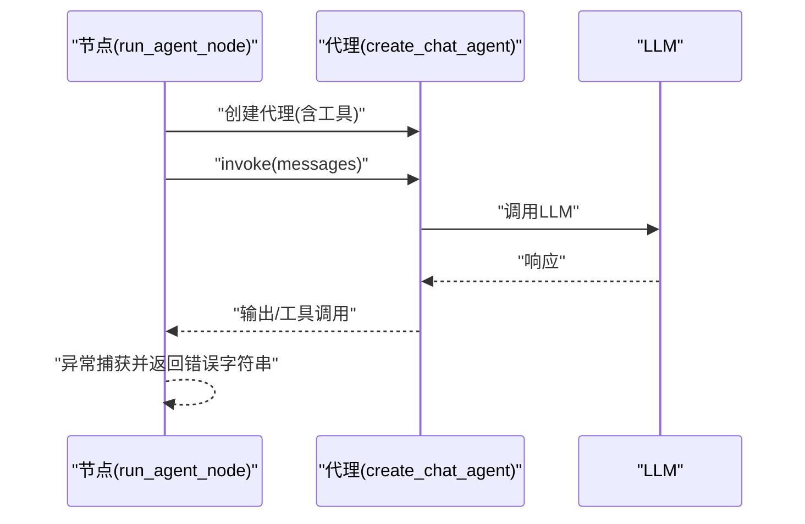
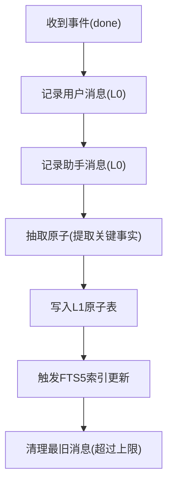
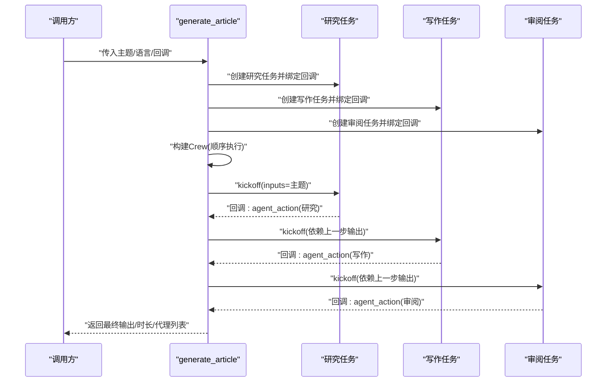
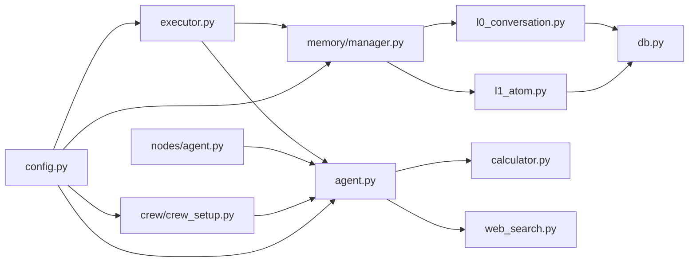

# 执行器管理

<cite>
**本文引用的文件**
- [backend/app/agent/executor.py](file://backend/app/agent/executor.py)
- [backend/app/agent/agent.py](file://backend/app/agent/agent.py)
- [backend/app/langgraph/nodes/agent.py](file://backend/app/langgraph/nodes/agent.py)
- [backend/app/memory/manager.py](file://backend/app/memory/manager.py)
- [backend/app/memory/l0_conversation.py](file://backend/app/memory/l0_conversation.py)
- [backend/app/memory/l1_atom.py](file://backend/app/memory/l1_atom.py)
- [backend/app/memory/db.py](file://backend/app/memory/db.py)
- [backend/app/config.py](file://backend/app/config.py)
- [backend/app/tools/calculator.py](file://backend/app/tools/calculator.py)
- [backend/app/tools/web_search.py](file://backend/app/tools/web_search.py)
- [backend/app/crew/crew_setup.py](file://backend/app/crew/crew_setup.py)
</cite>

## 目录
1. [简介](#简介)
2. [项目结构](#项目结构)
3. [核心组件](#核心组件)
4. [架构总览](#架构总览)
5. [组件详解](#组件详解)
6. [依赖关系分析](#依赖关系分析)
7. [性能与并发](#性能与并发)
8. [故障排查指南](#故障排查指南)
9. [结论](#结论)
10. [附录](#附录)

## 简介
本文件面向 Aureon 的执行器管理系统，系统性阐述执行器的工作原理、任务调度机制、生命周期管理、状态监控与错误处理策略，并提供并发执行控制、资源分配与性能优化建议。同时覆盖执行器与代理系统的集成方式、通信协议、扩展接口与自定义执行器开发指南，以及调试、监控与故障排除的实用技巧。

## 项目结构
执行器相关能力主要分布在以下模块：
- 代理执行与流式输出：backend/app/agent/executor.py
- 代理工厂与提示词：backend/app/agent/agent.py
- LangGraph 节点执行：backend/app/langgraph/nodes/agent.py
- 记忆与会话管理：backend/app/memory/manager.py、l0_conversation.py、l1_atom.py、db.py
- 工具集与外部能力：backend/app/tools/calculator.py、web_search.py
- 多智能体编排：backend/app/crew/crew_setup.py
- 全局配置：backend/app/config.py

图表来源
- [backend/app/agent/executor.py:1-123](file://backend/app/agent/executor.py#L1-L123)
- [backend/app/agent/agent.py:1-71](file://backend/app/agent/agent.py#L1-L71)
- [backend/app/langgraph/nodes/agent.py:1-32](file://backend/app/langgraph/nodes/agent.py#L1-L32)
- [backend/app/memory/manager.py:1-130](file://backend/app/memory/manager.py#L1-L130)
- [backend/app/memory/l0_conversation.py:1-65](file://backend/app/memory/l0_conversation.py#L1-L65)
- [backend/app/memory/l1_atom.py:1-98](file://backend/app/memory/l1_atom.py#L1-L98)
- [backend/app/memory/db.py:1-32](file://backend/app/memory/db.py#L1-L32)
- [backend/app/tools/calculator.py:1-62](file://backend/app/tools/calculator.py#L1-L62)
- [backend/app/tools/web_search.py:1-25](file://backend/app/tools/web_search.py#L1-L25)
- [backend/app/crew/crew_setup.py:1-97](file://backend/app/crew/crew_setup.py#L1-L97)
- [backend/app/config.py:1-90](file://backend/app/config.py#L1-L90)

章节来源
- [backend/app/agent/executor.py:1-123](file://backend/app/agent/executor.py#L1-L123)
- [backend/app/agent/agent.py:1-71](file://backend/app/agent/agent.py#L1-L71)
- [backend/app/langgraph/nodes/agent.py:1-32](file://backend/app/langgraph/nodes/agent.py#L1-L32)
- [backend/app/memory/manager.py:1-130](file://backend/app/memory/manager.py#L1-L130)
- [backend/app/memory/l0_conversation.py:1-65](file://backend/app/memory/l0_conversation.py#L1-L65)
- [backend/app/memory/l1_atom.py:1-98](file://backend/app/memory/l1_atom.py#L1-L98)
- [backend/app/memory/db.py:1-32](file://backend/app/memory/db.py#L1-L32)
- [backend/app/tools/calculator.py:1-62](file://backend/app/tools/calculator.py#L1-L62)
- [backend/app/tools/web_search.py:1-25](file://backend/app/tools/web_search.py#L1-L25)
- [backend/app/crew/crew_setup.py:1-97](file://backend/app/crew/crew_setup.py#L1-L97)
- [backend/app/config.py:1-90](file://backend/app/config.py#L1-L90)

## 核心组件
- 执行器与流式事件：提供基于 SSE 的异步事件流，支持文本增量、工具开始/结束、错误与完成信号。
- 代理工厂与提示词：统一构造具备工具调用能力的代理，内置中英文系统提示与语言指令注入。
- LangGraph 节点执行：封装同步执行的代理节点，返回结果与工具调用信息。
- 记忆与会话管理：维护会话活跃度、上下文拼接、消息记录、原子记忆抽取与场景收尾。
- 工具集：安全计算器与网络搜索工具，作为代理可调用的能力。
- 多智能体编排：基于 crewai 的顺序流水线，支持回调事件上报与执行时长统计。
- 全局配置：LLM 提供商、嵌入模型、缓存与会话上限等参数。

章节来源
- [backend/app/agent/executor.py:11-123](file://backend/app/agent/executor.py#L11-L123)
- [backend/app/agent/agent.py:51-71](file://backend/app/agent/agent.py#L51-L71)
- [backend/app/langgraph/nodes/agent.py:13-32](file://backend/app/langgraph/nodes/agent.py#L13-L32)
- [backend/app/memory/manager.py:20-129](file://backend/app/memory/manager.py#L20-L129)
- [backend/app/memory/l0_conversation.py:8-65](file://backend/app/memory/l0_conversation.py#L8-L65)
- [backend/app/memory/l1_atom.py:43-98](file://backend/app/memory/l1_atom.py#L43-L98)
- [backend/app/tools/calculator.py:24-62](file://backend/app/tools/calculator.py#L24-L62)
- [backend/app/tools/web_search.py:6-25](file://backend/app/tools/web_search.py#L6-L25)
- [backend/app/crew/crew_setup.py:50-97](file://backend/app/crew/crew_setup.py#L50-L97)
- [backend/app/config.py:4-90](file://backend/app/config.py#L4-L90)

## 架构总览
执行器体系围绕“事件驱动的流式执行”展开：前端通过 SSE 接收事件，后端在代理执行过程中持续产生事件；记忆管理在事件流结束后进行后处理（消息记录与原子抽取）。多智能体编排提供更高阶的任务编排能力，配合回调事件实现可观测性。

图表来源
- [backend/app/agent/executor.py:11-123](file://backend/app/agent/executor.py#L11-L123)
- [backend/app/memory/manager.py:60-119](file://backend/app/memory/manager.py#L60-L119)

## 组件详解

### 执行器与事件流（stream_agent 与 stream_agent_with_memory）
- 流式事件类型包括：会话标识、文本增量、工具开始、工具结束、错误、完成。
- 支持会话 ID 自动生成与复用；可注入记忆上下文（来自记忆管理器）。
- 包装版本在“完成”事件后自动记录消息并触发原子抽取，异常以警告级别记录但不中断事件流。
- 事件格式为 SSE，每条事件为独立数据块。

图表来源
- [backend/app/agent/executor.py:11-123](file://backend/app/agent/executor.py#L11-L123)

章节来源
- [backend/app/agent/executor.py:11-123](file://backend/app/agent/executor.py#L11-L123)

### 代理工厂与提示词（create_chat_agent）
- 工厂方法创建具备工具调用能力的代理，支持自定义系统提示与语言指令注入。
- 默认提示词包含工具调用规则与记忆系统说明，中英文双语支持。
- 工具集合由 ALL_TOOLS 提供，包含计算器与网络搜索等。

图表来源
- [backend/app/agent/agent.py:51-71](file://backend/app/agent/agent.py#L51-L71)
- [backend/app/tools/calculator.py:56-62](file://backend/app/tools/calculator.py#L56-L62)
- [backend/app/tools/web_search.py:6-25](file://backend/app/tools/web_search.py#L6-L25)

章节来源
- [backend/app/agent/agent.py:51-71](file://backend/app/agent/agent.py#L51-L71)
- [backend/app/tools/calculator.py:1-62](file://backend/app/tools/calculator.py#L1-L62)
- [backend/app/tools/web_search.py:1-25](file://backend/app/tools/web_search.py#L1-L25)

### LangGraph 节点执行（run_agent_node）
- 封装同步执行的代理节点，组合上下文与查询，返回代理输出与工具调用信息。
- 异常时返回错误信息字符串，保证执行稳定性。

图表来源
- [backend/app/langgraph/nodes/agent.py:13-32](file://backend/app/langgraph/nodes/agent.py#L13-L32)
- [backend/app/agent/agent.py:51-71](file://backend/app/agent/agent.py#L51-L71)

章节来源
- [backend/app/langgraph/nodes/agent.py:13-32](file://backend/app/langgraph/nodes/agent.py#L13-L32)
- [backend/app/agent/agent.py:51-71](file://backend/app/agent/agent.py#L51-L71)

### 记忆与会话管理（MemoryManager）
- 会话生命周期：touch_session 更新活跃时间；get_context 拼接人物与最近场景作为上下文；finalize_scenario 结束场景并更新人物画像。
- 消息记录：record_message 写入 L0 表；cleanup_oldest 控制会话消息上限。
- 原子记忆：extract_atoms 从最近对话抽取关键事实，写入 L1 表并建立 FTS5 索引。
- 后台清理：周期性检查不活跃会话并自动结束，防止资源泄露。
- 数据库连接：线程本地连接、WAL 模式与忙等待超时，提升并发读取与写入稳定性。

图表来源
- [backend/app/memory/manager.py:54-81](file://backend/app/memory/manager.py#L54-L81)
- [backend/app/memory/l0_conversation.py:8-65](file://backend/app/memory/l0_conversation.py#L8-L65)
- [backend/app/memory/l1_atom.py:43-98](file://backend/app/memory/l1_atom.py#L43-L98)
- [backend/app/memory/db.py:15-32](file://backend/app/memory/db.py#L15-L32)

章节来源
- [backend/app/memory/manager.py:20-129](file://backend/app/memory/manager.py#L20-L129)
- [backend/app/memory/l0_conversation.py:1-65](file://backend/app/memory/l0_conversation.py#L1-L65)
- [backend/app/memory/l1_atom.py:1-98](file://backend/app/memory/l1_atom.py#L1-L98)
- [backend/app/memory/db.py:1-32](file://backend/app/memory/db.py#L1-L32)

### 多智能体编排（generate_article）
- 使用 crewai 的顺序流水线，研究、写作、审阅三个角色依次执行。
- 为每个任务绑定回调，上报 agent_action 事件，包含代理角色与摘要详情。
- 记录执行时长与最终输出，支持输入参数传递与上下文复用。

图表来源
- [backend/app/crew/crew_setup.py:50-97](file://backend/app/crew/crew_setup.py#L50-L97)

章节来源
- [backend/app/crew/crew_setup.py:1-97](file://backend/app/crew/crew_setup.py#L1-L97)

### 工具与外部能力
- 安全计算器：仅允许白名单操作符与函数，AST 解析评估，避免任意代码执行。
- 网络搜索：基于 Tavily 客户端，按配置返回搜索结果摘要。

章节来源
- [backend/app/tools/calculator.py:1-62](file://backend/app/tools/calculator.py#L1-L62)
- [backend/app/tools/web_search.py:1-25](file://backend/app/tools/web_search.py#L1-L25)

## 依赖关系分析
- 执行器依赖代理工厂与工具集；LangGraph 节点同样依赖代理工厂。
- 记忆管理器依赖 L0/L1 层与数据库连接；L1 层依赖 L0 层的消息数据。
- 多智能体编排依赖代理工厂与任务创建函数；回调用于可观测性。
- 全局配置贯穿于执行器、代理、记忆与编排模块，提供模型与资源参数。

图表来源
- [backend/app/agent/executor.py:1-123](file://backend/app/agent/executor.py#L1-L123)
- [backend/app/agent/agent.py:1-71](file://backend/app/agent/agent.py#L1-L71)
- [backend/app/langgraph/nodes/agent.py:1-32](file://backend/app/langgraph/nodes/agent.py#L1-L32)
- [backend/app/memory/manager.py:1-130](file://backend/app/memory/manager.py#L1-L130)
- [backend/app/memory/l0_conversation.py:1-65](file://backend/app/memory/l0_conversation.py#L1-L65)
- [backend/app/memory/l1_atom.py:1-98](file://backend/app/memory/l1_atom.py#L1-L98)
- [backend/app/memory/db.py:1-32](file://backend/app/memory/db.py#L1-L32)
- [backend/app/tools/calculator.py:1-62](file://backend/app/tools/calculator.py#L1-L62)
- [backend/app/tools/web_search.py:1-25](file://backend/app/tools/web_search.py#L1-L25)
- [backend/app/crew/crew_setup.py:1-97](file://backend/app/crew/crew_setup.py#L1-L97)
- [backend/app/config.py:1-90](file://backend/app/config.py#L1-L90)

章节来源
- [backend/app/agent/executor.py:1-123](file://backend/app/agent/executor.py#L1-L123)
- [backend/app/agent/agent.py:1-71](file://backend/app/agent/agent.py#L1-L71)
- [backend/app/langgraph/nodes/agent.py:1-32](file://backend/app/langgraph/nodes/agent.py#L1-L32)
- [backend/app/memory/manager.py:1-130](file://backend/app/memory/manager.py#L1-L130)
- [backend/app/memory/l0_conversation.py:1-65](file://backend/app/memory/l0_conversation.py#L1-L65)
- [backend/app/memory/l1_atom.py:1-98](file://backend/app/memory/l1_atom.py#L1-L98)
- [backend/app/memory/db.py:1-32](file://backend/app/memory/db.py#L1-L32)
- [backend/app/tools/calculator.py:1-62](file://backend/app/tools/calculator.py#L1-L62)
- [backend/app/tools/web_search.py:1-25](file://backend/app/tools/web_search.py#L1-L25)
- [backend/app/crew/crew_setup.py:1-97](file://backend/app/crew/crew_setup.py#L1-L97)
- [backend/app/config.py:1-90](file://backend/app/config.py#L1-L90)

## 性能与并发
- 并发执行控制
  - 事件流采用异步生成器，逐段产出事件，避免一次性缓冲大量数据。
  - 记忆记录与原子抽取在“完成”事件后异步执行，不影响主执行路径。
  - 数据库连接采用线程本地实例与 WAL 模式，减少锁竞争，提升并发读取效率。
- 资源分配
  - 会话消息上限由配置项控制，超出阈值自动清理最旧消息，防止内存膨胀。
  - L1 原子表建立 FTS5 虚拟表与触发器，实现近实时索引更新，查询回退至 LIKE 保障可用性。
- 性能优化建议
  - 将重型工具调用（如网络搜索）置于异步上下文中，避免阻塞事件流。
  - 在代理工厂中按需注入工具，减少不必要的工具加载。
  - 对长上下文进行截断或摘要化，降低 LLM token 消耗与延迟。
  - 利用多智能体编排的顺序特性，将无依赖任务并行化（在支持范围内）以缩短总时延。

章节来源
- [backend/app/memory/l0_conversation.py:47-65](file://backend/app/memory/l0_conversation.py#L47-L65)
- [backend/app/memory/l1_atom.py:9-41](file://backend/app/memory/l1_atom.py#L9-L41)
- [backend/app/memory/db.py:15-32](file://backend/app/memory/db.py#L15-L32)
- [backend/app/config.py:48-50](file://backend/app/config.py#L48-L50)

## 故障排查指南
- 事件流异常
  - 若出现“完成”事件后未记录消息，检查记忆管理器的记录与抽取逻辑，确认会话 ID 是否正确传递。
  - SSE JSON 解析失败通常由非标准前缀或非法字符导致，关注包装函数与事件格式一致性。
- 记忆与数据库
  - L1 FTS5 初始化失败时自动回退至 LIKE 查询，若发现检索异常，检查虚拟表与触发器状态。
  - 数据库连接异常可通过线程本地连接与忙等待超时参数定位，必要时增加超时或减少并发写入。
- 多智能体编排
  - 任务回调未触发时，检查回调绑定与事件上报逻辑；确保 inputs 与上下文正确传递。
- 工具调用
  - 计算器报错多为表达式语法或非法操作，检查输入合法性与白名单限制。
  - 网络搜索失败通常由 API 密钥缺失或网络问题引起，确认配置项与网络连通性。

章节来源
- [backend/app/agent/executor.py:84-119](file://backend/app/agent/executor.py#L84-L119)
- [backend/app/memory/manager.py:104-126](file://backend/app/memory/manager.py#L104-L126)
- [backend/app/memory/l1_atom.py:63-87](file://backend/app/memory/l1_atom.py#L63-L87)
- [backend/app/tools/calculator.py:24-53](file://backend/app/tools/calculator.py#L24-L53)
- [backend/app/tools/web_search.py:11-24](file://backend/app/tools/web_search.py#L11-L24)
- [backend/app/crew/crew_setup.py:27-47](file://backend/app/crew/crew_setup.py#L27-L47)

## 结论
Aureon 的执行器系统以事件驱动的流式执行为核心，结合记忆管理与多智能体编排，实现了可观测、可扩展且稳定的执行框架。通过合理的并发控制、资源分配与错误处理策略，系统能够在复杂任务场景下保持高效与可靠。开发者可基于现有接口扩展自定义执行器与工具，进一步增强系统的适应性与性能。

## 附录

### 执行器配置参数与超时设置
- 会话最大消息数：用于控制 L0 表存储规模，避免无限增长。
- 会话不活跃超时：后台清理任务会自动结束长时间不活跃的会话。
- 数据库忙等待超时：提升并发写入稳定性。
- LLM 与嵌入模型配置：提供主备提供商与模型参数，便于切换与降级。

章节来源
- [backend/app/config.py:48-50](file://backend/app/config.py#L48-L50)
- [backend/app/memory/manager.py:16-17](file://backend/app/memory/manager.py#L16-L17)
- [backend/app/memory/db.py:29-30](file://backend/app/memory/db.py#L29-L30)
- [backend/app/config.py:7-28](file://backend/app/config.py#L7-L28)

### 重试机制与降级策略
- 工具调用失败时的降级：网络搜索失败返回错误信息而非抛出异常；计算器对非法表达式返回明确错误提示。
- 编排层异常：多智能体编排在 kickoff 抛出异常时统一包装为运行时错误，便于上层捕获与处理。
- 记忆层异常：记录与抽取阶段的异常以警告级别记录，避免中断事件流。

章节来源
- [backend/app/tools/web_search.py:14-24](file://backend/app/tools/web_search.py#L14-L24)
- [backend/app/tools/calculator.py:24-53](file://backend/app/tools/calculator.py#L24-L53)
- [backend/app/crew/crew_setup.py:82-84](file://backend/app/crew/crew_setup.py#L82-L84)
- [backend/app/agent/executor.py:113-118](file://backend/app/agent/executor.py#L113-L118)

### 执行器与代理系统的集成与通信协议
- 通信协议：SSE（Server-Sent Events），事件类型包括会话、文本、工具、错误、完成。
- 集成方式：执行器通过代理工厂创建具备工具调用能力的代理；LangGraph 节点提供同步执行封装；记忆管理器在事件完成后进行后处理。

章节来源
- [backend/app/agent/executor.py:17-61](file://backend/app/agent/executor.py#L17-L61)
- [backend/app/agent/agent.py:51-71](file://backend/app/agent/agent.py#L51-L71)
- [backend/app/langgraph/nodes/agent.py:13-32](file://backend/app/langgraph/nodes/agent.py#L13-L32)

### 扩展接口与自定义执行器开发指南
- 扩展点
  - 新增事件类型：在执行器中添加事件类型判断与 SSE 输出。
  - 自定义代理：通过代理工厂注入新的系统提示与工具集合。
  - 自定义工具：在工具模块中新增工具函数并纳入 ALL_TOOLS。
  - 自定义节点：在 LangGraph 节点中封装新的执行逻辑。
- 开发建议
  - 保持事件流的异步与增量特性，避免阻塞。
  - 对外部依赖进行超时与重试控制，确保鲁棒性。
  - 为关键路径添加可观测性回调，便于调试与监控。

章节来源
- [backend/app/agent/agent.py:51-71](file://backend/app/agent/agent.py#L51-L71)
- [backend/app/tools/calculator.py:56-62](file://backend/app/tools/calculator.py#L56-L62)
- [backend/app/tools/web_search.py:6-25](file://backend/app/tools/web_search.py#L6-L25)
- [backend/app/langgraph/nodes/agent.py:13-32](file://backend/app/langgraph/nodes/agent.py#L13-L32)