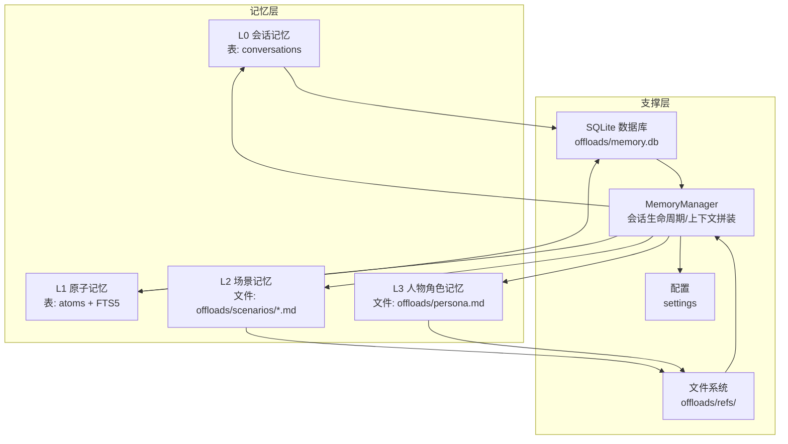
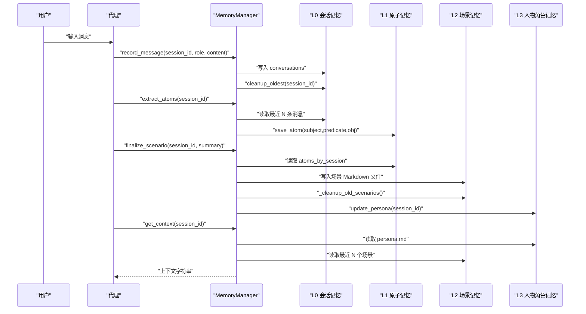
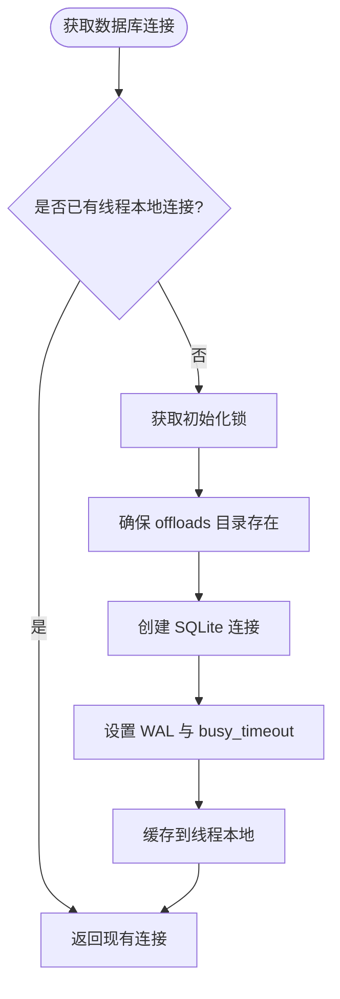
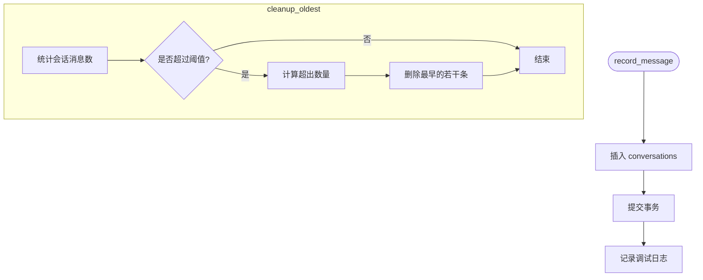
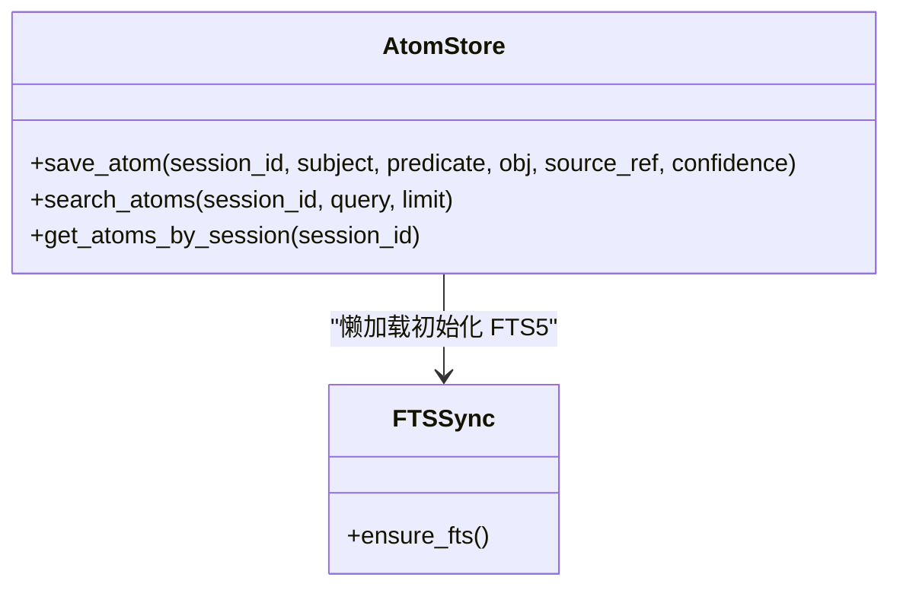
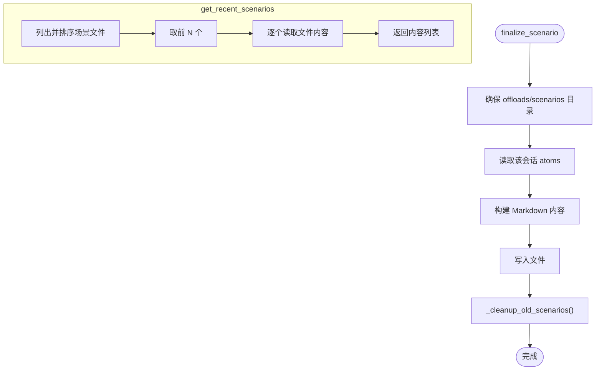
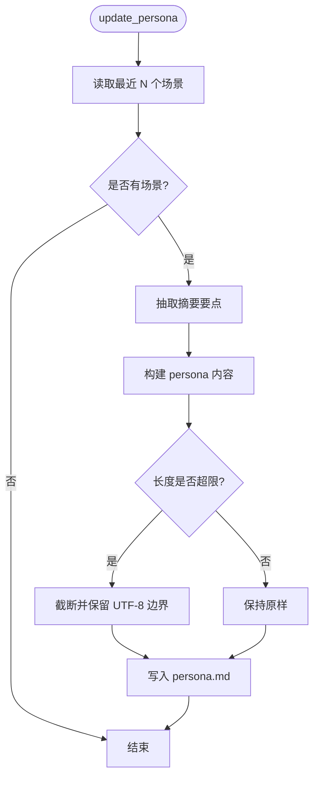
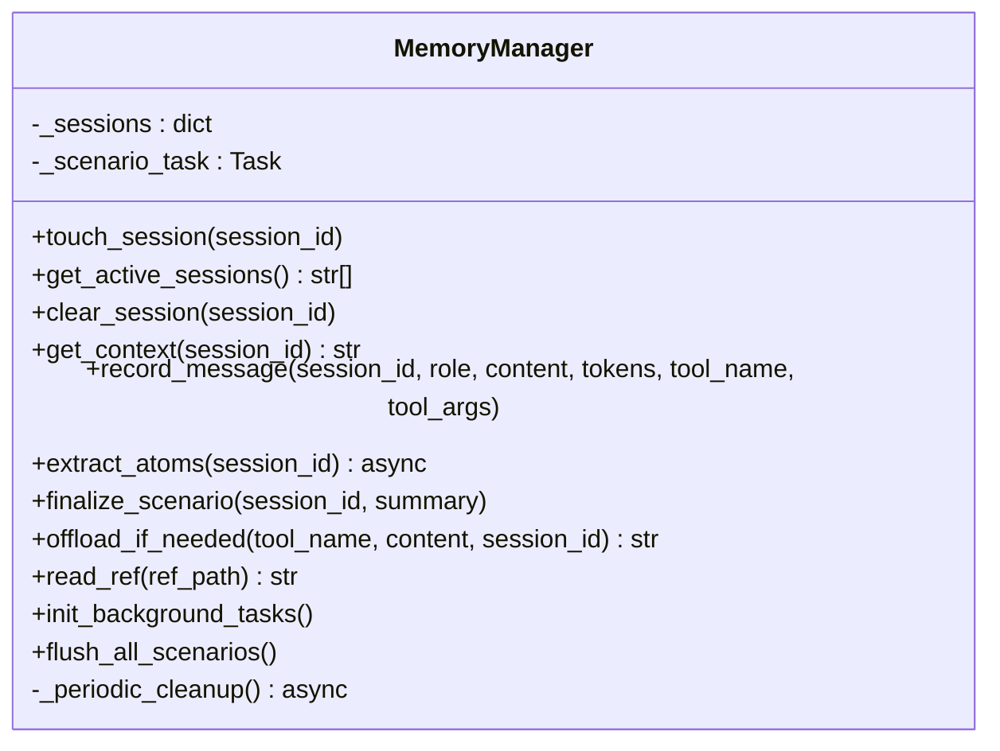
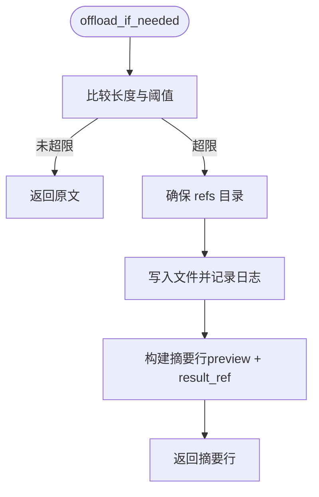
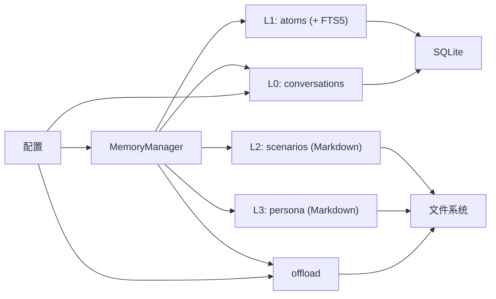

# 记忆集成

<cite>
**本文引用的文件**
- [backend/app/memory/db.py](file://backend/app/memory/db.py)
- [backend/app/memory/l0_conversation.py](file://backend/app/memory/l0_conversation.py)
- [backend/app/memory/l1_atom.py](file://backend/app/memory/l1_atom.py)
- [backend/app/memory/l2_scenario.py](file://backend/app/memory/l2_scenario.py)
- [backend/app/memory/l3_persona.py](file://backend/app/memory/l3_persona.py)
- [backend/app/memory/offload.py](file://backend/app/memory/offload.py)
- [backend/app/memory/manager.py](file://backend/app/memory/manager.py)
- [backend/app/config.py](file://backend/app/config.py)
- [backend/app/agent/agent.py](file://backend/app/agent/agent.py)
- [backend/data/articles/agent-memory-system.md](file://backend/data/articles/agent-memory-system.md)
- [backend/tests/test_memory.py](file://backend/tests/test_memory.py)
- [backend/tests/test_memory_extended.py](file://backend/tests/test_memory_extended.py)
</cite>

## 目录
1. [引言](#引言)
2. [项目结构](#项目结构)
3. [核心组件](#核心组件)
4. [架构总览](#架构总览)
5. [详细组件分析](#详细组件分析)
6. [依赖分析](#依赖分析)
7. [性能考虑](#性能考虑)
8. [故障排除指南](#故障排除指南)
9. [结论](#结论)
10. [附录](#附录)

## 引言
本文件面向开发者，系统性阐述 Aureon 代理与多层级记忆系统的集成方式与实现细节。重点覆盖以下方面：
- 会话记忆（L0）、原子记忆（L1）、场景记忆（L2）、人物角色记忆（L3）在代理中的职责与协作
- 记忆提取机制、上下文维护与长期记忆管理策略
- 记忆状态同步、冲突解决与数据一致性保障
- 记忆对代理决策过程的影响与优化策略
- 记忆性能优化、存储管理与备份恢复机制
- 开发者调试技巧与常见问题排查

## 项目结构
记忆系统位于后端模块 app/memory 下，采用“四层记忆”分层设计：
- L0：会话记忆（SQLite 表 conversations）
- L1：原子记忆（SQLite 表 atoms + FTS5 全文索引）
- L2：场景记忆（Markdown 文件 offloads/scenarios/*.md）
- L3：人物角色记忆（Markdown 文件 offloads/persona.md）

此外，offload 模块负责大体量输出的落盘与引用；MemoryManager 统一编排各层生命周期与上下文拼装；配置模块提供阈值与容量参数。

图表来源
- [backend/app/memory/db.py:15-63](file://backend/app/memory/db.py#L15-L63)
- [backend/app/memory/l0_conversation.py:8-65](file://backend/app/memory/l0_conversation.py#L8-L65)
- [backend/app/memory/l1_atom.py:9-98](file://backend/app/memory/l1_atom.py#L9-L98)
- [backend/app/memory/l2_scenario.py:18-94](file://backend/app/memory/l2_scenario.py#L18-L94)
- [backend/app/memory/l3_persona.py:11-44](file://backend/app/memory/l3_persona.py#L11-L44)
- [backend/app/memory/offload.py:11-53](file://backend/app/memory/offload.py#L11-L53)
- [backend/app/memory/manager.py:20-130](file://backend/app/memory/manager.py#L20-L130)
- [backend/app/config.py:48-50](file://backend/app/config.py#L48-L50)

章节来源
- [backend/app/memory/db.py:15-63](file://backend/app/memory/db.py#L15-L63)
- [backend/app/memory/manager.py:20-130](file://backend/app/memory/manager.py#L20-L130)
- [backend/app/config.py:48-50](file://backend/app/config.py#L48-L50)

## 核心组件
- 数据库与连接管理：提供线程局部的 SQLite 连接、WAL 模式、busy_timeout，并初始化 conversations 与 atoms 表及索引。
- 会话记忆（L0）：记录每轮对话消息，支持滑动窗口清理。
- 原子记忆（L1）：以三元组形式存储结构化事实，内置 FTS5 全文索引与回退查询。
- 场景记忆（L2）：在会话结束时将原子事实聚合为 Markdown 场景文件，并限制最大数量。
- 人物角色记忆（L3）：基于近期场景摘要生成用户画像文件，限制大小。
- 记忆管理器（MemoryManager）：统一编排会话生命周期、上下文拼装、原子提取、场景收尾、离线落盘与后台清理。
- 离线落盘（offload）：当工具输出超过阈值时，落盘并返回引用摘要，支持安全读取。

章节来源
- [backend/app/memory/db.py:15-63](file://backend/app/memory/db.py#L15-L63)
- [backend/app/memory/l0_conversation.py:8-65](file://backend/app/memory/l0_conversation.py#L8-L65)
- [backend/app/memory/l1_atom.py:9-98](file://backend/app/memory/l1_atom.py#L9-L98)
- [backend/app/memory/l2_scenario.py:18-94](file://backend/app/memory/l2_scenario.py#L18-L94)
- [backend/app/memory/l3_persona.py:11-44](file://backend/app/memory/l3_persona.py#L11-L44)
- [backend/app/memory/offload.py:11-53](file://backend/app/memory/offload.py#L11-L53)
- [backend/app/memory/manager.py:20-130](file://backend/app/memory/manager.py#L20-L130)

## 架构总览
下图展示代理与记忆系统的交互流程：代理接收用户输入，MemoryManager 记录会话消息并触发原子提取；会话结束时生成场景与人物画像；上下文由 L3 人物画像与近期 L2 场景拼装而成，供后续推理使用。

图表来源
- [backend/app/memory/manager.py:42-103](file://backend/app/memory/manager.py#L42-L103)
- [backend/app/memory/l0_conversation.py:8-65](file://backend/app/memory/l0_conversation.py#L8-L65)
- [backend/app/memory/l1_atom.py:43-98](file://backend/app/memory/l1_atom.py#L43-L98)
- [backend/app/memory/l2_scenario.py:35-94](file://backend/app/memory/l2_scenario.py#L35-L94)
- [backend/app/memory/l3_persona.py:11-44](file://backend/app/memory/l3_persona.py#L11-L44)

## 详细组件分析

### 数据库与连接（db.py）
- 线程局部连接：每个线程拥有独立连接，避免跨线程共享导致的锁争用。
- WAL 模式：允许多连接并发读取，提升读吞吐。
- busy_timeout：缓解写竞争导致的阻塞。
- 初始化表与索引：conversations、atoms 表，以及会话维度索引。

图表来源
- [backend/app/memory/db.py:15-33](file://backend/app/memory/db.py#L15-L33)

章节来源
- [backend/app/memory/db.py:15-63](file://backend/app/memory/db.py#L15-L63)

### 会话记忆（L0：conversations）
- 记录消息：role、content、tokens、tool_name、tool_args。
- 清理策略：按会话统计消息数，超过阈值则删除最早一批，阈值来自配置。
- 查询接口：按会话倒序取最近 N 条，用于原子提取与上下文拼装。

图表来源
- [backend/app/memory/l0_conversation.py:8-65](file://backend/app/memory/l0_conversation.py#L8-L65)
- [backend/app/config.py:48-50](file://backend/app/config.py#L48-L50)

章节来源
- [backend/app/memory/l0_conversation.py:8-65](file://backend/app/memory/l0_conversation.py#L8-L65)
- [backend/app/config.py:48-50](file://backend/app/config.py#L48-L50)

### 原子记忆（L1：atoms + FTS5）
- 三元组存储：subject、predicate、object、confidence、source_ref。
- FTS5 虚拟表与触发器：自动同步 atoms 表变更到 atoms_fts，支持全文检索。
- 回退策略：FTS5 失败时回退到 LIKE 模糊匹配。
- 查询接口：按会话检索，按置信度排序。

图表来源
- [backend/app/memory/l1_atom.py:9-98](file://backend/app/memory/l1_atom.py#L9-L98)

章节来源
- [backend/app/memory/l1_atom.py:9-98](file://backend/app/memory/l1_atom.py#L9-L98)

### 场景记忆（L2：Markdown 场景）
- 生成：会话结束时读取该会话的原子事实，生成结构化场景 Markdown 文件，包含摘要与关键事实。
- 读取：返回最近 N 个场景内容，用于上下文拼装。
- 清理：仅保留最新 MAX_SCENARIOS 个文件，旧文件删除。
- 缓存：场景文件列表带 TTL 缓存，降低频繁 IO。

图表来源
- [backend/app/memory/l2_scenario.py:35-94](file://backend/app/memory/l2_scenario.py#L35-L94)

章节来源
- [backend/app/memory/l2_scenario.py:18-94](file://backend/app/memory/l2_scenario.py#L18-L94)

### 人物角色记忆（L3：persona.md）
- 更新：从近期场景摘要中抽取要点，生成 persona.md，限制最大字节数。
- 读取：返回当前 persona 内容，作为上下文的一部分。

图表来源
- [backend/app/memory/l3_persona.py:11-44](file://backend/app/memory/l3_persona.py#L11-L44)

章节来源
- [backend/app/memory/l3_persona.py:11-44](file://backend/app/memory/l3_persona.py#L11-L44)

### 记忆管理器（MemoryManager）
- 会话生命周期：touch_session 标记活跃、get_active_sessions 获取列表、clear_session 清理。
- 上下文拼装：组合 L3 人物画像与最近 L2 场景。
- 原子提取：从最近用户消息中抽取三元组并写入 L1。
- 场景收尾：会话结束时生成场景并更新人物画像。
- 离线落盘：对工具输出超过阈值的内容进行落盘，返回引用摘要。
- 后台清理：周期性检测长时间不活跃的会话并自动收尾。

图表来源
- [backend/app/memory/manager.py:20-130](file://backend/app/memory/manager.py#L20-L130)

章节来源
- [backend/app/memory/manager.py:20-130](file://backend/app/memory/manager.py#L20-L130)

### 离线落盘（offload）
- 阈值控制：超过 offload_max_chars 则落盘。
- 文件命名：基于 session_id、tool_name 与时间戳，写入 offloads/refs/。
- 引用摘要：返回包含 preview 与 result_ref 的摘要行。
- 安全读取：路径规范化与根目录校验，防止路径穿越。

图表来源
- [backend/app/memory/offload.py:11-53](file://backend/app/memory/offload.py#L11-L53)
- [backend/app/config.py:48](file://backend/app/config.py#L48)

章节来源
- [backend/app/memory/offload.py:11-53](file://backend/app/memory/offload.py#L11-L53)
- [backend/app/config.py:48](file://backend/app/config.py#L48)

### 代理与记忆集成点
- 系统提示：明确告知用户记忆系统行为（上下文保持、事实抽取、场景生成、可询问记忆）。
- 工具链：read_ref 用于读取离线落盘文件；calculator/web_search 等工具与记忆协同工作。
- 记忆上下文：MemoryManager.get_context 为代理提供 L3/L2 拼装的上下文文本。

章节来源
- [backend/app/agent/agent.py:51-71](file://backend/app/agent/agent.py#L51-L71)
- [backend/app/memory/manager.py:42-50](file://backend/app/memory/manager.py#L42-L50)

## 依赖分析
- 模块内聚与耦合
  - MemoryManager 对 L0/L1/L2/L3/offload 有直接依赖，承担编排职责，耦合度较高但职责清晰。
  - L1 通过 FTS5 与 atoms 表解耦，具备较好的查询扩展性。
  - L2/L3 通过文件系统解耦，便于离线备份与人工审阅。
- 外部依赖
  - SQLite（WAL + 索引）
  - 文件系统（offloads 目录）
  - 配置项（offload_max_chars、session_max_messages）

图表来源
- [backend/app/memory/manager.py:6-11](file://backend/app/memory/manager.py#L6-L11)
- [backend/app/memory/l1_atom.py:9-35](file://backend/app/memory/l1_atom.py#L9-L35)
- [backend/app/memory/l2_scenario.py:9](file://backend/app/memory/l2_scenario.py#L9)
- [backend/app/memory/l3_persona.py:7](file://backend/app/memory/l3_persona.py#L7)
- [backend/app/memory/offload.py:8](file://backend/app/memory/offload.py#L8)
- [backend/app/config.py:48-50](file://backend/app/config.py#L48-L50)

章节来源
- [backend/app/memory/manager.py:6-11](file://backend/app/memory/manager.py#L6-L11)
- [backend/app/memory/l1_atom.py:9-35](file://backend/app/memory/l1_atom.py#L9-L35)
- [backend/app/memory/l2_scenario.py:9](file://backend/app/memory/l2_scenario.py#L9)
- [backend/app/memory/l3_persona.py:7](file://backend/app/memory/l3_persona.py#L7)
- [backend/app/memory/offload.py:8](file://backend/app/memory/offload.py#L8)
- [backend/app/config.py:48-50](file://backend/app/config.py#L48-L50)

## 性能考虑
- 连接与并发
  - 线程局部连接 + WAL 模式，减少锁争用，提升并发读取能力。
  - busy_timeout 降低写阻塞概率。
- 查询优化
  - L1 使用 FTS5 虚拟表加速全文检索；失败时回退 LIKE，保证稳定性。
  - L0/L1 建立会话索引，加速按会话查询。
- 清理与容量
  - L0 消息滑动窗口清理，避免无限增长。
  - L2 最大场景数限制，定期清理旧文件。
  - L3 人物画像大小上限，防止过度膨胀。
- I/O 与序列化
  - 场景与人物文件采用 Markdown 文本，便于快速读写与版本化。
  - 离线落盘采用预估 preview，避免在摘要中携带大文本。

章节来源
- [backend/app/memory/db.py:15-33](file://backend/app/memory/db.py#L15-L33)
- [backend/app/memory/l1_atom.py:9-41](file://backend/app/memory/l1_atom.py#L9-L41)
- [backend/app/memory/l0_conversation.py:47-65](file://backend/app/memory/l0_conversation.py#L47-L65)
- [backend/app/memory/l2_scenario.py:80-94](file://backend/app/memory/l2_scenario.py#L80-L94)
- [backend/app/memory/l3_persona.py:28-30](file://backend/app/memory/l3_persona.py#L28-L30)
- [backend/app/config.py:48-50](file://backend/app/config.py#L48-L50)

## 故障排除指南
- 记忆未生效
  - 检查 MemoryManager 是否被正确调用（record_message、extract_atoms、finalize_scenario）。
  - 确认配置项 session_max_messages 与 offload_max_chars 设置合理。
- FTS5 初始化失败
  - L1 初始化会记录警告并回退到 LIKE；若出现异常，检查 SQLite 版本与权限。
- 场景/人物文件未生成
  - 确认 offloads/scenarios 与 offloads/persona 目录可写。
  - 检查 L2 场景清理逻辑是否误删。
- 路径穿越与读取错误
  - read_ref 已内置路径校验；如仍报错，检查文件名与 refs 目录权限。
- 后台清理任务异常
  - 观察日志中“Background cleanup task cancelled”与重启信息；确认事件循环运行正常。

章节来源
- [backend/app/memory/l1_atom.py:39-41](file://backend/app/memory/l1_atom.py#L39-L41)
- [backend/app/memory/l2_scenario.py:59-65](file://backend/app/memory/l2_scenario.py#L59-L65)
- [backend/app/memory/offload.py:42-52](file://backend/app/memory/offload.py#L42-L52)
- [backend/app/memory/manager.py:104-127](file://backend/app/memory/manager.py#L104-L127)

## 结论
Aureon 的记忆系统通过“四层记忆”实现从短期对话到长期个性化的渐进抽象，结合 MemoryManager 的统一编排与 offload 的大体量输出处理，形成稳定、可扩展且可审计的记忆闭环。建议在生产环境中：
- 明确配置阈值并监控磁盘与数据库容量
- 在高并发场景下评估 WAL 与 busy_timeout 的效果
- 对 L2/L3 文件进行定期备份与归档
- 通过测试用例覆盖关键路径，确保上下文拼装与原子提取的正确性

## 附录
- 设计文档参考：四层记忆架构与用途说明
- 测试用例参考：覆盖 L0/L1/L2/L3/offload 的基础与扩展测试

章节来源
- [backend/data/articles/agent-memory-system.md:12-35](file://backend/data/articles/agent-memory-system.md#L12-L35)
- [backend/tests/test_memory.py:14-63](file://backend/tests/test_memory.py#L14-L63)
- [backend/tests/test_memory_extended.py:250-341](file://backend/tests/test_memory_extended.py#L250-L341)