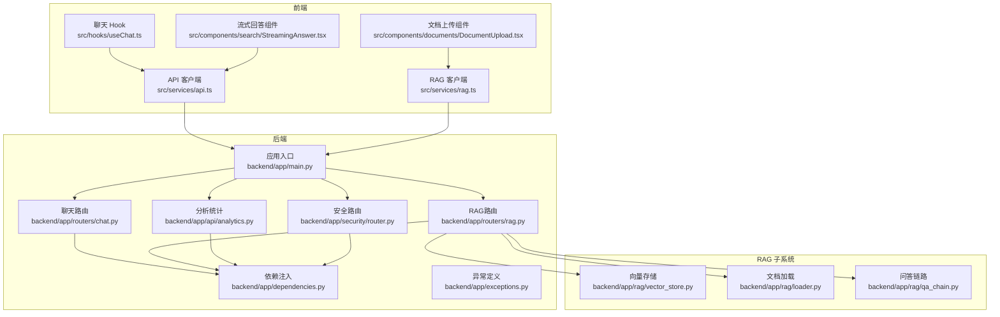
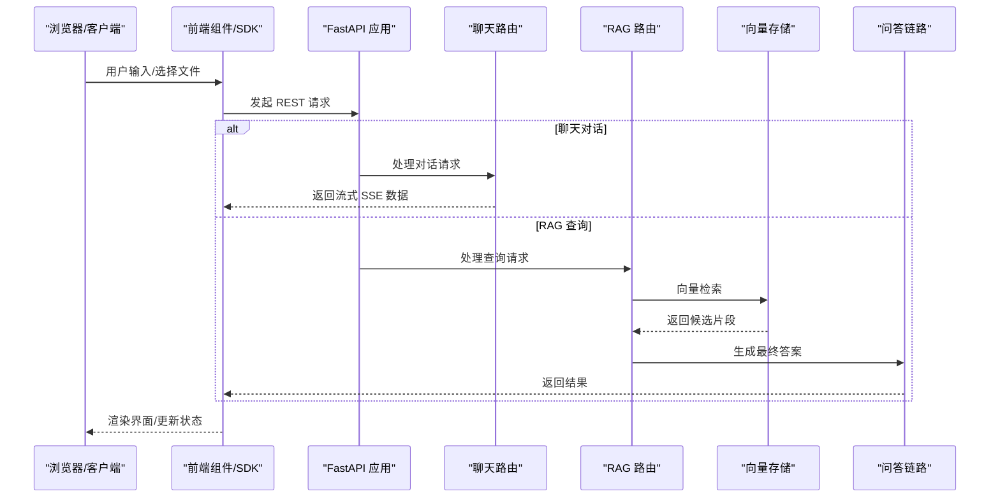
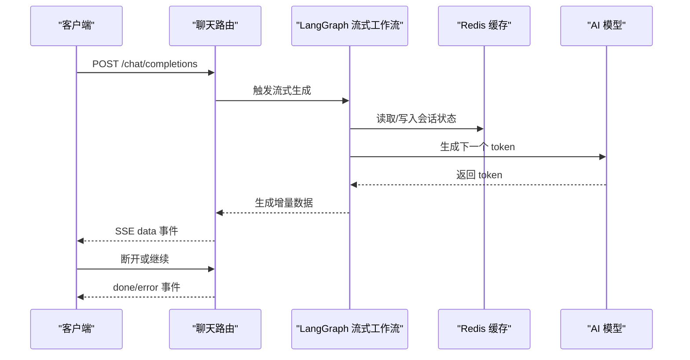
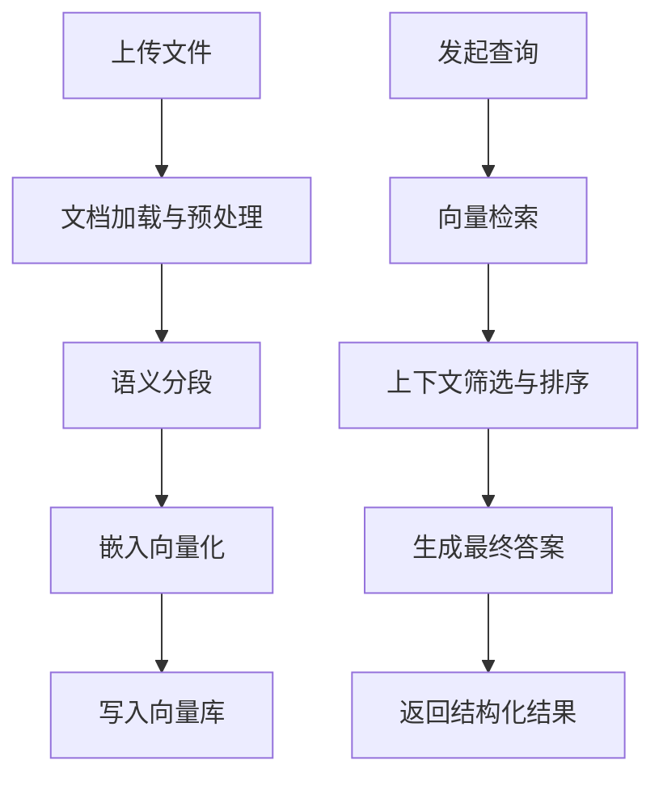
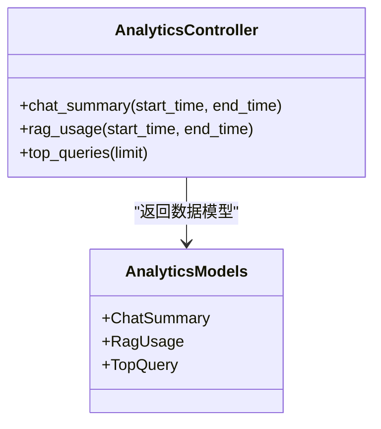
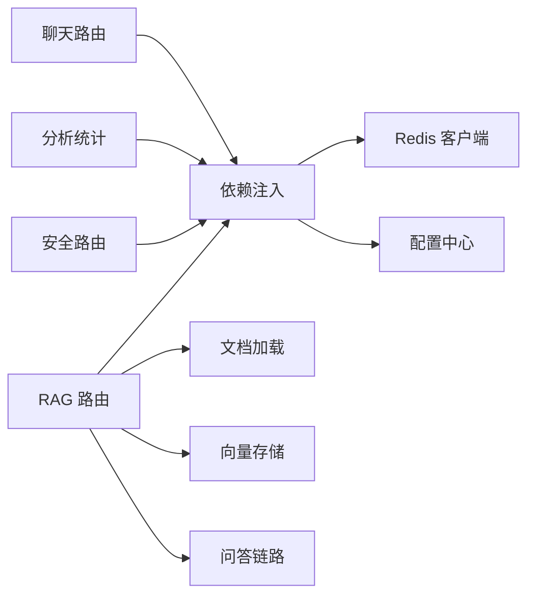

# API 接口文档

<cite>
**本文引用的文件**
- [backend/app/main.py](file://backend/app/main.py)
- [backend/app/routers/chat.py](file://backend/app/routers/chat.py)
- [backend/app/routers/rag.py](file://backend/app/routers/rag.py)
- [backend/app/api/analytics.py](file://backend/app/api/analytics.py)
- [backend/app/api/models.py](file://backend/app/api/models.py)
- [backend/app/api/rag_stats.py](file://backend/app/api/rag_stats.py)
- [backend/app/dependencies.py](file://backend/app/dependencies.py)
- [backend/app/security/router.py](file://backend/app/security/router.py)
- [backend/app/exceptions.py](file://backend/app/exceptions.py)
- [backend/app/config.py](file://backend/app/config.py)
- [backend/app/cache/redis_client.py](file://backend/app/cache/redis_client.py)
- [backend/app/rag/vector_store.py](file://backend/app/rag/vector_store.py)
- [backend/app/rag/loader.py](file://backend/app/rag/loader.py)
- [backend/app/rag/qa_chain.py](file://backend/app/rag/qa_chain.py)
- [backend/app/langgraph/streaming.py](file://backend/app/langgraph/streaming.py)
- [src/services/api.ts](file://src/services/api.ts)
- [src/services/rag.ts](file://src/services/rag.ts)
- [src/hooks/useChat.ts](file://src/hooks/useChat.ts)
- [src/components/search/StreamingAnswer.tsx](file://src/components/search/StreamingAnswer.tsx)
- [src/components/documents/DocumentUpload.tsx](file://src/components/documents/DocumentUpload.tsx)
- [src/pages/Search.tsx](file://src/pages/Search.tsx)
- [src/pages/Documents.tsx](file://src/pages/Documents.tsx)
- [src/types/message.ts](file://src/types/message.ts)
- [src/types/dashboard.ts](file://src/types/dashboard.ts)
</cite>

## 目录
1. [简介](#简介)
2. [项目结构](#项目结构)
3. [核心组件](#核心组件)
4. [架构总览](#架构总览)
5. [详细组件分析](#详细组件分析)
6. [依赖关系分析](#依赖关系分析)
7. [性能考量](#性能考量)
8. [故障排除指南](#故障排除指南)
9. [结论](#结论)
10. [附录](#附录)

## 简介
本文件为 Aureon 后端 RESTful API 的权威接口文档，覆盖聊天对话（含流式响应与 SSE）、RAG 文档管理（上传、索引、检索）、分析统计接口、认证与权限控制、错误码与异常处理、客户端 SDK 使用与最佳实践，以及 API 版本管理与迁移建议。文档面向开发者与集成方，既提供高层概览也包含代码级映射与可视化图示。

## 项目结构
后端采用 FastAPI 应用，路由按功能模块划分：聊天、RAG、分析统计、成本、安全等。前端通过 TypeScript/React 组件调用后端服务，类型定义位于 src/types 中。

**图表来源**
- [backend/app/main.py](file://backend/app/main.py)
- [backend/app/routers/chat.py](file://backend/app/routers/chat.py)
- [backend/app/routers/rag.py](file://backend/app/routers/rag.py)
- [backend/app/api/analytics.py](file://backend/app/api/analytics.py)
- [backend/app/security/router.py](file://backend/app/security/router.py)
- [backend/app/dependencies.py](file://backend/app/dependencies.py)
- [backend/app/rag/vector_store.py](file://backend/app/rag/vector_store.py)
- [backend/app/rag/loader.py](file://backend/app/rag/loader.py)
- [backend/app/rag/qa_chain.py](file://backend/app/rag/qa_chain.py)
- [src/services/api.ts](file://src/services/api.ts)
- [src/services/rag.ts](file://src/services/rag.ts)
- [src/hooks/useChat.ts](file://src/hooks/useChat.ts)
- [src/components/search/StreamingAnswer.tsx](file://src/components/search/StreamingAnswer.tsx)
- [src/components/documents/DocumentUpload.tsx](file://src/components/documents/DocumentUpload.tsx)

**章节来源**
- [backend/app/main.py](file://backend/app/main.py)
- [backend/app/routers/chat.py](file://backend/app/routers/chat.py)
- [backend/app/routers/rag.py](file://backend/app/routers/rag.py)
- [backend/app/api/analytics.py](file://backend/app/api/analytics.py)
- [backend/app/security/router.py](file://backend/app/security/router.py)

## 核心组件
- 应用入口与中间件：集中注册路由、异常处理器、CORS、健康检查等。
- 路由模块：按功能拆分，职责清晰，便于扩展与测试。
- 依赖注入：统一认证、权限校验、数据库连接、缓存等。
- 异常体系：标准化错误码、消息与上下文，便于前端统一处理。
- 前端 SDK：封装 fetch 请求、流式事件解析、类型约束与 Hook 封装。

**章节来源**
- [backend/app/main.py](file://backend/app/main.py)
- [backend/app/dependencies.py](file://backend/app/dependencies.py)
- [backend/app/exceptions.py](file://backend/app/exceptions.py)
- [src/services/api.ts](file://src/services/api.ts)
- [src/services/rag.ts](file://src/services/rag.ts)

## 架构总览
下图展示从浏览器到后端 API 的典型调用链，以及 RAG 流程中的数据流。

**图表来源**
- [backend/app/routers/chat.py](file://backend/app/routers/chat.py)
- [backend/app/routers/rag.py](file://backend/app/routers/rag.py)
- [backend/app/rag/vector_store.py](file://backend/app/rag/vector_store.py)
- [backend/app/rag/qa_chain.py](file://backend/app/rag/qa_chain.py)
- [src/components/search/StreamingAnswer.tsx](file://src/components/search/StreamingAnswer.tsx)
- [src/components/documents/DocumentUpload.tsx](file://src/components/documents/DocumentUpload.tsx)

## 详细组件分析

### 聊天接口（含流式响应与 SSE）
- 端点设计
  - POST /chat/completions：提交用户消息并获取流式回答
  - GET /chat/sse/{session_id}：SSE 连接，推送增量内容
- 请求参数
  - JSON 载荷：包含 session_id、messages（历史对话）、stream（布尔）等
  - 查询参数：GET /chat/sse/{session_id} 中的会话标识
- 响应格式
  - JSON：首次返回包含会话与初始标记
  - SSE：text/event-stream，事件类型包括 data、done、error
  - 消息字段：message_id、content、role、timestamp、metadata
- 流式机制
  - 后端基于 LangGraph 的 streaming 工作流，逐块生成 token
  - 前端使用 EventSource 或 fetch + ReadableStream 解析增量数据
  - 支持断线重连与错误恢复
- 错误处理
  - 会话不存在、消息格式非法、模型不可用、网络中断等场景均有明确错误码

**图表来源**
- [backend/app/routers/chat.py](file://backend/app/routers/chat.py)
- [backend/app/langgraph/streaming.py](file://backend/app/langgraph/streaming.py)
- [backend/app/cache/redis_client.py](file://backend/app/cache/redis_client.py)

**章节来源**
- [backend/app/routers/chat.py](file://backend/app/routers/chat.py)
- [backend/app/langgraph/streaming.py](file://backend/app/langgraph/streaming.py)
- [backend/app/cache/redis_client.py](file://backend/app/cache/redis_client.py)
- [src/hooks/useChat.ts](file://src/hooks/useChat.ts)
- [src/components/search/StreamingAnswer.tsx](file://src/components/search/StreamingAnswer.tsx)

### RAG 文档管理接口
- 文件上传
  - POST /rag/upload：multipart/form-data，支持多种文档格式
  - 返回：upload_id、文件元信息、异步处理状态
- 索引操作
  - POST /rag/index：触发对指定 upload_id 的索引构建
  - GET /rag/index/status/{task_id}：查询索引进度
- 查询接口
  - POST /rag/query：提交查询，返回带引用的结构化答案
  - GET /rag/query/history：获取最近查询历史
- 数据模型
  - 上传任务、索引状态、查询记录、引用片段等实体模型
- 内部流程
  - 文档加载 → 分段 → 向量化 → 写入向量库 → 查询时相似度检索 → 结果融合

**图表来源**
- [backend/app/routers/rag.py](file://backend/app/routers/rag.py)
- [backend/app/rag/loader.py](file://backend/app/rag/loader.py)
- [backend/app/rag/vector_store.py](file://backend/app/rag/vector_store.py)
- [backend/app/rag/qa_chain.py](file://backend/app/rag/qa_chain.py)

**章节来源**
- [backend/app/routers/rag.py](file://backend/app/routers/rag.py)
- [backend/app/rag/loader.py](file://backend/app/rag/loader.py)
- [backend/app/rag/vector_store.py](file://backend/app/rag/vector_store.py)
- [backend/app/rag/qa_chain.py](file://backend/app/rag/qa_chain.py)
- [src/components/documents/DocumentUpload.tsx](file://src/components/documents/DocumentUpload.tsx)
- [src/services/rag.ts](file://src/services/rag.ts)

### 分析统计接口
- 端点
  - GET /analytics/chat-summary：聊天统计摘要（时间范围、会话数、平均时长等）
  - GET /analytics/rag-usage：RAG 使用统计（查询次数、成功/失败率、平均耗时）
  - GET /analytics/top-queries：热门查询词 Top-N
- 时间范围查询
  - 支持 start_time、end_time 查询参数；默认最近 7 天
- 聚合计算
  - 分组聚合、百分位数、滑动窗口等
- 响应结构
  - 包含时间序列、指标卡片、热力图等前端友好的数据格式

**图表来源**
- [backend/app/api/analytics.py](file://backend/app/api/analytics.py)
- [backend/app/api/models.py](file://backend/app/api/models.py)

**章节来源**
- [backend/app/api/analytics.py](file://backend/app/api/analytics.py)
- [backend/app/api/models.py](file://backend/app/api/models.py)
- [src/types/dashboard.ts](file://src/types/dashboard.ts)

### 认证与权限控制
- 认证方式
  - JWT Bearer Token（Authorization: Bearer <token>）
  - 可选 Cookie 登录态（视部署配置而定）
- 权限模型
  - 全局依赖注入中校验用户身份与角色
  - 部分端点需要特定权限（如管理员功能）
- 安全路由
  - 所有受保护路由均通过安全路由器装饰
- 最佳实践
  - HTTPS 传输、短时效刷新令牌、最小权限原则

**章节来源**
- [backend/app/security/router.py](file://backend/app/security/router.py)
- [backend/app/dependencies.py](file://backend/app/dependencies.py)

### 错误码与异常处理
- 错误码策略
  - 1xx：客户端输入错误（参数缺失/格式错误）
  - 2xx：业务逻辑错误（权限不足/资源不存在）
  - 3xx：系统内部错误（服务不可用/超时）
- 异常定义
  - 自定义异常类，统一包装为标准响应结构
- 前端处理
  - SDK 对常见错误进行分类提示与重试策略

**章节来源**
- [backend/app/exceptions.py](file://backend/app/exceptions.py)
- [src/services/api.ts](file://src/services/api.ts)

## 依赖关系分析
- 模块耦合
  - 路由层仅依赖依赖注入与服务层，保持低耦合
  - RAG 子系统内聚良好，Loader/VectorStore/QA 明确分工
- 外部依赖
  - Redis：会话与缓存
  - 向量数据库：FAISS/Chroma（根据配置）
  - AI 平台：OpenAI/Ollama（可插拔）
- 循环依赖
  - 通过延迟导入与服务抽象避免循环依赖

**图表来源**
- [backend/app/routers/chat.py](file://backend/app/routers/chat.py)
- [backend/app/routers/rag.py](file://backend/app/routers/rag.py)
- [backend/app/api/analytics.py](file://backend/app/api/analytics.py)
- [backend/app/security/router.py](file://backend/app/security/router.py)
- [backend/app/dependencies.py](file://backend/app/dependencies.py)
- [backend/app/cache/redis_client.py](file://backend/app/cache/redis_client.py)
- [backend/app/config.py](file://backend/app/config.py)

**章节来源**
- [backend/app/dependencies.py](file://backend/app/dependencies.py)
- [backend/app/cache/redis_client.py](file://backend/app/cache/redis_client.py)
- [backend/app/config.py](file://backend/app/config.py)

## 性能考量
- 流式输出
  - SSE/Chunked Transfer-Encoding 减少首字节延迟
  - 前端按事件增量渲染，提升感知性能
- 缓存策略
  - Redis 缓存会话状态与常用查询结果
  - 向量检索前先做关键词过滤，降低向量搜索规模
- 并发与限流
  - 基于令牌桶的速率限制，防止突发流量
- 模型推理优化
  - 提示词压缩、KV 缓存、批处理候选片段

## 故障排除指南
- 常见问题
  - SSE 连接断开：检查网络稳定性与后端心跳设置
  - RAG 查询无结果：确认索引是否完成、分段是否合理
  - 401/403：核对 Authorization 头与用户权限
- 排查步骤
  - 查看后端日志与追踪 ID
  - 使用 /health 检查服务可用性
  - 在前端控制台观察 SDK 返回的错误码与消息

**章节来源**
- [backend/app/exceptions.py](file://backend/app/exceptions.py)
- [src/services/api.ts](file://src/services/api.ts)

## 结论
Aureon 的 API 设计遵循模块化与可扩展原则，聊天接口提供流畅的流式体验，RAG 接口覆盖完整的文档生命周期，分析统计接口满足运营与产品需求。配合完善的认证、异常与性能策略，能够支撑生产环境的稳定运行。

## 附录

### API 端点一览（按模块）
- 聊天
  - POST /chat/completions
  - GET /chat/sse/{session_id}
- RAG
  - POST /rag/upload
  - POST /rag/index
  - GET /rag/index/status/{task_id}
  - POST /rag/query
  - GET /rag/query/history
- 分析统计
  - GET /analytics/chat-summary
  - GET /analytics/rag-usage
  - GET /analytics/top-queries
- 安全
  - 登录/登出相关端点（由安全路由提供）

**章节来源**
- [backend/app/routers/chat.py](file://backend/app/routers/chat.py)
- [backend/app/routers/rag.py](file://backend/app/routers/rag.py)
- [backend/app/api/analytics.py](file://backend/app/api/analytics.py)
- [backend/app/security/router.py](file://backend/app/security/router.py)

### 客户端 SDK 使用与最佳实践
- SDK 初始化
  - 设置 base_url、默认 headers（含 Authorization）
- 聊天
  - 使用 fetch + ReadableStream 或 EventSource 处理 SSE
  - 实现断线重连与错误提示
- RAG
  - 上传完成后轮询索引状态，再发起查询
  - 对查询结果进行二次加工（去重、排序、高亮）
- 类型约束
  - 前端类型定义与后端模型保持一致，减少契约漂移

**章节来源**
- [src/services/api.ts](file://src/services/api.ts)
- [src/services/rag.ts](file://src/services/rag.ts)
- [src/hooks/useChat.ts](file://src/hooks/useChat.ts)
- [src/types/message.ts](file://src/types/message.ts)
- [src/types/dashboard.ts](file://src/types/dashboard.ts)

### API 版本管理与迁移
- 版本策略
  - URL 前缀版本化（/v1/...），保留旧版本若干周期
- 向后兼容
  - 新增字段采用可选，不破坏现有客户端
- 迁移指导
  - 提前发布迁移公告，提供自动化脚本与兼容层
  - 逐步引导客户端升级，监控错误率与性能指标

**章节来源**
- [backend/app/main.py](file://backend/app/main.py)
- [backend/app/config.py](file://backend/app/config.py)