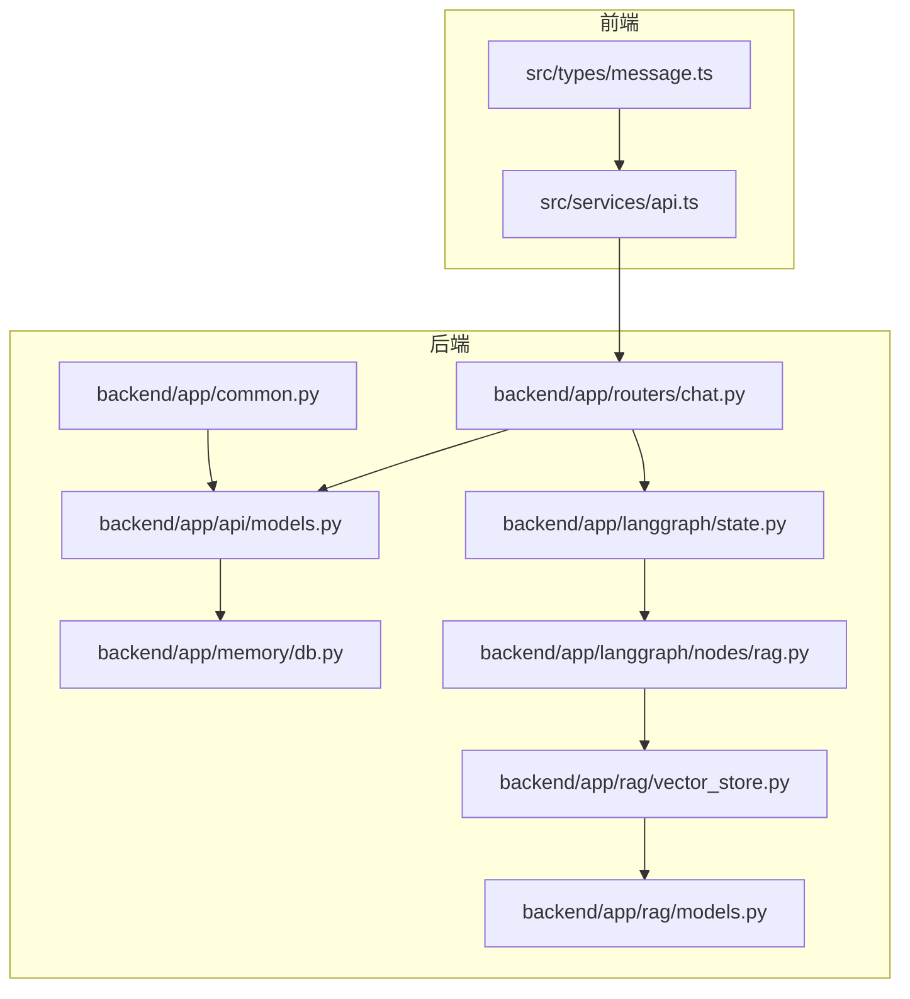
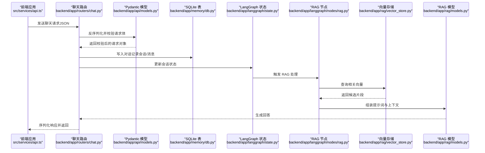
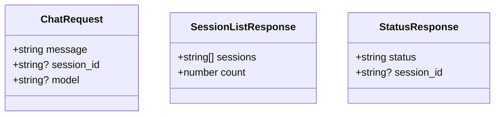
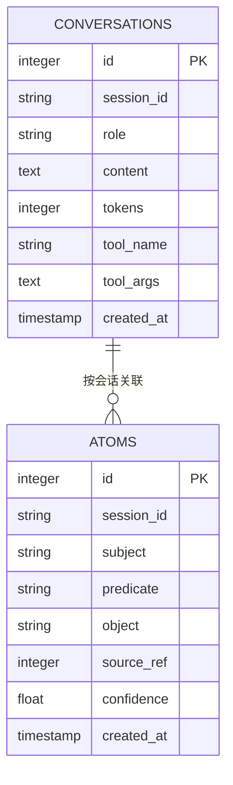
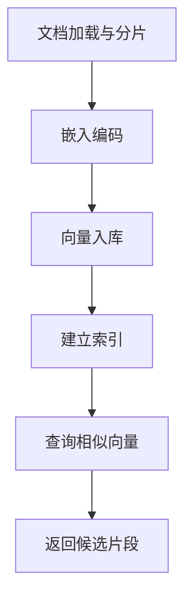
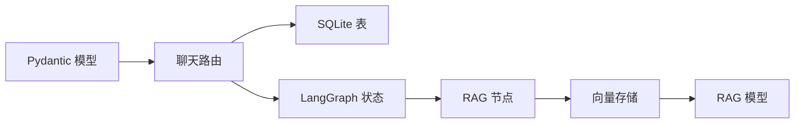

# API 数据模型

<cite>
**本文引用的文件**
- [backend/app/api/models.py](file://backend/app/api/models.py)
- [backend/tests/test_input_validation.py](file://backend/tests/test_input_validation.py)
- [backend/app/memory/db.py](file://backend/app/memory/db.py)
- [backend/app/common.py](file://backend/app/common.py)
- [src/types/message.ts](file://src/types/message.ts)
- [src/services/api.ts](file://src/services/api.ts)
- [backend/app/routers/chat.py](file://backend/app/routers/chat.py)
- [backend/app/rag/models.py](file://backend/app/rag/models.py)
- [backend/app/rag/vector_store.py](file://backend/app/rag/vector_store.py)
- [backend/app/langgraph/state.py](file://backend/app/langgraph/state.py)
- [backend/app/langgraph/nodes/rag.py](file://backend/app/langgraph/nodes/rag.py)
</cite>

## 目录
1. [简介](#简介)
2. [项目结构](#项目结构)
3. [核心组件](#核心组件)
4. [架构总览](#架构总览)
5. [详细组件分析](#详细组件分析)
6. [依赖分析](#依赖分析)
7. [性能考虑](#性能考虑)
8. [故障排查指南](#故障排查指南)
9. [结论](#结论)
10. [附录](#附录)

## 简介
本文件系统性梳理了本项目的 API 数据模型，覆盖聊天请求与响应、消息格式、会话状态与用户上下文、文档元数据、向量数据与索引信息等。文档同时给出前端 TypeScript 类型定义、后端 Pydantic 模型以及数据库模型之间的对应关系，并提供数据流转示例、序列化/反序列化流程、校验机制、默认值与字段转换规则，以及版本管理、向后兼容与迁移策略建议。

## 项目结构
围绕数据模型的关键位置如下：
- 后端 Pydantic 模型：用于输入输出的强类型定义与校验
- 前端 TypeScript 类型：用于前端与后端接口契约一致
- 数据库表结构：用于持久化消息、原子事实与索引
- RAG 与向量存储：用于文档元数据与向量索引
- 路由与流式处理：用于数据在系统内的流转

图表来源
- [backend/app/routers/chat.py](file://backend/app/routers/chat.py)
- [backend/app/api/models.py](file://backend/app/api/models.py)
- [backend/app/memory/db.py](file://backend/app/memory/db.py)
- [backend/app/rag/vector_store.py](file://backend/app/rag/vector_store.py)
- [backend/app/rag/models.py](file://backend/app/rag/models.py)
- [backend/app/langgraph/state.py](file://backend/app/langgraph/state.py)
- [backend/app/langgraph/nodes/rag.py](file://backend/app/langgraph/nodes/rag.py)
- [src/services/api.ts](file://src/services/api.ts)
- [src/types/message.ts](file://src/types/message.ts)

章节来源
- [backend/app/api/models.py:1-32](file://backend/app/api/models.py#L1-L32)
- [backend/app/memory/db.py:35-62](file://backend/app/memory/db.py#L35-L62)
- [src/types/message.ts](file://src/types/message.ts)
- [src/services/api.ts](file://src/services/api.ts)

## 核心组件
本节聚焦于聊天请求与响应、消息格式、会话状态与用户上下文、文档元数据、向量数据与索引信息的核心数据模型。

- 聊天请求模型（Pydantic）
  - 字段与约束
    - message: 非空字符串，最小长度 1，最大长度 2000；前后空白将被自动去除，仅空白字符将被拒绝
    - session_id: 可选字符串，用于标识会话
    - model: 可选字符串，表示模型名称（如来自模型注册表的名称）
  - 校验规则
    - 自定义字段校验器对 message 进行清洗与校验
    - 测试用例覆盖空字符串、仅空白、最大长度与正常输入场景
- 会话列表与状态响应模型
  - sessions: 会话 ID 列表
  - count: 会照数量
  - status: 服务状态
  - session_id: 当前会话 ID（可选）

章节来源
- [backend/app/api/models.py:5-32](file://backend/app/api/models.py#L5-L32)
- [backend/tests/test_input_validation.py:77-104](file://backend/tests/test_input_validation.py#L77-L104)

## 架构总览
下图展示了从前端到后端、再到数据库与 RAG 索引的数据流路径，以及各层数据模型的对应关系。

图表来源
- [backend/app/routers/chat.py](file://backend/app/routers/chat.py)
- [backend/app/api/models.py:5-32](file://backend/app/api/models.py#L5-L32)
- [backend/app/memory/db.py:35-62](file://backend/app/memory/db.py#L35-L62)
- [backend/app/langgraph/state.py](file://backend/app/langgraph/state.py)
- [backend/app/langgraph/nodes/rag.py](file://backend/app/langgraph/nodes/rag.py)
- [backend/app/rag/vector_store.py](file://backend/app/rag/vector_store.py)
- [backend/app/rag/models.py](file://backend/app/rag/models.py)

## 详细组件分析

### 聊天请求与响应数据模型
- 请求模型（Pydantic）
  - 字段
    - message: 字符串，长度限制 1..2000；前后空白去除，仅空白拒绝
    - session_id: 字符串（可选）
    - model: 字符串（可选）
  - 校验与转换
    - 自定义字段校验器执行清洗与非空校验
    - 测试覆盖空字符串、仅空白、最大长度与正常输入
- 响应模型（Pydantic）
  - sessions: 会话 ID 列表
  - count: 会话数量
  - status: 服务状态字符串
  - session_id: 当前会话 ID（可选）

图表来源
- [backend/app/api/models.py:5-32](file://backend/app/api/models.py#L5-L32)

章节来源
- [backend/app/api/models.py:5-32](file://backend/app/api/models.py#L5-L32)
- [backend/tests/test_input_validation.py:77-104](file://backend/tests/test_input_validation.py#L77-L104)

### 消息格式与会话状态
- 消息持久化
  - 表结构包含会话 ID、角色、内容、token 计数、工具调用信息与时间戳
  - 为会话 ID 建立索引以支持查询优化
- 会话状态
  - LangGraph 状态机维护当前会话上下文，包括历史消息、工具调用状态与待处理任务
  - RAG 节点根据状态决定是否触发检索增强生成

图表来源
- [backend/app/memory/db.py:35-62](file://backend/app/memory/db.py#L35-L62)

章节来源
- [backend/app/memory/db.py:35-62](file://backend/app/memory/db.py#L35-L62)
- [backend/app/langgraph/state.py](file://backend/app/langgraph/state.py)
- [backend/app/langgraph/nodes/rag.py](file://backend/app/langgraph/nodes/rag.py)

### 文档元数据、向量数据与索引
- 文档元数据
  - 包含标题、来源、摘要、标签等字段，用于检索与排序
- 向量数据
  - 文档分片经嵌入模型编码为向量，存储于向量数据库或内存索引中
- 索引信息
  - 支持基于语义相似度的快速检索，结合过滤条件与重排策略

图表来源
- [backend/app/rag/vector_store.py](file://backend/app/rag/vector_store.py)
- [backend/app/rag/models.py](file://backend/app/rag/models.py)

章节来源
- [backend/app/rag/vector_store.py](file://backend/app/rag/vector_store.py)
- [backend/app/rag/models.py](file://backend/app/rag/models.py)

### 前端 TypeScript 类型定义与后端模型映射
- 前端类型
  - 与后端 Pydantic 模型保持字段名与类型一致，确保序列化/反序列化一致性
- 映射关系
  - ChatRequest ↔ 前端请求类型
  - SessionListResponse / StatusResponse ↔ 前端响应类型

章节来源
- [src/types/message.ts](file://src/types/message.ts)
- [src/services/api.ts](file://src/services/api.ts)
- [backend/app/api/models.py:5-32](file://backend/app/api/models.py#L5-L32)

### 数据流转示例与序列化/反序列化
- 请求序列化
  - 前端将请求对象序列化为 JSON 并发送至后端
- 校验与转换
  - 后端使用 Pydantic 模型进行反序列化与字段校验，执行自定义清洗逻辑
- 响应序列化
  - 后端将响应对象序列化为 JSON 返回给前端
- 数据库写入
  - 对话记录写入 SQLite 表，LangGraph 状态更新，必要时写入原子事实表

章节来源
- [src/services/api.ts](file://src/services/api.ts)
- [backend/app/api/models.py:5-32](file://backend/app/api/models.py#L5-L32)
- [backend/app/memory/db.py:35-62](file://backend/app/memory/db.py#L35-L62)
- [backend/app/common.py:43-45](file://backend/app/common.py#L43-L45)

### 数据校验机制、默认值与字段转换
- 校验机制
  - Pydantic 字段级约束（长度、类型）
  - 自定义字段校验器（message 清洗与非空检查）
  - 单元测试覆盖典型边界与异常场景
- 默认值
  - session_id 与 model 为可选，默认 None
- 字段转换
  - message 前后空白去除，仅空白拒绝
  - rows_to_models 工具函数将数据库行转换为 Pydantic 模型实例

章节来源
- [backend/app/api/models.py:5-32](file://backend/app/api/models.py#L5-L32)
- [backend/tests/test_input_validation.py:77-104](file://backend/tests/test_input_validation.py#L77-L104)
- [backend/app/common.py:43-45](file://backend/app/common.py#L43-L45)

### 版本管理、向后兼容与迁移策略
- 版本管理
  - 通过 Pydantic 模型的字段命名与可选性控制版本演进
  - 在路由层对新增字段进行兼容处理（如默认值与可选字段）
- 向后兼容
  - 新增字段采用可选与默认值策略，避免破坏既有客户端
- 迁移策略
  - 数据库迁移采用增量脚本，先添加列/索引，再回填数据
  - 对象模型变更通过向后兼容的字段映射与转换函数处理

章节来源
- [backend/app/api/models.py:5-32](file://backend/app/api/models.py#L5-L32)
- [backend/app/memory/db.py:35-62](file://backend/app/memory/db.py#L35-L62)
- [backend/app/common.py:43-45](file://backend/app/common.py#L43-L45)

## 依赖分析
- 组件耦合
  - 路由依赖 Pydantic 模型进行输入校验
  - LangGraph 状态与 RAG 节点依赖向量存储与模型配置
  - 数据库层提供持久化能力，索引提升检索效率
- 外部依赖
  - Pydantic 提供数据校验与序列化
  - SQLite 提供轻量级持久化
  - 向量存储提供语义检索能力

图表来源
- [backend/app/api/models.py:5-32](file://backend/app/api/models.py#L5-L32)
- [backend/app/routers/chat.py](file://backend/app/routers/chat.py)
- [backend/app/memory/db.py:35-62](file://backend/app/memory/db.py#L35-L62)
- [backend/app/langgraph/state.py](file://backend/app/langgraph/state.py)
- [backend/app/langgraph/nodes/rag.py](file://backend/app/langgraph/nodes/rag.py)
- [backend/app/rag/vector_store.py](file://backend/app/rag/vector_store.py)
- [backend/app/rag/models.py](file://backend/app/rag/models.py)

## 性能考虑
- 输入校验前置
  - 在路由层尽早进行字段校验与清洗，减少后续处理开销
- 索引优化
  - 为会话 ID 建立索引，加速查询与聚合
- 向量化与检索
  - 控制分片大小与嵌入维度，平衡精度与性能
  - 使用批量查询与缓存策略降低延迟

## 故障排查指南
- 常见问题
  - message 为空或仅空白：会被拒绝；请确保输入有效文本
  - 超长消息：超过最大长度将被拒绝；请拆分或压缩输入
  - 会话查询失败：检查会话 ID 是否正确，确认索引是否存在
- 定位方法
  - 查看后端日志中的校验错误与异常堆栈
  - 使用单元测试覆盖的边界场景复现问题
  - 检查数据库索引与表结构是否完整

章节来源
- [backend/tests/test_input_validation.py:77-104](file://backend/tests/test_input_validation.py#L77-L104)
- [backend/app/memory/db.py:35-62](file://backend/app/memory/db.py#L35-L62)

## 结论
本文件建立了从前端类型定义到后端 Pydantic 模型、数据库表结构与 RAG 索引的完整数据模型体系。通过严格的输入校验、清晰的字段转换与完善的测试覆盖，确保了系统的稳定性与可维护性。建议在后续迭代中持续完善版本管理与迁移策略，保障向后兼容与平滑升级。

## 附录
- 关键实现参考
  - 聊天请求模型与校验：[backend/app/api/models.py:5-32](file://backend/app/api/models.py#L5-L32)
  - 输入校验测试：[backend/tests/test_input_validation.py:77-104](file://backend/tests/test_input_validation.py#L77-L104)
  - 数据库初始化与索引：[backend/app/memory/db.py:35-62](file://backend/app/memory/db.py#L35-L62)
  - 数据库行转模型工具：[backend/app/common.py:43-45](file://backend/app/common.py#L43-L45)
  - 前端类型与服务：[src/types/message.ts](file://src/types/message.ts), [src/services/api.ts](file://src/services/api.ts)
  - LangGraph 状态与 RAG 节点：[backend/app/langgraph/state.py](file://backend/app/langgraph/state.py), [backend/app/langgraph/nodes/rag.py](file://backend/app/langgraph/nodes/rag.py)
  - 向量存储与 RAG 模型：[backend/app/rag/vector_store.py](file://backend/app/rag/vector_store.py), [backend/app/rag/models.py](file://backend/app/rag/models.py)