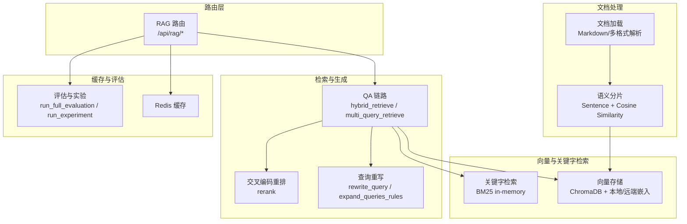
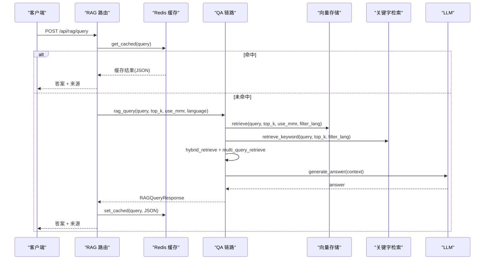
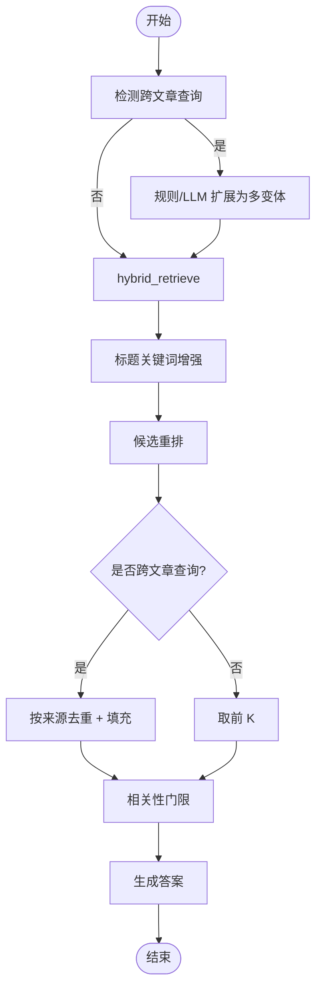
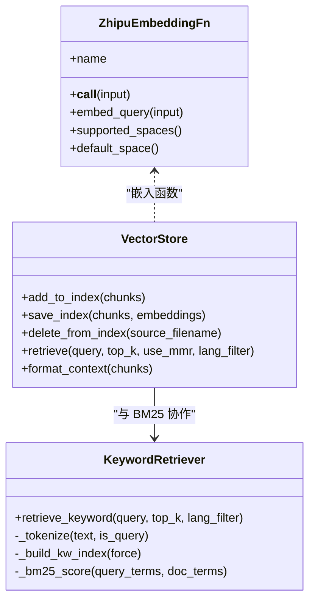
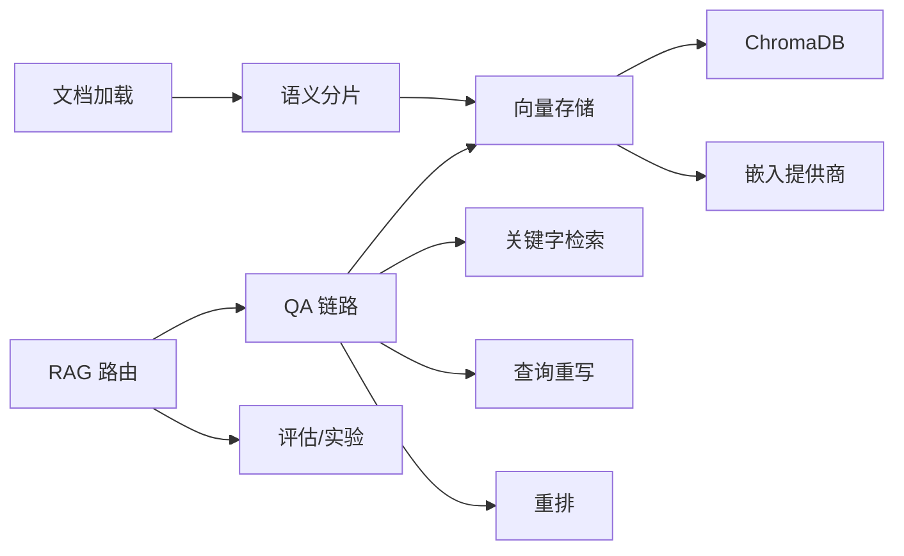

# RAG 接口

<cite>
**本文引用的文件**
- [backend/app/routers/rag.py](file://backend/app/routers/rag.py)
- [backend/app/rag/vector_store.py](file://backend/app/rag/vector_store.py)
- [backend/app/rag/models.py](file://backend/app/rag/models.py)
- [backend/app/rag/qa_chain.py](file://backend/app/rag/qa_chain.py)
- [backend/app/rag/loader.py](file://backend/app/rag/loader.py)
- [backend/app/rag/query_rewriter.py](file://backend/app/rag/query_rewriter.py)
- [backend/app/rag/semantic_splitter.py](file://backend/app/rag/semantic_splitter.py)
- [backend/app/rag/guardrails.py](file://backend/app/rag/guardrails.py)
- [backend/app/rag/test_data.py](file://backend/app/rag/test_data.py)
- [backend/app/api/models.py](file://backend/app/api/models.py)
</cite>

## 目录
1. [简介](#简介)
2. [项目结构](#项目结构)
3. [核心组件](#核心组件)
4. [架构总览](#架构总览)
5. [详细组件分析](#详细组件分析)
6. [依赖分析](#依赖分析)
7. [性能考量](#性能考量)
8. [故障排查指南](#故障排查指南)
9. [结论](#结论)
10. [附录](#附录)

## 简介
本文件为 RAG 相关 API 的权威文档，覆盖文档管理（上传、增量索引、查询）、向量存储 CRUD、文档分片与元数据管理、混合检索（BM25 + 语义检索）、查询重写、MMR 重排序与结果过滤、Redis 缓存与流式查询、评估与实验、以及最佳实践与性能优化策略。读者可据此快速理解并正确使用 RAG 接口。

## 项目结构
RAG 功能主要由后端 FastAPI 路由、检索与生成链路、向量存储与关键字检索、文档加载与分片、查询改写与重排、守卫与评估等模块构成。路由层负责对外暴露 REST 接口，内部通过 QA 链路协调检索、重排、生成与缓存。

图表来源
- [backend/app/routers/rag.py](file://backend/app/routers/rag.py)
- [backend/app/rag/qa_chain.py](file://backend/app/rag/qa_chain.py)
- [backend/app/rag/vector_store.py](file://backend/app/rag/vector_store.py)
- [backend/app/rag/loader.py](file://backend/app/rag/loader.py)
- [backend/app/rag/query_rewriter.py](file://backend/app/rag/query_rewriter.py)
- [backend/app/rag/semantic_splitter.py](file://backend/app/rag/semantic_splitter.py)

章节来源
- [backend/app/routers/rag.py](file://backend/app/routers/rag.py)
- [backend/app/rag/qa_chain.py](file://backend/app/rag/qa_chain.py)
- [backend/app/rag/vector_store.py](file://backend/app/rag/vector_store.py)
- [backend/app/rag/loader.py](file://backend/app/rag/loader.py)
- [backend/app/rag/query_rewriter.py](file://backend/app/rag/query_rewriter.py)
- [backend/app/rag/semantic_splitter.py](file://backend/app/rag/semantic_splitter.py)

## 核心组件
- 路由与接口
  - 查询接口：POST /api/rag/query（含 Redis 缓存）、POST /api/rag/query/stream（SSE 流式）
  - 索引接口：POST /api/rag/index（重建索引）、GET /api/rag/index/status（索引健康检查）
  - 文档管理：POST /api/rag/upload（上传并增量索引）、GET /api/rag/uploads（列出上传文件）、DELETE /api/rag/upload/{filename}（删除并清理索引）
  - 评估与实验：POST /api/rag/evaluate、POST /api/rag/experiment
  - 健康检查与基准：GET /api/rag/health、GET /api/rag/benchmark
  - 缓存清理：POST /api/rag/cache/clear
  - 建议查询：GET /api/rag/suggestions
- 数据模型
  - RAGQueryRequest：查询参数（query、top_k、use_mmr、language、model）
  - RAGQueryResponse：答案与来源
  - RAGIndexResponse：索引统计
  - RAGUploadResponse：上传与索引结果
- 检索与生成
  - hybrid_retrieve：BM25 + 向量检索，RRF 融合，标题增强，候选重排，多样性选择
  - multi_query_retrieve：跨文章查询的多变体重排
  - rag_query / rag_query_astream：完整 RAG 管道（检索→格式化→生成→负样本判定）
  - rag_query_with_cache：带 Redis 语义缓存的查询
- 向量存储与关键字检索
  - ChromaDB 持久化向量库，ZhipuEmbeddingFn 多提供商嵌入
  - retrieve/retrieve_keyword：向量检索与 BM25 关键词检索
  - format_context：上下文格式化（父子块）
  - _simple_diversity：轻量 MMR 多样性（按来源去重）
- 文档加载与分片
  - loader：Markdown/多格式文档加载与元数据解析
  - semantic_splitter：中文语义分片（句子边界 + 百分位断点）
- 查询重写与重排
  - query_rewriter：规则与 LLM 双通道查询扩展
  - rerank：交叉编码重排（懒加载）
- 守卫与评估
  - guardrails：幻觉检测与引用校验
  - test_data：评测数据集与实验策略

章节来源
- [backend/app/routers/rag.py](file://backend/app/routers/rag.py)
- [backend/app/rag/models.py](file://backend/app/rag/models.py)
- [backend/app/rag/qa_chain.py](file://backend/app/rag/qa_chain.py)
- [backend/app/rag/vector_store.py](file://backend/app/rag/vector_store.py)
- [backend/app/rag/loader.py](file://backend/app/rag/loader.py)
- [backend/app/rag/query_rewriter.py](file://backend/app/rag/query_rewriter.py)
- [backend/app/rag/semantic_splitter.py](file://backend/app/rag/semantic_splitter.py)
- [backend/app/rag/guardrails.py](file://backend/app/rag/guardrails.py)
- [backend/app/rag/test_data.py](file://backend/app/rag/test_data.py)
- [backend/app/api/models.py](file://backend/app/api/models.py)

## 架构总览
RAG 查询从路由进入，经缓存命中判定，若未命中则执行 hybrid 检索（BM25 + 向量），随后进行标题增强、候选重排与多样性选择，生成阶段基于上下文回答问题，并在流式场景中逐步产出 token 与引用事件。索引流程包含文档加载、语义分片、嵌入与写入向量库，以及关键字索引重建。

图表来源
- [backend/app/routers/rag.py](file://backend/app/routers/rag.py)
- [backend/app/rag/qa_chain.py](file://backend/app/rag/qa_chain.py)
- [backend/app/rag/vector_store.py](file://backend/app/rag/vector_store.py)

## 详细组件分析

### 路由与接口
- 查询与流式查询
  - /api/rag/query：带 Redis 缓存的同步查询，支持 top_k、use_mmr、language、model 参数
  - /api/rag/query/stream：SSE 流式查询，先产出 sources/citation，再流式输出 answer token，支持缓存命中与统计上报
- 索引与状态
  - /api/rag/index：重建索引（启用上下文检索），清理缓存，强制重建 BM25
  - /api/rag/index/status：返回索引健康状态（文件数 vs 索引数、是否陈旧）
- 文档管理
  - /api/rag/upload：上传文件（.md/.txt/.pdf/.docx/.xlsx），安全校验与大小限制，增量索引，更新元数据（language/title）
  - /api/rag/uploads：列出上传文件
  - /api/rag/upload/{filename}：删除上传文件并清理向量索引
- 评估与实验
  - /api/rag/evaluate：全量评估（召回、可信度、延迟）
  - /api/rag/experiment：提示策略实验
- 健康与基准
  - /api/rag/health：系统健康、嵌入提供商、BM25 统计、Guardrails 状态
  - /api/rag/benchmark：加载基准结果
- 缓存与建议
  - /api/rag/cache/clear：清空缓存
  - /api/rag/suggestions：返回知识库主题相关的建议查询

章节来源
- [backend/app/routers/rag.py](file://backend/app/routers/rag.py)

### 检索与生成链路
- hybrid_retrieve
  - 并行执行 BM25 与向量检索，去重后用 RRF 融合，标题关键词增强，候选重排，最后按需进行多样性选择
  - 支持预阈值过滤与相关性门限
- multi_query_retrieve
  - 对跨文章查询进行规则扩展（或 LLM 扩展），对各变体结果做 RRF 融合与多样性选择
- rag_query / rag_query_astream
  - 负样本判定（关键词启发 + LLM 分类器），格式化上下文，生成答案，流式版本产出 citation 事件
- rag_query_with_cache
  - 语义缓存命中直接返回，未命中则生成并缓存 JSON（answer + sources）

图表来源
- [backend/app/rag/qa_chain.py](file://backend/app/rag/qa_chain.py)

章节来源
- [backend/app/rag/qa_chain.py](file://backend/app/rag/qa_chain.py)

### 向量存储与关键字检索
- 向量存储
  - ChromaDB 持久化集合，ZhipuEmbeddingFn 多提供商嵌入（本地 BGE → DashScope → SiliconFlow → Zhipu），支持缓存与降维回退
  - add_to_index / save_index / load_index / delete_from_index：增量/全量写入与删除
  - retrieve：向量检索，支持语言过滤与 MMR 轻量多样性
- 关键字检索（BM25）
  - _tokenize：中文分词 + 停用词过滤，英文单词与数字保留
  - _build_kw_index：预构建内存索引，加速检索
  - retrieve_keyword：BM25 评分、最小原始分数过滤、归一化
- 上下文格式化
  - format_context：优先使用父块（Parent-Child）丰富上下文，去重父块

图表来源
- [backend/app/rag/vector_store.py](file://backend/app/rag/vector_store.py)

章节来源
- [backend/app/rag/vector_store.py](file://backend/app/rag/vector_store.py)

### 文档加载与分片
- loader
  - 支持 .md/.txt/.pdf/.docx/.xlsx，解析 frontmatter，检测语言，生成元数据（source/title/slug/tags/category/language/filepath/uploaded）
- semantic_splitter
  - 中文语义分片：按句（。！？；\n 与 Markdown 标题）切分，使用嵌入余弦相似度检测主题边界，百分位阈值断点，控制最大/最小块大小，必要时回退为段落切分

章节来源
- [backend/app/rag/loader.py](file://backend/app/rag/loader.py)
- [backend/app/rag/semantic_splitter.py](file://backend/app/rag/semantic_splitter.py)

### 查询重写与重排
- query_rewriter
  - 规则扩展（中文“和/与/以及”、英文“ and / vs / versus ”等分隔符）与 LLM 扩展，返回改写主查询与若干变体
- rerank
  - 交叉编码重排（懒加载），对候选进行精细重排

章节来源
- [backend/app/rag/query_rewriter.py](file://backend/app/rag/query_rewriter.py)
- [backend/app/rag/vector_store.py](file://backend/app/rag/vector_store.py)

### 守卫与评估
- guardrails
  - 幻觉检测（评分与标志）、引用提取与校验
- test_data
  - 评测数据集（事实/推理/综合/否定/跨文章），用于评估与实验

章节来源
- [backend/app/rag/guardrails.py](file://backend/app/rag/guardrails.py)
- [backend/app/rag/test_data.py](file://backend/app/rag/test_data.py)

## 依赖分析
- 路由依赖 QA 链路与向量存储，QA 链路依赖检索（向量 + BM25）、重写、重排与 LLM
- 向量存储依赖 ChromaDB 与嵌入提供商（本地/远端），并维护 BM25 关键字索引
- 文档处理依赖加载器与语义分片，服务于索引写入
- 评估与实验依赖评测数据集与 QA 链路

图表来源
- [backend/app/routers/rag.py](file://backend/app/routers/rag.py)
- [backend/app/rag/qa_chain.py](file://backend/app/rag/qa_chain.py)
- [backend/app/rag/vector_store.py](file://backend/app/rag/vector_store.py)
- [backend/app/rag/loader.py](file://backend/app/rag/loader.py)
- [backend/app/rag/semantic_splitter.py](file://backend/app/rag/semantic_splitter.py)

章节来源
- [backend/app/routers/rag.py](file://backend/app/routers/rag.py)
- [backend/app/rag/qa_chain.py](file://backend/app/rag/qa_chain.py)
- [backend/app/rag/vector_store.py](file://backend/app/rag/vector_store.py)
- [backend/app/rag/loader.py](file://backend/app/rag/loader.py)
- [backend/app/rag/semantic_splitter.py](file://backend/app/rag/semantic_splitter.py)

## 性能考量
- 检索性能
  - BM25 关键字检索（无嵌入 API）<10ms，适合首 token 低延迟场景
  - 向量检索支持 MMR 轻量多样性，避免重复来源
  - RRF 融合与标题增强提升召回与相关性
- 缓存策略
  - Redis 语义缓存（JSON 存储 answer + sources），命中即返回，未命中写入
  - SSE 流式输出支持缓冲与首字延迟优化
- 嵌入与索引
  - 本地 BGE 优先，失败自动回退至远端提供商；嵌入结果缓存于内存与 Redis
  - 索引重建时清理缓存并强制重建 BM25
- 语言与过滤
  - 支持按语言过滤，减少无关文档参与检索
- 评估与监控
  - 健康检查暴露 BM25 统计、嵌入提供商状态、Guardrails 状态，便于运维观测

[本节为通用性能讨论，不直接分析具体文件]

## 故障排查指南
- LLM 未配置
  - 现象：查询报 503
  - 处理：设置 LLM_API_KEY 或 FALLBACK_API_KEY
- 索引为空或陈旧
  - 现象：查询缺乏上下文或返回为空
  - 处理：调用 POST /api/rag/index 重建索引；使用 /api/rag/index/status 检查健康状态
- 嵌入维度不匹配
  - 现象：向量检索报维度错误
  - 处理：系统自动切换到 API 嵌入并清除错误缓存；或设置 SKIP_LOCAL_EMBED
- 文件上传失败
  - 现象：400/413/500
  - 处理：检查文件名、格式（.md/.txt/.pdf/.docx/.xlsx）、大小限制（10MB）、API Key（博客同步）
- 缓存异常
  - 现象：缓存未生效或清理失败
  - 处理：调用 /api/rag/cache/clear 清理；检查 Redis 连接
- 查询无结果
  - 现象：返回“无相关内容”
  - 处理：增大 top_k、关闭 use_mmr、检查语言过滤、确认索引是否重建

章节来源
- [backend/app/routers/rag.py](file://backend/app/routers/rag.py)
- [backend/app/rag/vector_store.py](file://backend/app/rag/vector_store.py)

## 结论
本 RAG 接口体系以“路由 + QA 链路 + 向量与关键字检索 + 文档处理 + 缓存与评估”为核心，提供从文档上传到查询生成的完整闭环。通过混合检索、查询重写、标题增强、候选重排与多样性选择，系统在准确性与效率之间取得良好平衡；通过 Redis 缓存与流式输出进一步优化用户体验。建议在生产环境中结合健康检查与评估指标持续优化索引与检索策略。

[本节为总结性内容，不直接分析具体文件]

## 附录

### API 调用示例与参数说明
- 查询（同步）
  - 方法：POST /api/rag/query
  - 参数：query（必填，1-1000字符）、top_k（1-20，默认3）、use_mmr（布尔，默认True）、language（可选："zh"/"en"）、model（可选）
  - 返回：answer（字符串）、sources（来源列表）
- 查询（流式）
  - 方法：POST /api/rag/query/stream
  - 参数：同上
  - 返回：SSE 事件（sources → citation → text → done）
- 索引重建
  - 方法：POST /api/rag/index
  - 返回：documents_indexed、chunks_created、elapsed_seconds
- 上传文档
  - 方法：POST /api/rag/upload
  - 表单字段：file（必填）、language（可选）、title（可选）、api_key（可选，博客同步）
  - 返回：status、filename、documents_indexed、chunks_created、elapsed_seconds
- 列出上传文件
  - 方法：GET /api/rag/uploads
  - 返回：files（文件名与大小）
- 删除上传文件
  - 方法：DELETE /api/rag/upload/{filename}
  - 返回：status、session_id
- 健康检查
  - 方法：GET /api/rag/health
  - 返回：系统状态、嵌入提供商、BM25 统计、Guardrails 状态
- 基准结果
  - 方法：GET /api/rag/benchmark
  - 返回：评测指标与服务信息
- 清理缓存
  - 方法：POST /api/rag/cache/clear
  - 返回：status、cleared_keys
- 建议查询
  - 方法：GET /api/rag/suggestions
  - 返回：suggestions（查询与类别）

章节来源
- [backend/app/routers/rag.py](file://backend/app/routers/rag.py)
- [backend/app/rag/models.py](file://backend/app/rag/models.py)
- [backend/app/api/models.py](file://backend/app/api/models.py)