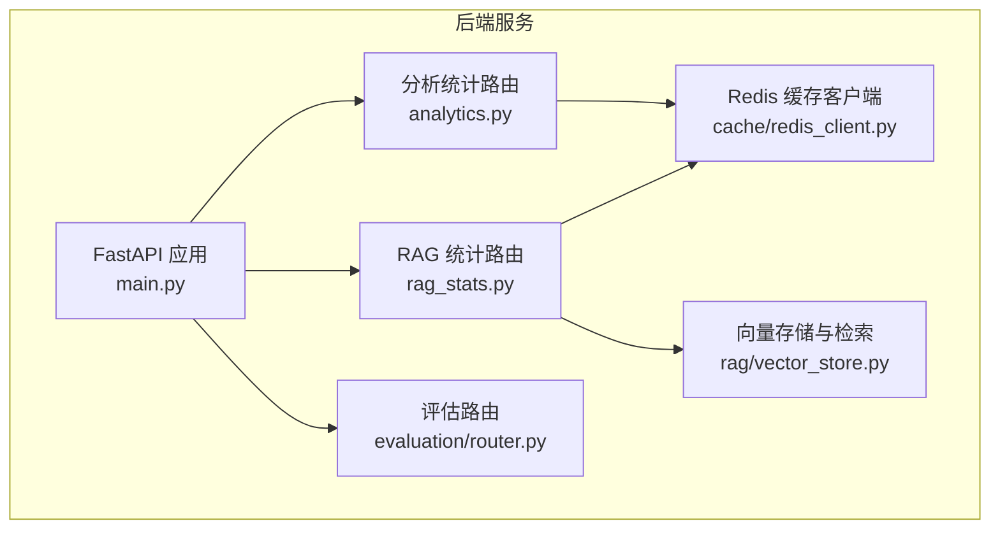
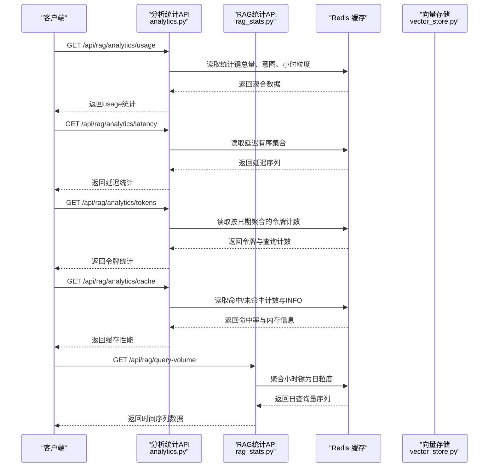
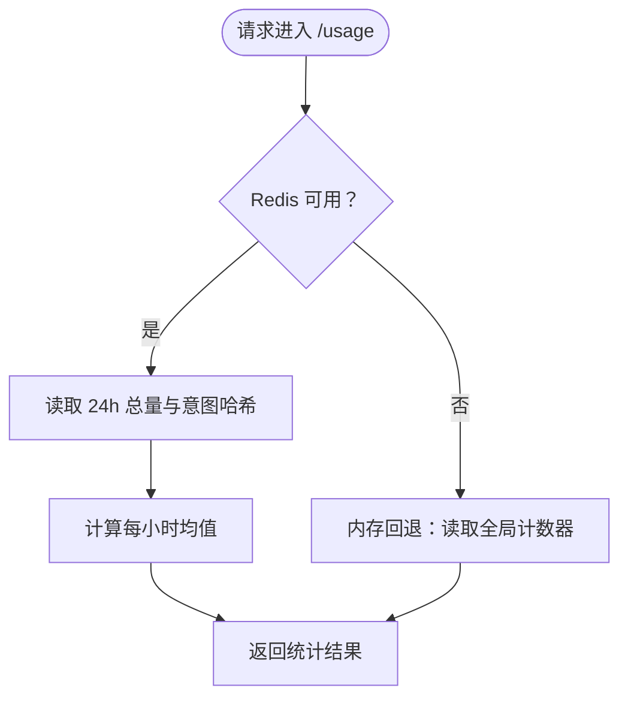
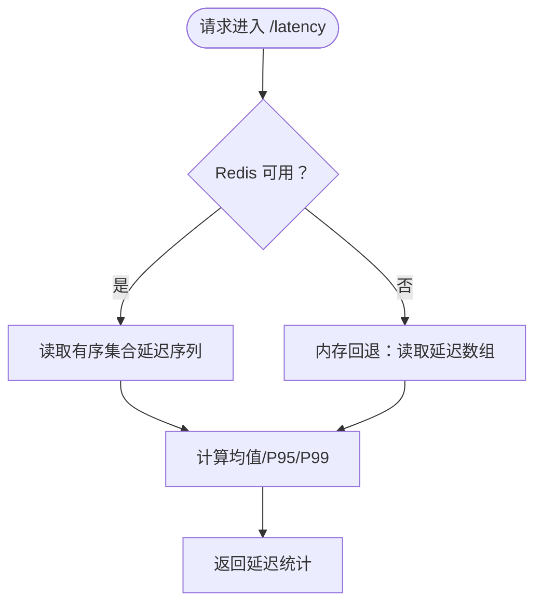
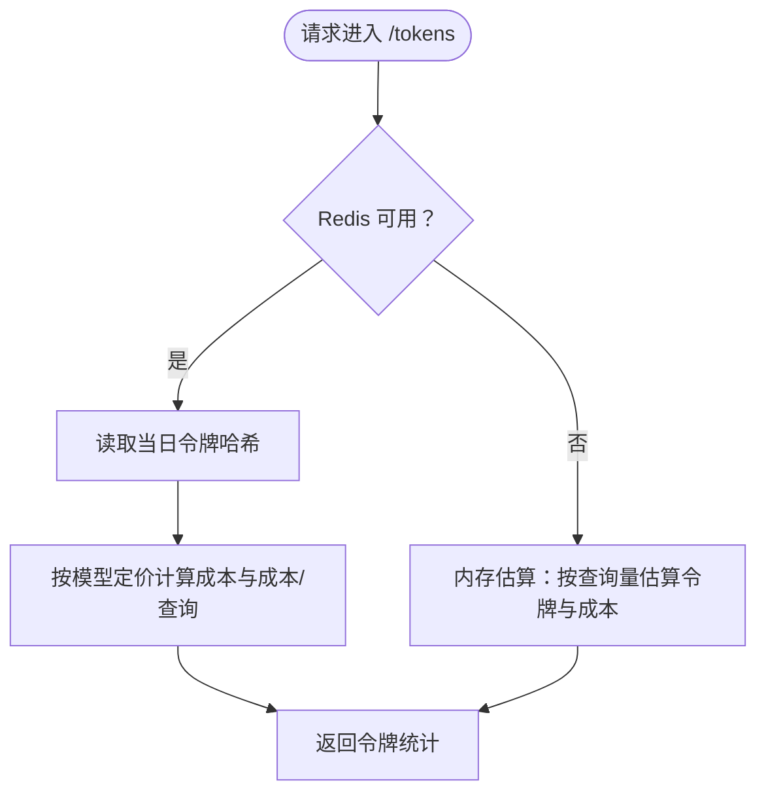
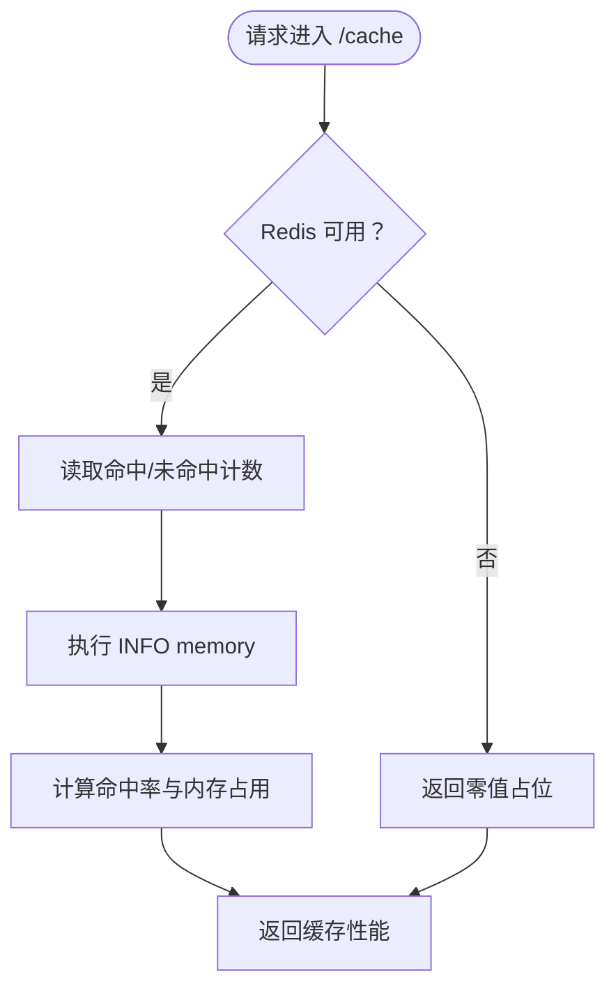
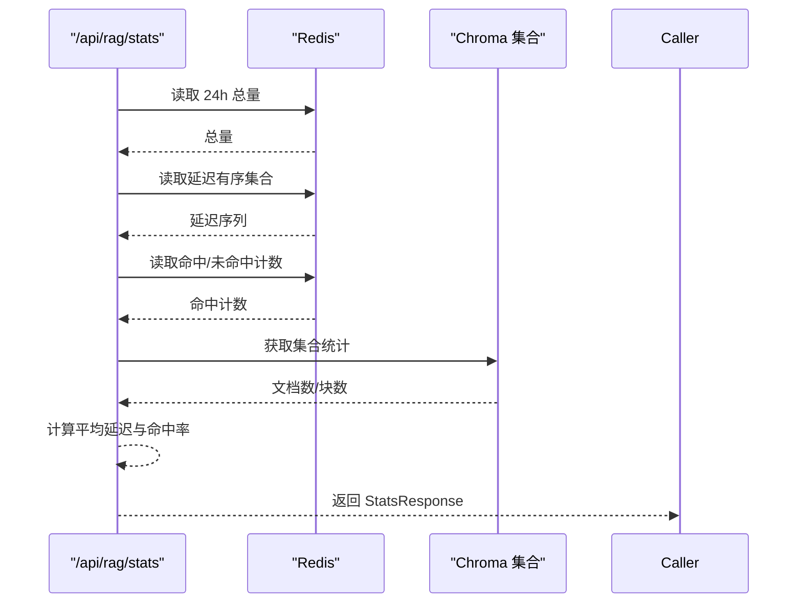
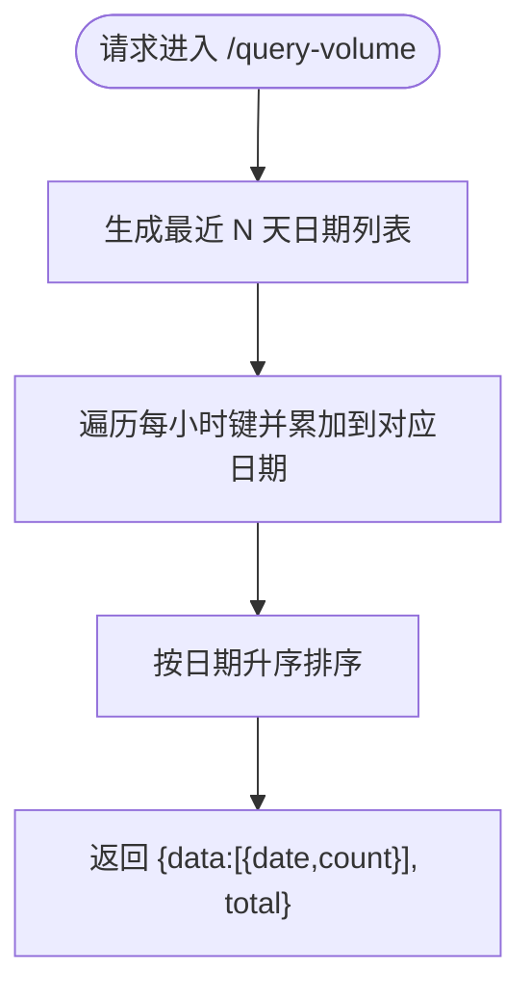
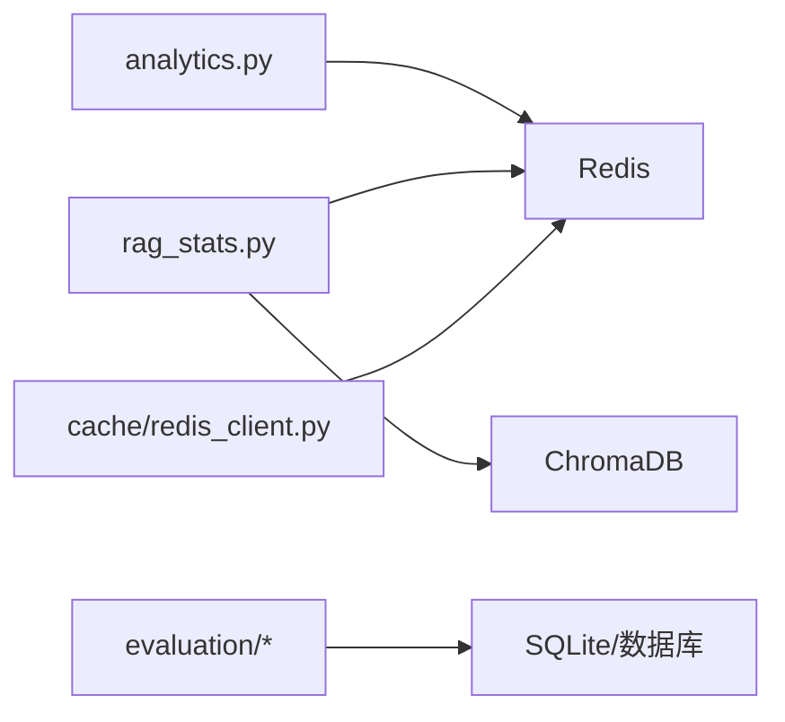

# 分析统计接口

<cite>
**本文引用的文件**
- [backend/app/api/analytics.py](file://backend/app/api/analytics.py)
- [backend/app/api/rag_stats.py](file://backend/app/api/rag_stats.py)
- [backend/app/cache/redis_client.py](file://backend/app/cache/redis_client.py)
- [backend/app/main.py](file://backend/app/main.py)
- [backend/app/dependencies.py](file://backend/app/dependencies.py)
- [backend/app/rag/vector_store.py](file://backend/app/rag/vector_store.py)
- [backend/app/evaluation/__init__.py](file://backend/app/evaluation/__init__.py)
- [backend/app/evaluation/router.py](file://backend/app/evaluation/router.py)
- [backend/app/rag/evaluator.py](file://backend/app/rag/evaluator.py)
- [backend/data/benchmark_results.json](file://backend/data/benchmark_results.json)
</cite>

## 目录
1. [简介](#简介)
2. [项目结构](#项目结构)
3. [核心组件](#核心组件)
4. [架构总览](#架构总览)
5. [详细组件分析](#详细组件分析)
6. [依赖分析](#依赖分析)
7. [性能考量](#性能考量)
8. [故障排查指南](#故障排查指南)
9. [结论](#结论)
10. [附录](#附录)

## 简介
本文件面向分析统计相关 API 的使用者与维护者，系统化梳理查询量统计、响应时间分析、令牌用量统计、缓存性能分析以及 RAG 性能指标监控与质量评估的实现方式。文档覆盖数据模型、查询参数、响应格式、时间序列数据采集与聚合、可视化支持、数据存储策略、缓存机制、实时更新与降级策略，并提供图表数据格式、导出与报表生成的 API 使用指南。

## 项目结构
后端采用 FastAPI 应用，分析统计相关的 API 主要分布在以下模块：
- analytics.py：提供查询量、延迟、令牌用量、缓存性能的分析接口
- rag_stats.py：提供仪表盘统计、近期查询、文档索引状态、基准测试数据、查询量时间序列等
- cache/redis_client.py：Redis 语义缓存与降级内存缓存
- evaluation/*：评估指标表结构、指标保存与读取、评估路由
- rag/vector_store.py：向量检索与关键词检索，支撑 RAG 性能指标来源
- main.py：应用入口，注册路由与中间件
- dependencies.py：Redis 依赖注入工具
- data/benchmark_results.json：基准测试结果文件（动态数据源）

**图示来源**
- [backend/app/main.py:350-362](file://backend/app/main.py#L350-L362)
- [backend/app/api/analytics.py:11](file://backend/app/api/analytics.py#L11)
- [backend/app/api/rag_stats.py:17](file://backend/app/api/rag_stats.py#L17)
- [backend/app/cache/redis_client.py:100-144](file://backend/app/cache/redis_client.py#L100-L144)
- [backend/app/rag/vector_store.py:109-128](file://backend/app/rag/vector_store.py#L109-L128)

**章节来源**
- [backend/app/main.py:350-362](file://backend/app/main.py#L350-L362)
- [backend/app/api/analytics.py:11](file://backend/app/api/analytics.py#L11)
- [backend/app/api/rag_stats.py:17](file://backend/app/api/rag_stats.py#L17)

## 核心组件
- 分析统计 API（analytics.py）
  - /api/rag/analytics/usage：查询量统计（总量、按意图分布、每小时均值、趋势）
  - /api/rag/analytics/latency：延迟分析（平均、P95、P99、分项分解、趋势）
  - /api/rag/analytics/tokens：令牌用量（输入/输出/总计、成本、成本/查询、模型、趋势）
  - /api/rag/analytics/cache：缓存性能（命中率、节省查询、延迟降低、内存占用）
- RAG 统计 API（rag_stats.py）
  - /api/rag/stats：仪表盘统计（缓存命中率、24h查询量、平均检索延迟、索引文档/块数）
  - /api/rag/queries/recent：近期查询列表
  - /api/rag/query-volume：日查询量时间序列（默认最近7天）
  - /api/rag/benchmark：基准测试指标（来自文件）
- 缓存与降级（redis_client.py）
  - 语义缓存键生成、Redis/内存双栈缓存、连接失败自动降级
- 评估与召回（evaluation/*）
  - 评估指标表结构、指标写入与读取、评估路由
- 向量检索（vector_store.py）
  - 关键词检索（BM25）、向量检索、跨编码重排、嵌入缓存与回退

**章节来源**
- [backend/app/api/analytics.py:16-289](file://backend/app/api/analytics.py#L16-L289)
- [backend/app/api/rag_stats.py:152-426](file://backend/app/api/rag_stats.py#L152-L426)
- [backend/app/cache/redis_client.py:100-144](file://backend/app/cache/redis_client.py#L100-L144)
- [backend/app/rag/vector_store.py:176-324](file://backend/app/rag/vector_store.py#L176-L324)

## 架构总览
分析统计系统围绕“数据采集—聚合—持久化—查询—可视化”闭环构建，核心链路如下：

**图示来源**
- [backend/app/api/analytics.py:16-289](file://backend/app/api/analytics.py#L16-L289)
- [backend/app/api/rag_stats.py:338-386](file://backend/app/api/rag_stats.py#L338-L386)
- [backend/app/cache/redis_client.py:100-144](file://backend/app/cache/redis_client.py#L100-L144)

## 详细组件分析

### 查询量统计（/api/rag/analytics/usage）
- 功能要点
  - 总查询量：基于 24 小时键计数
  - 意图分布：按意图哈希表统计
  - 每小时均值：总查询量除以 24
  - 趋势：预留字段（对比上一周期）
- 时间范围参数
  - time_range：24h/7d/30d（当前仅影响返回字段中的 timeRange）
- 降级策略
  - 无 Redis 时，回退到内存计数器与估算
- 响应字段
  - timeRange、total、perHour、byIntent、trend

**图示来源**
- [backend/app/api/analytics.py:16-72](file://backend/app/api/analytics.py#L16-L72)

**章节来源**
- [backend/app/api/analytics.py:16-72](file://backend/app/api/analytics.py#L16-L72)

### 延迟分析（/api/rag/analytics/latency）
- 功能要点
  - 平均、P95、P99 延迟：从有序集合读取延迟序列并计算
  - 分项分解：预留 retrieval/llm_first_token/llm_generation 字段
  - 趋势：预留 avg_change 字段
- 数据来源
  - Redis 有序集合（score=延迟ms，member=时间戳:UUID）
- 降级策略
  - 无 Redis 时，回退到内存延迟数组并估算分位数

**图示来源**
- [backend/app/api/analytics.py:75-164](file://backend/app/api/analytics.py#L75-L164)

**章节来源**
- [backend/app/api/analytics.py:75-164](file://backend/app/api/analytics.py#L75-L164)

### 令牌用量统计（/api/rag/analytics/tokens）
- 功能要点
  - 输入/输出/总计令牌数：按日期哈希表累加
  - 成本估算：按模型定价计算（GPT-4o-mini）
  - 成本/查询：总成本/查询次数
  - 模型标识：当前固定为 gpt-4o-mini
  - 趋势：预留 input_change/output_change/period
- 数据来源
  - Redis 哈希表（键：aureon:stats:tokens:YYYY-MM-DD；域：input/output/queries）
- 降级策略
  - 无 Redis 时，基于查询量估算令牌数与成本

**图示来源**
- [backend/app/api/analytics.py:167-239](file://backend/app/api/analytics.py#L167-L239)

**章节来源**
- [backend/app/api/analytics.py:167-239](file://backend/app/api/analytics.py#L167-L239)

### 缓存性能分析（/api/rag/analytics/cache）
- 功能要点
  - 命中率：命中/(命中+未命中)*100
  - 节省查询：命中计数
  - 延迟降低：预留字段
  - 内存占用：Redis INFO memory.used_memory 转换为 MB
- 数据来源
  - Redis 计数键（命中/未命中）
  - Redis INFO memory

**图示来源**
- [backend/app/api/analytics.py:242-289](file://backend/app/api/analytics.py#L242-L289)

**章节来源**
- [backend/app/api/analytics.py:242-289](file://backend/app/api/analytics.py#L242-L289)

### RAG 仪表盘统计（/api/rag/stats）
- 功能要点
  - cache_hit_rate：缓存命中率
  - query_count_24h：24 小时查询量
  - avg_retrieval_latency_ms：平均检索延迟
  - total_indexed_docs、total_chunks：索引文档与块数
- 数据来源
  - Redis：24h 总量、延迟有序集合、命中计数
  - 向量存储：集合统计（Chroma）

**图示来源**
- [backend/app/api/rag_stats.py:152-213](file://backend/app/api/rag_stats.py#L152-L213)
- [backend/app/rag/vector_store.py:202-205](file://backend/app/rag/vector_store.py#L202-L205)

**章节来源**
- [backend/app/api/rag_stats.py:152-213](file://backend/app/api/rag_stats.py#L152-L213)

### 近期查询列表（/api/rag/queries/recent）
- 功能要点
  - 返回最近 N 条查询（默认 5，上限 50）
  - 字段：query、sources_count、latency_ms、timestamp
- 数据来源
  - Redis 列表（按时间倒序，最多 100 条）

**章节来源**
- [backend/app/api/rag_stats.py:216-242](file://backend/app/api/rag_stats.py#L216-L242)

### 查询量时间序列（/api/rag/query-volume）
- 功能要点
  - 默认最近 7 天的日查询量
  - 聚合逻辑：将每小时键按日期汇总为日计数
- 参数
  - days：历史天数，默认 7
- 数据来源
  - Redis 哈希表（键：aureon:stats:hourly:YYYY-MM-DD-HH）

**图示来源**
- [backend/app/api/rag_stats.py:338-386](file://backend/app/api/rag_stats.py#L338-L386)

**章节来源**
- [backend/app/api/rag_stats.py:338-386](file://backend/app/api/rag_stats.py#L338-L386)

### 基准测试数据（/api/rag/benchmark）
- 功能要点
  - 从文件读取动态基准测试指标
  - 文件路径：backend/data/benchmark_results.json
- 响应模型
  - timestamp、metrics（列表）、services（字典）

**章节来源**
- [backend/app/api/rag_stats.py:319-333](file://backend/app/api/rag_stats.py#L319-L333)
- [backend/data/benchmark_results.json](file://backend/data/benchmark_results.json)

### 缓存与降级（语义缓存）
- 功能要点
  - 语义缓存键：版本号 + MD5(query)
  - 优先内存缓存，其次 Redis，异常时回退
  - 内存缓存 TTL 与容量限制
- 适用场景
  - LLM 响应缓存，提升重复查询性能

**章节来源**
- [backend/app/cache/redis_client.py:100-144](file://backend/app/cache/redis_client.py#L100-L144)

### RAG 性能指标监控与质量评估
- 指标表结构与读写
  - 表：evaluation_metrics（metric_name、metric_value、metric_type、benchmark_set、model_version、created_at）
  - 支持按类型查询最新指标
- 评估路由
  - 提供评估指标的增删查改接口
- 评估器
  - RAG 评估器用于召回率、一致性、幻觉等指标计算

**章节来源**
- [backend/app/evaluation/__init__.py:41-171](file://backend/app/evaluation/__init__.py#L41-L171)
- [backend/app/evaluation/router.py](file://backend/app/evaluation/router.py)
- [backend/app/rag/evaluator.py](file://backend/app/rag/evaluator.py)

## 依赖分析
- 组件耦合
  - analytics 与 rag_stats 共享 Redis 前缀与键空间，确保统计口径一致
  - 缓存层通过依赖注入统一获取 Redis 客户端
  - 评估模块与统计模块解耦，通过独立表存储评估指标
- 外部依赖
  - Redis：统计聚合、缓存、嵌入向量缓存
  - ChromaDB：集合统计与检索
  - 文件系统：基准测试数据

**图示来源**
- [backend/app/api/analytics.py:13](file://backend/app/api/analytics.py#L13)
- [backend/app/api/rag_stats.py:37](file://backend/app/api/rag_stats.py#L37)
- [backend/app/cache/redis_client.py:100-144](file://backend/app/cache/redis_client.py#L100-L144)
- [backend/app/rag/vector_store.py:109-128](file://backend/app/rag/vector_store.py#L109-L128)

**章节来源**
- [backend/app/dependencies.py:14-37](file://backend/app/dependencies.py#L14-L37)

## 性能考量
- Redis 聚合
  - 使用有序集合存储延迟，便于快速分位数计算
  - 使用哈希表存储按日期令牌统计，支持高效累加与过期控制
- 内存降级
  - 当 Redis 不可用时，使用内存数组与计数器维持基本统计能力
- 缓存策略
  - 语义缓存键带版本号，支持在检索逻辑变更后强制失效
  - 内存缓存设置 TTL 与容量上限，避免内存膨胀
- 向量检索
  - 关键词检索（BM25）无需嵌入 API，延迟极低
  - 向量检索支持 MMR 多样性优化与跨编码重排

[本节为通用性能建议，不直接分析具体文件]

## 故障排查指南
- Redis 不可用
  - 现象：分析接口返回零值或估算结果
  - 处理：检查 Redis 连接配置与网络连通性；确认依赖注入返回有效客户端
- 缓存读写错误
  - 现象：语义缓存命中率异常或写入失败
  - 处理：查看缓存客户端日志，确认 Redis 可用性与键空间权限
- 延迟统计为空
  - 现象：/latency 返回全零
  - 处理：确认查询流程是否调用记录函数；检查有序集合数据是否过期清理
- 令牌统计异常
  - 现象：/tokens 返回 0 或成本异常
  - 处理：确认输入/输出令牌是否正确传入记录函数；检查日期键是否过期

**章节来源**
- [backend/app/cache/redis_client.py:106-144](file://backend/app/cache/redis_client.py#L106-L144)
- [backend/app/api/analytics.py:64-72](file://backend/app/api/analytics.py#L64-L72)
- [backend/app/api/analytics.py:155-164](file://backend/app/api/analytics.py#L155-L164)
- [backend/app/api/analytics.py:228-239](file://backend/app/api/analytics.py#L228-L239)

## 结论
该分析统计体系以 Redis 为核心，结合内存降级与语义缓存，实现了高吞吐的查询量、延迟与令牌统计；通过时间序列聚合与评估指标表，支撑了 RAG 性能监控与质量评估。系统具备良好的扩展性与容错能力，适合在生产环境中持续迭代与监控。

[本节为总结性内容，不直接分析具体文件]

## 附录

### 数据模型与响应格式
- usage 统计
  - 字段：timeRange、total、perHour、byIntent、trend
- latency 统计
  - 字段：timeRange、avg、p95、p99、breakdown、trend
- tokens 统计
  - 字段：timeRange、input、output、total、cost、costPerQuery、model、trend
- cache 统计
  - 字段：hitRate、saves、latencyReduction、memoryUsage
- /api/rag/stats
  - 字段：cache_hit_rate、query_count_24h、avg_retrieval_latency_ms、total_indexed_docs、total_chunks
- /api/rag/queries/recent
  - 字段：queries（列表），元素含 query、sources_count、latency_ms、timestamp
- /api/rag/query-volume
  - 字段：data（列表，含 date/count）、total
- /api/rag/benchmark
  - 字段：timestamp、metrics、services

**章节来源**
- [backend/app/api/analytics.py:20-72](file://backend/app/api/analytics.py#L20-L72)
- [backend/app/api/analytics.py:79-164](file://backend/app/api/analytics.py#L79-L164)
- [backend/app/api/analytics.py:169-239](file://backend/app/api/analytics.py#L169-L239)
- [backend/app/api/analytics.py:243-289](file://backend/app/api/analytics.py#L243-L289)
- [backend/app/api/rag_stats.py:25-35](file://backend/app/api/rag_stats.py#L25-L35)
- [backend/app/api/rag_stats.py:216-242](file://backend/app/api/rag_stats.py#L216-L242)
- [backend/app/api/rag_stats.py:338-386](file://backend/app/api/rag_stats.py#L338-L386)
- [backend/app/api/rag_stats.py:319-333](file://backend/app/api/rag_stats.py#L319-L333)

### 查询参数与时间序列
- time_range：24h/7d/30d（影响返回字段中的 timeRange）
- days：/api/rag/query-volume 的历史天数，默认 7
- limit：/api/rag/queries/recent 的条目数，默认 5，范围 1..50

**章节来源**
- [backend/app/api/analytics.py:18](file://backend/app/api/analytics.py#L18)
- [backend/app/api/rag_stats.py:339](file://backend/app/api/rag_stats.py#L339)
- [backend/app/api/rag_stats.py:217](file://backend/app/api/rag_stats.py#L217)

### 数据存储策略与键空间
- Redis 键前缀：aureon:stats
- 统计键
  - count_24h：24 小时查询总量（过期 24h）
  - intents：按意图计数哈希
  - latencies:z：延迟有序集合（score=延迟ms，member=时间戳:UUID）
  - tokens:YYYY-MM-DD：按日期令牌统计哈希（input/output/queries）
  - hourly:YYYY-MM-DD-HH：每小时查询量（过期 2 天）
- 列表与集合
  - aureon:queries:recent：最近查询列表（最多 100 条）

**章节来源**
- [backend/app/api/rag_stats.py:92-126](file://backend/app/api/rag_stats.py#L92-L126)
- [backend/app/api/analytics.py:42-63](file://backend/app/api/analytics.py#L42-L63)

### 缓存机制与实时更新
- 语义缓存
  - 优先内存命中，其次 Redis；异常时回退
  - 版本号 + MD5(query) 作为键，支持强制失效
- 实时更新
  - 查询记录函数在每次查询后异步管道写入 Redis，保证低延迟与一致性

**章节来源**
- [backend/app/cache/redis_client.py:100-144](file://backend/app/cache/redis_client.py#L100-L144)
- [backend/app/api/rag_stats.py:92-126](file://backend/app/api/rag_stats.py#L92-L126)

### 图表数据格式与可视化支持
- 日查询量时间序列
  - data：[{date: "YYYY-MM-DD", count: number}, ...]
  - total：整周累计
- 建议前端处理
  - 按日期升序排序展示
  - 支持 hover 显示单日数值与累计值
- 延迟与令牌
  - 可直接用于折线图/柱状图展示趋势

**章节来源**
- [backend/app/api/rag_stats.py:374-381](file://backend/app/api/rag_stats.py#L374-L381)

### 导出与报表生成 API 使用指南
- 导出
  - 将 /api/rag/query-volume 的 data 字段转换为 CSV（date,count）
  - 将 /api/rag/analytics/usage 的 byIntent 转换为饼图数据
  - 将 /api/rag/analytics/latency 的 avg/p95/p99 按时间序列导出
- 报表
  - 仪表盘卡片：/api/rag/stats 的各项指标
  - 质量报表：/api/rag/benchmark 的 metrics 与 services
  - 评估报表：从评估指标表读取最新指标并按类型分组

**章节来源**
- [backend/app/api/rag_stats.py:338-386](file://backend/app/api/rag_stats.py#L338-L386)
- [backend/app/api/analytics.py:16-72](file://backend/app/api/analytics.py#L16-L72)
- [backend/app/api/analytics.py:75-164](file://backend/app/api/analytics.py#L75-L164)
- [backend/app/evaluation/__init__.py:112-171](file://backend/app/evaluation/__init__.py#L112-L171)