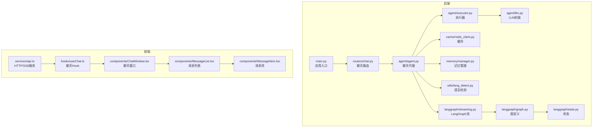
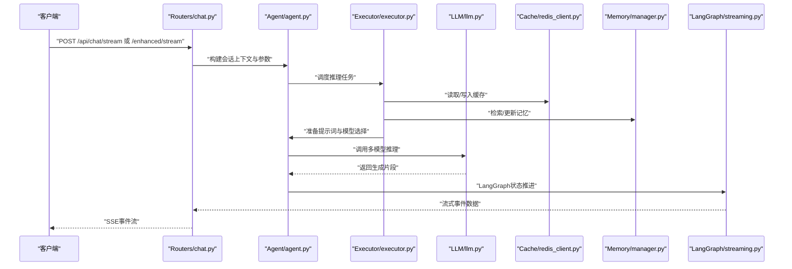
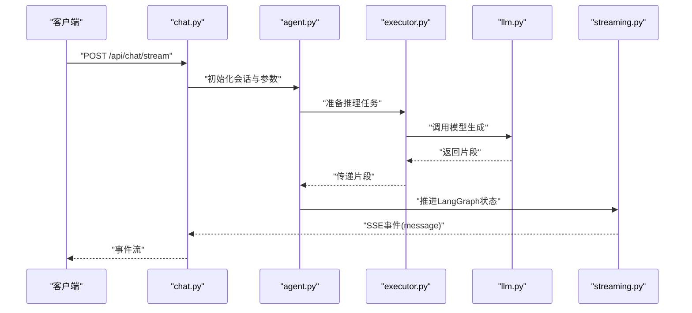
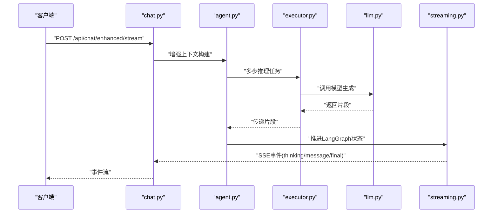
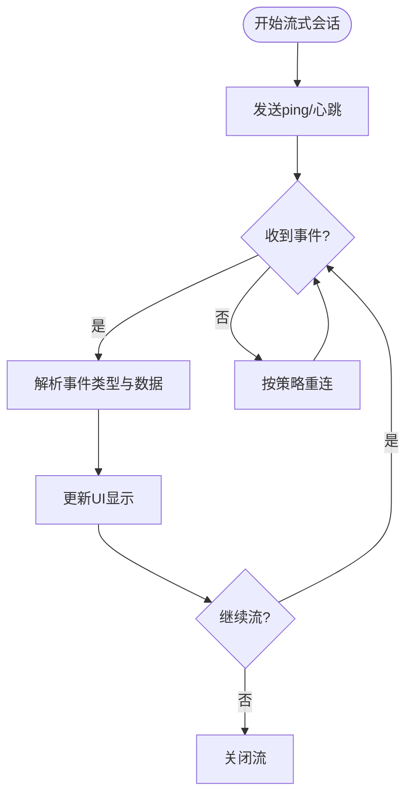
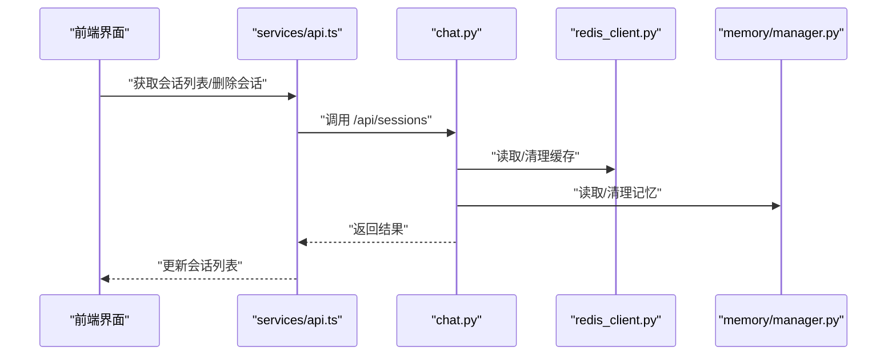
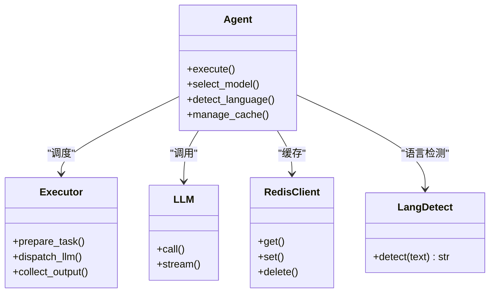
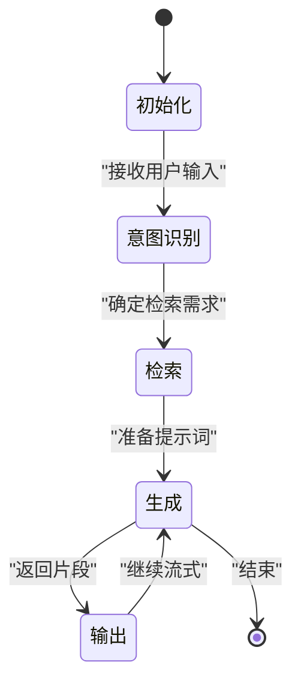
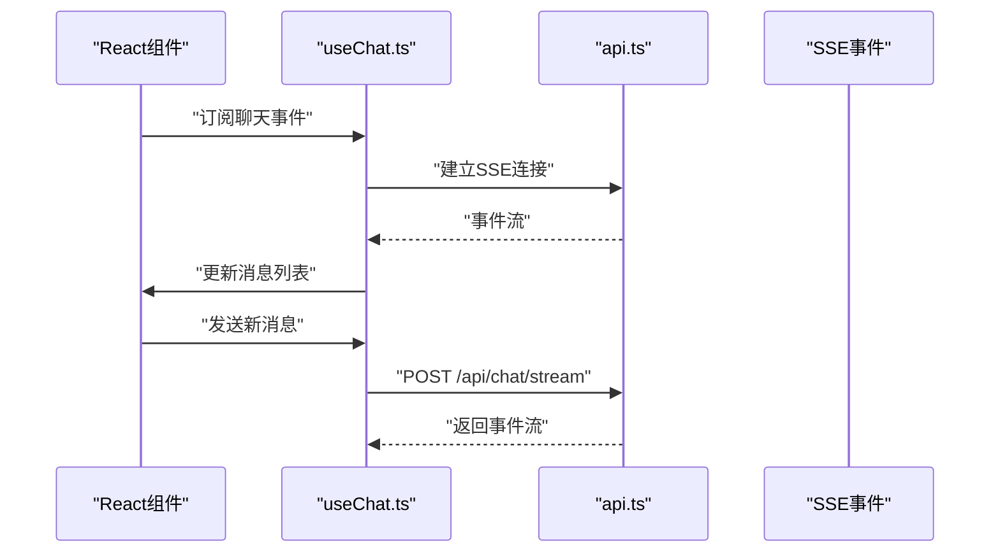
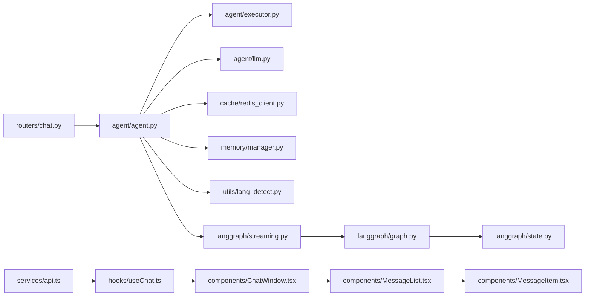

# 聊天接口

<cite>
**本文引用的文件**
- [chat.py](file://backend/app/routers/chat.py)
- [main.py](file://backend/app/main.py)
- [agent.py](file://backend/app/agent/agent.py)
- [executor.py](file://backend/app/agent/executor.py)
- [llm.py](file://backend/app/agent/llm.py)
- [lang_detect.py](file://backend/app/utils/lang_detect.py)
- [redis_client.py](file://backend/app/cache/redis_client.py)
- [memory_manager.py](file://backend/app/memory/manager.py)
- [l0_conversation.py](file://backend/app/memory/l0_conversation.py)
- [l1_atom.py](file://backend/app/memory/l1_atom.py)
- [l2_scenario.py](file://backend/app/memory/l2_scenario.py)
- [l3_persona.py](file://backend/app/memory/l3_persona.py)
- [streaming.py](file://backend/app/langgraph/streaming.py)
- [graph.py](file://backend/app/langgraph/graph.py)
- [state.py](file://backend/app/langgraph/state.py)
- [api.py](file://src/services/api.py)
- [useChat.ts](file://src/hooks/useChat.ts)
- [ChatWindow.tsx](file://src/components/ChatWindow.tsx)
- [MessageList.tsx](file://src/components/MessageList.tsx)
- [MessageItem.tsx](file://src/components/MessageItem.tsx)
- [test_chat_router.py](file://backend/tests/test_chat_router.py)
- [test_streaming_workflow.py](file://backend/tests/test_streaming_workflow.py)
</cite>

## 目录
1. [简介](#简介)
2. [项目结构](#项目结构)
3. [核心组件](#核心组件)
4. [架构总览](#架构总览)
5. [详细组件分析](#详细组件分析)
6. [依赖关系分析](#依赖关系分析)
7. [性能考虑](#性能考虑)
8. [故障排除指南](#故障排除指南)
9. [结论](#结论)
10. [附录](#附录)

## 简介
本文件面向聊天相关 API 的使用者与维护者，系统性梳理后端流式聊天接口的设计与实现，包括基础流式接口 `/api/chat/stream` 与增强流式接口 `/api/chat/enhanced/stream`。内容涵盖：
- SSE（Server-Sent Events）流式响应机制、连接处理与消息格式
- 聊天代理的缓存策略、语言检测与多模型支持
- 会话管理接口 `/api/sessions` 的会话列表获取与删除
- 完整的请求/响应示例、错误处理机制与客户端集成指南
- 流式数据的事件格式、心跳机制与断线重连策略

## 项目结构
后端采用 FastAPI 应用，聊天相关逻辑集中在 routers/chat.py，并通过 agent/executor/llm 模块驱动多模型推理；内存与缓存分别由 memory 与 cache 子模块提供；前端通过 src/services/api.ts 与 hooks/useChat.ts 进行集成。

**图表来源**
- [main.py](file://backend/app/main.py)
- [chat.py](file://backend/app/routers/chat.py)
- [agent.py](file://backend/app/agent/agent.py)
- [executor.py](file://backend/app/agent/executor.py)
- [llm.py](file://backend/app/agent/llm.py)
- [redis_client.py](file://backend/app/cache/redis_client.py)
- [memory_manager.py](file://backend/app/memory/manager.py)
- [lang_detect.py](file://backend/app/utils/lang_detect.py)
- [streaming.py](file://backend/app/langgraph/streaming.py)
- [graph.py](file://backend/app/langgraph/graph.py)
- [state.py](file://backend/app/langgraph/state.py)
- [api.py](file://src/services/api.ts)
- [useChat.ts](file://src/hooks/useChat.ts)
- [ChatWindow.tsx](file://src/components/ChatWindow.tsx)
- [MessageList.tsx](file://src/components/MessageList.tsx)
- [MessageItem.tsx](file://src/components/MessageItem.tsx)

**章节来源**
- [main.py](file://backend/app/main.py)
- [chat.py](file://backend/app/routers/chat.py)

## 核心组件
- 路由层：在 routers/chat.py 中定义 `/api/chat/stream` 与 `/api/chat/enhanced/stream` 两条 SSE 流式接口，负责参数校验、会话上下文构建与流式输出。
- 代理层：agent/agent.py 组织执行器与 LLM 封装，协调缓存、语言检测与记忆管理，驱动推理流程。
- 执行器：agent/executor.py 实现具体调用链，将用户输入转换为多模型推理任务。
- 缓存：cache/redis_client.py 提供键值缓存，加速重复查询与会话状态恢复。
- 记忆：memory/* 提供 L0-L3 多层级记忆，支撑上下文与个性化。
- LangGraph：langgraph/streaming.py 与 graph/state.py 驱动有状态图式流式生成。
- 前端：services/api.ts 与 hooks/useChat.ts 封装 SSE 连接、事件解析与 UI 更新。

**章节来源**
- [chat.py](file://backend/app/routers/chat.py)
- [agent.py](file://backend/app/agent/agent.py)
- [executor.py](file://backend/app/agent/executor.py)
- [redis_client.py](file://backend/app/cache/redis_client.py)
- [memory_manager.py](file://backend/app/memory/manager.py)
- [streaming.py](file://backend/app/langgraph/streaming.py)
- [graph.py](file://backend/app/langgraph/graph.py)
- [state.py](file://backend/app/langgraph/state.py)
- [api.py](file://src/services/api.ts)
- [useChat.ts](file://src/hooks/useChat.ts)

## 架构总览
下图展示从客户端到后端再到模型的完整调用链，以及关键中间件（缓存、记忆、语言检测）的作用点。

**图表来源**
- [chat.py](file://backend/app/routers/chat.py)
- [agent.py](file://backend/app/agent/agent.py)
- [executor.py](file://backend/app/agent/executor.py)
- [llm.py](file://backend/app/agent/llm.py)
- [redis_client.py](file://backend/app/cache/redis_client.py)
- [memory_manager.py](file://backend/app/memory/manager.py)
- [streaming.py](file://backend/app/langgraph/streaming.py)

## 详细组件分析

### 基础流式接口 /api/chat/stream
- 功能概述：接收用户消息，返回 Server-Sent Events 流，逐字节推送生成结果。
- 请求参数：通常包含会话标识、用户消息文本、可选的模型参数与历史上下文。
- 响应格式：SSE 事件，事件类型为“message”，数据为增量文本片段。
- 控制流：
  - 参数校验与会话恢复
  - 语言检测与提示词构造
  - 多模型选择与调用
  - LangGraph 状态推进与流式输出
  - 错误捕获与终止事件

**图表来源**
- [chat.py](file://backend/app/routers/chat.py)
- [agent.py](file://backend/app/agent/agent.py)
- [executor.py](file://backend/app/agent/executor.py)
- [llm.py](file://backend/app/agent/llm.py)
- [streaming.py](file://backend/app/langgraph/streaming.py)

**章节来源**
- [chat.py](file://backend/app/routers/chat.py)

### 增强流式接口 /api/chat/enhanced/stream
- 功能概述：在基础流式能力上，增加更丰富的上下文（如记忆检索、多轮意图识别、RAG 支持），并提供更细粒度的事件类型（如“thinking”、“observation”等）。
- 事件类型扩展：除 message 外，可能包含 thinking、observation、final 等事件，便于前端渲染不同 UI 元素。
- 控制流：与基础接口类似，但执行器与代理层会触发更多中间步骤，LangGraph 也会根据状态生成更复杂的事件序列。

**图表来源**
- [chat.py](file://backend/app/routers/chat.py)
- [agent.py](file://backend/app/agent/agent.py)
- [executor.py](file://backend/app/agent/executor.py)
- [llm.py](file://backend/app/agent/llm.py)
- [streaming.py](file://backend/app/langgraph/streaming.py)

**章节来源**
- [chat.py](file://backend/app/routers/chat.py)

### SSE 流式响应机制与事件格式
- 事件类型：
  - message：标准消息片段
  - thinking：内部思考或推理阶段提示
  - observation：观察/检索阶段提示
  - final：最终结果标记
- 数据结构：每个事件携带 JSON 字段，如 event、data、id、retry 等，便于客户端解析与重连。
- 心跳与断线重连：服务器定期发送空行或 ping 事件以维持连接；客户端在连接中断时依据 last-event-id 与 retry 参数进行重连。

**图表来源**
- [chat.py](file://backend/app/routers/chat.py)
- [streaming.py](file://backend/app/langgraph/streaming.py)

**章节来源**
- [chat.py](file://backend/app/routers/chat.py)
- [streaming.py](file://backend/app/langgraph/streaming.py)

### 会话管理接口 /api/sessions
- 获取会话列表：返回当前用户的所有会话元信息（如会话ID、创建时间、最后消息摘要等）。
- 删除会话：根据会话ID删除对应上下文与缓存记录，确保隐私与资源清理。
- 前端集成：通过 services/api.ts 的会话管理函数调用后端接口，再由 useChat.ts 管理会话状态。

**图表来源**
- [chat.py](file://backend/app/routers/chat.py)
- [redis_client.py](file://backend/app/cache/redis_client.py)
- [memory_manager.py](file://backend/app/memory/manager.py)
- [api.py](file://src/services/api.ts)

**章节来源**
- [chat.py](file://backend/app/routers/chat.py)
- [api.py](file://src/services/api.ts)

### 聊天代理的缓存策略、语言检测与多模型支持
- 缓存策略：使用 Redis 客户端缓存会话状态、历史消息摘要与检索结果，减少重复计算与延迟。
- 语言检测：对用户输入进行语言识别，动态选择合适的提示词模板与模型参数。
- 多模型支持：根据任务类型与复杂度选择不同模型，必要时进行多模型融合或分发。

**图表来源**
- [agent.py](file://backend/app/agent/agent.py)
- [executor.py](file://backend/app/agent/executor.py)
- [llm.py](file://backend/app/agent/llm.py)
- [redis_client.py](file://backend/app/cache/redis_client.py)
- [lang_detect.py](file://backend/app/utils/lang_detect.py)

**章节来源**
- [agent.py](file://backend/app/agent/agent.py)
- [executor.py](file://backend/app/agent/executor.py)
- [llm.py](file://backend/app/agent/llm.py)
- [redis_client.py](file://backend/app/cache/redis_client.py)
- [lang_detect.py](file://backend/app/utils/lang_detect.py)

### LangGraph 状态推进与流式生成
- 状态机：基于 langgraph/state.py 定义的状态结构，记录对话轮次、记忆索引、模型选择等。
- 图式执行：graph.py 定义节点与边，streaming.py 提供流式事件生成，确保前端实时渲染。
- 事件序列：从初始状态出发，经由意图识别、检索、生成等节点，逐步推进至最终状态。

**图表来源**
- [state.py](file://backend/app/langgraph/state.py)
- [graph.py](file://backend/app/langgraph/graph.py)
- [streaming.py](file://backend/app/langgraph/streaming.py)

**章节来源**
- [state.py](file://backend/app/langgraph/state.py)
- [graph.py](file://backend/app/langgraph/graph.py)
- [streaming.py](file://backend/app/langgraph/streaming.py)

### 客户端集成指南
- 服务封装：services/api.ts 提供统一的 HTTP 与 SSE 调用封装，包含超时、重试与错误处理。
- Hook 使用：hooks/useChat.ts 管理会话状态、事件监听与 UI 更新，简化组件开发。
- 组件渲染：ChatWindow.tsx、MessageList.tsx、MessageItem.tsx 分别负责整体布局、消息列表与单项消息渲染。

**图表来源**
- [api.py](file://src/services/api.ts)
- [useChat.ts](file://src/hooks/useChat.ts)
- [ChatWindow.tsx](file://src/components/ChatWindow.tsx)
- [MessageList.tsx](file://src/components/MessageList.tsx)
- [MessageItem.tsx](file://src/components/MessageItem.tsx)

**章节来源**
- [api.py](file://src/services/api.ts)
- [useChat.ts](file://src/hooks/useChat.ts)
- [ChatWindow.tsx](file://src/components/ChatWindow.tsx)
- [MessageList.tsx](file://src/components/MessageList.tsx)
- [MessageItem.tsx](file://src/components/MessageItem.tsx)

## 依赖关系分析
- 路由依赖：chat.py 依赖 agent/executor/llm、cache、memory、langgraph 与 utils。
- 前后端交互：前端通过 services/api.ts 与 hooks/useChat.ts 与后端路由对接。
- 内部耦合：代理层聚合执行器与 LLM，降低路由层复杂度；LangGraph 作为状态机独立于路由与代理。

**图表来源**
- [chat.py](file://backend/app/routers/chat.py)
- [agent.py](file://backend/app/agent/agent.py)
- [executor.py](file://backend/app/agent/executor.py)
- [llm.py](file://backend/app/agent/llm.py)
- [redis_client.py](file://backend/app/cache/redis_client.py)
- [memory_manager.py](file://backend/app/memory/manager.py)
- [lang_detect.py](file://backend/app/utils/lang_detect.py)
- [streaming.py](file://backend/app/langgraph/streaming.py)
- [graph.py](file://backend/app/langgraph/graph.py)
- [state.py](file://backend/app/langgraph/state.py)
- [api.py](file://src/services/api.ts)
- [useChat.ts](file://src/hooks/useChat.ts)
- [ChatWindow.tsx](file://src/components/ChatWindow.tsx)
- [MessageList.tsx](file://src/components/MessageList.tsx)
- [MessageItem.tsx](file://src/components/MessageItem.tsx)

**章节来源**
- [chat.py](file://backend/app/routers/chat.py)
- [agent.py](file://backend/app/agent/agent.py)
- [executor.py](file://backend/app/agent/executor.py)
- [llm.py](file://backend/app/agent/llm.py)
- [redis_client.py](file://backend/app/cache/redis_client.py)
- [memory_manager.py](file://backend/app/memory/manager.py)
- [lang_detect.py](file://backend/app/utils/lang_detect.py)
- [streaming.py](file://backend/app/langgraph/streaming.py)
- [graph.py](file://backend/app/langgraph/graph.py)
- [state.py](file://backend/app/langgraph/state.py)
- [api.py](file://src/services/api.ts)
- [useChat.ts](file://src/hooks/useChat.ts)

## 性能考虑
- 缓存命中率：合理设置缓存键与过期时间，避免热点数据竞争。
- 流式传输：启用 HTTP/1.1 keep-alive 与合适的缓冲区大小，减少首字节延迟。
- 并发控制：限制单会话并发流数量，防止资源耗尽。
- 模型选择：根据任务复杂度动态选择轻量模型，必要时进行批处理或队列化。

## 故障排除指南
- 常见错误：
  - 400 参数无效：检查请求体字段是否完整且符合预期。
  - 500 服务器错误：关注代理层日志，定位执行器或 LLM 调用异常。
  - SSE 连接中断：确认客户端重连策略与 last-event-id 设置。
- 日志与监控：在路由层与代理层添加结构化日志，记录请求ID、会话ID与事件类型，便于追踪。
- 单元测试：参考 backend/tests/test_chat_router.py 与 backend/tests/test_streaming_workflow.py，覆盖关键路径与边界条件。

**章节来源**
- [test_chat_router.py](file://backend/tests/test_chat_router.py)
- [test_streaming_workflow.py](file://backend/tests/test_streaming_workflow.py)

## 结论
本文档从架构与实现两个层面梳理了聊天流式接口的设计与集成方式，强调了 SSE 事件格式、LangGraph 状态推进、缓存与记忆协同、语言检测与多模型支持等关键特性。建议在生产环境中结合缓存策略、并发控制与完善的日志监控体系，确保稳定与高性能。

## 附录
- 请求/响应示例（路径参考）
  - 基础流式接口：[chat.py](file://backend/app/routers/chat.py)
  - 增强流式接口：[chat.py](file://backend/app/routers/chat.py)
  - 会话管理接口：[chat.py](file://backend/app/routers/chat.py)
- 客户端集成示例（路径参考）
  - 服务封装：[api.py](file://src/services/api.ts)
  - Hook 使用：[useChat.ts](file://src/hooks/useChat.ts)
  - 组件渲染：[ChatWindow.tsx](file://src/components/ChatWindow.tsx)、[MessageList.tsx](file://src/components/MessageList.tsx)、[MessageItem.tsx](file://src/components/MessageItem.tsx)
- 单元测试（路径参考）
  - 路由测试：[test_chat_router.py](file://backend/tests/test_chat_router.py)
  - 流式工作流测试：[test_streaming_workflow.py](file://backend/tests/test_streaming_workflow.py)