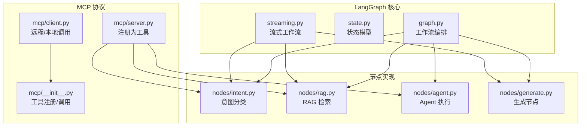
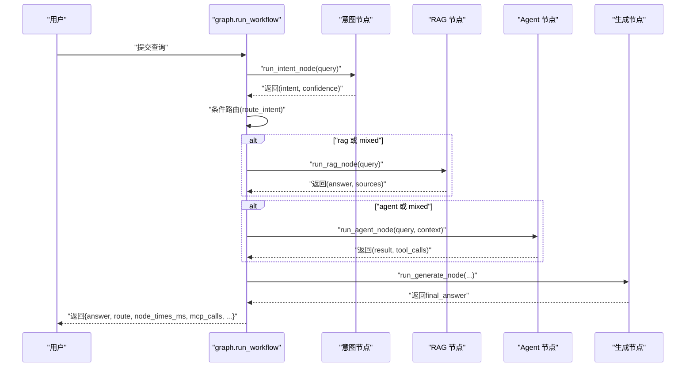
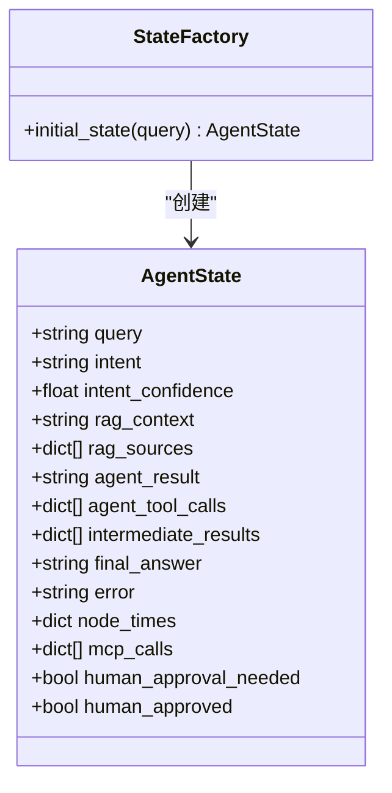
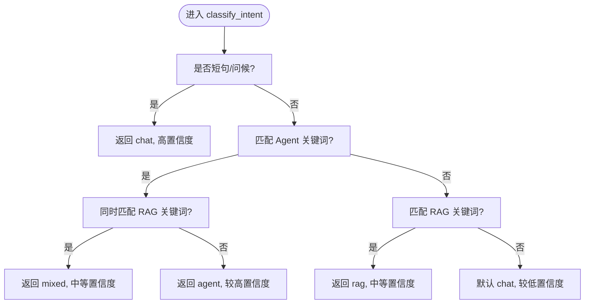
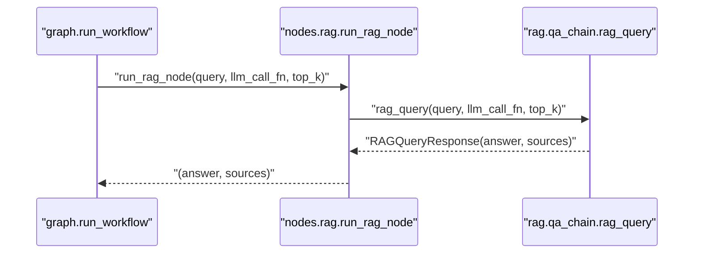
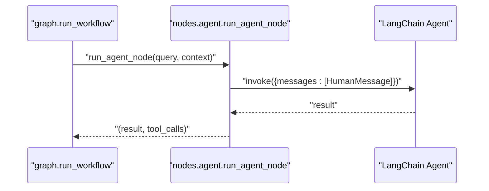
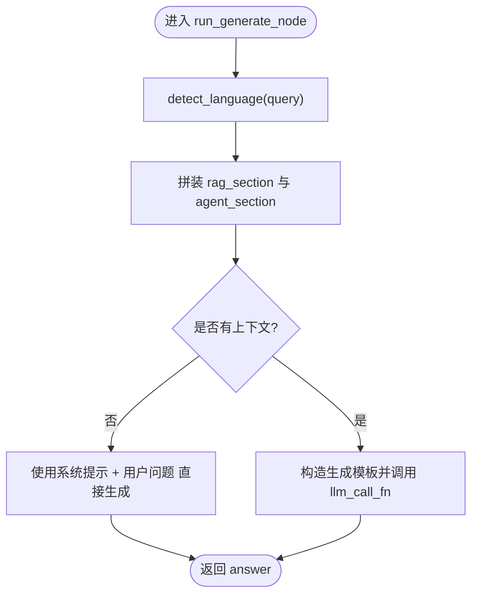
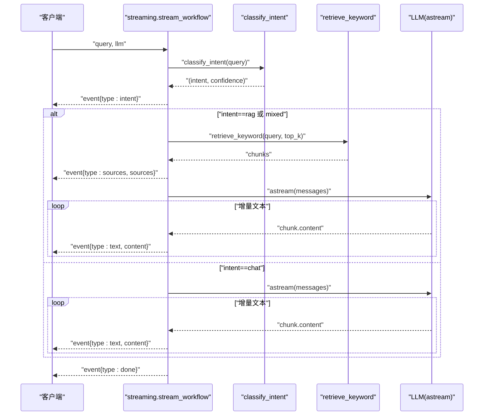
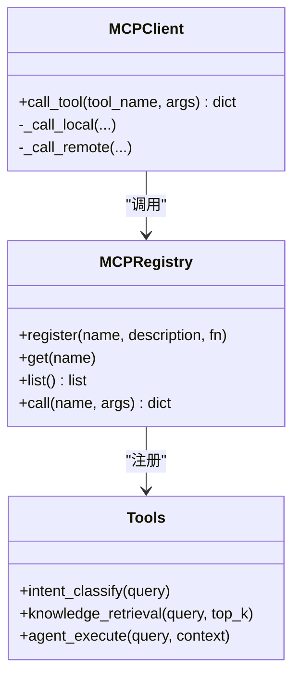
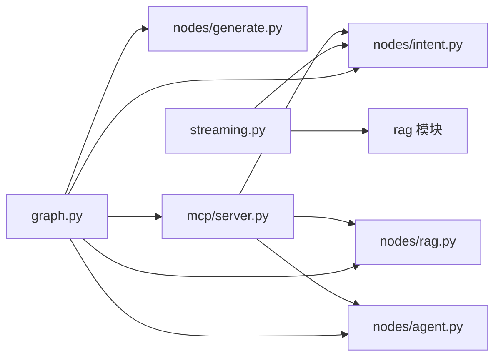

# LangGraph 工作流

<cite>
**本文档引用的文件**
- [backend/app/langgraph/graph.py](file://backend/app/langgraph/graph.py)
- [backend/app/langgraph/state.py](file://backend/app/langgraph/state.py)
- [backend/app/langgraph/streaming.py](file://backend/app/langgraph/streaming.py)
- [backend/app/langgraph/nodes/intent.py](file://backend/app/langgraph/nodes/intent.py)
- [backend/app/langgraph/nodes/agent.py](file://backend/app/langgraph/nodes/agent.py)
- [backend/app/langgraph/nodes/generate.py](file://backend/app/langgraph/nodes/generate.py)
- [backend/app/langgraph/nodes/rag.py](file://backend/app/langgraph/nodes/rag.py)
- [backend/app/langgraph/mcp/__init__.py](file://backend/app/langgraph/mcp/__init__.py)
- [backend/app/langgraph/mcp/server.py](file://backend/app/langgraph/mcp/server.py)
- [backend/app/langgraph/mcp/client.py](file://backend/app/langgraph/mcp/client.py)
- [backend/tests/test_langgraph.py](file://backend/tests/test_langgraph.py)
- [backend/tests/test_streaming_workflow.py](file://backend/tests/test_streaming_workflow.py)
</cite>

## 目录
1. [简介](#简介)
2. [项目结构](#项目结构)
3. [核心组件](#核心组件)
4. [架构总览](#架构总览)
5. [详细组件分析](#详细组件分析)
6. [依赖分析](#依赖分析)
7. [性能考虑](#性能考虑)
8. [故障排查指南](#故障排查指南)
9. [结论](#结论)
10. [附录](#附录)

## 简介
本文件面向开发者与运维人员，系统性解析 Aureon 的 LangGraph 工作流系统。该系统基于状态驱动的图形化编排，围绕“意图分类 → 并行检索/代理 → 生成”的主干流程，提供同步与流式两种执行路径，并内置 MCP 工具协议以统一暴露节点能力。文档重点覆盖：
- 图形化工作流编排原理与实现机制
- 节点设计模式：意图分类、代理、生成、RAG
- 状态管理、中间结果与耗时统计
- 流式响应处理与事件分发
- 并行处理、错误处理与超时管理
- 状态序列化、持久化与恢复思路
- 开发者指南：创建节点、自定义处理逻辑、调试工作流
- 性能优化建议与最佳实践

## 项目结构
LangGraph 相关代码集中在 backend/app/langgraph 下，按职责划分为：
- graph.py：工作流编排入口、条件路由、并行执行与结果构建
- state.py：TypedDict 定义的工作流状态模型与初始状态工厂
- streaming.py：流式工作流，按事件类型分发 intent/route/sources/text/done/error
- nodes/：节点实现
  - intent.py：轻量规则意图分类
  - rag.py：RAG 检索与生成封装
  - agent.py：LangChain Agent 执行
  - generate.py：最终答案生成与语言指令注入
- mcp/：MCP 工具注册与客户端/服务端适配

图表来源
- [backend/app/langgraph/graph.py:1-163](file://backend/app/langgraph/graph.py#L1-L163)
- [backend/app/langgraph/state.py:1-47](file://backend/app/langgraph/state.py#L1-L47)
- [backend/app/langgraph/streaming.py:1-127](file://backend/app/langgraph/streaming.py#L1-L127)
- [backend/app/langgraph/nodes/intent.py:1-76](file://backend/app/langgraph/nodes/intent.py#L1-L76)
- [backend/app/langgraph/nodes/rag.py:1-27](file://backend/app/langgraph/nodes/rag.py#L1-L27)
- [backend/app/langgraph/nodes/agent.py:1-32](file://backend/app/langgraph/nodes/agent.py#L1-L32)
- [backend/app/langgraph/nodes/generate.py:1-89](file://backend/app/langgraph/nodes/generate.py#L1-L89)
- [backend/app/langgraph/mcp/__init__.py:1-67](file://backend/app/langgraph/mcp/__init__.py#L1-L67)
- [backend/app/langgraph/mcp/server.py:1-43](file://backend/app/langgraph/mcp/server.py#L1-L43)
- [backend/app/langgraph/mcp/client.py:1-43](file://backend/app/langgraph/mcp/client.py#L1-L43)

章节来源
- [backend/app/langgraph/graph.py:1-163](file://backend/app/langgraph/graph.py#L1-L163)
- [backend/app/langgraph/state.py:1-47](file://backend/app/langgraph/state.py#L1-L47)
- [backend/app/langgraph/streaming.py:1-127](file://backend/app/langgraph/streaming.py#L1-L127)

## 核心组件
- 状态模型（AgentState）
  - 字段覆盖：原始查询、意图、置信度、RAG 上下文与来源、Agent 结果与工具调用、中间结果、最终答案、错误、各节点耗时、MCP 调用记录、人工审批标记等
  - 初始状态工厂负责填充默认值，确保后续节点安全读写
- 工作流编排（graph.py）
  - 同步工作流：意图分类 → 条件路由 → 并行执行 RAG/Agent → 生成最终答案
  - 结果构建：汇总节点耗时、中间结果、MCP 调用记录、总耗时与错误
- 流式工作流（streaming.py）
  - 事件驱动：intent → route → sources（可选）→ text（增量）→ done/error
  - 错误归一化：屏蔽敏感信息，返回友好提示
- 节点实现
  - 意图分类：关键词规则优先，短语/问候直接判定 chat，混合场景自动识别
  - RAG：检索 + 格式化上下文 + LLM 生成，返回答案与来源
  - Agent：LangChain Agent + 工具集，返回自然语言结果
  - 生成：根据意图与上下文拼装最终回答，支持语言指令注入
- MCP 协议
  - 工具注册：集中注册 intent_classify、knowledge_retrieval、agent_execute
  - 本地/远程调用：统一 call_tool 接口，支持本地与 HTTP 远程

章节来源
- [backend/app/langgraph/state.py:6-47](file://backend/app/langgraph/state.py#L6-L47)
- [backend/app/langgraph/graph.py:43-147](file://backend/app/langgraph/graph.py#L43-L147)
- [backend/app/langgraph/streaming.py:15-59](file://backend/app/langgraph/streaming.py#L15-L59)
- [backend/app/langgraph/nodes/intent.py:47-76](file://backend/app/langgraph/nodes/intent.py#L47-L76)
- [backend/app/langgraph/nodes/rag.py:11-27](file://backend/app/langgraph/nodes/rag.py#L11-L27)
- [backend/app/langgraph/nodes/agent.py:13-32](file://backend/app/langgraph/nodes/agent.py#L13-L32)
- [backend/app/langgraph/nodes/generate.py:34-89](file://backend/app/langgraph/nodes/generate.py#L34-L89)
- [backend/app/langgraph/mcp/__init__.py:6-67](file://backend/app/langgraph/mcp/__init__.py#L6-L67)
- [backend/app/langgraph/mcp/server.py:6-43](file://backend/app/langgraph/mcp/server.py#L6-L43)
- [backend/app/langgraph/mcp/client.py:10-43](file://backend/app/langgraph/mcp/client.py#L10-L43)

## 架构总览
LangGraph 采用“状态 + 节点 + 路由”的编排范式。同步工作流在单线程中顺序执行节点并收集中间结果；流式工作流通过异步生成器逐段产出事件，前端可即时渲染。

图表来源
- [backend/app/langgraph/graph.py:43-147](file://backend/app/langgraph/graph.py#L43-L147)
- [backend/app/langgraph/nodes/intent.py:73-76](file://backend/app/langgraph/nodes/intent.py#L73-L76)
- [backend/app/langgraph/nodes/rag.py:11-27](file://backend/app/langgraph/nodes/rag.py#L11-L27)
- [backend/app/langgraph/nodes/agent.py:13-32](file://backend/app/langgraph/nodes/agent.py#L13-L32)
- [backend/app/langgraph/nodes/generate.py:34-89](file://backend/app/langgraph/nodes/generate.py#L34-L89)

## 详细组件分析

### 状态模型与序列化
- 数据结构
  - TypedDict 明确字段类型与可空性，便于静态校验与 IDE 提示
  - 包含中间结果、耗时、MCP 调用记录，便于可观测性与审计
- 序列化与持久化
  - 当前实现为内存字典，适合进程内运行
  - 建议：结合会话 ID 将状态序列化为 JSON 存储于 Redis/PostgreSQL，重启后按需恢复
- 恢复机制
  - 可基于 session_id 读取历史状态，跳过已执行节点或重放部分流程

图表来源
- [backend/app/langgraph/state.py:6-47](file://backend/app/langgraph/state.py#L6-L47)

章节来源
- [backend/app/langgraph/state.py:6-47](file://backend/app/langgraph/state.py#L6-L47)

### 意图分类节点
- 规则优先：短语/问候直判 chat；特定关键词优先判 agent；RAG 关键词判 rag；混合场景同时满足两类规则即为 mixed
- 返回值：(intent, confidence)，用于路由与可观测性
- 与 MCP 的集成：通过 intent_classify 工具对外暴露

图表来源
- [backend/app/langgraph/nodes/intent.py:47-76](file://backend/app/langgraph/nodes/intent.py#L47-L76)

章节来源
- [backend/app/langgraph/nodes/intent.py:1-76](file://backend/app/langgraph/nodes/intent.py#L1-L76)
- [backend/app/langgraph/mcp/server.py:9-21](file://backend/app/langgraph/mcp/server.py#L9-L21)

### RAG 节点
- 输入：query、top_k
- 处理：调用 RAG 查询链，返回 answer 与 sources（标题、slug、分数）
- 输出：供生成节点拼接最终回答与来源标注

图表来源
- [backend/app/langgraph/nodes/rag.py:11-27](file://backend/app/langgraph/nodes/rag.py#L11-L27)
- [backend/app/langgraph/graph.py:79-93](file://backend/app/langgraph/graph.py#L79-L93)

章节来源
- [backend/app/langgraph/nodes/rag.py:1-27](file://backend/app/langgraph/nodes/rag.py#L1-L27)
- [backend/app/langgraph/graph.py:79-93](file://backend/app/langgraph/graph.py#L79-L93)

### 代理节点
- 输入：query、context（可选）
- 处理：创建 LLM 与 Agent，组合上下文后执行，返回自然语言结果
- 输出：供生成节点拼接

图表来源
- [backend/app/langgraph/nodes/agent.py:13-32](file://backend/app/langgraph/nodes/agent.py#L13-L32)
- [backend/app/langgraph/graph.py:94-104](file://backend/app/langgraph/graph.py#L94-L104)

章节来源
- [backend/app/langgraph/nodes/agent.py:1-32](file://backend/app/langgraph/nodes/agent.py#L1-L32)
- [backend/app/langgraph/graph.py:94-104](file://backend/app/langgraph/graph.py#L94-L104)

### 生成节点
- 输入：intent、rag_context、rag_sources、agent_result、llm_call_fn
- 处理：根据语言检测注入语言指令，拼装 rag_section 与 agent_section，必要时直接调用 llm_call_fn 生成最终回答
- 输出：最终答案字符串

图表来源
- [backend/app/langgraph/nodes/generate.py:34-89](file://backend/app/langgraph/nodes/generate.py#L34-L89)

章节来源
- [backend/app/langgraph/nodes/generate.py:1-89](file://backend/app/langgraph/nodes/generate.py#L1-L89)

### 流式工作流
- 事件类型：intent、route、sources（仅 rag/mixed）、text（增量）、done、error
- 错误处理：捕获异常，输出友好错误消息，保证发出 done
- 语言与上下文：根据 query 检测语言，注入语言指令，RAG 场景格式化上下文

图表来源
- [backend/app/langgraph/streaming.py:15-59](file://backend/app/langgraph/streaming.py#L15-L59)
- [backend/app/langgraph/streaming.py:62-105](file://backend/app/langgraph/streaming.py#L62-L105)
- [backend/app/langgraph/streaming.py:107-127](file://backend/app/langgraph/streaming.py#L107-L127)

章节来源
- [backend/app/langgraph/streaming.py:1-127](file://backend/app/langgraph/streaming.py#L1-L127)

### MCP 工具协议
- 注册中心：集中注册 intent_classify、knowledge_retrieval、agent_execute
- 调用接口：统一 call_tool，支持本地与远程 HTTP 调用
- 客户端：MCPClient 支持本地/远程切换，带超时控制

图表来源
- [backend/app/langgraph/mcp/__init__.py:43-67](file://backend/app/langgraph/mcp/__init__.py#L43-L67)
- [backend/app/langgraph/mcp/client.py:10-43](file://backend/app/langgraph/mcp/client.py#L10-L43)
- [backend/app/langgraph/mcp/server.py:6-43](file://backend/app/langgraph/mcp/server.py#L6-L43)

章节来源
- [backend/app/langgraph/mcp/__init__.py:1-67](file://backend/app/langgraph/mcp/__init__.py#L1-L67)
- [backend/app/langgraph/mcp/server.py:1-43](file://backend/app/langgraph/mcp/server.py#L1-L43)
- [backend/app/langgraph/mcp/client.py:1-43](file://backend/app/langgraph/mcp/client.py#L1-L43)

## 依赖分析
- 组件耦合
  - graph.py 对 nodes/* 与 mcp/server 的强依赖，体现编排层对节点与工具的抽象
  - streaming.py 对 nodes/intent 与 rag 模块的直接依赖，体现流式路径
- 外部依赖
  - LLM 创建与调用封装在 agent.llm，避免在节点中直接耦合具体平台
  - RAG 模块通过 qa_chain 与 vector_store 解耦检索与生成
- 循环依赖
  - 未发现直接循环导入；MCP 注册在模块加载时完成，避免运行时循环

图表来源
- [backend/app/langgraph/graph.py:7-12](file://backend/app/langgraph/graph.py#L7-L12)
- [backend/app/langgraph/streaming.py:7-10](file://backend/app/langgraph/streaming.py#L7-L10)
- [backend/app/langgraph/mcp/server.py:3-4](file://backend/app/langgraph/mcp/server.py#L3-L4)

章节来源
- [backend/app/langgraph/graph.py:1-163](file://backend/app/langgraph/graph.py#L1-L163)
- [backend/app/langgraph/streaming.py:1-127](file://backend/app/langgraph/streaming.py#L1-L127)
- [backend/app/langgraph/mcp/server.py:1-43](file://backend/app/langgraph/mcp/server.py#L1-L43)

## 性能考虑
- 并行执行
  - mixed 意图下 RAG 与 Agent 并行执行，显著降低端到端延迟
- I/O 优化
  - 意图分类采用规则匹配，避免 LLM 调用，节省约 1 秒
  - 流式输出减少首字节延迟，提升用户体验
- 资源隔离
  - 使用 asyncio.to_thread 将阻塞调用放入线程池，避免阻塞事件循环
- 缓存与预热
  - LLM 与工具可在模块加载时预热，减少首次调用开销
- 监控与采样
  - 记录各节点耗时与 MCP 调用，便于定位瓶颈

## 故障排查指南
- 常见问题
  - 401/认证失败：流式工作流会将错误归一化为“AI 服务认证失败”，检查 API 密钥配置
  - 超时：远程 MCP 调用设置超时，若超时需检查网络与下游服务健康
  - 无相关结果：RAG 无匹配内容时返回友好提示，确认知识库与检索参数
- 日志与可观测性
  - graph.py 与 streaming.py 内置日志，包含节点耗时、意图置信度、MCP 调用记录
- 单元测试参考
  - 测试覆盖意图分类、流式事件类型、错误归一化、RAG 无结果与有结果场景

章节来源
- [backend/app/langgraph/streaming.py:49-58](file://backend/app/langgraph/streaming.py#L49-L58)
- [backend/tests/test_streaming_workflow.py:103-126](file://backend/tests/test_streaming_workflow.py#L103-L126)
- [backend/tests/test_langgraph.py:115-131](file://backend/tests/test_langgraph.py#L115-L131)

## 结论
Aureon 的 LangGraph 工作流以状态为中心，结合规则意图与 MCP 工具协议，实现了高扩展性的图形化编排。同步与流式双通道满足不同场景需求，配合完善的可观测性与错误处理，为生产级应用提供了稳定基础。建议在实际部署中完善状态持久化与恢复、引入超时与熔断策略，并持续优化检索与生成链路。

## 附录

### 开发者指南：创建工作流节点
- 新增节点步骤
  - 在 nodes/ 下新增模块，导出 run_xxx_node(query, ...) 并返回所需输出
  - 在 graph.py 中导入并接入路由逻辑，或在 streaming.py 中按需触发
  - 若节点具备工具能力，可在 mcp/server.py 中注册为工具
- 自定义处理逻辑
  - 在节点内部进行前置清洗、上下文拼接、结果后处理
  - 使用 detect_language 注入语言指令，确保多语言一致性
- 调试工作流
  - 通过中间结果与 node_times 定位慢节点
  - 使用单元测试模拟事件流，验证路由与错误分支

章节来源
- [backend/app/langgraph/nodes/intent.py:1-76](file://backend/app/langgraph/nodes/intent.py#L1-L76)
- [backend/app/langgraph/nodes/rag.py:1-27](file://backend/app/langgraph/nodes/rag.py#L1-L27)
- [backend/app/langgraph/nodes/agent.py:1-32](file://backend/app/langgraph/nodes/agent.py#L1-L32)
- [backend/app/langgraph/nodes/generate.py:1-89](file://backend/app/langgraph/nodes/generate.py#L1-L89)
- [backend/app/langgraph/mcp/server.py:1-43](file://backend/app/langgraph/mcp/server.py#L1-L43)