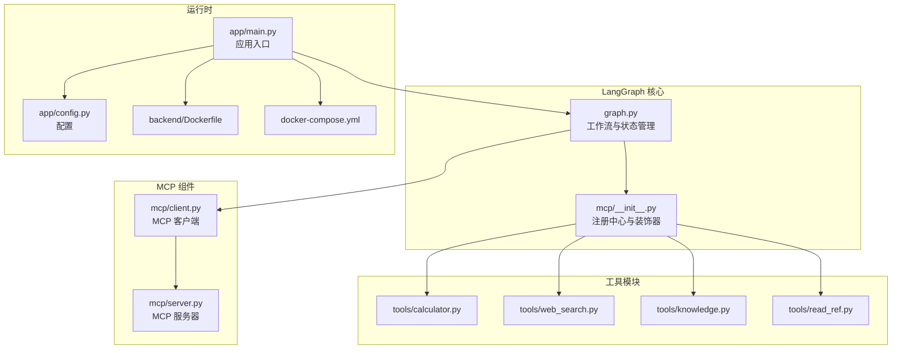
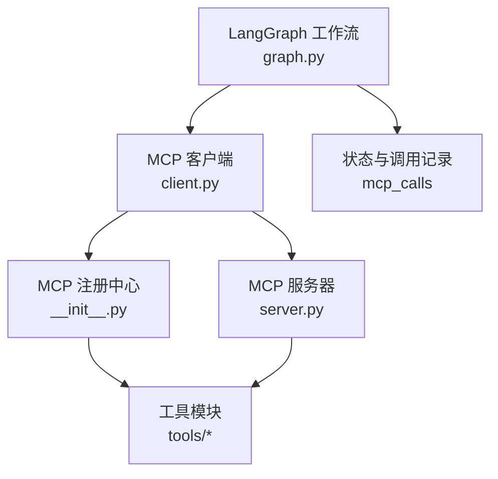
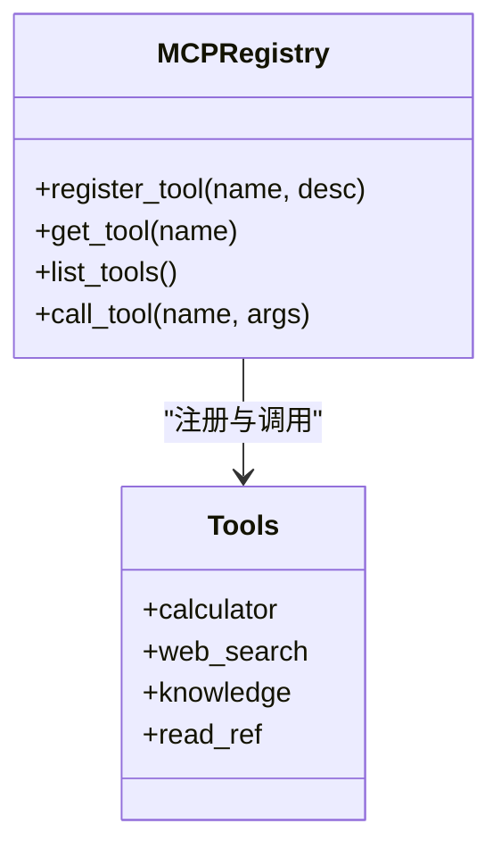
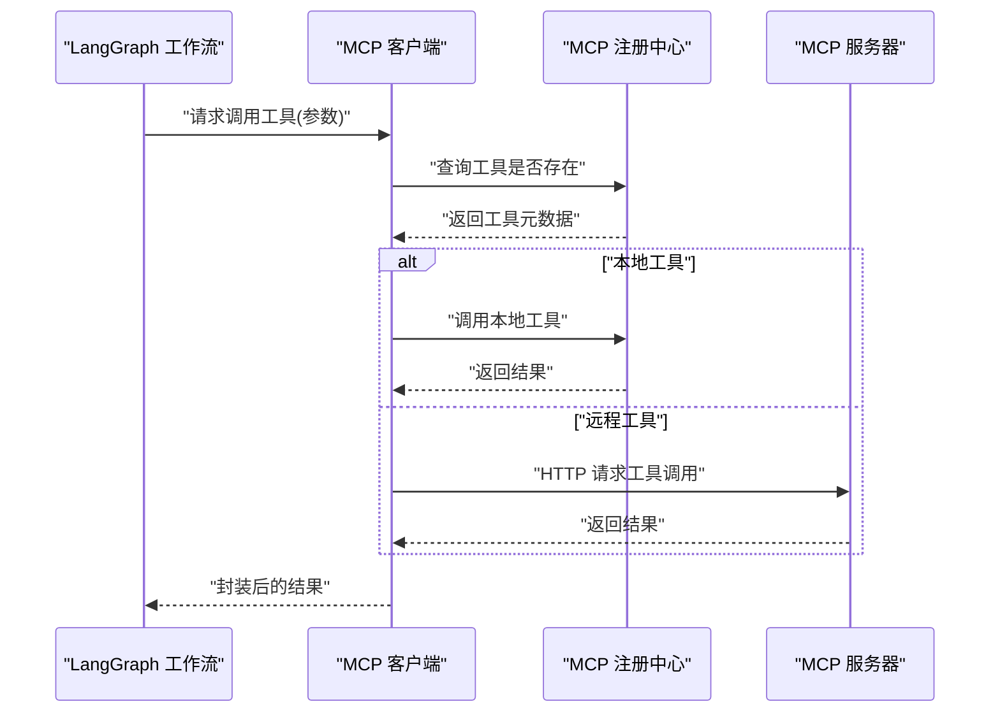
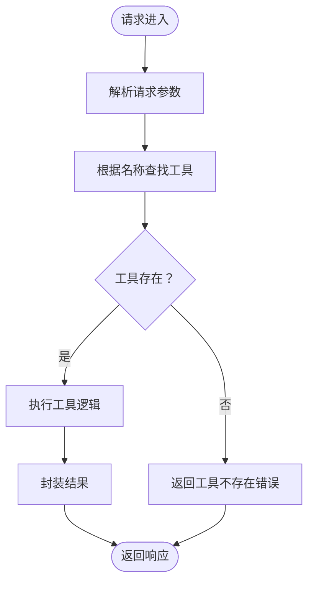
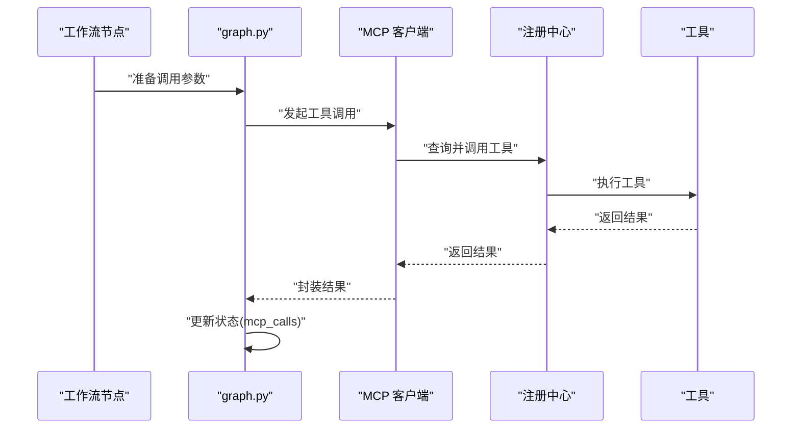
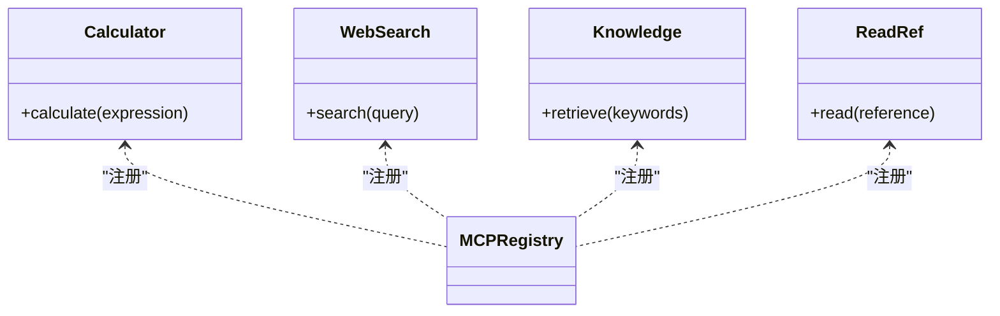
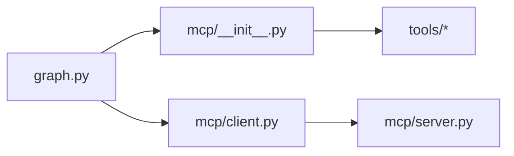

# MCP 集成

<cite>
**本文引用的文件**
- [backend/app/langgraph/mcp/__init__.py](file://backend/app/langgraph/mcp/__init__.py)
- [backend/app/langgraph/mcp/client.py](file://backend/app/langgraph/mcp/client.py)
- [backend/app/langgraph/mcp/server.py](file://backend/app/langgraph/mcp/server.py)
- [backend/app/langgraph/graph.py](file://backend/app/langgraph/graph.py)
- [backend/app/tools/calculator.py](file://backend/app/tools/calculator.py)
- [backend/app/tools/web_search.py](file://backend/app/tools/web_search.py)
- [backend/app/tools/knowledge.py](file://backend/app/tools/knowledge.py)
- [backend/app/tools/read_ref.py](file://backend/app/tools/read_ref.py)
- [backend/app/main.py](file://backend/app/main.py)
- [backend/app/config.py](file://backend/app/config.py)
- [backend/Dockerfile](file://backend/Dockerfile)
- [docker-compose.yml](file://docker-compose.yml)
</cite>

## 目录
1. [简介](#简介)
2. [项目结构](#项目结构)
3. [核心组件](#核心组件)
4. [架构总览](#架构总览)
5. [详细组件分析](#详细组件分析)
6. [依赖关系分析](#依赖关系分析)
7. [性能考虑](#性能考虑)
8. [故障排除指南](#故障排除指南)
9. [结论](#结论)
10. [附录](#附录)

## 简介
本技术文档聚焦于 LangGraph 中的 MCP（Model Context Protocol）集成系统，系统性阐述 MCP 的工作原理与在 LangGraph 工作流中的应用方式，涵盖客户端与服务器端的实现机制、工具注册与调用流程、工具链管理与上下文传递、连接管理与会话维护、服务器配置与部署、扩展开发指南以及最佳实践与故障排除方法。该系统通过轻量级 MCP 实现，将外部工具能力以统一协议接入 LangGraph 工作流，提升工具链的可组合性与可扩展性。

## 项目结构
MCP 集成位于后端模块 backend/app/langgraph/mcp 下，配合 LangGraph 工作流模块使用，并与通用工具模块协同工作。关键文件包括：
- MCP 注册中心与工具装饰器：backend/app/langgraph/mcp/__init__.py
- MCP 客户端：backend/app/langgraph/mcp/client.py
- MCP 服务器：backend/app/langgraph/mcp/server.py
- LangGraph 工作流入口与工具注册触发：backend/app/langgraph/graph.py
- 常用工具示例：backend/app/tools/*.py
- 应用入口与配置：backend/app/main.py、backend/app/config.py
- 容器化与编排：backend/Dockerfile、docker-compose.yml

**图表来源**
- [backend/app/langgraph/graph.py](file://backend/app/langgraph/graph.py)
- [backend/app/langgraph/mcp/__init__.py](file://backend/app/langgraph/mcp/__init__.py)
- [backend/app/langgraph/mcp/client.py](file://backend/app/langgraph/mcp/client.py)
- [backend/app/langgraph/mcp/server.py](file://backend/app/langgraph/mcp/server.py)
- [backend/app/main.py](file://backend/app/main.py)
- [backend/app/config.py](file://backend/app/config.py)
- [backend/Dockerfile](file://backend/Dockerfile)
- [docker-compose.yml](file://docker-compose.yml)

**章节来源**
- [backend/app/langgraph/graph.py](file://backend/app/langgraph/graph.py)
- [backend/app/langgraph/mcp/__init__.py](file://backend/app/langgraph/mcp/__init__.py)
- [backend/app/langgraph/mcp/client.py](file://backend/app/langgraph/mcp/client.py)
- [backend/app/langgraph/mcp/server.py](file://backend/app/langgraph/mcp/server.py)
- [backend/app/main.py](file://backend/app/main.py)
- [backend/app/config.py](file://backend/app/config.py)
- [backend/Dockerfile](file://backend/Dockerfile)
- [docker-compose.yml](file://docker-compose.yml)

## 核心组件
- MCP 注册中心与装饰器：提供工具注册、查询与调用的统一入口，支持装饰器式注册与集中管理。
- MCP 客户端：支持本地与远程 MCP 服务器调用，负责工具发现、参数传递与结果处理。
- MCP 服务器：暴露工具集合供客户端调用，作为工具能力的服务端提供者。
- LangGraph 工作流：在工作流节点中触发工具调用，记录调用历史并进行上下文传递。
- 工具模块：具体业务工具实现，通过装饰器注册到 MCP 注册中心。

**章节来源**
- [backend/app/langgraph/mcp/__init__.py](file://backend/app/langgraph/mcp/__init__.py)
- [backend/app/langgraph/mcp/client.py](file://backend/app/langgraph/mcp/client.py)
- [backend/app/langgraph/mcp/server.py](file://backend/app/langgraph/mcp/server.py)
- [backend/app/langgraph/graph.py](file://backend/app/langgraph/graph.py)
- [backend/app/tools/calculator.py](file://backend/app/tools/calculator.py)
- [backend/app/tools/web_search.py](file://backend/app/tools/web_search.py)
- [backend/app/tools/knowledge.py](file://backend/app/tools/knowledge.py)
- [backend/app/tools/read_ref.py](file://backend/app/tools/read_ref.py)

## 架构总览
MCP 在系统中的定位是“工具能力的统一协议层”。LangGraph 工作流通过 MCP 客户端调用已注册的工具，工具由装饰器注册到 MCP 注册中心，既可本地执行也可远程调用。MCP 服务器对外暴露工具集合，形成可扩展的工具链。

**图表来源**
- [backend/app/langgraph/graph.py](file://backend/app/langgraph/graph.py)
- [backend/app/langgraph/mcp/client.py](file://backend/app/langgraph/mcp/client.py)
- [backend/app/langgraph/mcp/__init__.py](file://backend/app/langgraph/mcp/__init__.py)
- [backend/app/langgraph/mcp/server.py](file://backend/app/langgraph/mcp/server.py)
- [backend/app/tools/calculator.py](file://backend/app/tools/calculator.py)
- [backend/app/tools/web_search.py](file://backend/app/tools/web_search.py)
- [backend/app/tools/knowledge.py](file://backend/app/tools/knowledge.py)
- [backend/app/tools/read_ref.py](file://backend/app/tools/read_ref.py)

## 详细组件分析

### MCP 注册中心与装饰器
- 功能要点
  - 工具注册：通过装饰器将工具函数注册到全局注册表，便于统一管理与查找。
  - 工具查询：提供按名称获取工具信息的能力，支持列表展示所有已注册工具。
  - 工具调用：提供统一的工具调用接口，屏蔽本地与远程差异。
- 关键数据结构
  - 全局注册表：存储工具元数据（名称、描述、实现等）。
- 复杂度与性能
  - 查询与注册操作为常数时间复杂度，适合高频调用场景。
- 错误处理
  - 未找到工具时返回空或抛出异常，需在上层捕获并处理。

**图表来源**
- [backend/app/langgraph/mcp/__init__.py](file://backend/app/langgraph/mcp/__init__.py)
- [backend/app/tools/calculator.py](file://backend/app/tools/calculator.py)
- [backend/app/tools/web_search.py](file://backend/app/tools/web_search.py)
- [backend/app/tools/knowledge.py](file://backend/app/tools/knowledge.py)
- [backend/app/tools/read_ref.py](file://backend/app/tools/read_ref.py)

**章节来源**
- [backend/app/langgraph/mcp/__init__.py](file://backend/app/langgraph/mcp/__init__.py)

### MCP 客户端
- 功能要点
  - 本地调用：直接调用本地注册的工具，避免网络开销。
  - 远程调用：通过 HTTP 接口调用远端 MCP 服务器，支持跨进程/跨服务协作。
  - 参数传递：将工作流传入的参数安全地序列化并传递给工具。
  - 结果处理：接收工具返回值，进行必要的格式化与错误包装。
- 连接与会话
  - 支持本地与远程两种模式，远程模式下可复用连接以降低延迟。
- 错误处理
  - 对网络异常、工具不存在、参数错误等情况进行分类处理与回退策略。

**图表来源**
- [backend/app/langgraph/mcp/client.py](file://backend/app/langgraph/mcp/client.py)
- [backend/app/langgraph/mcp/__init__.py](file://backend/app/langgraph/mcp/__init__.py)
- [backend/app/langgraph/mcp/server.py](file://backend/app/langgraph/mcp/server.py)

**章节来源**
- [backend/app/langgraph/mcp/client.py](file://backend/app/langgraph/mcp/client.py)

### MCP 服务器
- 功能要点
  - 暴露工具集合：将注册中心中的工具以统一接口对外提供。
  - 请求路由：根据工具名与参数进行分发与执行。
  - 结果封装：对工具返回值进行标准化封装，便于客户端消费。
- 部署建议
  - 与应用容器化部署，通过反向代理或服务网格进行访问控制与负载均衡。

**图表来源**
- [backend/app/langgraph/mcp/server.py](file://backend/app/langgraph/mcp/server.py)
- [backend/app/langgraph/mcp/__init__.py](file://backend/app/langgraph/mcp/__init__.py)

**章节来源**
- [backend/app/langgraph/mcp/server.py](file://backend/app/langgraph/mcp/server.py)

### LangGraph 工作流中的 MCP 集成
- 触发时机
  - 在工作流节点中调用 MCP 客户端发起工具调用，工具调用记录保存在状态中。
- 上下文传递
  - 将当前对话上下文、用户输入、历史消息等信息作为参数传递给工具。
- 调用历史
  - 使用专用字段记录每次 MCP 调用，便于审计与重放。

**图表来源**
- [backend/app/langgraph/graph.py](file://backend/app/langgraph/graph.py)
- [backend/app/langgraph/mcp/client.py](file://backend/app/langgraph/mcp/client.py)
- [backend/app/langgraph/mcp/__init__.py](file://backend/app/langgraph/mcp/__init__.py)

**章节来源**
- [backend/app/langgraph/graph.py](file://backend/app/langgraph/graph.py)

### 工具模块与扩展开发
- 已有工具
  - 计算器、网页搜索、知识检索、参考阅读等工具均已通过装饰器注册到 MCP 注册中心。
- 扩展开发步骤
  - 新建工具函数并使用装饰器进行注册。
  - 在工作流中通过名称调用新工具，确保参数与返回值符合约定。
  - 如需远程调用，启动 MCP 服务器并确保网络可达。

**图表来源**
- [backend/app/tools/calculator.py](file://backend/app/tools/calculator.py)
- [backend/app/tools/web_search.py](file://backend/app/tools/web_search.py)
- [backend/app/tools/knowledge.py](file://backend/app/tools/knowledge.py)
- [backend/app/tools/read_ref.py](file://backend/app/tools/read_ref.py)
- [backend/app/langgraph/mcp/__init__.py](file://backend/app/langgraph/mcp/__init__.py)

**章节来源**
- [backend/app/tools/calculator.py](file://backend/app/tools/calculator.py)
- [backend/app/tools/web_search.py](file://backend/app/tools/web_search.py)
- [backend/app/tools/knowledge.py](file://backend/app/tools/knowledge.py)
- [backend/app/tools/read_ref.py](file://backend/app/tools/read_ref.py)

## 依赖关系分析
- 模块耦合
  - graph.py 依赖 MCP 注册中心与客户端，形成“工作流 -> 工具”的单向依赖。
  - MCP 客户端依赖注册中心；服务器依赖注册中心与工具实现。
- 外部依赖
  - 工具实现依赖各自业务库（如搜索引擎 SDK、数据库驱动等）。
- 可能的循环依赖
  - 当前设计避免了循环导入，注册中心作为唯一共享入口。

**图表来源**
- [backend/app/langgraph/graph.py](file://backend/app/langgraph/graph.py)
- [backend/app/langgraph/mcp/__init__.py](file://backend/app/langgraph/mcp/__init__.py)
- [backend/app/langgraph/mcp/client.py](file://backend/app/langgraph/mcp/client.py)
- [backend/app/langgraph/mcp/server.py](file://backend/app/langgraph/mcp/server.py)
- [backend/app/tools/calculator.py](file://backend/app/tools/calculator.py)
- [backend/app/tools/web_search.py](file://backend/app/tools/web_search.py)
- [backend/app/tools/knowledge.py](file://backend/app/tools/knowledge.py)
- [backend/app/tools/read_ref.py](file://backend/app/tools/read_ref.py)

**章节来源**
- [backend/app/langgraph/graph.py](file://backend/app/langgraph/graph.py)
- [backend/app/langgraph/mcp/__init__.py](file://backend/app/langgraph/mcp/__init__.py)
- [backend/app/langgraph/mcp/client.py](file://backend/app/langgraph/mcp/client.py)
- [backend/app/langgraph/mcp/server.py](file://backend/app/langgraph/mcp/server.py)

## 性能考虑
- 本地优先：优先使用本地工具调用，减少网络往返。
- 连接复用：远程调用时保持连接复用，降低握手开销。
- 结果缓存：对重复工具调用的结果进行缓存，结合参数哈希进行命中判断。
- 并发控制：限制并发调用数量，避免工具实现或下游服务过载。
- 超时与重试：为远程调用设置合理超时与指数退避重试策略。

## 故障排除指南
- 工具未注册
  - 现象：调用时报工具不存在。
  - 排查：确认工具是否通过装饰器注册，名称是否一致。
- 参数错误
  - 现象：工具执行失败或返回异常。
  - 排查：核对参数类型与必填项，查看工具实现的参数校验逻辑。
- 远程调用失败
  - 现象：HTTP 请求超时或返回非预期状态码。
  - 排查：检查 MCP 服务器地址、端口、鉴权与网络连通性。
- 结果格式不符
  - 现象：客户端无法解析工具返回值。
  - 排查：统一结果封装格式，确保字段命名与类型一致。
- 性能问题
  - 现象：调用延迟高或吞吐低。
  - 排查：启用连接复用、增加缓存、优化工具实现与下游依赖。

**章节来源**
- [backend/app/langgraph/mcp/client.py](file://backend/app/langgraph/mcp/client.py)
- [backend/app/langgraph/mcp/server.py](file://backend/app/langgraph/mcp/server.py)
- [backend/app/langgraph/mcp/__init__.py](file://backend/app/langgraph/mcp/__init__.py)

## 结论
MCP 集成通过轻量级协议将工具能力抽象为统一接口，使 LangGraph 工作流能够灵活地组合本地与远程工具，实现强大的上下文感知与工具链管理。通过装饰器注册、客户端/服务器分离以及状态化的调用记录，系统具备良好的可扩展性与可观测性。建议在生产环境中结合缓存、限流与监控，持续优化工具调用性能与稳定性。

## 附录

### MCP 客户端连接与会话维护
- 本地模式：直接调用本地注册工具，无需会话维护。
- 远程模式：建立持久连接，定期心跳检测，异常自动重连。
- 参数与结果：严格定义参数结构与返回值规范，便于跨语言/跨进程协作。

**章节来源**
- [backend/app/langgraph/mcp/client.py](file://backend/app/langgraph/mcp/client.py)

### MCP 服务器配置与部署
- 配置项
  - 监听地址与端口
  - 最大并发与超时
  - 日志级别与输出位置
- 部署方式
  - 容器化部署：使用 Dockerfile 构建镜像，docker-compose 编排服务。
  - 反向代理：通过 Nginx 或 Traefik 提供统一入口与 TLS 终止。
  - 服务发现：结合服务网格实现健康检查与自动扩缩容。

**章节来源**
- [backend/app/config.py](file://backend/app/config.py)
- [backend/Dockerfile](file://backend/Dockerfile)
- [docker-compose.yml](file://docker-compose.yml)

### 扩展开发指南
- 创建自定义工具
  - 实现工具函数并使用装饰器注册。
  - 明确参数与返回值契约，编写单元测试。
- 集成第三方服务
  - 封装第三方 SDK 为工具函数，处理认证与限流。
  - 在 MCP 服务器中暴露工具，确保安全与可观测性。
- 最佳实践
  - 保持工具职责单一，避免副作用。
  - 统一错误处理与日志记录，便于排查。
  - 对敏感参数进行脱敏与加密传输。

**章节来源**
- [backend/app/langgraph/mcp/__init__.py](file://backend/app/langgraph/mcp/__init__.py)
- [backend/app/tools/calculator.py](file://backend/app/tools/calculator.py)
- [backend/app/tools/web_search.py](file://backend/app/tools/web_search.py)
- [backend/app/tools/knowledge.py](file://backend/app/tools/knowledge.py)
- [backend/app/tools/read_ref.py](file://backend/app/tools/read_ref.py)