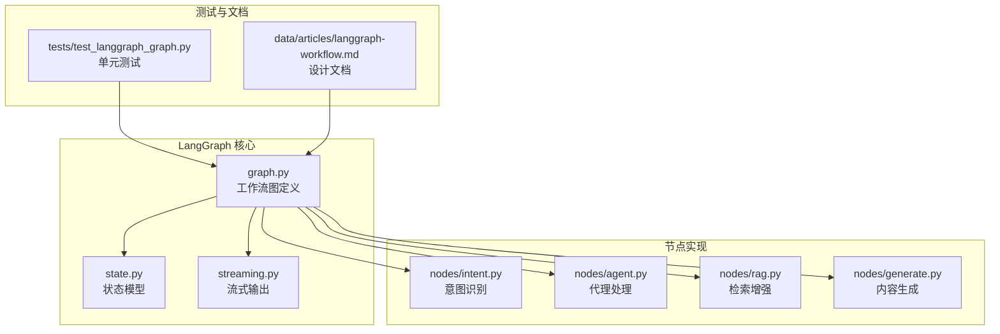
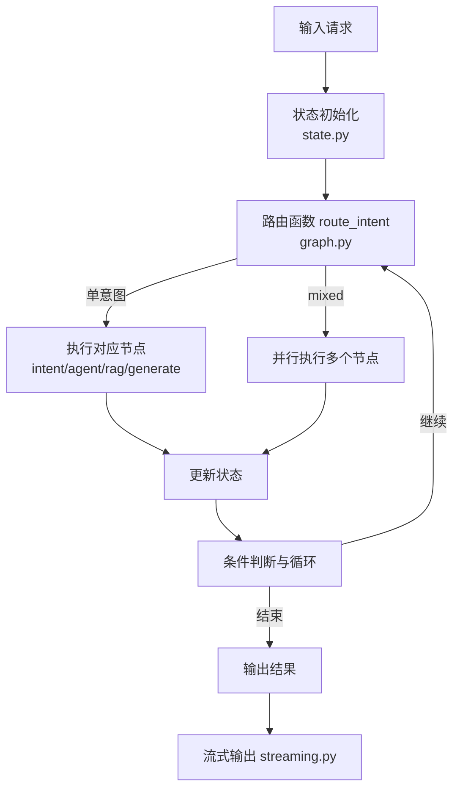
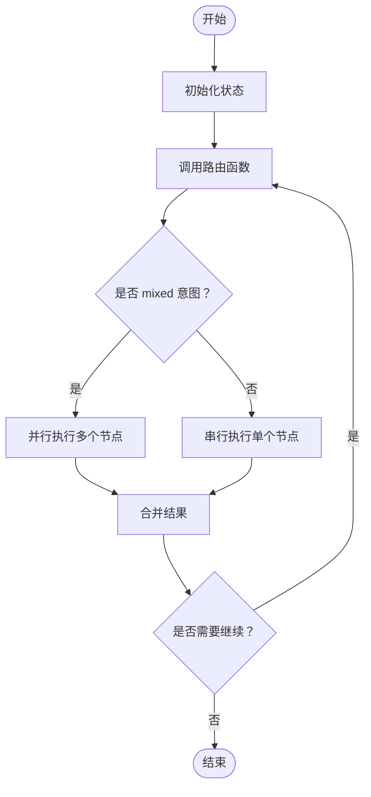
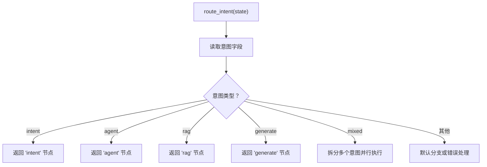
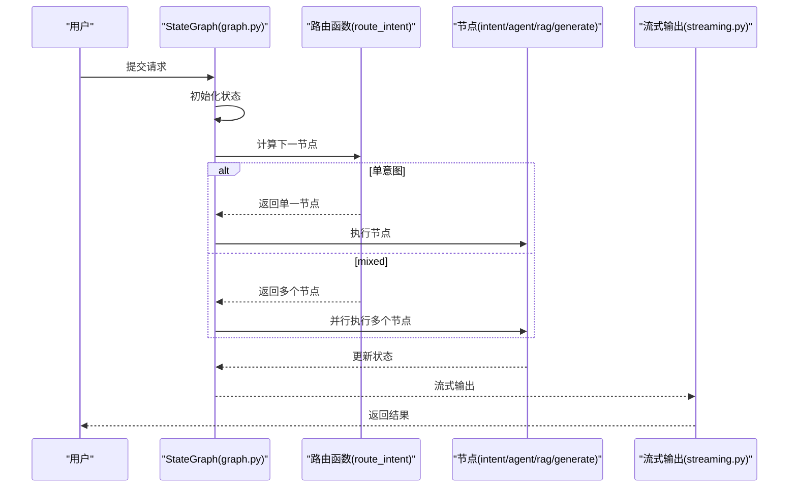
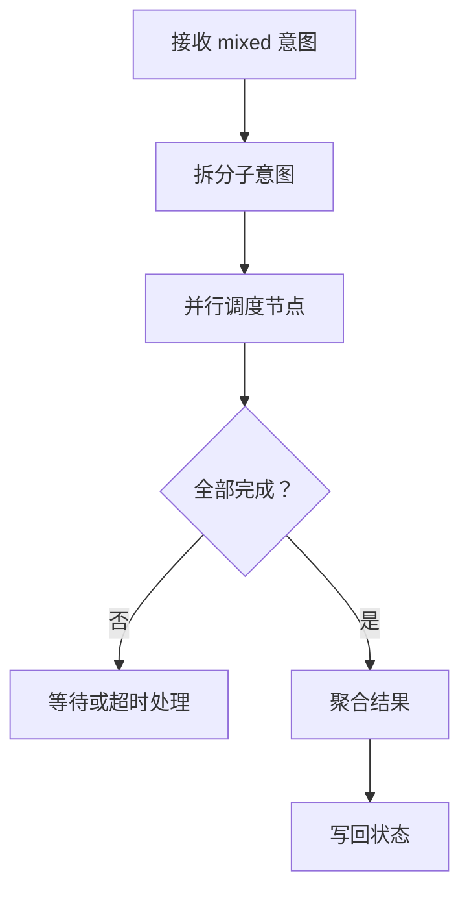
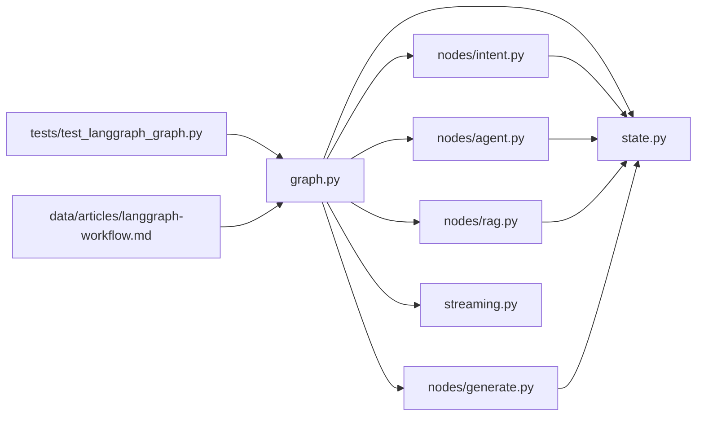

# 工作流图设计

<cite>
**本文引用的文件**
- [graph.py](file://backend/app/langgraph/graph.py)
- [state.py](file://backend/app/langgraph/state.py)
- [intent.py](file://backend/app/langgraph/nodes/intent.py)
- [agent.py](file://backend/app/langgraph/nodes/agent.py)
- [rag.py](file://backend/app/langgraph/nodes/rag.py)
- [generate.py](file://backend/app/langgraph/nodes/generate.py)
- [streaming.py](file://backend/app/langgraph/streaming.py)
- [test_langgraph_graph.py](file://backend/tests/test_langgraph_graph.py)
- [langgraph-workflow.md](file://backend/data/articles/langgraph-workflow.md)
</cite>

## 目录
1. [简介](#简介)
2. [项目结构](#项目结构)
3. [核心组件](#核心组件)
4. [架构总览](#架构总览)
5. [详细组件分析](#详细组件分析)
6. [依赖分析](#依赖分析)
7. [性能考虑](#性能考虑)
8. [故障排除指南](#故障排除指南)
9. [结论](#结论)
10. [附录](#附录)

## 简介
本技术文档围绕 LangGraph 工作流图进行系统化设计与实现解析，重点覆盖以下方面：
- StateGraph 的定义与配置：节点注册、条件边路由、执行流程控制
- 路由函数 route_intent 的实现逻辑：意图分类决策树与分支处理机制
- 整体执行流程：从输入意图到最终输出的完整路径
- 并行执行机制：在 mixed 意图下的实现方式
- 错误处理策略、超时管理与状态恢复机制
- 开发者实践指南：如何创建工作流图、自定义路由逻辑与调试执行流程

LangGraph 在本项目中作为后端智能体与检索增强生成（RAG）系统的编排核心，通过状态机模型将多节点处理流程以可观察、可扩展的方式组织起来。

## 项目结构
LangGraph 相关代码位于后端应用的 langgraph 子模块中，主要文件包括：
- 图与状态定义：graph.py、state.py
- 节点实现：nodes/intent.py、nodes/agent.py、nodes/rag.py、nodes/generate.py
- 流式输出：streaming.py
- 单元测试：tests/test_langgraph_graph.py
- 设计文档：data/articles/langgraph-workflow.md

图表来源
- [graph.py](file://backend/app/langgraph/graph.py)
- [state.py](file://backend/app/langgraph/state.py)
- [intent.py](file://backend/app/langgraph/nodes/intent.py)
- [agent.py](file://backend/app/langgraph/nodes/agent.py)
- [rag.py](file://backend/app/langgraph/nodes/rag.py)
- [generate.py](file://backend/app/langgraph/nodes/generate.py)
- [streaming.py](file://backend/app/langgraph/streaming.py)
- [test_langgraph_graph.py](file://backend/tests/test_langgraph_graph.py)
- [langgraph-workflow.md](file://backend/data/articles/langgraph-workflow.md)

章节来源
- [graph.py](file://backend/app/langgraph/graph.py)
- [state.py](file://backend/app/langgraph/state.py)
- [intent.py](file://backend/app/langgraph/nodes/intent.py)
- [agent.py](file://backend/app/langgraph/nodes/agent.py)
- [rag.py](file://backend/app/langgraph/nodes/rag.py)
- [generate.py](file://backend/app/langgraph/nodes/generate.py)
- [streaming.py](file://backend/app/langgraph/streaming.py)
- [test_langgraph_graph.py](file://backend/tests/test_langgraph_graph.py)
- [langgraph-workflow.md](file://backend/data/articles/langgraph-workflow.md)

## 核心组件
- StateGraph 定义与配置
  - 图的构建：通过节点注册、边定义与条件路由，形成可执行的状态机
  - 执行控制：支持串行、并行与条件跳转，结合状态字段驱动流程
- 路由函数 route_intent
  - 基于输入状态中的意图字段进行决策树式路由
  - 支持单意图与混合意图（mixed）分支处理
- 节点实现
  - 意图识别：提取用户输入中的意图类别
  - 代理处理：调用智能体完成任务
  - RAG：基于检索增强生成答案
  - 生成：最终内容输出
- 流式输出
  - 将中间结果与最终结果以流式方式返回客户端

章节来源
- [graph.py](file://backend/app/langgraph/graph.py)
- [state.py](file://backend/app/langgraph/state.py)
- [intent.py](file://backend/app/langgraph/nodes/intent.py)
- [agent.py](file://backend/app/langgraph/nodes/agent.py)
- [rag.py](file://backend/app/langgraph/nodes/rag.py)
- [generate.py](file://backend/app/langgraph/nodes/generate.py)
- [streaming.py](file://backend/app/langgraph/streaming.py)

## 架构总览
LangGraph 工作流采用状态机模型，将输入状态作为驱动，通过路由函数决定下一步执行的节点集合，并在节点间传递状态。整体架构如下：

图表来源
- [graph.py](file://backend/app/langgraph/graph.py)
- [state.py](file://backend/app/langgraph/state.py)
- [intent.py](file://backend/app/langgraph/nodes/intent.py)
- [agent.py](file://backend/app/langgraph/nodes/agent.py)
- [rag.py](file://backend/app/langgraph/nodes/rag.py)
- [generate.py](file://backend/app/langgraph/nodes/generate.py)
- [streaming.py](file://backend/app/langgraph/streaming.py)

## 详细组件分析

### StateGraph 定义与配置
- 节点注册
  - 通过图对象注册各节点，确保节点名称唯一且语义明确
  - 节点类型区分：意图识别、代理处理、RAG、生成等
- 条件边与路由
  - 使用路由函数根据状态字段进行条件跳转
  - 支持默认边与异常边，保证流程鲁棒性
- 执行流程控制
  - 支持串行执行与并行聚合
  - 循环与终止条件：当状态满足特定条件时结束流程

图表来源
- [graph.py](file://backend/app/langgraph/graph.py)
- [state.py](file://backend/app/langgraph/state.py)

章节来源
- [graph.py](file://backend/app/langgraph/graph.py)
- [state.py](file://backend/app/langgraph/state.py)

### 路由函数 route_intent 实现逻辑
- 输入与状态
  - 从状态中读取意图字段，作为路由决策依据
- 决策树与分支处理
  - 单意图：直接映射到对应节点（如 intent、agent、rag、generate）
  - mixed：拆分为多个子意图，触发并行执行
- 异常与兜底
  - 未知意图或解析失败时，进入默认分支或错误处理

图表来源
- [graph.py](file://backend/app/langgraph/graph.py)
- [intent.py](file://backend/app/langgraph/nodes/intent.py)

章节来源
- [graph.py](file://backend/app/langgraph/graph.py)
- [intent.py](file://backend/app/langgraph/nodes/intent.py)

### 执行流程：从意图分类到最终生成
- 步骤分解
  - 输入预处理与状态初始化
  - 调用路由函数确定下一节点
  - 执行节点逻辑并更新状态
  - 条件判断与循环控制
  - 流式输出最终结果
- 关键路径
  - 单意图：输入 → 意图识别 → 对应节点 → 输出
  - mixed：输入 → 意图识别 → 并行执行 → 结果聚合 → 输出

图表来源
- [graph.py](file://backend/app/langgraph/graph.py)
- [intent.py](file://backend/app/langgraph/nodes/intent.py)
- [agent.py](file://backend/app/langgraph/nodes/agent.py)
- [rag.py](file://backend/app/langgraph/nodes/rag.py)
- [generate.py](file://backend/app/langgraph/nodes/generate.py)
- [streaming.py](file://backend/app/langgraph/streaming.py)

章节来源
- [graph.py](file://backend/app/langgraph/graph.py)
- [intent.py](file://backend/app/langgraph/nodes/intent.py)
- [agent.py](file://backend/app/langgraph/nodes/agent.py)
- [rag.py](file://backend/app/langgraph/nodes/rag.py)
- [generate.py](file://backend/app/langgraph/nodes/generate.py)
- [streaming.py](file://backend/app/langgraph/streaming.py)

### 并行执行机制（mixed 意图）
- 触发条件
  - 路由函数检测到 mixed 类型意图
- 执行策略
  - 将混合意图拆分为多个独立子意图
  - 并行调度对应节点，等待所有子意图完成
  - 合并结果并写回状态
- 聚合与一致性
  - 统一的聚合逻辑保证不同来源的结果格式一致
  - 失败处理：部分节点失败时的降级与重试策略

图表来源
- [graph.py](file://backend/app/langgraph/graph.py)
- [intent.py](file://backend/app/langgraph/nodes/intent.py)
- [agent.py](file://backend/app/langgraph/nodes/agent.py)
- [rag.py](file://backend/app/langgraph/nodes/rag.py)
- [generate.py](file://backend/app/langgraph/nodes/generate.py)

章节来源
- [graph.py](file://backend/app/langgraph/graph.py)
- [intent.py](file://backend/app/langgraph/nodes/intent.py)
- [agent.py](file://backend/app/langgraph/nodes/agent.py)
- [rag.py](file://backend/app/langgraph/nodes/rag.py)
- [generate.py](file://backend/app/langgraph/nodes/generate.py)

### 错误处理、超时管理与状态恢复
- 错误处理
  - 节点级异常捕获与上报
  - 默认分支兜底与错误状态标记
- 超时管理
  - 为长耗时节点设置超时阈值
  - 超时后中断执行并记录日志
- 状态恢复
  - 通过状态快照与重放机制恢复执行
  - 支持关键节点的幂等性设计

章节来源
- [graph.py](file://backend/app/langgraph/graph.py)
- [state.py](file://backend/app/langgraph/state.py)

### 开发者实践指南
- 创建工作流图
  - 定义状态模型与初始值
  - 注册节点并建立边与条件路由
  - 配置并行与循环控制
- 自定义路由逻辑
  - 扩展路由函数以支持新的意图类型
  - 为新节点添加路由映射
- 调试执行流程
  - 利用单元测试验证路由与节点行为
  - 使用流式输出观察中间状态

章节来源
- [test_langgraph_graph.py](file://backend/tests/test_langgraph_graph.py)
- [graph.py](file://backend/app/langgraph/graph.py)
- [state.py](file://backend/app/langgraph/state.py)

## 依赖分析
LangGraph 的模块间依赖关系如下：

图表来源
- [graph.py](file://backend/app/langgraph/graph.py)
- [state.py](file://backend/app/langgraph/state.py)
- [intent.py](file://backend/app/langgraph/nodes/intent.py)
- [agent.py](file://backend/app/langgraph/nodes/agent.py)
- [rag.py](file://backend/app/langgraph/nodes/rag.py)
- [generate.py](file://backend/app/langgraph/nodes/generate.py)
- [streaming.py](file://backend/app/langgraph/streaming.py)
- [test_langgraph_graph.py](file://backend/tests/test_langgraph_graph.py)
- [langgraph-workflow.md](file://backend/data/articles/langgraph-workflow.md)

章节来源
- [graph.py](file://backend/app/langgraph/graph.py)
- [state.py](file://backend/app/langgraph/state.py)
- [intent.py](file://backend/app/langgraph/nodes/intent.py)
- [agent.py](file://backend/app/langgraph/nodes/agent.py)
- [rag.py](file://backend/app/langgraph/nodes/rag.py)
- [generate.py](file://backend/app/langgraph/nodes/generate.py)
- [streaming.py](file://backend/app/langgraph/streaming.py)
- [test_langgraph_graph.py](file://backend/tests/test_langgraph_graph.py)
- [langgraph-workflow.md](file://backend/data/articles/langgraph-workflow.md)

## 性能考虑
- 节点并行化
  - 对于 mixed 意图，合理拆分子意图以提升吞吐
- 资源隔离
  - 为长耗时节点设置独立线程池或进程池
- 缓存与复用
  - 复用检索结果与中间计算缓存
- 流式输出
  - 减少前端等待时间，提升交互体验

## 故障排除指南
- 常见问题
  - 路由失败：检查状态字段与路由映射
  - 节点异常：查看节点日志与异常栈
  - 并行阻塞：确认并发数与资源限制
- 排查步骤
  - 启用详细日志与指标采集
  - 使用单元测试定位问题节点
  - 回滚至最近稳定状态并重放

章节来源
- [test_langgraph_graph.py](file://backend/tests/test_langgraph_graph.py)
- [graph.py](file://backend/app/langgraph/graph.py)
- [state.py](file://backend/app/langgraph/state.py)

## 结论
LangGraph 工作流图通过清晰的状态模型与可扩展的路由机制，实现了从意图识别到最终输出的全链路编排。其并行执行能力与完善的错误处理策略，使其适用于复杂业务场景。建议在实际落地中持续完善路由规则、优化节点性能并加强可观测性建设。

## 附录
- 设计文档参考：data/articles/langgraph-workflow.md
- 单元测试参考：tests/test_langgraph_graph.py

章节来源
- [langgraph-workflow.md](file://backend/data/articles/langgraph-workflow.md)
- [test_langgraph_graph.py](file://backend/tests/test_langgraph_graph.py)