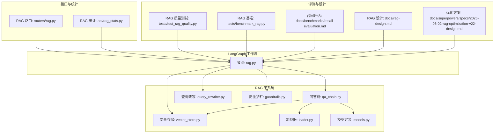
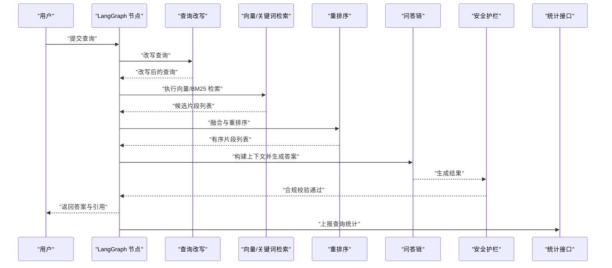
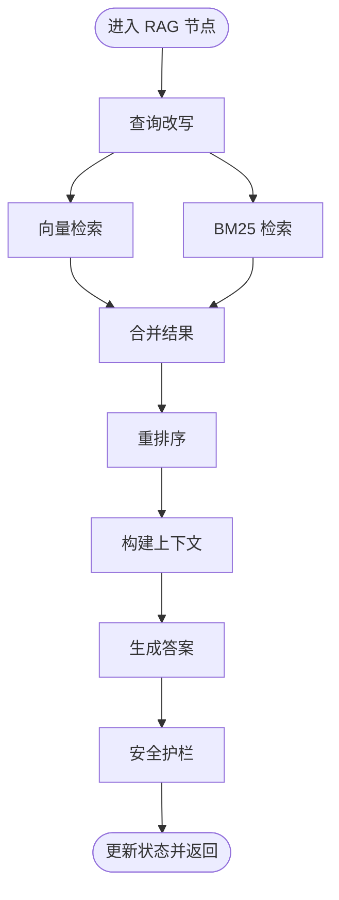
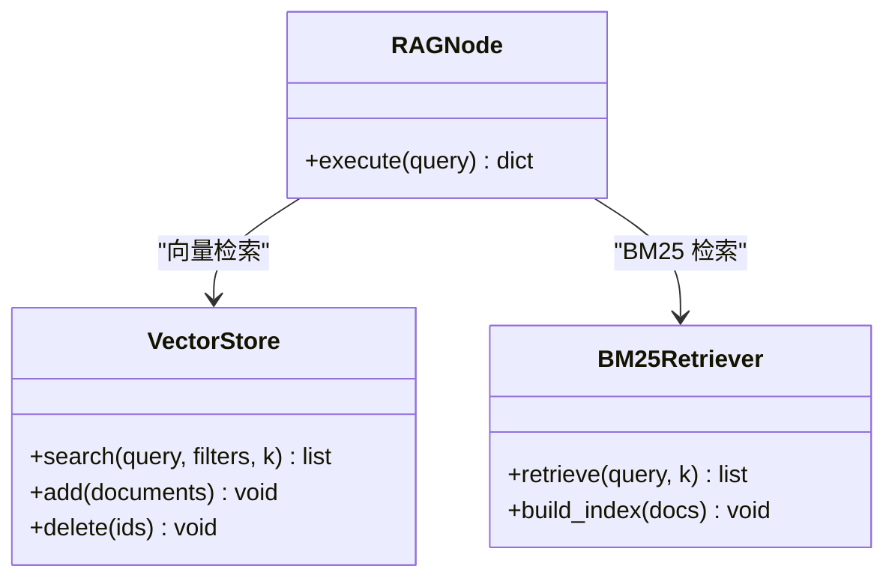
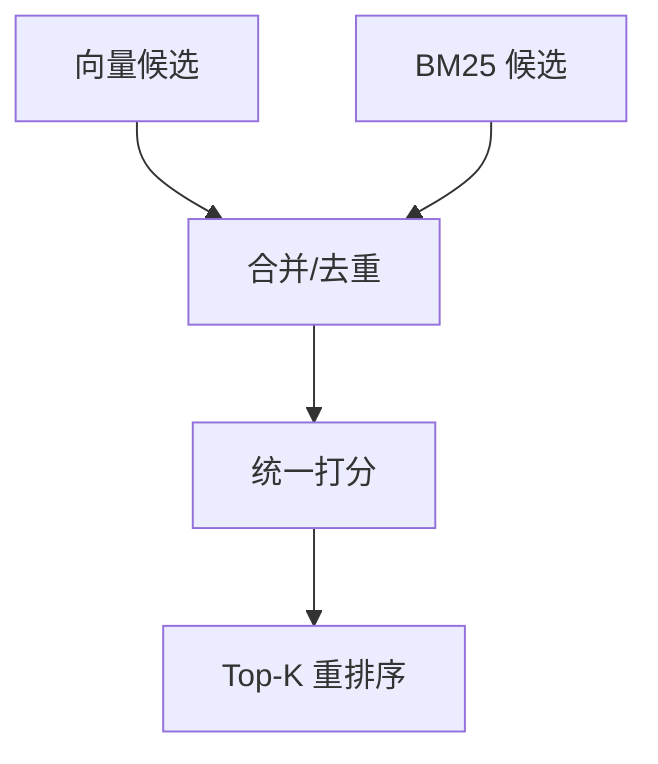
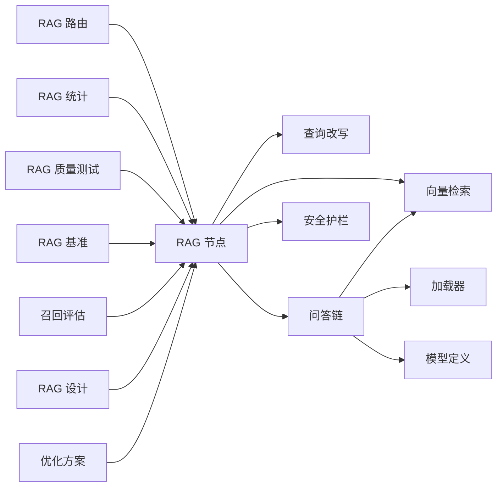

# RAG 节点

<cite>
**本文档引用的文件**
- [backend/app/langgraph/nodes/rag.py](file://backend/app/langgraph/nodes/rag.py)
- [backend/app/rag/vector_store.py](file://backend/app/rag/vector_store.py)
- [backend/app/rag/qa_chain.py](file://backend/app/rag/qa_chain.py)
- [backend/app/rag/query_rewriter.py](file://backend/app/rag/query_rewriter.py)
- [backend/app/rag/guardrails.py](file://backend/app/rag/guardrails.py)
- [backend/app/rag/loader.py](file://backend/app/rag/loader.py)
- [backend/app/rag/models.py](file://backend/app/rag/models.py)
- [backend/app/routers/rag.py](file://backend/app/routers/rag.py)
- [backend/app/api/rag_stats.py](file://backend/app/api/rag_stats.py)
- [backend/tests/test_rag_quality.py](file://backend/tests/test_rag_quality.py)
- [backend/tests/benchmark_rag.py](file://backend/tests/benchmark_rag.py)
- [docs/benchmarks/recall-evaluation.md](file://docs/benchmarks/recall-evaluation.md)
- [docs/rag-design.md](file://docs/rag-design.md)
- [docs/superpowers/specs/2026-06-02-rag-optimization-v22-design.md](file://docs/superpowers/specs/2026-06-02-rag-optimization-v22-design.md)
</cite>

## 目录
1. [简介](#简介)
2. [项目结构](#项目结构)
3. [核心组件](#核心组件)
4. [架构总览](#架构总览)
5. [详细组件分析](#详细组件分析)
6. [依赖关系分析](#依赖关系分析)
7. [性能考量](#性能考量)
8. [故障排查指南](#故障排查指南)
9. [结论](#结论)
10. [附录](#附录)

## 简介
本文件面向开发者与技术负责人，系统化梳理 LangGraph 工作流中的 RAG 节点设计与实现，覆盖检索增强生成（RAG）的完整流程：查询改写、向量检索、BM25 检索、混合检索与重排序、上下文构建、生成链路、引用与溯源、质量评估与性能调优、监控与故障诊断。文档以仓库中实际代码与设计文档为依据，避免臆测，确保可操作性与可追溯性。

## 项目结构
RAG 能力由后端 Python 服务提供，核心位于 backend/app/rag 及其 LangGraph 节点 backend/app/langgraph/nodes/rag.py；前端通过路由接口与后端交互；评测与基准测试位于 backend/tests 与 docs/benchmarks。

**图表来源**
- [backend/app/langgraph/nodes/rag.py](file://backend/app/langgraph/nodes/rag.py)
- [backend/app/rag/qa_chain.py](file://backend/app/rag/qa_chain.py)
- [backend/app/rag/vector_store.py](file://backend/app/rag/vector_store.py)
- [backend/app/rag/query_rewriter.py](file://backend/app/rag/query_rewriter.py)
- [backend/app/rag/guardrails.py](file://backend/app/rag/guardrails.py)
- [backend/app/rag/loader.py](file://backend/app/rag/loader.py)
- [backend/app/rag/models.py](file://backend/app/rag/models.py)
- [backend/app/routers/rag.py](file://backend/app/routers/rag.py)
- [backend/app/api/rag_stats.py](file://backend/app/api/rag_stats.py)
- [backend/tests/test_rag_quality.py](file://backend/tests/test_rag_quality.py)
- [backend/tests/benchmark_rag.py](file://backend/tests/benchmark_rag.py)
- [docs/benchmarks/recall-evaluation.md](file://docs/benchmarks/recall-evaluation.md)
- [docs/rag-design.md](file://docs/rag-design.md)
- [docs/superpowers/specs/2026-06-02-rag-optimization-v22-design.md](file://docs/superpowers/specs/2026-06-02-rag-optimization-v22-design.md)

**章节来源**
- [backend/app/langgraph/nodes/rag.py](file://backend/app/langgraph/nodes/rag.py)
- [backend/app/routers/rag.py](file://backend/app/routers/rag.py)

## 核心组件
- LangGraph RAG 节点：负责在工作流中编排检索与生成，接收用户查询，输出带引用的答案。
- 向量检索：基于嵌入向量的相似度检索，支持过滤与评分。
- BM25 检索：基于关键词匹配的传统检索，补充语义不足。
- 混合检索与重排序：融合向量与 BM25 结果，按统一分数排序。
- 上下文构建：从检索结果抽取片段，拼接提示词模板。
- 问答链：封装检索到的上下文与原始问题，调用 LLM 生成答案。
- 安全护栏：对输入输出进行合规检查与风险控制。
- 加载器：文档分块、元数据处理与预处理。
- 模型定义：LLM 与嵌入模型的配置与调用封装。
- 接口与统计：对外暴露 RAG 路由与统计接口，便于观测与治理。

**章节来源**
- [backend/app/langgraph/nodes/rag.py](file://backend/app/langgraph/nodes/rag.py)
- [backend/app/rag/vector_store.py](file://backend/app/rag/vector_store.py)
- [backend/app/rag/qa_chain.py](file://backend/app/rag/qa_chain.py)
- [backend/app/rag/query_rewriter.py](file://backend/app/rag/query_rewriter.py)
- [backend/app/rag/guardrails.py](file://backend/app/rag/guardrails.py)
- [backend/app/rag/loader.py](file://backend/app/rag/loader.py)
- [backend/app/rag/models.py](file://backend/app/rag/models.py)
- [backend/app/routers/rag.py](file://backend/app/routers/rag.py)
- [backend/app/api/rag_stats.py](file://backend/app/api/rag_stats.py)

## 架构总览
LangGraph RAG 节点作为工作流的一个步骤，串联查询改写、检索、重排序与生成链路，并通过安全护栏与统计接口保障质量与可观测性。

**图表来源**
- [backend/app/langgraph/nodes/rag.py](file://backend/app/langgraph/nodes/rag.py)
- [backend/app/rag/query_rewriter.py](file://backend/app/rag/query_rewriter.py)
- [backend/app/rag/vector_store.py](file://backend/app/rag/vector_store.py)
- [backend/app/rag/qa_chain.py](file://backend/app/rag/qa_chain.py)
- [backend/app/rag/guardrails.py](file://backend/app/rag/guardrails.py)
- [backend/app/api/rag_stats.py](file://backend/app/api/rag_stats.py)

## 详细组件分析

### LangGraph RAG 节点
- 角色与职责：在 LangGraph 工作流中作为“RAG”节点，接收消息状态，触发检索与生成，更新状态并返回下一步。
- 关键流程：
  - 查询改写：将用户查询转换为更适合检索的形式。
  - 检索执行：并行或串行执行向量检索与 BM25 检索。
  - 结果融合与重排序：对多源结果进行统一打分与排序。
  - 上下文构建：截取排序后的片段，拼接到提示词模板。
  - 生成与引用：调用问答链生成答案，附加引用信息。
  - 安全护栏：对最终输出进行合规检查。
- 状态管理：读取/写入对话历史、检索片段、生成结果等字段，确保工作流连续性。

**图表来源**
- [backend/app/langgraph/nodes/rag.py](file://backend/app/langgraph/nodes/rag.py)
- [backend/app/rag/query_rewriter.py](file://backend/app/rag/query_rewriter.py)
- [backend/app/rag/vector_store.py](file://backend/app/rag/vector_store.py)
- [backend/app/rag/qa_chain.py](file://backend/app/rag/qa_chain.py)
- [backend/app/rag/guardrails.py](file://backend/app/rag/guardrails.py)

**章节来源**
- [backend/app/langgraph/nodes/rag.py](file://backend/app/langgraph/nodes/rag.py)

### 向量检索与 BM25 检索
- 向量检索：基于嵌入模型计算查询与文档向量相似度，支持过滤条件与 top-k 返回。
- BM25 检索：基于关键词匹配与词频统计，补充语义检索的不足。
- 协调机制：两者独立执行后在 RAG 节点中进行融合与重排序，平衡语义与关键词命中。

**图表来源**
- [backend/app/rag/vector_store.py](file://backend/app/rag/vector_store.py)
- [backend/app/langgraph/nodes/rag.py](file://backend/app/langgraph/nodes/rag.py)

**章节来源**
- [backend/app/rag/vector_store.py](file://backend/app/rag/vector_store.py)
- [backend/app/langgraph/nodes/rag.py](file://backend/app/langgraph/nodes/rag.py)

### 混合检索与重排序
- 融合策略：对向量与 BM25 的候选结果进行去重与合并，结合各自得分进行加权融合。
- 重排序算法：采用统一打分函数（如线性加权、学习排序等），按相关性降序排列。
- 参数敏感度：权重与阈值需结合业务场景与评测指标进行调优。

**图表来源**
- [backend/app/langgraph/nodes/rag.py](file://backend/app/langgraph/nodes/rag.py)

**章节来源**
- [backend/app/langgraph/nodes/rag.py](file://backend/app/langgraph/nodes/rag.py)

### 上下文构建策略
- 片段选择：按重排序后的顺序累加，直到达到最大上下文长度或累积相似度阈值。
- 提示词模板：将用户问题与上下文拼接，注入角色指令与格式约束。
- 长度控制：防止上下文过长导致成本上升与延迟增加。

**章节来源**
- [backend/app/rag/qa_chain.py](file://backend/app/rag/qa_chain.py)
- [backend/app/rag/vector_store.py](file://backend/app/rag/vector_store.py)

### 问答链与生成
- 问答链封装：连接检索、上下文与 LLM，支持流式与非流式生成。
- LLM 调用：根据模型配置选择合适的推理参数（温度、最大生成长度等）。
- 输出解析：提取答案文本与引用片段，供前端展示与溯源。

**章节来源**
- [backend/app/rag/qa_chain.py](file://backend/app/rag/qa_chain.py)
- [backend/app/rag/models.py](file://backend/app/rag/models.py)

### 安全护栏与合规
- 输入校验：过滤异常字符、敏感词与过长查询。
- 输出校验：检测事实性、偏见与敏感内容，必要时拒绝回答或要求二次审核。
- 记录与审计：记录违规事件与处置结果，支撑合规报告。

**章节来源**
- [backend/app/rag/guardrails.py](file://backend/app/rag/guardrails.py)

### 文档加载与预处理
- 分块策略：基于语义边界与固定长度的混合分块，减少跨块语义断裂。
- 元数据保留：标题、来源、时间戳等用于后续筛选与溯源。
- 批量入库：高效写入向量库与倒排索引，保证检索性能。

**章节来源**
- [backend/app/rag/loader.py](file://backend/app/rag/loader.py)

### 引用生成与溯源
- 片段映射：将生成答案中的关键片段映射回检索到的原文片段。
- 引用标注：在答案末尾或侧边栏展示来源链接与片段摘要。
- 可验证性：确保每个引用均可追溯至原始文档，提升可信度。

**章节来源**
- [backend/app/rag/qa_chain.py](file://backend/app/rag/qa_chain.py)
- [backend/app/rag/vector_store.py](file://backend/app/rag/vector_store.py)

## 依赖关系分析
- LangGraph 节点依赖于查询改写、向量检索、问答链与安全护栏模块。
- 问答链依赖向量存储、加载器与模型定义。
- 路由器与统计接口为外部系统提供访问入口与观测能力。
- 测试与设计文档为质量评估与优化提供依据。

**图表来源**
- [backend/app/langgraph/nodes/rag.py](file://backend/app/langgraph/nodes/rag.py)
- [backend/app/rag/query_rewriter.py](file://backend/app/rag/query_rewriter.py)
- [backend/app/rag/vector_store.py](file://backend/app/rag/vector_store.py)
- [backend/app/rag/qa_chain.py](file://backend/app/rag/qa_chain.py)
- [backend/app/rag/guardrails.py](file://backend/app/rag/guardrails.py)
- [backend/app/rag/loader.py](file://backend/app/rag/loader.py)
- [backend/app/rag/models.py](file://backend/app/rag/models.py)
- [backend/app/routers/rag.py](file://backend/app/routers/rag.py)
- [backend/app/api/rag_stats.py](file://backend/app/api/rag_stats.py)
- [backend/tests/test_rag_quality.py](file://backend/tests/test_rag_quality.py)
- [backend/tests/benchmark_rag.py](file://backend/tests/benchmark_rag.py)
- [docs/benchmarks/recall-evaluation.md](file://docs/benchmarks/recall-evaluation.md)
- [docs/rag-design.md](file://docs/rag-design.md)
- [docs/superpowers/specs/2026-06-02-rag-optimization-v22-design.md](file://docs/superpowers/specs/2026-06-02-rag-optimization-v22-design.md)

**章节来源**
- [backend/app/langgraph/nodes/rag.py](file://backend/app/langgraph/nodes/rag.py)
- [backend/app/rag/qa_chain.py](file://backend/app/rag/qa_chain.py)
- [backend/app/routers/rag.py](file://backend/app/routers/rag.py)
- [backend/app/api/rag_stats.py](file://backend/app/api/rag_stats.py)
- [backend/tests/test_rag_quality.py](file://backend/tests/test_rag_quality.py)
- [backend/tests/benchmark_rag.py](file://backend/tests/benchmark_rag.py)
- [docs/benchmarks/recall-evaluation.md](file://docs/benchmarks/recall-evaluation.md)
- [docs/rag-design.md](file://docs/rag-design.md)
- [docs/superpowers/specs/2026-06-02-rag-optimization-v22-design.md](file://docs/superpowers/specs/2026-06-02-rag-optimization-v22-design.md)

## 性能考量
- 检索层
  - 向量检索：合理设置 top-k 与过滤条件，避免返回过多无关片段；启用索引加速与批量查询。
  - BM25 检索：维护高质量词表与停用词规则，提升关键词命中率。
  - 混合融合：对不同来源结果进行权重调优，结合业务指标动态调整。
- 生成层
  - 控制上下文长度，避免超出模型上下文窗口；必要时采用分段生成或摘要策略。
  - 调整生成参数（温度、最大生成长度）以平衡创造性与稳定性。
- 存储与索引
  - 向量库与倒排索引定期重建与压缩，保持检索精度与速度。
  - 文档分块策略影响检索效率与准确性，需持续迭代。
- 监控与告警
  - 关键指标：检索耗时、生成耗时、召回率、准确率、P@K、R@K、F1、上下文长度分布、错误率。
  - 建议接入 APM 与日志平台，设置阈值告警与自动降级策略。

**章节来源**
- [backend/app/rag/vector_store.py](file://backend/app/rag/vector_store.py)
- [backend/tests/benchmark_rag.py](file://backend/tests/benchmark_rag.py)
- [docs/benchmarks/recall-evaluation.md](file://docs/benchmarks/recall-evaluation.md)
- [docs/superpowers/specs/2026-06-02-rag-optimization-v22-design.md](file://docs/superpowers/specs/2026-06-02-rag-optimization-v22-design.md)

## 故障排查指南
- 常见问题
  - 检索无结果：检查查询改写是否正确、过滤条件是否过于严格、索引是否完整。
  - 生成质量差：检查上下文长度、提示词模板、模型参数与分块质量。
  - 引用缺失：确认向量库与元数据一致性，以及引用映射逻辑。
  - 合规拦截：审查安全护栏规则与阈值，必要时降低拦截强度并加强人工复核。
- 诊断步骤
  - 开启详细日志，定位失败环节（检索/生成/护栏）。
  - 使用基准测试与质量评估脚本对比不同配置下的指标变化。
  - 对比召回评估文档中的标准流程，逐项核对实现差异。
- 回归与修复
  - 针对发现的问题，先冻结当前配置，再逐一调整参数并回归测试。
  - 将修复方案纳入设计文档与优化方案，形成知识沉淀。

**章节来源**
- [backend/tests/test_rag_quality.py](file://backend/tests/test_rag_quality.py)
- [backend/tests/benchmark_rag.py](file://backend/tests/benchmark_rag.py)
- [docs/benchmarks/recall-evaluation.md](file://docs/benchmarks/recall-evaluation.md)
- [docs/rag-design.md](file://docs/rag-design.md)

## 结论
LangGraph RAG 节点通过清晰的模块化设计与完善的质量保障体系，实现了从查询到答案与引用的闭环。建议在生产环境中持续进行指标监控、召回评估与参数调优，结合设计与优化方案文档，逐步提升检索质量与生成稳定性。

## 附录
- 配置参数与调优要点（示例维度）
  - 检索参数：top-k、过滤条件、融合权重、重排序阈值。
  - 生成参数：温度、最大生成长度、提示词模板、上下文上限。
  - 存储参数：分块大小、重叠比例、索引类型与刷新周期。
- 评测指标与优化方向
  - 指标：准确率、召回率、P@K、R@K、F1、上下文长度分布、响应时间、错误率。
  - 方向：提升召回与准确率、降低响应时间、稳定上下文长度、减少合规拦截误伤。

**章节来源**
- [backend/app/rag/vector_store.py](file://backend/app/rag/vector_store.py)
- [backend/app/rag/qa_chain.py](file://backend/app/rag/qa_chain.py)
- [backend/tests/test_rag_quality.py](file://backend/tests/test_rag_quality.py)
- [docs/benchmarks/recall-evaluation.md](file://docs/benchmarks/recall-evaluation.md)
- [docs/rag-design.md](file://docs/rag-design.md)
- [docs/superpowers/specs/2026-06-02-rag-optimization-v22-design.md](file://docs/superpowers/specs/2026-06-02-rag-optimization-v22-design.md)