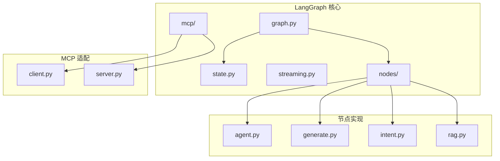
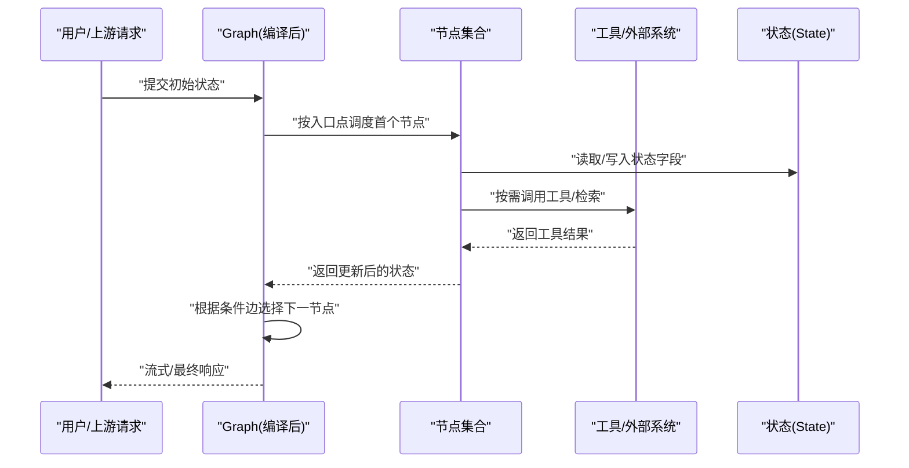
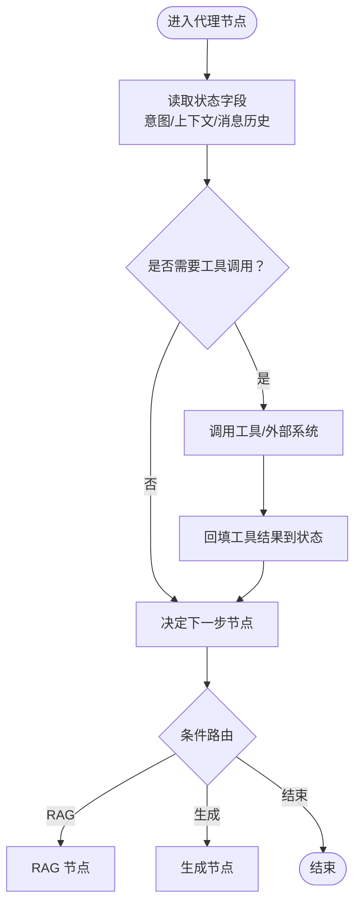
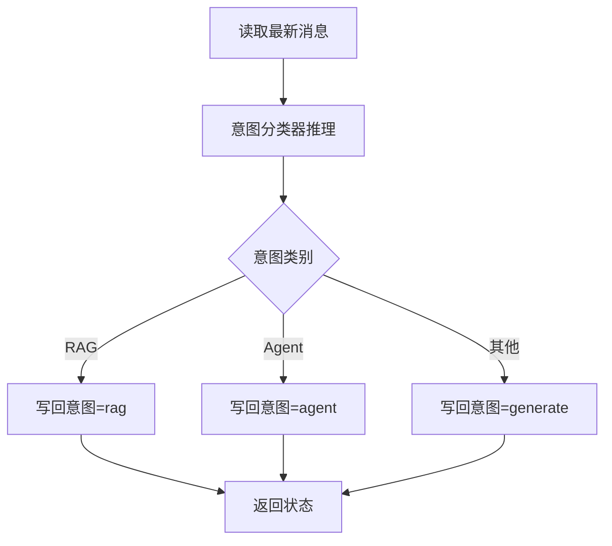
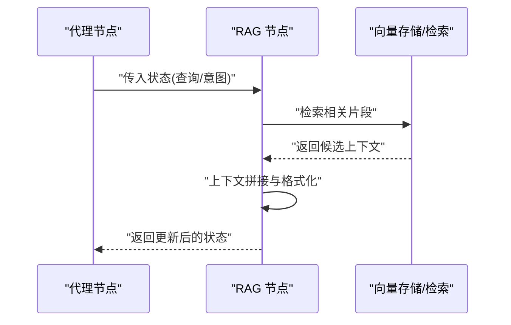
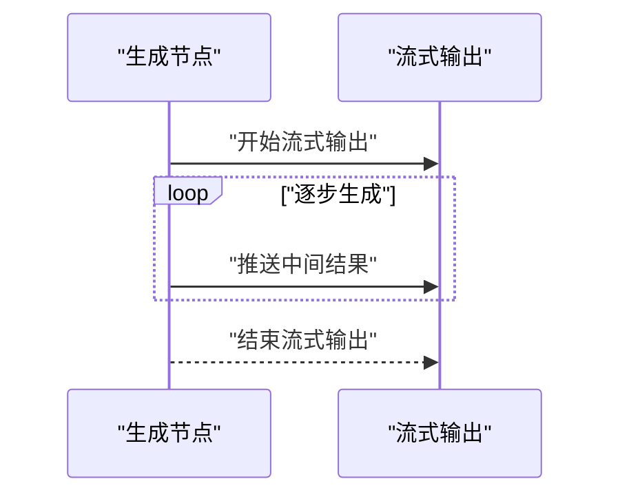
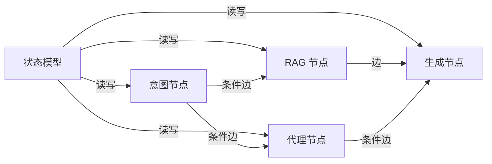
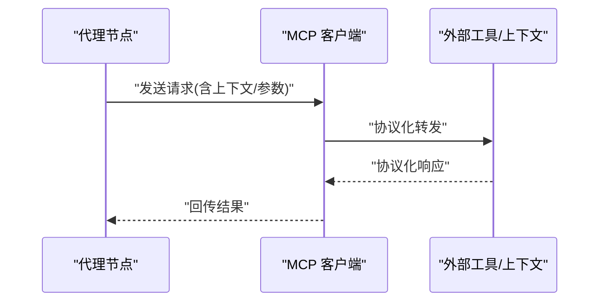
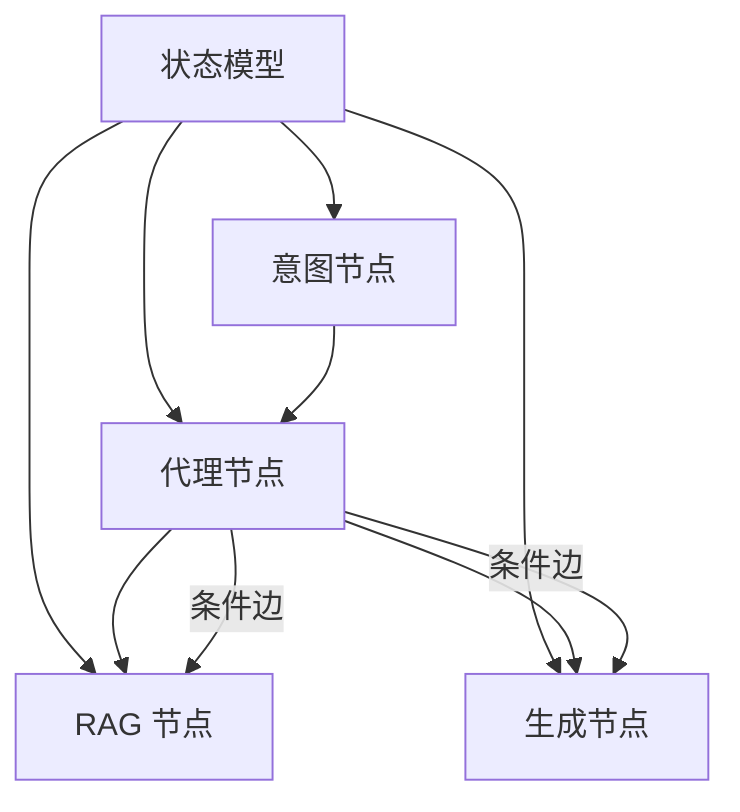

# 代理节点

<cite>
**本文引用的文件**
- [backend/app/langgraph/__init__.py](file://backend/app/langgraph/__init__.py)
- [backend/app/langgraph/graph.py](file://backend/app/langgraph/graph.py)
- [backend/app/langgraph/state.py](file://backend/app/langgraph/state.py)
- [backend/app/langgraph/streaming.py](file://backend/app/langgraph/streaming.py)
- [backend/app/langgraph/nodes/__init__.py](file://backend/app/langgraph/nodes/__init__.py)
- [backend/app/langgraph/nodes/agent.py](file://backend/app/langgraph/nodes/agent.py)
- [backend/app/langgraph/nodes/generate.py](file://backend/app/langgraph/nodes/generate.py)
- [backend/app/langgraph/nodes/intent.py](file://backend/app/langgraph/nodes/intent.py)
- [backend/app/langgraph/nodes/rag.py](file://backend/app/langgraph/nodes/rag.py)
- [backend/app/langgraph/mcp/__init__.py](file://backend/app/langgraph/mcp/__init__.py)
- [backend/app/langgraph/mcp/client.py](file://backend/app/langgraph/mcp/client.py)
- [backend/app/langgraph/mcp/server.py](file://backend/app/langgraph/mcp/server.py)
- [backend/data/articles/langgraph-workflow.md](file://backend/data/articles/langgraph-workflow.md)
- [backend/data/articles/ai-agent-architecture.md](file://backend/data/articles/ai-agent-architecture.md)
- [backend/tests/test_langgraph.py](file://backend/tests/test_langgraph.py)
- [backend/tests/test_langgraph_graph.py](file://backend/tests/test_langgraph_graph.py)
</cite>

## 目录
1. [简介](#简介)
2. [项目结构](#项目结构)
3. [核心组件](#核心组件)
4. [架构总览](#架构总览)
5. [详细组件分析](#详细组件分析)
6. [依赖关系分析](#依赖关系分析)
7. [性能考虑](#性能考虑)
8. [故障排除指南](#故障排除指南)
9. [结论](#结论)
10. [附录](#附录)

## 简介
本文件聚焦于 LangGraph 代理节点在后端系统中的实现与运行机制，围绕以下目标展开：  
- 代理节点的架构设计与执行流程  
- 智能调度与任务分配策略  
- 代理与工具系统的集成方式  
- 任务生命周期管理与状态跟踪  
- 并行执行模式与队列管理策略  
- 配置选项与可扩展点  
- 监控指标与性能分析  
- 失败重试与降级策略  
- 调试技巧与故障排除  

LangGraph 在本项目中用于构建“状态图”工作流，通过节点（Node）、条件边（Conditional Edges）与状态（State）协同完成复杂任务编排。代理节点作为其中的关键一环，负责根据当前状态做出决策、调用工具或与其他节点交互。

## 项目结构
LangGraph 模块位于后端应用的 langgraph 子目录下，包含工作流图定义、状态模型、节点实现以及 MCP（Model Context Protocol）适配层。测试用例覆盖了工作流编译、节点执行与图结构验证等场景。

图表来源
- [backend/app/langgraph/graph.py](file://backend/app/langgraph/graph.py)
- [backend/app/langgraph/state.py](file://backend/app/langgraph/state.py)
- [backend/app/langgraph/streaming.py](file://backend/app/langgraph/streaming.py)
- [backend/app/langgraph/nodes/agent.py](file://backend/app/langgraph/nodes/agent.py)
- [backend/app/langgraph/nodes/generate.py](file://backend/app/langgraph/nodes/generate.py)
- [backend/app/langgraph/nodes/intent.py](file://backend/app/langgraph/nodes/intent.py)
- [backend/app/langgraph/nodes/rag.py](file://backend/app/langgraph/nodes/rag.py)
- [backend/app/langgraph/mcp/client.py](file://backend/app/langgraph/mcp/client.py)
- [backend/app/langgraph/mcp/server.py](file://backend/app/langgraph/mcp/server.py)

章节来源
- [backend/app/langgraph/__init__.py](file://backend/app/langgraph/__init__.py)
- [backend/app/langgraph/nodes/__init__.py](file://backend/app/langgraph/nodes/__init__.py)

## 核心组件
- 状态模型（State）：定义工作流中传递的数据结构，承载查询意图、RAG 上下文、中间结果与最终答案等字段，支撑条件路由与节点间数据流转。
- 图（Graph）：以状态图为骨架，注册节点、设置入口点、添加有向边与条件边，最终编译为可执行的应用实例。
- 节点（Nodes）：具体业务单元，如意图识别、RAG 检索、生成回答、代理执行等，每个节点接收状态并返回更新后的状态字典。
- 流式输出（Streaming）：支持增量输出与事件推送，便于前端实时展示代理推理过程与中间结果。
- MCP 适配：提供客户端与服务端实现，用于与外部模型上下文或工具环境进行协议化通信。

章节来源
- [backend/app/langgraph/state.py](file://backend/app/langgraph/state.py)
- [backend/app/langgraph/graph.py](file://backend/app/langgraph/graph.py)
- [backend/app/langgraph/streaming.py](file://backend/app/langgraph/streaming.py)
- [backend/app/langgraph/nodes/agent.py](file://backend/app/langgraph/nodes/agent.py)
- [backend/app/langgraph/nodes/generate.py](file://backend/app/langgraph/nodes/generate.py)
- [backend/app/langgraph/nodes/intent.py](file://backend/app/langgraph/nodes/intent.py)
- [backend/app/langgraph/nodes/rag.py](file://backend/app/langgraph/nodes/rag.py)
- [backend/app/langgraph/mcp/client.py](file://backend/app/langgraph/mcp/client.py)
- [backend/app/langgraph/mcp/server.py](file://backend/app/langgraph/mcp/server.py)

## 架构总览
LangGraph 代理节点的执行由“状态驱动 + 条件路由 + 节点编排”构成。整体流程如下：

图表来源
- [backend/app/langgraph/graph.py](file://backend/app/langgraph/graph.py)
- [backend/app/langgraph/state.py](file://backend/app/langgraph/state.py)
- [backend/app/langgraph/nodes/agent.py](file://backend/app/langgraph/nodes/agent.py)
- [backend/app/langgraph/nodes/rag.py](file://backend/app/langgraph/nodes/rag.py)
- [backend/app/langgraph/nodes/generate.py](file://backend/app/langgraph/nodes/generate.py)

## 详细组件分析

### 代理节点（Agent Node）
- 角色与职责：根据当前状态判断下一步动作，可能包括继续对话、调用工具、进入 RAG 或生成最终答案；在多轮对话中维持上下文一致性。
- 输入/输出：输入为完整状态对象，输出为状态更新（如消息、意图、上下文、错误标记等）。
- 与工具系统集成：通过工具调用接口将状态中的意图或问题转化为外部系统操作，再回填工具结果到状态。
- 与 MCP 的协作：可通过 MCP 客户端/服务端桥接外部能力，实现协议化的上下文与工具交互。
- 并行与队列：在多代理并发场景下，建议采用队列化调度与独立状态隔离，避免竞态与状态污染。

图表来源
- [backend/app/langgraph/nodes/agent.py](file://backend/app/langgraph/nodes/agent.py)
- [backend/app/langgraph/nodes/rag.py](file://backend/app/langgraph/nodes/rag.py)
- [backend/app/langgraph/nodes/generate.py](file://backend/app/langgraph/nodes/generate.py)
- [backend/app/langgraph/state.py](file://backend/app/langgraph/state.py)

章节来源
- [backend/app/langgraph/nodes/agent.py](file://backend/app/langgraph/nodes/agent.py)
- [backend/app/langgraph/mcp/client.py](file://backend/app/langgraph/mcp/client.py)
- [backend/app/langgraph/mcp/server.py](file://backend/app/langgraph/mcp/server.py)

### 意图识别节点（Intent Node）
- 角色与职责：解析用户输入，识别意图类别（如 RAG、Agent、Generate），并为后续路由提供依据。
- 关键逻辑：从状态中提取最新消息，结合预训练或规则策略判定意图，并写回状态。
- 与条件边联动：意图分类结果作为条件边的输入，决定进入 RAG、Agent 或通用生成节点。

图表来源
- [backend/app/langgraph/nodes/intent.py](file://backend/app/langgraph/nodes/intent.py)
- [backend/app/langgraph/state.py](file://backend/app/langgraph/state.py)

章节来源
- [backend/app/langgraph/nodes/intent.py](file://backend/app/langgraph/nodes/intent.py)
- [backend/data/articles/langgraph-workflow.md](file://backend/data/articles/langgraph-workflow.md)

### RAG 节点
- 角色与职责：基于意图与上下文检索相关知识，生成检索增强的答案。
- 数据流：读取状态中的查询与意图，调用向量检索与重排序，拼接上下文，写回状态供生成节点使用。
- 与代理协作：当意图指向 RAG 时，代理节点将控制权交给 RAG 节点，完成后回到代理或生成节点。

图表来源
- [backend/app/langgraph/nodes/rag.py](file://backend/app/langgraph/nodes/rag.py)
- [backend/app/langgraph/nodes/agent.py](file://backend/app/langgraph/nodes/agent.py)

章节来源
- [backend/app/langgraph/nodes/rag.py](file://backend/app/langgraph/nodes/rag.py)

### 生成节点（Generate）
- 角色与职责：综合上下文与历史消息，生成最终回答；支持流式输出。
- 与流式输出（Streaming）集成：通过流式接口将中间 token 或阶段性摘要推送给前端。
- 与代理协作：在 RAG 或多轮对话后，生成节点产出最终答案并结束工作流。

图表来源
- [backend/app/langgraph/nodes/generate.py](file://backend/app/langgraph/nodes/generate.py)
- [backend/app/langgraph/streaming.py](file://backend/app/langgraph/streaming.py)

章节来源
- [backend/app/langgraph/nodes/generate.py](file://backend/app/langgraph/nodes/generate.py)
- [backend/app/langgraph/streaming.py](file://backend/app/langgraph/streaming.py)

### 图与状态（Graph & State）
- 图定义：注册节点、设置入口点、添加有向边与条件边，最终编译为可执行应用。
- 状态模型：统一承载查询、意图、上下文、中间结果与最终答案等字段，确保跨节点一致性。
- 文档示例：仓库内提供了基于状态图的工作流示例，展示了状态定义、条件路由与图编排的实践。

图表来源
- [backend/app/langgraph/graph.py](file://backend/app/langgraph/graph.py)
- [backend/app/langgraph/state.py](file://backend/app/langgraph/state.py)
- [backend/data/articles/langgraph-workflow.md](file://backend/data/articles/langgraph-workflow.md)

章节来源
- [backend/app/langgraph/graph.py](file://backend/app/langgraph/graph.py)
- [backend/app/langgraph/state.py](file://backend/app/langgraph/state.py)
- [backend/data/articles/langgraph-workflow.md](file://backend/data/articles/langgraph-workflow.md)

### MCP 适配层（MCP）
- 客户端（Client）：封装与外部模型上下文或工具环境的连接，支持请求/响应协议化交互。
- 服务器（Server）：暴露本地能力给外部消费者，实现双向通信。
- 与代理协作：代理节点可借助 MCP 将工具调用与上下文管理标准化，提升可移植性与可观测性。

图表来源
- [backend/app/langgraph/mcp/client.py](file://backend/app/langgraph/mcp/client.py)
- [backend/app/langgraph/mcp/server.py](file://backend/app/langgraph/mcp/server.py)
- [backend/app/langgraph/nodes/agent.py](file://backend/app/langgraph/nodes/agent.py)

章节来源
- [backend/app/langgraph/mcp/__init__.py](file://backend/app/langgraph/mcp/__init__.py)
- [backend/app/langgraph/mcp/client.py](file://backend/app/langgraph/mcp/client.py)
- [backend/app/langgraph/mcp/server.py](file://backend/app/langgraph/mcp/server.py)

## 依赖关系分析
- 节点耦合：各节点对状态模型存在强依赖；代理节点同时依赖意图节点与 RAG/生成节点，形成条件路由链路。
- 外部依赖：MCP 层提供协议化抽象，降低对具体工具实现的耦合；流式输出模块为前端交互提供基础。
- 测试覆盖：测试文件验证图编译、节点执行与工作流正确性，有助于在重构时保持稳定性。

图表来源
- [backend/app/langgraph/state.py](file://backend/app/langgraph/state.py)
- [backend/app/langgraph/nodes/intent.py](file://backend/app/langgraph/nodes/intent.py)
- [backend/app/langgraph/nodes/agent.py](file://backend/app/langgraph/nodes/agent.py)
- [backend/app/langgraph/nodes/rag.py](file://backend/app/langgraph/nodes/rag.py)
- [backend/app/langgraph/nodes/generate.py](file://backend/app/langgraph/nodes/generate.py)

章节来源
- [backend/tests/test_langgraph.py](file://backend/tests/test_langgraph.py)
- [backend/tests/test_langgraph_graph.py](file://backend/tests/test_langgraph_graph.py)

## 性能考虑
- 流式输出：优先采用流式接口，减少前端等待时间，提升用户体验。
- 工具调用批量化：对工具调用进行合并与去重，避免重复检索与计算。
- 状态最小化：仅保留必要字段，缩短序列化与传输开销。
- 并发与队列：多代理并发时引入队列与状态隔离，避免竞争条件；对长耗时工具调用采用异步处理与超时控制。
- 缓存与重用：对检索结果与中间答案进行缓存，提高重复查询命中率。
- 监控与采样：记录关键指标（吞吐、延迟、错误率、工具调用耗时），并对异常请求进行采样与追踪。

## 故障排除指南
- 状态不一致：检查状态字段命名与写回逻辑，确保所有分支都正确更新状态。
- 路由错误：核对条件边的判定逻辑与状态字段值，必要时增加日志与断言。
- 工具调用失败：捕获异常并回填错误信息到状态，触发降级路径（如兜底回答）。
- 流式输出中断：确认流式通道的打开/关闭时机，避免提前关闭导致数据丢失。
- 并发冲突：为代理实例分配独立状态副本，或引入锁/队列保证原子性。
- MCP 通信异常：检查协议版本与握手流程，确保请求/响应格式一致。

章节来源
- [backend/app/langgraph/nodes/agent.py](file://backend/app/langgraph/nodes/agent.py)
- [backend/app/langgraph/streaming.py](file://backend/app/langgraph/streaming.py)
- [backend/app/langgraph/mcp/client.py](file://backend/app/langgraph/mcp/client.py)
- [backend/app/langgraph/mcp/server.py](file://backend/app/langgraph/mcp/server.py)

## 结论
LangGraph 代理节点通过“状态驱动 + 条件路由 + 节点编排”的方式，实现了复杂任务的动态调度与执行。配合工具系统与 MCP 适配层，代理节点能够灵活地整合外部能力，并在流式输出与队列化调度的支持下，满足生产环境对性能与可靠性的要求。通过完善的监控与故障排除流程，可以进一步提升系统的可观测性与可维护性。

## 附录
- 相关文章与示例：仓库内提供了 LangGraph 工作流设计与 Agent 架构对比的文档，可作为理解状态图与节点职责的参考。
- 测试参考：测试文件覆盖了图编译与节点执行的关键路径，便于在修改时快速回归验证。

章节来源
- [backend/data/articles/langgraph-workflow.md](file://backend/data/articles/langgraph-workflow.md)
- [backend/data/articles/ai-agent-architecture.md](file://backend/data/articles/ai-agent-architecture.md)
- [backend/tests/test_langgraph.py](file://backend/tests/test_langgraph.py)
- [backend/tests/test_langgraph_graph.py](file://backend/tests/test_langgraph_graph.py)