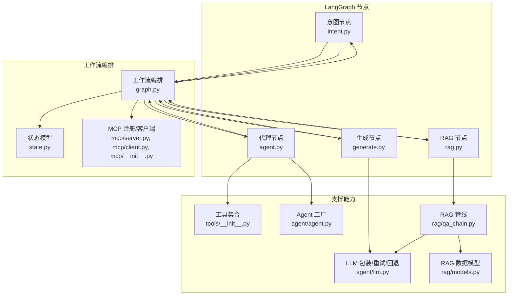
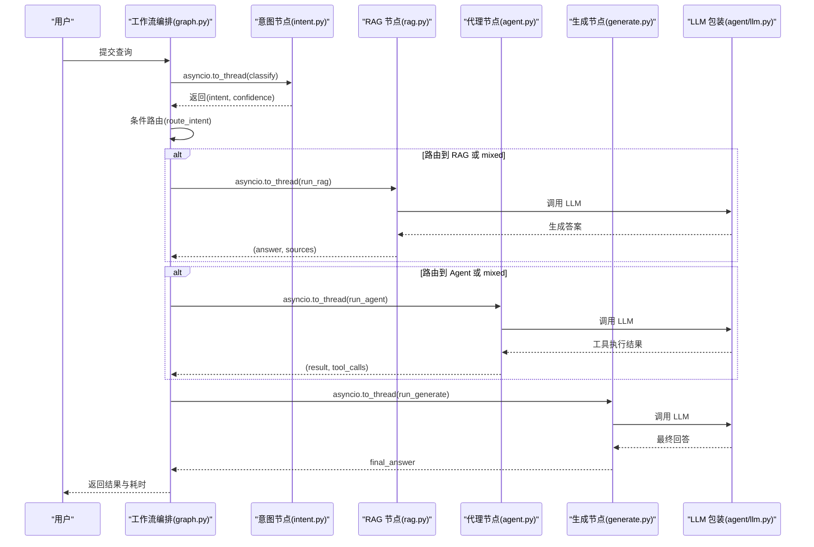
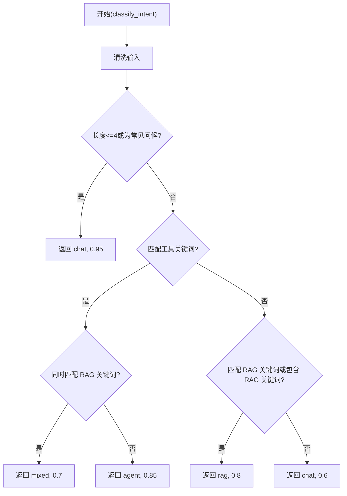
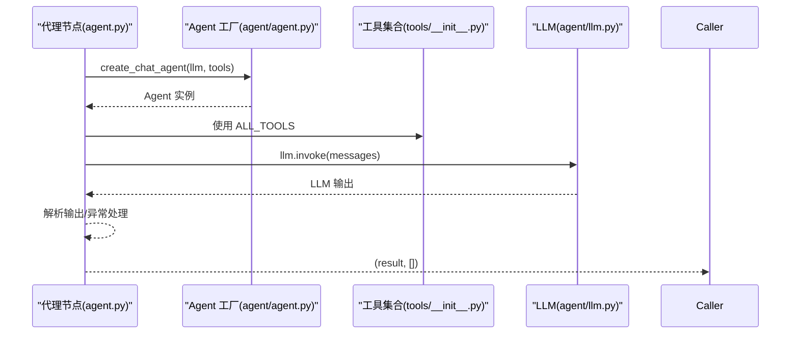
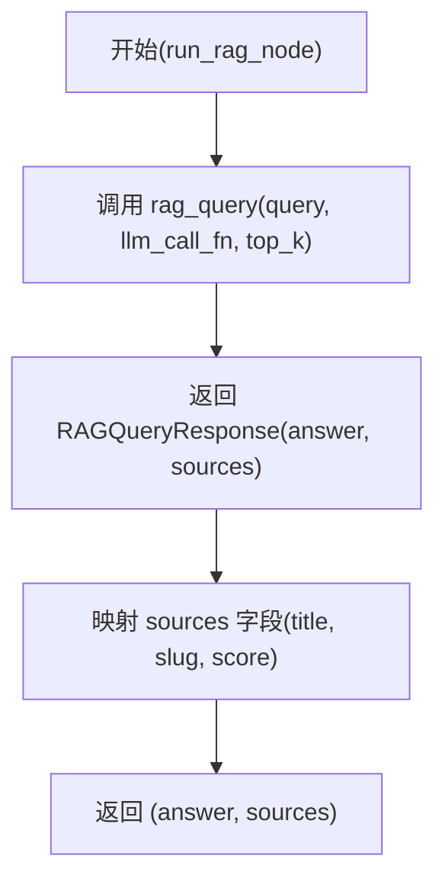
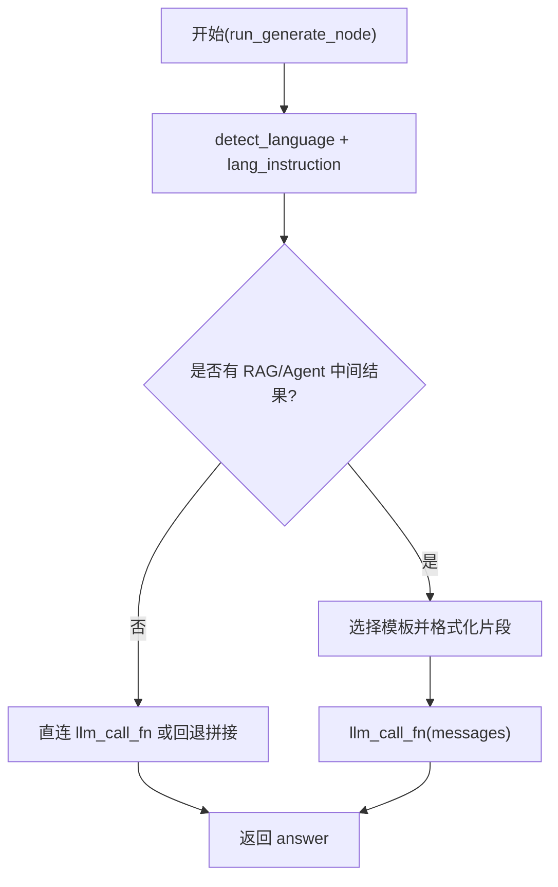
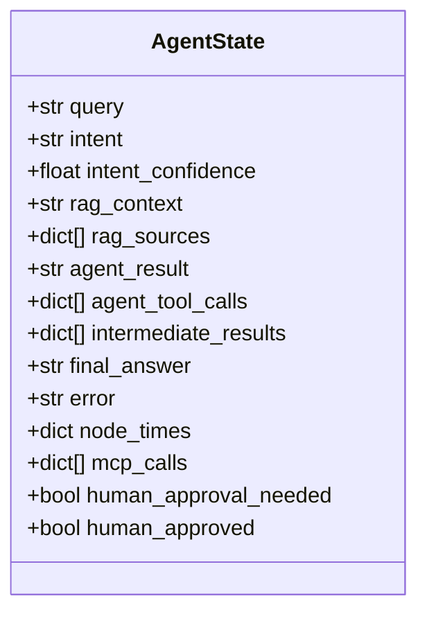
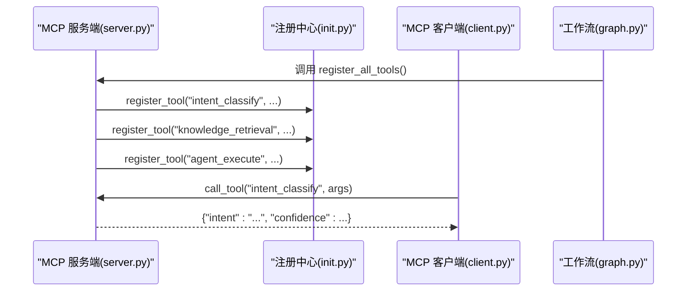
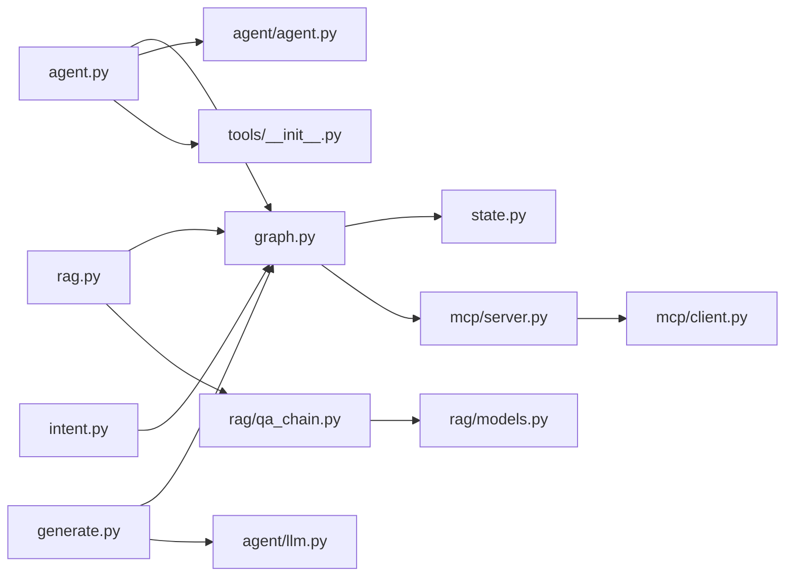

# 工作流节点

<cite>
**本文引用的文件**
- [backend/app/langgraph/nodes/intent.py](file://backend/app/langgraph/nodes/intent.py)
- [backend/app/langgraph/nodes/agent.py](file://backend/app/langgraph/nodes/agent.py)
- [backend/app/langgraph/nodes/generate.py](file://backend/app/langgraph/nodes/generate.py)
- [backend/app/langgraph/nodes/rag.py](file://backend/app/langgraph/nodes/rag.py)
- [backend/app/langgraph/graph.py](file://backend/app/langgraph/graph.py)
- [backend/app/langgraph/state.py](file://backend/app/langgraph/state.py)
- [backend/app/langgraph/mcp/server.py](file://backend/app/langgraph/mcp/server.py)
- [backend/app/langgraph/mcp/client.py](file://backend/app/langgraph/mcp/client.py)
- [backend/app/langgraph/mcp/__init__.py](file://backend/app/langgraph/mcp/__init__.py)
- [backend/app/agent/agent.py](file://backend/app/agent/agent.py)
- [backend/app/agent/llm.py](file://backend/app/agent/llm.py)
- [backend/app/agent/executor.py](file://backend/app/agent/executor.py)
- [backend/app/tools/__init__.py](file://backend/app/tools/__init__.py)
- [backend/app/rag/models.py](file://backend/app/rag/models.py)
- [backend/app/rag/qa_chain.py](file://backend/app/rag/qa_chain.py)
</cite>

## 目录
1. [简介](#简介)
2. [项目结构](#项目结构)
3. [核心组件](#核心组件)
4. [架构总览](#架构总览)
5. [详细组件分析](#详细组件分析)
6. [依赖分析](#依赖分析)
7. [性能考虑](#性能考虑)
8. [故障排查指南](#故障排查指南)
9. [结论](#结论)
10. [附录](#附录)

## 简介
本文件面向 LangGraph 工作流节点系统，系统性梳理意图分类节点、代理节点、生成节点与 RAG 节点的设计模式、实现机制与协作关系。文档覆盖各节点的输入输出格式、处理逻辑、错误处理策略、时间统计与性能监控、异步执行与线程池使用策略，并提供节点扩展开发指南与调试优化建议。

## 项目结构
LangGraph 节点位于后端 Python 代码的 app/langgraph 子目录中，配合工具注册、LLM 包装、RAG 管线与 MCP 协议实现，形成“意图识别 → 分支路由 → 并行执行 → 生成汇总”的工作流闭环。

图表来源
- [backend/app/langgraph/graph.py:1-163](file://backend/app/langgraph/graph.py#L1-L163)
- [backend/app/langgraph/state.py:1-47](file://backend/app/langgraph/state.py#L1-L47)
- [backend/app/langgraph/nodes/intent.py:1-76](file://backend/app/langgraph/nodes/intent.py#L1-L76)
- [backend/app/langgraph/nodes/agent.py:1-32](file://backend/app/langgraph/nodes/agent.py#L1-L32)
- [backend/app/langgraph/nodes/generate.py:1-89](file://backend/app/langgraph/nodes/generate.py#L1-L89)
- [backend/app/langgraph/nodes/rag.py:1-27](file://backend/app/langgraph/nodes/rag.py#L1-L27)
- [backend/app/langgraph/mcp/server.py:1-43](file://backend/app/langgraph/mcp/server.py#L1-L43)
- [backend/app/langgraph/mcp/client.py:1-43](file://backend/app/langgraph/mcp/client.py#L1-L43)
- [backend/app/langgraph/mcp/__init__.py:1-67](file://backend/app/langgraph/mcp/__init__.py#L1-L67)
- [backend/app/agent/agent.py:1-71](file://backend/app/agent/agent.py#L1-L71)
- [backend/app/agent/llm.py:1-96](file://backend/app/agent/llm.py#L1-L96)
- [backend/app/tools/__init__.py:1-23](file://backend/app/tools/__init__.py#L1-L23)
- [backend/app/rag/qa_chain.py:1-1072](file://backend/app/rag/qa_chain.py#L1-L1072)
- [backend/app/rag/models.py:1-56](file://backend/app/rag/models.py#L1-L56)

章节来源
- [backend/app/langgraph/graph.py:1-163](file://backend/app/langgraph/graph.py#L1-L163)
- [backend/app/langgraph/state.py:1-47](file://backend/app/langgraph/state.py#L1-L47)

## 核心组件
- 意图分类节点：基于关键词规则进行轻量化意图识别，避免 LLM 调用，提升首包速度。
- 代理节点：封装 LangChain Agent，按工具规则执行工具调用，返回结果。
- RAG 节点：封装 RAG 管线，检索与生成一体化，返回答案与来源。
- 生成节点：汇总意图、RAG 结果与 Agent 结果，生成最终回答；对聊天意图可直连 LLM。
- 工作流编排：定义状态、条件路由与并行执行，采集节点耗时与 MCP 调用记录。
- MCP 协议：将节点封装为工具，支持本地/远程调用，便于扩展与集成。
- LLM 包装：统一模型工厂、重试与回退策略，保障稳定性。
- 工具集合：动态注册工具，含计算器、文件读取、网络搜索与知识库检索。

章节来源
- [backend/app/langgraph/nodes/intent.py:1-76](file://backend/app/langgraph/nodes/intent.py#L1-L76)
- [backend/app/langgraph/nodes/agent.py:1-32](file://backend/app/langgraph/nodes/agent.py#L1-L32)
- [backend/app/langgraph/nodes/rag.py:1-27](file://backend/app/langgraph/nodes/rag.py#L1-L27)
- [backend/app/langgraph/nodes/generate.py:1-89](file://backend/app/langgraph/nodes/generate.py#L1-L89)
- [backend/app/langgraph/graph.py:1-163](file://backend/app/langgraph/graph.py#L1-L163)
- [backend/app/langgraph/mcp/server.py:1-43](file://backend/app/langgraph/mcp/server.py#L1-L43)
- [backend/app/agent/llm.py:1-96](file://backend/app/agent/llm.py#L1-L96)
- [backend/app/tools/__init__.py:1-23](file://backend/app/tools/__init__.py#L1-L23)

## 架构总览
LangGraph 工作流采用“同步编排 + 异步执行 + 线程池调度”的模式：
- 编排层：graph.py 定义状态、路由与执行流程，记录节点耗时与中间结果。
- 执行层：节点函数通过 asyncio.to_thread 在线程池中执行，避免阻塞事件循环。
- 路由层：根据意图分类结果选择 RAG、Agent 或两者并行，再进入生成阶段。
- MCP 层：将节点包装为工具，注册到 MCP 服务，支持本地/远程调用。

图表来源
- [backend/app/langgraph/graph.py:43-146](file://backend/app/langgraph/graph.py#L43-L146)
- [backend/app/langgraph/nodes/intent.py:47-76](file://backend/app/langgraph/nodes/intent.py#L47-L76)
- [backend/app/langgraph/nodes/rag.py:11-27](file://backend/app/langgraph/nodes/rag.py#L11-L27)
- [backend/app/langgraph/nodes/agent.py:13-32](file://backend/app/langgraph/nodes/agent.py#L13-L32)
- [backend/app/langgraph/nodes/generate.py:34-89](file://backend/app/langgraph/nodes/generate.py#L34-L89)
- [backend/app/agent/llm.py:77-96](file://backend/app/agent/llm.py#L77-L96)

## 详细组件分析

### 意图分类节点
- 设计模式：规则引擎 + 轻量化关键词匹配，避免 LLM 调用。
- 输入：query（字符串）
- 输出：(intent, confidence) 元组，intent ∈ {"rag","agent","chat","mixed"}，confidence 为置信度浮点数。
- 处理逻辑：
  - 短问候 → chat（高置信）
  - 匹配工具请求关键词 → agent（若同时含 RAG 关键词则 mixed）
  - 匹配知识问答关键词 → rag（若同时含工具关键词则 mixed）
  - 默认 → chat（低置信）
- 错误处理：无显式异常，返回默认分支。
- 性能：O(N) 关键词匹配，常数级开销。

图表来源
- [backend/app/langgraph/nodes/intent.py:31-76](file://backend/app/langgraph/nodes/intent.py#L31-L76)

章节来源
- [backend/app/langgraph/nodes/intent.py:1-76](file://backend/app/langgraph/nodes/intent.py#L1-L76)

### 代理节点
- 设计模式：LangChain Agent 工厂 + 工具集合，按系统提示与工具规则执行。
- 输入：query（字符串）、context（可选字符串，用于混合意图时携带 RAG 上下文）
- 输出：(agent_result, tool_calls) 元组，tool_calls 为空列表（当前实现）
- 处理逻辑：
  - 创建 LLM 与 Agent
  - 组合上下文 + 查询消息
  - 调用 Agent.invoke，提取输出字符串
- 错误处理：捕获异常并返回错误信息字符串。
- 性能：取决于 LLM 推理与工具执行时间。

图表来源
- [backend/app/langgraph/nodes/agent.py:13-32](file://backend/app/langgraph/nodes/agent.py#L13-L32)
- [backend/app/agent/agent.py:51-71](file://backend/app/agent/agent.py#L51-L71)
- [backend/app/tools/__init__.py:1-23](file://backend/app/tools/__init__.py#L1-L23)
- [backend/app/agent/llm.py:20-44](file://backend/app/agent/llm.py#L20-L44)

章节来源
- [backend/app/langgraph/nodes/agent.py:1-32](file://backend/app/langgraph/nodes/agent.py#L1-L32)
- [backend/app/agent/agent.py:1-71](file://backend/app/agent/agent.py#L1-L71)
- [backend/app/tools/__init__.py:1-23](file://backend/app/tools/__init__.py#L1-L23)

### RAG 节点
- 设计模式：封装 RAG 管线，返回答案与来源列表。
- 输入：query（字符串）、llm_call_fn（函数）、top_k（整数，默认 3）
- 输出：(answer, sources) 元组，sources 为包含 title/slug/score 的字典列表
- 处理逻辑：
  - 调用 rag_query，内部执行检索、负样本检测、上下文格式化与生成
  - 将底层 SourceItem 转换为字典列表
- 错误处理：底层异常向上抛出或由上层工作流捕获。
- 性能：受检索与 LLM 生成影响，支持缓存与流式输出。

图表来源
- [backend/app/langgraph/nodes/rag.py:11-27](file://backend/app/langgraph/nodes/rag.py#L11-L27)
- [backend/app/rag/qa_chain.py:582-651](file://backend/app/rag/qa_chain.py#L582-L651)
- [backend/app/rag/models.py:38-41](file://backend/app/rag/models.py#L38-L41)

章节来源
- [backend/app/langgraph/nodes/rag.py:1-27](file://backend/app/langgraph/nodes/rag.py#L1-L27)
- [backend/app/rag/qa_chain.py:1-1072](file://backend/app/rag/qa_chain.py#L1-L1072)
- [backend/app/rag/models.py:1-56](file://backend/app/rag/models.py#L1-L56)

### 生成节点
- 设计模式：多源信息汇总与最终回答生成，支持直连 LLM 与模板拼接。
- 输入：query、intent、rag_context、rag_sources、agent_result、llm_call_fn
- 输出：最终回答字符串
- 处理逻辑：
  - 语言检测与指令注入
  - 组装 RAG 与 Agent 片段
  - 若无中间结果 → 直连 LLM 或回退拼接
  - 否则使用模板与系统提示生成最终回答
- 错误处理：无显式异常，依赖上游传入 llm_call_fn 的行为。

图表来源
- [backend/app/langgraph/nodes/generate.py:34-89](file://backend/app/langgraph/nodes/generate.py#L34-L89)

章节来源
- [backend/app/langgraph/nodes/generate.py:1-89](file://backend/app/langgraph/nodes/generate.py#L1-L89)

### 工作流编排与状态
- 状态模型：包含 query、intent、intent_confidence、RAG/Agent 中间结果、最终答案、错误、节点耗时、MCP 调用记录、人工审批标记等字段。
- 路由逻辑：根据 intent 选择节点，支持 mixed 并行执行。
- 时间统计：每个节点执行前后记录耗时（毫秒），并汇总到 total。
- MCP 记录：记录工具调用来源、目标、工具名与耗时。

图表来源
- [backend/app/langgraph/state.py:6-27](file://backend/app/langgraph/state.py#L6-L27)

章节来源
- [backend/app/langgraph/graph.py:32-146](file://backend/app/langgraph/graph.py#L32-L146)
- [backend/app/langgraph/state.py:1-47](file://backend/app/langgraph/state.py#L1-L47)

### MCP 协议与工具注册
- 工具注册：在模块加载时注册 intent_classify、knowledge_retrieval、agent_execute 三个工具。
- 本地/远程调用：MCP 客户端支持本地内存调用与 HTTP 远程调用。
- 适配工作流：graph.py 在启动时注册工具，供后续节点调用。

图表来源
- [backend/app/langgraph/mcp/server.py:6-43](file://backend/app/langgraph/mcp/server.py#L6-L43)
- [backend/app/langgraph/mcp/__init__.py:6-41](file://backend/app/langgraph/mcp/__init__.py#L6-L41)
- [backend/app/langgraph/mcp/client.py:19-42](file://backend/app/langgraph/mcp/client.py#L19-L42)
- [backend/app/langgraph/graph.py:16-17](file://backend/app/langgraph/graph.py#L16-L17)

章节来源
- [backend/app/langgraph/mcp/server.py:1-43](file://backend/app/langgraph/mcp/server.py#L1-L43)
- [backend/app/langgraph/mcp/client.py:1-43](file://backend/app/langgraph/mcp/client.py#L1-L43)
- [backend/app/langgraph/mcp/__init__.py:1-67](file://backend/app/langgraph/mcp/__init__.py#L1-L67)

## 依赖分析
- 节点到支撑模块：
  - 意图节点 → graph.py（仅在工作流中被调用）
  - 代理节点 → agent/agent.py、tools/__init__.py、agent/llm.py
  - RAG 节点 → rag/qa_chain.py、rag/models.py
  - 生成节点 → utils/lang_detect（通过 generate.py 内部导入）
- 工作流到节点：graph.py 直接导入并调用各节点函数
- MCP 到节点：server.py 将节点包装为工具，供客户端调用
- LLM 包装：统一模型工厂、重试与回退，供节点与 RAG 管线共享

图表来源
- [backend/app/langgraph/graph.py:1-163](file://backend/app/langgraph/graph.py#L1-L163)
- [backend/app/langgraph/nodes/intent.py:1-76](file://backend/app/langgraph/nodes/intent.py#L1-L76)
- [backend/app/langgraph/nodes/agent.py:1-32](file://backend/app/langgraph/nodes/agent.py#L1-L32)
- [backend/app/langgraph/nodes/rag.py:1-27](file://backend/app/langgraph/nodes/rag.py#L1-L27)
- [backend/app/langgraph/nodes/generate.py:1-89](file://backend/app/langgraph/nodes/generate.py#L1-L89)
- [backend/app/agent/agent.py:1-71](file://backend/app/agent/agent.py#L1-L71)
- [backend/app/tools/__init__.py:1-23](file://backend/app/tools/__init__.py#L1-L23)
- [backend/app/rag/qa_chain.py:1-1072](file://backend/app/rag/qa_chain.py#L1-L1072)
- [backend/app/rag/models.py:1-56](file://backend/app/rag/models.py#L1-L56)
- [backend/app/agent/llm.py:1-96](file://backend/app/agent/llm.py#L1-L96)
- [backend/app/langgraph/mcp/server.py:1-43](file://backend/app/langgraph/mcp/server.py#L1-L43)
- [backend/app/langgraph/mcp/client.py:1-43](file://backend/app/langgraph/mcp/client.py#L1-L43)

章节来源
- [backend/app/langgraph/graph.py:1-163](file://backend/app/langgraph/graph.py#L1-L163)

## 性能考虑
- 异步执行与线程池：
  - 工作流通过 asyncio.to_thread 将节点函数提交至线程池，避免阻塞事件循环。
  - 适合 IO 密集（LLM 调用、RAG 检索、工具执行）场景。
- 时间统计：
  - 每个节点执行前后记录耗时（毫秒），并汇总 total。
  - 支持中间结果与 MCP 调用记录，便于定位瓶颈。
- LLM 包装：
  - 提供重试与回退策略，降低瞬时错误对整体性能的影响。
- RAG 管线：
  - 支持缓存与流式输出，可显著改善首 token 延迟与用户体验。
- 并行策略：
  - mixed 意图下 RAG 与 Agent 并行执行，缩短总时延。

章节来源
- [backend/app/langgraph/graph.py:43-146](file://backend/app/langgraph/graph.py#L43-L146)
- [backend/app/agent/llm.py:60-96](file://backend/app/agent/llm.py#L60-L96)
- [backend/app/rag/qa_chain.py:756-800](file://backend/app/rag/qa_chain.py#L756-L800)

## 故障排查指南
- 意图分类异常：
  - 现象：返回默认 chat 或置信度偏低
  - 排查：确认输入是否为短问候或包含未覆盖关键词
- 代理执行失败：
  - 现象：返回错误字符串
  - 排查：检查工具注册、LLM 可用性与 Agent 系统提示
- RAG 无结果或质量差：
  - 现象：返回空 sources 或兜底提示
  - 排查：确认索引是否存在、检索阈值、跨文章查询扩展与重排序设置
- 生成阶段异常：
  - 现象：最终回答缺失或格式异常
  - 排查：检查 llm_call_fn 传入与中间结果是否为空
- MCP 调用失败：
  - 现象：工具返回 error
  - 排查：确认工具是否注册、远程 URL 可达、日志错误信息

章节来源
- [backend/app/langgraph/nodes/agent.py:26-32](file://backend/app/langgraph/nodes/agent.py#L26-L32)
- [backend/app/rag/qa_chain.py:611-631](file://backend/app/rag/qa_chain.py#L611-L631)
- [backend/app/langgraph/mcp/client.py:30-42](file://backend/app/langgraph/mcp/client.py#L30-L42)

## 结论
LangGraph 工作流节点系统通过规则化意图识别、标准化代理与 RAG 管线以及可插拔的 MCP 协议，实现了高扩展性的多路径回答流程。结合线程池异步执行与完善的性能监控，系统在保证稳定性的同时兼顾响应速度。开发者可通过扩展工具与自定义节点进一步增强能力。

## 附录

### 节点扩展开发指南
- 新增节点步骤：
  - 在 nodes 目录新增节点文件，导出 run_xxx_node 函数，接收必要参数并返回标准化输出
  - 在 graph.py 中导入并接入工作流路由逻辑
  - 如需 MCP 工具，可在 mcp/server.py 中注册新工具
- 修改现有节点行为：
  - 意图分类：调整关键词列表与优先级
  - 代理节点：扩展工具集合或调整系统提示
  - RAG 节点：调整 top_k、检索策略或评估开关
  - 生成节点：调整模板与语言指令注入逻辑

章节来源
- [backend/app/langgraph/nodes/intent.py:1-76](file://backend/app/langgraph/nodes/intent.py#L1-L76)
- [backend/app/langgraph/nodes/agent.py:1-32](file://backend/app/langgraph/nodes/agent.py#L1-L32)
- [backend/app/langgraph/nodes/rag.py:1-27](file://backend/app/langgraph/nodes/rag.py#L1-L27)
- [backend/app/langgraph/nodes/generate.py:1-89](file://backend/app/langgraph/nodes/generate.py#L1-L89)
- [backend/app/langgraph/graph.py:1-163](file://backend/app/langgraph/graph.py#L1-L163)
- [backend/app/langgraph/mcp/server.py:1-43](file://backend/app/langgraph/mcp/server.py#L1-L43)

### 调试技巧与性能优化建议
- 调试技巧：
  - 启用日志：关注工作流中的节点耗时与 MCP 调用记录
  - 分段测试：分别测试意图、RAG、代理与生成节点
  - 使用流式输出：RAG 流式接口可提前看到来源与逐步文本
- 性能优化建议：
  - 合理设置 top_k 与阈值，减少无效检索
  - 启用缓存与回退 LLM，提高稳定性
  - 对混合意图启用并行执行，缩短总时延
  - 控制生成提示长度与上下文大小，降低 token 成本

章节来源
- [backend/app/langgraph/graph.py:149-163](file://backend/app/langgraph/graph.py#L149-L163)
- [backend/app/rag/qa_chain.py:653-754](file://backend/app/rag/qa_chain.py#L653-L754)
- [backend/app/agent/llm.py:77-96](file://backend/app/agent/llm.py#L77-L96)