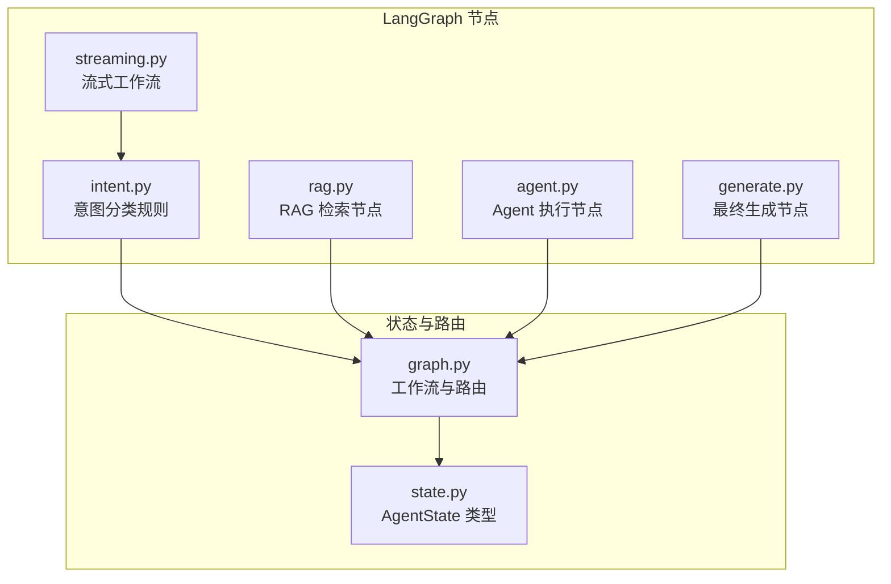
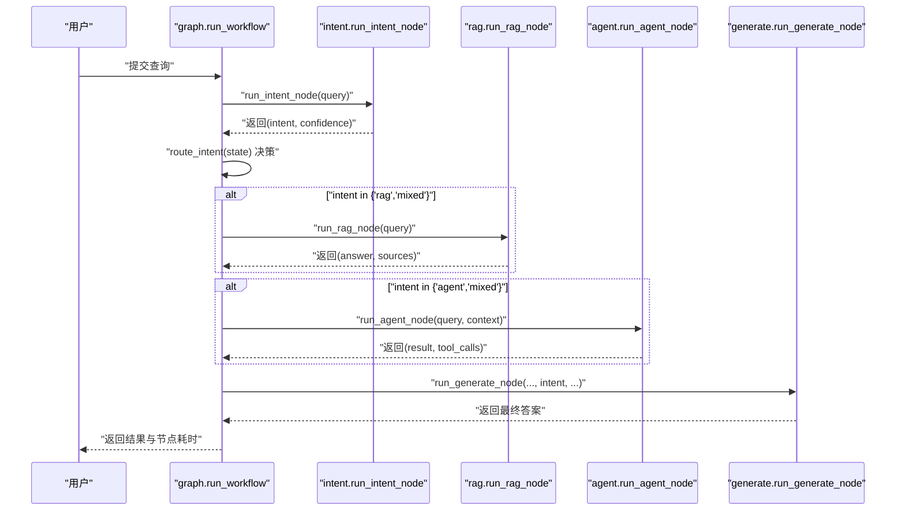
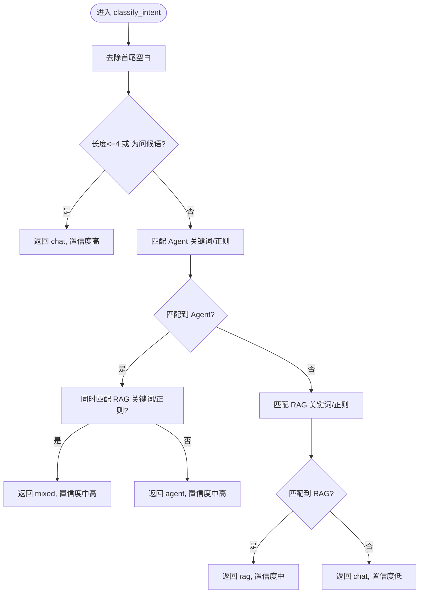
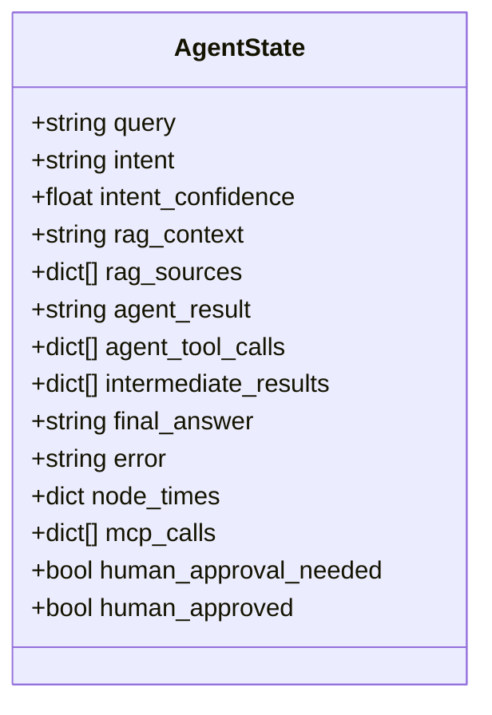
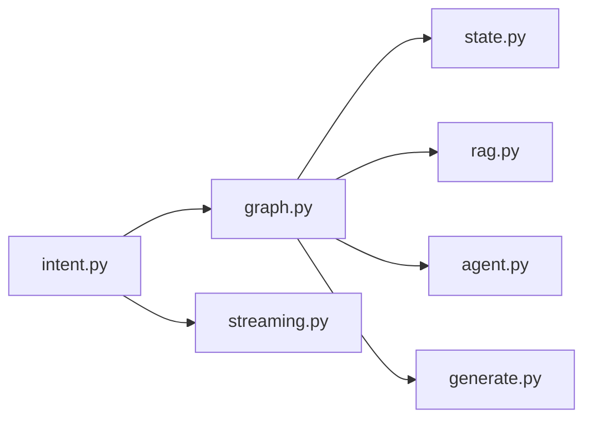

# 意图分类节点

<cite>
**本文引用的文件**
- [intent.py](file://backend/app/langgraph/nodes/intent.py)
- [graph.py](file://backend/app/langgraph/graph.py)
- [state.py](file://backend/app/langgraph/state.py)
- [rag.py](file://backend/app/langgraph/nodes/rag.py)
- [agent.py](file://backend/app/langgraph/nodes/agent.py)
- [generate.py](file://backend/app/langgraph/nodes/generate.py)
- [streaming.py](file://backend/app/langgraph/streaming.py)
- [test_langgraph.py](file://backend/tests/test_langgraph.py)
- [rag_stats.py](file://backend/app/api/rag_stats.py)
</cite>

## 目录
1. [简介](#简介)
2. [项目结构](#项目结构)
3. [核心组件](#核心组件)
4. [架构总览](#架构总览)
5. [详细组件分析](#详细组件分析)
6. [依赖关系分析](#依赖关系分析)
7. [性能考虑](#性能考虑)
8. [故障排查指南](#故障排查指南)
9. [结论](#结论)
10. [附录](#附录)

## 简介
本文件面向 LangGraph 意图分类节点，系统性阐述其在对话工作流中的职责、实现机制与集成方式。该节点采用轻量规则匹配替代 LLM 调用，对用户查询进行快速意图识别与分类，并输出分类结果与置信度。文档覆盖输入预处理、关键词与正则模式匹配、分类逻辑与置信度策略、与 LLM 的集成方式、性能评估与优化、边界情况处理、状态管理与错误恢复，以及训练与微调建议。

## 项目结构
LangGraph 意图分类节点位于后端应用的 LangGraph 子模块中，与状态模型、路由逻辑、RAG 与 Agent 节点协同工作，形成端到端的多路分支工作流。

图表来源
- [intent.py:1-76](file://backend/app/langgraph/nodes/intent.py#L1-L76)
- [graph.py:1-163](file://backend/app/langgraph/graph.py#L1-L163)
- [state.py:1-47](file://backend/app/langgraph/state.py#L1-L47)
- [rag.py:1-27](file://backend/app/langgraph/nodes/rag.py#L1-L27)
- [agent.py:1-32](file://backend/app/langgraph/nodes/agent.py#L1-L32)
- [generate.py:1-89](file://backend/app/langgraph/nodes/generate.py#L1-L89)
- [streaming.py:1-127](file://backend/app/langgraph/streaming.py#L1-L127)

章节来源
- [graph.py:1-163](file://backend/app/langgraph/graph.py#L1-L163)
- [state.py:1-47](file://backend/app/langgraph/state.py#L1-L47)

## 核心组件
- 意图分类节点（规则匹配）
  - 输入：用户查询字符串
  - 输出：意图类别与置信度
  - 特点：基于关键词与正则表达式，避免 LLM 调用，延迟低、成本小
- LangGraph 工作流
  - 将意图分类结果作为条件边，路由至 RAG、Agent 或直接生成
  - 支持混合意图并行执行 RAG 与 Agent
- 状态模型
  - 统一承载查询、意图、置信度、各节点中间结果与耗时等
- 生成节点
  - 在混合或 Agent/RAG 场景下汇总上下文生成最终回答；在聊天场景下直接调用 LLM

章节来源
- [intent.py:47-76](file://backend/app/langgraph/nodes/intent.py#L47-L76)
- [graph.py:32-147](file://backend/app/langgraph/graph.py#L32-L147)
- [state.py:6-47](file://backend/app/langgraph/state.py#L6-L47)
- [generate.py:34-89](file://backend/app/langgraph/nodes/generate.py#L34-L89)

## 架构总览
LangGraph 工作流从意图分类开始，依据分类结果决定后续执行路径：仅 RAG、仅 Agent、聊天直连 LLM，或混合并行执行。状态对象贯穿全流程，记录中间结果与耗时，便于可观测性与性能分析。

图表来源
- [graph.py:43-147](file://backend/app/langgraph/graph.py#L43-L147)
- [intent.py:73-76](file://backend/app/langgraph/nodes/intent.py#L73-L76)
- [rag.py:11-27](file://backend/app/langgraph/nodes/rag.py#L11-L27)
- [agent.py:13-32](file://backend/app/langgraph/nodes/agent.py#L13-L32)
- [generate.py:34-89](file://backend/app/langgraph/nodes/generate.py#L34-L89)

## 详细组件分析

### 意图分类节点（规则匹配）
- 输入预处理
  - 去除首尾空白，统一转小写用于短语与问候语判定
- 分类规则
  - 短查询/问候语 → chat（高置信）
  - 匹配 Agent 关键词 → agent；若同时满足 RAG 规则，则标记为 mixed（中高置信）
  - 匹配 RAG 关键词 → rag（中置信）
  - 默认 → chat（较低置信）
- 置信度策略
  - 不同规则分支赋予不同置信度阈值，用于日志记录与后续决策
- 与 LLM 集成
  - 提供兼容参数 llm_call_fn，但当前实现不使用，保持 API 兼容以便后续替换为 LLM 方案

图表来源
- [intent.py:47-76](file://backend/app/langgraph/nodes/intent.py#L47-L76)

章节来源
- [intent.py:10-76](file://backend/app/langgraph/nodes/intent.py#L10-L76)

### LangGraph 工作流与路由
- 创建 LLM 调用函数，封装底层模型调用
- 执行顺序
  - 意图分类：记录耗时与中间结果
  - 路由：根据 intent 字段选择下一步
  - 并行执行：mixed 情况下同时执行 RAG 与 Agent
  - 生成：根据 intent 汇总上下文生成最终回答
- 状态管理
  - 统一使用 AgentState，包含查询、意图、置信度、中间结果、耗时、MCP 调用记录等
- 错误处理
  - 捕获异常，记录错误信息，返回兜底提示

图表来源
- [state.py:6-47](file://backend/app/langgraph/state.py#L6-L47)

章节来源
- [graph.py:20-147](file://backend/app/langgraph/graph.py#L20-L147)
- [state.py:29-47](file://backend/app/langgraph/state.py#L29-L47)

### 与 LLM 的集成与参数配置
- 当前意图分类不调用 LLM，兼容参数 llm_call_fn 保留以便后续扩展
- 生成节点在聊天或混合场景下可直接调用 LLM，支持语言检测与多语言提示模板
- 流式工作流在 RAG 与聊天场景分别构造消息并流式输出

章节来源
- [intent.py:73-76](file://backend/app/langgraph/nodes/intent.py#L73-L76)
- [generate.py:34-89](file://backend/app/langgraph/nodes/generate.py#L34-L89)
- [streaming.py:15-127](file://backend/app/langgraph/streaming.py#L15-L127)

### 分类置信度与评估方法
- 置信度阈值
  - short/问候语：高
  - agent：中高
  - mixed：中高
  - rag：中
  - 默认：低
- 评估建议
  - 准确率：收集一段时间内真实意图标注，对比分类结果
  - 召回率：关注被错误归类为 chat 的 RAG/Agent 请求
  - 性能：记录 node_times 中 intent 节点耗时，结合下游节点耗时评估整体延迟
  - A/B 实验：在兼容层保留 llm_call_fn 参数，逐步切换到 LLM 分类器并对比指标

章节来源
- [intent.py:47-76](file://backend/app/langgraph/nodes/intent.py#L47-L76)
- [graph.py:149-163](file://backend/app/langgraph/graph.py#L149-L163)

### 常见查询类型与边界情况
- 常见类型
  - RAG：知识问答、原理说明、对比分析等（关键词/正则命中）
  - Agent：计算、搜索、工具请求等（关键词/正则命中）
  - Mixed：同时包含两类特征（如“计算什么是 RAG”）
  - Chat：短句、问候、闲聊等（默认）
- 边界情况
  - 无意义/噪声输入：默认 chat
  - 中英文混杂：依赖语言检测与模板选择
  - 人工审批：当 human_approval_needed 为真且 human_approved 为假时终止流程

章节来源
- [intent.py:47-76](file://backend/app/langgraph/nodes/intent.py#L47-L76)
- [graph.py:32-41](file://backend/app/langgraph/graph.py#L32-L41)
- [state.py:25-27](file://backend/app/langgraph/state.py#L25-L27)

### 训练与微调指南（扩展建议）
- 当前规则为硬编码关键词与正则，若需迁移到 LLM 分类器：
  - 准备标注数据集：包含 RAG、Agent、Mixed、Chat 四类样本
  - 设计提示模板：将查询与候选意图描述化，引导模型输出意图与置信度
  - 训练/微调：使用指令微调或偏好优化（RLHF）提升准确性
  - 部署与回滚：通过 llm_call_fn 参数平滑过渡，保留规则分支作为降级策略
- 评估与监控
  - 指标：准确率、召回率、F1、平均延迟、错误分布
  - 日志：记录 intent 与 confidence，便于定位误判样本

章节来源
- [intent.py:73-76](file://backend/app/langgraph/nodes/intent.py#L73-L76)

## 依赖关系分析
- 意图分类节点被工作流与流式工作流共同依赖
- 工作流依赖状态模型与各节点实现
- 生成节点在不同意图下复用 LLM 能力
- 测试覆盖了典型意图分类场景与错误处理

图表来源
- [intent.py:1-76](file://backend/app/langgraph/nodes/intent.py#L1-L76)
- [graph.py:1-163](file://backend/app/langgraph/graph.py#L1-L163)
- [streaming.py:1-127](file://backend/app/langgraph/streaming.py#L1-L127)
- [state.py:1-47](file://backend/app/langgraph/state.py#L1-L47)
- [rag.py:1-27](file://backend/app/langgraph/nodes/rag.py#L1-L27)
- [agent.py:1-32](file://backend/app/langgraph/nodes/agent.py#L1-L32)
- [generate.py:1-89](file://backend/app/langgraph/nodes/generate.py#L1-L89)

章节来源
- [test_langgraph.py:133-165](file://backend/tests/test_langgraph.py#L133-L165)

## 性能考虑
- 延迟优化
  - 意图分类为 O(n+m)（n 为关键词数，m 为正则数量），常数时间复杂度，极低延迟
  - 使用线程池执行（asyncio.to_thread）避免阻塞事件循环
- 资源控制
  - RAG 与 Agent 并行执行时注意资源上限，可通过 top_k 与并发策略调节
- 可观测性
  - 记录 node_times 与 mcp_calls，便于定位瓶颈与成本分析

章节来源
- [graph.py:43-147](file://backend/app/langgraph/graph.py#L43-L147)

## 故障排查指南
- 常见问题
  - 意图误判：检查关键词/正则是否覆盖目标场景；必要时引入 LLM 分类器
  - 人工审批阻断：确认 human_approval_needed 与 human_approved 状态
  - LLM 调用失败：检查 llm_call_fn 配置与鉴权
- 日志与错误
  - 工作流捕获异常并记录堆栈，返回兜底提示
  - 流式工作流对认证失败与超时进行友好提示

章节来源
- [graph.py:139-146](file://backend/app/langgraph/graph.py#L139-L146)
- [streaming.py:49-58](file://backend/app/langgraph/streaming.py#L49-L58)

## 结论
LangGraph 意图分类节点以规则匹配为核心，提供低成本、低延迟的意图识别能力。通过清晰的状态模型与路由机制，配合 RAG、Agent 与生成节点，构建了灵活高效的多路分支工作流。建议在业务稳定期引入 LLM 分类器并持续评估与优化，以进一步提升准确性与鲁棒性。

## 附录
- 测试用例要点
  - 覆盖 RAG、Agent、Mixed、Chat 与短问候等典型场景
  - 验证默认分支与置信度行为

章节来源
- [test_langgraph.py:136-165](file://backend/tests/test_langgraph.py#L136-L165)