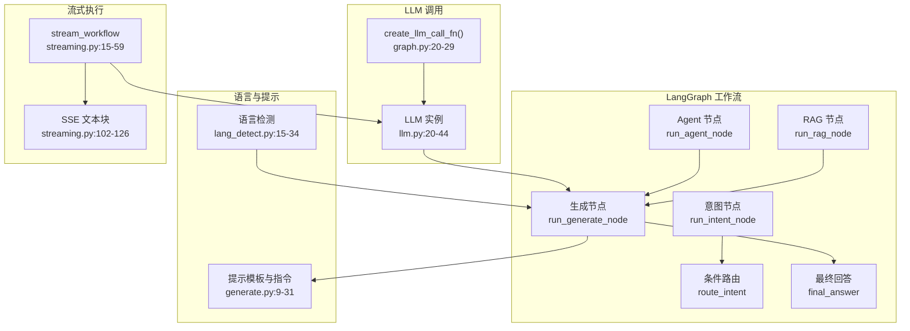
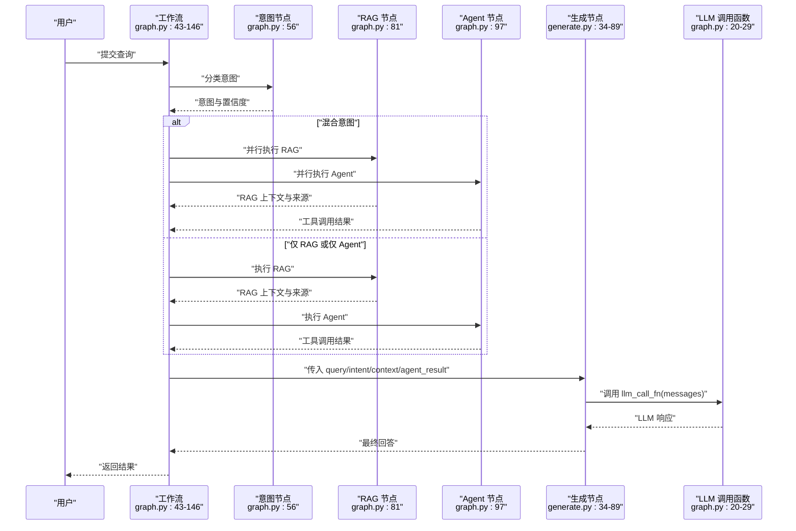
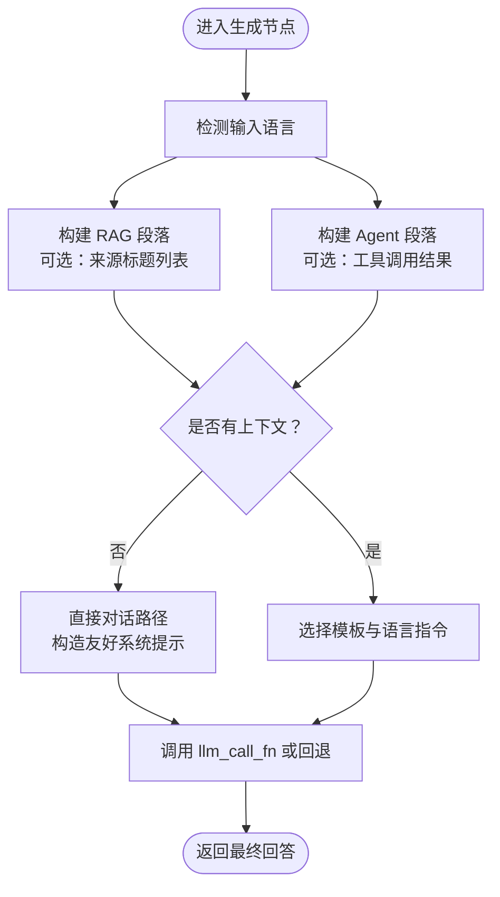
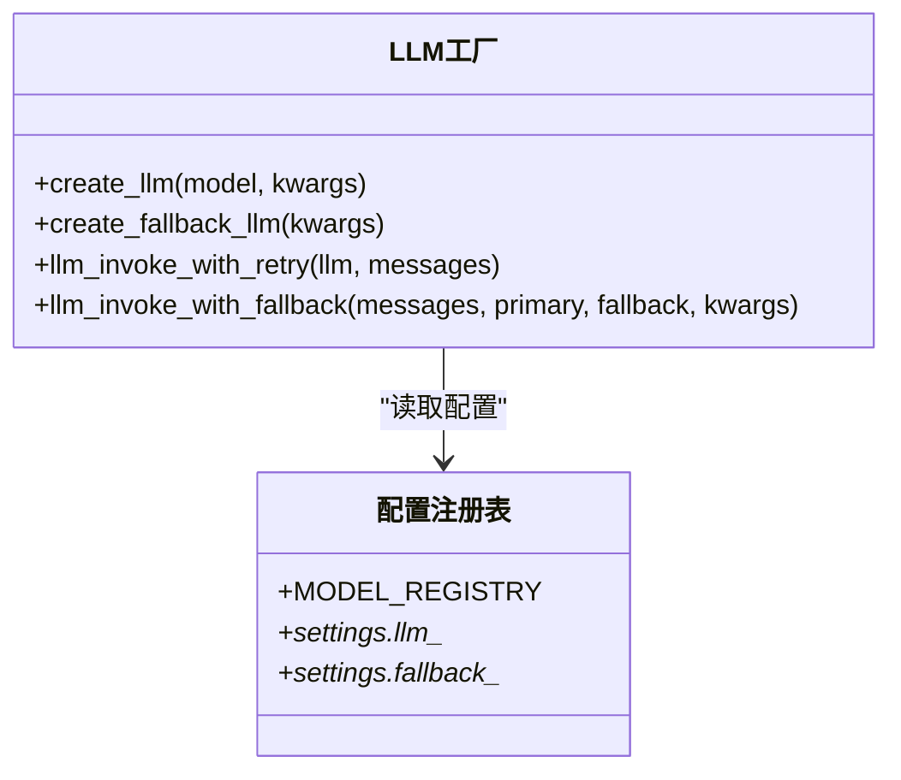
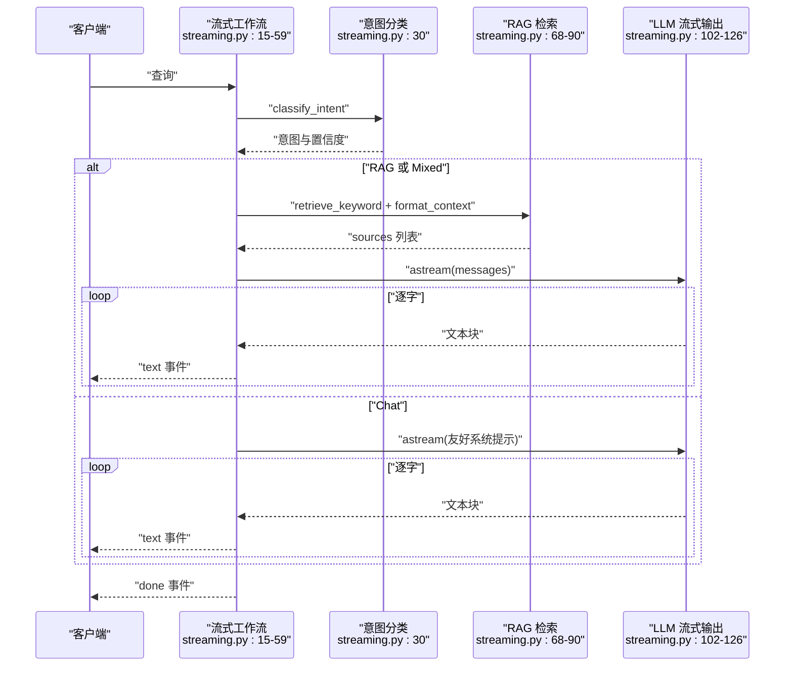
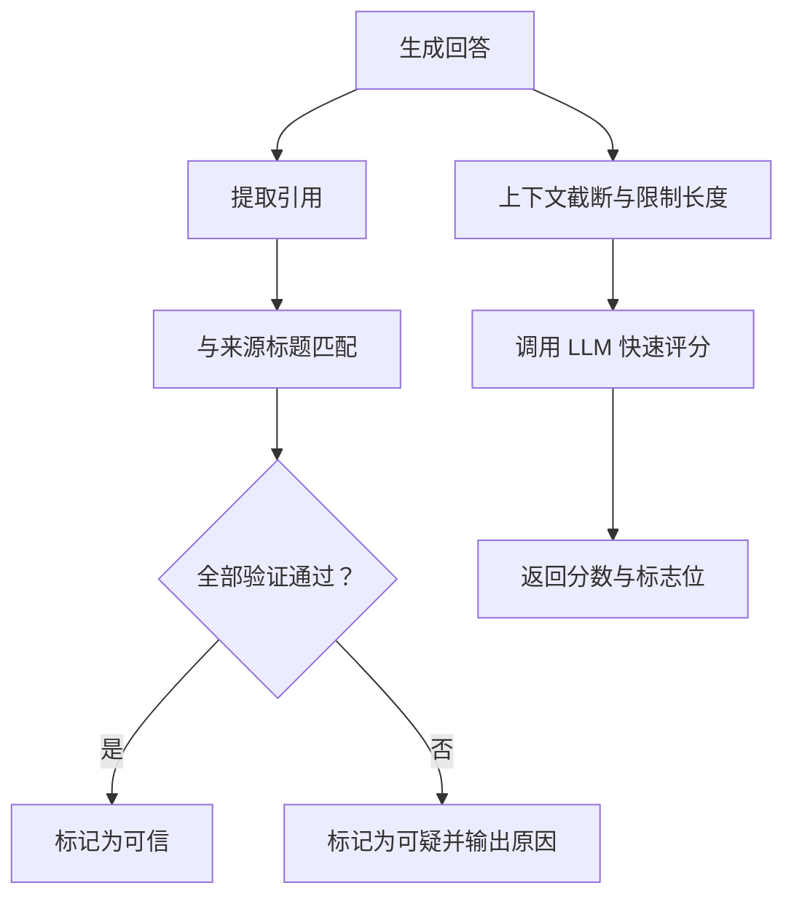
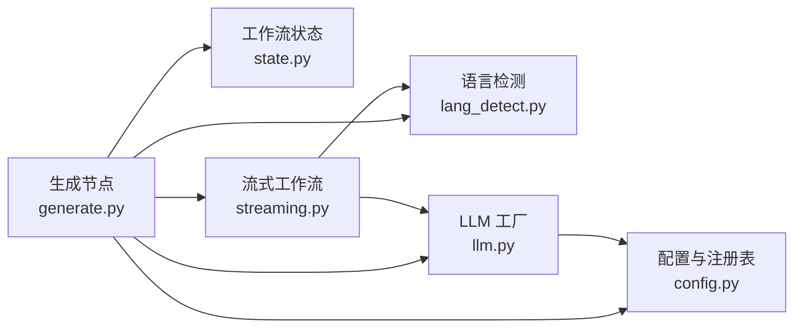

# 生成节点

<cite>
**本文档引用的文件**
- [generate.py](file://backend/app/langgraph/nodes/generate.py)
- [graph.py](file://backend/app/langgraph/graph.py)
- [state.py](file://backend/app/langgraph/state.py)
- [streaming.py](file://backend/app/langgraph/streaming.py)
- [llm.py](file://backend/app/agent/llm.py)
- [config.py](file://backend/app/config.py)
- [lang_detect.py](file://backend/app/utils/lang_detect.py)
- [guardrails.py](file://backend/app/rag/guardrails.py)
- [models.py](file://backend/app/rag/models.py)
- [test_langgraph.py](file://backend/tests/test_langgraph.py)
- [test_streaming_workflow.py](file://backend/tests/test_streaming_workflow.py)
- [TECH_DESIGN.md](file://TECH_DESIGN.md)
</cite>

## 目录
1. [简介](#简介)
2. [项目结构](#项目结构)
3. [核心组件](#核心组件)
4. [架构总览](#架构总览)
5. [详细组件分析](#详细组件分析)
6. [依赖关系分析](#依赖关系分析)
7. [性能考量](#性能考量)
8. [故障排查指南](#故障排查指南)
9. [结论](#结论)
10. [附录](#附录)

## 简介
本文件聚焦 LangGraph 中“生成节点”的技术实现，系统性阐述从意图识别到最终回答生成的全流程，覆盖提示工程策略、上下文管理、输出格式控制、流式生成与实时响应、质量评估与安全过滤、多 LLM 提供商集成与配置差异、以及性能调优与成本控制策略。目标是帮助开发者在不直接阅读源码的情况下，也能高效理解并扩展生成节点能力。

## 项目结构
生成节点位于后端应用的 LangGraph 工作流中，作为最终整合阶段的节点之一，负责将意图、RAG 检索结果与工具调用结果汇总为最终回答。其上游由“意图节点”“RAG 节点”“Agent 节点”提供输入；下游通过统一的 LLM 调用函数执行生成；同时支持同步与流式两种执行模式，并具备语言检测与提示指令注入能力。

**图表来源**
- [graph.py:20-29](file://backend/app/langgraph/graph.py#L20-L29)
- [graph.py:32-41](file://backend/app/langgraph/graph.py#L32-L41)
- [graph.py:105-137](file://backend/app/langgraph/graph.py#L105-L137)
- [generate.py:34-89](file://backend/app/langgraph/nodes/generate.py#L34-L89)
- [streaming.py:15-59](file://backend/app/langgraph/streaming.py#L15-L59)
- [streaming.py:107-126](file://backend/app/langgraph/streaming.py#L107-L126)
- [llm.py:20-44](file://backend/app/agent/llm.py#L20-L44)
- [lang_detect.py:15-34](file://backend/app/utils/lang_detect.py#L15-L34)

**章节来源**
- [graph.py:1-163](file://backend/app/langgraph/graph.py#L1-L163)
- [generate.py:1-89](file://backend/app/langgraph/nodes/generate.py#L1-L89)
- [streaming.py:1-127](file://backend/app/langgraph/streaming.py#L1-L127)
- [TECH_DESIGN.md:1-120](file://TECH_DESIGN.md#L1-L120)

## 核心组件
- 生成节点函数：负责拼装提示、选择语言模板、调用 LLM 并返回最终回答，支持直接对话与融合 RAG/Agent 结果两种路径。
- 工作流编排：在同步与流式两种模式下，按意图路由执行节点，并将生成节点作为收尾环节。
- LLM 调用封装：提供统一的 LLM 创建与调用函数，支持重试与回退策略。
- 语言检测与提示注入：根据输入语言动态选择提示模板与语言指令，确保输出语言一致性。
- 安全与质量：提供幻觉检测与引用核验流程，保障生成内容可信可靠。

**章节来源**
- [generate.py:34-89](file://backend/app/langgraph/nodes/generate.py#L34-L89)
- [graph.py:20-29](file://backend/app/langgraph/graph.py#L20-L29)
- [streaming.py:15-59](file://backend/app/langgraph/streaming.py#L15-L59)
- [llm.py:60-96](file://backend/app/agent/llm.py#L60-L96)
- [lang_detect.py:42-44](file://backend/app/utils/lang_detect.py#L42-L44)
- [guardrails.py:30-70](file://backend/app/rag/guardrails.py#L30-L70)

## 架构总览
生成节点在 LangGraph 工作流中的位置如下：

**图表来源**
- [graph.py:43-146](file://backend/app/langgraph/graph.py#L43-L146)
- [graph.py:20-29](file://backend/app/langgraph/graph.py#L20-L29)
- [generate.py:34-89](file://backend/app/langgraph/nodes/generate.py#L34-L89)

## 详细组件分析

### 生成节点实现与提示工程
- 输入参数与上下文拼装
  - 语言检测：依据输入文本的语言比例决定英文或中文模板与语言指令。
  - RAG 段落：当存在检索结果时，拼接检索上下文与来源标题列表。
  - Agent 段落：当存在工具调用结果时，拼接工具输出。
  - 直接对话：若无 RAG/Agent 上下文，则构造友好系统提示，直接返回用户查询。
- 提示模板与指令
  - 英文与中文两套模板，分别包含意图、RAG 段落、Agent 段落与语言指令。
  - 语言指令用于强制模型以匹配语言进行回复，提升一致性。
- LLM 调用
  - 若提供 llm_call_fn，则将其作为回调函数调用，传入系统消息与用户消息。
  - 若未提供，则回退到本地拼接的文本片段，避免空返回。
- 输出格式控制
  - 通过模板与段落拼接，保证输出包含必要的上下文与来源标注，便于前端渲染与溯源。

**图表来源**
- [generate.py:34-89](file://backend/app/langgraph/nodes/generate.py#L34-L89)
- [lang_detect.py:15-34](file://backend/app/utils/lang_detect.py#L15-L34)

**章节来源**
- [generate.py:9-31](file://backend/app/langgraph/nodes/generate.py#L9-L31)
- [generate.py:34-89](file://backend/app/langgraph/nodes/generate.py#L34-L89)
- [lang_detect.py:15-34](file://backend/app/utils/lang_detect.py#L15-L34)

### LLM 调用参数配置与响应处理
- LLM 工厂函数
  - 支持从配置注册表选择模型（如 DeepSeek、OpenAI、Claude），自动注入 API Key、基础 URL、最大 token 数等。
  - 默认使用主 LLM（DeepSeek），并启用流式输出。
- 回退策略
  - 主 LLM 失败时自动切换至备选 LLM（如智谱），并带指数退避重试。
- 响应处理
  - 同步工作流通过 create_llm_call_fn 包装 invoke 返回 content 字段。
  - 流式工作流直接使用 astream 逐字产出文本块。

**图表来源**
- [llm.py:20-96](file://backend/app/agent/llm.py#L20-L96)
- [config.py:67-89](file://backend/app/config.py#L67-L89)

**章节来源**
- [llm.py:20-96](file://backend/app/agent/llm.py#L20-L96)
- [config.py:4-90](file://backend/app/config.py#L4-L90)

### 流式生成与实时响应机制
- 流式工作流
  - 先进行意图分类，再根据结果决定是否执行 RAG 检索。
  - RAG 路径：先返回检索到的来源列表，再逐字流式输出生成文本。
  - Chat 路径：直接逐字流式输出友好系统提示的回复。
  - 错误处理：对认证失败、超时等异常进行归一化错误消息，保证安全性。
- 事件协议
  - 事件类型包括 intent、route、sources、text、done、error，便于前端按类型渲染与控制。
- 性能与体验
  - 使用异步生成器与异步 LLM 流式接口，降低首字延迟，提升交互流畅度。

**图表来源**
- [streaming.py:15-59](file://backend/app/langgraph/streaming.py#L15-L59)
- [streaming.py:62-126](file://backend/app/langgraph/streaming.py#L62-L126)

**章节来源**
- [streaming.py:15-59](file://backend/app/langgraph/streaming.py#L15-L59)
- [streaming.py:62-126](file://backend/app/langgraph/streaming.py#L62-L126)

### 上下文管理与输出格式控制
- 上下文来源
  - RAG：检索到的文档片段与来源元数据，经格式化后注入系统提示。
  - Agent：工具调用结果字符串，作为额外上下文参与生成。
- 输出格式
  - 生成节点模板明确要求“完整、准确的回答”，并在末尾标注来源，便于前端展示引用。
  - 流式路径在 sources 事件后开始输出文本，确保引用先行展示。

**章节来源**
- [streaming.py:92-105](file://backend/app/langgraph/streaming.py#L92-L105)
- [generate.py:9-31](file://backend/app/langgraph/nodes/generate.py#L9-L31)

### 安全过滤与内容审核机制
- 幻觉检测
  - 使用简短提示对答案与上下文进行评分，低于阈值标记为潜在幻觉。
- 引用核验
  - 从答案中提取引用文本，与检索来源标题进行模糊匹配，返回有效与缺失引用清单。
- 错误处理与安全
  - 流式工作流对敏感错误进行清洗，避免泄露密钥或内部细节。

**图表来源**
- [guardrails.py:30-70](file://backend/app/rag/guardrails.py#L30-L70)

**章节来源**
- [guardrails.py:30-70](file://backend/app/rag/guardrails.py#L30-L70)
- [streaming.py:49-58](file://backend/app/langgraph/streaming.py#L49-L58)

### 不同 LLM 提供商的集成示例与配置差异
- 配置注册表
  - 支持通过 MODEL_REGISTRY 为不同提供商（DeepSeek、OpenAI、Anthropic）配置模型名、基础 URL、API Key 与最大 token。
- 默认行为
  - 默认使用 DeepSeek，保持现有行为不变；可通过设置切换。
- 回退链路
  - 主 LLM 失败时自动回退至备选 LLM，减少服务中断风险。

**章节来源**
- [config.py:67-89](file://backend/app/config.py#L67-L89)
- [llm.py:20-57](file://backend/app/agent/llm.py#L20-L57)
- [llm.py:77-96](file://backend/app/agent/llm.py#L77-L96)

### 生成质量评估指标与优化方法
- 评估指标建议
  - 准确性：与权威来源对比，统计正确答案占比。
  - 完整性：是否涵盖问题要点，是否包含必要引用。
  - 一致性：语言与风格是否一致，是否符合用户期望。
  - 幻觉率：使用内置评分与引用核验统计。
- 优化方法
  - 调整温度与最大 token，平衡创造性与稳定性。
  - 优化提示模板与上下文截断策略，减少噪声干扰。
  - 在混合意图场景下，合理组织 RAG 与 Agent 的上下文顺序。

[本节为通用指导，无需特定文件引用]

### 开发者性能调优与成本控制策略
- 性能
  - 使用流式接口降低首字延迟，优先采用 astream。
  - 对长上下文进行截断与摘要，避免超出上下文窗口。
  - 并行执行 RAG 与 Agent（在混合意图下），缩短总时延。
- 成本
  - 通过回退链路与重试策略减少失败调用次数。
  - 选择合适的模型与最大 token，避免过度消耗。
  - 使用缓存与去重策略，减少重复检索与生成。

[本节为通用指导，无需特定文件引用]

## 依赖关系分析
生成节点的依赖关系如下：

**图表来源**
- [generate.py:34-89](file://backend/app/langgraph/nodes/generate.py#L34-L89)
- [lang_detect.py:15-34](file://backend/app/utils/lang_detect.py#L15-L34)
- [config.py:67-89](file://backend/app/config.py#L67-L89)
- [llm.py:20-96](file://backend/app/agent/llm.py#L20-L96)
- [state.py:6-47](file://backend/app/langgraph/state.py#L6-L47)
- [streaming.py:15-59](file://backend/app/langgraph/streaming.py#L15-L59)

**章节来源**
- [generate.py:34-89](file://backend/app/langgraph/nodes/generate.py#L34-L89)
- [graph.py:1-163](file://backend/app/langgraph/graph.py#L1-L163)
- [state.py:6-47](file://backend/app/langgraph/state.py#L6-L47)
- [streaming.py:15-59](file://backend/app/langgraph/streaming.py#L15-L59)

## 性能考量
- 同步 vs 流式
  - 同步工作流适合一次性生成，适合批处理与非实时场景。
  - 流式工作流适合实时交互，显著降低感知延迟。
- 上下文长度与窗口
  - 控制 RAG 上下文与 Agent 结果长度，避免超出模型上下文窗口导致性能下降或报错。
- 并行与串行
  - 混合意图下并行执行 RAG 与 Agent，缩短总时延；串行执行则更易控制资源占用。
- LLM 参数
  - 适当降低温度与最大 token，可提升稳定性和成本可控性。

[本节为通用指导，无需特定文件引用]

## 故障排查指南
- 常见问题
  - 无 RAG 结果：确认检索关键词与向量库配置，检查格式化上下文逻辑。
  - 生成为空：检查 llm_call_fn 是否正确传递，或回退逻辑是否生效。
  - 语言不一致：检查语言检测阈值与模板选择逻辑。
  - 幻觉与引用缺失：启用幻觉检测与引用核验，定位问题来源。
- 日志与可观测性
  - 工作流记录各节点耗时与中间结果，便于定位瓶颈。
  - 流式工作流对错误进行清洗，避免泄露敏感信息。

**章节来源**
- [graph.py:139-146](file://backend/app/langgraph/graph.py#L139-L146)
- [streaming.py:49-58](file://backend/app/langgraph/streaming.py#L49-L58)
- [guardrails.py:30-70](file://backend/app/rag/guardrails.py#L30-L70)

## 结论
生成节点在 LangGraph 工作流中承担“最终整合与生成”的关键职责。通过语言检测与模板注入、上下文拼装与来源标注、同步与流式双模态执行、以及安全与质量保障机制，实现了高质量、可追溯、可扩展的生成能力。结合多提供商 LLM 集成与回退策略，可在复杂生产环境中兼顾性能、成本与可靠性。

## 附录
- API 与事件协议参考
  - 流式事件类型：intent、route、sources、text、done、error。
  - RAG 请求模型字段：query、top_k、use_mmr、language、model。
- 相关测试用例
  - 同步与流式工作流的典型场景与断言，可作为集成参考。

**章节来源**
- [models.py:9-56](file://backend/app/rag/models.py#L9-L56)
- [test_langgraph.py:38-131](file://backend/tests/test_langgraph.py#L38-L131)
- [test_streaming_workflow.py:40-126](file://backend/tests/test_streaming_workflow.py#L40-L126)
- [TECH_DESIGN.md:72-81](file://TECH_DESIGN.md#L72-L81)