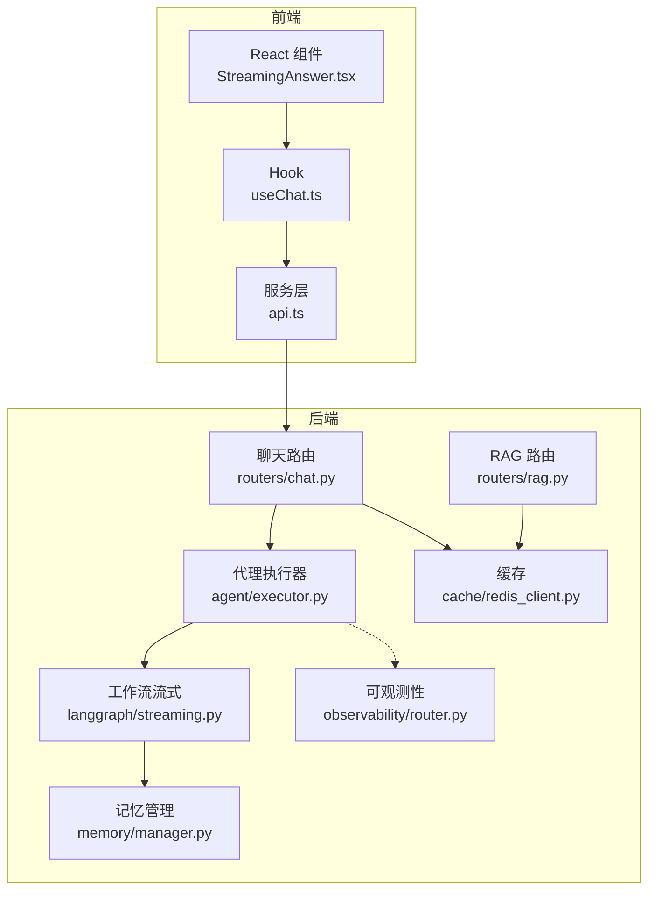
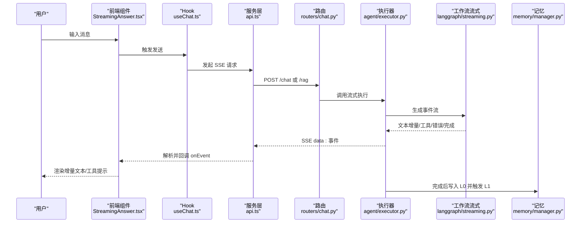
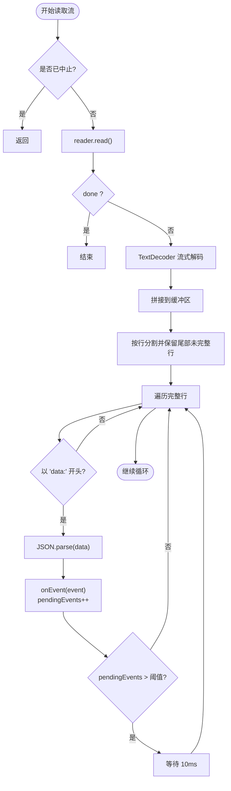
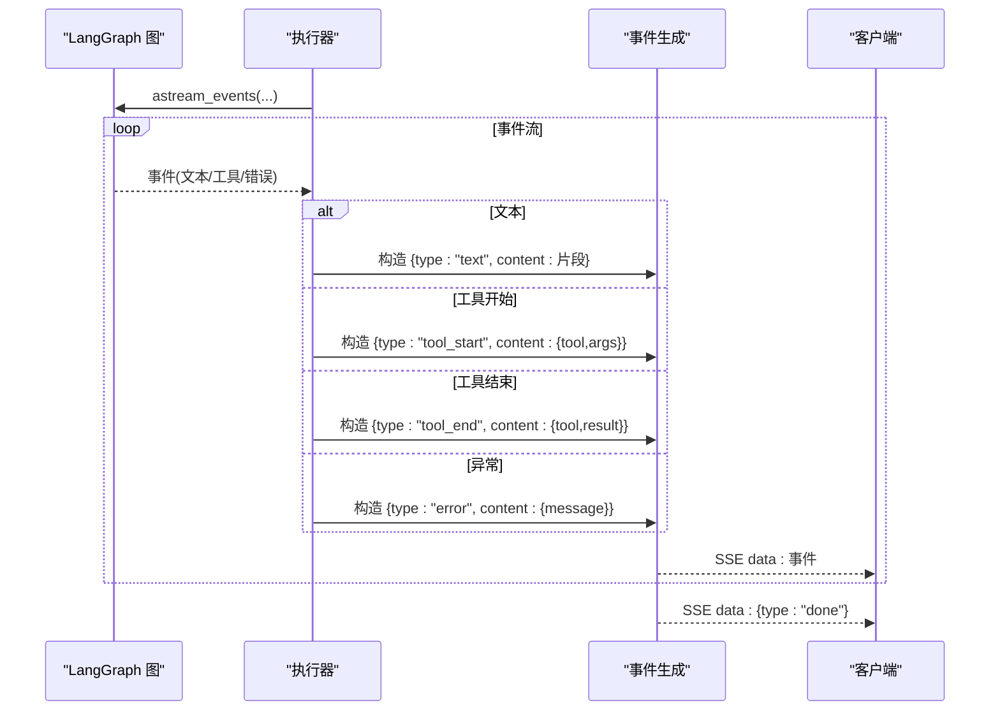
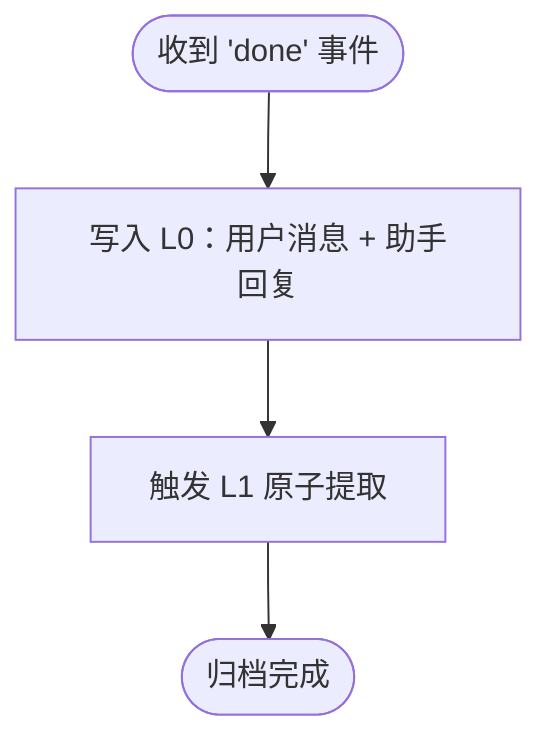
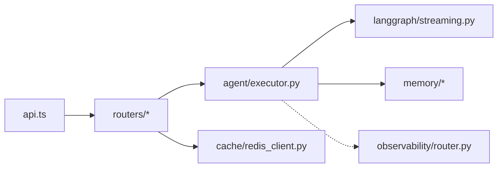

# 流式处理

<cite>
**本文引用的文件**
- [backend/app/agent/executor.py](file://backend/app/agent/executor.py)
- [backend/app/langgraph/streaming.py](file://backend/app/langgraph/streaming.py)
- [src/services/api.ts](file://src/services/api.ts)
- [backend/tests/test_streaming_workflow.py](file://backend/tests/test_streaming_workflow.py)
- [backend/tests/test_agent_flow.py](file://backend/tests/test_agent_flow.py)
- [backend/tests/test_langgraph.py](file://backend/tests/test_langgraph.py)
- [src/components/search/StreamingAnswer.tsx](file://src/components/search/StreamingAnswer.tsx)
- [src/hooks/useChat.ts](file://src/hooks/useChat.ts)
- [backend/app/routers/chat.py](file://backend/app/routers/chat.py)
- [backend/app/routers/rag.py](file://backend/app/routers/rag.py)
- [backend/app/dependencies.py](file://backend/app/dependencies.py)
- [backend/app/exceptions.py](file://backend/app/exceptions.py)
- [backend/app/memory/manager.py](file://backend/app/memory/manager.py)
- [backend/app/memory/l0_conversation.py](file://backend/app/memory/l0_conversation.py)
- [backend/app/memory/l1_atom.py](file://backend/app/memory/l1_atom.py)
- [backend/app/memory/l2_scenario.py](file://backend/app/memory/l2_scenario.py)
- [backend/app/memory/l3_persona.py](file://backend/app/memory/l3_persona.py)
- [backend/app/cache/redis_client.py](file://backend/app/cache/redis_client.py)
- [backend/app/observability/router.py](file://backend/app/observability/router.py)
</cite>

## 目录
1. [简介](#简介)
2. [项目结构](#项目结构)
3. [核心组件](#核心组件)
4. [架构总览](#架构总览)
5. [详细组件分析](#详细组件分析)
6. [依赖关系分析](#依赖关系分析)
7. [性能考量](#性能考量)
8. [故障排查指南](#故障排查指南)
9. [结论](#结论)
10. [附录](#附录)

## 简介
本文件面向 LangGraph 流式处理系统，系统性阐述异步执行、实时数据传输、并发与资源管理、事件格式与传输协议、错误处理与恢复、性能监控与调试、扩展开发与最佳实践。目标是帮助开发者在不深入源码的前提下理解整体设计，并在前端与后端协同工作时具备可操作的指导。

## 项目结构
LangGraph 流式处理涉及前后端协作：
- 前端通过 SSE 接收后端流式事件，逐段渲染并维护背压控制。
- 后端以异步生成器形式输出标准化事件，覆盖文本增量、工具调用、错误与完成信号。
- 记忆模块在流结束后进行会话归档与后续原子提取，确保上下文连续性。

图表来源
- [src/components/search/StreamingAnswer.tsx](file://src/components/search/StreamingAnswer.tsx)
- [src/hooks/useChat.ts](file://src/hooks/useChat.ts)
- [src/services/api.ts](file://src/services/api.ts)
- [backend/app/routers/chat.py](file://backend/app/routers/chat.py)
- [backend/app/routers/rag.py](file://backend/app/routers/rag.py)
- [backend/app/agent/executor.py](file://backend/app/agent/executor.py)
- [backend/app/langgraph/streaming.py](file://backend/app/langgraph/streaming.py)
- [backend/app/memory/manager.py](file://backend/app/memory/manager.py)
- [backend/app/cache/redis_client.py](file://backend/app/cache/redis_client.py)
- [backend/app/observability/router.py](file://backend/app/observability/router.py)

章节来源
- [src/services/api.ts:36-94](file://src/services/api.ts#L36-L94)
- [backend/app/agent/executor.py:10-62](file://backend/app/agent/executor.py#L10-L62)
- [backend/app/langgraph/streaming.py:14-200](file://backend/app/langgraph/streaming.py#L14-L200)

## 核心组件
- 前端流式消费器：基于 Fetch 的 ReadableStream Reader，按行解析 data: JSON，维护 pendingEvents 实现背压，逐条触发回调渲染。
- 后端事件生成器：将 LangGraph 事件映射为标准化 SSE 事件，包含文本增量、工具开始/结束、错误与完成等类型。
- 记忆与归档：在“完成”事件后，自动记录对话到 L0 并触发 L1 原子提取，保证上下文连续。
- 缓存与可观测性：Redis 缓存用于加速检索；路由层统一接入可观测性，便于追踪与告警。

章节来源
- [src/services/api.ts:36-94](file://src/services/api.ts#L36-L94)
- [backend/app/agent/executor.py:10-62](file://backend/app/agent/executor.py#L10-L62)
- [backend/app/memory/manager.py](file://backend/app/memory/manager.py)
- [backend/app/cache/redis_client.py](file://backend/app/cache/redis_client.py)
- [backend/app/observability/router.py](file://backend/app/observability/router.py)

## 架构总览
下图展示从用户输入到前端渲染的完整链路，以及事件在各层之间的流转。

图表来源
- [src/components/search/StreamingAnswer.tsx](file://src/components/search/StreamingAnswer.tsx)
- [src/hooks/useChat.ts](file://src/hooks/useChat.ts)
- [src/services/api.ts:36-94](file://src/services/api.ts#L36-L94)
- [backend/app/routers/chat.py](file://backend/app/routers/chat.py)
- [backend/app/agent/executor.py:10-62](file://backend/app/agent/executor.py#L10-L62)
- [backend/app/langgraph/streaming.py:14-200](file://backend/app/langgraph/streaming.py#L14-L200)
- [backend/app/memory/manager.py](file://backend/app/memory/manager.py)

## 详细组件分析

### 前端流式消费与背压控制
- 使用 ReadableStream Reader 逐块读取响应体，TextDecoder 流式解码，按行切分缓冲区，过滤以 "data:" 开头的行。
- 维护 pendingEvents 计数，超过阈值时主动让出时间片，避免 React 渲染队列堆积导致卡顿。
- 对 JSON 解析异常进行容错，继续处理后续行；对 AbortError 进行捕获并优雅退出。
- 错误回调统一上报状态码或网络异常信息。

图表来源
- [src/services/api.ts:36-94](file://src/services/api.ts#L36-L94)

章节来源
- [src/services/api.ts:36-94](file://src/services/api.ts#L36-L94)

### 后端事件生成与协议
- 将 LangGraph 的 astream_events 输出映射为标准化 SSE 事件：
  - 文本增量：type="text"，content 为字符串片段。
  - 工具开始/结束：type="tool_start"/"tool_end"，携带工具名与参数/结果。
  - 错误：type="error"，content 包含可读消息。
  - 完成：type="done"，content 为空。
  - 会话：type="session"，content 为 session_id。
- 异常捕获后统一发出 error 事件，最后再发送 done，确保前端能正确收尾。

图表来源
- [backend/app/agent/executor.py:10-62](file://backend/app/agent/executor.py#L10-L62)

章节来源
- [backend/app/agent/executor.py:10-62](file://backend/app/agent/executor.py#L10-L62)

### 记忆与归档流程
- 在收到 "done" 事件后，执行器负责：
  - 记录用户消息与助手回复到 L0（短期记忆）。
  - 异步触发 L1 原子提取，抽取关键信息形成更高层记忆。
- 该流程确保上下文连续性与长期可用的知识沉淀。

图表来源
- [backend/app/agent/executor.py:64-120](file://backend/app/agent/executor.py#L64-L120)
- [backend/app/memory/manager.py](file://backend/app/memory/manager.py)
- [backend/app/memory/l0_conversation.py](file://backend/app/memory/l0_conversation.py)
- [backend/app/memory/l1_atom.py](file://backend/app/memory/l1_atom.py)

章节来源
- [backend/app/agent/executor.py:64-120](file://backend/app/agent/executor.py#L64-L120)
- [backend/app/memory/manager.py](file://backend/app/memory/manager.py)
- [backend/app/memory/l0_conversation.py](file://backend/app/memory/l0_conversation.py)
- [backend/app/memory/l1_atom.py](file://backend/app/memory/l1_atom.py)

### 工作流流式引擎
- 提供 stream_workflow 入口，封装意图分类、语言检测、RAG 源信息等步骤，逐阶段产出事件。
- 单元测试验证错误被安全地转换为 "error" 事件，且最终仍发出 "done"，保证前端一致性。

章节来源
- [backend/app/langgraph/streaming.py:14-200](file://backend/app/langgraph/streaming.py#L14-L200)
- [backend/tests/test_langgraph.py:115-131](file://backend/tests/test_langgraph.py#L115-L131)

### 路由与依赖注入
- 路由层负责接收请求、注入依赖（如缓存、可观测性），并将请求转发至执行器。
- 依赖注入确保缓存与监控能力在不侵入业务逻辑的情况下被复用。

章节来源
- [backend/app/routers/chat.py](file://backend/app/routers/chat.py)
- [backend/app/routers/rag.py](file://backend/app/routers/rag.py)
- [backend/app/dependencies.py](file://backend/app/dependencies.py)
- [backend/app/cache/redis_client.py](file://backend/app/cache/redis_client.py)
- [backend/app/observability/router.py](file://backend/app/observability/router.py)

## 依赖关系分析
- 前端依赖后端提供的 SSE 事件格式；后端依赖 LangGraph 的事件模型与工具链。
- 记忆模块与缓存模块作为横切关注点，贯穿执行器与路由层。
- 可观测性路由为全链路埋点提供统一入口。

图表来源
- [src/services/api.ts:36-94](file://src/services/api.ts#L36-L94)
- [backend/app/routers/chat.py](file://backend/app/routers/chat.py)
- [backend/app/agent/executor.py:10-62](file://backend/app/agent/executor.py#L10-L62)
- [backend/app/langgraph/streaming.py:14-200](file://backend/app/langgraph/streaming.py#L14-L200)
- [backend/app/memory/manager.py](file://backend/app/memory/manager.py)
- [backend/app/cache/redis_client.py](file://backend/app/cache/redis_client.py)
- [backend/app/observability/router.py](file://backend/app/observability/router.py)

## 性能考量
- 背压控制：前端通过 pendingEvents 与定时让步，避免渲染积压；建议根据设备性能调整阈值与让步间隔。
- 事件粒度：将长文本拆分为更小片段，减少单次渲染压力；工具事件应尽量精简 payload。
- 缓存命中：利用 Redis 缓存热点查询与中间结果，降低重复计算与 IO。
- 异步归档：记忆写入与 L1 提取采用异步非阻塞方式，避免阻塞主事件流。
- 监控与采样：通过可观测性路由采集关键指标（延迟、错误率、事件速率），结合采样策略控制开销。

## 故障排查指南
- 前端常见问题
  - 无法读取流：检查后端是否正确设置 Content-Type 与 SSE 格式；确认 ReadableStream 支持。
  - JSON 解析失败：确认每行均为 "data: ..." 结构，且 JSON 可解析；排查编码与截断。
  - 中止请求：AbortError 属于预期行为，需在 UI 上区分并允许重试。
- 后端常见问题
  - 事件丢失：检查 astream_events 是否正确 yield；确认异常被捕获并发出 error 事件。
  - 记忆未写入：核对 done 事件后的归档逻辑；检查 L0/L1 写入权限与异步调度。
  - 错误暴露：确保错误消息被清洗，避免泄露内部细节。
- 测试参考
  - 单元测试覆盖了错误事件、完成事件与会话注入等关键路径，可据此定位问题。

章节来源
- [src/services/api.ts:88-94](file://src/services/api.ts#L88-L94)
- [backend/app/agent/executor.py:58-61](file://backend/app/agent/executor.py#L58-L61)
- [backend/tests/test_agent_flow.py:248-265](file://backend/tests/test_agent_flow.py#L248-L265)
- [backend/tests/test_langgraph.py:115-131](file://backend/tests/test_langgraph.py#L115-L131)

## 结论
LangGraph 流式处理通过前后端约定的 SSE 事件协议，实现了低延迟、可中断、可恢复的实时交互。前端侧的背压控制与后端侧的事件规范化、异常安全化共同保障了稳定性与可维护性。配合记忆与缓存机制，系统在复杂工作流中也能保持良好的用户体验与性能表现。

## 附录

### 事件类型与消息结构
- 文本增量
  - type: "text"
  - content: 字符串片段
- 工具开始
  - type: "tool_start"
  - content: { tool: "工具名", args: 参数对象 }
- 工具结束
  - type: "tool_end"
  - content: { tool: "工具名", result: 结果字符串 }
- 错误
  - type: "error"
  - content: { message: "错误描述" }
- 完成
  - type: "done"
  - content: null
- 会话
  - type: "session"
  - content: { session_id: "会话标识" }

章节来源
- [backend/app/agent/executor.py:10-62](file://backend/app/agent/executor.py#L10-L62)

### 扩展开发指南
- 实现实时数据推送
  - 在后端新增事件类型时，确保在执行器中映射为 SSE 事件，并在前端做好 onEvent 分发。
  - 对于多路复用场景，可在事件中携带 channel 或 topic 字段，前端按通道聚合。
- 客户端连接管理
  - 建议在前端为每个会话维护独立的 AbortController，支持取消与重试。
  - 对长连接场景，增加心跳与断线重连策略，结合 done 事件判断会话生命周期。
- 并发与资源管理
  - 控制同时活跃的会话数量，避免内存与连接池耗尽。
  - 对工具调用与外部 API 调用设置超时与熔断，防止级联故障。
- 性能优化建议
  - 事件分片：将大文本拆分为更小片段，提升首包延迟与渲染流畅度。
  - 缓存策略：对意图分类、语言检测、RAG 源等结果进行缓存，命中率优先。
  - 异步归档：将记忆写入与 L1 提取异步化，避免阻塞主事件流。
- 最佳实践
  - 前端：始终处理 "done" 事件，清理资源；对 "error" 事件提供用户可读提示。
  - 后端：异常统一转换为 "error" 事件；日志与指标分离，避免影响事件流。
  - 测试：为每个事件类型编写单元测试，覆盖正常与异常分支。