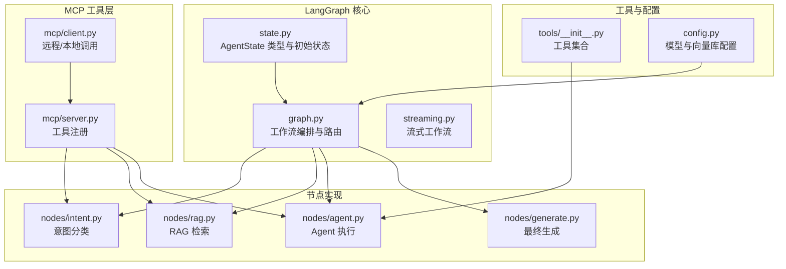
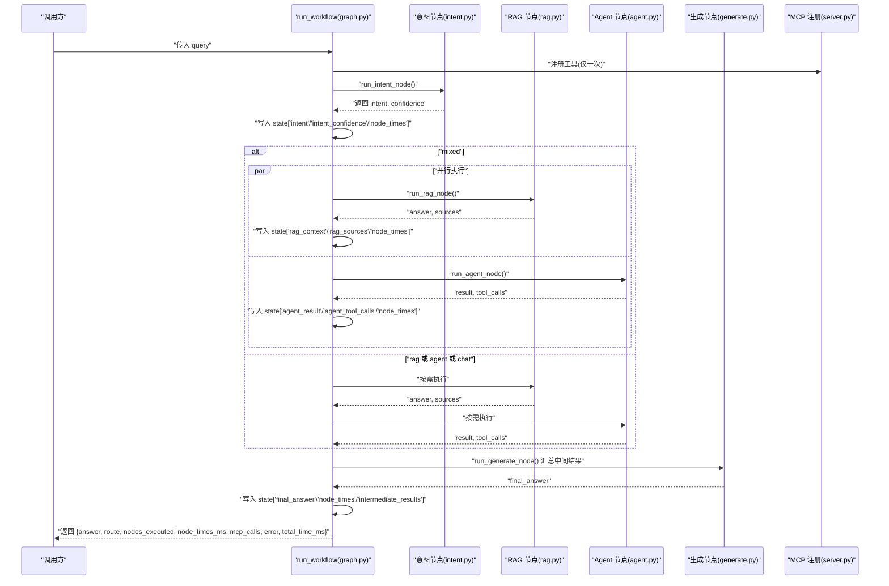
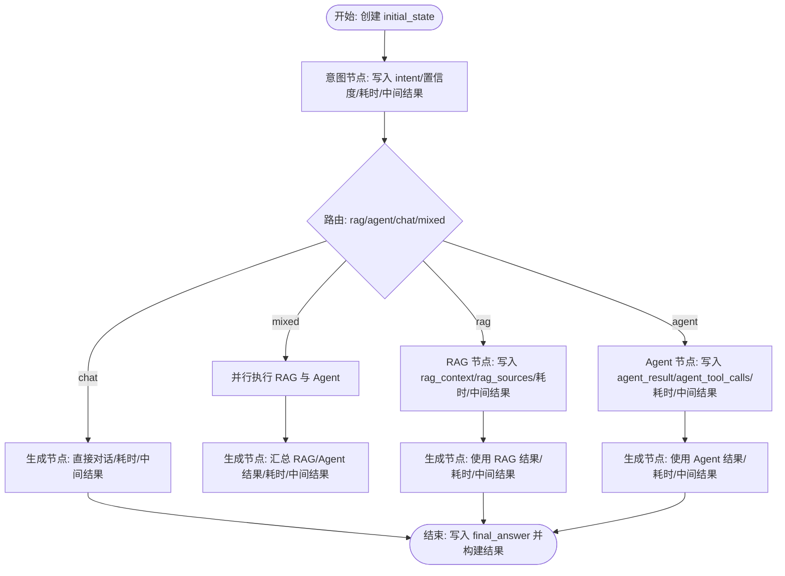
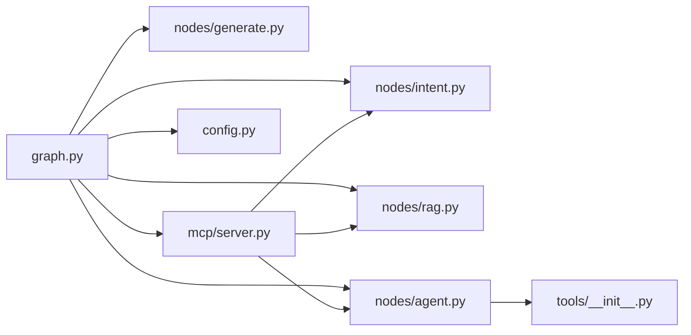

# 状态管理

<cite>
**本文引用的文件**
- [state.py](file://backend/app/langgraph/state.py)
- [graph.py](file://backend/app/langgraph/graph.py)
- [intent.py](file://backend/app/langgraph/nodes/intent.py)
- [rag.py](file://backend/app/langgraph/nodes/rag.py)
- [agent.py](file://backend/app/langgraph/nodes/agent.py)
- [generate.py](file://backend/app/langgraph/nodes/generate.py)
- [streaming.py](file://backend/app/langgraph/streaming.py)
- [server.py](file://backend/app/langgraph/mcp/server.py)
- [client.py](file://backend/app/langgraph/mcp/client.py)
- [__init__.py（tools）](file://backend/app/tools/__init__.py)
- [config.py](file://backend/app/config.py)
- [test_langgraph.py](file://backend/tests/test_langgraph.py)
</cite>

## 目录
1. [引言](#引言)
2. [项目结构](#项目结构)
3. [核心组件](#核心组件)
4. [架构总览](#架构总览)
5. [详细组件分析](#详细组件分析)
6. [依赖关系分析](#依赖关系分析)
7. [性能考量](#性能考量)
8. [故障排查指南](#故障排查指南)
9. [结论](#结论)
10. [附录](#附录)

## 引言
本文件系统性梳理 LangGraph 状态管理系统的设计与实现，聚焦于 AgentState 的结构定义、初始状态初始化、状态在节点间的传递与更新、中间结果与时间统计、错误与异常处理、以及可扩展性与最佳实践。文档同时覆盖流式工作流与 MCP 工具注册机制，帮助开发者在不破坏既有契约的前提下安全地扩展状态字段与处理逻辑。

## 项目结构
LangGraph 状态管理相关代码集中在后端应用的 langgraph 子模块内，并与工具注册、LLM 配置、RAG/Agent 节点实现协同工作。

图表来源
- [state.py:1-47](file://backend/app/langgraph/state.py#L1-L47)
- [graph.py:1-163](file://backend/app/langgraph/graph.py#L1-L163)
- [intent.py:1-76](file://backend/app/langgraph/nodes/intent.py#L1-L76)
- [rag.py:1-27](file://backend/app/langgraph/nodes/rag.py#L1-L27)
- [agent.py:1-32](file://backend/app/langgraph/nodes/agent.py#L1-L32)
- [generate.py:1-89](file://backend/app/langgraph/nodes/generate.py#L1-L89)
- [server.py:1-43](file://backend/app/langgraph/mcp/server.py#L1-L43)
- [client.py:1-43](file://backend/app/langgraph/mcp/client.py#L1-L43)
- [__init__.py（tools）:1-23](file://backend/app/tools/__init__.py#L1-L23)
- [config.py:1-90](file://backend/app/config.py#L1-L90)

章节来源
- [state.py:1-47](file://backend/app/langgraph/state.py#L1-L47)
- [graph.py:1-163](file://backend/app/langgraph/graph.py#L1-L163)
- [streaming.py:1-127](file://backend/app/langgraph/streaming.py#L1-L127)
- [server.py:1-43](file://backend/app/langgraph/mcp/server.py#L1-L43)
- [client.py:1-43](file://backend/app/langgraph/mcp/client.py#L1-L43)
- [__init__.py（tools）:1-23](file://backend/app/tools/__init__.py#L1-L23)
- [config.py:1-90](file://backend/app/config.py#L1-L90)

## 核心组件
- AgentState 类型与初始状态
  - AgentState 使用 TypedDict 定义工作流全局状态，包含查询、意图、置信度、RAG 上下文与来源、Agent 结果与工具调用、中间结果、最终答案、错误、各节点耗时、MCP 调用记录、人工审批标记等字段。
  - initial_state 提供统一的初始状态构造器，确保每次工作流启动时具备一致的默认值与空集合/字典结构。
- 工作流编排与路由
  - create_llm_call_fn 将现有 LLM 配置封装为函数，供节点调用。
  - route_intent 基于状态中的 intent 字段与人工审批状态进行条件路由，支持 "rag"/"agent"/"chat"/"mixed" 四类路径。
  - run_workflow 实现完整的同步/异步执行流程：意图分类、并行/串行执行 RAG/Agent、最终生成、时间统计与中间结果记录。
- 节点实现
  - 意图节点：基于关键词规则快速判定意图，避免不必要的 LLM 调用。
  - RAG 节点：调用 RAG 查询链，返回答案与来源列表。
  - Agent 节点：构建聊天 Agent 并执行工具调用，返回结果文本。
  - 生成节点：根据语言检测与中间结果拼装最终回答，支持直接对话与混合场景。
- 流式工作流
  - streaming.py 提供异步流式版本，按事件类型输出 intent/route/sources/text/done/error 等事件，便于前端实时展示。
- MCP 工具层
  - server.py 在模块加载时注册工具（意图分类、知识检索、Agent 执行），client.py 支持本地与远程 MCP 调用。
- 工具与配置
  - tools/__init__.py 动态聚合可用工具集，依据环境与向量索引存在性决定是否启用 RAG 工具。
  - config.py 提供多模型与嵌入 API 的配置项，支撑 LLM 调用与向量检索。

章节来源
- [state.py:6-46](file://backend/app/langgraph/state.py#L6-L46)
- [graph.py:20-162](file://backend/app/langgraph/graph.py#L20-L162)
- [intent.py:47-76](file://backend/app/langgraph/nodes/intent.py#L47-L76)
- [rag.py:11-26](file://backend/app/langgraph/nodes/rag.py#L11-L26)
- [agent.py:13-31](file://backend/app/langgraph/nodes/agent.py#L13-L31)
- [generate.py:34-88](file://backend/app/langgraph/nodes/generate.py#L34-L88)
- [streaming.py:15-127](file://backend/app/langgraph/streaming.py#L15-L127)
- [server.py:6-42](file://backend/app/langgraph/mcp/server.py#L6-L42)
- [client.py:10-42](file://backend/app/langgraph/mcp/client.py#L10-L42)
- [__init__.py（tools）:7-23](file://backend/app/tools/__init__.py#L7-L23)
- [config.py:4-90](file://backend/app/config.py#L4-L90)

## 架构总览
LangGraph 的状态管理遵循“状态驱动”的工作流模式：以 AgentState 为核心载体，节点在执行过程中对状态进行只增不减的更新（中间结果、耗时、MCP 记录、最终答案），并通过条件路由在不同路径间切换。MCP 层将具体能力以工具形式注册，既可本地调用，也可远程访问，提升可扩展性与解耦度。

图表来源
- [graph.py:43-146](file://backend/app/langgraph/graph.py#L43-L146)
- [intent.py:73-76](file://backend/app/langgraph/nodes/intent.py#L73-L76)
- [rag.py:11-26](file://backend/app/langgraph/nodes/rag.py#L11-L26)
- [agent.py:13-31](file://backend/app/langgraph/nodes/agent.py#L13-L31)
- [generate.py:34-88](file://backend/app/langgraph/nodes/generate.py#L34-L88)
- [server.py:6-42](file://backend/app/langgraph/mcp/server.py#L6-L42)

## 详细组件分析

### AgentState 设计与实现
- 数据结构
  - 字段覆盖：输入查询、意图与置信度、RAG 上下文与来源、Agent 结果与工具调用、中间结果、最终答案、错误、节点耗时、MCP 调用、人工审批标记。
  - 初始状态：initial_state 返回一个包含所有键的字典，值为默认空字符串、空列表或空字典，保证后续节点无需判空即可追加内容。
- 序列化与传输
  - 状态作为普通字典在节点间传递，最终通过 _build_result 序列化为 JSON 友好的响应对象，包含节点执行清单、耗时与 MCP 调用明细。
- 时间统计与中间结果
  - 每个节点在执行前后记录耗时（毫秒），并把节点名称与摘要输出写入 intermediate_results，便于审计与可视化。
- 错误处理
  - run_workflow 捕获异常，写入 state["error"] 与 state["final_answer"]，并继续产出标准化结果，避免中断。

章节来源
- [state.py:6-46](file://backend/app/langgraph/state.py#L6-L46)
- [graph.py:29-162](file://backend/app/langgraph/graph.py#L29-L162)

### 状态传递与更新机制
- 传递方式
  - run_workflow 接收 query，创建 initial_state，随后在每个节点执行前/后直接修改该状态字典，形成“就地更新”的模式。
- 更新策略
  - 意图节点：写入 intent 与 intent_confidence，并记录耗时与一条中间结果。
  - RAG/Agent 节点：根据路由条件选择性执行，分别写入对应上下文与工具调用信息，并记录耗时与中间结果。
  - 生成节点：根据语言与中间结果拼装最终答案，记录耗时与中间结果。
- 并发与异步
  - run_workflow 使用 asyncio.to_thread 将同步节点包装为异步执行，避免阻塞事件循环；流式工作流 streaming.py 则直接使用异步生成器。

图表来源
- [graph.py:43-146](file://backend/app/langgraph/graph.py#L43-L146)

章节来源
- [graph.py:43-146](file://backend/app/langgraph/graph.py#L43-L146)

### 状态持久化与恢复机制
- 当前实现
  - 状态为内存字典，工作流结束即销毁；未见数据库/缓存层的显式持久化逻辑。
- 恢复策略
  - 若需跨请求/会话恢复，可在上层业务层将最终结果与中间结果序列化存储，并在新请求中重建初始状态，再按需重放部分节点（需谨慎控制副作用）。
- 建议
  - 对于需要跨会话保留的场景，建议引入 Redis 或数据库存储，结合 session_id 作为键，定期清理过期会话。

章节来源
- [graph.py:149-162](file://backend/app/langgraph/graph.py#L149-L162)

### 状态清理与内存管理
- 中间结果与来源
  - intermediate_results 与 rag_sources 为列表，应避免无限增长；建议在节点中限制最大条目数或按会话周期清理。
- 耗时统计
  - node_times 为字典，键为节点名，值为整数毫秒；可按会话清理或滚动窗口维护最近 N 次调用。
- MCP 调用
  - mcp_calls 记录工具调用轨迹，建议设置上限并在会话结束时归档。

章节来源
- [state.py:18-26](file://backend/app/langgraph/state.py#L18-L26)
- [graph.py:55-146](file://backend/app/langgraph/graph.py#L55-L146)

### 状态验证与约束检查
- 字段完整性
  - 测试用例验证 initial_state 包含所有键且初始值符合预期，有助于在新增字段时保持向后兼容。
- 类型与范围
  - intent_confidence 为浮点数，建议在节点中做边界校验（0~1）。
  - rag_sources 为列表元素字典，建议校验必需键（如 title/slug/score）。
- 审批流程
  - human_approval_needed 与 human_approved 控制路由分支，应在上层业务中确保审批状态一致性。

章节来源
- [test_langgraph.py:12-33](file://backend/tests/test_langgraph.py#L12-L33)
- [graph.py:32-40](file://backend/app/langgraph/graph.py#L32-L40)

### 状态调试与监控
- 日志与事件
  - run_workflow 记录意图与各节点耗时，streaming.py 输出 intent/route/sources/text/done/error 等事件，便于前端实时反馈。
- 性能指标
  - node_times_ms 与 total_time_ms 可用于监控整体延迟与瓶颈节点。
- 错误隔离
  - 异常被捕获并写入 state["error"]，同时返回通用错误消息，避免泄露内部细节。

章节来源
- [graph.py:34-146](file://backend/app/langgraph/graph.py#L34-L146)
- [streaming.py:26-59](file://backend/app/langgraph/streaming.py#L26-L59)

### 状态扩展开发指南
- 新增状态字段
  - 在 AgentState 中添加键（如 new_field: Any），在 initial_state 中提供默认值，确保下游节点不会因缺失键而报错。
  - 在 _build_result 中补充导出字段，保持对外接口稳定。
- 自定义状态处理逻辑
  - 在节点中直接读写状态字典，遵循“只增不减”原则；对可能为空的字段使用 get() 并提供默认值。
  - 如需条件分支，优先在 route_intent 或流式路由中体现，避免在节点内做复杂状态判断。
- MCP 工具集成
  - 通过 server.py 的 register_tool 注册新工具，客户端可通过 client.py 远程调用，减少节点内联逻辑。
- 工具集合扩展
  - 在 tools/__init__.py 中动态添加工具，注意根据环境变量与向量索引存在性决定启用与否。

章节来源
- [state.py:6-46](file://backend/app/langgraph/state.py#L6-L46)
- [graph.py:149-162](file://backend/app/langgraph/graph.py#L149-L162)
- [server.py:6-42](file://backend/app/langgraph/mcp/server.py#L6-L42)
- [client.py:19-42](file://backend/app/langgraph/mcp/client.py#L19-L42)
- [__init__.py（tools）:7-23](file://backend/app/tools/__init__.py#L7-L23)

## 依赖关系分析
- 组件耦合
  - graph.py 依赖 nodes/* 与 mcp/server.py，形成“编排层-执行层-工具层”的清晰分层。
  - nodes/* 依赖工具集合与 LLM 配置，保持与上层解耦。
- 外部依赖
  - MCP 注册与调用依赖 app.langgraph.mcp 的注册表；工具调用链路贯穿 nodes 与 mcp 层。
- 循环依赖
  - 未发现直接循环导入；MCP 注册在模块加载时完成，避免运行时循环。

图表来源
- [graph.py:7-12](file://backend/app/langgraph/graph.py#L7-L12)
- [intent.py:1-76](file://backend/app/langgraph/nodes/intent.py#L1-L76)
- [rag.py:1-27](file://backend/app/langgraph/nodes/rag.py#L1-L27)
- [agent.py:1-32](file://backend/app/langgraph/nodes/agent.py#L1-L32)
- [generate.py:1-89](file://backend/app/langgraph/nodes/generate.py#L1-L89)
- [server.py:1-43](file://backend/app/langgraph/mcp/server.py#L1-L43)
- [__init__.py（tools）:1-23](file://backend/app/tools/__init__.py#L1-L23)
- [config.py:1-90](file://backend/app/config.py#L1-L90)

章节来源
- [graph.py:7-12](file://backend/app/langgraph/graph.py#L7-L12)
- [server.py:3-42](file://backend/app/langgraph/mcp/server.py#L3-L42)
- [__init__.py（tools）:1-23](file://backend/app/tools/__init__.py#L1-L23)

## 性能考量
- 意图分类优化
  - nodes/intent.py 使用关键词规则快速判定意图，避免 LLM 调用，显著降低延迟。
- 并行执行
  - mixed 场景下 RAG 与 Agent 并行执行，缩短端到端时间。
- 异步与线程池
  - run_workflow 使用 asyncio.to_thread 包装同步节点，避免阻塞；流式工作流 streaming.py 直接异步生成，适合长文本输出。
- 资源与缓存
  - MCP 工具注册在模块加载时完成，减少运行时开销；工具集合按环境动态装配，避免无效调用。
- 建议
  - 对高频节点增加本地缓存（如意图分类结果）；对 RAG 源列表做去重与截断；对生成节点设置超时与最大输出长度。

章节来源
- [intent.py:47-76](file://backend/app/langgraph/nodes/intent.py#L47-L76)
- [graph.py:78-104](file://backend/app/langgraph/graph.py#L78-L104)
- [streaming.py:15-127](file://backend/app/langgraph/streaming.py#L15-L127)

## 故障排查指南
- 常见问题
  - 缺少必要字段：若下游节点读取不存在键，需检查 initial_state 与节点写入逻辑。
  - 节点未执行：确认 route_intent 的分支条件与 human_approval_* 状态。
  - MCP 调用失败：检查 server.py 工具注册与 client.py 远程地址配置。
  - 工具不可用：tools/__init__.py 中根据环境决定是否注册 RAG/网络搜索工具。
- 调试手段
  - 查看日志：run_workflow 与 streaming.py 输出关键事件与耗时。
  - 检查状态：在节点中打印 state 的关键字段，定位写入时机。
  - 单元测试：利用 tests/test_langgraph.py 验证初始状态与意图分类行为。

章节来源
- [graph.py:34-146](file://backend/app/langgraph/graph.py#L34-L146)
- [streaming.py:26-59](file://backend/app/langgraph/streaming.py#L26-L59)
- [test_langgraph.py:12-165](file://backend/tests/test_langgraph.py#L12-L165)

## 结论
LangGraph 的状态管理以 AgentState 为核心，采用“就地更新”的简洁模式，配合条件路由与 MCP 工具注册，实现了高可扩展与低耦合的工作流体系。通过中间结果与时间统计，系统具备良好的可观测性；通过流式工作流，前端可获得更流畅的交互体验。建议在生产环境中引入状态持久化与清理策略，并持续完善字段校验与错误隔离机制。

## 附录
- 关键 API 一览
  - AgentState：包含 query、intent、intent_confidence、rag_context、rag_sources、agent_result、agent_tool_calls、intermediate_results、final_answer、error、node_times、mcp_calls、human_approval_needed、human_approved。
  - initial_state(query)：返回初始状态字典。
  - run_workflow(query, session_id)：同步工作流入口。
  - stream_workflow(query, llm, session_id, top_k)：异步流式工作流入口。
  - route_intent(state)：基于状态的条件路由。
  - register_all_tools()：模块加载时注册 MCP 工具。
  - MCPClient.call_tool(tool_name, args)：本地/远程工具调用。

章节来源
- [state.py:6-46](file://backend/app/langgraph/state.py#L6-L46)
- [graph.py:29-162](file://backend/app/langgraph/graph.py#L29-L162)
- [streaming.py:15-59](file://backend/app/langgraph/streaming.py#L15-L59)
- [server.py:6-42](file://backend/app/langgraph/mcp/server.py#L6-L42)
- [client.py:19-42](file://backend/app/langgraph/mcp/client.py#L19-L42)