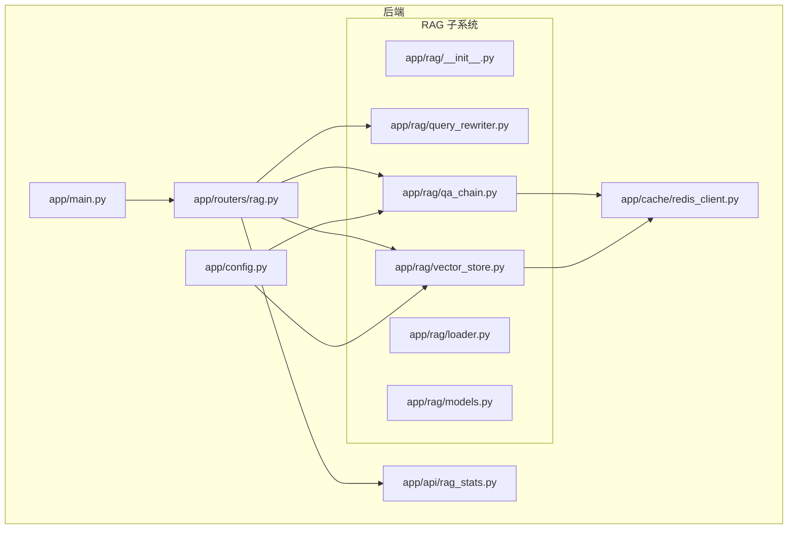
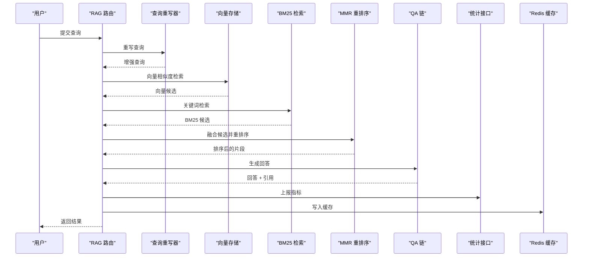
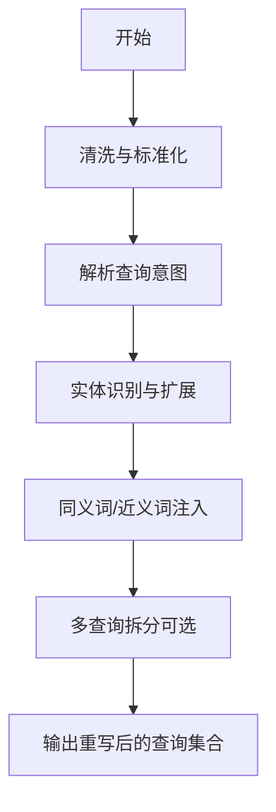
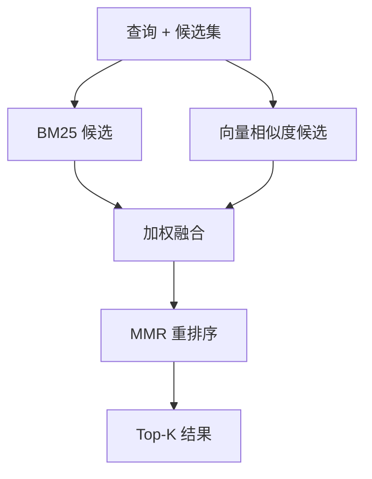
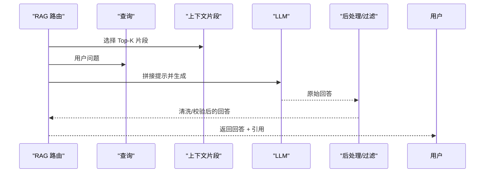
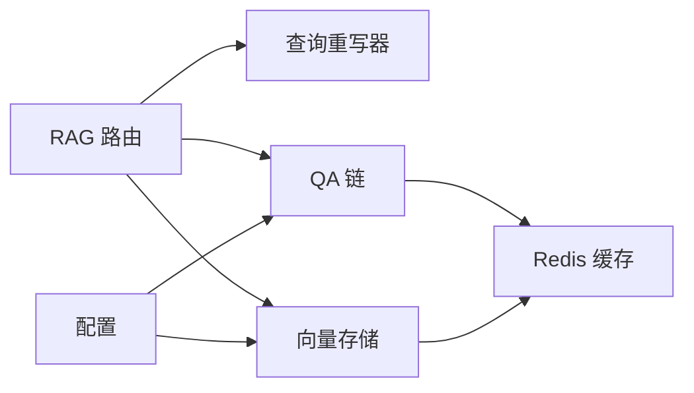

# RAG 检索引擎

<cite>
**本文引用的文件**
- [backend/app/rag/__init__.py](file://backend/app/rag/__init__.py)
- [backend/app/rag/loader.py](file://backend/app/rag/loader.py)
- [backend/app/rag/query_rewriter.py](file://backend/app/rag/query_rewriter.py)
- [backend/app/rag/vector_store.py](file://backend/app/rag/vector_store.py)
- [backend/app/rag/qa_chain.py](file://backend/app/rag/qa_chain.py)
- [backend/app/rag/models.py](file://backend/app/rag/models.py)
- [backend/app/routers/rag.py](file://backend/app/routers/rag.py)
- [backend/app/api/rag_stats.py](file://backend/app/api/rag_stats.py)
- [backend/app/cache/redis_client.py](file://backend/app/cache/redis_client.py)
- [backend/app/config.py](file://backend/app/config.py)
- [backend/app/main.py](file://backend/app/main.py)
- [backend/data/articles/en/rag-system-guide.md](file://backend/data/articles/en/rag-system-guide.md)
- [backend/data/articles/en/embedding-models-guide.md](file://backend/data/articles/en/embedding-models-guide.md)
- [backend/tests/test_loader.py](file://backend/tests/test_loader.py)
- [backend/tests/test_query_rewriter.py](file://backend/tests/test_query_rewriter.py)
- [backend/tests/test_vector_store.py](file://backend/tests/test_vector_store.py)
- [backend/tests/test_qa_chain.py](file://backend/tests/test_qa_chain.py)
- [docs/rag-design.md](file://docs/rag-design.md)
- [docs/superpowers/specs/2026-06-02-rag-optimization-v22-design.md](file://docs/superpowers/specs/2026-06-02-rag-optimization-v22-design.md)
- [docs/benchmarks/recall-evaluation.md](file://docs/benchmarks/recall-evaluation.md)
</cite>

## 目录
1. [简介](#简介)
2. [项目结构](#项目结构)
3. [核心组件](#核心组件)
4. [架构总览](#架构总览)
5. [详细组件分析](#详细组件分析)
6. [依赖关系分析](#依赖关系分析)
7. [性能考量](#性能考量)
8. [故障排查指南](#故障排查指南)
9. [结论](#结论)
10. [附录](#附录)

## 简介
本文件面向 Aureon 的 RAG 检索引擎，系统化阐述混合检索设计与实现：关键词检索（BM25）与语义向量检索的融合、向量存储管理、文档加载器、查询重写器、QA 链、MMR 重排序、向量数据库配置与索引优化、缓存策略与查询优化、文档预处理与分块策略、元数据管理，以及面向开发者的可扩展性与优化建议。

## 项目结构
后端采用 Python FastAPI 应用，RAG 子系统位于 backend/app/rag；前端位于 src；测试位于 backend/tests；设计文档位于 docs。

图示来源
- [backend/app/main.py](file://backend/app/main.py)
- [backend/app/routers/rag.py](file://backend/app/routers/rag.py)
- [backend/app/rag/__init__.py](file://backend/app/rag/__init__.py)
- [backend/app/rag/loader.py](file://backend/app/rag/loader.py)
- [backend/app/rag/query_rewriter.py](file://backend/app/rag/query_rewriter.py)
- [backend/app/rag/vector_store.py](file://backend/app/rag/vector_store.py)
- [backend/app/rag/qa_chain.py](file://backend/app/rag/qa_chain.py)
- [backend/app/rag/models.py](file://backend/app/rag/models.py)
- [backend/app/api/rag_stats.py](file://backend/app/api/rag_stats.py)
- [backend/app/cache/redis_client.py](file://backend/app/cache/redis_client.py)
- [backend/app/config.py](file://backend/app/config.py)

章节来源
- [backend/app/main.py](file://backend/app/main.py)
- [backend/app/routers/rag.py](file://backend/app/routers/rag.py)
- [backend/app/config.py](file://backend/app/config.py)

## 核心组件
- 文档加载器：负责从多种来源读取并解析文档，生成可嵌入的文本块及元数据。
- 查询重写器：对用户查询进行改写与扩展，提升召回质量。
- 向量存储：管理向量索引、相似度检索、MMR 重排序与缓存。
- QA 链：整合检索结果与上下文，驱动 LLM 生成最终回答。
- 统计与监控：记录检索命中、延迟、命中率等指标。
- 缓存：基于 Redis 的查询结果与中间结果缓存。

章节来源
- [backend/app/rag/loader.py](file://backend/app/rag/loader.py)
- [backend/app/rag/query_rewriter.py](file://backend/app/rag/query_rewriter.py)
- [backend/app/rag/vector_store.py](file://backend/app/rag/vector_store.py)
- [backend/app/rag/qa_chain.py](file://backend/app/rag/qa_chain.py)
- [backend/app/api/rag_stats.py](file://backend/app/api/rag_stats.py)
- [backend/app/cache/redis_client.py](file://backend/app/cache/redis_client.py)

## 架构总览
RAG 请求在路由层进入，先经查询重写器增强查询，随后执行混合检索（BM25 + 向量），再进行 MMR 重排序，最后由 QA 链结合上下文生成答案，并通过统计接口上报指标，同时利用缓存加速重复查询。

图示来源
- [backend/app/routers/rag.py](file://backend/app/routers/rag.py)
- [backend/app/rag/query_rewriter.py](file://backend/app/rag/query_rewriter.py)
- [backend/app/rag/vector_store.py](file://backend/app/rag/vector_store.py)
- [backend/app/rag/qa_chain.py](file://backend/app/rag/qa_chain.py)
- [backend/app/api/rag_stats.py](file://backend/app/api/rag_stats.py)
- [backend/app/cache/redis_client.py](file://backend/app/cache/redis_client.py)

## 详细组件分析

### 文档加载器（Loader）
职责
- 从本地文件系统加载文档，按段落或语义切分，提取文本与元数据（如来源、标题、语言、时间戳等）。
- 支持多格式输入（Markdown、纯文本等），并对文本进行清洗与标准化。
- 为后续嵌入与检索提供统一的数据结构。

关键点
- 分块策略：支持固定长度、重叠窗口、语义分割（如基于句子边界或自定义分隔符）。
- 元数据保留：确保检索结果可溯源，便于去重与过滤。
- 错误处理：对损坏文件、编码问题、空内容进行容错与日志记录。

章节来源
- [backend/app/rag/loader.py](file://backend/app/rag/loader.py)
- [backend/tests/test_loader.py](file://backend/tests/test_loader.py)

### 查询重写器（Query Rewriter）
职责
- 对原始查询进行扩展与改写，提升召回覆盖度。
- 可能包含：同义词扩展、实体识别与链接、多意图拆分、领域术语映射等。

工作流

图示来源
- [backend/app/rag/query_rewriter.py](file://backend/app/rag/query_rewriter.py)
- [backend/tests/test_query_rewriter.py](file://backend/tests/test_query_rewriter.py)

章节来源
- [backend/app/rag/query_rewriter.py](file://backend/app/rag/query_rewriter.py)
- [backend/tests/test_query_rewriter.py](file://backend/tests/test_query_rewriter.py)

### 向量存储（Vector Store）
职责
- 管理向量索引与倒排索引（BM25），执行混合检索。
- 执行 MMR 重排序以平衡相关性与多样性。
- 提供缓存与批量检索能力，降低延迟。

实现要点
- 混合检索：对每个查询，分别执行 BM25 与向量相似度检索，得到两组候选集。
- 融合策略：加权合并（如 BM25 权重 α，向量权重 1-α），或使用学习式融合。
- MMR 重排序：最大化目标函数 argmax(λ·sim(q,d) − β·max_{d'∈S} sim(d,d'))，其中 S 是已选集合，控制多样性与相关性平衡。
- 索引优化：向量维度、索引类型（IVF/PQ/Flat）、归一化、量化（可选）。
- 缓存：对查询-结果进行缓存，命中则直接返回。

图示来源
- [backend/app/rag/vector_store.py](file://backend/app/rag/vector_store.py)
- [backend/app/cache/redis_client.py](file://backend/app/cache/redis_client.py)
- [backend/tests/test_vector_store.py](file://backend/tests/test_vector_store.py)

章节来源
- [backend/app/rag/vector_store.py](file://backend/app/rag/vector_store.py)
- [backend/app/cache/redis_client.py](file://backend/app/cache/redis_client.py)
- [backend/tests/test_vector_store.py](file://backend/tests/test_vector_store.py)

### QA 链（QA Chain）
职责
- 将检索到的上下文与用户查询拼接，调用 LLM 生成最终回答。
- 控制上下文长度、截断策略、提示工程与安全过滤（Guardrails）。

关键流程

图示来源
- [backend/app/rag/qa_chain.py](file://backend/app/rag/qa_chain.py)
- [backend/tests/test_qa_chain.py](file://backend/tests/test_qa_chain.py)

章节来源
- [backend/app/rag/qa_chain.py](file://backend/app/rag/qa_chain.py)
- [backend/tests/test_qa_chain.py](file://backend/tests/test_qa_chain.py)

### 统计与监控（RAG Stats）
职责
- 记录检索命中数、平均检索耗时、命中率、Top-K 准确率等指标。
- 提供 API 接口供前端仪表盘展示。

章节来源
- [backend/app/api/rag_stats.py](file://backend/app/api/rag_stats.py)

### 缓存（Redis）
职责
- 缓存查询结果与中间向量表示，减少重复计算与网络往返。
- 支持 TTL 策略与键空间清理。

章节来源
- [backend/app/cache/redis_client.py](file://backend/app/cache/redis_client.py)

## 依赖关系分析
- 路由层依赖查询重写器与向量存储，向量存储依赖配置与缓存。
- QA 链依赖向量存储提供的上下文与缓存。
- 统计模块独立于检索链路，仅消费指标数据。

图示来源
- [backend/app/routers/rag.py](file://backend/app/routers/rag.py)
- [backend/app/rag/query_rewriter.py](file://backend/app/rag/query_rewriter.py)
- [backend/app/rag/vector_store.py](file://backend/app/rag/vector_store.py)
- [backend/app/rag/qa_chain.py](file://backend/app/rag/qa_chain.py)
- [backend/app/cache/redis_client.py](file://backend/app/cache/redis_client.py)
- [backend/app/config.py](file://backend/app/config.py)

章节来源
- [backend/app/routers/rag.py](file://backend/app/routers/rag.py)
- [backend/app/config.py](file://backend/app/config.py)

## 性能考量
- 向量数据库配置
  - 索引类型：根据数据规模与延迟要求选择 IVF/PQ 或 HNSW；大规模场景优先考虑 IVF+PQ。
  - 归一化与量化：对高维向量启用 L2 归一化与可选的标量量化以节省内存。
  - 并行与批处理：批量插入与检索，合理设置并发度与批大小。
- 嵌入模型选择
  - 语义检索优先：选择领域适配的嵌入模型；若强调关键词匹配，可叠加 BM25。
  - 多模态场景：需额外处理图像/表格等非文本内容。
- 索引优化策略
  - 分片与副本：按主题/租户分片，副本用于高可用与读扩展。
  - 定期重建：对退化索引进行重建与压缩。
- 查询优化
  - 查询重写：通过实体识别与同义词扩展提升召回。
  - MMR 参数调优：λ 控制相关性权重，β 控制多样性权重；在高召回与高多样间折中。
  - 缓存策略：热点查询与长尾查询区分缓存 TTL；对高价值用户会话保持更长缓存。
- 监控与评估
  - 指标：命中率、平均检索耗时、Top-K 准确率、MMR 重排序收益。
  - 基准测试：定期运行召回评估脚本，跟踪指标变化。

章节来源
- [docs/benchmarks/recall-evaluation.md](file://docs/benchmarks/recall-evaluation.md)
- [docs/superpowers/specs/2026-06-02-rag-optimization-v22-design.md](file://docs/superpowers/specs/2026-06-02-rag-optimization-v22-design.md)

## 故障排查指南
- 文档加载失败
  - 检查文件编码、空内容与路径权限；查看加载器错误日志。
- 向量检索异常
  - 确认嵌入模型可用、向量维度一致、索引构建状态正常。
- MMR 无结果或多样性不足
  - 调整 λ 与 β 参数；检查候选集是否过少。
- 缓存未生效
  - 校验 Redis 连接、TTL 设置与键命名规则；确认缓存命中路径。
- QA 链输出不稳定
  - 检查上下文截断策略与提示模板；启用 Guardrails 过滤敏感内容。

章节来源
- [backend/app/rag/loader.py](file://backend/app/rag/loader.py)
- [backend/app/rag/vector_store.py](file://backend/app/rag/vector_store.py)
- [backend/app/cache/redis_client.py](file://backend/app/cache/redis_client.py)
- [backend/app/rag/qa_chain.py](file://backend/app/rag/qa_chain.py)

## 结论
Aureon 的 RAG 检索引擎通过“关键词 + 语义”的混合检索与 MMR 重排序，在准确性与多样性之间取得平衡；配合缓存与监控体系，形成可扩展、可观测的检索链路。开发者可在查询重写、索引配置与参数调优上持续迭代，以满足不同业务场景的需求。

## 附录
- 设计文档参考：RAG 设计与优化方案
- 示例文档：RAG 系统指南、嵌入模型指南

章节来源
- [docs/rag-design.md](file://docs/rag-design.md)
- [backend/data/articles/en/rag-system-guide.md](file://backend/data/articles/en/rag-system-guide.md)
- [backend/data/articles/en/embedding-models-guide.md](file://backend/data/articles/en/embedding-models-guide.md)