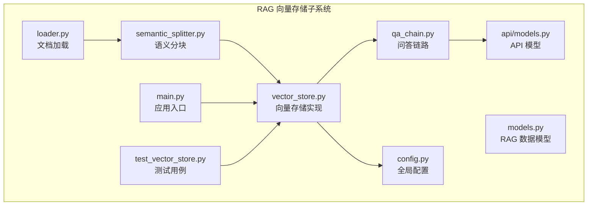
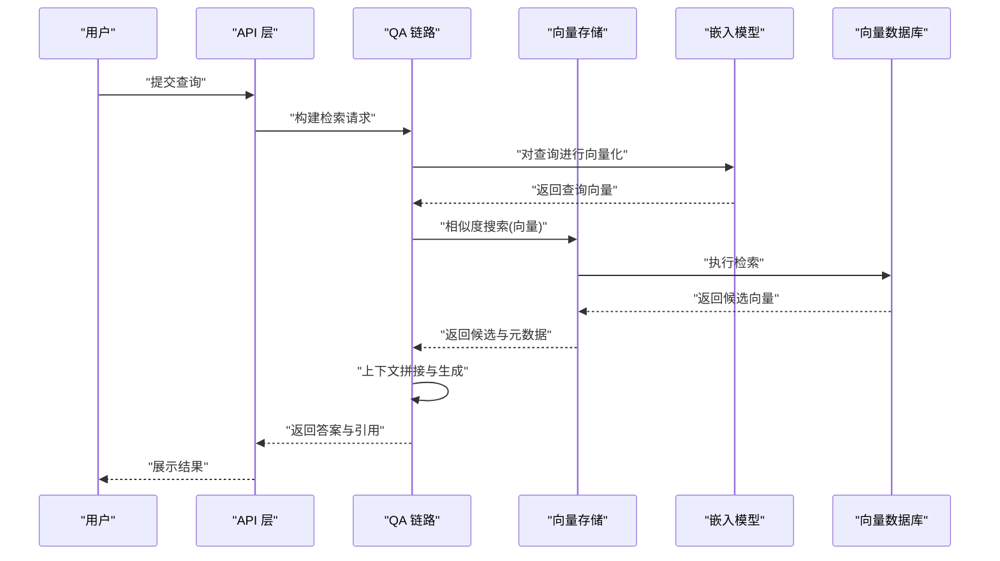
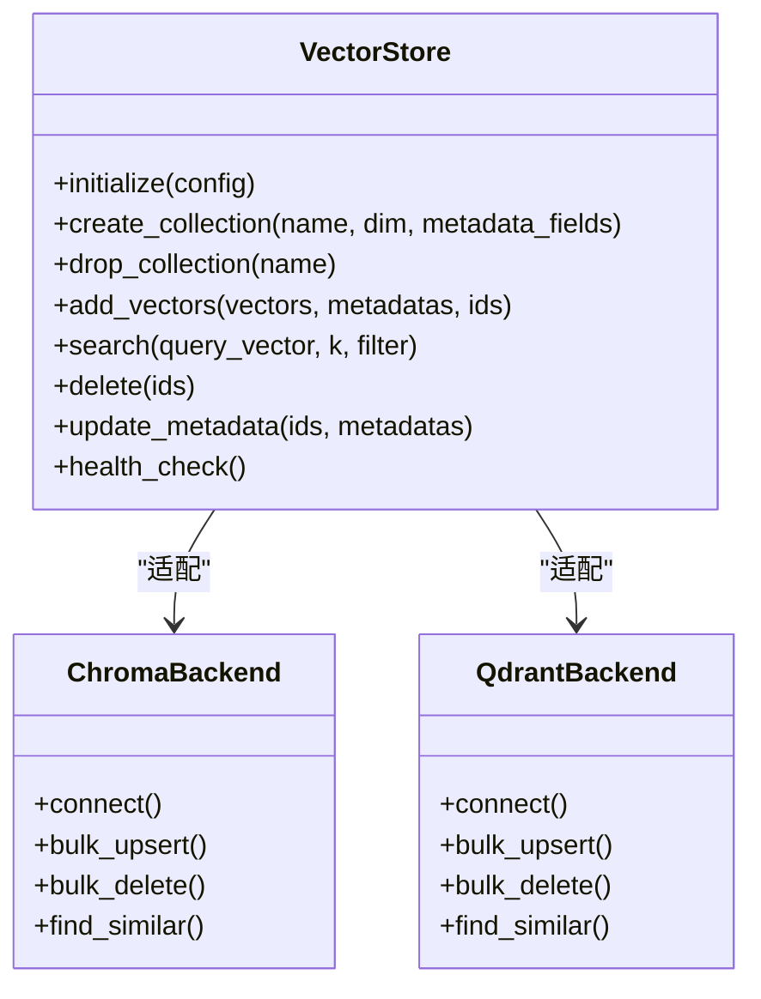
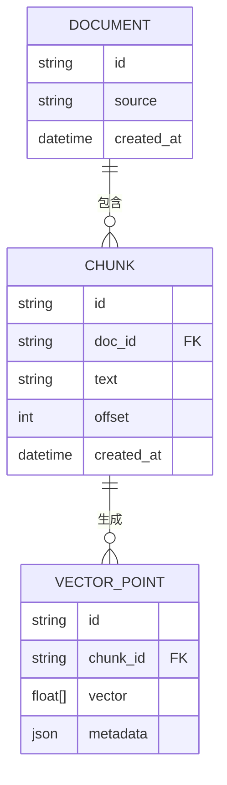
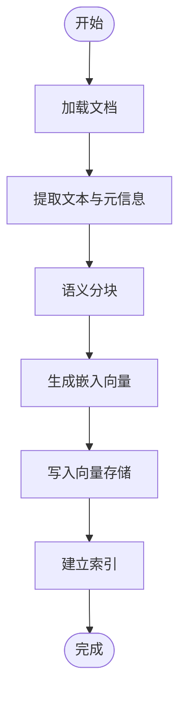
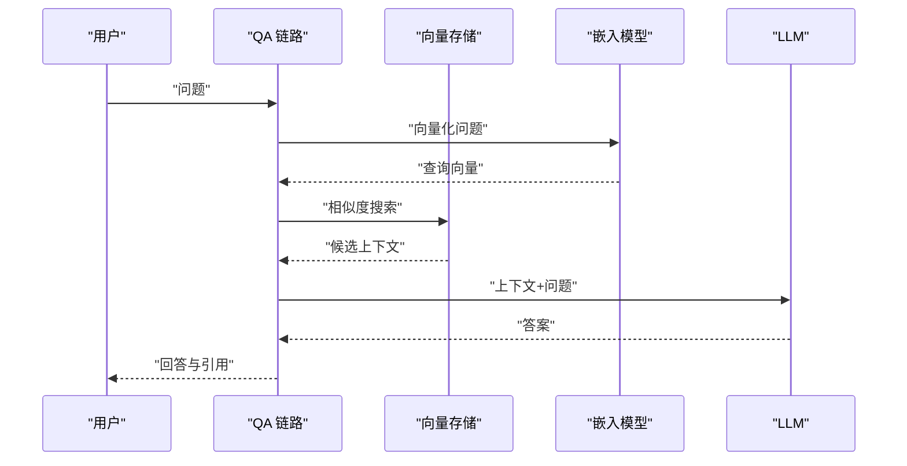
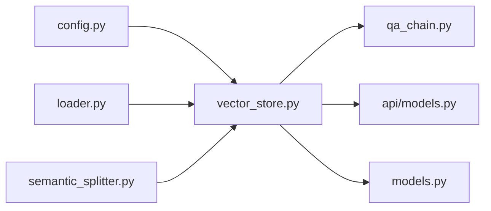

# 向量存储管理

<cite>
**本文档引用的文件**
- [backend/app/rag/vector_store.py](file://backend/app/rag/vector_store.py)
- [backend/app/rag/models.py](file://backend/app/rag/models.py)
- [backend/app/rag/loader.py](file://backend/app/rag/loader.py)
- [backend/app/rag/semantic_splitter.py](file://backend/app/rag/semantic_splitter.py)
- [backend/app/rag/qa_chain.py](file://backend/app/rag/qa_chain.py)
- [backend/app/api/models.py](file://backend/app/api/models.py)
- [backend/tests/test_vector_store.py](file://backend/tests/test_vector_store.py)
- [backend/app/config.py](file://backend/app/config.py)
- [backend/app/main.py](file://backend/app/main.py)
- [backend/data/articles/en/rag-system-guide.md](file://backend/data/articles/en/rag-system-guide.md)
- [backend/data/articles/en/embedding-models-guide.md](file://backend/data/articles/en/embedding-models-guide.md)
</cite>

## 目录
1. [简介](#简介)
2. [项目结构](#项目结构)
3. [核心组件](#核心组件)
4. [架构总览](#架构总览)
5. [详细组件分析](#详细组件分析)
6. [依赖关系分析](#依赖关系分析)
7. [性能考虑](#性能考虑)
8. [故障排除指南](#故障排除指南)
9. [结论](#结论)
10. [附录](#附录)

## 简介
本文件面向 RAG（检索增强生成）系统的向量存储管理模块，系统性梳理向量数据库选择与配置、嵌入模型使用、向量维度与索引优化、数据结构与元数据管理、批量插入与查询机制、相似度计算与距离度量、性能调优、备份恢复与扩容缩容、监控告警、向量预处理与压缩等主题。文档以代码库中的实际实现为依据，提供可操作的实践指导与可视化图示，帮助开发者快速理解并扩展向量存储能力。

## 项目结构
向量存储管理位于后端应用的 RAG 子系统中，核心文件包括：
- 向量存储实现：backend/app/rag/vector_store.py
- RAG 数据模型：backend/app/rag/models.py
- 文档加载与分块：backend/app/rag/loader.py、backend/app/rag/semantic_splitter.py
- QA 链路与检索流程：backend/app/rag/qa_chain.py
- API 模型定义：backend/app/api/models.py
- 测试用例：backend/tests/test_vector_store.py
- 全局配置：backend/app/config.py
- 应用入口：backend/app/main.py
- 示例文档：backend/data/articles/en/rag-system-guide.md、backend/data/articles/en/embedding-models-guide.md

**图表来源**
- [backend/app/rag/vector_store.py](file://backend/app/rag/vector_store.py)
- [backend/app/rag/models.py](file://backend/app/rag/models.py)
- [backend/app/rag/loader.py](file://backend/app/rag/loader.py)
- [backend/app/rag/semantic_splitter.py](file://backend/app/rag/semantic_splitter.py)
- [backend/app/rag/qa_chain.py](file://backend/app/rag/qa_chain.py)
- [backend/app/api/models.py](file://backend/app/api/models.py)
- [backend/app/config.py](file://backend/app/config.py)
- [backend/app/main.py](file://backend/app/main.py)
- [backend/tests/test_vector_store.py](file://backend/tests/test_vector_store.py)

**章节来源**
- [backend/app/rag/vector_store.py](file://backend/app/rag/vector_store.py)
- [backend/app/rag/models.py](file://backend/app/rag/models.py)
- [backend/app/rag/loader.py](file://backend/app/rag/loader.py)
- [backend/app/rag/semantic_splitter.py](file://backend/app/rag/semantic_splitter.py)
- [backend/app/rag/qa_chain.py](file://backend/app/rag/qa_chain.py)
- [backend/app/api/models.py](file://backend/app/api/models.py)
- [backend/tests/test_vector_store.py](file://backend/tests/test_vector_store.py)
- [backend/app/config.py](file://backend/app/config.py)
- [backend/app/main.py](file://backend/app/main.py)

## 核心组件
- 向量存储实现：负责向量数据库的初始化、集合管理、批量插入、查询与相似度搜索、元数据过滤、删除与更新等。
- RAG 数据模型：定义文档、向量点、查询结果等数据结构，支撑向量检索与后续 QA 处理。
- 文档加载与分块：从多种格式加载文档，使用语义分块策略生成可向量化的小块文本。
- QA 链路：整合检索到的上下文与用户问题，驱动 LLM 生成答案。
- API 模型：对外暴露检索接口的请求/响应结构，确保前后端交互一致。
- 测试用例：验证向量存储的增删改查、相似度检索、批量操作等关键路径。

**章节来源**
- [backend/app/rag/vector_store.py](file://backend/app/rag/vector_store.py)
- [backend/app/rag/models.py](file://backend/app/rag/models.py)
- [backend/app/rag/loader.py](file://backend/app/rag/loader.py)
- [backend/app/rag/semantic_splitter.py](file://backend/app/rag/semantic_splitter.py)
- [backend/app/rag/qa_chain.py](file://backend/app/rag/qa_chain.py)
- [backend/app/api/models.py](file://backend/app/api/models.py)
- [backend/tests/test_vector_store.py](file://backend/tests/test_vector_store.py)

## 架构总览
下图展示了从文档加载到向量检索再到问答输出的完整流程，以及向量存储在其中的关键位置。

**图表来源**
- [backend/app/rag/qa_chain.py](file://backend/app/rag/qa_chain.py)
- [backend/app/rag/vector_store.py](file://backend/app/rag/vector_store.py)
- [backend/app/api/models.py](file://backend/app/api/models.py)

## 详细组件分析

### 向量存储实现（vector_store.py）
- 功能职责
  - 初始化与连接：根据配置选择向量数据库后端，建立连接与命名空间管理。
  - 集合管理：创建/删除集合、设置向量维度、索引参数与元数据字段。
  - 批量操作：批量插入向量与元数据，批量删除与更新。
  - 查询与检索：基于向量相似度搜索，支持元数据过滤与 Top-K 返回。
  - 元数据管理：维护文档 ID、来源、分块信息、时间戳等键值对。
  - 健康检查：提供可用性检测与统计信息。
- 关键设计模式
  - 抽象工厂/适配器：通过统一接口适配不同后端（如 ChromaDB、Qdrant），便于替换与扩展。
  - 批量优先：批量插入与查询提升吞吐，降低网络往返开销。
  - 元数据索引：对常用过滤字段建立索引，加速检索。
- 性能要点
  - 向量维度与索引参数：根据嵌入模型输出维度与数据规模调整索引类型与参数。
  - 距离度量：余弦相似度常用于归一化后的向量；内积适合特定场景。
  - 分页与 Top-K：限制返回数量，避免超大数据集扫描。
- 错误处理
  - 连接失败、索引异常、批量写入部分失败等均需捕获并重试或回滚。

**图表来源**
- [backend/app/rag/vector_store.py](file://backend/app/rag/vector_store.py)

**章节来源**
- [backend/app/rag/vector_store.py](file://backend/app/rag/vector_store.py)

### RAG 数据模型（models.py）
- 文档与分块模型：描述原始文档、分块单元、嵌入向量与元数据之间的关系。
- 查询与结果模型：封装查询文本、向量、相似度分数、引用信息等。
- 元数据结构：标准化字段名与类型，确保跨后端一致性。
- 与向量存储的耦合：模型定义直接影响插入与查询时的数据形态。

**图表来源**
- [backend/app/rag/models.py](file://backend/app/rag/models.py)

**章节来源**
- [backend/app/rag/models.py](file://backend/app/rag/models.py)

### 文档加载与语义分块（loader.py、semantic_splitter.py）
- 加载器：支持多种文档格式，提取纯文本与元信息。
- 语义分块：按语义边界切分长文档，保持语义完整性，减少噪声。
- 与向量存储的衔接：分块结果直接进入向量存储，形成“文档→分块→向量”的流水线。

**图表来源**
- [backend/app/rag/loader.py](file://backend/app/rag/loader.py)
- [backend/app/rag/semantic_splitter.py](file://backend/app/rag/semantic_splitter.py)

**章节来源**
- [backend/app/rag/loader.py](file://backend/app/rag/loader.py)
- [backend/app/rag/semantic_splitter.py](file://backend/app/rag/semantic_splitter.py)

### QA 链路与检索（qa_chain.py）
- 检索阶段：对用户问题进行向量化，调用向量存储执行相似度搜索，获取上下文。
- 上下文拼接：将检索到的分块与元数据组织为提示模板输入。
- 生成阶段：调用 LLM 生成最终回答。
- 可观测性：记录检索耗时、召回数量、相似度阈值等指标。

**图表来源**
- [backend/app/rag/qa_chain.py](file://backend/app/rag/qa_chain.py)
- [backend/app/rag/vector_store.py](file://backend/app/rag/vector_store.py)

**章节来源**
- [backend/app/rag/qa_chain.py](file://backend/app/rag/qa_chain.py)

### API 模型（api/models.py）
- 定义检索接口的请求/响应结构，确保前后端契约清晰。
- 支持过滤参数、Top-K、相似度阈值等检索控制选项。
- 与向量存储查询参数映射，保证业务层与存储层的一致性。

**章节来源**
- [backend/app/api/models.py](file://backend/app/api/models.py)

## 依赖关系分析
- 组件耦合
  - 向量存储与嵌入模型：通过向量维度与距离度量强关联。
  - 向量存储与 QA 链路：QA 依赖向量存储的检索能力。
  - 向量存储与配置：索引参数、连接参数来自全局配置。
- 外部依赖
  - 向量数据库后端：ChromaDB、Qdrant 等，通过统一接口适配。
  - 嵌入模型服务：本地或远程 API，输出固定维度向量。
- 循环依赖
  - 当前结构未见循环依赖，各模块职责清晰。

**图表来源**
- [backend/app/config.py](file://backend/app/config.py)
- [backend/app/rag/vector_store.py](file://backend/app/rag/vector_store.py)
- [backend/app/rag/qa_chain.py](file://backend/app/rag/qa_chain.py)
- [backend/app/api/models.py](file://backend/app/api/models.py)
- [backend/app/rag/loader.py](file://backend/app/rag/loader.py)
- [backend/app/rag/semantic_splitter.py](file://backend/app/rag/semantic_splitter.py)
- [backend/app/rag/models.py](file://backend/app/rag/models.py)

**章节来源**
- [backend/app/config.py](file://backend/app/config.py)
- [backend/app/rag/vector_store.py](file://backend/app/rag/vector_store.py)
- [backend/app/rag/qa_chain.py](file://backend/app/rag/qa_chain.py)
- [backend/app/api/models.py](file://backend/app/api/models.py)
- [backend/app/rag/loader.py](file://backend/app/rag/loader.py)
- [backend/app/rag/semantic_splitter.py](file://backend/app/rag/semantic_splitter.py)
- [backend/app/rag/models.py](file://backend/app/rag/models.py)

## 性能考虑
- 向量维度与索引
  - 维度选择：与嵌入模型输出一致，避免动态转换带来的额外开销。
  - 索引类型：根据数据规模与查询延迟目标选择合适索引（如 HNSW、IVF 等）。
- 距离度量
  - 余弦相似度：适用于归一化向量，对方向敏感。
  - 内积：在某些预处理场景下更高效。
- 批量策略
  - 批大小：平衡内存占用与吞吐，避免单批过大导致超时。
  - 分批重试：对部分失败的批次进行重试与日志记录。
- 缓存与预热
  - 热门查询结果缓存，降低重复检索成本。
- 监控指标
  - 检索延迟、召回率、Top-K 数量、索引命中率等。

[本节为通用性能建议，不直接分析具体文件]

## 故障排除指南
- 连接与初始化
  - 检查向量数据库地址、认证信息与网络连通性。
  - 确认集合存在且维度匹配，索引参数合法。
- 批量写入失败
  - 查看批次大小与单条向量尺寸是否超过后端限制。
  - 对失败批次进行重试与错误日志分析。
- 查询无结果或结果质量差
  - 调整 Top-K 与相似度阈值。
  - 检查分块粒度与嵌入质量。
- 测试验证
  - 使用测试用例覆盖常见路径：插入、查询、过滤、删除与更新。

**章节来源**
- [backend/tests/test_vector_store.py](file://backend/tests/test_vector_store.py)

## 结论
本向量存储管理模块通过抽象统一接口适配多后端，结合文档加载、语义分块与 QA 链路，形成了完整的 RAG 检索流水线。开发者可在不改变上层调用的前提下，灵活切换与优化向量数据库后端，同时通过批量操作、索引优化与监控告警保障系统稳定与高性能。

## 附录

### 向量数据库选择与配置
- ChromaDB
  - 特点：轻量、易于部署、支持元数据过滤与近似最近邻检索。
  - 适用：开发测试、小规模生产环境。
- Qdrant
  - 特点：企业级特性、高可用、分布式、丰富的过滤与聚合能力。
  - 适用：大规模生产环境、复杂过滤需求。
- 配置要点
  - 连接参数：主机、端口、认证、TLS。
  - 索引参数：向量维度、索引类型、窗口大小、并发度。
  - 元数据字段：文档 ID、来源、分块偏移、时间戳等。

**章节来源**
- [backend/app/rag/vector_store.py](file://backend/app/rag/vector_store.py)
- [backend/app/config.py](file://backend/app/config.py)

### 向量嵌入模型与维度管理
- 嵌入模型
  - 选择与版本：确保模型输出维度与向量存储一致。
  - 服务化：本地服务或远程 API，统一输出格式。
- 维度管理
  - 插入前校验：避免维度不匹配导致的异常。
  - 索引参数：根据维度选择合适的索引与距离度量。

**章节来源**
- [backend/app/rag/vector_store.py](file://backend/app/rag/vector_store.py)
- [backend/data/articles/en/embedding-models-guide.md](file://backend/data/articles/en/embedding-models-guide.md)

### 索引优化策略
- 索引类型与参数
  - HNSW：适合高维稀疏向量，支持动态图。
  - IVF/PQ：适合大规模密集向量，支持压缩。
- 元数据过滤
  - 对常用过滤字段建立索引，减少全表扫描。
- 分片与副本
  - 水平分片提升吞吐，副本提升可用性。

**章节来源**
- [backend/app/rag/vector_store.py](file://backend/app/rag/vector_store.py)

### 数据结构与元数据管理
- 数据模型
  - 文档、分块、向量点三者关系明确，元数据键值对标准化。
- 元数据字段
  - 文档 ID、来源、分块偏移、时间戳等，支撑去重与溯源。

**章节来源**
- [backend/app/rag/models.py](file://backend/app/rag/models.py)

### 批量插入与查询机制
- 批量插入
  - 分批处理、错误隔离、重试与回滚。
- 批量查询
  - 并行查询多个向量，合并结果并排序。
- 过滤与排序
  - 元数据过滤 + 相似度排序，控制 Top-K。

**章节来源**
- [backend/app/rag/vector_store.py](file://backend/app/rag/vector_store.py)

### 相似度计算与距离度量
- 余弦相似度：方向相关，适合归一化向量。
- 内积：在某些预处理场景下更高效。
- 距离阈值：根据业务召回要求设定，避免噪声。

**章节来源**
- [backend/app/rag/vector_store.py](file://backend/app/rag/vector_store.py)

### 备份恢复、扩容缩容与监控告警
- 备份恢复
  - 定期导出集合快照，验证导入流程。
- 扩容缩容
  - 增加节点与分片，重新分配负载；缩容时迁移数据并重建索引。
- 监控告警
  - 检索延迟、索引大小、写入速率、错误率等指标告警。

**章节来源**
- [backend/app/rag/vector_store.py](file://backend/app/rag/vector_store.py)

### 向量预处理、归一化与压缩
- 预处理
  - 归一化、单位化、PCA 降维等。
- 压缩
  - PQ、IVF、LSH 等，权衡精度与性能。
- 评估
  - 通过基准测试与召回率评估效果。

**章节来源**
- [backend/data/articles/en/embedding-models-guide.md](file://backend/data/articles/en/embedding-models-guide.md)

### 自定义向量存储后端与性能优化
- 自定义后端
  - 实现统一接口，适配新后端；保持与现有模型与查询参数兼容。
- 性能优化
  - 批量优先、索引优化、缓存与预热、监控与调参。

**章节来源**
- [backend/app/rag/vector_store.py](file://backend/app/rag/vector_store.py)