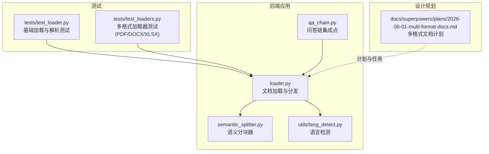
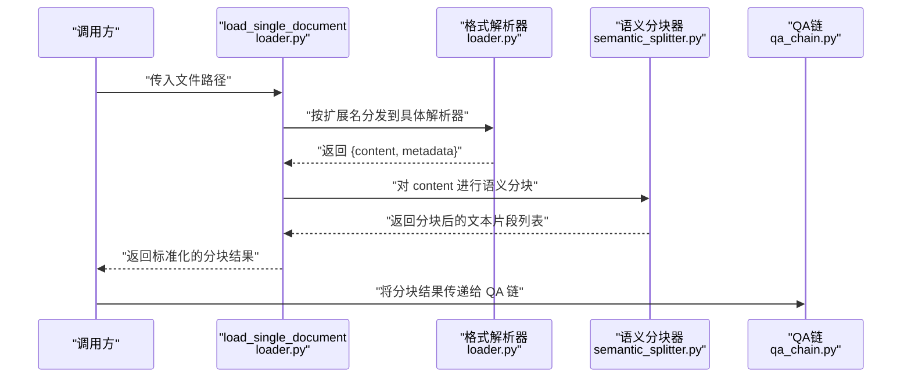
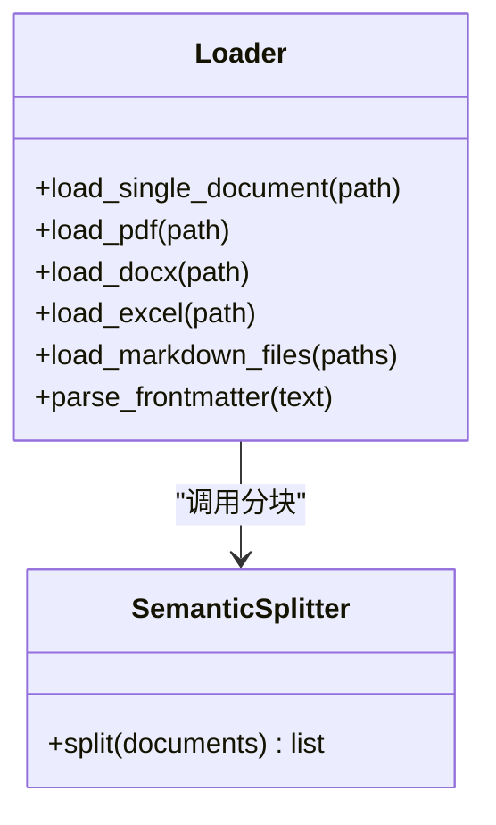
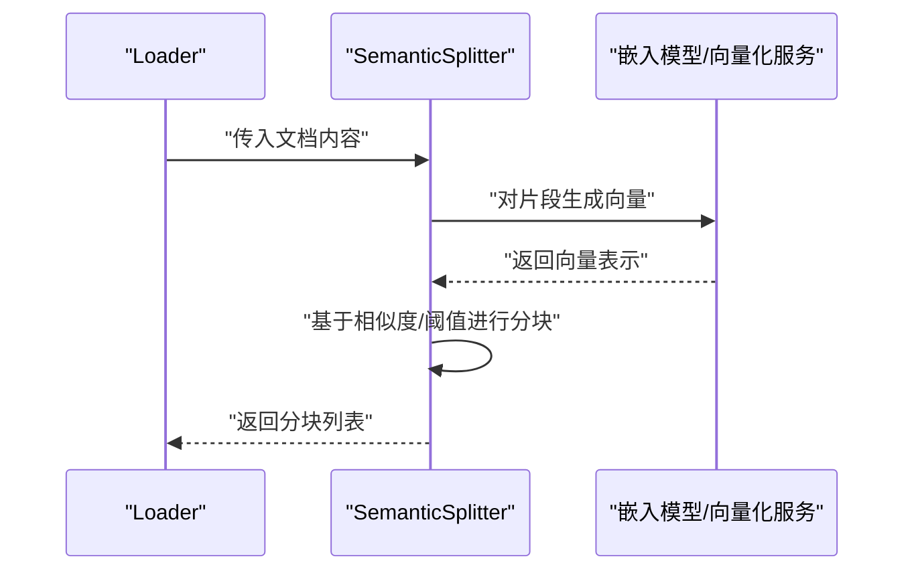
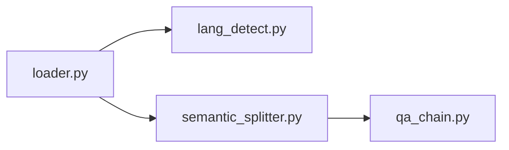

# 文档加载与预处理

<cite>
**本文引用的文件**
- [backend/app/rag/loader.py](file://backend/app/rag/loader.py)
- [backend/app/rag/semantic_splitter.py](file://backend/app/rag/semantic_splitter.py)
- [backend/tests/test_loader.py](file://backend/tests/test_loader.py)
- [backend/tests/test_loaders.py](file://backend/tests/test_loaders.py)
- [backend/app/rag/qa_chain.py](file://backend/app/rag/qa_chain.py)
- [backend/app/utils/lang_detect.py](file://backend/app/utils/lang_detect.py)
- [docs/superpowers/plans/2026-06-01-multi-format-docs.md](file://docs/superpowers/plans/2026-06-01-multi-format-docs.md)
</cite>

## 目录
1. [简介](#简介)
2. [项目结构](#项目结构)
3. [核心组件](#核心组件)
4. [架构总览](#架构总览)
5. [详细组件分析](#详细组件分析)
6. [依赖关系分析](#依赖关系分析)
7. [性能考量](#性能考量)
8. [故障排查指南](#故障排查指南)
9. [结论](#结论)
10. [附录](#附录)

## 简介
本章节面向 RAG 检索引擎的“文档加载与预处理”模块，目标是为开发者提供从多格式文档到可向量化语料的完整技术文档。内容覆盖：
- 支持的文档格式与解析器实现（PDF、DOCX、XLSX、Markdown 等）
- 文档分块策略与语义分割器工作原理
- 元数据提取、文本清洗与标准化流程
- 去重、噪声过滤与质量评估机制
- 批量文档处理、并发加载与内存管理策略
- 编码转换、字符集处理与特殊符号清理
- 扩展新格式支持与优化加载性能的实践指南

## 项目结构
RAG 预处理相关代码集中在后端应用的 rag 子模块中，配合测试用例验证功能与边界行为；语言检测工具用于元数据中的语言字段填充。

**图表来源**
- [backend/app/rag/loader.py](file://backend/app/rag/loader.py)
- [backend/app/rag/semantic_splitter.py](file://backend/app/rag/semantic_splitter.py)
- [backend/app/rag/qa_chain.py](file://backend/app/rag/qa_chain.py)
- [backend/app/utils/lang_detect.py](file://backend/app/utils/lang_detect.py)
- [backend/tests/test_loader.py](file://backend/tests/test_loader.py)
- [backend/tests/test_loaders.py](file://backend/tests/test_loaders.py)
- [docs/superpowers/plans/2026-06-01-multi-format-docs.md](file://docs/superpowers/plans/2026-06-01-multi-format-docs.md)

**章节来源**
- [backend/app/rag/loader.py](file://backend/app/rag/loader.py)
- [backend/app/rag/semantic_splitter.py](file://backend/app/rag/semantic_splitter.py)
- [backend/tests/test_loader.py](file://backend/tests/test_loader.py)
- [backend/tests/test_loaders.py](file://backend/tests/test_loaders.py)
- [backend/app/rag/qa_chain.py](file://backend/app/rag/qa_chain.py)
- [backend/app/utils/lang_detect.py](file://backend/app/utils/lang_detect.py)
- [docs/superpowers/plans/2026-06-01-multi-format-docs.md](file://docs/superpowers/plans/2026-06-01-multi-format-docs.md)

## 核心组件
- 文档加载器与分发器：负责根据文件扩展名选择具体解析器，统一输出包含 content 与 metadata 的结构化结果。
- 语义分块器：基于语义相似度进行分块，提升检索质量。
- 语言检测：为文档元数据补充语言信息，便于后续处理与路由。
- 测试套件：覆盖单文档加载、多格式加载、错误处理等关键场景。

**章节来源**
- [backend/app/rag/loader.py](file://backend/app/rag/loader.py)
- [backend/app/rag/semantic_splitter.py](file://backend/app/rag/semantic_splitter.py)
- [backend/app/utils/lang_detect.py](file://backend/app/utils/lang_detect.py)
- [backend/tests/test_loader.py](file://backend/tests/test_loader.py)
- [backend/tests/test_loaders.py](file://backend/tests/test_loaders.py)

## 架构总览
下图展示从“单文档加载”到“语义分块”的典型调用链路，以及与 QA 链接集成的位置。

**图表来源**
- [backend/app/rag/loader.py](file://backend/app/rag/loader.py)
- [backend/app/rag/semantic_splitter.py](file://backend/app/rag/semantic_splitter.py)
- [backend/app/rag/qa_chain.py](file://backend/app/rag/qa_chain.py)

## 详细组件分析

### 组件一：文档加载与分发（loader.py）
职责与能力
- 单文档加载：根据文件扩展名选择对应解析器，统一输出结构化结果（content、metadata）。
- 多格式支持：当前测试覆盖 PDF、DOCX、XLSX；Markdown 加载函数存在但需确认实现细节。
- 元数据字段：至少包含 source、file_type、language、uploaded 等（以测试断言为准）。
- 错误处理：对不支持的扩展名抛出异常，确保上层明确失败原因。

实现要点
- 解析器分发逻辑：依据扩展名映射到具体解析函数。
- 输出规范：统一返回字典，包含 content 与 metadata 字段。
- 语言字段：通过语言检测模块填充 language 字段。
- Markdown 文件：提供专用加载函数，便于批量导入。

复杂度与性能
- 分发与解析均为 O(n) 级别（n 为文档长度或单元数），I/O 为主要瓶颈。
- 建议在批量处理时采用并发策略，避免阻塞。

错误处理与边界
- 不支持的扩展名：抛出异常，测试用例覆盖该场景。
- 空内容或解析失败：应保证 metadata 完整性，便于后续质量评估。

**章节来源**
- [backend/app/rag/loader.py](file://backend/app/rag/loader.py)
- [backend/tests/test_loader.py](file://backend/tests/test_loader.py)
- [backend/tests/test_loaders.py](file://backend/tests/test_loaders.py)

#### 类图：加载器与解析器关系（概念示意）

（概念图，仅用于理解模块关系）

### 组件二：语义分块器（semantic_splitter.py）
职责与能力
- 基于语义相似度进行分块，提升检索召回质量。
- 输入为已解析的文档内容，输出为分块后的文本片段列表。
- 可与嵌入模型配合，计算相似度阈值或聚类分块。

实现要点
- 语义表示：通常使用嵌入向量表征文本语义。
- 分块策略：可采用滑动窗口、密度聚类或基于相似度阈值的方法。
- 与加载器协作：在加载器完成解析后调用，形成“加载→分块”的流水线。

复杂度与性能
- 向量化与相似度计算为 O(k·m)（k 为片段数，m 为维度），建议批量化与缓存中间结果。
- 对超长文档，可先做粗分块再细粒度分块，降低计算压力。

**章节来源**
- [backend/app/rag/semantic_splitter.py](file://backend/app/rag/semantic_splitter.py)

#### 序列图：语义分块调用流程

（概念图，仅用于理解调用顺序）

### 组件三：语言检测（lang_detect.py）
职责与能力
- 为文档元数据补充 language 字段，便于后续路由与处理。
- 可结合文档内容与扩展名进行综合判断。

实现要点
- 与加载器协同：在解析完成后调用，确保 content 已就绪。
- 结果写入 metadata：供上层模块读取与使用。

**章节来源**
- [backend/app/utils/lang_detect.py](file://backend/app/utils/lang_detect.py)

### 组件四：测试与验证（test_loader.py、test_loaders.py）
职责与能力
- 验证单文档加载与多格式加载的行为一致性。
- 覆盖错误场景（不支持的扩展名）与边界条件（空内容、多段落等）。

关键测试点
- PDF：提取文本、设置 source 与 file_type。
- DOCX：提取段落文本、语言识别。
- XLSX：表格转文本、字段存在性校验。
- 单文档分发：根据扩展名正确路由到对应解析器。
- 不支持扩展名：抛出异常。

**章节来源**
- [backend/tests/test_loader.py](file://backend/tests/test_loader.py)
- [backend/tests/test_loaders.py](file://backend/tests/test_loaders.py)

## 依赖关系分析
- 加载器依赖语言检测模块以完善元数据。
- 语义分块器独立于具体格式，依赖加载器提供的文本内容。
- QA 链在下游消费分块结果，形成“加载→分块→检索→生成”的闭环。

**图表来源**
- [backend/app/rag/loader.py](file://backend/app/rag/loader.py)
- [backend/app/utils/lang_detect.py](file://backend/app/utils/lang_detect.py)
- [backend/app/rag/semantic_splitter.py](file://backend/app/rag/semantic_splitter.py)
- [backend/app/rag/qa_chain.py](file://backend/app/rag/qa_chain.py)

**章节来源**
- [backend/app/rag/loader.py](file://backend/app/rag/loader.py)
- [backend/app/utils/lang_detect.py](file://backend/app/utils/lang_detect.py)
- [backend/app/rag/semantic_splitter.py](file://backend/app/rag/semantic_splitter.py)
- [backend/app/rag/qa_chain.py](file://backend/app/rag/qa_chain.py)

## 性能考量
- 并发加载：对多个文件采用异步/并发策略，减少 I/O 等待时间。
- 内存管理：大文件分块读取，避免一次性加载至内存；分块后及时释放中间变量。
- 批量处理：将小文档合并为批次，减少启动开销；对超长文档先粗分块再细粒度处理。
- 缓存策略：对重复内容与向量结果进行缓存，降低重复计算成本。
- I/O 优化：优先使用流式解析器，减少磁盘与网络 I/O 压力。

（本节为通用指导，无需特定文件引用）

## 故障排查指南
常见问题与定位方法
- 不支持的扩展名：检查扩展名是否在分发逻辑中注册；查看测试用例中的异常断言。
- 解析失败或空内容：确认解析器可用性与依赖安装；检查文件权限与编码。
- 语言字段缺失：确认语言检测模块调用时机与输入文本有效性。
- 分块结果异常：核对语义分块参数与阈值；检查嵌入模型可用性与版本兼容性。

定位参考
- 单文档加载与 frontmatter 解析：参考测试用例断言与加载器实现。
- 多格式加载（PDF/DOCX/XLSX）：参考多格式测试用例与加载器分发逻辑。
- QA 链集成：确认分块结果结构满足下游期望。

**章节来源**
- [backend/tests/test_loader.py](file://backend/tests/test_loader.py)
- [backend/tests/test_loaders.py](file://backend/tests/test_loaders.py)
- [backend/app/rag/loader.py](file://backend/app/rag/loader.py)

## 结论
“文档加载与预处理”模块通过统一的加载接口与格式分发，实现了对多格式文档的标准化输出，并与语义分块器、语言检测与 QA 链形成清晰的流水线。测试用例覆盖了关键场景与错误处理，为后续扩展与优化提供了可靠保障。建议在生产环境中结合并发与缓存策略，持续优化吞吐与延迟表现。

## 附录

### 支持的文档格式与解析器实现
- PDF：通过测试用例验证文本提取与元数据设置。
- DOCX：段落提取与语言识别。
- XLSX：表格转文本与字段存在性校验。
- Markdown：提供专用加载函数，便于批量导入。

**章节来源**
- [backend/tests/test_loaders.py](file://backend/tests/test_loaders.py)
- [backend/app/rag/loader.py](file://backend/app/rag/loader.py)

### 文档分块策略与语义分割器
- 分块目标：提升检索召回质量，减少无关上下文干扰。
- 实现方式：基于语义相似度或嵌入向量的聚类/阈值分块。
- 与加载器协作：在解析完成后进行，形成稳定的预处理管线。

**章节来源**
- [backend/app/rag/semantic_splitter.py](file://backend/app/rag/semantic_splitter.py)
- [backend/app/rag/loader.py](file://backend/app/rag/loader.py)

### 元数据提取、文本清洗与标准化
- 元数据字段：source、file_type、language、uploaded 等（以测试断言为准）。
- 清洗与标准化：去除多余空白、统一换行符、保留关键结构（如表格列标题）。
- 语言检测：在解析完成后注入 language 字段。

**章节来源**
- [backend/tests/test_loader.py](file://backend/tests/test_loader.py)
- [backend/app/utils/lang_detect.py](file://backend/app/utils/lang_detect.py)

### 去重、噪声过滤与质量评估
- 去重：基于内容指纹或哈希，剔除完全重复的分块。
- 噪声过滤：移除极短片段、无意义符号串、纯数字或纯标点。
- 质量评估：基于长度、关键词覆盖率、语言一致性等指标打分。

（本节为通用指导，无需特定文件引用）

### 批量文档处理、并发加载与内存管理
- 并发策略：对多个文件采用异步/线程池/进程池，控制并发度上限。
- 内存管理：流式读取、分块处理、及时释放中间变量。
- 批处理：合并小文档，减少启动与调度开销。

（本节为通用指导，无需特定文件引用）

### 编码转换、字符集处理与特殊符号清理
- 编码转换：优先使用 UTF-8；对非 UTF-8 文件尝试探测并转换。
- 字符集处理：统一规范化空白字符与换行符。
- 特殊符号清理：移除不可见字符、冗余制表符与异常序列。

（本节为通用指导，无需特定文件引用）

### 扩展新文档格式支持与性能优化实践
- 新格式接入步骤：新增解析器函数、在分发逻辑中注册、编写测试用例。
- 性能优化：缓存嵌入结果、批量化处理、I/O 优化与并发控制。
- 设计规划参考：多格式文档计划明确了任务分解与测试先行的开发节奏。

**章节来源**
- [docs/superpowers/plans/2026-06-01-multi-format-docs.md](file://docs/superpowers/plans/2026-06-01-multi-format-docs.md)