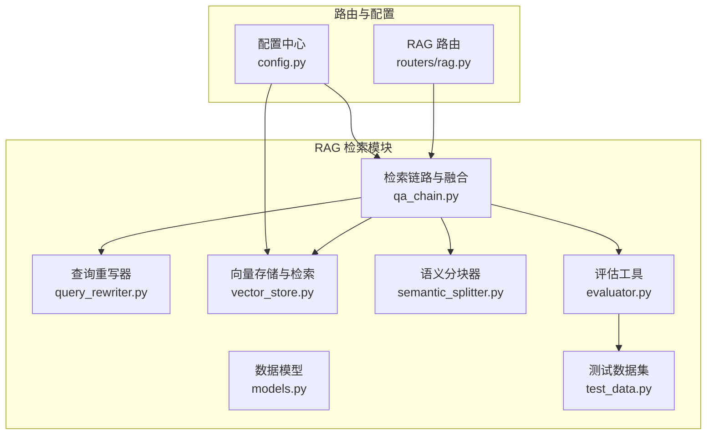
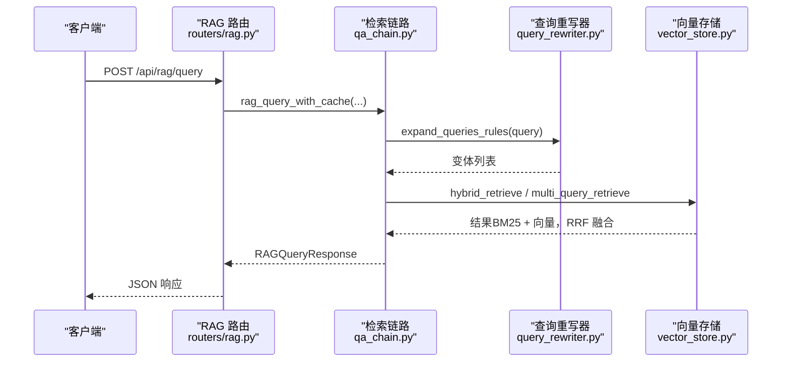
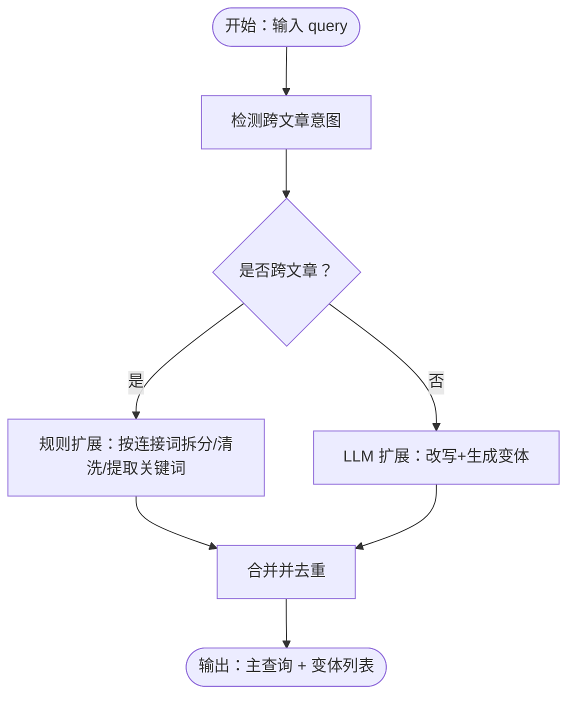
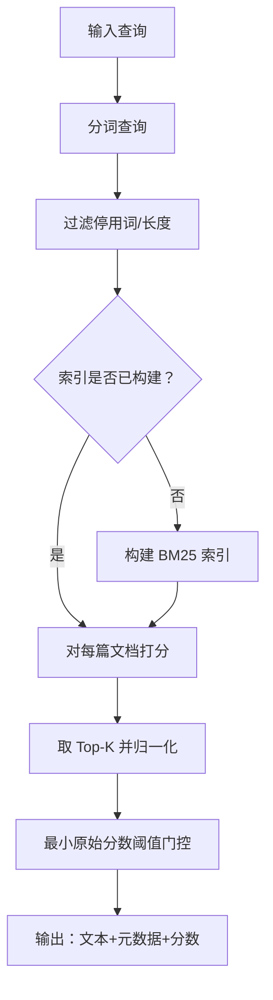
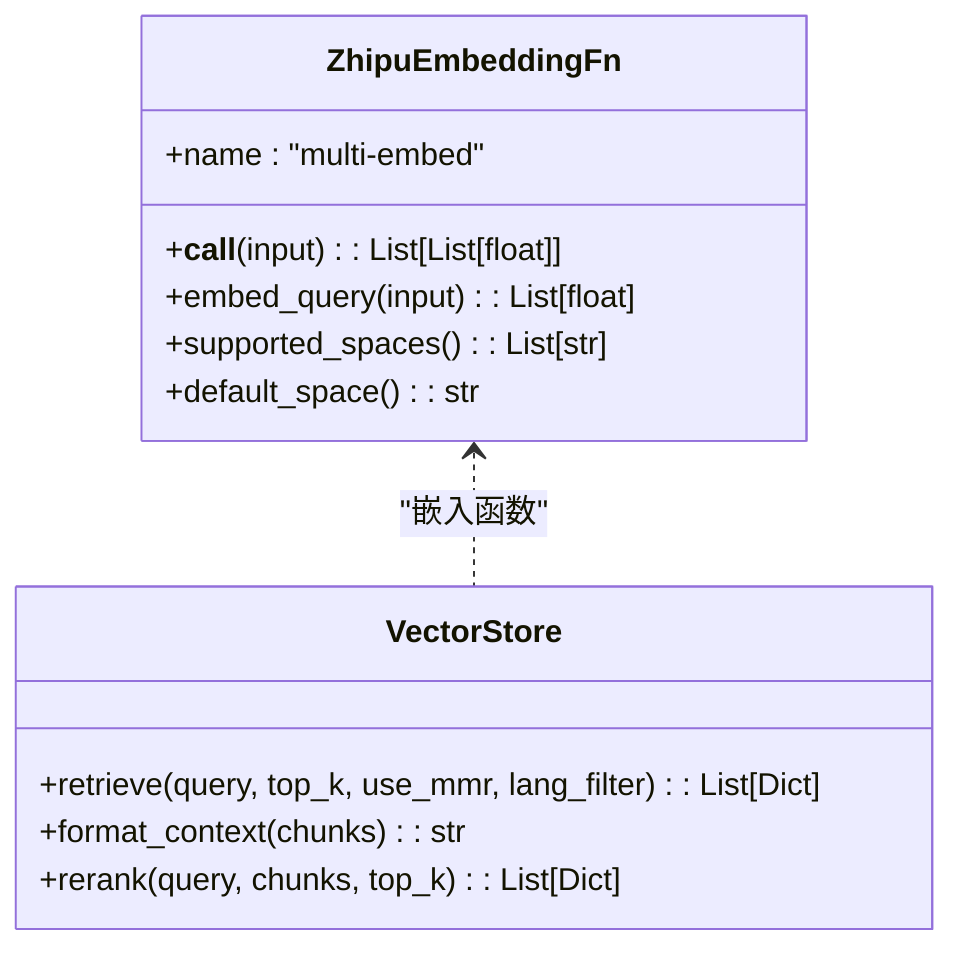
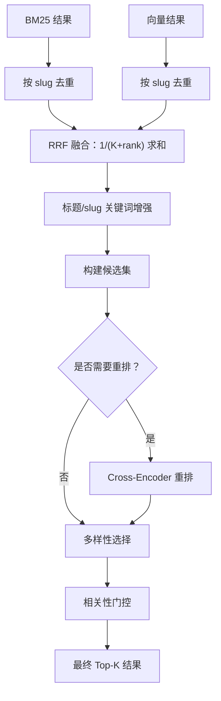
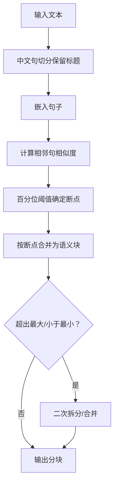
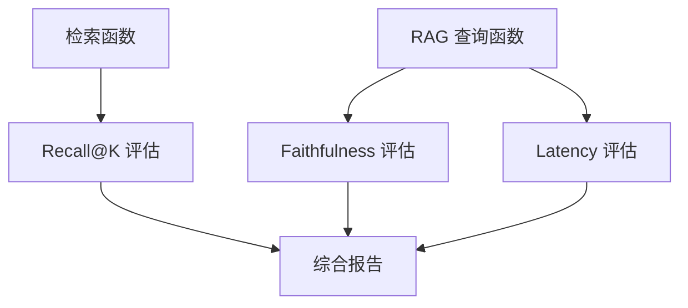
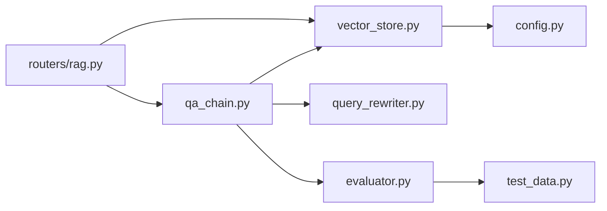

# 混合检索算法

<cite>
**本文档引用的文件**
- [backend/app/rag/query_rewriter.py](file://backend/app/rag/query_rewriter.py)
- [backend/app/rag/vector_store.py](file://backend/app/rag/vector_store.py)
- [backend/app/rag/qa_chain.py](file://backend/app/rag/qa_chain.py)
- [backend/app/rag/models.py](file://backend/app/rag/models.py)
- [backend/app/rag/semantic_splitter.py](file://backend/app/rag/semantic_splitter.py)
- [backend/app/routers/rag.py](file://backend/app/routers/rag.py)
- [backend/app/rag/evaluator.py](file://backend/app/rag/evaluator.py)
- [backend/app/rag/test_data.py](file://backend/app/rag/test_data.py)
- [backend/app/config.py](file://backend/app/config.py)
</cite>

## 目录
1. [简介](#简介)
2. [项目结构](#项目结构)
3. [核心组件](#核心组件)
4. [架构总览](#架构总览)
5. [详细组件分析](#详细组件分析)
6. [依赖分析](#依赖分析)
7. [性能考量](#性能考量)
8. [故障排查指南](#故障排查指南)
9. [结论](#结论)
10. [附录](#附录)

## 简介
本文件面向开发者与技术负责人，系统性阐述本 RAG 检索引擎的混合检索算法与实现。重点覆盖：
- BM25 关键词检索与语义向量检索的融合机制与权重分配策略
- 查询重写器的工作原理（查询扩展、同义词替换、语义改写）
- 检索结果的合并策略、评分融合算法与相关性排序机制
- 不同检索策略的性能对比、参数调优与效果评估方法
- 多模态检索、跨语言检索与领域适应性优化建议
- 自定义检索算法与优化检索效果的专业指导

## 项目结构
后端采用模块化设计，RAG 检索相关逻辑集中在 backend/app/rag 目录，对外通过 FastAPI 路由暴露查询接口。

**图表来源**
- [backend/app/routers/rag.py:1-566](file://backend/app/routers/rag.py#L1-L566)
- [backend/app/rag/qa_chain.py:1-1072](file://backend/app/rag/qa_chain.py#L1-L1072)
- [backend/app/rag/vector_store.py:1-1118](file://backend/app/rag/vector_store.py#L1-L1118)
- [backend/app/rag/query_rewriter.py:1-145](file://backend/app/rag/query_rewriter.py#L1-L145)
- [backend/app/rag/semantic_splitter.py:1-220](file://backend/app/rag/semantic_splitter.py#L1-L220)
- [backend/app/rag/evaluator.py:1-192](file://backend/app/rag/evaluator.py#L1-L192)
- [backend/app/rag/test_data.py:1-919](file://backend/app/rag/test_data.py#L1-L919)
- [backend/app/rag/models.py:1-56](file://backend/app/rag/models.py#L1-L56)
- [backend/app/config.py:1-90](file://backend/app/config.py#L1-L90)

**章节来源**
- [backend/app/routers/rag.py:1-566](file://backend/app/routers/rag.py#L1-L566)
- [backend/app/config.py:1-90](file://backend/app/config.py#L1-L90)

## 核心组件
- 查询重写器：负责将用户问题改写为更适合检索的形式，支持规则扩展与 LLM 扩展，输出主查询与候选变体。
- 向量存储与检索：封装 ChromaDB 向量库与本地/远端嵌入模型，提供 BM25 关键词检索与向量检索，并支持跨编码器重排。
- 检索链路与融合：实现混合检索（BM25 + 向量）、多查询检索（跨文章对比）、RRF 融合、标题/链接增强、多样性选择与重排。
- 语义分块器：基于句子级嵌入相似度的中文感知语义分块，提升检索粒度与上下文连贯性。
- 评估工具与测试数据：提供 Recall@K、Faithfulness、Latency 等指标评估，支撑 A/B 对比与回归监控。

**章节来源**
- [backend/app/rag/query_rewriter.py:1-145](file://backend/app/rag/query_rewriter.py#L1-L145)
- [backend/app/rag/vector_store.py:1-1118](file://backend/app/rag/vector_store.py#L1-L1118)
- [backend/app/rag/qa_chain.py:1-1072](file://backend/app/rag/qa_chain.py#L1-L1072)
- [backend/app/rag/semantic_splitter.py:1-220](file://backend/app/rag/semantic_splitter.py#L1-L220)
- [backend/app/rag/evaluator.py:1-192](file://backend/app/rag/evaluator.py#L1-L192)
- [backend/app/rag/test_data.py:1-919](file://backend/app/rag/test_data.py#L1-L919)

## 架构总览
混合检索的整体流程如下：

**图表来源**
- [backend/app/routers/rag.py:86-130](file://backend/app/routers/rag.py#L86-L130)
- [backend/app/rag/qa_chain.py:582-650](file://backend/app/rag/qa_chain.py#L582-L650)
- [backend/app/rag/query_rewriter.py:90-145](file://backend/app/rag/query_rewriter.py#L90-L145)
- [backend/app/rag/vector_store.py:663-741](file://backend/app/rag/vector_store.py#L663-L741)

## 详细组件分析

### 查询重写器与查询扩展
- 规则扩展：检测跨文章/对比意图（中文“比较/对比/差异”、英文“compare/compared to”等），按连接词拆分与清洗，提取关键词，生成最多 3 个变体。
- LLM 扩展：构造提示词，要求将口语化表达转为书面语、扩展缩写与指代、生成 2–3 个不同角度的查询变体，严格 JSON 输出。
- 去重与合并：对规则扩展与 LLM 扩展的结果进行去重，形成最终查询集合。

**图表来源**
- [backend/app/rag/query_rewriter.py:72-145](file://backend/app/rag/query_rewriter.py#L72-L145)

**章节来源**
- [backend/app/rag/query_rewriter.py:1-145](file://backend/app/rag/query_rewriter.py#L1-L145)

### BM25 关键词检索
- 分词与停用词：中文使用 jieba 分词，英文保留字母与数字；查询与文档分别采用不同停用词策略，查询保留更多关键词以提升标题/实体命中。
- BM25+ 打分：加入下界 δ 防止长文档 TF 贡献为 0；对英文词（≥3 字母且纯字母）给予 2× 加成；过滤 IDF 低于阈值的词；最小原始分数阈值过滤噪声。
- 语言过滤：支持按语言过滤文档集合；BM25 索引构建时预分词，显著降低查询时开销。
- 性能：查询时仅进行打分与排序，毫秒级延迟，适合流式首 token 低延迟场景。

**图表来源**
- [backend/app/rag/vector_store.py:140-325](file://backend/app/rag/vector_store.py#L140-L325)

**章节来源**
- [backend/app/rag/vector_store.py:138-325](file://backend/app/rag/vector_store.py#L138-L325)

### 语义向量检索与多样性
- 向量检索：ChromaDB 集合 + 多提供商嵌入（本地 BGE → DashScope → SiliconFlow → Zhipu），支持 Cosine 距离与余弦相似度换算；MMR 多样性选择（按来源去重后再补足）。
- 维度自适应：若本地模型维度与集合不一致，自动切换 API 嵌入并清空错误缓存；支持跨编码器重排（Cross-Encoder）。
- 语言过滤：通过 where 条件过滤文档语言，便于多语言场景检索。

**图表来源**
- [backend/app/rag/vector_store.py:517-540](file://backend/app/rag/vector_store.py#L517-L540)
- [backend/app/rag/vector_store.py:663-741](file://backend/app/rag/vector_store.py#L663-L741)
- [backend/app/rag/vector_store.py:788-806](file://backend/app/rag/vector_store.py#L788-L806)

**章节来源**
- [backend/app/rag/vector_store.py:517-806](file://backend/app/rag/vector_store.py#L517-L806)

### 混合检索与 RRF 融合
- 双通道检索：BM25（精确关键词）+ 向量（语义相似），各自取 top_k*倍增系数，预过滤向量余弦阈值。
- 去重与融合：按文档 slug 去重，保留最佳 rank；BM25 与向量分别贡献 1/(K+rank)，K 默认 200；标题/slug 关键词匹配给予额外提升。
- 多查询检索：对跨文章查询，先规则扩展生成变体，再对每个变体独立检索并 RRF 融合，多样性选择优先每文 1 个最佳块。
- 重排与多样性：候选集超过阈值时进行 Cross-Encoder 重排；跨文章查询按来源去重后补齐，非跨文章查询直接取最高分块。
- 相关性门控：若最大 RRF 分数低于阈值，返回空结果，避免低质量噪声。

**图表来源**
- [backend/app/rag/qa_chain.py:155-299](file://backend/app/rag/qa_chain.py#L155-L299)
- [backend/app/rag/qa_chain.py:301-411](file://backend/app/rag/qa_chain.py#L301-L411)

**章节来源**
- [backend/app/rag/qa_chain.py:155-411](file://backend/app/rag/qa_chain.py#L155-L411)

### 语义分块器（中文感知）
- 句子级分块：中文按句号/感叹号/问号/分号/换行分割，保留 Markdown 标题作为硬边界；过滤极短片段。
- 相似度检测：相邻句子嵌入余弦相似度低于百分位阈值（默认 80）处断开；支持最大/最小块大小约束与二次拆分/合并。
- 容错回退：嵌入失败或数量不匹配时回退到段落级固定大小分块。

**图表来源**
- [backend/app/rag/semantic_splitter.py:81-220](file://backend/app/rag/semantic_splitter.py#L81-L220)

**章节来源**
- [backend/app/rag/semantic_splitter.py:1-220](file://backend/app/rag/semantic_splitter.py#L1-L220)

### 评估与指标
- Recall@K：正确来源是否出现在 Top-K；支持 nDCG@K。
- Faithfulness：LLM 作为评判器，判断回答是否忠实于上下文。
- Latency：P50/P99/均值，支持多次运行取统计。
- 测试数据：包含事实、推理、综合、负样本、跨文章查询等类别，覆盖多难度与多主题。

**图表来源**
- [backend/app/rag/evaluator.py:17-192](file://backend/app/rag/evaluator.py#L17-L192)
- [backend/app/rag/test_data.py:1-919](file://backend/app/rag/test_data.py#L1-L919)

**章节来源**
- [backend/app/rag/evaluator.py:1-192](file://backend/app/rag/evaluator.py#L1-L192)
- [backend/app/rag/test_data.py:1-919](file://backend/app/rag/test_data.py#L1-L919)

## 依赖分析
- 组件耦合
  - 检索链路依赖向量存储与查询重写器；向量存储依赖嵌入函数与配置；路由依赖检索链路与 LLM。
  - 评估模块独立于检索链路，通过回调函数注入检索与查询行为。
- 外部依赖
  - ChromaDB、Sentence-BERT、CrossEncoder、第三方嵌入 API（DashScope/SiliconFlow/Zhipu）。
  - Redis 用于嵌入缓存与查询缓存。

**图表来源**
- [backend/app/rag/qa_chain.py:1-1072](file://backend/app/rag/qa_chain.py#L1-L1072)
- [backend/app/rag/vector_store.py:1-1118](file://backend/app/rag/vector_store.py#L1-L1118)
- [backend/app/rag/query_rewriter.py:1-145](file://backend/app/rag/query_rewriter.py#L1-L145)
- [backend/app/rag/evaluator.py:1-192](file://backend/app/rag/evaluator.py#L1-L192)
- [backend/app/rag/test_data.py:1-919](file://backend/app/rag/test_data.py#L1-L919)
- [backend/app/routers/rag.py:1-566](file://backend/app/routers/rag.py#L1-L566)
- [backend/app/config.py:1-90](file://backend/app/config.py#L1-L90)

**章节来源**
- [backend/app/rag/qa_chain.py:1-1072](file://backend/app/rag/qa_chain.py#L1-L1072)
- [backend/app/rag/vector_store.py:1-1118](file://backend/app/rag/vector_store.py#L1-L1118)
- [backend/app/routers/rag.py:1-566](file://backend/app/routers/rag.py#L1-L566)

## 性能考量
- BM25 查询：<10ms，适合流式首 token 低延迟；通过预构建索引与最小原始分数门控抑制噪声。
- 向量检索：ChromaDB 查询 + MMR 多样性；跨编码器重排成本较高，建议在候选集较小或跨文章查询时启用。
- 嵌入缓存：内存 + Redis 双层缓存，命中率高时显著降低 API 调用；维度不匹配时自动降级。
- 参数调优建议
  - K（RRF）：默认 200，平衡排名差异；召回优先可略小，精度优先可略大。
  - 向量贡献上限：限制进入 RRF 的向量数量，避免低置信度向量淹没高质量 BM25。
  - 向量余弦阈值：过滤低置信度向量，提升融合稳定性。
  - 最小相关性分数：作为最终门控，避免低质量结果。
  - 语言过滤：在多语言场景下开启，减少无关语言干扰。
  - 语义分块阈值：百分位阈值越低，断点越多，块越细；需结合下游 LLM 上下文长度权衡。

[本节为通用性能讨论，不直接分析具体文件]

## 故障排查指南
- 索引为空或查询报错
  - 确认已执行索引构建；检查向量集合是否存在与数据量。
- 嵌入维度不匹配
  - 系统会自动检测并切换到 API 嵌入；清理嵌入缓存后重试。
- 查询结果为空
  - 检查最小原始分数与相关性门控阈值；确认查询是否包含有意义的 IDF 词。
- 重排性能瓶颈
  - 适当降低候选集上限与 top_k；仅在跨文章查询或需要高精度时启用重排。
- LLM 分类器误判
  - 负样本检测开关可关闭；必要时增加正则关键词快速过滤。

**章节来源**
- [backend/app/rag/vector_store.py:690-741](file://backend/app/rag/vector_store.py#L690-L741)
- [backend/app/rag/qa_chain.py:61-126](file://backend/app/rag/qa_chain.py#L61-L126)
- [backend/app/routers/rag.py:68-84](file://backend/app/routers/rag.py#L68-L84)

## 结论
本混合检索系统通过 BM25 的精确匹配与向量检索的语义理解相结合，利用 RRF 融合与标题/链接增强提升召回与精度；辅以规则与 LLM 查询扩展、语义分块与跨编码器重排，形成稳健的检索管线。通过完善的评估体系与可观测性埋点，可持续优化参数与策略，满足多语言、跨文章与领域适应性需求。

[本节为总结性内容，不直接分析具体文件]

## 附录

### 关键参数与默认值
- RRF 融合参数
  - K：默认 200
  - 向量贡献上限：默认 10
  - 向量置信度阈值：默认 0.01
- BM25 参数
  - k1：1.2，b：0.75，δ：0.05
  - 最小原始分数：默认 0.15
  - 最小 IDF：默认 0.3
- 质量门控
  - 最小相关性分数：默认 0.003
  - 向量余弦阈值：默认 0.001
- 多查询与语义分块
  - 多查询开关：默认开启
  - 语义分块百分位阈值：默认 80
  - 最大/最小块大小：默认 800/100

**章节来源**
- [backend/app/rag/qa_chain.py:21-59](file://backend/app/rag/qa_chain.py#L21-L59)
- [backend/app/rag/vector_store.py:74-76](file://backend/app/rag/vector_store.py#L74-L76)
- [backend/app/rag/semantic_splitter.py:69-79](file://backend/app/rag/semantic_splitter.py#L69-L79)

### API 与数据模型
- 请求模型：RAGQueryRequest（query、top_k、use_mmr、language、model）
- 响应模型：RAGQueryResponse（answer、sources）

**章节来源**
- [backend/app/rag/models.py:9-56](file://backend/app/rag/models.py#L9-L56)