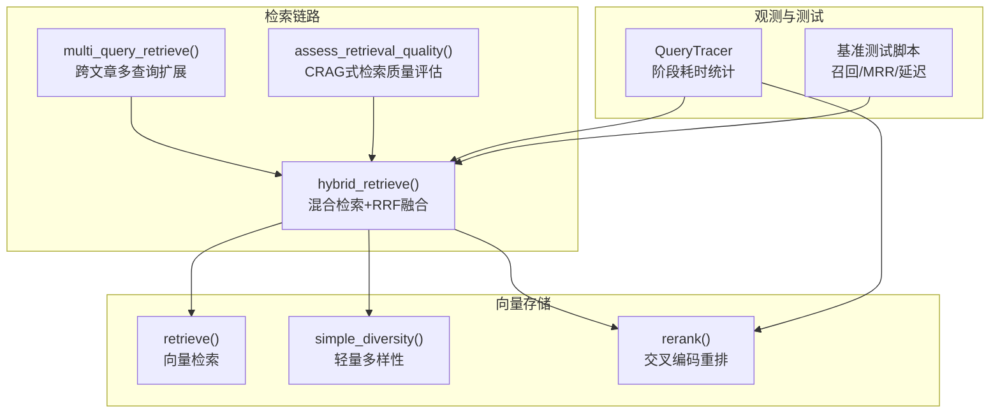
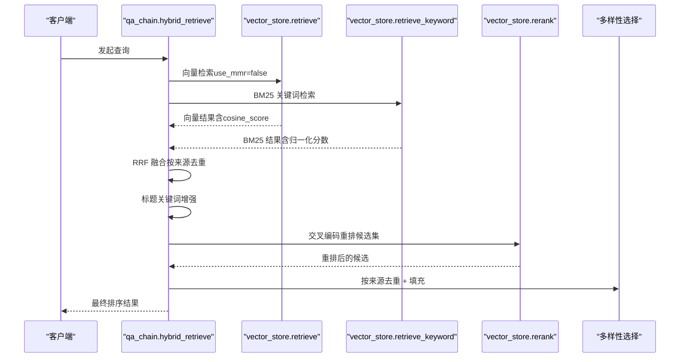
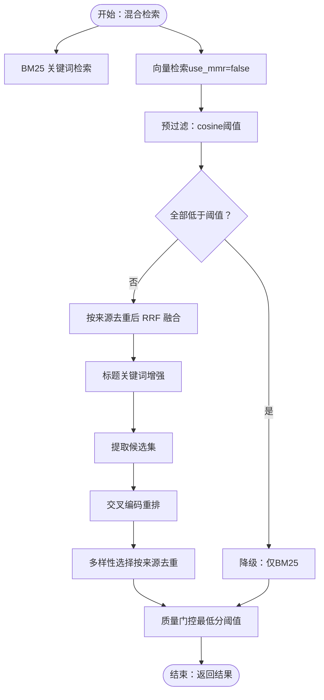
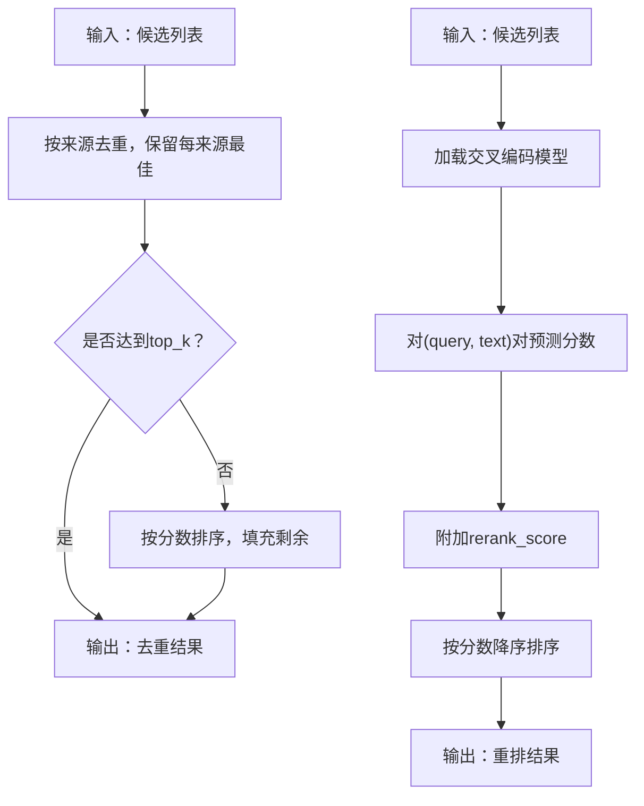
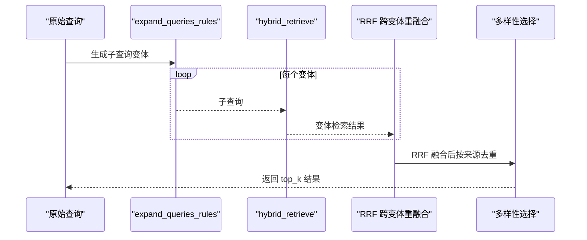
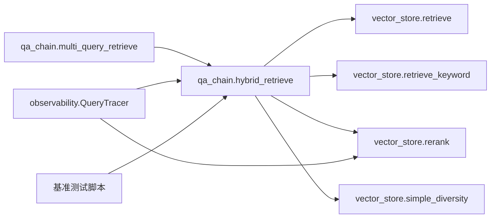

# 重排序与优化

<cite>
**本文引用的文件**
- [backend/app/rag/qa_chain.py](file://backend/app/rag/qa_chain.py)
- [backend/app/rag/vector_store.py](file://backend/app/rag/vector_store.py)
- [backend/app/observability/__init__.py](file://backend/app/observability/__init__.py)
- [docs/superpowers/plans/2026-05-31-cross-article-query.md](file://docs/superpowers/plans/2026-05-31-cross-article-query.md)
- [docs/superpowers/specs/2026-06-02-rag-quality-p1-design.md](file://docs/superpowers/specs/2026-06-02-rag-quality-p1-design.md)
- [backend/tests/benchmark_e2e.py](file://backend/tests/benchmark_e2e.py)
- [backend/tests/benchmark_rag.py](file://backend/tests/benchmark_rag.py)
- [backend/tests/benchmark_rag_full.py](file://backend/tests/benchmark_rag_full.py)
- [backend/tests/run_benchmark.py](file://backend/tests/run_benchmark.py)
- [src/pages/Benchmark.tsx](file://src/pages/Benchmark.tsx)
</cite>

## 目录
1. [简介](#简介)
2. [项目结构](#项目结构)
3. [核心组件](#核心组件)
4. [架构总览](#架构总览)
5. [详细组件分析](#详细组件分析)
6. [依赖分析](#依赖分析)
7. [性能考量](#性能考量)
8. [故障排查指南](#故障排查指南)
9. [结论](#结论)
10. [附录](#附录)

## 简介
本文件面向 RAG 检索引擎的“重排序与优化”模块，系统化阐述以下内容：
- RRF（互惠排序融合）的实现原理、参数与调优策略
- 重排序过程中的多样性保证、相关性计算与最终排序机制
- 不同重排序算法的比较：纯语义排序、BM25 排序、混合排序（RRF）与交叉编码重排（rerank）
- 性能监控、延迟优化与内存使用最佳实践
- 个性化重排序、上下文感知排序与动态权重调整思路
- 重排序结果质量评估指标与人工标注验证方法
- 自定义重排序算法与优化排序效果的实用方案

## 项目结构
重排序与优化相关的核心代码集中在后端的检索链路与向量存储模块，并辅以可观测性与基准测试工具：
- 检索链路：混合检索、RRF 融合、标题关键词增强、多样性选择、交叉编码重排
- 向量存储：向量检索、轻量多样性、交叉编码重排器
- 观测性：查询追踪与阶段耗时统计
- 基准测试：端到端召回、命中率、MRR、延迟等指标

图表来源
- [backend/app/rag/qa_chain.py:155-298](file://backend/app/rag/qa_chain.py#L155-L298)
- [backend/app/rag/vector_store.py:662-838](file://backend/app/rag/vector_store.py#L662-L838)
- [backend/app/observability/__init__.py:35-125](file://backend/app/observability/__init__.py#L35-L125)
- [backend/tests/benchmark_e2e.py:215-236](file://backend/tests/benchmark_e2e.py#L215-L236)

章节来源
- [backend/app/rag/qa_chain.py:155-298](file://backend/app/rag/qa_chain.py#L155-L298)
- [backend/app/rag/vector_store.py:662-838](file://backend/app/rag/vector_store.py#L662-L838)
- [backend/app/observability/__init__.py:35-125](file://backend/app/observability/__init__.py#L35-L125)

## 核心组件
- 混合检索与 RRF 融合：结合 BM25 关键词匹配与向量语义相似度，采用 RRF 对齐不同来源的排序位次，再进行多样性选择与标题关键词增强。
- 轻量多样性：按来源去重优先，不足时以分数填充，避免重复文章主导。
- 交叉编码重排（rerank）：对候选集进行细粒度相关性重排，提升排序精度。
- 多查询扩展：针对跨文章比较类查询，生成子查询变体并融合 RRF，扩大覆盖面。
- 负样本检测与质量门控：通过关键词启发式与 LLM 分类器降低“不可回答”查询对检索质量的影响。

章节来源
- [backend/app/rag/qa_chain.py:155-298](file://backend/app/rag/qa_chain.py#L155-L298)
- [backend/app/rag/vector_store.py:743-761](file://backend/app/rag/vector_store.py#L743-L761)
- [backend/app/rag/vector_store.py:807-838](file://backend/app/rag/vector_store.py#L807-L838)
- [docs/superpowers/plans/2026-05-31-cross-article-query.md:371-444](file://docs/superpowers/plans/2026-05-31-cross-article-query.md#L371-L444)

## 架构总览
下图展示一次查询的重排序与优化路径：混合检索（BM25 + 向量）→ RRF 融合 → 交叉编码重排 → 多样性选择 → 质量门控。

图表来源
- [backend/app/rag/qa_chain.py:155-298](file://backend/app/rag/qa_chain.py#L155-L298)
- [backend/app/rag/vector_store.py:662-838](file://backend/app/rag/vector_store.py#L662-L838)

## 详细组件分析

### 组件A：混合检索与 RRF 融合
- 目标：融合 BM25 与向量检索的优势，最大化召回与相关性。
- 关键点：
  - 预过滤：向量 cos 相似度阈值过滤，避免噪声进入 RRF；若全部低于阈值则降级为 BM25-only。
  - 去重：按 slug（文章唯一标识）去重，同一来源仅保留最佳位次。
  - RRF：对每个来源在两个检索器中的排名贡献进行倒数融合，向量贡献受最大参与数与置信度阈值限制。
  - 标题关键词增强：若查询包含特定术语，对匹配标题/slug 的文档进行倍增加权，提升歧义场景下的准确性。
  - 候选集：取前若干名用于重排，再进行多样性选择。
  - 质量门控：若最高分仍低于阈值，返回空结果，避免低质量输出。

图表来源
- [backend/app/rag/qa_chain.py:155-298](file://backend/app/rag/qa_chain.py#L155-L298)
- [docs/superpowers/specs/2026-06-02-rag-quality-p1-design.md:42-88](file://docs/superpowers/specs/2026-06-02-rag-quality-p1-design.md#L42-L88)

章节来源
- [backend/app/rag/qa_chain.py:155-298](file://backend/app/rag/qa_chain.py#L155-L298)
- [docs/superpowers/specs/2026-06-02-rag-quality-p1-design.md:42-88](file://docs/superpowers/specs/2026-06-02-rag-quality-p1-design.md#L42-L88)

### 组件B：轻量多样性与重排
- 轻量多样性（simple_diversity）：优先保留不同来源的最佳片段，不足时以分数填充，避免重复文章主导。
- 交叉编码重排（rerank）：对候选集进行细粒度相关性打分，按分数降序排列，作为最终排序依据。

图表来源
- [backend/app/rag/vector_store.py:743-761](file://backend/app/rag/vector_store.py#L743-L761)
- [backend/app/rag/vector_store.py:807-838](file://backend/app/rag/vector_store.py#L807-L838)

章节来源
- [backend/app/rag/vector_store.py:743-761](file://backend/app/rag/vector_store.py#L743-L761)
- [backend/app/rag/vector_store.py:807-838](file://backend/app/rag/vector_store.py#L807-L838)

### 组件C：多查询扩展与跨文章检索
- 针对跨文章比较类查询，先识别意图，再生成子查询变体，分别检索后以 RRF 融合，最后按来源去重并填充。
- 该策略显著提升跨主题、对比类问题的覆盖面与准确性。

图表来源
- [docs/superpowers/plans/2026-05-31-cross-article-query.md:371-444](file://docs/superpowers/plans/2026-05-31-cross-article-query.md#L371-L444)
- [backend/app/rag/qa_chain.py:301-410](file://backend/app/rag/qa_chain.py#L301-L410)

章节来源
- [docs/superpowers/plans/2026-05-31-cross-article-query.md:371-444](file://docs/superpowers/plans/2026-05-31-cross-article-query.md#L371-L444)
- [backend/app/rag/qa_chain.py:301-410](file://backend/app/rag/qa_chain.py#L301-L410)

### 组件D：负样本检测与质量门控
- 关键词启发式：对明显不可回答的查询（如定价、团队规模、实时信息等）快速拒绝。
- LLM 分类器：在高成本场景下，对检索结果进行“可回答性”判断，避免错误输出。
- 质量门控：对 RRF 分数设定安全阈值，防止低质量结果进入后续生成。

章节来源
- [backend/app/rag/qa_chain.py:62-126](file://backend/app/rag/qa_chain.py#L62-L126)
- [backend/app/rag/qa_chain.py:292-296](file://backend/app/rag/qa_chain.py#L292-L296)

## 依赖分析
- 检索链路依赖向量存储模块的检索与重排能力；观测模块提供阶段耗时统计；基准测试脚本提供端到端质量评估。
- 关键耦合点：
  - hybrid_retrieve 依赖 retrieve/retrieve_keyword/rerank/simple_diversity
  - multi_query_retrieve 依赖 hybrid_retrieve 与查询扩展规则
  - 观测模块 QueryTracer 在检索与重排阶段埋点，便于定位瓶颈

图表来源
- [backend/app/rag/qa_chain.py:155-298](file://backend/app/rag/qa_chain.py#L155-L298)
- [backend/app/rag/vector_store.py:662-838](file://backend/app/rag/vector_store.py#L662-L838)
- [backend/app/observability/__init__.py:35-125](file://backend/app/observability/__init__.py#L35-L125)

章节来源
- [backend/app/rag/qa_chain.py:155-298](file://backend/app/rag/qa_chain.py#L155-L298)
- [backend/app/rag/vector_store.py:662-838](file://backend/app/rag/vector_store.py#L662-L838)
- [backend/app/observability/__init__.py:35-125](file://backend/app/observability/__init__.py#L35-L125)

## 性能考量
- 延迟优化
  - BM25 关键词检索：<10ms，适合首 token 低延迟流式体验
  - 向量检索：开启 MMR 时 fetch_k 扩大，注意控制 top_k 与候选上限
  - 交叉编码重排：CPU 密集，建议按需启用（RERANK_ENABLED）与合理候选上限
- 内存使用
  - 向量检索结果与候选集大小直接影响内存占用，建议根据硬件资源设置候选上限与去重策略
  - 交叉编码模型懒加载，首次使用时有冷启动开销
- 基准测试指标
  - 召回@K、MRR、命中率、延迟（P50/P90/P99）、吞吐（QPS）

章节来源
- [backend/tests/benchmark_rag.py:148-175](file://backend/tests/benchmark_rag.py#L148-L175)
- [backend/tests/benchmark_rag_full.py:178-201](file://backend/tests/benchmark_rag_full.py#L178-L201)
- [backend/tests/run_benchmark.py:335-349](file://backend/tests/run_benchmark.py#L335-L349)
- [src/pages/Benchmark.tsx:141-167](file://src/pages/Benchmark.tsx#L141-L167)

## 故障排查指南
- 症状：检索结果为空
  - 检查预过滤阈值（向量 cosine 与 BM25 原始分数）是否过高
  - 若全部向量结果低于阈值，系统会降级为 BM25-only
  - 检查 RRF 质量门控阈值是否过于严格
- 症状：重排耗时过长
  - 关闭交叉编码重排（RERANK_ENABLED=false）或减少候选集上限
  - 检查 rerank 模型是否成功加载
- 症状：重复文章过多
  - 确认多样性选择逻辑是否生效（按来源去重）
  - 调整标题关键词增强策略，避免过度偏向特定术语
- 症状：首 token 延迟高
  - 确保使用 BM25 快速检索作为前置
  - 优化嵌入缓存与重试策略

章节来源
- [docs/superpowers/specs/2026-06-02-rag-quality-p1-design.md:42-88](file://docs/superpowers/specs/2026-06-02-rag-quality-p1-design.md#L42-L88)
- [backend/app/rag/vector_store.py:807-838](file://backend/app/rag/vector_store.py#L807-L838)
- [backend/app/rag/qa_chain.py:292-296](file://backend/app/rag/qa_chain.py#L292-L296)

## 结论
本模块通过“BM25 + 向量”的混合检索与 RRF 融合，结合标题关键词增强、轻量多样性与交叉编码重排，实现了高召回、高相关性的检索排序。配合负样本检测与质量门控，有效降低了低质量输出风险。通过可观测性与基准测试体系，可持续监控与优化性能与质量。

## 附录

### 参数与调优要点
- RRF 融合
  - RRF_K：控制排名贡献的平滑因子
  - RETRIEVAL_MULTIPLIER：检索扩展倍数，平衡召回与性能
  - RERANK_CANDIDATES：候选集上限，影响重排成本
- 预过滤
  - VECTOR_MIN_COSINE：向量 cos 相似度阈值
  - BM25_MIN_RAW_SCORE：BM25 原始分数阈值
- 重排与多样性
  - VECTOR_MAX_CONTRIB：向量参与 RRF 的最大贡献条目数
  - VECTOR_CONFIDENCE_THRESHOLD：向量置信度阈值
  - MIN_RELEVANCE_SCORE：RRF 质量门控阈值
- 动态策略
  - MULTI_QUERY_ENABLED：跨文章多查询扩展开关
  - NEGATIVE_DETECTION_ENABLED：负样本检测开关
  - RERANK_ENABLED：交叉编码重排开关

章节来源
- [backend/app/rag/qa_chain.py:21-60](file://backend/app/rag/qa_chain.py#L21-L60)
- [docs/superpowers/specs/2026-06-02-rag-quality-p1-design.md:42-88](file://docs/superpowers/specs/2026-06-02-rag-quality-p1-design.md#L42-L88)