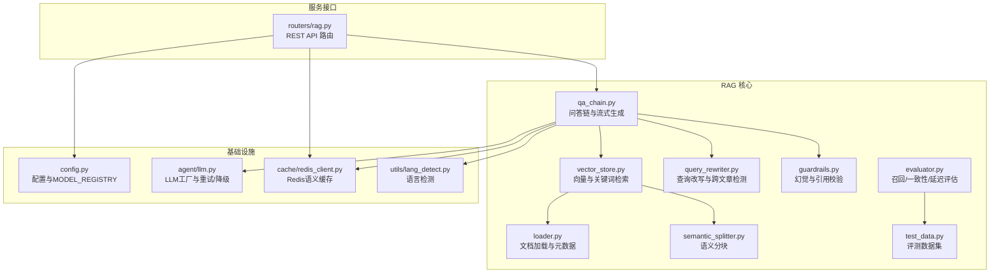
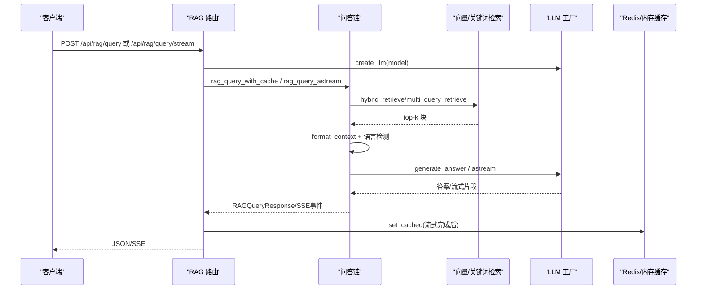
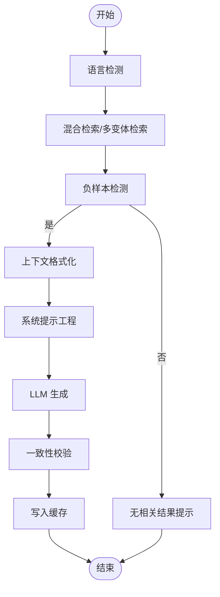
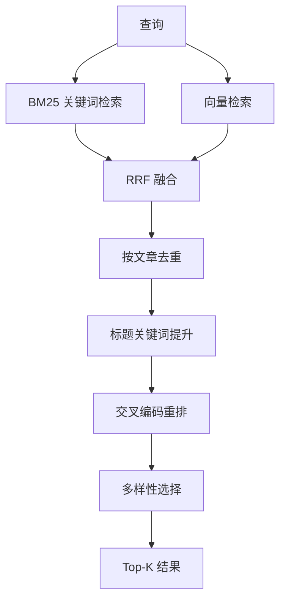
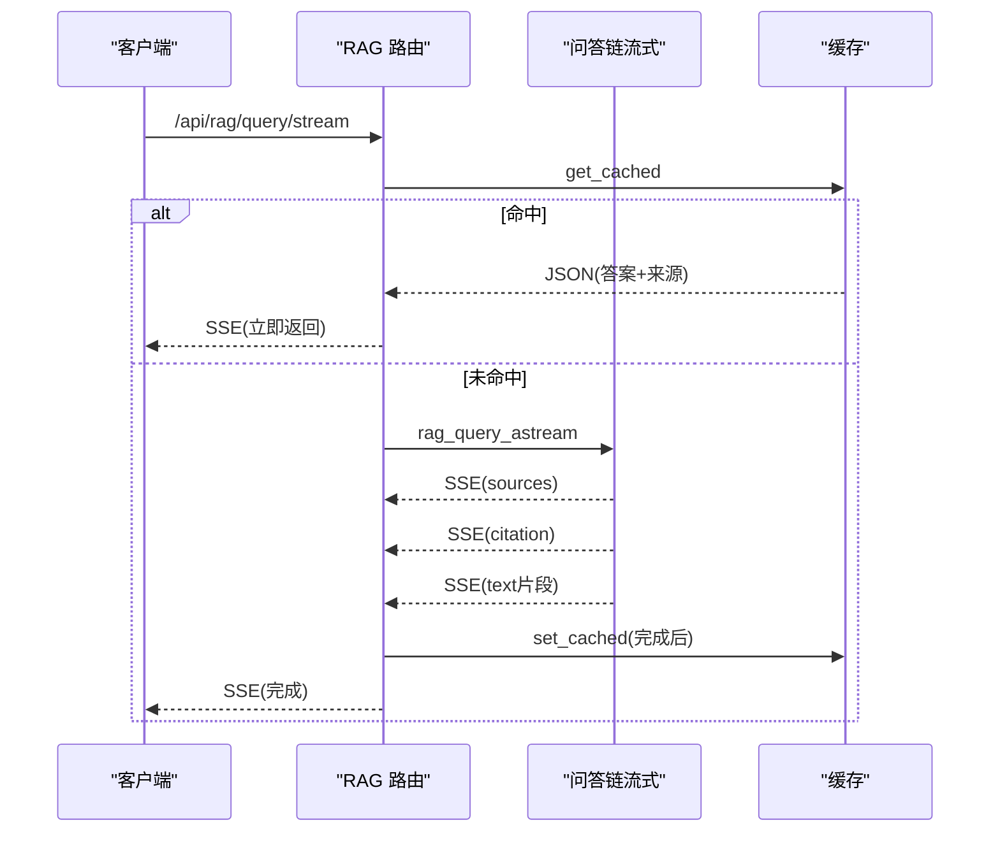
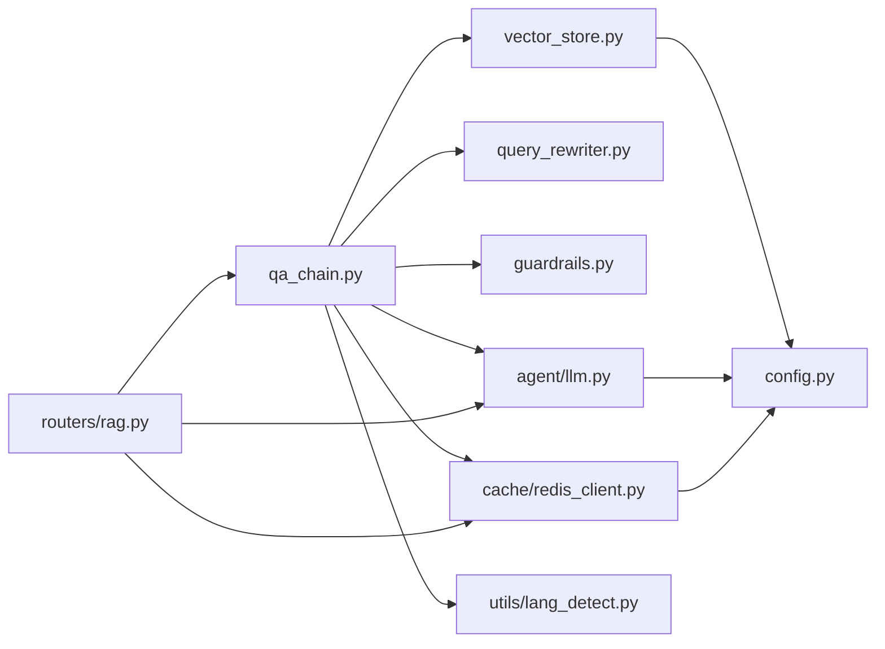

# 问答链与生成

<cite>
**本文引用的文件**
- [backend/app/rag/qa_chain.py](file://backend/app/rag/qa_chain.py)
- [backend/app/rag/models.py](file://backend/app/rag/models.py)
- [backend/app/rag/vector_store.py](file://backend/app/rag/vector_store.py)
- [backend/app/rag/query_rewriter.py](file://backend/app/rag/query_rewriter.py)
- [backend/app/rag/guardrails.py](file://backend/app/rag/guardrails.py)
- [backend/app/rag/loader.py](file://backend/app/rag/loader.py)
- [backend/app/rag/evaluator.py](file://backend/app/rag/evaluator.py)
- [backend/app/rag/test_data.py](file://backend/app/rag/test_data.py)
- [backend/app/rag/semantic_splitter.py](file://backend/app/rag/semantic_splitter.py)
- [backend/app/routers/rag.py](file://backend/app/routers/rag.py)
- [backend/app/agent/llm.py](file://backend/app/agent/llm.py)
- [backend/app/config.py](file://backend/app/config.py)
- [backend/app/utils/lang_detect.py](file://backend/app/utils/lang_detect.py)
- [backend/app/cache/redis_client.py](file://backend/app/cache/redis_client.py)
</cite>

## 目录
1. [简介](#简介)
2. [项目结构](#项目结构)
3. [核心组件](#核心组件)
4. [架构总览](#架构总览)
5. [详细组件分析](#详细组件分析)
6. [依赖关系分析](#依赖关系分析)
7. [性能考量](#性能考量)
8. [故障排查指南](#故障排查指南)
9. [结论](#结论)
10. [附录](#附录)

## 简介
本文件面向 RAG 检索引擎的“问答链与生成”模块，系统化梳理从检索、上下文组装、提示工程、答案生成、质量评估、错误处理到流式响应与多轮对话管理的完整技术文档。重点覆盖：
- 检索与融合策略：BM25 关键词检索 + 向量语义检索的 RRF 融合、跨文章查询的多变体检索、多样性选择与重排。
- 上下文组装与提示工程：系统提示模板、语言指令注入、上下文格式化与引用标注。
- 生成与质量保障：负样本检测、事实核查与一致性校验、置信度评估与错误处理。
- 流式响应与用户体验：SSE 缓冲策略、首字延迟优化、渐进式引用展示。
- 多 LLM 提供商集成：MODEL_REGISTRY、主备 LLM 调用与重试、API 调用与响应处理。
- 开发者指导：自定义问答链、优化生成质量、扩展检索策略与评估体系。

## 项目结构
RAG 问答链位于后端模块 backend/app/rag 下，围绕检索、向量化、提示工程、生成与评估形成闭环；API 路由在 backend/app/routers/rag.py 中暴露；LLM 集成在 backend/app/agent/llm.py；配置与缓存在 backend/app/config.py 与 backend/app/cache/redis_client.py。

图表来源
- [backend/app/rag/qa_chain.py:1-1072](file://backend/app/rag/qa_chain.py#L1-L1072)
- [backend/app/rag/vector_store.py:1-1118](file://backend/app/rag/vector_store.py#L1-L1118)
- [backend/app/rag/query_rewriter.py:1-145](file://backend/app/rag/query_rewriter.py#L1-L145)
- [backend/app/rag/guardrails.py:1-70](file://backend/app/rag/guardrails.py#L1-L70)
- [backend/app/rag/loader.py:1-224](file://backend/app/rag/loader.py#L1-L224)
- [backend/app/rag/semantic_splitter.py:1-220](file://backend/app/rag/semantic_splitter.py#L1-L220)
- [backend/app/rag/evaluator.py:1-192](file://backend/app/rag/evaluator.py#L1-L192)
- [backend/app/rag/test_data.py:1-919](file://backend/app/rag/test_data.py#L1-L919)
- [backend/app/routers/rag.py:1-566](file://backend/app/routers/rag.py#L1-L566)
- [backend/app/agent/llm.py:1-96](file://backend/app/agent/llm.py#L1-L96)
- [backend/app/config.py:1-90](file://backend/app/config.py#L1-L90)
- [backend/app/cache/redis_client.py:1-161](file://backend/app/cache/redis_client.py#L1-L161)
- [backend/app/utils/lang_detect.py:1-45](file://backend/app/utils/lang_detect.py#L1-L45)

章节来源
- [backend/app/routers/rag.py:1-566](file://backend/app/routers/rag.py#L1-L566)
- [backend/app/rag/qa_chain.py:1-1072](file://backend/app/rag/qa_chain.py#L1-L1072)
- [backend/app/rag/vector_store.py:1-1118](file://backend/app/rag/vector_store.py#L1-L1118)

## 核心组件
- 问答链与流式生成：负责检索、上下文组装、提示工程、答案生成与流式输出，含负样本检测与缓存。
- 向量与关键词检索：BM25 关键词检索、向量检索、RRF 融合、多样性选择与重排。
- 查询改写与跨文章检测：规则与 LLM 双通道扩展查询，提升跨文档检索效果。
- 质量保障：负样本检测、事实核查、引用校验与一致性评估。
- 文档加载与语义分块：Markdown/多格式解析、前端言元数据、语义分块策略。
- 评估体系：召回@K、一致性（LLM-as-judge）、延迟统计与评测报告。
- LLM 集成：MODEL_REGISTRY、主备 LLM、重试与降级、流式与非流式调用。
- 缓存与配置：Redis 语义缓存、内存缓存、环境配置与提供商注册表。

章节来源
- [backend/app/rag/qa_chain.py:582-754](file://backend/app/rag/qa_chain.py#L582-L754)
- [backend/app/rag/vector_store.py:663-761](file://backend/app/rag/vector_store.py#L663-L761)
- [backend/app/rag/query_rewriter.py:72-145](file://backend/app/rag/query_rewriter.py#L72-L145)
- [backend/app/rag/guardrails.py:30-70](file://backend/app/rag/guardrails.py#L30-L70)
- [backend/app/rag/loader.py:47-224](file://backend/app/rag/loader.py#L47-L224)
- [backend/app/rag/semantic_splitter.py:54-220](file://backend/app/rag/semantic_splitter.py#L54-L220)
- [backend/app/rag/evaluator.py:17-192](file://backend/app/rag/evaluator.py#L17-L192)
- [backend/app/agent/llm.py:20-96](file://backend/app/agent/llm.py#L20-L96)
- [backend/app/cache/redis_client.py:106-145](file://backend/app/cache/redis_client.py#L106-L145)
- [backend/app/config.py:67-90](file://backend/app/config.py#L67-L90)

## 架构总览
问答链整体流程：查询经语言检测与可回答性判定，进入混合检索（BM25 + 向量），跨文章查询启用多变体检索与多样性选择，随后上下文格式化与系统提示工程，LLM 生成答案，最后产出引用清单与可选的事实核查。

图表来源
- [backend/app/routers/rag.py:86-267](file://backend/app/routers/rag.py#L86-L267)
- [backend/app/rag/qa_chain.py:582-754](file://backend/app/rag/qa_chain.py#L582-L754)
- [backend/app/rag/vector_store.py:155-413](file://backend/app/rag/vector_store.py#L155-L413)
- [backend/app/agent/llm.py:20-96](file://backend/app/agent/llm.py#L20-L96)
- [backend/app/cache/redis_client.py:106-145](file://backend/app/cache/redis_client.py#L106-L145)

## 详细组件分析

### 问答链与流式生成
- 检索阶段
  - hybrid_retrieve：BM25 关键词检索与向量检索 RRF 融合，预过滤与标题关键词提升，候选集重排与多样性选择。
  - multi_query_retrieve：跨文章查询检测与规则/LLM 双通道扩展，多变体检索后 RRF 聚合与多样性选择。
- 质量门控
  - 负样本检测：关键字快速通道 + LLM 分类器，避免无意义检索与生成。
  - 检索质量评估：CRAG 风格的 LLM 评估，过滤误相关结果。
- 上下文组装与提示工程
  - format_context：父-子块优先策略，去重父块，丰富上下文。
  - generate_answer：系统提示模板（中/英双语），语言指令注入，消息构造。
- 生成与后处理
  - generate_answer：调用 LLM 生成答案。
  - check_faithfulness：声明级分解与一致性校验，返回支持比例。
  - rag_query / rag_query_astream：完整问答链封装，流式输出与 SSE 事件。
  - rag_query_with_cache：Redis 语义缓存，命中直接返回，未命中写入缓存。
- 错误处理与可观测性
  - LLM 调用异常捕获与降级提示。
  - 缓存命中/未命中统计与记录。

图表来源
- [backend/app/rag/qa_chain.py:582-754](file://backend/app/rag/qa_chain.py#L582-L754)
- [backend/app/rag/vector_store.py:155-413](file://backend/app/rag/vector_store.py#L155-L413)
- [backend/app/utils/lang_detect.py:15-45](file://backend/app/utils/lang_detect.py#L15-L45)

章节来源
- [backend/app/rag/qa_chain.py:582-754](file://backend/app/rag/qa_chain.py#L582-L754)
- [backend/app/rag/qa_chain.py:498-580](file://backend/app/rag/qa_chain.py#L498-L580)
- [backend/app/cache/redis_client.py:106-145](file://backend/app/cache/redis_client.py#L106-L145)

### 检索与融合策略
- BM25 关键词检索
  - 令牌化与停用词过滤、IDF 计算、BM25+ 打分、最小原始分数阈值过滤。
  - 支持语言过滤与预构建索引，避免重复分词开销。
- 向量检索
  - ChromaDB 集合管理、嵌入函数包装、MMR 多样性选择、维度不匹配自动降级。
- RRF 融合与多样性
  - 基于 Reciprocal Rank Fusion 的融合，标题关键词提升，候选集重排与多样性选择。
- 重排与质量门控
  - Cross-Encoder 重排（懒加载），检索质量评估（CRAG 风格）。

图表来源
- [backend/app/rag/vector_store.py:155-413](file://backend/app/rag/vector_store.py#L155-L413)
- [backend/app/rag/vector_store.py:788-800](file://backend/app/rag/vector_store.py#L788-L800)

章节来源
- [backend/app/rag/vector_store.py:263-761](file://backend/app/rag/vector_store.py#L263-L761)

### 查询改写与跨文章检测
- is_cross_article_query：中/英双语模式识别，判断是否跨文章/对比意图。
- expand_queries_rules：规则驱动的查询扩展（分句、去意图词、去停用词），保证变体多样性。
- rewrite_query / expand_queries：可选的 LLM 改写通道，增强检索意图表达。

章节来源
- [backend/app/rag/query_rewriter.py:72-145](file://backend/app/rag/query_rewriter.py#L72-L145)

### 质量保障与一致性校验
- 负样本检测：关键字快速通道 + LLM 分类器，避免无意义生成。
- 事实核查：声明级分解与一致性校验，返回支持比例。
- 引用校验：从答案中抽取引用，与检索来源比对，判断缺失与验证。

章节来源
- [backend/app/rag/qa_chain.py:62-153](file://backend/app/rag/qa_chain.py#L62-L153)
- [backend/app/rag/qa_chain.py:556-580](file://backend/app/rag/qa_chain.py#L556-L580)
- [backend/app/rag/guardrails.py:30-70](file://backend/app/rag/guardrails.py#L30-L70)

### 上下文组装与提示工程
- format_context：优先使用父块（Parent-Child）丰富上下文，避免重复父块，拼接 Source 标注。
- 系统提示模板：中/英双语，包含引用规范、语言指令注入、严格规则约束。
- 语言检测：根据输入字符分布自动选择语言，注入语言指令。

章节来源
- [backend/app/rag/vector_store.py:764-786](file://backend/app/rag/vector_store.py#L764-L786)
- [backend/app/rag/qa_chain.py:465-495](file://backend/app/rag/qa_chain.py#L465-L495)
- [backend/app/utils/lang_detect.py:15-45](file://backend/app/utils/lang_detect.py#L15-L45)

### 流式响应与用户体验优化
- SSE 缓冲策略：首次文本立即输出，后续按时间间隔与字符数缓冲，提升首字延迟与吞吐。
- 渐进式引用：先发送 sources，再发送引用片段，最后发送答案流。
- 缓存：流式完成后将完整答案与来源写入 Redis/内存缓存，命中直接返回。

图表来源
- [backend/app/routers/rag.py:133-267](file://backend/app/routers/rag.py#L133-L267)
- [backend/app/rag/qa_chain.py:653-754](file://backend/app/rag/qa_chain.py#L653-L754)
- [backend/app/cache/redis_client.py:106-145](file://backend/app/cache/redis_client.py#L106-L145)

章节来源
- [backend/app/routers/rag.py:153-267](file://backend/app/routers/rag.py#L153-L267)
- [backend/app/rag/qa_chain.py:653-754](file://backend/app/rag/qa_chain.py#L653-L754)

### 多 LLM 提供商集成与 API 调用
- MODEL_REGISTRY：统一注册 DeepSeek、OpenAI、Claude 等模型，按名称解析基座 URL、模型名与最大 token。
- 主备 LLM：主 LLM（DeepSeek）失败自动降级到备 LLM（Zhipu），并带指数退避重试。
- API 调用：ChatOpenAI 包装，支持流式与非流式，温度、最大 token 等参数可配置。

章节来源
- [backend/app/config.py:67-90](file://backend/app/config.py#L67-L90)
- [backend/app/agent/llm.py:20-96](file://backend/app/agent/llm.py#L20-L96)

### 文档加载与语义分块
- 文档加载：支持 .md/.txt/.pdf/.docx/.xlsx，解析 Frontmatter，检测语言，生成元数据。
- 语义分块：基于句子级嵌入相似度检测主题边界，百分位阈值确定断点，合并/拆分/修剪块大小。

章节来源
- [backend/app/rag/loader.py:47-224](file://backend/app/rag/loader.py#L47-L224)
- [backend/app/rag/semantic_splitter.py:54-220](file://backend/app/rag/semantic_splitter.py#L54-L220)

### 评估体系与测试数据
- 评测指标：Recall@K、一致性（LLM-as-judge）、延迟统计（p50/p99）。
- 测试数据：覆盖事实性、推理、合成、负样本、跨文章等类别，支持评测与实验。

章节来源
- [backend/app/rag/evaluator.py:17-192](file://backend/app/rag/evaluator.py#L17-L192)
- [backend/app/rag/test_data.py:19-919](file://backend/app/rag/test_data.py#L19-L919)

## 依赖关系分析
- 组件耦合
  - qa_chain 依赖 vector_store、query_rewriter、guardrails、lang_detect、agent.llm、cache.redis_client。
  - routers/rag 依赖 qa_chain、agent.llm、cache.redis_client、config.settings。
  - vector_store 依赖 config.settings、cache.redis_client（嵌入缓存）、lang_detect（文档语言）。
- 外部依赖
  - LLM：ChatOpenAI（LangChain OpenAI），MODEL_REGISTRY 注册多提供商。
  - 向量存储：ChromaDB（可替换为 Qdrant/Elasticsearch）。
  - 缓存：Redis（异步客户端），内存缓存作为降级。
- 循环依赖
  - 未见直接循环依赖；模块间通过函数/类接口调用，避免强耦合。

图表来源
- [backend/app/rag/qa_chain.py:1-1072](file://backend/app/rag/qa_chain.py#L1-L1072)
- [backend/app/rag/vector_store.py:1-1118](file://backend/app/rag/vector_store.py#L1-L1118)
- [backend/app/rag/query_rewriter.py:1-145](file://backend/app/rag/query_rewriter.py#L1-L145)
- [backend/app/rag/guardrails.py:1-70](file://backend/app/rag/guardrails.py#L1-L70)
- [backend/app/routers/rag.py:1-566](file://backend/app/routers/rag.py#L1-L566)
- [backend/app/agent/llm.py:1-96](file://backend/app/agent/llm.py#L1-L96)
- [backend/app/cache/redis_client.py:1-161](file://backend/app/cache/redis_client.py#L1-L161)
- [backend/app/config.py:1-90](file://backend/app/config.py#L1-L90)

章节来源
- [backend/app/rag/qa_chain.py:1-1072](file://backend/app/rag/qa_chain.py#L1-L1072)
- [backend/app/routers/rag.py:1-566](file://backend/app/routers/rag.py#L1-L566)

## 性能考量
- 检索性能
  - BM25 关键词检索：无嵌入 API 调用，<10ms；支持预构建索引与最小原始分数过滤。
  - 向量检索：MMR 多样性选择，维度不匹配自动降级；嵌入缓存与 Redis 缓存减少重复计算。
- 生成性能
  - 流式输出：SSE 缓冲策略降低首字延迟，渐进式引用提升感知速度。
  - 缓存：语义缓存命中直接返回，显著降低重复查询成本。
- 评估与监控
  - 延迟统计与命中率记录，便于容量规划与性能优化。

[本节为通用性能讨论，不直接分析具体文件]

## 故障排查指南
- LLM API 未配置
  - 现象：HTTP 503 提示未配置 API Key。
  - 处理：设置 LLM_API_KEY 或 FALLBACK_API_KEY。
- 检索索引为空
  - 现象：查询提示索引为空，建议手动重建。
  - 处理：POST /api/rag/index；检查向量目录与集合状态。
- 维度不匹配
  - 现象：向量查询报维度错误。
  - 处理：自动降级至 API 嵌入并清空错误缓存；确认本地模型与集合维度一致。
- 缓存不可用
  - 现象：Redis 不可用导致缓存降级。
  - 处理：内存缓存作为降级；检查 REDIS_URL；必要时清理缓存。
- 负样本检测误判
  - 现象：某些问题被判定为不可回答。
  - 处理：调整关键字规则或禁用负样本检测；结合检索质量评估改进。

章节来源
- [backend/app/routers/rag.py:86-131](file://backend/app/routers/rag.py#L86-L131)
- [backend/app/routers/rag.py:270-302](file://backend/app/routers/rag.py#L270-L302)
- [backend/app/rag/vector_store.py:690-718](file://backend/app/rag/vector_store.py#L690-L718)
- [backend/app/cache/redis_client.py:67-97](file://backend/app/cache/redis_client.py#L67-L97)

## 结论
本问答链与生成模块以“检索-上下文-提示-生成-评估”为主线，结合多提供商 LLM 集成、语义缓存、流式输出与质量保障机制，形成稳定高效的 RAG 工作流。通过规则与 LLM 双通道的查询改写、跨文章检索与多样性选择，显著提升跨文档问答质量；通过负样本检测、一致性校验与引用校验，有效降低幻觉风险；通过 SSE 缓冲与语义缓存，优化用户体验与系统性能。开发者可在此基础上扩展检索策略、提示模板与评估指标，持续优化生成质量与稳定性。

[本节为总结性内容，不直接分析具体文件]

## 附录
- 自定义问答链建议
  - 提示模板：在 QA_SYSTEM_PROMPT 中加入领域指令，结合 lang_instruction 动态语言注入。
  - 检索策略：启用 multi_query_retrieve 并配置 TITLE_KEYWORDS_ZH 提升标题关键词权重。
  - 质量门控：开启负样本检测与一致性校验，结合评估体系持续优化。
- 优化生成质量
  - 使用更严格的系统提示与引用规范，减少歧义。
  - 结合语义分块与 Parent-Child 上下文，提升长文档问答效果。
  - 启用流式输出与渐进式引用，改善交互体验。
- 多轮对话与会话管理
  - 当前模块聚焦单轮问答；多轮对话可通过外部状态管理（如 memory 模块）与提示工程实现，保持上下文一致性与会话状态维护。

[本节为通用指导，不直接分析具体文件]