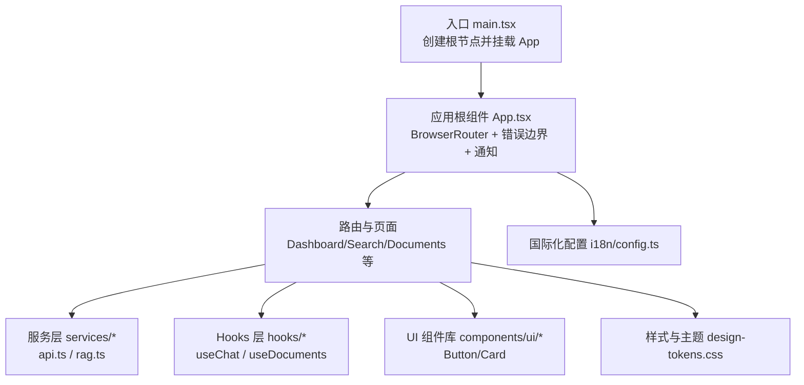
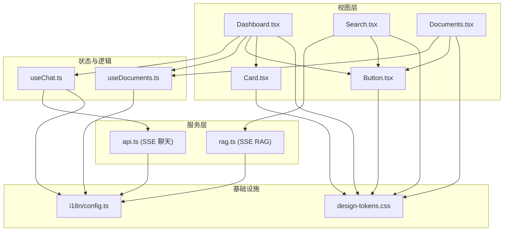
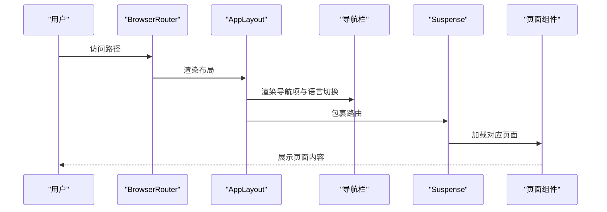
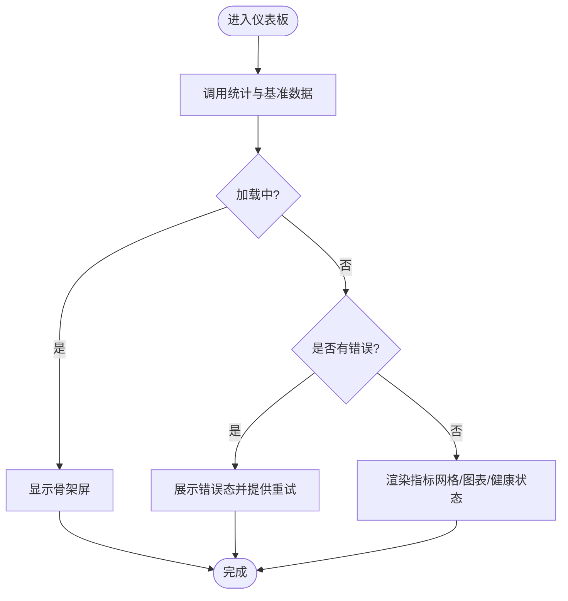
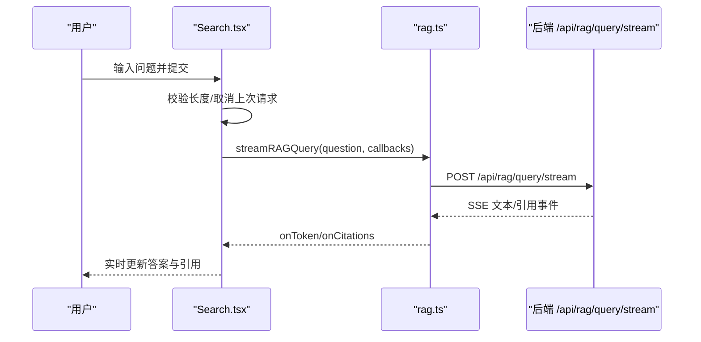
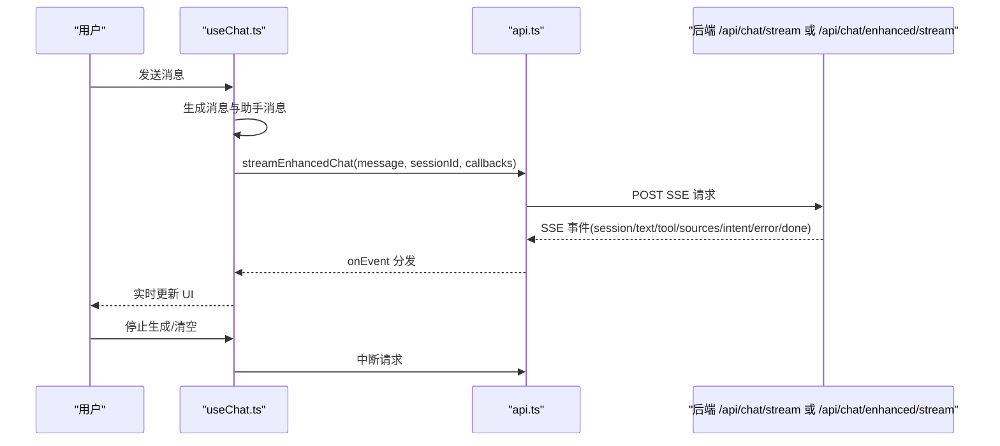
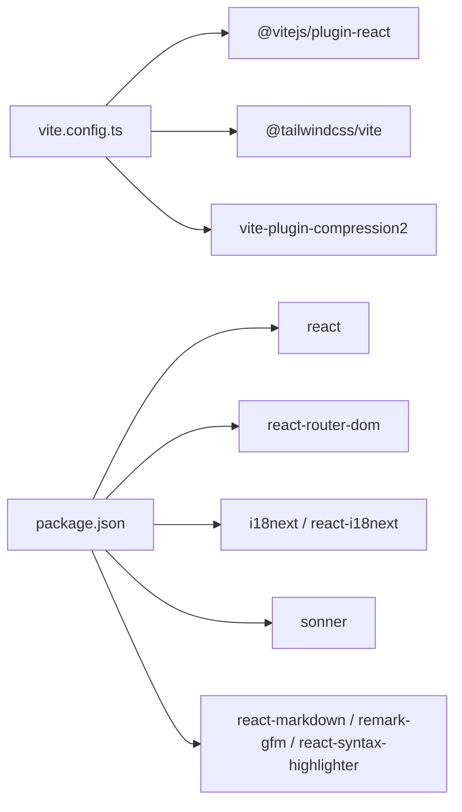

# 前端应用

<cite>
**本文引用的文件**
- [package.json](file://package.json)
- [vite.config.ts](file://vite.config.ts)
- [src/main.tsx](file://src/main.tsx)
- [src/App.tsx](file://src/App.tsx)
- [src/components/ErrorBoundary.tsx](file://src/components/ErrorBoundary.tsx)
- [src/pages/Dashboard.tsx](file://src/pages/Dashboard.tsx)
- [src/pages/Search.tsx](file://src/pages/Search.tsx)
- [src/pages/Documents.tsx](file://src/pages/Documents.tsx)
- [src/services/api.ts](file://src/services/api.ts)
- [src/services/rag.ts](file://src/services/rag.ts)
- [src/hooks/useChat.ts](file://src/hooks/useChat.ts)
- [src/hooks/useDocuments.ts](file://src/hooks/useDocuments.ts)
- [src/components/ui/Button.tsx](file://src/components/ui/Button.tsx)
- [src/components/ui/Card.tsx](file://src/components/ui/Card.tsx)
- [src/styles/design-tokens.css](file://src/styles/design-tokens.css)
- [src/i18n/config.ts](file://src/i18n/config.ts)
</cite>

## 目录
1. [简介](#简介)
2. [项目结构](#项目结构)
3. [核心组件](#核心组件)
4. [架构总览](#架构总览)
5. [详细组件分析](#详细组件分析)
6. [依赖关系分析](#依赖关系分析)
7. [性能考量](#性能考量)
8. [故障排查指南](#故障排查指南)
9. [结论](#结论)
10. [附录](#附录)

## 简介
本文件为 Aureon 前端应用的全面技术文档，覆盖 React 应用的结构设计、组件层次、状态管理模式、页面组织、UI 组件库与样式系统、主题定制、API 服务层封装、数据获取策略与错误处理、路由与导航、国际化与响应式设计、可访问性、以及扩展与性能优化建议。文档同时解释前端与后端 API 的交互模式与数据流设计，帮助开发者快速理解与迭代。

## 项目结构
前端采用 Vite + React 19 + TypeScript 构建，使用 TailwindCSS 进行样式组织，并通过按需懒加载与代码分包提升首屏性能。国际化通过 i18next 实现，路由基于 React Router v7，全局错误边界保障稳定性。

图表来源
- [src/main.tsx:1-20](file://src/main.tsx#L1-L20)
- [src/App.tsx:1-122](file://src/App.tsx#L1-L122)
- [src/i18n/config.ts:1-23](file://src/i18n/config.ts#L1-L23)
- [src/styles/design-tokens.css:1-59](file://src/styles/design-tokens.css#L1-L59)

章节来源
- [package.json:1-54](file://package.json#L1-L54)
- [vite.config.ts:1-45](file://vite.config.ts#L1-L45)
- [src/main.tsx:1-20](file://src/main.tsx#L1-L20)
- [src/App.tsx:1-122](file://src/App.tsx#L1-L122)

## 核心组件
- 应用根组件：负责路由容器、导航栏、页面级懒加载与错误边界包裹。
- 页面组件：Dashboard、Search、Documents 等，承担业务视图与用户交互。
- UI 组件库：Button、Card 等基础组件，统一风格与交互行为。
- 服务层：封装 SSE 流式 API 调用，抽象 RAG 与聊天接口。
- Hooks：useChat、useDocuments 等，封装数据获取、缓存与状态逻辑。
- 国际化：i18n 初始化与语言检测，支持中英文切换。
- 样式与主题：设计令牌集中定义颜色、阴影、字体与间距，支持主题色与暗色主题友好。

章节来源
- [src/App.tsx:28-122](file://src/App.tsx#L28-L122)
- [src/components/ui/Button.tsx:1-38](file://src/components/ui/Button.tsx#L1-L38)
- [src/components/ui/Card.tsx:1-23](file://src/components/ui/Card.tsx#L1-L23)
- [src/services/api.ts:1-157](file://src/services/api.ts#L1-L157)
- [src/services/rag.ts:1-156](file://src/services/rag.ts#L1-L156)
- [src/hooks/useChat.ts:1-280](file://src/hooks/useChat.ts#L1-L280)
- [src/hooks/useDocuments.ts:1-60](file://src/hooks/useDocuments.ts#L1-L60)
- [src/i18n/config.ts:1-23](file://src/i18n/config.ts#L1-L23)
- [src/styles/design-tokens.css:1-59](file://src/styles/design-tokens.css#L1-L59)

## 架构总览
前端采用“页面 + 组件 + 服务 + Hooks + 国际化 + 主题”的分层架构。页面组件负责布局与业务流程；UI 组件提供可复用的视觉与交互；服务层封装与后端的通信；Hooks 抽象状态与副作用；i18n 提供多语言；主题通过 CSS 变量统一管理。

图表来源
- [src/pages/Dashboard.tsx:1-149](file://src/pages/Dashboard.tsx#L1-L149)
- [src/pages/Search.tsx:1-137](file://src/pages/Search.tsx#L1-L137)
- [src/pages/Documents.tsx:1-231](file://src/pages/Documents.tsx#L1-L231)
- [src/components/ui/Button.tsx:1-38](file://src/components/ui/Button.tsx#L1-L38)
- [src/components/ui/Card.tsx:1-23](file://src/components/ui/Card.tsx#L1-L23)
- [src/hooks/useChat.ts:1-280](file://src/hooks/useChat.ts#L1-L280)
- [src/hooks/useDocuments.ts:1-60](file://src/hooks/useDocuments.ts#L1-L60)
- [src/services/api.ts:1-157](file://src/services/api.ts#L1-L157)
- [src/services/rag.ts:1-156](file://src/services/rag.ts#L1-L156)
- [src/i18n/config.ts:1-23](file://src/i18n/config.ts#L1-L23)
- [src/styles/design-tokens.css:1-59](file://src/styles/design-tokens.css#L1-L59)

## 详细组件分析

### 应用布局与路由（App.tsx）
- 使用 React Router v7 的懒加载路由，按需加载页面组件，减少首屏体积。
- 导航栏根据当前路径高亮，支持语言切换与登录入口。
- 全局错误边界包裹，保证单页应用的健壮性。
- 顶部通知使用轻量通知库，统一提示风格。

图表来源
- [src/App.tsx:28-122](file://src/App.tsx#L28-L122)

章节来源
- [src/App.tsx:28-122](file://src/App.tsx#L28-L122)

### 仪表板（Dashboard.tsx）
- 使用多个自定义 Hook 获取统计数据、查询趋势与最近查询。
- 通过骨架屏与错误态组件提升加载体验与容错能力。
- 展示系统健康状态与基准指标（召回、延迟等），并以状态点表示健康度。

图表来源
- [src/pages/Dashboard.tsx:56-149](file://src/pages/Dashboard.tsx#L56-L149)

章节来源
- [src/pages/Dashboard.tsx:56-149](file://src/pages/Dashboard.tsx#L56-L149)

### 搜索页面（Search.tsx）
- 支持输入长度校验、取消上一次请求、流式接收答案与引用列表。
- 将引用去重合并，避免重复渲染。
- 提供查询建议区域，改善用户体验。

图表来源
- [src/pages/Search.tsx:28-67](file://src/pages/Search.tsx#L28-L67)
- [src/services/rag.ts:95-156](file://src/services/rag.ts#L95-L156)

章节来源
- [src/pages/Search.tsx:10-137](file://src/pages/Search.tsx#L10-L137)
- [src/services/rag.ts:1-156](file://src/services/rag.ts#L1-L156)

### 文档管理（Documents.tsx）
- 列表展示文档元信息，支持按标题/来源筛选。
- 提供博客同步与上传入口，展示总数与分片数统计。
- 加载态与空态处理完善，错误时提供重试按钮。

章节来源
- [src/pages/Documents.tsx:15-231](file://src/pages/Documents.tsx#L15-L231)
- [src/hooks/useDocuments.ts:1-60](file://src/hooks/useDocuments.ts#L1-L60)

### 聊天与会话（useChat.ts + api.ts）
- useChat 封装消息生命周期、会话 ID、文本缓冲与刷新、工具调用与来源注入、错误处理与停止生成。
- api.ts 提供标准 SSE 聊天与增强聊天（含意图与路由）的流式接口，内置背压控制与中断处理。

图表来源
- [src/hooks/useChat.ts:178-231](file://src/hooks/useChat.ts#L178-L231)
- [src/services/api.ts:28-157](file://src/services/api.ts#L28-L157)

章节来源
- [src/hooks/useChat.ts:1-280](file://src/hooks/useChat.ts#L1-L280)
- [src/services/api.ts:1-157](file://src/services/api.ts#L1-L157)

### UI 组件库（Button、Card）
- Button 提供主次/幽灵三种变体与尺寸，统一过渡动画与交互反馈。
- Card 提供基础卡片容器，支持 hover 效果与边框/阴影配置。

章节来源
- [src/components/ui/Button.tsx:1-38](file://src/components/ui/Button.tsx#L1-L38)
- [src/components/ui/Card.tsx:1-23](file://src/components/ui/Card.tsx#L1-L23)

### 国际化与主题
- i18n 配置支持浏览器语言检测与本地存储缓存，资源包含中英文。
- 设计令牌集中定义颜色、阴影、字体与间距，通过 CSS 变量在组件中使用，便于主题切换与一致性。

章节来源
- [src/i18n/config.ts:1-23](file://src/i18n/config.ts#L1-L23)
- [src/styles/design-tokens.css:1-59](file://src/styles/design-tokens.css#L1-L59)

## 依赖关系分析
- 构建与打包：Vite 插件链包含 React、TailwindCSS、Gzip 压缩；手动分包策略将 React、Router、i18n、Markdown 生态拆分为独立 chunk。
- 运行时依赖：React、React Router、i18next、Sonner 通知、React Markdown、Tailwind 动画等。
- 开发依赖：TypeScript、ESLint、Vitest、Playwright、TailwindCSS Vite 插件等。

图表来源
- [vite.config.ts:1-45](file://vite.config.ts#L1-L45)
- [package.json:14-52](file://package.json#L14-L52)

章节来源
- [vite.config.ts:1-45](file://vite.config.ts#L1-L45)
- [package.json:1-54](file://package.json#L1-L54)

## 性能考量
- 代码分割：路由级懒加载与手动分包，降低首屏 JS 体积。
- 流式渲染：SSE 事件流配合背压控制，避免 UI 卡顿。
- 缓存与去抖：聊天文本缓冲与刷新节流，减少频繁重渲染。
- 图标与通知：使用轻量库，避免引入重型依赖。
- 样式：TailwindCSS 按需生成，CSS 代码分割开启。

章节来源
- [vite.config.ts:22-43](file://vite.config.ts#L22-L43)
- [src/services/api.ts:23-94](file://src/services/api.ts#L23-L94)
- [src/hooks/useChat.ts:32-79](file://src/hooks/useChat.ts#L32-L79)

## 故障排查指南
- 全局错误边界：捕获子组件渲染错误，记录堆栈并在 UI 中提供重试按钮。
- 聊天中断：AbortController 支持取消请求，确保清理定时器与缓冲。
- 网络异常：SSE 读取失败或解析异常时，统一 onError 回调，提示用户检查后端状态。
- 文档加载失败：提供重试按钮与错误提示，避免阻塞页面。

章节来源
- [src/components/ErrorBoundary.tsx:1-56](file://src/components/ErrorBoundary.tsx#L1-L56)
- [src/hooks/useChat.ts:247-268](file://src/hooks/useChat.ts#L247-L268)
- [src/services/api.ts:88-94](file://src/services/api.ts#L88-L94)
- [src/pages/Documents.tsx:30-52](file://src/pages/Documents.tsx#L30-L52)

## 结论
Aureon 前端以清晰的分层架构与完善的基础设施支撑核心业务场景。通过路由懒加载、SSE 流式通信、国际化与主题系统，实现了良好的性能、可维护性与用户体验。后续可在以下方面持续优化：完善可访问性（ARIA、键盘导航）、增强测试覆盖率、探索主题切换方案与缓存策略。

## 附录

### 创建新页面步骤指引
- 在 pages 目录新增页面组件，导出默认函数组件。
- 在 App.tsx 的路由中注册新路径与懒加载导入。
- 如需共享状态，优先使用现有 Hooks 或新建专用 Hook。
- 使用 UI 组件库保持一致风格，必要时扩展 Button/Card 等基础组件。

章节来源
- [src/App.tsx:9-18](file://src/App.tsx#L9-L18)
- [src/pages/Dashboard.tsx:56-149](file://src/pages/Dashboard.tsx#L56-L149)

### 扩展现有组件最佳实践
- UI 组件：通过 props 扩展变体与尺寸，避免在组件内硬编码样式。
- 页面组件：将业务逻辑下沉至 Hooks，保持组件职责单一。
- 服务层：统一错误处理与中止信号传递，确保可中断与可恢复。

章节来源
- [src/components/ui/Button.tsx:1-38](file://src/components/ui/Button.tsx#L1-L38)
- [src/hooks/useChat.ts:178-231](file://src/hooks/useChat.ts#L178-L231)
- [src/services/rag.ts:95-156](file://src/services/rag.ts#L95-L156)

### 国际化与响应式设计
- 国际化：通过 i18n 配置与翻译键值管理文案，避免字符串硬编码。
- 响应式：使用 Tailwind 工具类与媒体查询适配移动端与桌面端布局。

章节来源
- [src/i18n/config.ts:1-23](file://src/i18n/config.ts#L1-L23)
- [src/pages/Documents.tsx:147-227](file://src/pages/Documents.tsx#L147-L227)