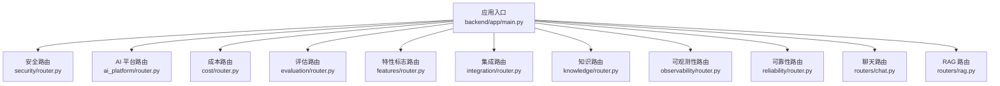
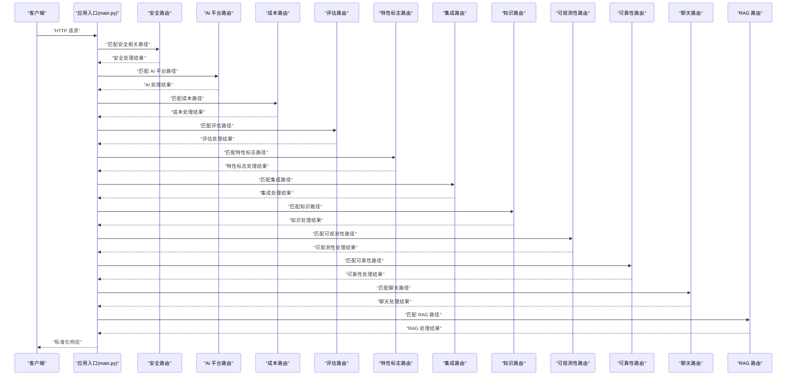
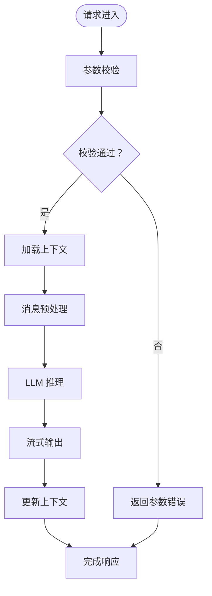
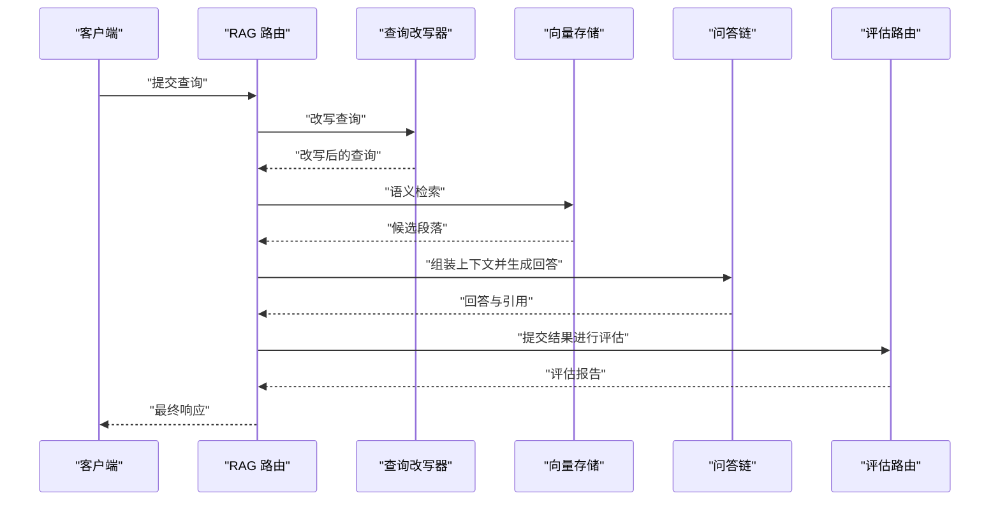
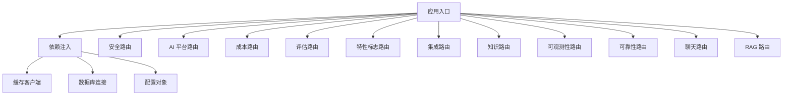

# API 路由器

<cite>
**本文档引用的文件**
- [backend/app/main.py](file://backend/app/main.py)
- [backend/app/dependencies.py](file://backend/app/dependencies.py)
- [backend/app/exceptions.py](file://backend/app/exceptions.py)
- [backend/app/common.py](file://backend/app/common.py)
- [backend/app/security/router.py](file://backend/app/security/router.py)
- [backend/app/ai_platform/router.py](file://backend/app/ai_platform/router.py)
- [backend/app/cost/router.py](file://backend/app/cost/router.py)
- [backend/app/evaluation/router.py](file://backend/app/evaluation/router.py)
- [backend/app/features/router.py](file://backend/app/features/router.py)
- [backend/app/integration/router.py](file://backend/app/integration/router.py)
- [backend/app/knowledge/router.py](file://backend/app/knowledge/router.py)
- [backend/app/observability/router.py](file://backend/app/observability/router.py)
- [backend/app/reliability/router.py](file://backend/app/reliability/router.py)
- [backend/app/routers/chat.py](file://backend/app/routers/chat.py)
- [backend/app/routers/rag.py](file://backend/app/routers/rag.py)
- [backend/tests/test_chat_router.py](file://backend/tests/test_chat_router.py)
- [backend/tests/test_rag_router.py](file://backend/tests/test_rag_router.py)
- [backend/tests/test_rag_stats_router.py](file://backend/tests/test_rag_stats_router.py)
</cite>

## 目录
1. [简介](#简介)
2. [项目结构](#项目结构)
3. [核心组件](#核心组件)
4. [架构总览](#架构总览)
5. [详细组件分析](#详细组件分析)
6. [依赖关系分析](#依赖关系分析)
7. [性能考虑](#性能考虑)
8. [故障排除指南](#故障排除指南)
9. [结论](#结论)
10. [附录](#附录)

## 简介
本文件为 Aureon 后端 API 路由器系统的全面技术文档，聚焦于后端应用中的路由模块与注册机制，涵盖聊天路由、RAG 路由、分析路由、安全路由等核心功能。文档从系统架构、组件职责、数据流与处理逻辑、中间件与异常处理、参数验证与响应格式、性能优化策略到扩展与自定义开发进行深入解析，并通过图示展示关键流程。

## 项目结构
后端采用模块化路由组织方式，按功能域划分独立的子路由模块，并在应用入口统一挂载。核心文件分布如下：
- 应用入口与依赖注入：main.py、dependencies.py
- 公共异常与通用工具：exceptions.py、common.py
- 功能域路由：security、ai_platform、cost、evaluation、features、integration、knowledge、observability、reliability
- 核心业务路由：routers/chat.py、routers/rag.py
- 测试用例：tests 下的对应路由测试文件

图表来源
- [backend/app/main.py](file://backend/app/main.py)
- [backend/app/security/router.py](file://backend/app/security/router.py)
- [backend/app/ai_platform/router.py](file://backend/app/ai_platform/router.py)
- [backend/app/cost/router.py](file://backend/app/cost/router.py)
- [backend/app/evaluation/router.py](file://backend/app/evaluation/router.py)
- [backend/app/features/router.py](file://backend/app/features/router.py)
- [backend/app/integration/router.py](file://backend/app/integration/router.py)
- [backend/app/knowledge/router.py](file://backend/app/knowledge/router.py)
- [backend/app/observability/router.py](file://backend/app/observability/router.py)
- [backend/app/reliability/router.py](file://backend/app/reliability/router.py)
- [backend/app/routers/chat.py](file://backend/app/routers/chat.py)
- [backend/app/routers/rag.py](file://backend/app/routers/rag.py)

章节来源
- [backend/app/main.py](file://backend/app/main.py)
- [backend/app/dependencies.py](file://backend/app/dependencies.py)

## 核心组件
- 应用入口与路由注册
  - 应用通过主入口集中挂载各子路由模块，形成统一的 API 命名空间与版本控制基础。
  - 依赖注入模块提供共享服务（如数据库连接、缓存客户端、配置对象），供各路由模块复用。
- 异常与错误处理
  - 统一异常类型与错误响应格式，确保跨模块一致的错误语义与状态码。
- 通用工具与公共逻辑
  - 提供通用的数据模型、校验器、日志与指标记录等能力，支撑各路由的输入输出规范。

章节来源
- [backend/app/main.py](file://backend/app/main.py)
- [backend/app/dependencies.py](file://backend/app/dependencies.py)
- [backend/app/exceptions.py](file://backend/app/exceptions.py)
- [backend/app/common.py](file://backend/app/common.py)

## 架构总览
下图展示了从 HTTP 请求进入应用到路由处理与响应返回的整体流程，以及各功能域路由的组织方式。

图表来源
- [backend/app/main.py](file://backend/app/main.py)
- [backend/app/security/router.py](file://backend/app/security/router.py)
- [backend/app/ai_platform/router.py](file://backend/app/ai_platform/router.py)
- [backend/app/cost/router.py](file://backend/app/cost/router.py)
- [backend/app/evaluation/router.py](file://backend/app/evaluation/router.py)
- [backend/app/features/router.py](file://backend/app/features/router.py)
- [backend/app/integration/router.py](file://backend/app/integration/router.py)
- [backend/app/knowledge/router.py](file://backend/app/knowledge/router.py)
- [backend/app/observability/router.py](file://backend/app/observability/router.py)
- [backend/app/reliability/router.py](file://backend/app/reliability/router.py)
- [backend/app/routers/chat.py](file://backend/app/routers/chat.py)
- [backend/app/routers/rag.py](file://backend/app/routers/rag.py)

## 详细组件分析

### 安全路由（Security Router）
- 职责
  - 提供认证、授权、访问控制等安全相关接口，保护核心 API 不被未授权访问。
- URL 模式设计
  - 采用清晰的前缀区分安全域（如 /api/v1/security），便于与其它功能域隔离。
- 请求处理流程
  - 中间件链路：鉴权令牌解析 → 权限校验 → 速率限制 → 访问日志 → 控制器处理 → 统一响应。
- 参数验证与响应格式
  - 使用统一的 Pydantic 模型进行输入校验；错误响应遵循统一异常体系。
- 错误处理模式
  - 针对无效令牌、权限不足、请求过于频繁等场景返回明确的状态码与错误信息。

章节来源
- [backend/app/security/router.py](file://backend/app/security/router.py)

### AI 平台路由（AI Platform Router）
- 职责
  - 对接外部 AI 平台或内部推理服务，提供模型调用、批量推理、配额管理等能力。
- URL 模式设计
  - 以 /api/v1/ai_platform 作为命名空间，细分子路径用于不同任务类型。
- 请求处理流程
  - 输入参数校验 → 选择推理引擎 → 执行推理 → 结果聚合 → 缓存命中/回写 → 返回响应。
- 性能优化
  - 支持并发队列与批处理；对热点数据进行缓存；对慢推理节点进行降级与超时控制。

章节来源
- [backend/app/ai_platform/router.py](file://backend/app/ai_platform/router.py)

### 成本路由（Cost Router）
- 职责
  - 记录与查询推理成本、资源消耗统计，支持成本归因与预算告警。
- URL 模式设计
  - 以 /api/v1/cost 为命名空间，提供查询与汇总接口。
- 数据模型
  - 成本明细表、聚合视图、时间序列指标等，支持多维分组与筛选。
- 与其它模块的耦合
  - 与 AI 平台路由紧密协作，基于推理调用事件计算成本。

章节来源
- [backend/app/cost/router.py](file://backend/app/cost/router.py)

### 评估路由（Evaluation Router）
- 职责
  - 提供模型评估、质量度量、基准测试等接口，支持离线与在线评估。
- URL 模式设计
  - 以 /api/v1/evaluation 为命名空间，区分评测任务、结果查询与报告生成。
- 与 RAG 系统的结合
  - 与 RAG 路由配合，对检索与生成质量进行端到端评估。

章节来源
- [backend/app/evaluation/router.py](file://backend/app/evaluation/router.py)

### 特性标志路由（Features Router）
- 职责
  - 管理实验性功能开关与灰度发布策略，支持 A/B 测试与渐进式发布。
- URL 模式设计
  - 以 /api/v1/features 为命名空间，提供开关查询与动态更新接口。
- 与前端的协作
  - 通过统一的特性清单与用户画像，实现个性化功能呈现。

章节来源
- [backend/app/features/router.py](file://backend/app/features/router.py)

### 集成路由（Integration Router）
- 职责
  - 对接第三方系统（如外部知识库、监控平台、支付网关等），提供统一的集成接口。
- URL 模式设计
  - 以 /api/v1/integration 为命名空间，按集成类型细分路径。
- 可靠性保障
  - 采用超时、重试、熔断与降级策略，保证对外部系统的鲁棒性。

章节来源
- [backend/app/integration/router.py](file://backend/app/integration/router.py)

### 知识路由（Knowledge Router）
- 职责
  - 管理知识库的构建、索引、检索与更新，支撑 RAG 问答与智能搜索。
- URL 模式设计
  - 以 /api/v1/knowledge 为命名空间，提供文档上传、索引管理、查询接口。
- 与向量存储的交互
  - 通过向量化与嵌入模型，实现高质量的语义检索。

章节来源
- [backend/app/knowledge/router.py](file://backend/app/knowledge/router.py)

### 可观测性路由（Observability Router）
- 职责
  - 提供系统健康检查、指标采集、日志查询与告警管理接口。
- URL 模式设计
  - 以 /api/v1/observability 为命名空间，区分探针、指标与日志。
- 与监控系统的集成
  - 输出标准指标格式，便于 Prometheus/Grafana 等系统消费。

章节来源
- [backend/app/observability/router.py](file://backend/app/observability/router.py)

### 可靠性路由（Reliability Router）
- 职责
  - 管理服务可用性、容错策略与灾难恢复计划，提供故障演练与恢复接口。
- URL 模式设计
  - 以 /api/v1/reliability 为命名空间，提供演练、恢复与状态查询。
- 与中间件的协同
  - 在请求链路中插入熔断、限流与重试逻辑，提升整体韧性。

章节来源
- [backend/app/reliability/router.py](file://backend/app/reliability/router.py)

### 聊天路由（Chat Router）
- 职责
  - 实现对话管理、上下文维护、消息路由与流式响应等功能。
- URL 模式设计
  - 以 /api/v1/chat 为命名空间，区分会话、消息与历史查询。
- 请求处理流程
  - 会话初始化 → 上下文加载 → 消息预处理 → LLM 推理 → 流式输出 → 上下文更新 → 响应返回。
- 参数验证与响应格式
  - 输入参数严格校验；响应采用流式传输协议，支持中断与重连。
- 错误处理模式
  - 针对网络中断、推理失败、上下文过长等情况提供明确的错误码与提示。

图表来源
- [backend/app/routers/chat.py](file://backend/app/routers/chat.py)

章节来源
- [backend/app/routers/chat.py](file://backend/app/routers/chat.py)
- [backend/tests/test_chat_router.py](file://backend/tests/test_chat_router.py)

### RAG 路由（RAG Router）
- 职责
  - 实现检索增强生成（RAG）全流程：查询改写、语义检索、上下文组装、生成与后处理。
- URL 模式设计
  - 以 /api/v1/rag 为命名空间，细分检索、问答、统计与质量评估接口。
- 请求处理流程
  - 查询改写 → 多源检索 → 相关性排序 → 上下文组装 → 生成回答 → 质量评估 → 结果返回。
- 参数验证与响应格式
  - 输入查询与上下文长度限制；输出包含答案、引用与置信度评分。
- 错误处理模式
  - 针对检索失败、生成异常、引用缺失等情况返回结构化错误信息。
- 与评估路由的联动
  - 将问答结果与参考答案送入评估路由，生成质量报告。

图表来源
- [backend/app/routers/rag.py](file://backend/app/routers/rag.py)
- [backend/app/evaluation/router.py](file://backend/app/evaluation/router.py)

章节来源
- [backend/app/routers/rag.py](file://backend/app/routers/rag.py)
- [backend/tests/test_rag_router.py](file://backend/tests/test_rag_router.py)
- [backend/tests/test_rag_stats_router.py](file://backend/tests/test_rag_stats_router.py)

## 依赖关系分析
- 模块内聚与解耦
  - 各功能域路由相对独立，仅通过应用入口与共享依赖进行交互，降低耦合度。
- 外部依赖与集成
  - 与缓存、数据库、外部 AI 平台、监控系统存在直接依赖，需在路由层做好超时与降级处理。
- 中间件与全局拦截
  - 在应用入口统一注册中间件，实现跨路由的日志、限流、追踪与安全控制。

图表来源
- [backend/app/main.py](file://backend/app/main.py)
- [backend/app/dependencies.py](file://backend/app/dependencies.py)

章节来源
- [backend/app/main.py](file://backend/app/main.py)
- [backend/app/dependencies.py](file://backend/app/dependencies.py)

## 性能考虑
- 并发与批处理
  - 对高延迟推理任务采用并发队列与批处理，减少等待时间。
- 缓存策略
  - 对热点查询与中间结果进行缓存，显著降低重复计算开销。
- 流式输出
  - 聊天与 RAG 场景采用流式响应，改善用户体验并降低首字节延迟。
- 超时与熔断
  - 对外部依赖设置合理超时与熔断阈值，避免级联故障。
- 指标与监控
  - 通过可观测性路由收集关键指标，持续优化性能瓶颈。

## 故障排除指南
- 常见问题定位
  - 参数校验失败：检查输入模型定义与客户端请求体格式。
  - 权限不足：确认安全路由中间件是否正确配置与令牌是否有效。
  - 外部服务超时：查看可靠性路由的熔断与重试策略是否生效。
  - 缓存命中率低：评估键设计与过期策略，必要时调整缓存粒度。
- 统一错误处理
  - 使用统一异常类型与错误响应格式，便于前端与运维快速定位问题。

章节来源
- [backend/app/exceptions.py](file://backend/app/exceptions.py)
- [backend/app/common.py](file://backend/app/common.py)

## 结论
Aureon 的 API 路由器系统通过模块化的功能域划分与统一的应用入口，实现了清晰的职责边界与可扩展的架构。聊天与 RAG 路由作为核心业务，结合安全、成本、评估、可观测性与可靠性等支撑模块，形成了完整的端到端处理链路。建议在扩展新路由时遵循现有命名空间与中间件约定，确保一致性与可维护性。

## 附录
- 路由扩展与自定义开发指导
  - 新增路由模块：在对应功能域目录下创建 router.py，定义 URL 前缀与路由函数。
  - 注册路由：在应用入口中导入并挂载新路由模块。
  - 参数验证：使用统一的 Pydantic 模型进行输入校验，保持错误响应格式一致。
  - 中间件使用：在应用入口注册必要的中间件（日志、限流、追踪、安全）。
  - 性能优化：优先采用缓存、流式输出与并发批处理；对外部依赖设置超时与熔断。
  - 测试策略：为新路由编写单元测试与集成测试，覆盖正常与异常场景。