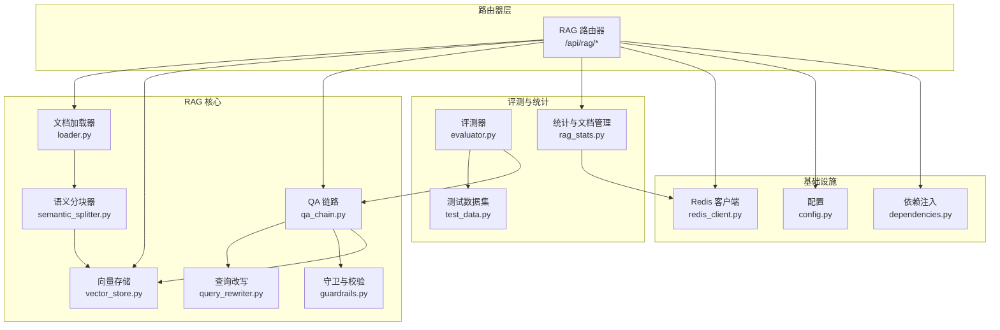
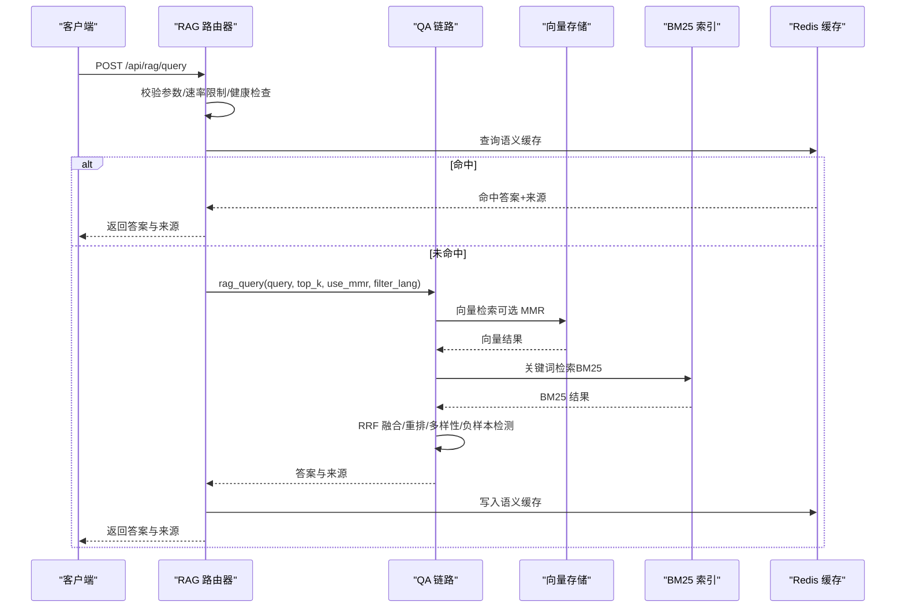
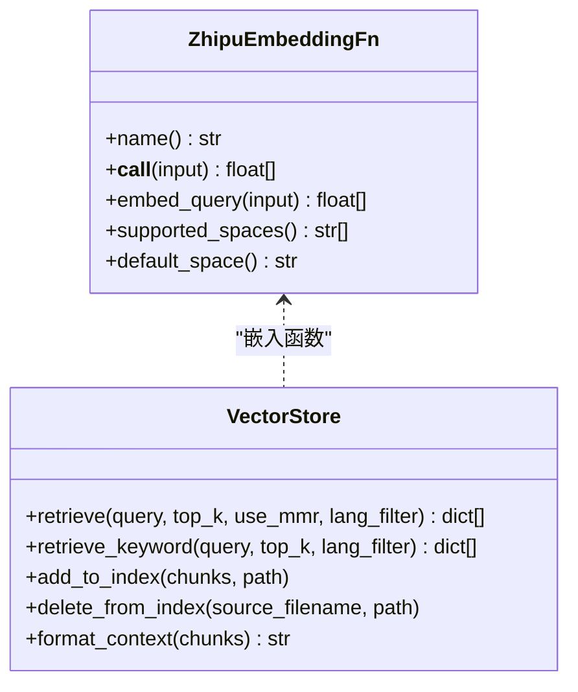
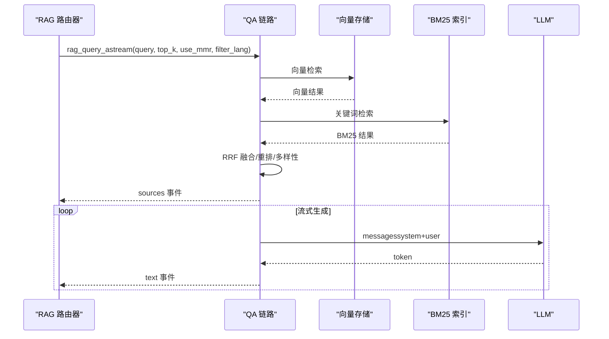
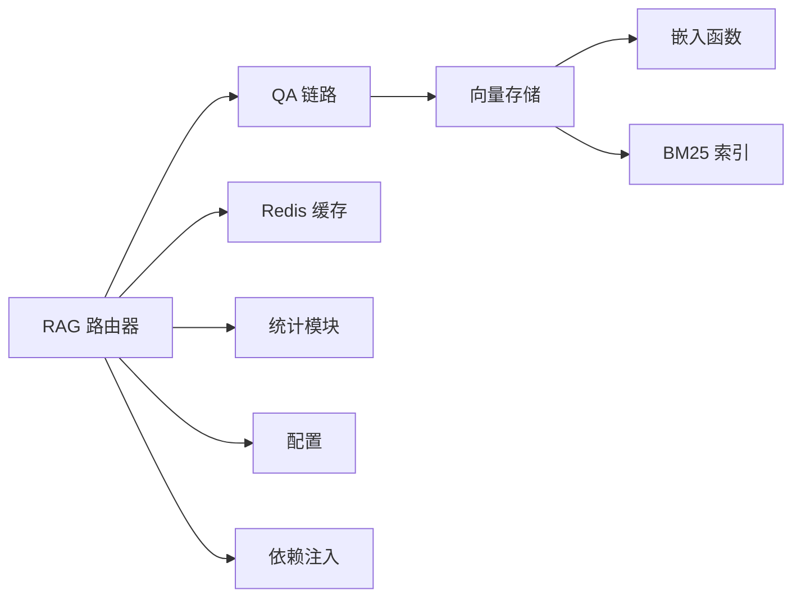

# RAG 路由

<cite>
**本文引用的文件**
- [backend/app/routers/rag.py](file://backend/app/routers/rag.py)
- [backend/app/rag/loader.py](file://backend/app/rag/loader.py)
- [backend/app/rag/vector_store.py](file://backend/app/rag/vector_store.py)
- [backend/app/rag/models.py](file://backend/app/rag/models.py)
- [backend/app/rag/qa_chain.py](file://backend/app/rag/qa_chain.py)
- [backend/app/rag/semantic_splitter.py](file://backend/app/rag/semantic_splitter.py)
- [backend/app/rag/guardrails.py](file://backend/app/rag/guardrails.py)
- [backend/app/rag/test_data.py](file://backend/app/rag/test_data.py)
- [backend/app/rag/evaluator.py](file://backend/app/rag/evaluator.py)
- [backend/app/rag/query_rewriter.py](file://backend/app/rag/query_rewriter.py)
- [backend/app/cache/redis_client.py](file://backend/app/cache/redis_client.py)
- [backend/app/api/rag_stats.py](file://backend/app/api/rag_stats.py)
- [backend/app/dependencies.py](file://backend/app/dependencies.py)
- [backend/app/config.py](file://backend/app/config.py)
</cite>

## 目录
1. [简介](#简介)
2. [项目结构](#项目结构)
3. [核心组件](#核心组件)
4. [架构总览](#架构总览)
5. [详细组件分析](#详细组件分析)
6. [依赖分析](#依赖分析)
7. [性能考量](#性能考量)
8. [故障排除指南](#故障排除指南)
9. [结论](#结论)
10. [附录](#附录)

## 简介
本文件为 RAG 路由模块的全面技术文档，聚焦于文档管理、索引操作、查询处理与知识库集成。文档详细阐述路由端点设计模式、文件上传与增量索引、向量存储与关键字检索、文档加载器与分块策略、嵌入模型集成、参数校验与错误处理、性能优化策略，并提供 API 调用示例、数据流转过程与故障排除建议。

## 项目结构
RAG 路由位于后端应用的路由器层，围绕以下关键模块组织：
- 路由器层：提供 REST API 端点，负责请求接入、速率限制、参数校验与错误处理
- 加载与分块：解析多格式文档、抽取元数据、中文语义分块
- 向量存储：ChromaDB 持久化、本地/远端嵌入、BM25 关键词检索
- QA 链路：混合检索（BM25 + 向量）、重排与多样性选择、流式生成与缓存
- 评测与基准：召回、可信度（LLM-as-judge）、延迟评测与报告
- 缓存与统计：Redis 语义缓存、查询统计与仪表盘数据源
- 配置与依赖：统一配置、Redis 依赖注入



图表来源
- [backend/app/routers/rag.py:1-566](file://backend/app/routers/rag.py#L1-L566)
- [backend/app/rag/loader.py:1-224](file://backend/app/rag/loader.py#L1-L224)
- [backend/app/rag/semantic_splitter.py:1-220](file://backend/app/rag/semantic_splitter.py#L1-L220)
- [backend/app/rag/vector_store.py:1-800](file://backend/app/rag/vector_store.py#L1-L800)
- [backend/app/rag/qa_chain.py:1-800](file://backend/app/rag/qa_chain.py#L1-L800)
- [backend/app/rag/query_rewriter.py:1-145](file://backend/app/rag/query_rewriter.py#L1-L145)
- [backend/app/rag/guardrails.py:1-70](file://backend/app/rag/guardrails.py#L1-L70)
- [backend/app/rag/evaluator.py:1-192](file://backend/app/rag/evaluator.py#L1-L192)
- [backend/app/rag/test_data.py:1-919](file://backend/app/rag/test_data.py#L1-L919)
- [backend/app/api/rag_stats.py:1-426](file://backend/app/api/rag_stats.py#L1-L426)
- [backend/app/cache/redis_client.py:1-161](file://backend/app/cache/redis_client.py#L1-L161)
- [backend/app/config.py:1-90](file://backend/app/config.py#L1-L90)
- [backend/app/dependencies.py:1-38](file://backend/app/dependencies.py#L1-L38)

章节来源
- [backend/app/routers/rag.py:1-566](file://backend/app/routers/rag.py#L1-L566)

## 核心组件
- 路由器与端点
  - 查询类：POST /api/rag/query（带缓存）、POST /api/rag/query/stream（SSE 流式）
  - 索引类：POST /api/rag/index（重建索引）、GET /api/rag/index/status（索引健康）
  - 文档类：POST /api/rag/upload（上传并增量索引）、GET /api/rag/uploads（列出）、DELETE /api/rag/upload/{filename}（删除）
  - 评测与实验：POST /api/rag/evaluate（召回/可信度/延迟）、POST /api/rag/experiment（提示策略实验）
  - 健康与基准：GET /api/rag/health（系统健康）、GET /api/rag/benchmark（评测结果）
  - 缓存与建议：POST /api/rag/cache/clear（清理缓存）、GET /api/rag/suggestions（查询建议）

- 参数模型与校验
  - RAGQueryRequest：查询文本、top_k、use_mmr、language、model；含最小长度、最大长度与空白清理
  - 响应模型：RAGQueryResponse、RAGIndexResponse、RAGUploadResponse

- 缓存与统计
  - Redis 语义缓存：查询哈希命中、命中/未命中计数、降级内存缓存
  - 查询统计：24 小时查询量、平均延迟、最近查询、意图分类、令牌用量、小时级查询量

章节来源
- [backend/app/routers/rag.py:86-566](file://backend/app/routers/rag.py#L86-L566)
- [backend/app/rag/models.py:1-56](file://backend/app/rag/models.py#L1-L56)
- [backend/app/cache/redis_client.py:1-161](file://backend/app/cache/redis_client.py#L1-L161)
- [backend/app/api/rag_stats.py:1-426](file://backend/app/api/rag_stats.py#L1-L426)

## 架构总览
RAG 路由采用“端点 → 链路 → 存储”的分层设计：
- 端点层：统一速率限制、参数校验、错误处理、健康检查
- 链路层：混合检索（BM25 + 向量）、重排与多样性、负样本检测、流式生成与缓存
- 存储层：ChromaDB 向量库 + 本地/远端嵌入 + 内存 BM25 索引



图表来源
- [backend/app/routers/rag.py:86-131](file://backend/app/routers/rag.py#L86-L131)
- [backend/app/rag/qa_chain.py:582-651](file://backend/app/rag/qa_chain.py#L582-L651)
- [backend/app/rag/vector_store.py:663-741](file://backend/app/rag/vector_store.py#L663-L741)
- [backend/app/cache/redis_client.py:106-145](file://backend/app/cache/redis_client.py#L106-L145)

## 详细组件分析

### 路由端点与设计模式
- 设计要点
  - 速率限制：基于 IP 的限速装饰器，保护下游服务
  - 参数校验：Pydantic 模型约束输入范围与格式
  - 错误处理：HTTP 异常与结构化日志，区分业务错误与系统错误
  - 健康检查：索引状态、嵌入提供者、BM25 统计、LLM 配置
  - SSE 流式：事件缓冲与首字延迟优化，跨端点兼容缓存

- 端点职责
  - 查询端点：支持缓存命中与流式两种模式，自动记录统计
  - 索引端点：重建向量索引、清空缓存、强制重建 BM25
  - 上传端点：文件安全校验、格式限制、增量索引与元数据更新
  - 评测端点：召回、可信度、延迟评测，支持实验策略对比

章节来源
- [backend/app/routers/rag.py:86-566](file://backend/app/routers/rag.py#L86-L566)

### 文档加载器与分块策略
- 加载器能力
  - 支持 .md/.txt/.pdf/.docx/.xlsx，解析 YAML frontmatter，抽取元数据
  - 自动语言检测，优先 frontmatter 指定语言
  - 统一输出结构：metadata + content

- 分块策略
  - 固定大小 + 重叠（适配向量检索）
  - 语义分块（中文感知）：基于句子边界与嵌入相似度的断点检测，结合百分位阈值
  - 大块拆分与小块合并：保证语义连贯与大小上限

```mermaid
flowchart TD
Start(["开始：原始文档"]) --> Load["加载文档<br/>.md/.txt/.pdf/.docx/.xlsx]
Load --> Frontmatter["解析 Frontmatter<br/>提取元数据"]
Frontmatter --> DetectLang["语言检测<br/>优先 frontmatter"]
DetectLang --> SplitFixed["固定分块<br/>大小+重叠"]
SplitFixed --> SplitSem["语义分块<br/>句子+相似度断点"]
SplitSem --> MergeSmall["合并小块<br/>避免碎片"]
MergeSmall --> LimitSize["限制最大块大小<br/>段落边界拆分"]
LimitSize --> Output["输出：chunks文本+元数据"]
```

图表来源
- [backend/app/rag/loader.py:47-224](file://backend/app/rag/loader.py#L47-L224)
- [backend/app/rag/semantic_splitter.py:81-220](file://backend/app/rag/semantic_splitter.py#L81-L220)

章节来源
- [backend/app/rag/loader.py:1-224](file://backend/app/rag/loader.py#L1-L224)
- [backend/app/rag/semantic_splitter.py:1-220](file://backend/app/rag/semantic_splitter.py#L1-L220)

### 向量存储与检索实现
- 存储与嵌入
  - ChromaDB 持久化集合，自定义嵌入函数（多提供商回退）
  - 本地 BGE 模型（可禁用），DashScope、SiliconFlow、Zhipu API
  - 嵌入缓存：内存 + Redis，FIFO 淘汰，文本哈希键

- 检索策略
  - 向量检索：支持 MMR 多样性与语言过滤
  - 关键词检索（BM25）：内存索引，预分词、IDF、Boost 英文词
  - 混合检索：RRF 融合、去重（按 slug）、标题关键词 Boost、重排与多样性选择
  - 负样本检测：阈值门控 + LLM 分类器（可配置）



图表来源
- [backend/app/rag/vector_store.py:517-540](file://backend/app/rag/vector_store.py#L517-L540)
- [backend/app/rag/vector_store.py:663-741](file://backend/app/rag/vector_store.py#L663-L741)

章节来源
- [backend/app/rag/vector_store.py:1-800](file://backend/app/rag/vector_store.py#L1-L800)

### QA 链路与流式生成
- 链路步骤
  - 检索：混合检索（BM25 + 向量）→ RRF 融合 → 重排 → 多样性选择
  - 负样本检测：关键词快速过滤 + LLM 分类器
  - 上下文格式化：优先父块（Parent-Child）丰富上下文
  - 生成：系统提示 + 查询 + 上下文
  - 响应：答案 + 来源清单（标题、slug、片段、得分）

- 流式生成
  - 先返回来源与引用片段，再流式输出答案 token
  - 缓冲策略：首包立即输出，随后按时间/字符阈值刷新



图表来源
- [backend/app/rag/qa_chain.py:653-754](file://backend/app/rag/qa_chain.py#L653-L754)
- [backend/app/rag/vector_store.py:663-741](file://backend/app/rag/vector_store.py#L663-L741)

章节来源
- [backend/app/rag/qa_chain.py:582-754](file://backend/app/rag/qa_chain.py#L582-L754)

### 查询改写与跨文章检索
- 查询改写
  - LLM 将口语化表达规范化，扩展缩写与指代，生成主查询与变体
  - 规则扩展：无 LLM 时按连接词拆分与意图词剥离

- 跨文章检索
  - 检测跨文章/对比意图，对变体分别检索并 RRF 融合
  - 多样性选择：按文章去重后填充剩余槽位

章节来源
- [backend/app/rag/query_rewriter.py:1-145](file://backend/app/rag/query_rewriter.py#L1-L145)
- [backend/app/rag/qa_chain.py:301-411](file://backend/app/rag/qa_chain.py#L301-L411)

### 评测与基准
- 评测指标
  - 召回@k：期望文章是否出现在 top-k
  - 可信度：LLM-as-judge 评分（0-10）
  - 延迟：p50/p99/均值

- 基准数据
  - 统一的问答对数据集，覆盖事实、推理、合成、否定、跨文章等类别

章节来源
- [backend/app/rag/evaluator.py:1-192](file://backend/app/rag/evaluator.py#L1-L192)
- [backend/app/rag/test_data.py:1-919](file://backend/app/rag/test_data.py#L1-L919)

### 缓存与统计
- 语义缓存
  - 命中：直接返回 JSON（答案+来源）
  - 未命中：执行链路后写入缓存（Redis + 内存）
  - 降级：Redis 不可用时仅内存缓存

- 查询统计
  - 24 小时查询量、平均延迟、缓存命中率
  - 最近查询、意图分类、令牌用量、小时级查询量
  - 文档管理：按来源分组统计

章节来源
- [backend/app/cache/redis_client.py:1-161](file://backend/app/cache/redis_client.py#L1-L161)
- [backend/app/api/rag_stats.py:1-426](file://backend/app/api/rag_stats.py#L1-L426)

### 守卫与校验
- 幻觉检测：基于 LLM 的评分与理由
- 引用校验：从答案中提取引用并核对来源清单

章节来源
- [backend/app/rag/guardrails.py:1-70](file://backend/app/rag/guardrails.py#L1-L70)

## 依赖分析
- 组件耦合
  - 路由器依赖 QA 链路与向量存储；QA 链路依赖检索与嵌入；向量存储依赖嵌入函数与 BM25 索引
  - 缓存与统计模块与路由器松耦合，通过依赖注入与异常隔离

- 外部依赖
  - Redis：语义缓存与统计
  - ChromaDB：向量存储
  - LLM 与嵌入 API：多提供商回退链
  - Elasticsearch（可选）：BM25 后端



图表来源
- [backend/app/routers/rag.py:1-566](file://backend/app/routers/rag.py#L1-L566)
- [backend/app/rag/qa_chain.py:1-800](file://backend/app/rag/qa_chain.py#L1-L800)
- [backend/app/rag/vector_store.py:1-800](file://backend/app/rag/vector_store.py#L1-L800)
- [backend/app/cache/redis_client.py:1-161](file://backend/app/cache/redis_client.py#L1-L161)
- [backend/app/api/rag_stats.py:1-426](file://backend/app/api/rag_stats.py#L1-L426)
- [backend/app/config.py:1-90](file://backend/app/config.py#L1-L90)
- [backend/app/dependencies.py:1-38](file://backend/app/dependencies.py#L1-L38)

章节来源
- [backend/app/routers/rag.py:1-566](file://backend/app/routers/rag.py#L1-L566)
- [backend/app/rag/qa_chain.py:1-800](file://backend/app/rag/qa_chain.py#L1-L800)
- [backend/app/rag/vector_store.py:1-800](file://backend/app/rag/vector_store.py#L1-L800)
- [backend/app/cache/redis_client.py:1-161](file://backend/app/cache/redis_client.py#L1-L161)
- [backend/app/api/rag_stats.py:1-426](file://backend/app/api/rag_stats.py#L1-L426)
- [backend/app/config.py:1-90](file://backend/app/config.py#L1-L90)
- [backend/app/dependencies.py:1-38](file://backend/app/dependencies.py#L1-L38)

## 性能考量
- 检索性能
  - BM25 内存索引预构建，避免重复分词与查询时计算
  - RRF 融合与多样性选择在候选集上进行，控制候选上限
  - 向量检索支持 MMR 与语言过滤，减少噪声

- 生成性能
  - 语义缓存命中直接返回，显著降低 LLM 调用
  - 流式生成首字延迟优化，缓冲策略平衡 TTFT 与吞吐

- 存储与嵌入
  - 嵌入缓存（内存+Redis）与维度自适应（自动切换 API 嵌入）
  - 批量嵌入与重试退避，降低 API 失败率

- 运行时优化
  - 速率限制与健康检查，避免雪崩
  - 统计模块降级内存缓存，保障可观测性

## 故障排除指南
- 常见问题与定位
  - LLM API Key 未配置：查询端点直接报错，检查环境变量
  - 索引为空：查询端点返回无上下文提示，调用重建索引端点
  - Redis 不可用：语义缓存与统计降级内存模式，不影响查询
  - 嵌入维度不匹配：自动切换 API 嵌入并清空错误缓存
  - 文件上传失败：检查文件大小、格式与路径遍历防护

- 排查步骤
  - 查看健康端点：确认索引状态、嵌入提供者、BM25 统计
  - 清理缓存：调用缓存清理端点，强制重新生成
  - 重建索引：触发重建并清空缓存，必要时强制重建 BM25
  - 检查统计：查看最近查询与命中率，定位热点与异常

章节来源
- [backend/app/routers/rag.py:86-566](file://backend/app/routers/rag.py#L86-L566)
- [backend/app/cache/redis_client.py:1-161](file://backend/app/cache/redis_client.py#L1-L161)
- [backend/app/api/rag_stats.py:1-426](file://backend/app/api/rag_stats.py#L1-L426)
- [backend/app/rag/vector_store.py:690-718](file://backend/app/rag/vector_store.py#L690-L718)

## 结论
RAG 路由模块通过清晰的端点设计、稳健的检索链路与完善的缓存统计体系，实现了高效、可扩展的知识库问答能力。其混合检索、语义分块与流式生成等特性，兼顾了准确性与用户体验。建议在生产环境中启用健康检查与缓存清理策略，结合评测与统计持续优化检索与生成质量。

## 附录

### API 调用示例（路径与要点）
- 查询（带缓存）
  - 方法与路径：POST /api/rag/query
  - 请求体：RAGQueryRequest（query、top_k、use_mmr、language、model）
  - 响应：RAGQueryResponse（answer、sources）
  - 参考路径：[backend/app/routers/rag.py:86-131](file://backend/app/routers/rag.py#L86-L131)

- 流式查询（SSE）
  - 方法与路径：POST /api/rag/query/stream
  - 事件：sources → text（多次）→ cache_hit/done
  - 参考路径：[backend/app/routers/rag.py:133-267](file://backend/app/routers/rag.py#L133-L267)

- 重建索引
  - 方法与路径：POST /api/rag/index
  - 行为：重建向量索引、清空缓存、强制重建 BM25
  - 参考路径：[backend/app/routers/rag.py:270-302](file://backend/app/routers/rag.py#L270-L302)

- 上传并增量索引
  - 方法与路径：POST /api/rag/upload
  - 参数：file、language、title、api_key（可选）
  - 行为：安全校验 → 保存 → 增量索引 → 更新元数据
  - 参考路径：[backend/app/routers/rag.py:325-397](file://backend/app/routers/rag.py#L325-L397)

- 列出与删除上传文件
  - GET /api/rag/uploads
  - DELETE /api/rag/upload/{filename}
  - 参考路径：[backend/app/routers/rag.py:400-440](file://backend/app/routers/rag.py#L400-L440)

- 评测与实验
  - POST /api/rag/evaluate
  - POST /api/rag/experiment
  - 参考路径：[backend/app/routers/rag.py:442-481](file://backend/app/routers/rag.py#L442-L481)

- 健康与基准
  - GET /api/rag/health
  - GET /api/rag/benchmark
  - 参考路径：[backend/app/routers/rag.py:483-535](file://backend/app/routers/rag.py#L483-L535)

- 缓存清理与建议
  - POST /api/rag/cache/clear
  - GET /api/rag/suggestions
  - 参考路径：[backend/app/routers/rag.py:537-566](file://backend/app/routers/rag.py#L537-L566)

### 数据模型与字段
- RAGQueryRequest
  - 字段：query（1-1000）、top_k（1-20）、use_mmr（布尔）、language（可选 zh/en）、model（可选）
  - 参考路径：[backend/app/rag/models.py:9-29](file://backend/app/rag/models.py#L9-L29)

- RAGQueryResponse
  - 字段：answer、sources（title、slug、chunk、score）
  - 参考路径：[backend/app/rag/models.py:31-41](file://backend/app/rag/models.py#L31-L41)

- RAGIndexResponse / RAGUploadResponse
  - 字段：status、documents_indexed、chunks_created、elapsed_seconds
  - 参考路径：[backend/app/rag/models.py:43-56](file://backend/app/rag/models.py#L43-L56)