# 分析路由

<cite>
**本文引用的文件**
- [backend/app/api/analytics.py](file://backend/app/api/analytics.py)
- [backend/app/api/rag_stats.py](file://backend/app/api/rag_stats.py)
- [backend/app/dependencies.py](file://backend/app/dependencies.py)
- [src/hooks/useAnalytics.ts](file://src/hooks/useAnalytics.ts)
- [src/pages/Analytics.tsx](file://src/pages/Analytics.tsx)
- [src/components/dashboard/QueryVolumeChart.tsx](file://src/components/dashboard/QueryVolumeChart.tsx)
- [src/components/dashboard/MetricGrid.tsx](file://src/components/dashboard/MetricGrid.tsx)
- [src/services/api.ts](file://src/services/api.ts)
</cite>

## 目录
1. [简介](#简介)
2. [项目结构](#项目结构)
3. [核心组件](#核心组件)
4. [架构概览](#架构概览)
5. [详细组件分析](#详细组件分析)
6. [依赖关系分析](#依赖关系分析)
7. [性能考虑](#性能考虑)
8. [故障排除指南](#故障排除指南)
9. [结论](#结论)

## 简介
本文件详细分析了分析路由模块的技术实现，涵盖查询统计、性能指标、用户行为分析和系统健康监控等功能。该模块通过FastAPI提供REST接口，结合Redis进行实时数据收集和统计，并在Redis不可用时提供内存降级方案。前端通过React Hook进行数据获取和展示，支持多种时间范围的统计分析。

## 项目结构
分析路由模块主要分布在后端API层和前端界面层：

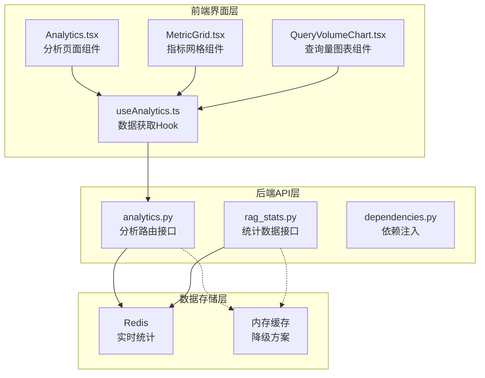

**图表来源**
- [backend/app/api/analytics.py:1-289](file://backend/app/api/analytics.py#L1-L289)
- [backend/app/api/rag_stats.py:1-426](file://backend/app/api/rag_stats.py#L1-L426)
- [src/hooks/useAnalytics.ts:51-104](file://src/hooks/useAnalytics.ts#L51-L104)

**章节来源**
- [backend/app/api/analytics.py:1-289](file://backend/app/api/analytics.py#L1-L289)
- [backend/app/api/rag_stats.py:1-426](file://backend/app/api/rag_stats.py#L1-L426)

## 核心组件
分析路由模块包含四个主要的统计接口：

### 1. 查询使用量统计
- **接口路径**: `/api/rag/analytics/usage`
- **功能**: 统计总查询次数、按意图分类的查询分布、每小时查询量
- **数据来源**: Redis哈希表和计数器
- **降级方案**: 内存中的查询计数器

### 2. 延迟性能统计
- **接口路径**: `/api/rag/analytics/latency`
- **功能**: 平均延迟、P95/P99延迟、检索vsLLM性能分解
- **数据来源**: Redis有序集合存储延迟数据
- **统计方法**: 使用Python statistics模块计算分位数

### 3. Token使用统计
- **接口路径**: `/api/rag/analytics/tokens`
- **功能**: 输入/输出token统计、估算成本、每查询成本
- **定价模型**: 支持多种模型的token定价
- **时间维度**: 按日期聚合token使用情况

### 4. 缓存性能统计
- **接口路径**: `/api/rag/analytics/cache`
- **功能**: 缓存命中率、节省的查询次数、内存使用情况
- **监控指标**: Redis内存信息和缓存统计

**章节来源**
- [backend/app/api/analytics.py:16-72](file://backend/app/api/analytics.py#L16-L72)
- [backend/app/api/analytics.py:75-164](file://backend/app/api/analytics.py#L75-L164)
- [backend/app/api/analytics.py:167-239](file://backend/app/api/analytics.py#L167-L239)
- [backend/app/api/analytics.py:242-288](file://backend/app/api/analytics.py#L242-L288)

## 架构概览
分析路由采用分层架构设计，确保高可用性和可扩展性：

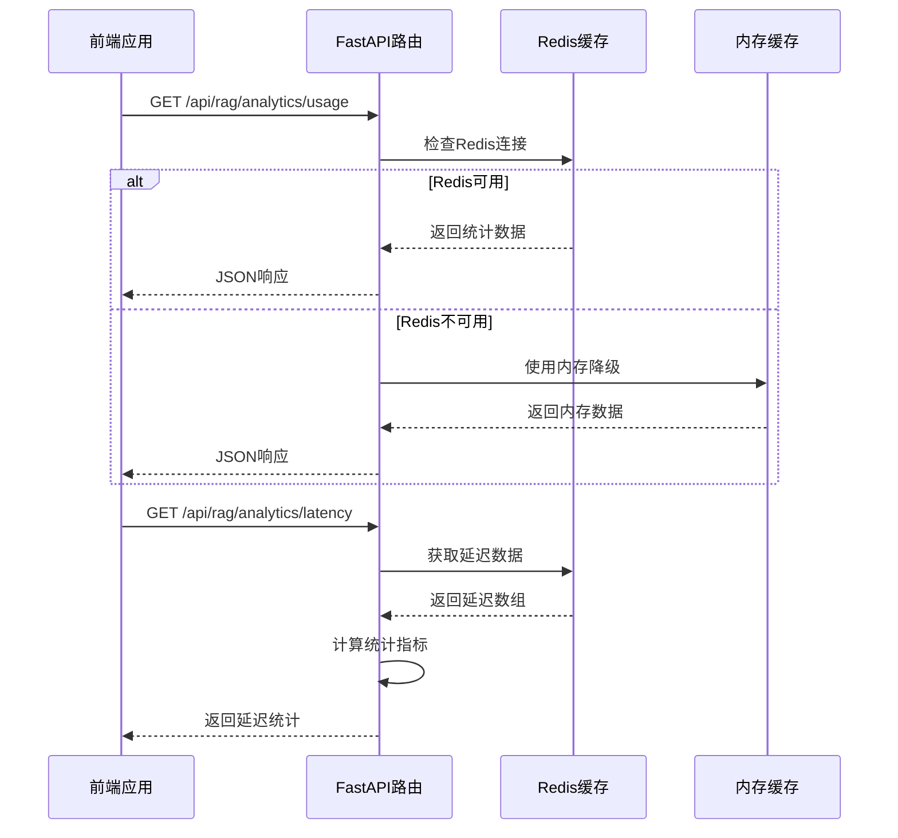

**图表来源**
- [backend/app/api/analytics.py:28-72](file://backend/app/api/analytics.py#L28-L72)
- [backend/app/api/analytics.py:90-164](file://backend/app/api/analytics.py#L90-L164)

### 数据流架构
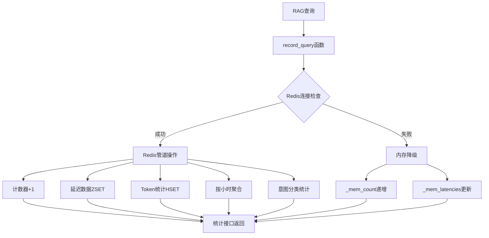

**图表来源**
- [backend/app/api/rag_stats.py:46-139](file://backend/app/api/rag_stats.py#L46-L139)

## 详细组件分析

### 后端API组件分析

#### AnalyticsRouter类结构
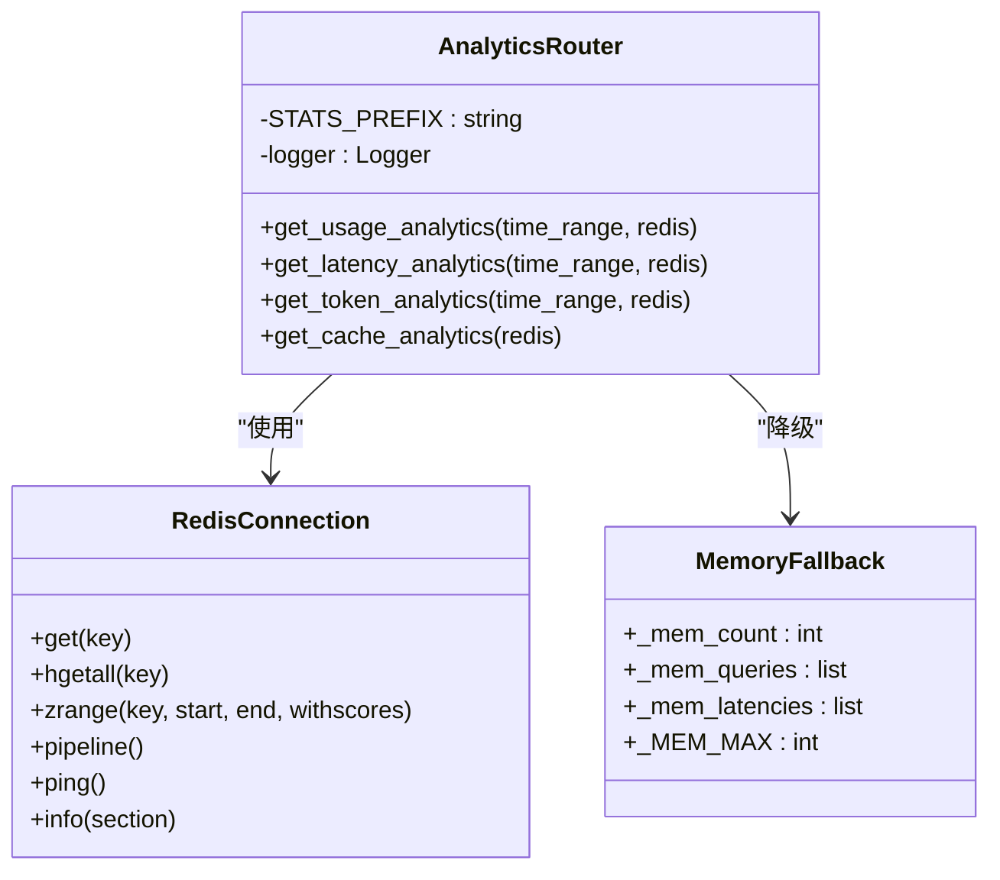

**图表来源**
- [backend/app/api/analytics.py:11](file://backend/app/api/analytics.py#L11)
- [backend/app/api/rag_stats.py:39-43](file://backend/app/api/rag_stats.py#L39-L43)

#### 统计接口实现模式
每个统计接口都遵循相同的实现模式：

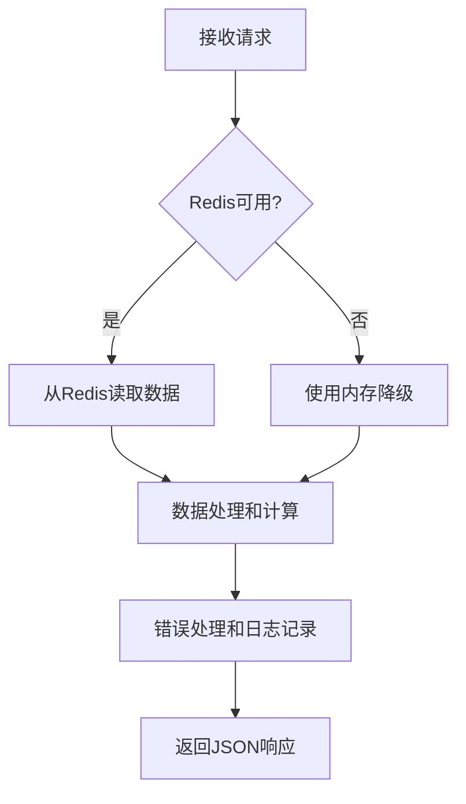

**图表来源**
- [backend/app/api/analytics.py:42-72](file://backend/app/api/analytics.py#L42-L72)
- [backend/app/api/analytics.py:113-164](file://backend/app/api/analytics.py#L113-L164)

**章节来源**
- [backend/app/api/analytics.py:1-289](file://backend/app/api/analytics.py#L1-L289)

### 前端集成组件分析

#### useAnalytics Hook数据获取流程
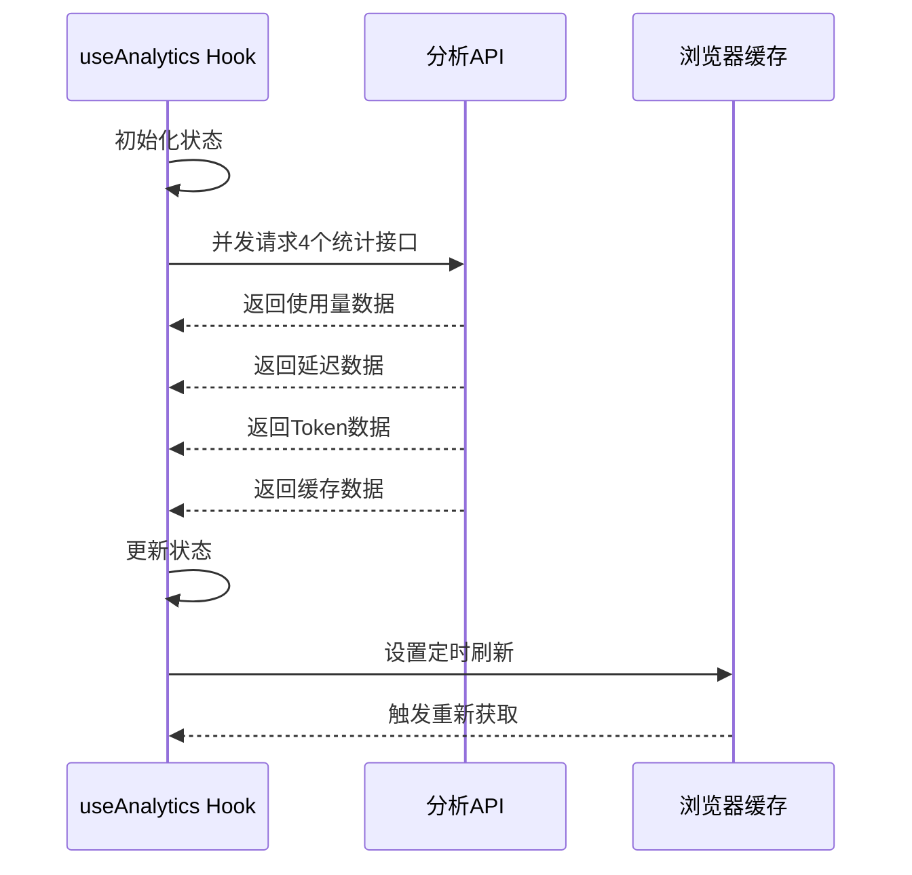

**图表来源**
- [src/hooks/useAnalytics.ts:56-88](file://src/hooks/useAnalytics.ts#L56-L88)

#### 前端组件渲染流程
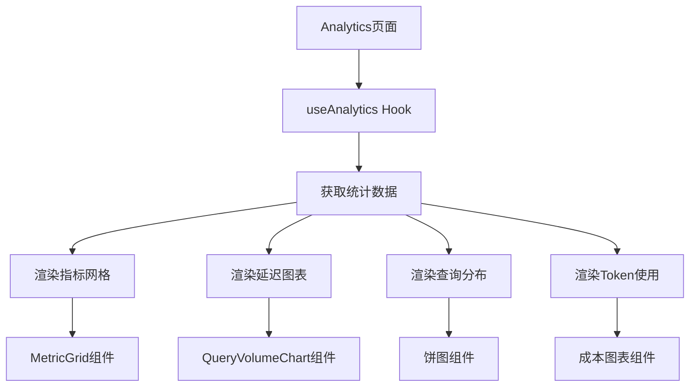

**图表来源**
- [src/pages/Analytics.tsx:78-156](file://src/pages/Analytics.tsx#L78-L156)
- [src/components/dashboard/MetricGrid.tsx](file://src/components/dashboard/MetricGrid.tsx)
- [src/components/dashboard/QueryVolumeChart.tsx](file://src/components/dashboard/QueryVolumeChart.tsx)

**章节来源**
- [src/hooks/useAnalytics.ts:51-104](file://src/hooks/useAnalytics.ts#L51-L104)
- [src/pages/Analytics.tsx:1-156](file://src/pages/Analytics.tsx#L1-L156)

### 数据模型定义

#### 统计响应数据模型
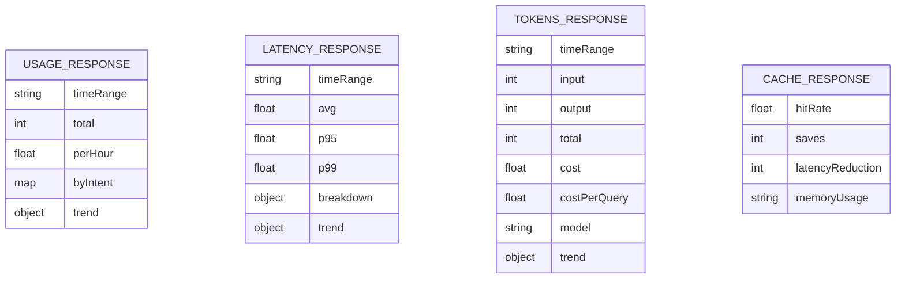

**图表来源**
- [backend/app/api/analytics.py:54-63](file://backend/app/api/analytics.py#L54-L63)
- [backend/app/api/analytics.py:140-154](file://backend/app/api/analytics.py#L140-L154)
- [backend/app/api/analytics.py:214-227](file://backend/app/api/analytics.py#L214-L227)
- [backend/app/api/analytics.py:275-280](file://backend/app/api/analytics.py#L275-L280)

**章节来源**
- [backend/app/api/analytics.py:16-239](file://backend/app/api/analytics.py#L16-L239)

## 依赖关系分析

### Redis数据结构设计
分析路由使用多种Redis数据结构进行高效统计：

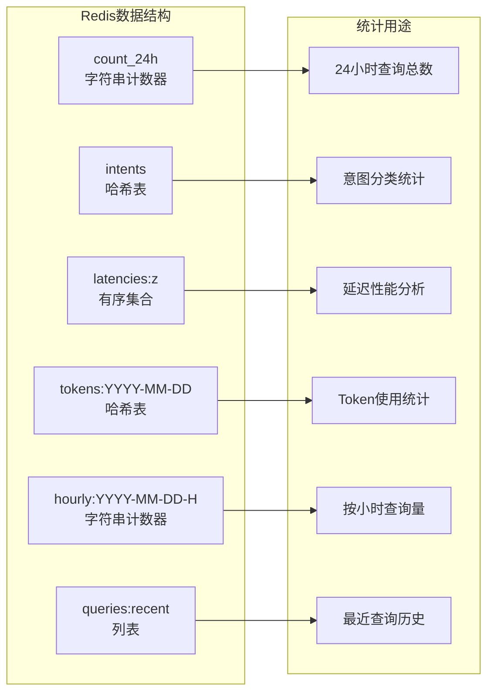

**图表来源**
- [backend/app/api/rag_stats.py:92-126](file://backend/app/api/rag_stats.py#L92-L126)

### 依赖注入机制
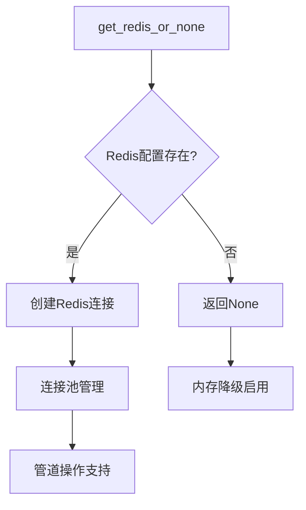

**图表来源**
- [backend/app/dependencies.py](file://backend/app/dependencies.py)

**章节来源**
- [backend/app/api/rag_stats.py:63-139](file://backend/app/api/rag_stats.py#L63-L139)
- [backend/app/dependencies.py](file://backend/app/dependencies.py)

## 性能考虑

### 缓存策略优化
1. **Redis管道操作**: 批量执行多个Redis命令，减少网络往返
2. **数据过期策略**: 
   - 24小时查询计数器自动过期
   - 7天Token统计保留期
   - 2天按小时统计保留期
3. **内存限制**: 内存缓存最多保存100条查询记录

### 查询优化技术
1. **有序集合索引**: 延迟数据按分数排序，便于快速统计
2. **哈希表聚合**: 意图分类和Token统计使用哈希表高效更新
3. **列表截断**: 最近查询列表保持固定长度，避免无限增长

### 前端性能优化
1. **并发数据获取**: 使用Promise.all并行请求多个统计接口
2. **状态管理**: React Hook集中管理分析数据状态
3. **组件懒加载**: 图表组件按需渲染，提升初始加载速度

## 故障排除指南

### 常见问题诊断
1. **Redis连接失败**
   - 检查Redis服务器状态
   - 验证连接配置参数
   - 查看内存降级日志

2. **统计数据异常**
   - 检查Redis数据完整性
   - 验证统计键名格式
   - 确认数据过期时间设置

3. **前端数据显示空白**
   - 检查API响应状态码
   - 验证数据格式兼容性
   - 查看浏览器控制台错误

### 错误处理机制
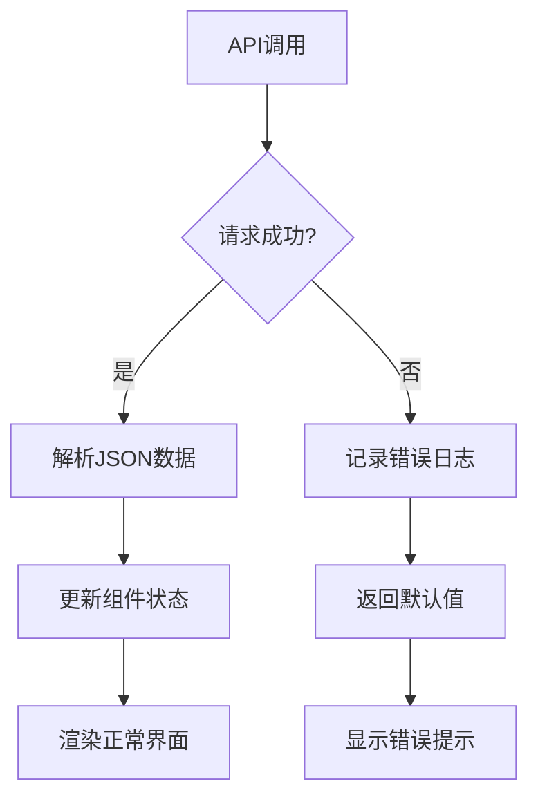

**图表来源**
- [backend/app/api/analytics.py:64-72](file://backend/app/api/analytics.py#L64-L72)
- [backend/app/api/analytics.py:155-164](file://backend/app/api/analytics.py#L155-L164)

**章节来源**
- [backend/app/api/analytics.py:64-72](file://backend/app/api/analytics.py#L64-L72)
- [backend/app/api/analytics.py:155-164](file://backend/app/api/analytics.py#L155-L164)

## 结论
分析路由模块提供了完整的系统监控和统计分析能力，通过Redis实现高性能的实时数据收集，同时具备可靠的内存降级机制。前后端分离的设计使得数据获取和展示更加灵活，支持多种时间范围的统计分析和可视化展示。该模块为RAG系统的性能优化和用户体验提升提供了重要的数据支撑。