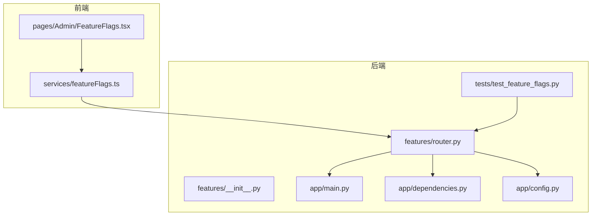
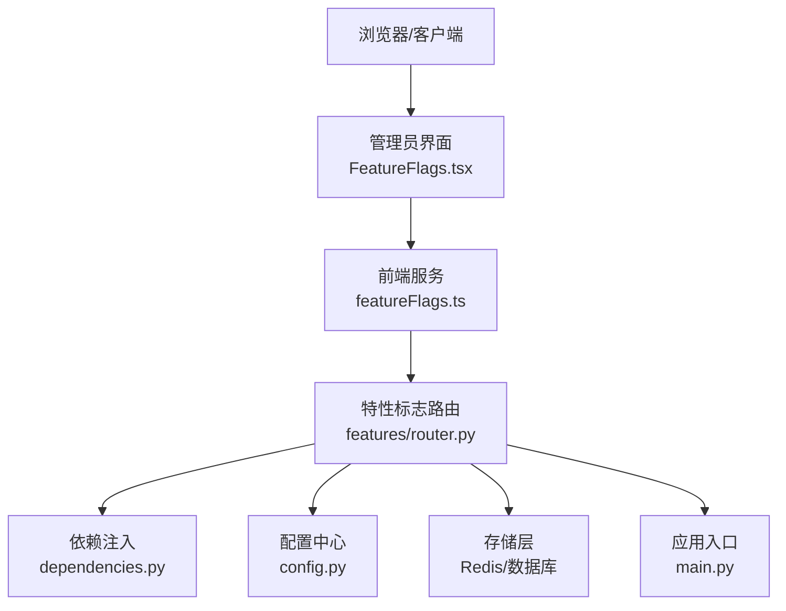
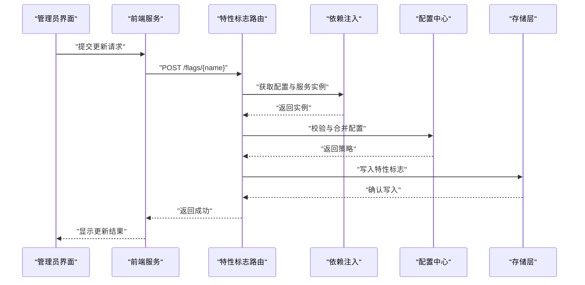
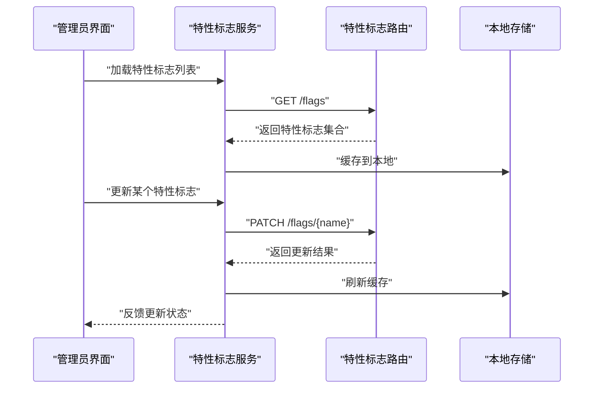
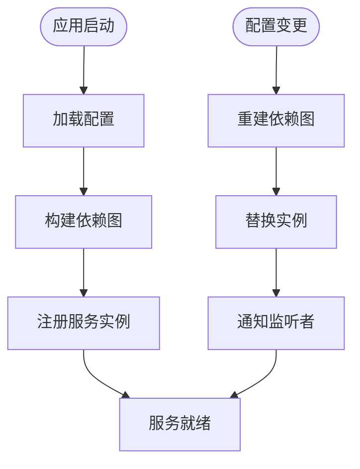
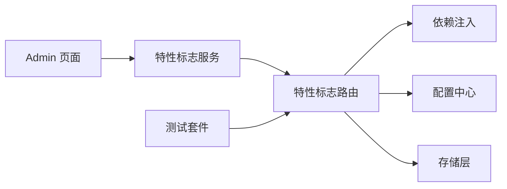

# 功能路由

<cite>
**本文引用的文件**
- [backend/app/features/router.py](file://backend/app/features/router.py)
- [backend/app/features/__init__.py](file://backend/app/features/__init__.py)
- [backend/tests/test_feature_flags.py](file://backend/tests/test_feature_flags.py)
- [src/pages/Admin/FeatureFlags.tsx](file://src/pages/Admin/FeatureFlags.tsx)
- [src/services/featureFlags.ts](file://src/services/featureFlags.ts)
- [backend/app/main.py](file://backend/app/main.py)
- [backend/app/dependencies.py](file://backend/app/dependencies.py)
- [backend/app/config.py](file://backend/app/config.py)
- [docs/product/features.md](file://docs/product/features.md)
</cite>

## 目录
1. [简介](#简介)
2. [项目结构](#项目结构)
3. [核心组件](#核心组件)
4. [架构总览](#架构总览)
5. [详细组件分析](#详细组件分析)
6. [依赖分析](#依赖分析)
7. [性能考虑](#性能考虑)
8. [故障排除指南](#故障排除指南)
9. [结论](#结论)
10. [附录](#附录)

## 简介
本技术文档围绕功能路由模块展开，重点阐述特性标志（Feature Flags）的管理与动态配置能力，涵盖功能开关控制、A/B 测试支持以及渐进式发布策略。文档同时说明特性标志的存储机制、更新流程与客户端同步方式，解析依赖注入系统在运行时的配置管理与调整能力，并给出功能路由的 API 设计、请求响应格式与版本兼容性处理建议。最后提供实际的功能开关示例、部署策略与回滚机制。

## 项目结构
功能路由相关的核心代码位于后端 features 模块，前端提供管理员页面与服务层用于特性标志的查询与更新。测试用例覆盖特性标志的逻辑验证。产品文档对特性标志的业务价值与使用场景进行了说明。

**图表来源**
- [backend/app/features/router.py](file://backend/app/features/router.py)
- [backend/app/features/__init__.py](file://backend/app/features/__init__.py)
- [backend/app/main.py](file://backend/app/main.py)
- [backend/app/dependencies.py](file://backend/app/dependencies.py)
- [backend/app/config.py](file://backend/app/config.py)
- [backend/tests/test_feature_flags.py](file://backend/tests/test_feature_flags.py)
- [src/pages/Admin/FeatureFlags.tsx](file://src/pages/Admin/FeatureFlags.tsx)
- [src/services/featureFlags.ts](file://src/services/featureFlags.ts)

**章节来源**
- [backend/app/features/router.py](file://backend/app/features/router.py)
- [backend/app/features/__init__.py](file://backend/app/features/__init__.py)
- [backend/tests/test_feature_flags.py](file://backend/tests/test_feature_flags.py)
- [src/pages/Admin/FeatureFlags.tsx](file://src/pages/Admin/FeatureFlags.tsx)
- [src/services/featureFlags.ts](file://src/services/featureFlags.ts)
- [backend/app/main.py](file://backend/app/main.py)
- [backend/app/dependencies.py](file://backend/app/dependencies.py)
- [backend/app/config.py](file://backend/app/config.py)
- [docs/product/features.md](file://docs/product/features.md)

## 核心组件
- 特性标志路由模块：提供特性标志的查询、更新与状态管理接口，作为功能路由的核心入口。
- 前端管理界面与服务：提供管理员页面用于可视化配置特性标志，服务层负责与后端交互。
- 依赖注入系统：通过依赖工厂在运行时注入配置与服务实例，支持动态调整。
- 配置中心：集中管理特性标志的默认值、阈值与分组策略。
- 测试套件：覆盖特性标志的启用/禁用、权重分配与边界条件。

**章节来源**
- [backend/app/features/router.py](file://backend/app/features/router.py)
- [backend/app/features/__init__.py](file://backend/app/features/__init__.py)
- [backend/tests/test_feature_flags.py](file://backend/tests/test_feature_flags.py)
- [src/pages/Admin/FeatureFlags.tsx](file://src/pages/Admin/FeatureFlags.tsx)
- [src/services/featureFlags.ts](file://src/services/featureFlags.ts)
- [backend/app/dependencies.py](file://backend/app/dependencies.py)
- [backend/app/config.py](file://backend/app/config.py)

## 架构总览
功能路由采用“前端管理 + 后端路由 + 依赖注入 + 配置中心”的分层架构。前端通过服务层调用后端特性标志路由，后端根据当前配置与上下文决定是否启用某项功能，并通过依赖注入系统获取所需的运行时资源。

**图表来源**
- [src/pages/Admin/FeatureFlags.tsx](file://src/pages/Admin/FeatureFlags.tsx)
- [src/services/featureFlags.ts](file://src/services/featureFlags.ts)
- [backend/app/features/router.py](file://backend/app/features/router.py)
- [backend/app/dependencies.py](file://backend/app/dependencies.py)
- [backend/app/config.py](file://backend/app/config.py)
- [backend/app/main.py](file://backend/app/main.py)

## 详细组件分析

### 特性标志路由模块（后端）
- 职责边界：提供特性标志的查询与更新接口；根据用户上下文与配置计算最终启用状态；与依赖注入系统协作获取运行时资源。
- 关键流程：
  - 查询流程：接收前端请求 → 解析上下文（如用户ID、流量分组）→ 读取配置与存储 → 计算启用结果 → 返回响应。
  - 更新流程：接收管理员请求 → 校验权限与参数 → 写入配置或存储 → 触发缓存/广播更新 → 返回确认。
- 数据结构与复杂度：
  - 存储：以键值形式保存特性标志及其阈值、分组权重等元数据，查询与更新操作通常为 O(1) 或 O(log N)。
  - 分配算法：支持均匀随机、基于用户ID的哈希分桶、时间窗口等策略，复杂度取决于具体实现。
- 错误处理：对无效参数、未授权访问、存储异常进行捕获并返回标准化错误码与消息。
- 性能优化：引入缓存层减少重复查询；批量更新时采用事务或队列化写入；对热点特性标志进行预热。

**图表来源**
- [src/pages/Admin/FeatureFlags.tsx](file://src/pages/Admin/FeatureFlags.tsx)
- [src/services/featureFlags.ts](file://src/services/featureFlags.ts)
- [backend/app/features/router.py](file://backend/app/features/router.py)
- [backend/app/dependencies.py](file://backend/app/dependencies.py)
- [backend/app/config.py](file://backend/app/config.py)

**章节来源**
- [backend/app/features/router.py](file://backend/app/features/router.py)
- [backend/app/features/__init__.py](file://backend/app/features/__init__.py)
- [backend/app/dependencies.py](file://backend/app/dependencies.py)
- [backend/app/config.py](file://backend/app/config.py)

### 前端特性标志管理（Admin 页面与服务）
- 管理界面：展示所有特性标志列表、当前状态、阈值与分组权重；支持在线编辑与快速切换。
- 服务层：封装与后端的通信，统一处理请求头、认证信息与错误重试；提供本地缓存与批量更新能力。
- 客户端同步：采用轮询或长连接订阅模式，确保前端状态与后端一致；对离线场景提供降级策略（默认值或上一次有效值）。

**图表来源**
- [src/pages/Admin/FeatureFlags.tsx](file://src/pages/Admin/FeatureFlags.tsx)
- [src/services/featureFlags.ts](file://src/services/featureFlags.ts)
- [backend/app/features/router.py](file://backend/app/features/router.py)

**章节来源**
- [src/pages/Admin/FeatureFlags.tsx](file://src/pages/Admin/FeatureFlags.tsx)
- [src/services/featureFlags.ts](file://src/services/featureFlags.ts)

### 依赖注入系统与运行时配置
- 实现原理：通过依赖工厂在应用启动时注册服务实例，在运行时根据配置动态替换或注入新的实现。
- 配置管理：支持环境变量、配置文件与远程配置中心的多源合并；变更后触发服务重建或热更新。
- 运行时调整：允许在不重启服务的情况下调整特性标志策略、阈值与分组权重，确保平滑过渡。

**图表来源**
- [backend/app/dependencies.py](file://backend/app/dependencies.py)
- [backend/app/config.py](file://backend/app/config.py)
- [backend/app/main.py](file://backend/app/main.py)

**章节来源**
- [backend/app/dependencies.py](file://backend/app/dependencies.py)
- [backend/app/config.py](file://backend/app/config.py)
- [backend/app/main.py](file://backend/app/main.py)

### API 接口设计与版本兼容
- 接口定义（示例）：
  - GET /flags：列出所有特性标志及其状态
  - GET /flags/{name}：查询单个特性标志详情
  - PATCH /flags/{name}：更新特性标志（支持启用/禁用、阈值、分组权重）
  - POST /flags/batch：批量更新特性标志
- 请求/响应格式：
  - 请求体：包含特性标志名称、目标状态、阈值、分组权重等字段
  - 响应体：包含更新结果、错误码与消息；成功时返回最新状态
- 版本兼容：
  - 保持向后兼容的字段命名与语义；新增字段采用可选方式
  - 对于破坏性变更，提供迁移脚本与双轨运行期

**章节来源**
- [backend/app/features/router.py](file://backend/app/features/router.py)
- [src/services/featureFlags.ts](file://src/services/featureFlags.ts)

### 存储机制、更新流程与客户端同步
- 存储机制：特性标志元数据存储于配置中心或持久化存储中，状态变化记录审计日志。
- 更新流程：管理员在前端发起更新 → 服务端校验与落库 → 广播变更事件 → 前端刷新缓存。
- 客户端同步：前端定时轮询或订阅变更事件，确保与后端一致；在网络异常时采用本地默认值与重试策略。

**章节来源**
- [backend/app/features/router.py](file://backend/app/features/router.py)
- [src/services/featureFlags.ts](file://src/services/featureFlags.ts)

### A/B 测试与渐进式发布
- A/B 测试：通过分组权重将用户分流至不同实验组，统计指标差异评估效果。
- 渐进式发布：从低阈值开始逐步提升，结合健康监控与告警，安全地扩大流量比例。
- 回滚机制：当检测到异常指标时，立即降低阈值或临时禁用，必要时回滚到上一个稳定版本。

**章节来源**
- [backend/app/features/router.py](file://backend/app/features/router.py)
- [backend/tests/test_feature_flags.py](file://backend/tests/test_feature_flags.py)
- [docs/product/features.md](file://docs/product/features.md)

## 依赖分析
- 组件耦合：特性标志路由依赖依赖注入系统与配置中心；前端服务依赖路由模块；测试用例覆盖关键分支。
- 外部依赖：可能依赖 Redis/数据库作为存储后端，依赖消息队列或长连接用于实时推送。
- 循环依赖：通过接口抽象与依赖倒置避免循环依赖；各模块职责清晰。

**图表来源**
- [src/pages/Admin/FeatureFlags.tsx](file://src/pages/Admin/FeatureFlags.tsx)
- [src/services/featureFlags.ts](file://src/services/featureFlags.ts)
- [backend/app/features/router.py](file://backend/app/features/router.py)
- [backend/app/dependencies.py](file://backend/app/dependencies.py)
- [backend/app/config.py](file://backend/app/config.py)
- [backend/tests/test_feature_flags.py](file://backend/tests/test_feature_flags.py)

**章节来源**
- [backend/app/features/router.py](file://backend/app/features/router.py)
- [backend/app/dependencies.py](file://backend/app/dependencies.py)
- [backend/app/config.py](file://backend/app/config.py)
- [backend/tests/test_feature_flags.py](file://backend/tests/test_feature_flags.py)

## 性能考虑
- 缓存策略：热点特性标志使用多级缓存（进程内缓存 + 分布式缓存），降低存储压力。
- 批量操作：批量更新采用事务或异步队列，避免阻塞主流程。
- 监控与告警：对查询延迟、更新失败率与阈值偏差进行监控，及时发现异常。
- 资源隔离：将特性标志路由置于独立的限流与熔断策略下，防止雪崩效应。

## 故障排除指南
- 常见问题：
  - 权限不足：检查管理员令牌与角色权限
  - 参数非法：核对特性标志名称、阈值范围与分组权重
  - 存储异常：检查 Redis/数据库连通性与可用性
  - 客户端不同步：确认前端轮询间隔与缓存策略
- 排查步骤：
  - 查看后端日志与错误码
  - 使用测试用例复现问题
  - 核对配置中心与存储中的数据一致性
  - 验证依赖注入的服务实例是否正确

**章节来源**
- [backend/tests/test_feature_flags.py](file://backend/tests/test_feature_flags.py)
- [backend/app/features/router.py](file://backend/app/features/router.py)

## 结论
功能路由模块通过特性标志实现了灵活的功能开关控制、A/B 测试与渐进式发布能力。借助依赖注入与配置中心，系统具备良好的运行时可调性与扩展性。前后端协同的管理界面与服务层确保了配置的可视化与高效落地。配合完善的测试与监控体系，能够安全、可控地演进新功能。

## 附录
- 实际示例：
  - 新增特性：在配置中心创建新特性标志，设置默认阈值与分组权重
  - A/B 实验：为同一特性设置多个分组，按权重分配流量
  - 渐进发布：从 1% 开始逐步提升至 100%，观察关键指标
- 部署策略：
  - 灰度发布：先在小部分用户群体开启，再逐步扩大
  - 双轨运行：新旧版本并行运行一段时间，对比指标后再切换
- 回滚机制：
  - 一键禁用：立即停止新逻辑生效
  - 降级阈值：将阈值降至 0 或历史值
  - 版本回退：切换到上一个稳定版本的配置

**章节来源**
- [docs/product/features.md](file://docs/product/features.md)
- [backend/app/features/router.py](file://backend/app/features/router.py)
- [backend/tests/test_feature_flags.py](file://backend/tests/test_feature_flags.py)