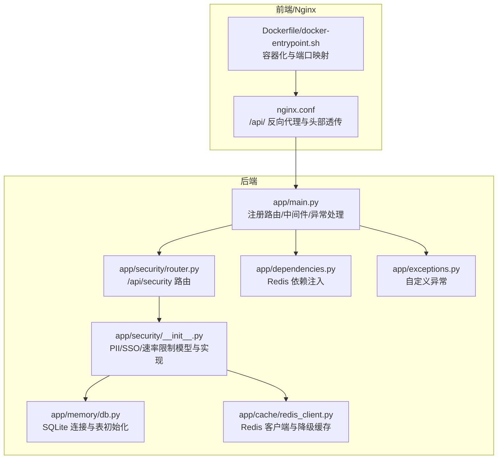
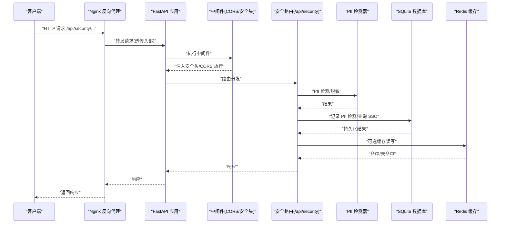
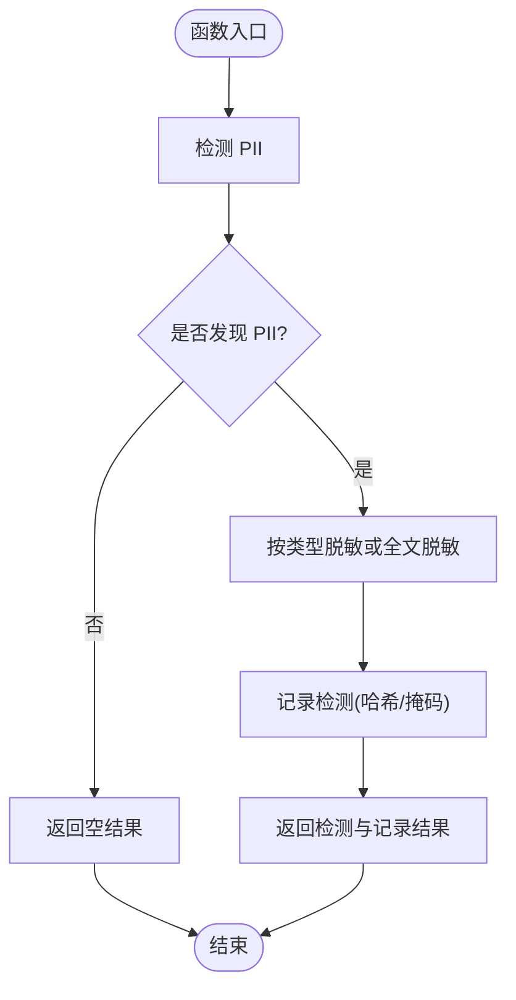
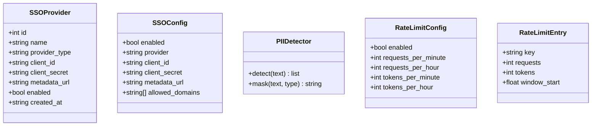
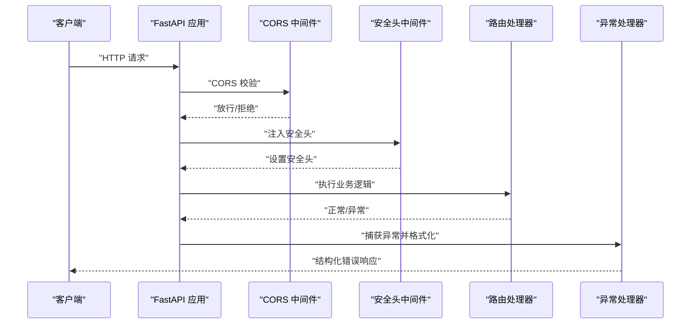
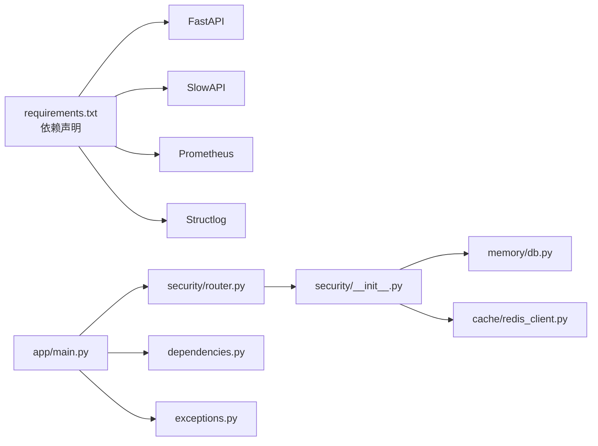

# 安全路由

<cite>
**本文引用的文件**
- [backend/app/security/router.py](file://backend/app/security/router.py)
- [backend/app/security/__init__.py](file://backend/app/security/__init__.py)
- [backend/app/main.py](file://backend/app/main.py)
- [backend/app/memory/db.py](file://backend/app/memory/db.py)
- [backend/app/cache/redis_client.py](file://backend/app/cache/redis_client.py)
- [backend/app/dependencies.py](file://backend/app/dependencies.py)
- [backend/app/exceptions.py](file://backend/app/exceptions.py)
- [backend/requirements.txt](file://backend/requirements.txt)
- [nginx.conf](file://nginx.conf)
- [Dockerfile](file://Dockerfile)
- [docker-entrypoint.sh](file://docker-entrypoint.sh)
- [backend/tests/test_security.py](file://backend/tests/test_security.py)
</cite>

## 目录
1. [简介](#简介)
2. [项目结构](#项目结构)
3. [核心组件](#核心组件)
4. [架构总览](#架构总览)
5. [详细组件分析](#详细组件分析)
6. [依赖关系分析](#依赖关系分析)
7. [性能考量](#性能考量)
8. [故障排查指南](#故障排查指南)
9. [结论](#结论)
10. [附录](#附录)

## 简介
本技术文档聚焦于后端安全路由模块，系统性阐述其认证授权机制、访问控制、安全中间件、速率限制、敏感信息检测与脱敏、SSO 提供商管理、安全头设置、CORS 配置、以及与前端反向代理的协同。文档同时给出配置选项、最佳实践、常见安全威胁防护、实际配置示例、漏洞检测与应急响应流程，帮助开发者在不牺牲可用性的前提下提升整体安全性。

## 项目结构
安全路由模块位于后端应用的 app/security 子目录，围绕以下关键点组织：
- 安全路由入口：定义 /api/security 前缀的 API，提供 PII 检测、SSO 管理、速率限制配置查询等能力
- 安全实现：PII 检测器、SSO 数据模型与数据库操作、速率限制配置模型
- 应用集成：在主应用中注册安全路由、注入安全中间件（CORS、安全头）、全局异常处理
- 基础设施：SQLite 内存数据库用于持久化 PII 检测与 SSO 提供商；Redis 缓存用于降级与性能优化
- 前端反向代理：Nginx 将 /api/ 请求转发至后端，并透传必要的头部

**图表来源**
- [backend/app/main.py:27-356](file://backend/app/main.py#L27-L356)
- [backend/app/security/router.py:1-96](file://backend/app/security/router.py#L1-L96)
- [backend/app/security/__init__.py:1-282](file://backend/app/security/__init__.py#L1-L282)
- [backend/app/memory/db.py:1-63](file://backend/app/memory/db.py#L1-L63)
- [backend/app/cache/redis_client.py:1-161](file://backend/app/cache/redis_client.py#L1-L161)
- [backend/app/dependencies.py:1-38](file://backend/app/dependencies.py#L1-L38)
- [backend/app/exceptions.py:1-41](file://backend/app/exceptions.py#L1-L41)
- [nginx.conf:17-30](file://nginx.conf#L17-L30)
- [Dockerfile:15-54](file://Dockerfile#L15-L54)
- [docker-entrypoint.sh:1-15](file://docker-entrypoint.sh#L1-L15)

**章节来源**
- [backend/app/security/router.py:1-96](file://backend/app/security/router.py#L1-L96)
- [backend/app/security/__init__.py:1-282](file://backend/app/security/__init__.py#L1-L282)
- [backend/app/main.py:27-356](file://backend/app/main.py#L27-L356)
- [backend/app/memory/db.py:1-63](file://backend/app/memory/db.py#L1-L63)
- [backend/app/cache/redis_client.py:1-161](file://backend/app/cache/redis_client.py#L1-L161)
- [backend/app/dependencies.py:1-38](file://backend/app/dependencies.py#L1-L38)
- [backend/app/exceptions.py:1-41](file://backend/app/exceptions.py#L1-L41)
- [nginx.conf:1-36](file://nginx.conf#L1-L36)
- [Dockerfile:1-54](file://Dockerfile#L1-L54)
- [docker-entrypoint.sh:1-15](file://docker-entrypoint.sh#L1-L15)

## 核心组件
- 安全路由（/api/security）
  - PII 检测与脱敏：提供检测、脱敏、文档扫描并记录的能力
  - SSO 提供商管理：创建、查询、删除 SSO 提供商
  - 速率限制配置：返回当前速率限制策略
- 安全实现
  - PIIDetector：基于正则表达式的 PII 检测与掩码
  - SSO 数据模型：SSOProvider、SSOConfig
  - 速率限制模型：RateLimitConfig、RateLimitEntry
  - 数据持久化：PII 检测表、SSO 提供商表初始化与写入
- 中间件与异常处理
  - CORS 中间件：允许指定来源、方法与头部
  - 安全头中间件：X-Content-Type-Options、X-Frame-Options、X-XSS-Protection、Referrer-Policy
  - 全局异常处理：结构化 JSON 返回
- 基础设施
  - SQLite：线程本地连接、WAL 模式、索引优化
  - Redis：异步客户端、降级缓存、优雅降级
  - 依赖注入：Redis 可用性校验与可选依赖

**章节来源**
- [backend/app/security/router.py:1-96](file://backend/app/security/router.py#L1-L96)
- [backend/app/security/__init__.py:18-282](file://backend/app/security/__init__.py#L18-L282)
- [backend/app/main.py:73-125](file://backend/app/main.py#L73-L125)
- [backend/app/memory/db.py:15-63](file://backend/app/memory/db.py#L15-L63)
- [backend/app/cache/redis_client.py:67-161](file://backend/app/cache/redis_client.py#L67-L161)
- [backend/app/dependencies.py:14-38](file://backend/app/dependencies.py#L14-L38)
- [backend/app/exceptions.py:12-41](file://backend/app/exceptions.py#L12-L41)

## 架构总览
安全路由模块通过 FastAPI 路由器对外暴露接口，内部调用安全实现与基础设施组件。请求在进入业务逻辑前经过 CORS 与安全头中间件；异常统一由全局处理器返回结构化错误。Nginx 作为反向代理负责将 /api/ 请求转发至后端服务，并透传必要的头部信息。

**图表来源**
- [backend/app/main.py:73-125](file://backend/app/main.py#L73-L125)
- [backend/app/security/router.py:1-96](file://backend/app/security/router.py#L1-L96)
- [backend/app/security/__init__.py:19-165](file://backend/app/security/__init__.py#L19-L165)
- [backend/app/memory/db.py:15-63](file://backend/app/memory/db.py#L15-L63)
- [backend/app/cache/redis_client.py:106-145](file://backend/app/cache/redis_client.py#L106-L145)
- [nginx.conf:17-30](file://nginx.conf#L17-L30)

## 详细组件分析

### 组件一：PII 检测与脱敏
- 功能要点
  - 检测：对输入文本进行多类型 PII 匹配，返回类型、值与位置
  - 脱敏：按类型替换为掩码或对全文进行多类型掩码
  - 文档扫描：对文档内容扫描并记录检测与掩码结果
- 数据结构与复杂度
  - 正则匹配：时间复杂度近似 O(n)（n 为文本长度），空间复杂度 O(k)（k 为匹配数量）
  - 掩码：对每个匹配项进行替换，整体复杂度 O(n + k)
- 错误处理与边界
  - 输入为空或无匹配时返回空结果
  - 记录 PII 检测时对值进行哈希存储，避免明文泄露
- 性能与优化
  - 使用预编译正则可进一步优化
  - 对大文档建议分块处理并异步记录

**图表来源**
- [backend/app/security/__init__.py:33-72](file://backend/app/security/__init__.py#L33-L72)
- [backend/app/security/__init__.py:142-165](file://backend/app/security/__init__.py#L142-L165)

**章节来源**
- [backend/app/security/router.py:21-59](file://backend/app/security/router.py#L21-L59)
- [backend/app/security/__init__.py:18-72](file://backend/app/security/__init__.py#L18-L72)
- [backend/app/security/__init__.py:119-165](file://backend/app/security/__init__.py#L119-L165)

### 组件二：SSO 提供商管理
- 功能要点
  - 创建：持久化 SSO 提供商配置（名称、类型、凭据、元数据、启用状态）
  - 列出：查询所有提供商，敏感字段脱敏显示
  - 删除：按名称删除提供商
- 数据模型
  - SSOProvider：包含提供商标识、类型、凭据、启用状态与创建时间
  - SSOConfig：运行时配置（启用、提供商名、凭据、允许域）
- 安全与隐私
  - 敏感字段（如 client_secret）在查询与列表时进行脱敏
  - 数据库唯一约束保证提供商名称唯一
- 依赖与耦合
  - 依赖 SQLite 连接与表初始化
  - 与路由层通过 Pydantic 模型交互

**图表来源**
- [backend/app/security/__init__.py:76-115](file://backend/app/security/__init__.py#L76-L115)

**章节来源**
- [backend/app/security/router.py:64-82](file://backend/app/security/router.py#L64-L82)
- [backend/app/security/__init__.py:169-282](file://backend/app/security/__init__.py#L169-L282)

### 组件三：速率限制配置
- 功能要点
  - 查询：返回当前启用状态与各粒度的限额配置
- 设计考虑
  - 与全局限流中间件配合使用，确保 API 层面的稳定性
  - 配置可动态调整，便于运维根据场景优化

**章节来源**
- [backend/app/security/router.py:86-96](file://backend/app/security/router.py#L86-L96)
- [backend/app/main.py:65-72](file://backend/app/main.py#L65-L72)

### 组件四：安全中间件与异常处理
- CORS 中间件
  - 允许来源、方法与头部可通过环境变量配置
- 安全头中间件
  - 注入 X-Content-Type-Options、X-Frame-Options、X-XSS-Protection、Referrer-Policy
- 全局异常处理
  - 自定义异常类统一返回结构化 JSON，便于前端与监控系统消费

**图表来源**
- [backend/app/main.py:73-125](file://backend/app/main.py#L73-L125)
- [backend/app/main.py:88-98](file://backend/app/main.py#L88-L98)
- [backend/app/exceptions.py:12-41](file://backend/app/exceptions.py#L12-L41)

**章节来源**
- [backend/app/main.py:73-125](file://backend/app/main.py#L73-L125)
- [backend/app/main.py:88-98](file://backend/app/main.py#L88-L98)
- [backend/app/exceptions.py:1-41](file://backend/app/exceptions.py#L1-L41)

### 组件五：数据库与缓存
- SQLite
  - 线程本地连接、WAL 模式、忙等待超时，适合小规模并发
  - PII 检测表与 SSO 提供商表初始化，包含索引优化
- Redis
  - 异步客户端，失败时降级为内存缓存，保持服务可用
  - 依赖注入封装，支持可选依赖与优雅关闭

**章节来源**
- [backend/app/memory/db.py:15-63](file://backend/app/memory/db.py#L15-L63)
- [backend/app/security/__init__.py:119-187](file://backend/app/security/__init__.py#L119-L187)
- [backend/app/cache/redis_client.py:67-161](file://backend/app/cache/redis_client.py#L67-L161)
- [backend/app/dependencies.py:14-38](file://backend/app/dependencies.py#L14-L38)

## 依赖关系分析
- 外部依赖
  - FastAPI、SlowAPI（限流）、Prometheus（指标）、Structlog（日志）
- 内部依赖
  - 安全路由依赖安全实现与基础设施（数据库、缓存）
  - 主应用注册安全路由并注入中间件与异常处理
- 循环依赖
  - 通过模块拆分避免循环导入，路由与实现解耦

**图表来源**
- [backend/requirements.txt:4-57](file://backend/requirements.txt#L4-L57)
- [backend/app/main.py:27-356](file://backend/app/main.py#L27-L356)
- [backend/app/security/router.py:1-96](file://backend/app/security/router.py#L1-L96)
- [backend/app/security/__init__.py:1-282](file://backend/app/security/__init__.py#L1-L282)
- [backend/app/memory/db.py:1-63](file://backend/app/memory/db.py#L1-L63)
- [backend/app/cache/redis_client.py:1-161](file://backend/app/cache/redis_client.py#L1-L161)
- [backend/app/dependencies.py:1-38](file://backend/app/dependencies.py#L1-L38)
- [backend/app/exceptions.py:1-41](file://backend/app/exceptions.py#L1-L41)

**章节来源**
- [backend/requirements.txt:1-57](file://backend/requirements.txt#L1-L57)
- [backend/app/main.py:27-356](file://backend/app/main.py#L27-L356)

## 性能考量
- PII 检测
  - 正则匹配为线性复杂度，建议对大文本分块处理并异步记录
  - 可考虑预编译正则以减少重复开销
- 速率限制
  - 全局限流中间件与每路由装饰器结合，避免热点接口被滥用
  - 配置参数应结合业务峰值与下游能力动态调整
- 缓存降级
  - Redis 不可用时自动切换内存缓存，保障服务连续性
  - 内存缓存具备 TTL 与容量淘汰策略，防止内存膨胀
- 数据库
  - WAL 模式提升并发读取性能；索引优化加速查询
  - 建议对高频查询字段建立合适索引

[本节为通用指导，无需具体文件分析]

## 故障排查指南
- PII 检测无结果或误报
  - 检查输入文本是否符合预期格式
  - 核对正则模式覆盖范围，必要时扩展或调整
- SSO 提供商查询显示异常
  - 确认数据库表已初始化
  - 检查敏感字段脱敏逻辑是否影响展示
- 速率限制触发频繁
  - 调整 /api/security/rate-limits/config 中的阈值
  - 在路由层增加更细粒度的限流装饰器
- CORS 或安全头导致跨域问题
  - 核对 CORS_ORIGINS 环境变量与允许的方法/头部
  - 确认 Nginx 是否正确透传必要头部
- Redis 不可用
  - 查看降级日志，确认内存缓存是否生效
  - 检查连接参数与网络连通性

**章节来源**
- [backend/tests/test_security.py:16-131](file://backend/tests/test_security.py#L16-L131)
- [backend/app/main.py:73-125](file://backend/app/main.py#L73-L125)
- [backend/app/cache/redis_client.py:67-98](file://backend/app/cache/redis_client.py#L67-L98)

## 结论
安全路由模块通过明确的职责划分与基础设施解耦，提供了 PII 检测、SSO 管理、速率限制与安全中间件等能力。结合 Nginx 的反向代理与容器化部署，形成从边缘到应用层的完整安全链路。建议在生产环境中持续评估限流阈值、完善日志与告警、定期审查正则规则与 SSO 配置，并建立应急响应流程以应对潜在风险。

[本节为总结，无需具体文件分析]

## 附录

### 配置选项与最佳实践
- CORS 配置
  - 通过环境变量配置允许来源、方法与头部
  - 建议仅开放必要来源与方法，避免通配符
- 速率限制
  - 默认启用，建议结合业务场景调整分钟/小时级限额
  - 对高风险接口单独装饰限流
- 安全头
  - 固定注入常见安全头，降低浏览器与框架层面的风险
- PII 检测
  - 定期评估正则覆盖范围，避免漏检或误报
  - 记录检测结果时仅保存哈希与必要元数据
- SSO 管理
  - 凭据字段脱敏展示，严格控制访问权限
  - 唯一性约束保障提供商名称一致性

**章节来源**
- [backend/app/main.py:73-125](file://backend/app/main.py#L73-L125)
- [backend/app/security/router.py:86-96](file://backend/app/security/router.py#L86-L96)
- [backend/app/security/__init__.py:119-187](file://backend/app/security/__init__.py#L119-L187)

### 实际安全配置示例
- Nginx 反向代理
  - 将 /api/ 请求转发至后端，透传 Host、X-Real-IP、X-Forwarded-For、X-Forwarded-Proto
  - SSE 场景禁用代理缓冲，设置长读取超时
- 容器化部署
  - 通过环境变量动态替换 Nginx 监听端口
  - 启动顺序：先启动 Nginx，再启动 Uvicorn，确保信号正确传递

**章节来源**
- [nginx.conf:17-30](file://nginx.conf#L17-L30)
- [Dockerfile:48-54](file://Dockerfile#L48-L54)
- [docker-entrypoint.sh:4-14](file://docker-entrypoint.sh#L4-L14)

### 常见安全威胁与防护
- 跨站脚本攻击（XSS）
  - 注入安全头，限制内容类型与点击劫持
- 跨域资源共享（CORS）滥用
  - 明确允许来源与方法，避免宽松策略
- 敏感信息泄露
  - PII 检测与脱敏，数据库记录仅保存哈希
  - SSO 凭据脱敏展示
- 速率限制绕过
  - 全局限流与路由级装饰器双重保护
- 缓存击穿与雪崩
  - Redis 降级内存缓存，设置 TTL 与容量上限

**章节来源**
- [backend/app/main.py:73-125](file://backend/app/main.py#L73-L125)
- [backend/app/security/__init__.py:142-165](file://backend/app/security/__init__.py#L142-L165)
- [backend/app/cache/redis_client.py:106-145](file://backend/app/cache/redis_client.py#L106-L145)

### 漏洞检测与应急响应流程
- 漏洞检测
  - 单元测试覆盖 PII 检测、SSO 管理与速率限制配置查询
  - 日志与指标监控异常与突发流量
- 应急响应
  - 临时提高限流阈值或暂停高风险接口
  - 检查并加固 CORS 与安全头配置
  - 审计 PII 检测与 SSO 配置变更记录
  - 如遇 Redis 问题，确认内存缓存降级生效

**章节来源**
- [backend/tests/test_security.py:16-131](file://backend/tests/test_security.py#L16-L131)
- [backend/app/main.py:88-98](file://backend/app/main.py#L88-L98)
- [backend/app/cache/redis_client.py:106-145](file://backend/app/cache/redis_client.py#L106-L145)