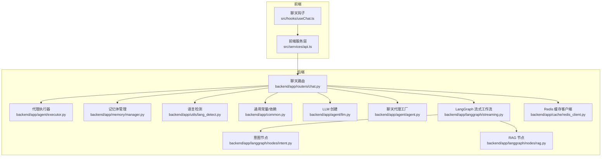
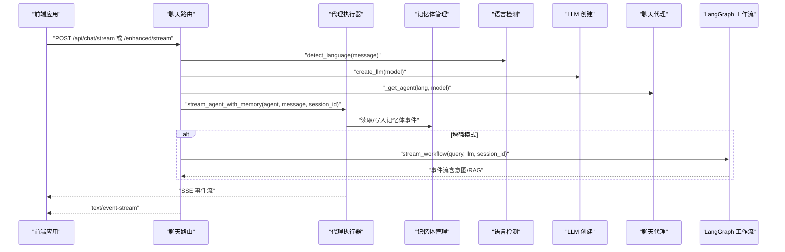
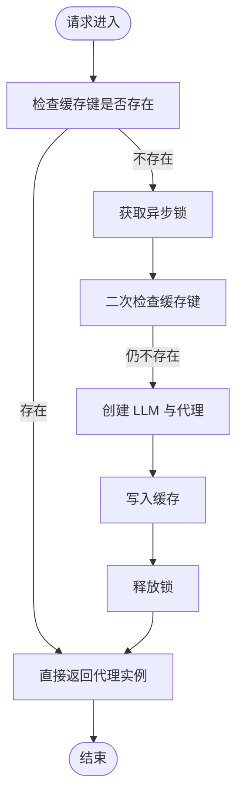
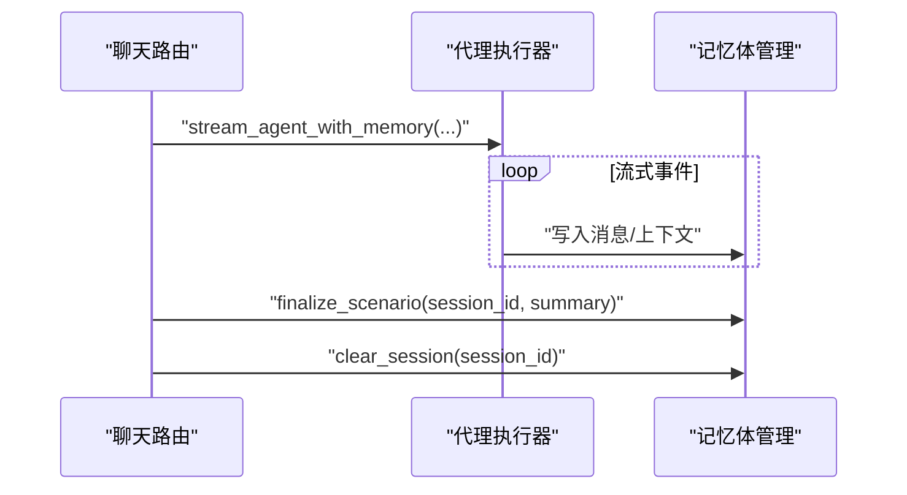
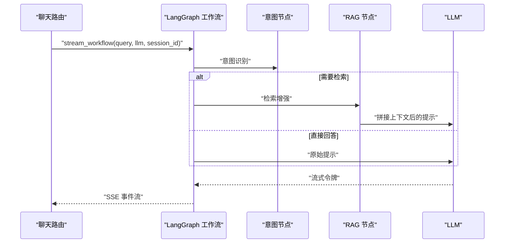
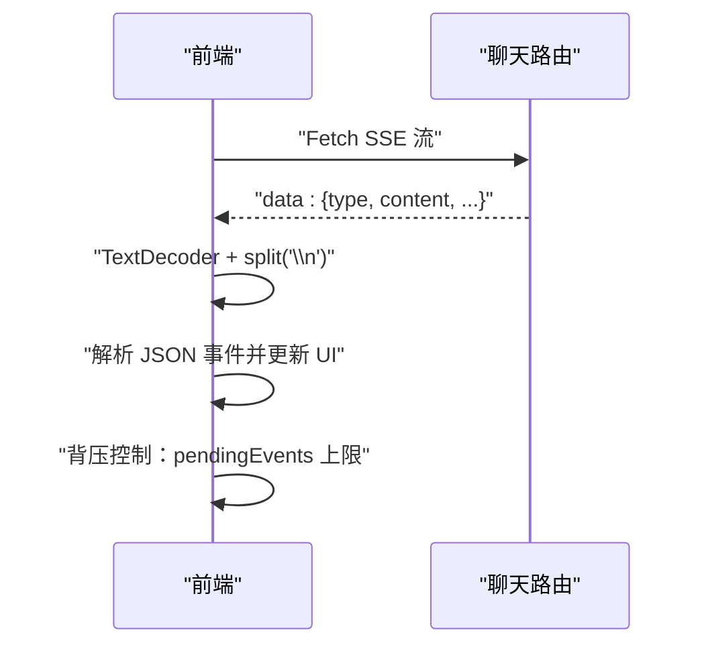
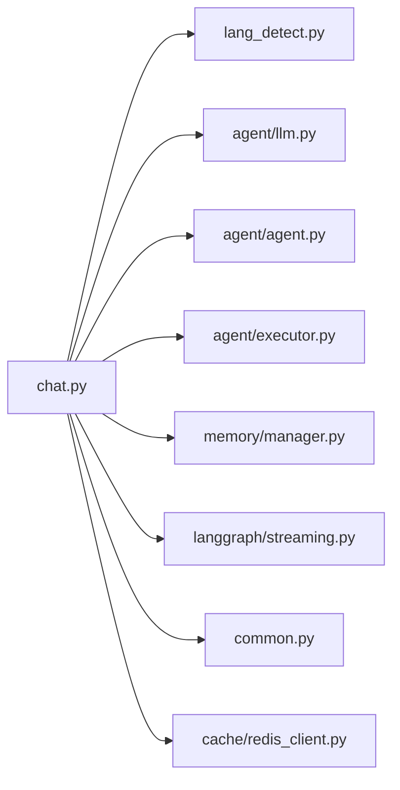

# 聊天路由

<cite>
**本文引用的文件**
- [backend/app/routers/chat.py](file://backend/app/routers/chat.py)
- [backend/app/agent/executor.py](file://backend/app/agent/executor.py)
- [backend/app/memory/manager.py](file://backend/app/memory/manager.py)
- [backend/app/utils/lang_detect.py](file://backend/app/utils/lang_detect.py)
- [backend/app/common.py](file://backend/app/common.py)
- [backend/tests/test_chat_router.py](file://backend/tests/test_chat_router.py)
- [src/services/api.ts](file://src/services/api.ts)
- [src/hooks/useChat.ts](file://src/hooks/useChat.ts)
- [backend/app/agent/llm.py](file://backend/app/agent/llm.py)
- [backend/app/agent/agent.py](file://backend/app/agent/agent.py)
- [backend/app/langgraph/streaming.py](file://backend/app/langgraph/streaming.py)
- [backend/app/langgraph/nodes/intent.py](file://backend/app/langgraph/nodes/intent.py)
- [backend/app/langgraph/nodes/rag.py](file://backend/app/langgraph/nodes/rag.py)
- [backend/app/cache/redis_client.py](file://backend/app/cache/redis_client.py)
</cite>

## 目录
1. [简介](#简介)
2. [项目结构](#项目结构)
3. [核心组件](#核心组件)
4. [架构总览](#架构总览)
5. [详细组件分析](#详细组件分析)
6. [依赖关系分析](#依赖关系分析)
7. [性能考量](#性能考量)
8. [故障排查指南](#故障排查指南)
9. [结论](#结论)
10. [附录](#附录)

## 简介
本技术文档聚焦于聊天路由模块，系统性阐述以下能力与设计：
- 基础聊天流式响应（SSE）
- 增强聊天流式响应（带意图识别与 RAG 集成）
- 会话管理与生命周期
- 语言检测与动态提示适配
- 路由端点设计、请求/响应格式与流式传输实现
- 聊天代理缓存机制、并发控制与性能优化策略
- 实际路由实现示例、错误处理模式与调试技巧

## 项目结构
聊天路由位于后端 FastAPI 应用中，前端通过浏览器原生 Fetch 与 ReadableStream 接收 SSE；后端将请求转发至聊天代理与记忆体管理，并在增强模式下接入 LangGraph 工作流进行意图判断与检索增强。



图表来源
- [backend/app/routers/chat.py:1-79](file://backend/app/routers/chat.py#L1-L79)
- [backend/app/agent/executor.py:10-120](file://backend/app/agent/executor.py#L10-L120)
- [backend/app/memory/manager.py](file://backend/app/memory/manager.py)
- [backend/app/utils/lang_detect.py:15-44](file://backend/app/utils/lang_detect.py#L15-L44)
- [backend/app/common.py:48-66](file://backend/app/common.py#L48-L66)
- [backend/app/agent/llm.py:33-85](file://backend/app/agent/llm.py#L33-L85)
- [backend/app/agent/agent.py](file://backend/app/agent/agent.py)
- [backend/app/langgraph/streaming.py](file://backend/app/langgraph/streaming.py)
- [backend/app/langgraph/nodes/intent.py](file://backend/app/langgraph/nodes/intent.py)
- [backend/app/langgraph/nodes/rag.py](file://backend/app/langgraph/nodes/rag.py)
- [backend/app/cache/redis_client.py](file://backend/app/cache/redis_client.py)

章节来源
- [backend/app/routers/chat.py:1-79](file://backend/app/routers/chat.py#L1-L79)
- [backend/app/common.py:48-66](file://backend/app/common.py#L48-L66)

## 核心组件
- 路由端点
  - POST /api/chat/stream：基础聊天流式响应（SSE），按输入语言选择代理并返回增量事件。
  - POST /api/chat/enhanced/stream：增强聊天，自动进行意图识别与 RAG 集成，同样以 SSE 输出。
  - GET /api/sessions：列出活跃会话。
  - DELETE /api/sessions/{session_id}：删除指定会话并清理记忆体。
- 语言检测：根据输入文本的字符分布判定语言，用于动态提示与代理选择。
- 代理缓存：基于语言与模型键的进程内缓存，配合异步锁避免重复创建。
- 记忆体管理：贯穿流式过程的记忆体读写与场景化落盘。
- SSE 共享头部：统一的缓存禁用与缓冲关闭头，确保浏览器及时接收事件。

章节来源
- [backend/app/routers/chat.py:46-79](file://backend/app/routers/chat.py#L46-L79)
- [backend/app/utils/lang_detect.py:15-44](file://backend/app/utils/lang_detect.py#L15-L44)
- [backend/app/common.py:50-54](file://backend/app/common.py#L50-L54)

## 架构总览
聊天路由采用“路由层 → 执行器 → 记忆体 → 代理/LLM”的分层设计。增强模式通过 LangGraph 工作流在流式过程中动态决定是否触发 RAG 检索与意图路由。



图表来源
- [backend/app/routers/chat.py:46-79](file://backend/app/routers/chat.py#L46-L79)
- [backend/app/agent/executor.py:63-120](file://backend/app/agent/executor.py#L63-L120)
- [backend/app/memory/manager.py](file://backend/app/memory/manager.py)
- [backend/app/utils/lang_detect.py:15-44](file://backend/app/utils/lang_detect.py#L15-L44)
- [backend/app/agent/llm.py:33-85](file://backend/app/agent/llm.py#L33-L85)
- [backend/app/agent/agent.py](file://backend/app/agent/agent.py)
- [backend/app/langgraph/streaming.py](file://backend/app/langgraph/streaming.py)

## 详细组件分析

### 路由端点与请求/响应格式
- 基础聊天流式响应
  - 方法与路径：POST /api/chat/stream
  - 请求体字段：message（必填）、session_id（可选）、model（可选）
  - 响应类型：text/event-stream，逐条发送 data: JSON 的事件行
  - 语言检测：根据 message 自动判定语言，选择对应代理
  - 并发控制：代理缓存使用异步锁，避免重复初始化
- 增强聊天流式响应
  - 方法与路径：POST /api/chat/enhanced/stream
  - 请求体字段：message（必填）、session_id（可选）、model（可选）
  - 响应类型：text/event-stream，事件内容包含意图与检索增强信息
  - 工作流：LangGraph 在流式过程中进行意图识别与 RAG 节点调度
- 会话管理
  - 列出会话：GET /api/sessions 返回 sessions 数组与 count
  - 删除会话：DELETE /api/sessions/{session_id} 清理并返回状态

章节来源
- [backend/app/routers/chat.py:46-79](file://backend/app/routers/chat.py#L46-L79)
- [backend/tests/test_chat_router.py:10-91](file://backend/tests/test_chat_router.py#L10-L91)

### 语言检测与动态提示
- 字符集判定：通过 CJK 与 ASCII 区间统计，设定阈值判断语言
- 提示注入：根据语言生成人类可读标签与语言指令片段，用于动态提示
- 使用位置：路由层在创建代理前调用，决定代理语言与后续提示风格

章节来源
- [backend/app/utils/lang_detect.py:15-44](file://backend/app/utils/lang_detect.py#L15-L44)
- [backend/app/routers/chat.py:34-43](file://backend/app/routers/chat.py#L34-L43)

### 代理缓存与并发控制
- 缓存键：由语言与模型标识组成，避免跨语言或跨模型误复用
- 初始化策略：首次命中时异步锁保护创建，避免竞态
- 生命周期：进程内缓存，重启失效；可通过外部缓存（如 Redis）扩展持久化



图表来源
- [backend/app/routers/chat.py:34-43](file://backend/app/routers/chat.py#L34-L43)

章节来源
- [backend/app/routers/chat.py:27-43](file://backend/app/routers/chat.py#L27-L43)

### 记忆体管理与会话生命周期
- 读写拦截：执行器在流式过程中拦截事件，写入记忆体；支持场景化落盘
- 场景化存储：支持将对话历史与上下文持久化到数据库或离线存储
- 生命周期：会话开始、持续更新、手动删除与最终清理



图表来源
- [backend/app/agent/executor.py:63-120](file://backend/app/agent/executor.py#L63-L120)
- [backend/app/memory/manager.py](file://backend/app/memory/manager.py)
- [backend/tests/test_chat_router.py:77-91](file://backend/tests/test_chat_router.py#L77-L91)

章节来源
- [backend/app/agent/executor.py:63-120](file://backend/app/agent/executor.py#L63-L120)
- [backend/app/memory/manager.py](file://backend/app/memory/manager.py)
- [backend/tests/test_chat_router.py:66-91](file://backend/tests/test_chat_router.py#L66-L91)

### 增强聊天与 LangGraph 集成
- 工作流入口：stream_workflow 接收查询、LLM 与 session_id
- 意图识别：在流式过程中判断是否需要检索增强
- RAG 节点：根据意图触发向量化检索与上下文拼接
- 事件输出：统一以 SSE 形式输出，前端按事件解析渲染



图表来源
- [backend/app/routers/chat.py:66-79](file://backend/app/routers/chat.py#L66-L79)
- [backend/app/langgraph/streaming.py](file://backend/app/langgraph/streaming.py)
- [backend/app/langgraph/nodes/intent.py](file://backend/app/langgraph/nodes/intent.py)
- [backend/app/langgraph/nodes/rag.py](file://backend/app/langgraph/nodes/rag.py)

章节来源
- [backend/app/routers/chat.py:66-79](file://backend/app/routers/chat.py#L66-L79)

### SSE 流式传输与前端消费
- 后端实现：StreamingResponse 返回 text/event-stream，设置必要的响应头
- 前端实现：ReadableStream + TextDecoder 解析 data: 行，按事件回调驱动 UI 更新
- 背压控制：通过 pendingEvents 与定时器限制渲染速率，避免 UI 卡顿



图表来源
- [backend/app/routers/chat.py:46-63](file://backend/app/routers/chat.py#L46-L63)
- [backend/app/common.py:50-54](file://backend/app/common.py#L50-L54)
- [src/services/api.ts:36-94](file://src/services/api.ts#L36-L94)
- [src/hooks/useChat.ts:17-39](file://src/hooks/useChat.ts#L17-L39)

章节来源
- [backend/app/routers/chat.py:46-63](file://backend/app/routers/chat.py#L46-L63)
- [backend/app/common.py:50-54](file://backend/app/common.py#L50-L54)
- [src/services/api.ts:36-94](file://src/services/api.ts#L36-L94)
- [src/hooks/useChat.ts:17-39](file://src/hooks/useChat.ts#L17-L39)

### 类与模块关系图
```mermaid
classDiagram
class ChatRouter {
+POST "/api/chat/stream"
+POST "/api/chat/enhanced/stream"
+GET "/api/sessions"
+DELETE "/api/sessions/{session_id}"
}
class AgentExecutor {
+stream_agent_with_memory(...)
}
class MemoryManager {
+finalize_scenario(...)
+clear_session(...)
}
class LangDetect {
+detect_language(text) str
}
class LlmFactory {
+create_llm(model) LLM
}
class AgentFactory {
+create_chat_agent(llm, lang) Agent
}
class LangGraphStreaming {
+stream_workflow(query, llm, session_id)
}
ChatRouter --> AgentExecutor : "调用"
ChatRouter --> MemoryManager : "依赖"
ChatRouter --> LangDetect : "调用"
ChatRouter --> LlmFactory : "创建 LLM"
ChatRouter --> AgentFactory : "创建代理"
ChatRouter --> LangGraphStreaming : "增强模式"
```

图表来源
- [backend/app/routers/chat.py:46-79](file://backend/app/routers/chat.py#L46-L79)
- [backend/app/agent/executor.py:63-120](file://backend/app/agent/executor.py#L63-L120)
- [backend/app/memory/manager.py](file://backend/app/memory/manager.py)
- [backend/app/utils/lang_detect.py:15-44](file://backend/app/utils/lang_detect.py#L15-L44)
- [backend/app/agent/llm.py:33-85](file://backend/app/agent/llm.py#L33-L85)
- [backend/app/agent/agent.py](file://backend/app/agent/agent.py)
- [backend/app/langgraph/streaming.py](file://backend/app/langgraph/streaming.py)

## 依赖关系分析
- 组件耦合
  - 路由层对语言检测、LLM 工厂、代理工厂与记忆体管理有直接依赖
  - 增强模式引入 LangGraph 工作流，形成“路由 → 工作流 → 节点”的链路
- 外部依赖
  - LLM 提供商密钥校验（依赖注入）与降级策略
  - Redis 客户端用于可选的外部缓存与指标采集



图表来源
- [backend/app/routers/chat.py:18-25](file://backend/app/routers/chat.py#L18-L25)
- [backend/app/common.py:57-66](file://backend/app/common.py#L57-L66)
- [backend/app/cache/redis_client.py](file://backend/app/cache/redis_client.py)

章节来源
- [backend/app/routers/chat.py:18-25](file://backend/app/routers/chat.py#L18-L25)
- [backend/app/common.py:57-66](file://backend/app/common.py#L57-L66)

## 性能考量
- 代理缓存
  - 进程内缓存减少重复初始化开销；建议结合外部缓存（Redis）实现跨实例共享
- 并发与锁
  - 异步锁保护首次创建，避免竞态；注意锁粒度与持有时间
- SSE 背压
  - 前端 pendingEvents 与定时器控制渲染速率，防止 UI 卡顿
- 记忆体写入
  - 将频繁写入合并为批量或延迟写入，降低数据库压力
- LLM 流式
  - 默认开启流式，减少首字节延迟；必要时启用预热与连接池

## 故障排查指南
- 无 SSE 输出
  - 检查响应头是否包含 text/event-stream 与必要的缓存禁用头
  - 确认前端正确解析 data: 行并处理空行与 JSON 解析异常
- 代理未创建或重复创建
  - 检查代理缓存键与异步锁逻辑；确认语言与模型参数传递正确
- 会话异常
  - 确认删除接口调用 finalize_scenario 与 clear_session 的顺序与参数
- LLM 密钥问题
  - 触发 require_llm_key 依赖时，检查配置项是否设置

章节来源
- [backend/app/routers/chat.py:46-63](file://backend/app/routers/chat.py#L46-L63)
- [backend/app/common.py:57-66](file://backend/app/common.py#L57-L66)
- [src/services/api.ts:36-94](file://src/services/api.ts#L36-L94)
- [backend/tests/test_chat_router.py:66-91](file://backend/tests/test_chat_router.py#L66-L91)

## 结论
聊天路由模块通过清晰的分层设计与 SSE 流式传输，实现了从基础问答到意图识别与检索增强的完整链路。语言检测与代理缓存提升了多语言适配与资源利用率；记忆体管理保障了会话的连续性与可追溯性。建议在生产环境中结合外部缓存与监控体系，进一步提升稳定性与可观测性。

## 附录
- 实现示例参考
  - 基础聊天流式：[backend/app/routers/chat.py:46-63](file://backend/app/routers/chat.py#L46-L63)
  - 增强聊天流式：[backend/app/routers/chat.py:66-79](file://backend/app/routers/chat.py#L66-L79)
  - 语言检测：[backend/app/utils/lang_detect.py:15-44](file://backend/app/utils/lang_detect.py#L15-L44)
  - 代理缓存与锁：[backend/app/routers/chat.py:27-43](file://backend/app/routers/chat.py#L27-L43)
  - 记忆体拦截与会话清理：[backend/app/agent/executor.py:63-120](file://backend/app/agent/executor.py#L63-L120), [backend/tests/test_chat_router.py:77-91](file://backend/tests/test_chat_router.py#L77-L91)
  - SSE 共享头：[backend/app/common.py:50-54](file://backend/app/common.py#L50-L54)
  - 前端消费与背压：[src/services/api.ts:36-94](file://src/services/api.ts#L36-L94), [src/hooks/useChat.ts:17-39](file://src/hooks/useChat.ts#L17-L39)