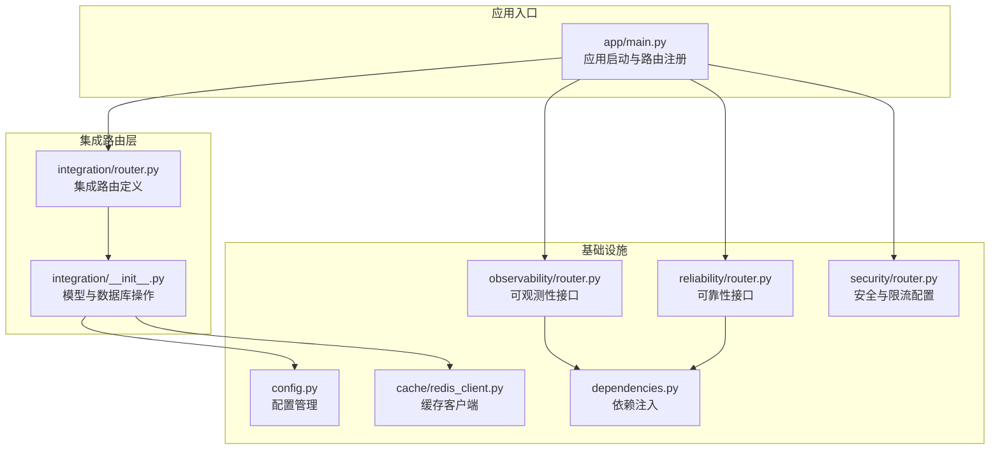
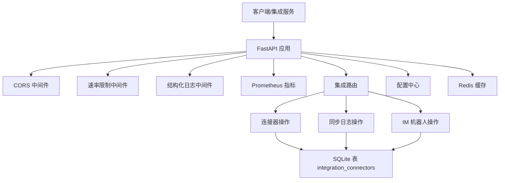
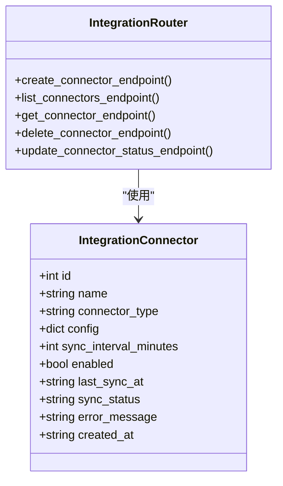
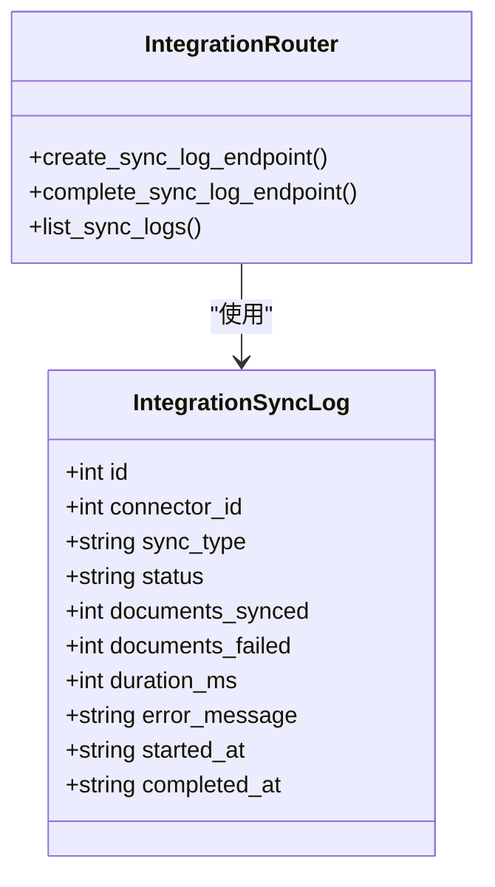
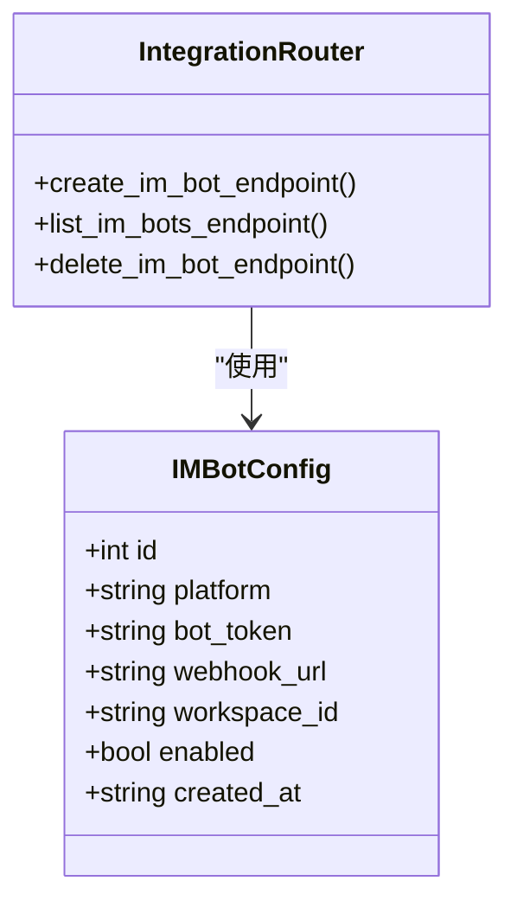
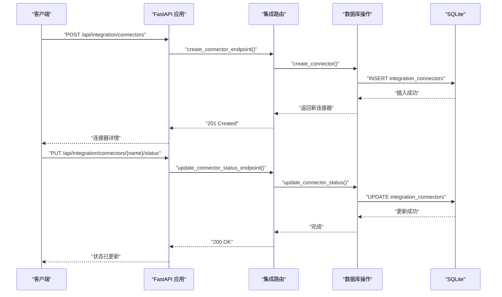
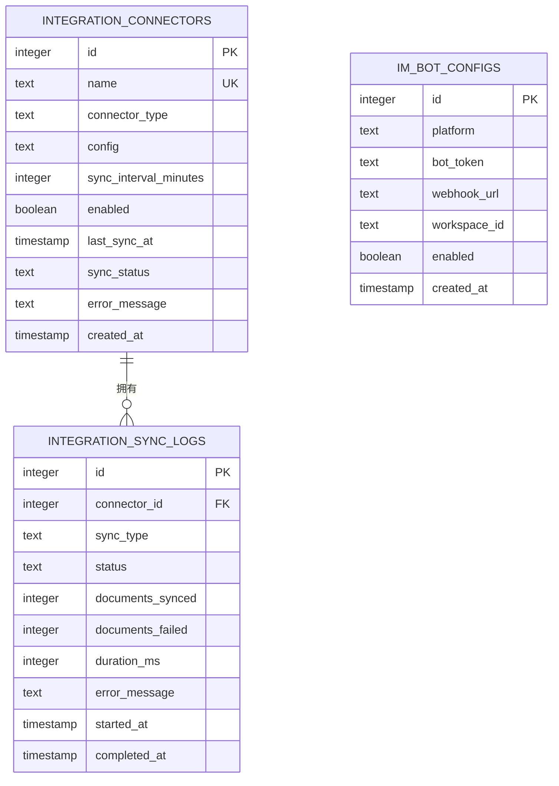
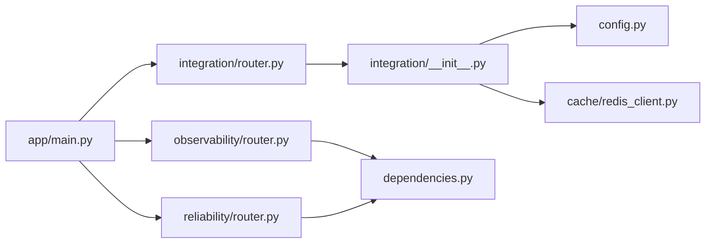

# 集成路由

<cite>
**本文档引用的文件**
- [backend/app/integration/router.py](file://backend/app/integration/router.py)
- [backend/app/integration/__init__.py](file://backend/app/integration/__init__.py)
- [backend/app/main.py](file://backend/app/main.py)
- [backend/app/config.py](file://backend/app/config.py)
- [backend/tests/test_integration.py](file://backend/tests/test_integration.py)
- [backend/app/observability/router.py](file://backend/app/observability/router.py)
- [backend/app/reliability/router.py](file://backend/app/reliability/router.py)
- [backend/app/reliability/__init__.py](file://backend/app/reliability/__init__.py)
- [backend/app/security/router.py](file://backend/app/security/router.py)
- [backend/app/cache/redis_client.py](file://backend/app/cache/redis_client.py)
- [backend/app/dependencies.py](file://backend/app/dependencies.py)
</cite>

## 目录
1. [简介](#简介)
2. [项目结构](#项目结构)
3. [核心组件](#核心组件)
4. [架构概览](#架构概览)
5. [详细组件分析](#详细组件分析)
6. [依赖关系分析](#依赖关系分析)
7. [性能考虑](#性能考虑)
8. [故障排查指南](#故障排查指南)
9. [结论](#结论)
10. [附录](#附录)

## 简介
本文件为集成路由模块的技术文档，聚焦于企业级第三方服务集成功能，涵盖外部 API 调用、Webhook 处理、数据同步与事件通知机制。文档详细阐述了集成接口的设计模式、错误重试策略与数据转换规则，说明了认证方式管理、速率限制与配额控制实现，并提供了配置管理、连接池优化与监控告警设置。最后包含实际集成示例、故障转移与数据一致性保障方案。

## 项目结构
集成路由模块位于后端应用的集成子系统中，采用 FastAPI 路由器封装对外 API，配合 SQLite 数据库存储连接器配置、同步日志与 IM 机器人配置；同时通过全局速率限制中间件、Prometheus 指标暴露与结构化日志等基础设施实现可观测性与可靠性保障。

**图表来源**
- [backend/app/main.py:362](file://backend/app/main.py#L362)
- [backend/app/integration/router.py:21](file://backend/app/integration/router.py#L21)
- [backend/app/integration/__init__.py:59](file://backend/app/integration/__init__.py#L59)

**章节来源**
- [backend/app/main.py:362](file://backend/app/main.py#L362)
- [backend/app/integration/router.py:21](file://backend/app/integration/router.py#L21)
- [backend/app/integration/__init__.py:59](file://backend/app/integration/__init__.py#L59)

## 核心组件
- 集成连接器模型：用于描述第三方平台连接器类型、配置、同步间隔、启用状态与同步状态等。
- 同步日志模型：记录每次同步任务的类型、状态、成功/失败数量、耗时与错误信息。
- IM 机器人配置模型：支持 Slack、Teams、WeChat、飞书、钉钉等平台，保存 webhook 地址与工作区标识。
- 路由端点：提供连接器的增删改查、状态更新、同步日志创建与查询、IM 机器人配置的增删查。
- 数据库操作：负责表初始化、CRUD 操作与索引维护。
- 配置管理：集中管理 LLM、嵌入模型、向量存储、Redis、Elasticsearch 等参数。

**章节来源**
- [backend/app/integration/__init__.py:18](file://backend/app/integration/__init__.py#L18)
- [backend/app/integration/__init__.py:32](file://backend/app/integration/__init__.py#L32)
- [backend/app/integration/__init__.py:46](file://backend/app/integration/__init__.py#L46)
- [backend/app/integration/router.py:26](file://backend/app/integration/router.py#L26)
- [backend/app/integration/router.py:70](file://backend/app/integration/router.py#L70)
- [backend/app/integration/router.py:100](file://backend/app/integration/router.py#L100)
- [backend/app/config.py:4](file://backend/app/config.py#L4)

## 架构概览
集成路由采用“路由层 + 模型层 + 数据库层”的分层设计，结合全局速率限制、结构化日志与 Prometheus 指标，形成可扩展的企业级集成能力。

**图表来源**
- [backend/app/main.py:73](file://backend/app/main.py#L73)
- [backend/app/main.py:81](file://backend/app/main.py#L81)
- [backend/app/integration/router.py:21](file://backend/app/integration/router.py#L21)
- [backend/app/integration/__init__.py:63](file://backend/app/integration/__init__.py#L63)

## 详细组件分析

### 集成连接器组件
- 功能职责：管理第三方平台连接器的生命周期，包括创建、查询、删除与状态更新。
- 数据模型：包含连接器名称、类型、配置字典、同步间隔、启用状态、最近同步时间、同步状态与错误信息。
- 数据库操作：提供创建、列表、按名称获取、删除与状态更新等操作，均通过 SQLite 完成持久化。
- 错误处理：当连接器不存在时返回 404；状态更新包含错误消息字段以便上层监控。

**图表来源**
- [backend/app/integration/__init__.py:18](file://backend/app/integration/__init__.py#L18)
- [backend/app/integration/router.py:26](file://backend/app/integration/router.py#L26)

**章节来源**
- [backend/app/integration/__init__.py:112](file://backend/app/integration/__init__.py#L112)
- [backend/app/integration/__init__.py:147](file://backend/app/integration/__init__.py#L147)
- [backend/app/integration/__init__.py:172](file://backend/app/integration/__init__.py#L172)
- [backend/app/integration/__init__.py:200](file://backend/app/integration/__init__.py#L200)
- [backend/app/integration/__init__.py:211](file://backend/app/integration/__init__.py#L211)
- [backend/app/integration/router.py:38](file://backend/app/integration/router.py#L38)
- [backend/app/integration/router.py:48](file://backend/app/integration/router.py#L48)
- [backend/app/integration/router.py:57](file://backend/app/integration/router.py#L57)

### 同步日志组件
- 功能职责：记录每次数据同步任务的执行情况，便于审计与问题定位。
- 数据模型：包含同步类型（全量/增量）、状态（成功/失败/部分）、文档同步数量、耗时与错误信息。
- 数据库操作：提供创建、完成标记与查询接口，支持按连接器过滤与限制条数。

**图表来源**
- [backend/app/integration/__init__.py:32](file://backend/app/integration/__init__.py#L32)
- [backend/app/integration/router.py:70](file://backend/app/integration/router.py#L70)
- [backend/app/integration/router.py:77](file://backend/app/integration/router.py#L77)
- [backend/app/integration/router.py:89](file://backend/app/integration/router.py#L89)

**章节来源**
- [backend/app/integration/__init__.py:231](file://backend/app/integration/__init__.py#L231)
- [backend/app/integration/__init__.py:259](file://backend/app/integration/__init__.py#L259)
- [backend/app/integration/__init__.py:277](file://backend/app/integration/__init__.py#L277)
- [backend/app/integration/router.py:70](file://backend/app/integration/router.py#L70)
- [backend/app/integration/router.py:77](file://backend/app/integration/router.py#L77)
- [backend/app/integration/router.py:89](file://backend/app/integration/router.py#L89)

### IM 机器人组件
- 功能职责：管理不同即时通讯平台的机器人配置，支持创建、查询与删除。
- 平台支持：Slack、Teams、WeChat、飞书、钉钉等。
- 数据库操作：提供创建、列表与删除接口，查询时对敏感字段进行脱敏处理。

**图表来源**
- [backend/app/integration/__init__.py:46](file://backend/app/integration/__init__.py#L46)
- [backend/app/integration/router.py:100](file://backend/app/integration/router.py#L100)
- [backend/app/integration/router.py:106](file://backend/app/integration/router.py#L106)
- [backend/app/integration/router.py:112](file://backend/app/integration/router.py#L112)

**章节来源**
- [backend/app/integration/__init__.py:317](file://backend/app/integration/__init__.py#L317)
- [backend/app/integration/__init__.py:351](file://backend/app/integration/__init__.py#L351)
- [backend/app/integration/__init__.py:402](file://backend/app/integration/__init__.py#L402)
- [backend/app/integration/router.py:100](file://backend/app/integration/router.py#L100)
- [backend/app/integration/router.py:106](file://backend/app/integration/router.py#L106)
- [backend/app/integration/router.py:112](file://backend/app/integration/router.py#L112)

### API 工作流程（序列图）
以下序列图展示从客户端到数据库的典型调用链路，包括连接器创建与状态更新。

**图表来源**
- [backend/app/integration/router.py:26](file://backend/app/integration/router.py#L26)
- [backend/app/integration/router.py:57](file://backend/app/integration/router.py#L57)
- [backend/app/integration/__init__.py:112](file://backend/app/integration/__init__.py#L112)
- [backend/app/integration/__init__.py:211](file://backend/app/integration/__init__.py#L211)

### 数据库与索引设计（ER 图）
集成路由涉及三张核心表：integration_connectors、integration_sync_logs、im_bot_configs。其中同步日志表外键关联连接器表。

**图表来源**
- [backend/app/integration/__init__.py:63](file://backend/app/integration/__init__.py#L63)
- [backend/app/integration/__init__.py:105](file://backend/app/integration/__init__.py#L105)

## 依赖关系分析
- 路由依赖：集成路由在应用启动时被注册到主应用，成为统一的集成生态 API 入口。
- 配置依赖：集成模块读取全局配置（如嵌入模型、向量存储、Redis 等），用于后续的外部服务调用与缓存。
- 可观测性依赖：通过全局中间件与独立的可观测性路由，提供请求追踪与统计。
- 可靠性依赖：熔断器与 SLO 管理为外部集成提供弹性保护与 SLA 监控。
- 缓存依赖：Redis 作为高性能缓存，提供读写分离与降级能力。

**图表来源**
- [backend/app/main.py:362](file://backend/app/main.py#L362)
- [backend/app/integration/router.py:21](file://backend/app/integration/router.py#L21)
- [backend/app/integration/__init__.py:59](file://backend/app/integration/__init__.py#L59)
- [backend/app/observability/router.py:9](file://backend/app/observability/router.py#L9)
- [backend/app/reliability/router.py:57](file://backend/app/reliability/router.py#L57)
- [backend/app/cache/redis_client.py:67](file://backend/app/cache/redis_client.py#L67)
- [backend/app/dependencies.py:14](file://backend/app/dependencies.py#L14)

**章节来源**
- [backend/app/main.py:362](file://backend/app/main.py#L362)
- [backend/app/integration/router.py:21](file://backend/app/integration/router.py#L21)
- [backend/app/integration/__init__.py:59](file://backend/app/integration/__init__.py#L59)
- [backend/app/observability/router.py:9](file://backend/app/observability/router.py#L9)
- [backend/app/reliability/router.py:57](file://backend/app/reliability/router.py#L57)
- [backend/app/cache/redis_client.py:67](file://backend/app/cache/redis_client.py#L67)
- [backend/app/dependencies.py:14](file://backend/app/dependencies.py#L14)

## 性能考虑
- 速率限制：应用级速率限制中间件对请求频率进行控制，避免突发流量冲击下游服务。
- 指标暴露：通过 Prometheus 中间件自动暴露关键指标，便于监控与告警。
- 缓存策略：Redis 与内存双层缓存，读路径优先命中 Redis，异常时优雅降级至内存缓存。
- 数据库索引：为同步日志建立连接器索引，提升查询性能。
- 异步与并发：建议在外部 API 调用与 Webhook 处理中采用异步与连接池，减少阻塞。

**章节来源**
- [backend/app/main.py:65](file://backend/app/main.py#L65)
- [backend/app/main.py:81](file://backend/app/main.py#L81)
- [backend/app/cache/redis_client.py:67](file://backend/app/cache/redis_client.py#L67)
- [backend/app/integration/__init__.py:105](file://backend/app/integration/__init__.py#L105)

## 故障排查指南
- 连接器不存在：当按名称查询或删除连接器时，若不存在返回 404，需检查名称或确认连接器是否已创建。
- 状态更新：通过状态更新端点记录同步状态与错误信息，便于定位问题根因。
- 同步日志：通过同步日志接口查看最近同步结果，结合错误信息与耗时进行分析。
- IM 机器人：删除失败返回 404，需确认平台与工作区标识正确。
- 速率限制：超过全局速率限制会触发限流异常处理器，需调整调用频率或升级配额。
- 可观测性：通过可观测性路由获取最近追踪与统计信息，辅助定位性能瓶颈。
- 可靠性：利用熔断器与 SLO 管理，快速识别外部依赖异常并进行故障转移。

**章节来源**
- [backend/app/integration/router.py:42](file://backend/app/integration/router.py#L42)
- [backend/app/integration/router.py:53](file://backend/app/integration/router.py#L53)
- [backend/app/integration/router.py:117](file://backend/app/integration/router.py#L117)
- [backend/app/main.py:71](file://backend/app/main.py#L71)
- [backend/app/observability/router.py:12](file://backend/app/observability/router.py#L12)
- [backend/app/reliability/__init__.py:59](file://backend/app/reliability/__init__.py#L59)
- [backend/app/reliability/__init__.py:343](file://backend/app/reliability/__init__.py#L343)

## 结论
集成路由模块以清晰的分层设计与完善的基础设施支撑，为企业级第三方服务集成提供了稳定、可观测且可扩展的能力。通过连接器生命周期管理、同步日志审计、IM 机器人配置与全局限流、熔断与 SLO 监控，系统在保证功能完整性的同时兼顾了可靠性与性能。建议在生产环境中结合连接池优化、缓存策略与告警联动，持续提升集成系统的稳定性与用户体验。

## 附录

### 实际集成示例
- 创建连接器：POST /api/integration/connectors，传入名称、类型、配置与同步间隔。
- 更新连接器状态：PUT /api/integration/connectors/{name}/status，传入状态与可选错误信息。
- 创建同步日志：POST /api/integration/sync-logs，传入连接器 ID、同步类型与初始状态。
- 完成同步日志：PUT /api/integration/sync-logs/{log_id}/complete，传入最终状态与统计信息。
- 创建 IM 机器人：POST /api/integration/im-bots，传入平台、工作区标识与 webhook 地址。

**章节来源**
- [backend/tests/test_integration.py:18](file://backend/tests/test_integration.py#L18)
- [backend/tests/test_integration.py:67](file://backend/tests/test_integration.py#L67)
- [backend/tests/test_integration.py:84](file://backend/tests/test_integration.py#L84)
- [backend/tests/test_integration.py:108](file://backend/tests/test_integration.py#L108)

### 错误重试策略与数据转换规则
- 错误重试：建议在外部 API 调用中采用指数退避重试，结合熔断器避免雪崩效应。
- 数据转换：连接器配置与同步日志在入库前进行序列化/反序列化，确保结构一致与兼容性。
- 脱敏处理：IM 机器人配置中的敏感字段在查询时进行脱敏显示，保护凭证安全。

**章节来源**
- [backend/app/integration/__init__.py:11](file://backend/app/integration/__init__.py#L11)
- [backend/app/integration/__init__.py:120](file://backend/app/integration/__init__.py#L120)
- [backend/app/integration/__init__.py:368](file://backend/app/integration/__init__.py#L368)

### 认证方式管理、速率限制与配额控制
- 认证：IM 机器人配置支持多种平台的认证方式（如 webhook 或 bot token），具体使用取决于平台要求。
- 速率限制：全局中间件提供基于 IP 的速率限制，可通过配置调整配额。
- 配额控制：结合 SLO 与熔断器，动态评估外部依赖健康度并进行限流或降级。

**章节来源**
- [backend/app/security/router.py:86](file://backend/app/security/router.py#L86)
- [backend/app/reliability/__init__.py:59](file://backend/app/reliability/__init__.py#L59)
- [backend/app/reliability/__init__.py:343](file://backend/app/reliability/__init__.py#L343)

### 配置管理、连接池优化与监控告警
- 配置管理：通过配置中心集中管理 LLM、嵌入模型、向量存储、Redis、Elasticsearch 等参数。
- 连接池优化：建议在外部 API 客户端中启用连接池与超时控制，避免资源泄露。
- 监控告警：Prometheus 指标、结构化日志与可观测性路由共同构成监控体系，结合 SLO 与熔断器实现自动化告警。

**章节来源**
- [backend/app/config.py:4](file://backend/app/config.py#L4)
- [backend/app/main.py:81](file://backend/app/main.py#L81)
- [backend/app/observability/router.py:12](file://backend/app/observability/router.py#L12)
- [backend/app/reliability/router.py:72](file://backend/app/reliability/router.py#L72)