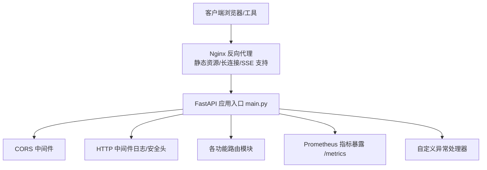
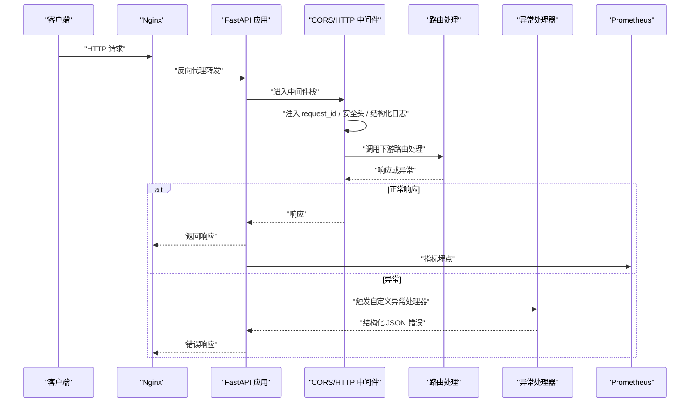
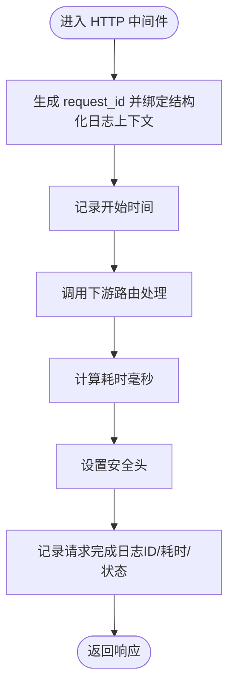
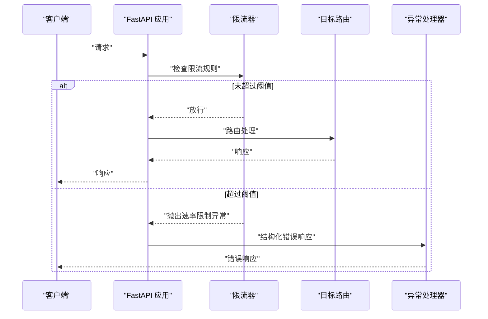
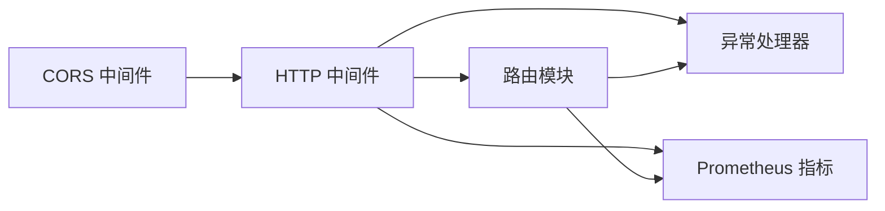

# 中间件配置

<cite>
**本文引用的文件**
- [backend/app/main.py](file://backend/app/main.py)
- [backend/app/security/router.py](file://backend/app/security/router.py)
- [backend/app/exceptions.py](file://backend/app/exceptions.py)
- [nginx.conf](file://nginx.conf)
</cite>

## 目录
1. [简介](#简介)
2. [项目结构](#项目结构)
3. [核心组件](#核心组件)
4. [架构总览](#架构总览)
5. [详细组件分析](#详细组件分析)
6. [依赖关系分析](#依赖关系分析)
7. [性能考量](#性能考量)
8. [故障排查指南](#故障排查指南)
9. [结论](#结论)
10. [附录](#附录)

## 简介
本文件聚焦 Aureon 后端中间件配置系统，系统性阐述 CORS 中间件、HTTP 中间件（含请求 ID 注入、安全头设置、日志记录）、速率限制中间件、异常处理与可观测性集成。文档同时给出中间件执行顺序、配置参数、安全头策略、扩展与自定义中间件开发方法，以及性能调优建议与实践示例。

## 项目结构
后端采用 FastAPI 应用入口集中注册中间件与全局异常处理器，并通过子路由模块实现功能拆分。Nginx 作为反向代理与静态资源服务，在上游将请求转发至 FastAPI 应用。

图表来源
- [backend/app/main.py:69-111](file://backend/app/main.py#L69-L111)
- [nginx.conf:17-30](file://nginx.conf#L17-L30)

章节来源
- [backend/app/main.py:69-111](file://backend/app/main.py#L69-L111)
- [nginx.conf:1-36](file://nginx.conf#L1-L36)

## 核心组件
- CORS 中间件：基于环境变量动态配置允许来源、方法与头部，统一跨域策略。
- HTTP 中间件：注入请求 ID、绑定结构化日志上下文、计算耗时、设置安全头、记录请求完成信息。
- 速率限制中间件：使用慢速限流库在应用级与路由级叠加限流规则，统一异常处理。
- 异常处理：统一结构化 JSON 返回，区分业务异常类型与状态码。
- 指标监控：集成 Prometheus 指标采集与暴露端点。

章节来源
- [backend/app/main.py:69-111](file://backend/app/main.py#L69-L111)
- [backend/app/main.py:88-97](file://backend/app/main.py#L88-L97)
- [backend/app/security/router.py:84-95](file://backend/app/security/router.py#L84-L95)
- [backend/app/exceptions.py:12-40](file://backend/app/exceptions.py#L12-L40)

## 架构总览
下图展示请求从客户端到后端的完整链路，重点标注中间件与可观测性集成位置。

图表来源
- [backend/app/main.py:69-111](file://backend/app/main.py#L69-L111)
- [backend/app/main.py:88-97](file://backend/app/main.py#L88-L97)
- [nginx.conf:17-30](file://nginx.conf#L17-L30)

## 详细组件分析

### CORS 中间件
- 作用：控制跨域访问，统一来源、方法与头部白名单，减少前端跨域风险。
- 配置要点：
  - 允许来源：从环境变量读取，逗号分隔，运行时解析为列表。
  - 允许方法：限定为 GET、POST、DELETE。
  - 允许头部：通配符，便于前端携带鉴权或自定义头。
- 执行顺序：在路由处理前生效，确保后续路由无需重复处理跨域。
- 安全建议：生产环境应明确来源列表，避免通配来源；仅开放必要方法与头部。

章节来源
- [backend/app/main.py:73-78](file://backend/app/main.py#L73-L78)

### HTTP 中间件（请求 ID 注入、日志记录、安全头）
- 作用：统一注入 request_id、绑定结构化日志上下文、计算耗时、设置安全头、记录请求完成信息。
- 关键流程：
  - 生成短请求 ID 并绑定到结构化日志上下文。
  - 记录开始时间，调用下游处理，计算耗时（毫秒）。
  - 设置安全头（如内容安全策略、X-Frame-Options、X-Content-Type-Options 等，具体值以实现为准）。
  - 记录请求完成日志，包含请求 ID、耗时与响应状态。
- 性能影响：中间件开销极低，但可提供关键可观测性数据。

图表来源
- [backend/app/main.py:100-111](file://backend/app/main.py#L100-L111)

章节来源
- [backend/app/main.py:100-111](file://backend/app/main.py#L100-L111)

### 速率限制中间件（应用级与路由级）
- 作用：在应用层与路由层叠加限流，防止过载与滥用。
- 配置方式：
  - 应用级：初始化限流器并注入到应用状态，注册速率限制异常处理器。
  - 路由级：在特定路由上使用装饰器设置更细粒度的限流规则。
- 异常处理：统一捕获速率限制异常，返回结构化错误响应。
- 安全与稳定性：结合 Nginx 层限流与应用层限流，形成多层防护。

图表来源
- [backend/app/main.py:64-71](file://backend/app/main.py#L64-L71)
- [backend/app/main.py:218-218](file://backend/app/main.py#L218-L218)
- [backend/app/main.py:235-235](file://backend/app/main.py#L235-L235)
- [backend/app/main.py:269-269](file://backend/app/main.py#L269-L269)
- [backend/app/security/router.py:84-95](file://backend/app/security/router.py#L84-L95)

章节来源
- [backend/app/main.py:64-71](file://backend/app/main.py#L64-L71)
- [backend/app/main.py:218-218](file://backend/app/main.py#L218-L218)
- [backend/app/main.py:235-235](file://backend/app/main.py#L235-L235)
- [backend/app/main.py:269-269](file://backend/app/main.py#L269-L269)
- [backend/app/security/router.py:84-95](file://backend/app/security/router.py#L84-L95)

### 自定义异常处理（结构化 JSON）
- 作用：对 Aureon 特定异常进行统一结构化返回，包含错误类型与详情。
- 实现：注册异常处理器，按异常状态码返回 JSON 响应体。
- 与中间件协作：异常处理器在中间件之后被调用，保证上下文与日志已就绪。

章节来源
- [backend/app/main.py:88-97](file://backend/app/main.py#L88-L97)
- [backend/app/exceptions.py:12-40](file://backend/app/exceptions.py#L12-L40)

### 指标监控（Prometheus）
- 作用：为应用暴露指标端点，便于外部采集与告警。
- 集成：在应用启动时注册指标采集器，并暴露 /metrics 端点。

章节来源
- [backend/app/main.py:80-81](file://backend/app/main.py#L80-L81)

## 依赖关系分析
- 中间件耦合：CORS 与 HTTP 中间件位于路由处理之前，异常处理器与指标采集器位于处理链末端。
- 外部依赖：Nginx 作为反向代理，负责静态资源、SSE 与上游转发；应用侧中间件负责业务与安全控制。
- 可观测性：结构化日志与 Prometheus 指标共同提供可观测性支撑。

图表来源
- [backend/app/main.py:69-111](file://backend/app/main.py#L69-L111)
- [nginx.conf:17-30](file://nginx.conf#L17-L30)

章节来源
- [backend/app/main.py:69-111](file://backend/app/main.py#L69-L111)
- [nginx.conf:1-36](file://nginx.conf#L1-L36)

## 性能考量
- 中间件开销：HTTP 中间件仅做轻量计算与日志，对延迟影响可忽略。
- 限流策略：应用级与路由级限流叠加，建议根据业务峰值与 SLA 设定合理阈值，避免误伤正常流量。
- 指标采集：启用指标暴露会带来少量 CPU 与内存开销，建议在生产环境开启以获得可观测性收益。
- 反向代理优化：Nginx 已开启 Gzip、静态资源缓存与长连接支持，配合上游应用中间件可获得稳定性能表现。

## 故障排查指南
- CORS 相关问题
  - 症状：浏览器报跨域错误。
  - 排查：确认环境变量中的来源列表是否包含当前前端地址；核对允许方法与头部是否覆盖前端请求。
- 速率限制触发
  - 症状：频繁收到速率限制错误。
  - 排查：检查应用级与路由级限流规则；确认异常处理器是否正确返回结构化错误；评估阈值是否过严。
- 日志与追踪
  - 症状：缺少请求 ID 或日志上下文不一致。
  - 排查：确认 HTTP 中间件是否在路由前执行；检查结构化日志配置与输出格式。
- 指标不可见
  - 症状：无法访问 /metrics。
  - 排查：确认指标采集器已注册且端点暴露成功；检查 Nginx 是否正确转发到应用端口。

章节来源
- [backend/app/main.py:69-111](file://backend/app/main.py#L69-L111)
- [backend/app/main.py:88-97](file://backend/app/main.py#L88-L97)
- [backend/app/security/router.py:84-95](file://backend/app/security/router.py#L84-L95)

## 结论
Aureon 的中间件体系以“前置安全与可观测性、后置异常与指标”为核心设计，CORS 与 HTTP 中间件提供统一的安全与日志能力，速率限制在应用与路由层面协同工作，异常处理与指标暴露完善了可观测性闭环。结合 Nginx 的反向代理与静态资源优化，整体具备良好的安全性、稳定性与可维护性。

## 附录

### 中间件执行顺序与职责
- CORS 中间件：跨域控制，前置。
- HTTP 中间件：请求 ID 注入、安全头、日志与耗时统计，前置。
- 路由处理：业务逻辑，核心处理链。
- 异常处理器：统一错误返回，后置。
- 指标采集：指标暴露，后置。

章节来源
- [backend/app/main.py:69-111](file://backend/app/main.py#L69-L111)

### 配置参数与示例（路径指引）
- CORS 来源列表：参考应用入口中环境变量读取与解析逻辑。
  - [backend/app/main.py:73-78](file://backend/app/main.py#L73-L78)
- 速率限制配置：参考安全路由中的配置项与应用入口中的限流器初始化。
  - [backend/app/security/router.py:84-95](file://backend/app/security/router.py#L84-L95)
  - [backend/app/main.py:64-71](file://backend/app/main.py#L64-L71)
- 结构化日志与渲染：参考应用入口中的结构化日志配置。
  - [backend/app/main.py:47-62](file://backend/app/main.py#L47-L62)
- 指标暴露端点：参考应用入口中的指标采集器注册。
  - [backend/app/main.py:80-81](file://backend/app/main.py#L80-L81)
- 反向代理与静态资源：参考 Nginx 配置。
  - [nginx.conf:1-36](file://nginx.conf#L1-L36)