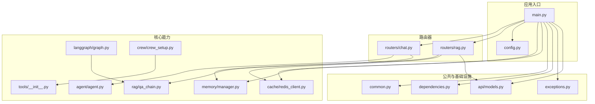
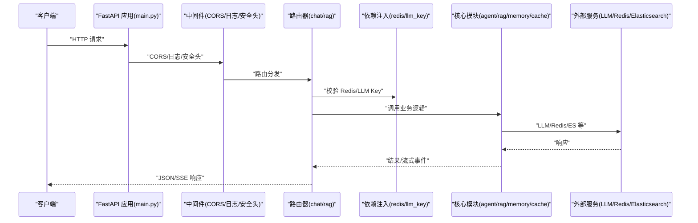
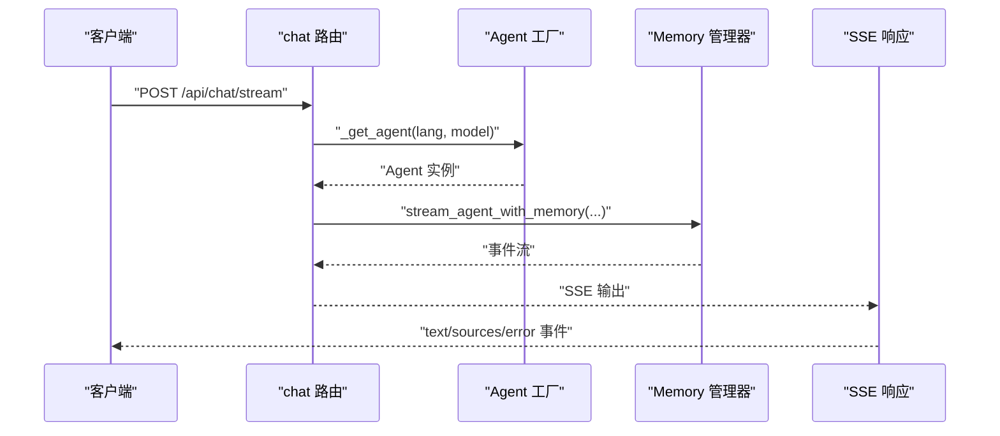
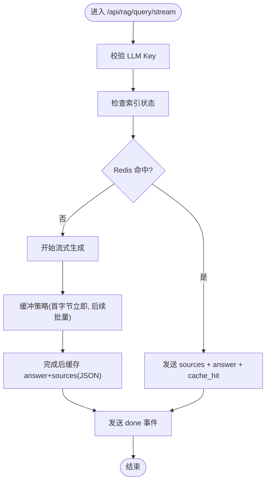
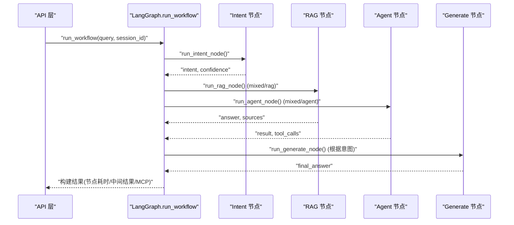
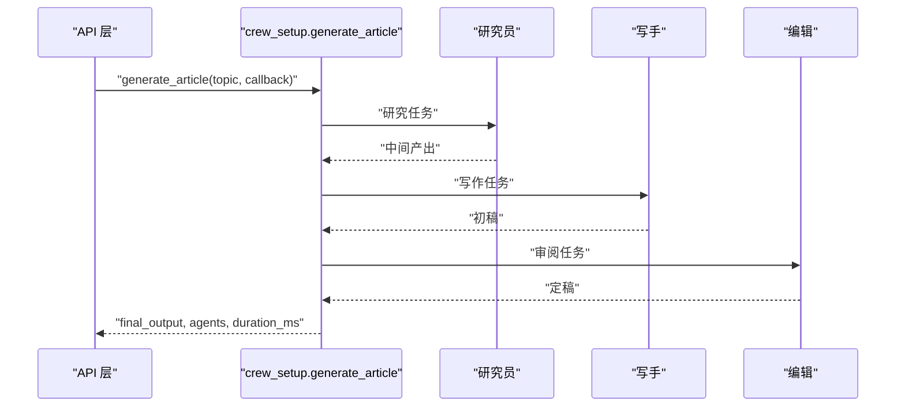
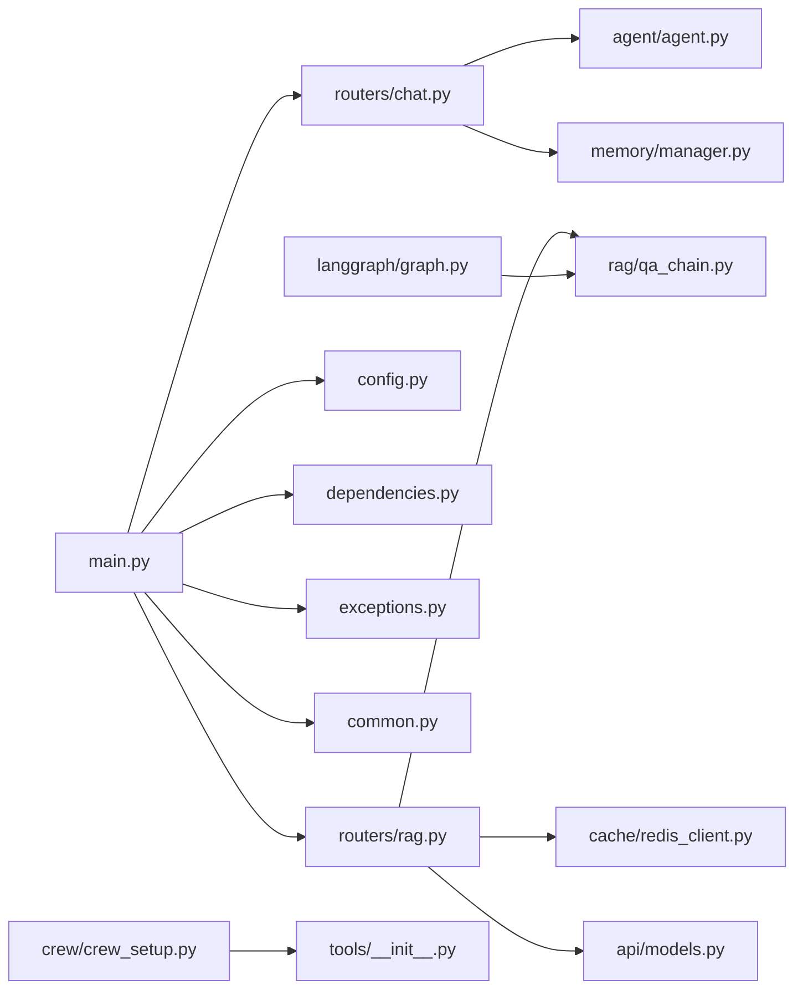

# 后端服务

<cite>
**本文引用的文件**
- [backend/app/main.py](file://backend/app/main.py)
- [backend/app/config.py](file://backend/app/config.py)
- [backend/app/dependencies.py](file://backend/app/dependencies.py)
- [backend/app/common.py](file://backend/app/common.py)
- [backend/app/exceptions.py](file://backend/app/exceptions.py)
- [backend/app/routers/chat.py](file://backend/app/routers/chat.py)
- [backend/app/routers/rag.py](file://backend/app/routers/rag.py)
- [backend/app/agent/agent.py](file://backend/app/agent/agent.py)
- [backend/app/rag/qa_chain.py](file://backend/app/rag/qa_chain.py)
- [backend/app/memory/manager.py](file://backend/app/memory/manager.py)
- [backend/app/cache/redis_client.py](file://backend/app/cache/redis_client.py)
- [backend/app/api/models.py](file://backend/app/api/models.py)
- [backend/app/tools/__init__.py](file://backend/app/tools/__init__.py)
- [backend/app/langgraph/graph.py](file://backend/app/langgraph/graph.py)
- [backend/app/crew/crew_setup.py](file://backend/app/crew/crew_setup.py)
</cite>

## 目录
1. [简介](#简介)
2. [项目结构](#项目结构)
3. [核心组件](#核心组件)
4. [架构总览](#架构总览)
5. [详细组件分析](#详细组件分析)
6. [依赖关系分析](#依赖关系分析)
7. [性能考量](#性能考量)
8. [故障排查指南](#故障排查指南)
9. [结论](#结论)
10. [附录](#附录)

## 简介
本文件为 Aureon 后端服务的详细技术文档，面向开发者与运维人员，系统性阐述基于 FastAPI 的应用结构、模块化组织原则、中间件与安全配置、依赖注入机制、异常处理策略、公共组件设计，以及 API 接口规范、请求/响应格式与错误处理模式。同时覆盖聊天路由、RAG 路由、分析与统计、可观测性、安全、可靠性、知识库、AI 平台、集成、评估、成本、LangGraph 工作流、CrewAI 多智能体生成等模块的职责与实现要点，并给出服务发现、负载均衡与故障转移的建议方案，以及扩展与修改服务的实践指导。

## 项目结构
后端采用按功能域划分的模块化组织方式：
- 应用入口与全局配置：main.py、config.py
- 路由器：routers/chat.py、routers/rag.py
- 核心业务能力：agent、rag、memory、cache、langgraph、crew、tools
- 公共与基础设施：common.py、dependencies.py、exceptions.py
- API 数据模型：api/models.py
- 其他子系统：features、observability、security、reliability、knowledge、ai_platform、integration、evaluation、cost、integration

图表来源
- [backend/app/main.py:350-362](file://backend/app/main.py#L350-L362)
- [backend/app/routers/chat.py:31-31](file://backend/app/routers/chat.py#L31-L31)
- [backend/app/routers/rag.py:52-52](file://backend/app/routers/rag.py#L52-L52)
- [backend/app/config.py:1-90](file://backend/app/config.py#L1-L90)
- [backend/app/cache/redis_client.py:1-161](file://backend/app/cache/redis_client.py#L1-L161)
- [backend/app/memory/manager.py:20-129](file://backend/app/memory/manager.py#L20-L129)
- [backend/app/agent/agent.py:51-71](file://backend/app/agent/agent.py#L51-L71)
- [backend/app/rag/qa_chain.py:582-651](file://backend/app/rag/qa_chain.py#L582-L651)
- [backend/app/langgraph/graph.py:43-146](file://backend/app/langgraph/graph.py#L43-L146)
- [backend/app/crew/crew_setup.py:50-97](file://backend/app/crew/crew_setup.py#L50-L97)
- [backend/app/tools/__init__.py:7-23](file://backend/app/tools/__init__.py#L7-L23)
- [backend/app/common.py:1-67](file://backend/app/common.py#L1-L67)
- [backend/app/dependencies.py:1-38](file://backend/app/dependencies.py#L1-L38)
- [backend/app/exceptions.py:1-41](file://backend/app/exceptions.py#L1-L41)
- [backend/app/api/models.py:1-33](file://backend/app/api/models.py#L1-L33)

章节来源
- [backend/app/main.py:68-125](file://backend/app/main.py#L68-L125)
- [backend/app/config.py:1-90](file://backend/app/config.py#L1-L90)

## 核心组件
- 应用入口与中间件
  - 使用 FastAPI 实例注册 CORS、Prometheus 指标暴露、速率限制、自定义异常处理器与日志中间件；启动/关闭事件负责数据库初始化、表初始化、后台任务与缓存清理。
- 配置中心
  - 统一读取 .env 中的 LLM、嵌入、Redis、向量存储、Elasticsearch、自动索引等配置项，并提供模型注册表。
- 依赖注入
  - 提供 Redis 可用性依赖（require_redis、get_redis_or_none），以及 LLM Key 校验依赖。
- 异常体系
  - 自定义 AureonException 基类与子类（RedisUnavailableError、VectorStoreError），统一结构化错误响应。
- 公共工具
  - 时间戳、敏感信息掩码、确定性哈希、SQLite 行转模型、SSE 头部常量、LLM Key 校验等。
- 缓存层
  - Redis 语义缓存（命中回填内存缓存）、降级内存缓存、连接重试与关闭钩子。
- 记忆与会话
  - 多层级记忆（L0 对话、L1 原子、L2 场景、L3 人物画像），会话生命周期管理与后台清理。
- 工具集
  - 计算器、文件读取、知识检索、网络搜索等工具，按条件注册（RAG 工具仅在索引存在时启用，WebSearch 依赖 Tavily Key）。
- LangGraph 工作流
  - 基于意图识别的路由：RAG/Agent/Chat/Mixed，节点并行执行与最终生成。
- CrewAI 多智能体
  - 研究员-写手-编辑三角色流水线，支持同步与 SSE 流式进度事件。

章节来源
- [backend/app/main.py:48-125](file://backend/app/main.py#L48-L125)
- [backend/app/config.py:4-90](file://backend/app/config.py#L4-L90)
- [backend/app/dependencies.py:14-37](file://backend/app/dependencies.py#L14-L37)
- [backend/app/exceptions.py:12-41](file://backend/app/exceptions.py#L12-L41)
- [backend/app/common.py:15-67](file://backend/app/common.py#L15-L67)
- [backend/app/cache/redis_client.py:67-161](file://backend/app/cache/redis_client.py#L67-L161)
- [backend/app/memory/manager.py:20-129](file://backend/app/memory/manager.py#L20-L129)
- [backend/app/tools/__init__.py:7-23](file://backend/app/tools/__init__.py#L7-L23)
- [backend/app/langgraph/graph.py:43-146](file://backend/app/langgraph/graph.py#L43-L146)
- [backend/app/crew/crew_setup.py:50-97](file://backend/app/crew/crew_setup.py#L50-L97)

## 架构总览
下图展示请求在应用内的流转路径、中间件与关键子系统的交互：

图表来源
- [backend/app/main.py:73-125](file://backend/app/main.py#L73-L125)
- [backend/app/routers/chat.py:46-106](file://backend/app/routers/chat.py#L46-L106)
- [backend/app/routers/rag.py:86-131](file://backend/app/routers/rag.py#L86-L131)
- [backend/app/dependencies.py:14-37](file://backend/app/dependencies.py#L14-L37)
- [backend/app/cache/redis_client.py:106-145](file://backend/app/cache/redis_client.py#L106-L145)
- [backend/app/rag/qa_chain.py:756-800](file://backend/app/rag/qa_chain.py#L756-L800)

## 详细组件分析

### 路由器：聊天路由（chat）
- 职责
  - 提供基础聊天流式接口与增强聊天（带 RAG 意图路由）流式接口
  - 会话列表与删除
- 关键点
  - 代理缓存（按语言与模型维度）避免重复创建
  - SSE 头部统一、错误兜底输出 JSON 事件
  - 增强聊天通过 LangGraph 流水线进行意图识别与路由
- 输入/输出
  - 请求体：ChatRequest（消息、会话 ID、模型）
  - 响应：text/event-stream，事件类型包括 text、sources、error、done
- 错误处理
  - 代理内部异常记录日志并返回 error 事件

图表来源
- [backend/app/routers/chat.py:34-93](file://backend/app/routers/chat.py#L34-L93)
- [backend/app/agent/agent.py:51-71](file://backend/app/agent/agent.py#L51-L71)
- [backend/app/memory/manager.py:27-58](file://backend/app/memory/manager.py#L27-L58)

章节来源
- [backend/app/routers/chat.py:1-107](file://backend/app/routers/chat.py#L1-L107)
- [backend/app/api/models.py:5-23](file://backend/app/api/models.py#L5-L23)

### 路由器：RAG 路由（rag）
- 职责
  - RAG 查询与流式查询（含 Redis 缓存）
  - 索引重建、增量索引、上传文档、列出/删除上传文件
  - 评估与实验、健康检查、基准结果、缓存清空、查询建议
- 关键点
  - 查询前检查索引状态（非阻塞），空索引提示重建
  - 流式查询缓冲策略（首字节低延迟、后续批量刷新）
  - 缓存命中返回 sources + answer，未命中则异步缓存完整结果
  - 文件上传安全校验（防路径穿越、大小限制、格式白名单）
- 输入/输出
  - 查询：RAGQueryRequest（query、top_k、use_mmr、language、model）
  - 响应：RAGQueryResponse（answer、sources 列表）
  - 流式：SSE 事件（sources、citation、text、error、done、cache_hit）
- 错误处理
  - LLM 调用失败返回 502，索引/缓存异常记录日志并降级

图表来源
- [backend/app/routers/rag.py:133-267](file://backend/app/routers/rag.py#L133-L267)
- [backend/app/rag/qa_chain.py:653-754](file://backend/app/rag/qa_chain.py#L653-L754)
- [backend/app/cache/redis_client.py:106-145](file://backend/app/cache/redis_client.py#L106-L145)

章节来源
- [backend/app/routers/rag.py:1-566](file://backend/app/routers/rag.py#L1-L566)
- [backend/app/rag/qa_chain.py:582-800](file://backend/app/rag/qa_chain.py#L582-L800)

### LangGraph 工作流
- 职责
  - 基于意图识别路由到 RAG/Agent/Chat/Mixed，混合意图可并行执行
  - 最终生成阶段整合上下文与工具调用结果
- 关键点
  - 注册 MCP 工具一次，工作流内复用
  - 节点计时与中间结果记录，便于可观测性
  - 出错时记录堆栈并返回错误信息
- 输入/输出
  - 请求体：LangGraphRunRequest（query、session_id）
  - 响应：包含最终答案、路由、节点执行列表、耗时、MCP 调用记录等

图表来源
- [backend/app/main.py:218-226](file://backend/app/main.py#L218-L226)
- [backend/app/langgraph/graph.py:43-146](file://backend/app/langgraph/graph.py#L43-L146)

章节来源
- [backend/app/langgraph/graph.py:1-163](file://backend/app/langgraph/graph.py#L1-L163)

### CrewAI 多智能体文章生成
- 职责
  - 研究员-写手-编辑三角色流水线，支持同步与 SSE 流式事件
- 关键点
  - per-task 回调输出代理动作摘要
  - 通过 OPENAI_* 环境变量桥接 litellm
  - 未安装 CrewAI 时返回 503 且 SSE 输出 error
- 输入/输出
  - 请求体：CrewGenerateRequest（topic）
  - 响应：同步返回 final_output、agents、duration_ms；SSE 流中包含 agent_action 事件

图表来源
- [backend/app/main.py:235-337](file://backend/app/main.py#L235-L337)
- [backend/app/crew/crew_setup.py:50-97](file://backend/app/crew/crew_setup.py#L50-L97)

章节来源
- [backend/app/crew/crew_setup.py:1-97](file://backend/app/crew/crew_setup.py#L1-L97)

### 依赖注入与公共组件
- 依赖注入
  - require_redis：当端点需要 Redis 时抛 503
  - get_redis_or_none：降级返回 None，允许非关键路径优雅退化
  - require_llm_key：校验主/备用 LLM Key，缺失时返回 503
- 公共工具
  - 时间戳、掩码、确定性哈希、Row 转模型、SSE 头部常量
- 异常体系
  - AureonException 基类 + 子类（RedisUnavailableError、VectorStoreError）
  - 自定义异常处理器统一返回 {error, detail} 结构

章节来源
- [backend/app/dependencies.py:14-37](file://backend/app/dependencies.py#L14-L37)
- [backend/app/common.py:15-67](file://backend/app/common.py#L15-L67)
- [backend/app/exceptions.py:12-41](file://backend/app/exceptions.py#L12-L41)
- [backend/app/main.py:88-97](file://backend/app/main.py#L88-L97)

### 缓存与降级
- 语义缓存
  - 基于查询规范化与 MD5 的键，版本号控制缓存失效
  - 命中优先返回内存缓存，再回填 Redis；未命中异步写入
- 降级策略
  - Redis 不可用时使用内存缓存（TTL 与容量淘汰）
  - 连接失败计数与周期性重试
- 关闭钩子
  - 应用关闭时主动关闭 Redis 连接

章节来源
- [backend/app/cache/redis_client.py:106-161](file://backend/app/cache/redis_client.py#L106-L161)

### 记忆与会话管理
- 生命周期
  - 触碰活跃时间、定期清理超时会话、关闭时归档场景
- 上下文
  - 人物画像 + 最近场景拼接形成上下文
- 消息记录
  - L0 对话记录与清理、原子抽取、引用读取与离线归档

章节来源
- [backend/app/memory/manager.py:20-129](file://backend/app/memory/manager.py#L20-L129)

### 工具集与意图
- 工具注册
  - 计算器、文件读取、条件注册知识检索（索引存在时）、WebSearch（Tavily Key）
- 意图与代理
  - 代理系统提示词与工具调用规则，支持中英文指令注入

章节来源
- [backend/app/tools/__init__.py:7-23](file://backend/app/tools/__init__.py#L7-L23)
- [backend/app/agent/agent.py:51-71](file://backend/app/agent/agent.py#L51-L71)

## 依赖关系分析
- 组件耦合
  - 路由器对核心模块（agent/rag/memory/cache）存在直接调用；通过依赖注入降低耦合度
  - LangGraph 与 RAG/Agent 节点解耦，通过状态机与回调扩展
- 外部依赖
  - LLM API（DeepSeek/Zhipu/OpenAI/Anthropic 等）、Redis、Chroma/Qdrant、Elasticsearch、Tavily
- 循环依赖
  - 未见明显循环导入；模块间通过函数调用与延迟导入规避

图表来源
- [backend/app/main.py:350-362](file://backend/app/main.py#L350-L362)
- [backend/app/routers/chat.py:18-25](file://backend/app/routers/chat.py#L18-L25)
- [backend/app/routers/rag.py:33-48](file://backend/app/routers/rag.py#L33-L48)
- [backend/app/rag/qa_chain.py:11-14](file://backend/app/rag/qa_chain.py#L11-L14)
- [backend/app/cache/redis_client.py:84-97](file://backend/app/cache/redis_client.py#L84-L97)
- [backend/app/langgraph/graph.py:8-12](file://backend/app/langgraph/graph.py#L8-L12)
- [backend/app/crew/crew_setup.py:7-9](file://backend/app/crew/crew_setup.py#L7-L9)

章节来源
- [backend/app/main.py:350-362](file://backend/app/main.py#L350-L362)
- [backend/app/routers/chat.py:18-25](file://backend/app/routers/chat.py#L18-L25)
- [backend/app/routers/rag.py:33-48](file://backend/app/routers/rag.py#L33-L48)

## 性能考量
- 流式查询
  - 首字节低延迟：BM25 关键词检索先行，随后流式 LLM 输出
  - 缓冲策略：首次立即刷新，后续按时间/字符阈值批量刷新，兼顾 TTFT 与吞吐
- 缓存
  - 语义缓存命中率高时显著降低 LLM 调用与检索开销；内存缓存作为降级保障
- 检索质量
  - RRF 融合 + 标题关键词加权 + 交叉编码重排候选 + 多样性选择
  - 负面检测（关键词 + LLM 分类器）减少无效查询
- 并发与后台任务
  - 会话超时清理、索引预热与自动重建在后台线程执行，不影响请求路径

## 故障排查指南
- 常见错误与定位
  - LLM Key 未配置：触发 require_llm_key 或路由内校验，返回 503
  - Redis 不可用：require_redis 抛 503；get_redis_or_none 返回 None 导致降级
  - 索引为空/陈旧：/api/rag/index/status 返回 stale；/api/rag/index 手动重建
  - RAG 查询异常：查看异常处理器返回的 error/detail 字段
- 日志与可观测性
  - 中间件记录请求完成信息（方法、路径、状态码、耗时）
  - LangGraph 工作流记录节点耗时与中间结果
  - Prometheus 指标端点 /metrics
- 缓存问题
  - 清理 Redis 与内存缓存：/api/rag/cache/clear
  - 检查缓存键版本与哈希一致性

章节来源
- [backend/app/dependencies.py:14-37](file://backend/app/dependencies.py#L14-L37)
- [backend/app/common.py:57-67](file://backend/app/common.py#L57-L67)
- [backend/app/main.py:88-97](file://backend/app/main.py#L88-L97)
- [backend/app/routers/rag.py:304-322](file://backend/app/routers/rag.py#L304-L322)
- [backend/app/cache/redis_client.py:152-161](file://backend/app/cache/redis_client.py#L152-L161)

## 结论
Aureon 后端以 FastAPI 为核心，采用模块化与清晰的职责边界组织聊天、RAG、LangGraph、CrewAI、缓存与记忆等能力。通过中间件与统一异常处理提升安全性与可观测性；依赖注入与降级策略确保在外部依赖不稳定时仍可提供稳定服务。建议在生产环境中结合负载均衡与服务网格实现服务发现与故障转移，并持续完善指标与告警体系。

## 附录

### API 接口规范与请求/响应格式

- 健康检查
  - GET /api/health
  - 返回：status（ok/warming_up）、model、tools（索引就绪时可见）、index_ready
- LangGraph 运行
  - POST /api/langgraph/run
  - 请求体：LangGraphRunRequest（query、session_id）
  - 响应：包含最终答案、路由、节点执行列表、耗时、MCP 调用记录
- CrewAI 生成
  - POST /api/crew/generate
  - 请求体：CrewGenerateRequest（topic）
  - 响应：topic、final_output、duration_ms、agents
  - POST /api/crew/generate/stream：SSE 流，事件类型包括 agent_action、result、error
  - GET /api/crew/health：服务健康与 LLM 配置状态
- 聊天
  - POST /api/chat/stream：SSE，事件类型 text、sources、error、done
  - POST /api/chat/enhanced/stream：SSE，带意图路由与引用事件
  - GET /api/sessions：列出活动会话
  - DELETE /api/sessions/{session_id}：删除会话
- RAG
  - POST /api/rag/query：JSON 响应（answer、sources）
  - POST /api/rag/query/stream：SSE，事件类型 text、sources、citation、error、done、cache_hit
  - POST /api/rag/index：重建索引并清理缓存
  - GET /api/rag/index/status：索引健康状态
  - POST /api/rag/upload：上传文档并增量索引
  - GET /api/rag/uploads：列出上传文件
  - DELETE /api/rag/upload/{filename}：删除上传文件与索引条目
  - POST /api/rag/evaluate：运行 RAG 评估
  - POST /api/rag/experiment：运行提示词实验
  - GET /api/rag/health：系统健康与服务状态
  - GET /api/rag/benchmark：加载基准结果
  - POST /api/rag/cache/clear：清空缓存
  - GET /api/rag/suggestions：查询建议

章节来源
- [backend/app/main.py:340-347](file://backend/app/main.py#L340-L347)
- [backend/app/main.py:218-226](file://backend/app/main.py#L218-L226)
- [backend/app/main.py:235-337](file://backend/app/main.py#L235-L337)
- [backend/app/routers/chat.py:46-106](file://backend/app/routers/chat.py#L46-L106)
- [backend/app/routers/rag.py:86-566](file://backend/app/routers/rag.py#L86-L566)
- [backend/app/api/models.py:5-33](file://backend/app/api/models.py#L5-L33)

### 中间件与安全配置
- CORS
  - 允许来源来自环境变量 CORS_ORIGINS，默认 http://localhost:5173；允许方法 GET/POST/DELETE，允许任意头部
- 安全头
  - X-Content-Type-Options: nosniff
  - X-Frame-Options: DENY
  - X-XSS-Protection: 1; mode=block
  - Referrer-Policy: strict-origin-when-cross-origin
- 结构化日志
  - structlog 替代标准日志，支持 JSON/控制台渲染
- 速率限制
  - SlowAPI 限流装饰器，部分端点限制频率（如 LangGraph 5/分钟、Crew 3/分钟）

章节来源
- [backend/app/main.py:73-125](file://backend/app/main.py#L73-L125)

### 服务发现、负载均衡与故障转移
- 服务发现
  - 通过环境变量与配置中心集中管理 LLM/嵌入/Redis/向量存储等外部服务地址
- 负载均衡
  - 建议在网关层（如 Nginx/Envoy/Kubernetes Service）对多个实例进行轮询或最少连接
- 故障转移
  - LLM 主备 Key（主/备）与多嵌入提供商链路（本地 BGE → DashScope → SiliconFlow → Zhipu）提升可用性
  - Redis 降级至内存缓存，连接失败周期性重试
- 可观测性
  - Prometheus 指标端点 /metrics；LangGraph 工作流节点计时与中间结果

章节来源
- [backend/app/config.py:7-58](file://backend/app/config.py#L7-L58)
- [backend/app/cache/redis_client.py:67-97](file://backend/app/cache/redis_client.py#L67-L97)
- [backend/app/main.py:80-81](file://backend/app/main.py#L80-L81)

### 扩展与修改指导
- 新增路由器
  - 在 routers 下新建模块，定义 APIRouter 与路由函数，必要时引入依赖与工具
  - 在 main.py 中 include_router 并挂载静态资源（如需）
- 修改现有服务
  - 优先通过配置中心调整行为（如检索参数、阈值、开关）
  - 通过依赖注入替换或增强能力（如更换 LLM、切换向量存储后端）
- LangGraph 工作流
  - 新增节点与路由条件，确保状态字段与计时记录完整
- CrewAI
  - 新增角色/任务时，更新 crew_setup 与回调事件，保证 SSE 事件语义一致

章节来源
- [backend/app/main.py:350-362](file://backend/app/main.py#L350-L362)
- [backend/app/langgraph/graph.py:43-146](file://backend/app/langgraph/graph.py#L43-L146)
- [backend/app/crew/crew_setup.py:50-97](file://backend/app/crew/crew_setup.py#L50-L97)