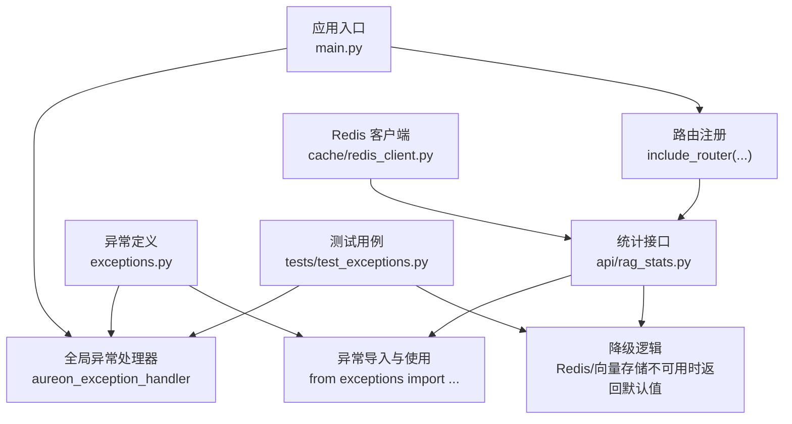
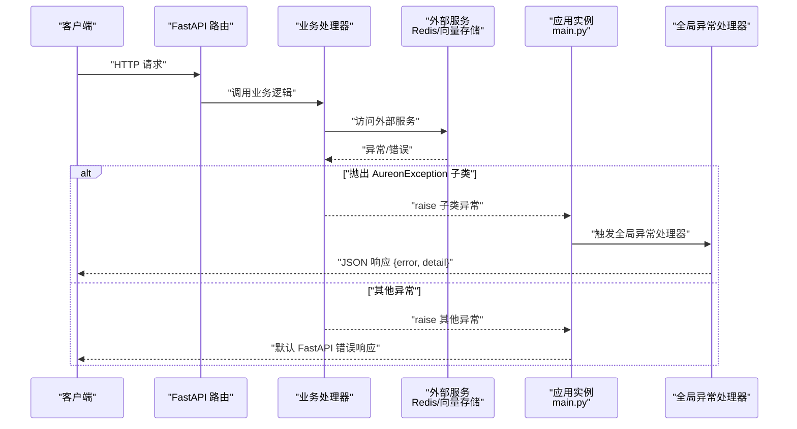
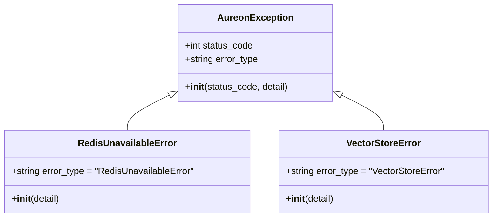
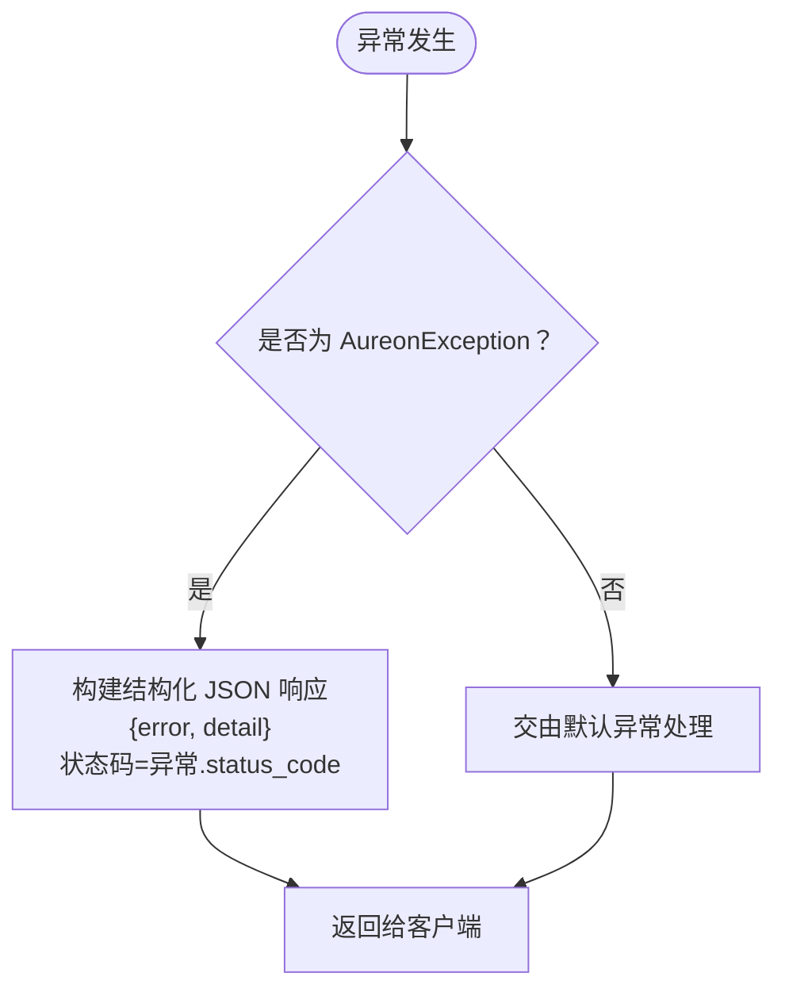
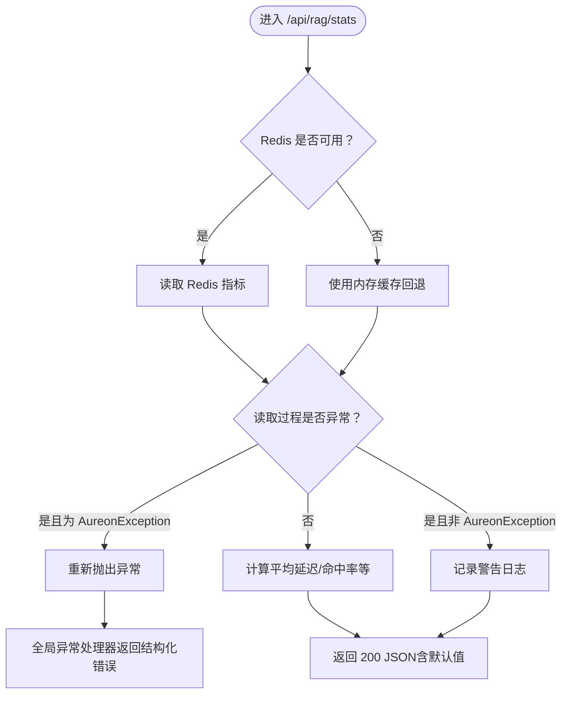
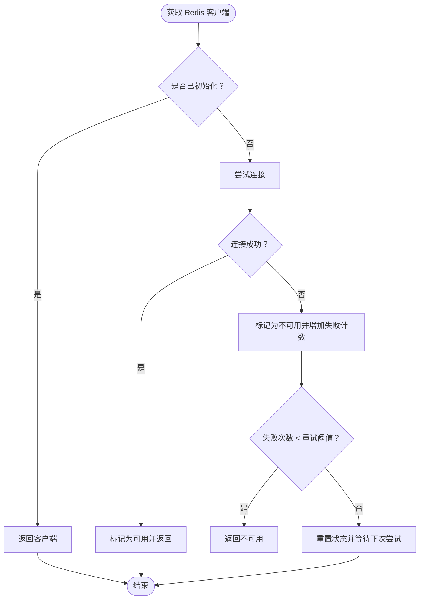
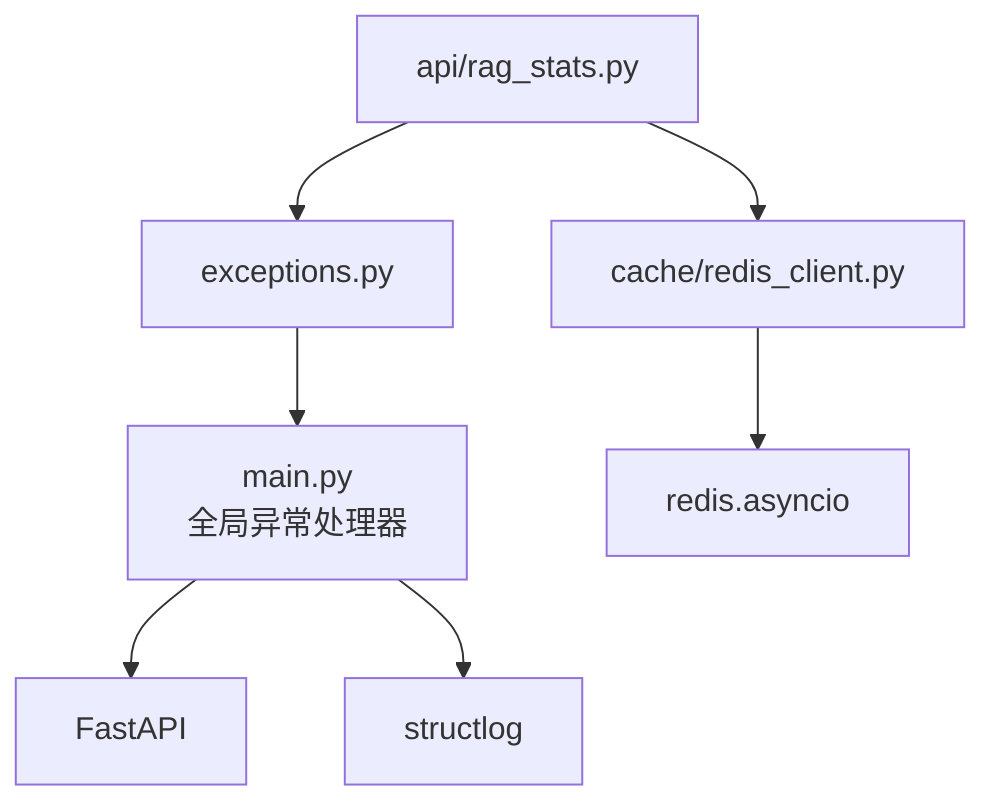

# 异常处理机制

<cite>
**本文引用的文件**
- [exceptions.py](file://backend/app/exceptions.py)
- [main.py](file://backend/app/main.py)
- [rag_stats.py](file://backend/app/api/rag_stats.py)
- [redis_client.py](file://backend/app/cache/redis_client.py)
- [test_exceptions.py](file://backend/tests/test_exceptions.py)
</cite>

## 目录
1. [简介](#简介)
2. [项目结构](#项目结构)
3. [核心组件](#核心组件)
4. [架构总览](#架构总览)
5. [详细组件分析](#详细组件分析)
6. [依赖分析](#依赖分析)
7. [性能考虑](#性能考虑)
8. [故障排除指南](#故障排除指南)
9. [结论](#结论)
10. [附录](#附录)

## 简介
本文件系统性阐述 Aureon 后端的异常处理机制，重点覆盖以下方面：
- 自定义异常类的设计理念与继承关系：AureonException 及其子类的职责与使用场景
- 全局异常处理器的配置与实现：结构化 JSON 响应格式与错误码约定
- 不同类型异常的处理策略、日志记录与客户端响应格式
- 异常捕获最佳实践、调试技巧与故障排除方法
- 实际异常处理示例与自定义异常扩展指导

## 项目结构
后端异常处理相关的关键位置如下：
- 异常定义：backend/app/exceptions.py
- 全局异常处理器与应用启动：backend/app/main.py
- 统计接口中的异常使用与降级策略：backend/app/api/rag_stats.py
- 缓存与 Redis 客户端的异常处理与降级：backend/app/cache/redis_client.py
- 测试用例验证异常行为与降级策略：backend/tests/test_exceptions.py

图表来源
- [main.py:84-97](file://backend/app/main.py#L84-L97)
- [exceptions.py:12-41](file://backend/app/exceptions.py#L12-L41)
- [rag_stats.py:11-12](file://backend/app/api/rag_stats.py#L11-L12)
- [redis_client.py:67-97](file://backend/app/cache/redis_client.py#L67-L97)
- [test_exceptions.py:27-98](file://backend/tests/test_exceptions.py#L27-L98)

章节来源
- [main.py:68-97](file://backend/app/main.py#L68-L97)
- [exceptions.py:12-41](file://backend/app/exceptions.py#L12-L41)
- [rag_stats.py:11-12](file://backend/app/api/rag_stats.py#L11-L12)
- [redis_client.py:67-97](file://backend/app/cache/redis_client.py#L67-L97)
- [test_exceptions.py:27-98](file://backend/tests/test_exceptions.py#L27-L98)

## 核心组件
- 自定义异常基类与子类
  - AureonException：所有 Aureon 特定异常的基类，继承自 FastAPI 的 HTTPException，要求子类显式设置 status_code 以便处理器读取
  - RedisUnavailableError：当 Redis 不可用或返回错误时抛出，状态码固定为 503
  - VectorStoreError：当 ChromaDB/向量存储操作失败时抛出，状态码固定为 500
- 全局异常处理器
  - 注册于应用层，专门处理 AureonException 及其子类
  - 返回结构化 JSON 响应，包含 error（错误类型字符串）与 detail（错误详情）
- 降级策略
  - 在统计接口中，当 Redis 或向量存储出现异常时，采用“优雅降级”：返回 200 成功状态，但将依赖外部服务的数据置零或使用默认值，确保系统可用性与稳定性

章节来源
- [exceptions.py:12-41](file://backend/app/exceptions.py#L12-L41)
- [main.py:84-97](file://backend/app/main.py#L84-L97)
- [rag_stats.py:152-200](file://backend/app/api/rag_stats.py#L152-L200)
- [test_exceptions.py:27-98](file://backend/tests/test_exceptions.py#L27-L98)

## 架构总览
下图展示了异常从产生到被统一处理的整体流程，以及与统计接口降级策略的关系。

图表来源
- [main.py:84-97](file://backend/app/main.py#L84-L97)
- [exceptions.py:12-41](file://backend/app/exceptions.py#L12-L41)
- [rag_stats.py:152-200](file://backend/app/api/rag_stats.py#L152-L200)

## 详细组件分析

### 自定义异常类设计与继承关系
- 设计理念
  - 将业务特定错误抽象为可识别的异常类型，便于统一处理与客户端解析
  - 通过 error_type 字段与结构化响应配合，提供一致的错误标识
  - 子类显式设置 status_code，避免运行时反射带来的不确定性
- 继承关系
  - AureonException → RedisUnavailableError（503）
  - AureonException → VectorStoreError（500）

图表来源
- [exceptions.py:12-41](file://backend/app/exceptions.py#L12-L41)

章节来源
- [exceptions.py:12-41](file://backend/app/exceptions.py#L12-L41)

### 全局异常处理器配置与实现
- 注册方式
  - 在应用对象上注册异常处理器，专门处理 AureonException 类型
- 响应格式
  - 结构化 JSON，包含 error（错误类型）与 detail（错误详情）
  - 状态码来自异常对象的 status_code 属性
- 日志与安全头
  - 应用中间件负责注入请求 ID 并记录请求完成信息
  - 中间件统一添加安全响应头，提升安全性

图表来源
- [main.py:84-97](file://backend/app/main.py#L84-L97)

章节来源
- [main.py:84-97](file://backend/app/main.py#L84-L97)
- [main.py:100-124](file://backend/app/main.py#L100-L124)

### 统计接口中的异常处理与降级策略
- 场景与目标
  - 当 Redis 不可用或向量存储异常时，不中断整体服务，而是返回 200 成功状态
  - 对依赖外部服务的数据字段置零或使用默认值，保证接口可用性
- 关键点
  - Redis 可用性检测与连接失败回退至内存缓存
  - 向量存储异常时，文档计数等数据置零，但不影响其他可用指标
  - 对于特定内部错误，构造并抛出 AureonException 子类以触发统一处理

图表来源
- [rag_stats.py:152-200](file://backend/app/api/rag_stats.py#L152-L200)
- [test_exceptions.py:27-98](file://backend/tests/test_exceptions.py#L27-L98)

章节来源
- [rag_stats.py:152-200](file://backend/app/api/rag_stats.py#L152-L200)
- [test_exceptions.py:27-98](file://backend/tests/test_exceptions.py#L27-L98)

### Redis 客户端异常处理与降级
- 连接与重试
  - 单例模式获取 Redis 客户端，失败时记录告警并设置哨兵值，支持一定次数的失败后重试
- 读写异常处理
  - 读取/写入异常时记录调试日志并回退到内存缓存
- 关闭连接
  - 应用关闭时安全关闭 Redis 连接

图表来源
- [redis_client.py:67-97](file://backend/app/cache/redis_client.py#L67-L97)
- [redis_client.py:106-144](file://backend/app/cache/redis_client.py#L106-L144)

章节来源
- [redis_client.py:67-97](file://backend/app/cache/redis_client.py#L67-L97)
- [redis_client.py:106-144](file://backend/app/cache/redis_client.py#L106-L144)

### 测试用例验证异常行为与降级策略
- 验证点
  - 自定义异常类是否产生正确的 HTTP 状态码
  - 统计接口在 Redis 不可用或向量存储异常时是否返回 200 并置零相关指标
  - 部分数据缺失时是否仍能返回可用指标
- 方法
  - 通过依赖覆盖与 mock/partial mock 控制外部服务行为
  - 使用 ASGI 客户端发起请求并断言响应状态码与 JSON 内容

章节来源
- [test_exceptions.py:27-98](file://backend/tests/test_exceptions.py#L27-L98)

## 依赖分析
- 组件耦合
  - 全局异常处理器仅依赖异常基类与 FastAPI 的 JSONResponse
  - 统计接口依赖异常基类与 Redis/向量存储客户端，但通过降级策略降低耦合风险
- 外部依赖
  - FastAPI：异常处理与路由框架
  - structlog：结构化日志记录
  - redis.asyncio：异步 Redis 客户端

图表来源
- [main.py:84-97](file://backend/app/main.py#L84-L97)
- [exceptions.py:12-41](file://backend/app/exceptions.py#L12-L41)
- [rag_stats.py:11-12](file://backend/app/api/rag_stats.py#L11-L12)
- [redis_client.py:83-97](file://backend/app/cache/redis_client.py#L83-L97)

章节来源
- [main.py:84-97](file://backend/app/main.py#L84-L97)
- [exceptions.py:12-41](file://backend/app/exceptions.py#L12-L41)
- [rag_stats.py:11-12](file://backend/app/api/rag_stats.py#L11-L12)
- [redis_client.py:83-97](file://backend/app/cache/redis_client.py#L83-L97)

## 性能考虑
- 降级策略减少外部依赖故障对主路径的影响，提高整体可用性
- Redis 客户端的失败计数与重试机制避免频繁连接开销
- 中间件统一注入请求 ID 与安全头，便于追踪与防护，同时保持较低开销

## 故障排除指南
- 常见问题定位
  - 确认异常是否为 AureonException 子类：若是，将走统一结构化响应；若否，检查默认异常处理
  - 检查 Redis 可用性与连接参数：确认哨兵值与失败计数状态
  - 观察日志输出：中间件会记录请求完成信息，有助于定位耗时与错误
- 排查步骤
  - 在统计接口中模拟 Redis 不可用与向量存储异常，验证降级逻辑是否生效
  - 使用测试用例作为参考，逐步替换依赖并观察响应
- 相关实现参考
  - 全局异常处理器与中间件配置
  - 统计接口的降级与异常抛出逻辑
  - Redis 客户端的连接与异常处理

章节来源
- [main.py:84-97](file://backend/app/main.py#L84-L97)
- [main.py:100-124](file://backend/app/main.py#L100-L124)
- [rag_stats.py:152-200](file://backend/app/api/rag_stats.py#L152-L200)
- [redis_client.py:67-97](file://backend/app/cache/redis_client.py#L67-L97)

## 结论
Aureon 的异常处理机制通过“自定义异常 + 全局处理器 + 优雅降级”的组合，实现了业务错误的统一表达与稳定的服务可用性。该方案既保证了客户端能够获得结构化的错误信息，又在外部依赖异常时维持核心功能的连续性，适合生产环境的高可用需求。

## 附录
- 错误响应格式
  - 字段：error（错误类型字符串）、detail（错误详情）
  - 状态码：来源于异常对象的 status_code
- 扩展自定义异常
  - 新增子类时需设置 error_type 与合适的 status_code
  - 在业务模块中按需抛出，必要时在上游捕获并转换为统一异常类型
- 最佳实践
  - 明确区分 AureonException 与普通异常，避免混用
  - 在外部依赖失败时优先采用降级策略而非直接抛错
  - 使用结构化日志记录关键事件，便于审计与排障