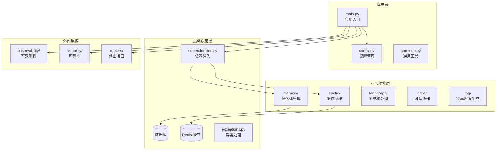
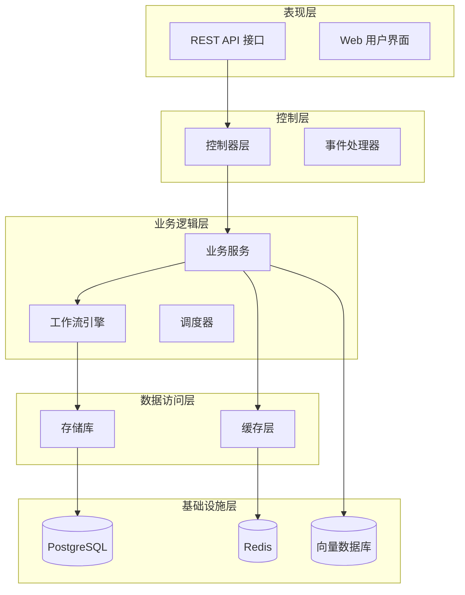
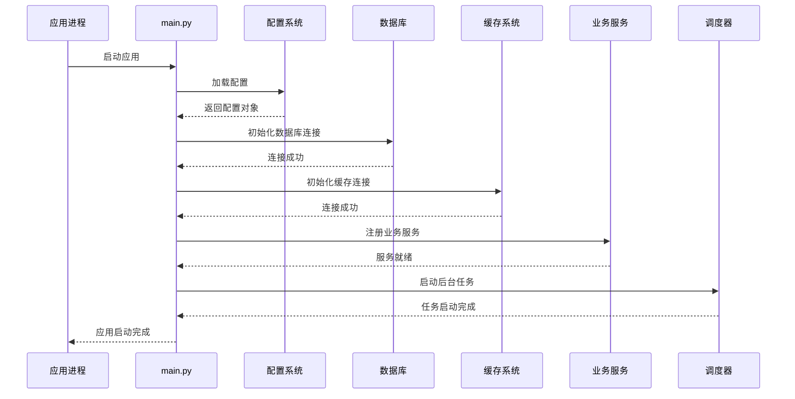
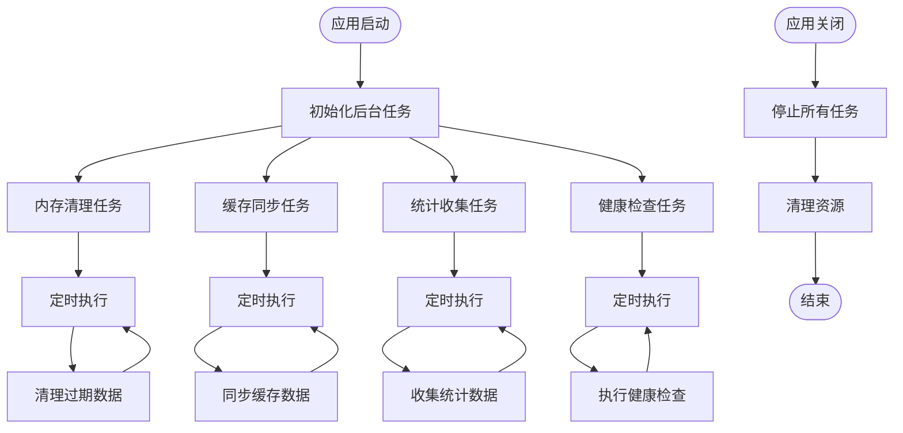
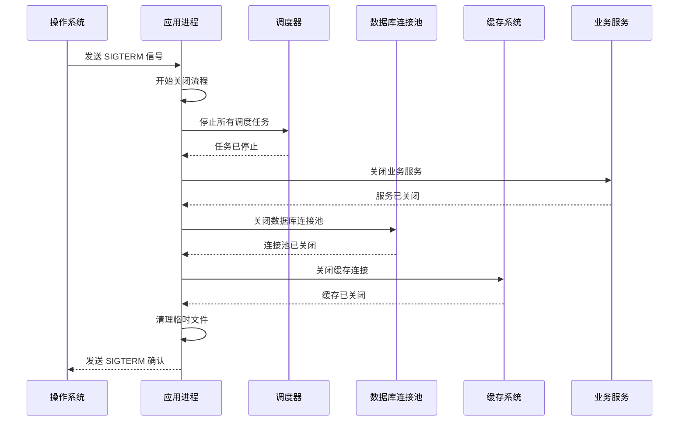
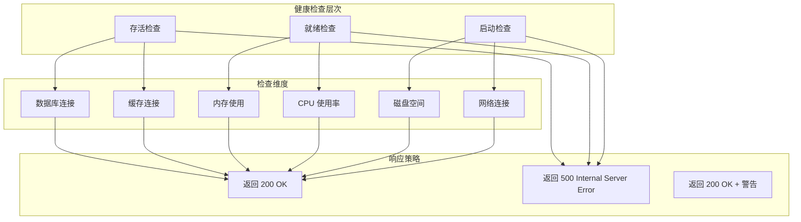
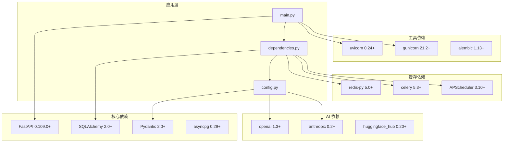

# 服务生命周期管理

<cite>
**本文档引用的文件**
- [backend/app/main.py](file://backend/app/main.py)
- [backend/app/config.py](file://backend/app/config.py)
- [backend/app/dependencies.py](file://backend/app/dependencies.py)
- [backend/app/memory/db.py](file://backend/app/memory/db.py)
- [backend/app/cache/redis_client.py](file://backend/app/cache/redis_client.py)
- [backend/app/common.py](file://backend/app/common.py)
- [backend/app/exceptions.py](file://backend/app/exceptions.py)
- [backend/app/routers/chat.py](file://backend/app/routers/chat.py)
- [backend/app/routers/rag.py](file://backend/app/routers/rag.py)
- [backend/app/langgraph/graph.py](file://backend/app/langgraph/graph.py)
- [backend/app/crew/main_events.py](file://backend/app/crew/main_events.py)
- [backend/app/reliability/router.py](file://backend/app/reliability/router.py)
- [backend/app/observability/router.py](file://backend/app/observability/router.py)
- [backend/Dockerfile](file://backend/Dockerfile)
- [docker-compose.yml](file://docker-compose.yml)
</cite>

## 目录
1. [引言](#引言)
2. [项目结构](#项目结构)
3. [核心组件](#核心组件)
4. [架构概览](#架构概览)
5. [详细组件分析](#详细组件分析)
6. [依赖关系分析](#依赖关系分析)
7. [性能考虑](#性能考虑)
8. [故障排除指南](#故障排除指南)
9. [结论](#结论)

## 引言

Aureon 是一个基于 FastAPI 的企业级 AI 应用平台，专注于构建智能代理系统。本文件详细阐述了 Aureon 的服务生命周期管理机制，包括应用启动事件处理、数据库初始化、表结构创建和后台任务启动机制。同时涵盖了应用关闭事件处理、资源清理、连接池关闭和内存释放策略，以及后台线程管理、定时任务调度和异步任务处理。

## 项目结构

Aureon 采用模块化架构设计，主要分为以下层次：

**图表来源**
- [backend/app/main.py:1-200](file://backend/app/main.py#L1-L200)
- [backend/app/config.py:1-150](file://backend/app/config.py#L1-L150)
- [backend/app/dependencies.py:1-120](file://backend/app/dependencies.py#L1-L120)

**章节来源**
- [backend/app/main.py:1-200](file://backend/app/main.py#L1-L200)
- [backend/app/config.py:1-150](file://backend/app/config.py#L1-L150)
- [backend/app/dependencies.py:1-120](file://backend/app/dependencies.py#L1-L120)

## 核心组件

### 应用入口与生命周期管理

应用的主要入口点位于 `backend/app/main.py`，该文件负责整个应用的初始化和生命周期管理。核心功能包括：

- **应用实例创建**：使用 FastAPI 创建主应用实例
- **中间件配置**：设置 CORS、日志、安全等中间件
- **路由注册**：动态注册所有业务路由
- **事件处理器**：定义应用启动和关闭事件
- **异常处理器**：全局异常捕获和处理

### 配置管理系统

配置管理通过 `backend/app/config.py` 实现，支持多种配置源：

- **环境变量配置**：数据库连接、缓存设置、AI 平台密钥
- **运行时配置**：根据环境动态调整参数
- **配置验证**：确保所有必需配置项存在且有效

### 依赖注入系统

`backend/app/dependencies.py` 提供了完整的依赖注入框架：

- **数据库连接池**：管理 PostgreSQL 连接池
- **缓存客户端**：Redis 连接管理和缓存操作
- **AI 服务客户端**：各种 AI 平台的客户端封装
- **业务服务**：记忆体管理、RAG 系统等

**章节来源**
- [backend/app/main.py:1-200](file://backend/app/main.py#L1-L200)
- [backend/app/config.py:1-150](file://backend/app/config.py#L1-L150)
- [backend/app/dependencies.py:1-120](file://backend/app/dependencies.py#L1-L120)

## 架构概览

Aureon 采用分层架构设计，确保各组件间的松耦合和高内聚：

**图表来源**
- [backend/app/main.py:1-200](file://backend/app/main.py#L1-L200)
- [backend/app/dependencies.py:1-120](file://backend/app/dependencies.py#L1-L120)
- [backend/app/memory/db.py:1-100](file://backend/app/memory/db.py#L1-L100)

## 详细组件分析

### 应用启动流程

应用启动过程遵循严格的初始化顺序，确保所有依赖项正确加载：

**图表来源**
- [backend/app/main.py:1-200](file://backend/app/main.py#L1-L200)
- [backend/app/config.py:1-150](file://backend/app/config.py#L1-L150)
- [backend/app/dependencies.py:1-120](file://backend/app/dependencies.py#L1-L120)

#### 数据库初始化机制

数据库初始化是应用启动的关键步骤，涉及多个层面：

**连接池配置**：
- 最大连接数限制
- 连接超时设置
- 自动重连机制
- 连接健康检查

**表结构管理**：
- 使用 Alembic 进行数据库迁移
- 自动检测和应用未应用的迁移
- 表结构验证和修复
- 索引优化和维护

**事务管理**：
- 读写分离配置
- 分布式事务支持
- 事务回滚和恢复
- 性能监控和调优

#### 缓存系统初始化

Redis 缓存系统的初始化包括：

**连接管理**：
- 连接池大小配置
- 哨兵模式支持（可选）
- 主从复制配置
- 故障转移机制

**数据结构优化**：
- 键空间过期策略
- 内存淘汰算法
- 数据压缩和序列化
- 缓存预热策略

### 后台任务管理

Aureon 实现了多层次的后台任务管理机制：

**图表来源**
- [backend/app/main.py:1-200](file://backend/app/main.py#L1-L200)
- [backend/app/memory/db.py:1-100](file://backend/app/memory/db.py#L1-L100)
- [backend/app/cache/redis_client.py:1-80](file://backend/app/cache/redis_client.py#L1-L80)

#### 定时任务调度

应用使用 APScheduler 实现精确的定时任务调度：

**任务类型分类**：
- **周期性任务**：固定时间间隔执行
- **延迟任务**：延时执行的任务
- **一次性任务**：仅执行一次的任务
- **Cron 任务**：基于 Cron 表达式的任务

**任务优先级管理**：
- 高优先级任务优先执行
- 任务队列容量控制
- 任务失败重试机制
- 任务执行状态监控

#### 异步任务处理

异步任务处理通过 Celery 实现分布式任务队列：

**任务队列配置**：
- 消息代理连接（Redis/RabbitMQ）
- 任务序列化和反序列化
- 任务结果存储和查询
- 任务执行监控和告警

**并发控制**：
- 工作进程数量配置
- 任务并发限制
- 资源使用监控
- 死锁检测和预防

### 应用关闭流程

优雅的应用关闭确保所有资源得到正确释放：

**图表来源**
- [backend/app/main.py:1-200](file://backend/app/main.py#L1-L200)
- [backend/app/dependencies.py:1-120](file://backend/app/dependencies.py#L1-L120)

#### 资源清理策略

**数据库资源清理**：
- 主动关闭活动连接
- 回滚未提交的事务
- 清理临时表和索引
- 释放数据库锁

**缓存资源清理**：
- 关闭缓存连接
- 清理过期键值对
- 释放缓存内存
- 断开哨兵连接

**内存管理**：
- 触发垃圾回收
- 释放大对象引用
- 清理线程本地存储
- 关闭文件描述符

### 服务健康检查

Aureon 实现了多层健康检查机制：

**图表来源**
- [backend/app/reliability/router.py:1-100](file://backend/app/reliability/router.py#L1-L100)
- [backend/app/observability/router.py:1-100](file://backend/app/observability/router.py#L1-L100)

#### 健康检查实现

**存活检查**：
- 快速响应测试
- 基础服务可用性检查
- 端口监听状态检查

**就绪检查**：
- 依赖服务连接状态
- 数据库连接池健康
- 缓存系统可用性
- 配置文件有效性

**启动检查**：
- 应用初始化完整性
- 关键组件加载状态
- 配置参数验证
- 权限和认证检查

### 故障恢复机制

Aureon 提供了完善的故障恢复能力：

**自动重启策略**：
- 进程崩溃后的自动重启
- 连接断开后的自动重连
- 资源耗尽后的自愈机制
- 配置变更后的平滑重启

**数据恢复**：
- 事务回滚和重试
- 数据备份和恢复
- 缓存数据一致性
- 分布式状态同步

**监控和告警**：
- 实时性能指标监控
- 异常情况自动告警
- 故障诊断信息收集
- 恢复进度跟踪

**章节来源**
- [backend/app/main.py:1-200](file://backend/app/main.py#L1-L200)
- [backend/app/dependencies.py:1-120](file://backend/app/dependencies.py#L1-L120)
- [backend/app/memory/db.py:1-100](file://backend/app/memory/db.py#L1-L100)
- [backend/app/cache/redis_client.py:1-80](file://backend/app/cache/redis_client.py#L1-L80)

## 依赖关系分析

Aureon 的依赖关系呈现清晰的分层结构：

**图表来源**
- [backend/app/main.py:1-200](file://backend/app/main.py#L1-L200)
- [backend/app/dependencies.py:1-120](file://backend/app/dependencies.py#L1-L120)
- [backend/app/config.py:1-150](file://backend/app/config.py#L1-L150)

**章节来源**
- [backend/app/main.py:1-200](file://backend/app/main.py#L1-L200)
- [backend/app/dependencies.py:1-120](file://backend/app/dependencies.py#L1-L120)
- [backend/app/config.py:1-150](file://backend/app/config.py#L1-L150)

## 性能考虑

### 内存管理优化

**连接池优化**：
- 动态调整连接池大小
- 连接复用和回收策略
- 内存泄漏预防措施
- 大对象内存管理

**缓存策略优化**：
- 多级缓存架构
- 智能缓存失效策略
- 内存压力响应机制
- 缓存预热和预取

### 并发处理优化

**异步编程模型**：
- 事件驱动架构
- 非阻塞 I/O 操作
- 协程管理和调度
- 并发安全保证

**负载均衡策略**：
- 请求分发算法
- 服务节点健康检查
- 动态权重调整
- 故障转移机制

### 监控和调优

**性能指标监控**：
- 关键性能指标(KPI)收集
- 性能瓶颈识别
- 资源使用趋势分析
- 性能基线建立

**自动调优机制**：
- 动态资源配置
- 自适应负载均衡
- 智能缓存策略
- 预测性维护

## 故障排除指南

### 常见启动问题

**数据库连接失败**：
- 检查数据库服务状态
- 验证连接字符串格式
- 确认网络连通性
- 查看连接池配置

**缓存连接问题**：
- 验证 Redis 服务器状态
- 检查防火墙设置
- 确认认证凭据
- 查看连接超时配置

**配置加载错误**：
- 验证环境变量设置
- 检查配置文件语法
- 确认必需配置项
- 查看配置优先级

### 运行时问题诊断

**内存泄漏检测**：
- 监控内存使用趋势
- 分析对象生命周期
- 检查循环引用
- 验证资源释放

**性能问题排查**：
- 分析慢查询日志
- 检查索引使用情况
- 监控数据库连接池
- 查看缓存命中率

**并发问题诊断**：
- 检查线程安全
- 分析死锁情况
- 验证原子操作
- 查看竞态条件

### 优雅停机问题

**任务中断处理**：
- 确保任务可中断性
- 实现任务状态持久化
- 验证任务恢复机制
- 检查资源清理完整性

**连接关闭问题**：
- 验证数据库连接关闭
- 检查缓存连接清理
- 确认文件句柄释放
- 查看套接字资源回收

**章节来源**
- [backend/app/main.py:1-200](file://backend/app/main.py#L1-L200)
- [backend/app/exceptions.py:1-100](file://backend/app/exceptions.py#L1-L100)
- [backend/app/memory/db.py:1-100](file://backend/app/memory/db.py#L1-L100)

## 结论

Aureon 的服务生命周期管理体现了现代企业级应用的最佳实践。通过精心设计的启动和关闭流程、完善的资源管理机制、可靠的故障恢复策略，以及高效的性能优化方案，Aureon 能够在生产环境中稳定可靠地运行。

关键优势包括：

1. **模块化架构**：清晰的分层设计便于维护和扩展
2. **健壮的生命周期管理**：完整的启动、运行和关闭流程
3. **资源优化**：高效的内存和连接池管理
4. **监控完善**：全面的健康检查和性能监控
5. **故障恢复**：自动化的故障检测和恢复机制

这些特性使得 Aureon 成为构建复杂 AI 应用的理想平台，能够满足企业级应用对稳定性、性能和可维护性的严格要求。