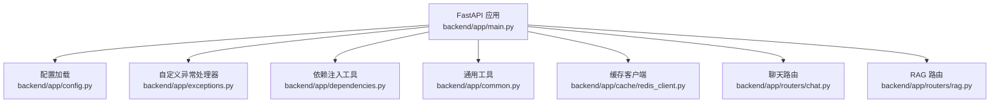
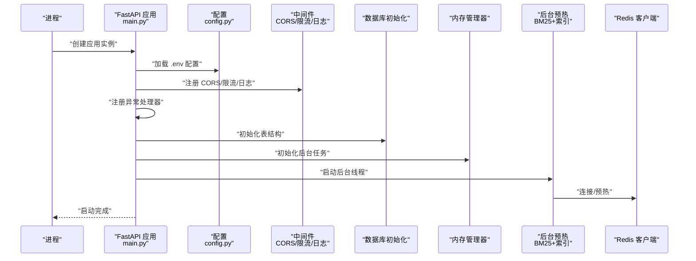
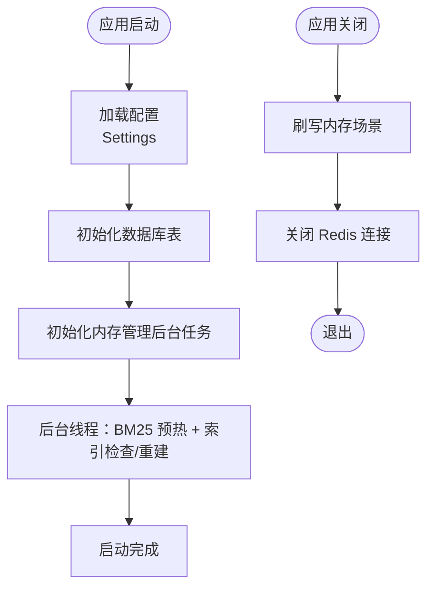
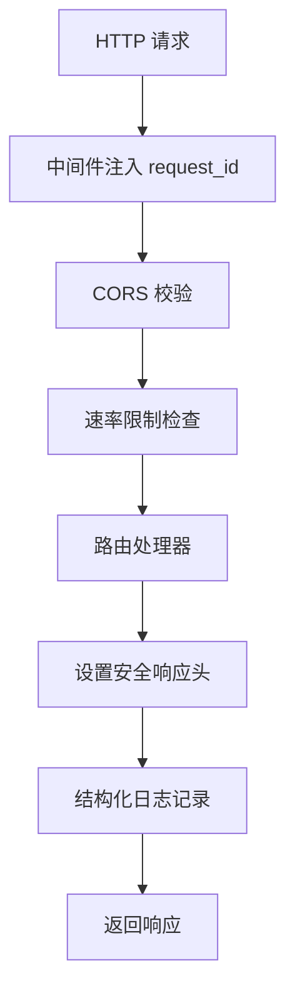
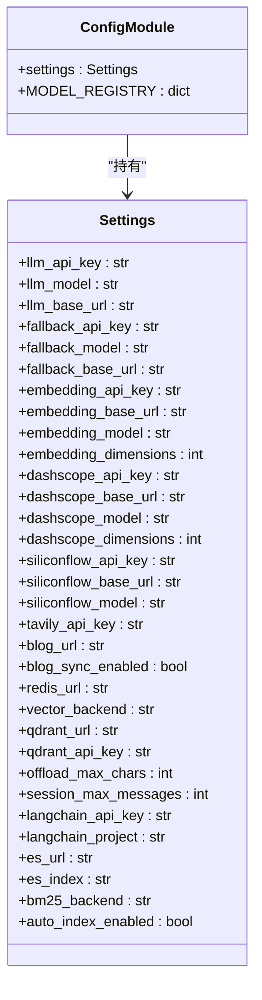
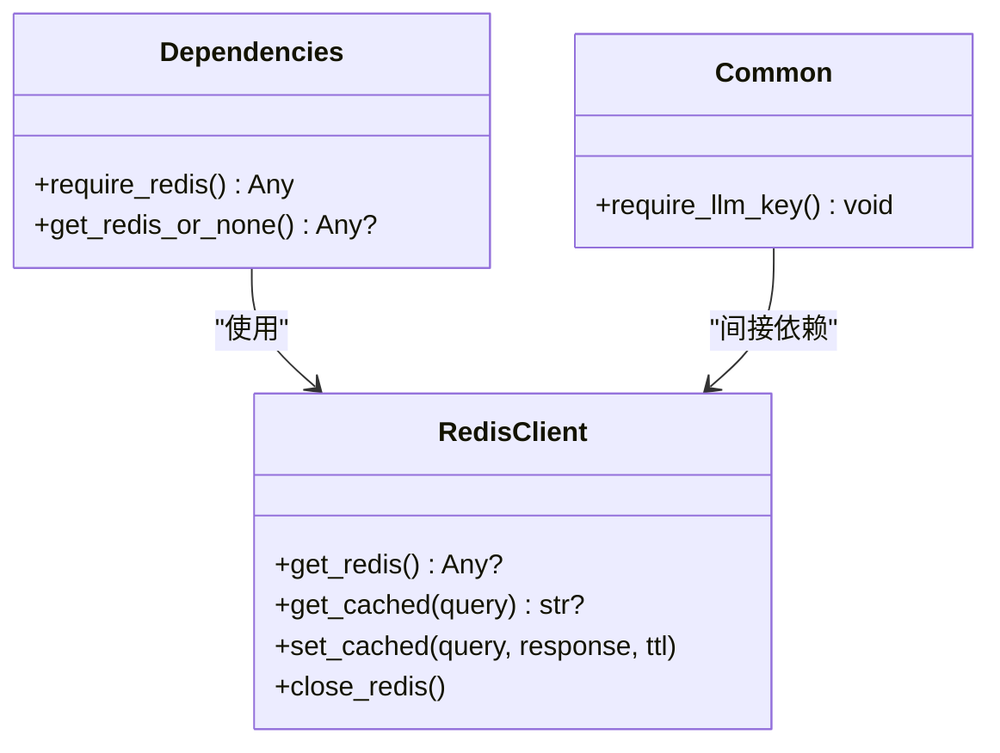
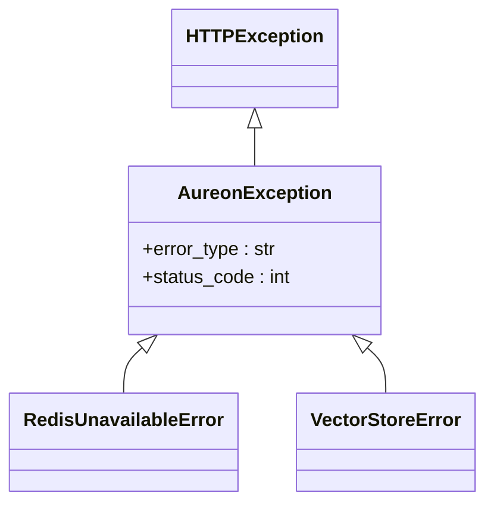
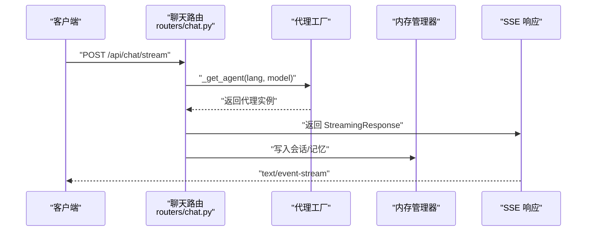
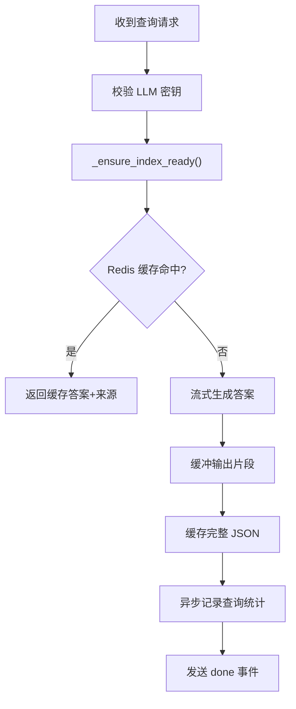
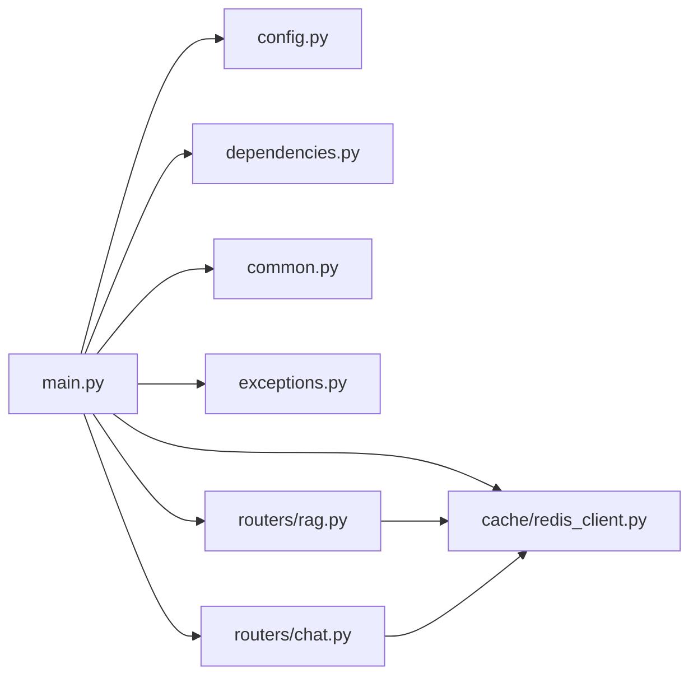

# 核心应用架构

<cite>
**本文引用的文件**
- [backend/app/main.py](file://backend/app/main.py)
- [backend/app/config.py](file://backend/app/config.py)
- [backend/app/dependencies.py](file://backend/app/dependencies.py)
- [backend/app/common.py](file://backend/app/common.py)
- [backend/app/exceptions.py](file://backend/app/exceptions.py)
- [backend/app/cache/redis_client.py](file://backend/app/cache/redis_client.py)
- [backend/app/routers/chat.py](file://backend/app/routers/chat.py)
- [backend/app/routers/rag.py](file://backend/app/routers/rag.py)
</cite>

## 目录
1. [引言](#引言)
2. [项目结构](#项目结构)
3. [核心组件](#核心组件)
4. [架构总览](#架构总览)
5. [详细组件分析](#详细组件分析)
6. [依赖关系分析](#依赖关系分析)
7. [性能考量](#性能考量)
8. [故障排查指南](#故障排查指南)
9. [结论](#结论)
10. [附录](#附录)

## 引言
本文件面向 Aureon 后端 FastAPI 应用的核心架构与实现细节，围绕以下主题展开：应用初始化流程、配置管理与校验、依赖注入与中间件体系、应用生命周期事件与后台任务、全局中间件（CORS、速率限制、安全头、结构化日志）、状态管理与环境变量处理、错误处理策略与监控集成方案，并提供最佳实践与排障建议。

## 项目结构
后端采用分层与功能域结合的组织方式：
- 应用入口与全局配置：backend/app/main.py、backend/app/config.py
- 依赖注入与通用工具：backend/app/dependencies.py、backend/app/common.py
- 自定义异常体系：backend/app/exceptions.py
- 缓存与连接管理：backend/app/cache/redis_client.py
- 路由模块：backend/app/routers/chat.py、backend/app/routers/rag.py
- 其他子系统：agent、crew、langgraph、memory、observability、security、evaluation、cost、reliability、knowledge、ai_platform、integration 等（通过主应用统一挂载）

图表来源
- [backend/app/main.py:68-371](file://backend/app/main.py#L68-L371)
- [backend/app/config.py:4-90](file://backend/app/config.py#L4-L90)
- [backend/app/exceptions.py:12-41](file://backend/app/exceptions.py#L12-L41)
- [backend/app/dependencies.py:14-38](file://backend/app/dependencies.py#L14-L38)
- [backend/app/common.py:57-67](file://backend/app/common.py#L57-L67)
- [backend/app/cache/redis_client.py:67-161](file://backend/app/cache/redis_client.py#L67-L161)
- [backend/app/routers/chat.py:34-107](file://backend/app/routers/chat.py#L34-L107)
- [backend/app/routers/rag.py:86-566](file://backend/app/routers/rag.py#L86-L566)

章节来源
- [backend/app/main.py:68-371](file://backend/app/main.py#L68-L371)
- [backend/app/config.py:4-90](file://backend/app/config.py#L4-L90)

## 核心组件
- 应用实例与中间件
  - 使用 FastAPI 实例并注册 CORS、Prometheus 指标暴露、结构化日志中间件、速率限制器与全局异常处理器。
- 配置管理
  - 基于 pydantic-settings 的 Settings 类，从 .env 文件加载键值，支持多提供商 LLM/Embedding、缓存与向量存储等配置项。
- 依赖注入
  - 提供 require_redis/get_redis_or_none 等依赖，统一 Redis 可用性检查与降级策略；提供 require_llm_key 等快速校验依赖。
- 缓存与连接
  - Redis 客户端单例封装，支持连接失败重试、内存回退、版本化键空间、优雅关闭。
- 路由与业务
  - 聊天流式对话与增强对话（LangGraph）、RAG 查询与增量索引、文档上传与评估、健康检查与指标查询等。

章节来源
- [backend/app/main.py:68-125](file://backend/app/main.py#L68-L125)
- [backend/app/config.py:4-90](file://backend/app/config.py#L4-L90)
- [backend/app/dependencies.py:14-38](file://backend/app/dependencies.py#L14-L38)
- [backend/app/cache/redis_client.py:67-161](file://backend/app/cache/redis_client.py#L67-L161)
- [backend/app/routers/chat.py:34-107](file://backend/app/routers/chat.py#L34-L107)
- [backend/app/routers/rag.py:86-566](file://backend/app/routers/rag.py#L86-L566)

## 架构总览
下图展示应用启动、请求处理与资源管理的关键路径：

图表来源
- [backend/app/main.py:171-205](file://backend/app/main.py#L171-L205)
- [backend/app/config.py:62-65](file://backend/app/config.py#L62-L65)
- [backend/app/cache/redis_client.py:67-98](file://backend/app/cache/redis_client.py#L67-L98)

## 详细组件分析

### 应用初始化与生命周期
- 初始化阶段
  - 结构化日志初始化（控制台或 JSON 渲染）
  - 速率限制器注册与异常处理
  - CORS 中间件配置（允许来源、方法、头部）
  - Prometheus 指标暴露端点注册
  - 数据库与特征开关、可观测性、安全、评估、成本、可靠性、知识、AI 平台、集成等子系统的表初始化
  - 内存管理器后台任务初始化
  - 后台线程执行 BM25 预热与向量索引检查/自动重建
- 关闭阶段
  - 内存场景刷写与 Redis 连接关闭

图表来源
- [backend/app/main.py:171-211](file://backend/app/main.py#L171-L211)
- [backend/app/cache/redis_client.py:152-161](file://backend/app/cache/redis_client.py#L152-L161)

章节来源
- [backend/app/main.py:171-211](file://backend/app/main.py#L171-L211)

### 全局中间件与安全头
- CORS
  - 来源来源于环境变量，默认允许本地前端开发端口
- 速率限制
  - 使用 slowapi 基于客户端 IP 限流，全局异常处理器返回统一 JSON
- 结构化日志中间件
  - 注入 request_id，记录请求完成信息（方法、路径、状态码、耗时）
- 安全响应头
  - X-Content-Type-Options、X-Frame-Options、X-XSS-Protection、Referrer-Policy

图表来源
- [backend/app/main.py:73-124](file://backend/app/main.py#L73-L124)

章节来源
- [backend/app/main.py:73-124](file://backend/app/main.py#L73-L124)

### 配置管理与环境变量处理
- 配置模型
  - LLM 主/备密钥与基础地址、嵌入模型与维度、DashScope/SiliconFlow/Zhipu 多提供商链路、Tavily、博客同步开关、Redis、向量存储后端（Chroma/Qdrant）、Elasticsearch BM25、自动索引开关、LangChain 集成参数、会话与离线上限等
- 加载机制
  - 通过 pydantic_settings 从 .env 文件加载，UTF-8 编码，额外字段忽略
- 模型注册表
  - MODEL_REGISTRY 维护常用模型元数据，便于路由层按名称选择

图表来源
- [backend/app/config.py:4-90](file://backend/app/config.py#L4-L90)

章节来源
- [backend/app/config.py:4-90](file://backend/app/config.py#L4-L90)

### 依赖注入与资源管理
- Redis 依赖
  - require_redis：当 Redis 不可用时返回 503
  - get_redis_or_none：降级返回 None，适合可选功能
- LLM 密钥依赖
  - require_llm_key：当未配置主/备密钥时返回 503
- 缓存客户端
  - 单例连接、失败重试、内存回退、版本化键空间、优雅关闭

图表来源
- [backend/app/dependencies.py:14-38](file://backend/app/dependencies.py#L14-L38)
- [backend/app/common.py:57-67](file://backend/app/common.py#L57-L67)
- [backend/app/cache/redis_client.py:147-161](file://backend/app/cache/redis_client.py#L147-L161)

章节来源
- [backend/app/dependencies.py:14-38](file://backend/app/dependencies.py#L14-L38)
- [backend/app/common.py:57-67](file://backend/app/common.py#L57-L67)
- [backend/app/cache/redis_client.py:67-161](file://backend/app/cache/redis_client.py#L67-L161)

### 错误处理与异常体系
- 自定义异常基类
  - AureonException：统一 error_type 与状态码
  - 子类：RedisUnavailableError、VectorStoreError
- 全局异常处理器
  - 将 AureonException 转换为结构化 JSON（error_type、detail），便于前端一致处理
- 速率限制异常
  - RateLimitExceeded 使用统一处理器返回标准 JSON

图表来源
- [backend/app/exceptions.py:12-41](file://backend/app/exceptions.py#L12-L41)

章节来源
- [backend/app/exceptions.py:12-41](file://backend/app/exceptions.py#L12-L41)
- [backend/app/main.py:88-97](file://backend/app/main.py#L88-L97)

### 聊天与增强对话流
- 路由
  - /api/chat/stream：基础聊天流式输出
  - /api/chat/enhanced/stream：LangGraph 意图路由 + RAG 增强流式输出
- 代理缓存
  - 按语言与模型键缓存代理实例，避免重复创建
- 流式响应头
  - 保持长连接、禁用缓存、Nginx 兼容

图表来源
- [backend/app/routers/chat.py:46-93](file://backend/app/routers/chat.py#L46-L93)

章节来源
- [backend/app/routers/chat.py:34-107](file://backend/app/routers/chat.py#L34-L107)

### RAG 查询与缓存流水线
- 路由
  - /api/rag/query：带 Redis 缓存的问答
  - /api/rag/query/stream：带缓冲的流式问答 + 缓存
  - /api/rag/index：重建索引并清空缓存 + 强制 BM25 重建
  - /api/rag/upload：上传文档并增量索引
  - /api/rag/evaluate /experiment /health /benchmark /cache/clear /suggestions
- 缓存策略
  - 先查内存缓存，再查 Redis；命中则直接返回答案与来源；未命中则流式生成并缓存完整 JSON（answer + sources）
- 速率限制
  - 路由级慢速限流装饰器
- 安全校验
  - 上传接口对文件名进行路径穿越防护与大小限制
- 指标与统计
  - 记录查询来源数量、延迟、输入/输出 token 估算，异步上报

图表来源
- [backend/app/routers/rag.py:86-267](file://backend/app/routers/rag.py#L86-L267)
- [backend/app/cache/redis_client.py:106-145](file://backend/app/cache/redis_client.py#L106-L145)

章节来源
- [backend/app/routers/rag.py:86-566](file://backend/app/routers/rag.py#L86-L566)
- [backend/app/cache/redis_client.py:106-145](file://backend/app/cache/redis_client.py#L106-L145)

## 依赖关系分析
- 组件耦合
  - main.py 作为中枢，集中注册中间件、异常处理器、子系统初始化与静态资源挂载
  - routers 通过依赖注入获取 Redis、LLM、内存管理器等服务
  - cache/redis_client.py 对配置有直接依赖（redis_url），并在关闭时被 main.py 调用
- 外部依赖
  - Prometheus 指标、slowapi 速率限制、structlog 结构化日志、redis.asyncio、pydantic-settings

图表来源
- [backend/app/main.py:68-371](file://backend/app/main.py#L68-L371)
- [backend/app/routers/chat.py:18-25](file://backend/app/routers/chat.py#L18-L25)
- [backend/app/routers/rag.py:30-48](file://backend/app/routers/rag.py#L30-L48)

章节来源
- [backend/app/main.py:68-371](file://backend/app/main.py#L68-L371)
- [backend/app/routers/chat.py:18-25](file://backend/app/routers/chat.py#L18-L25)
- [backend/app/routers/rag.py:30-48](file://backend/app/routers/rag.py#L30-L48)

## 性能考量
- 启动性能
  - 后台线程执行 BM25 预热与索引检查，避免阻塞主事件循环
  - 预热完成后标记就绪，健康检查据此返回状态
- 流式输出
  - SSE 缓冲策略降低首字节时间（TTFT）影响，提升用户体验
- 缓存策略
  - 内存回退 + 版本化键空间，命中后直接返回 JSON，减少 LLM 调用
- 速率限制
  - 全局与路由级限流，防止突发流量导致下游过载
- 指标与可观测性
  - Prometheus 指标暴露端点，便于外部采集与告警

## 故障排查指南
- 启动阶段
  - 若 LLM API 密钥未配置，将出现警告；相关路由会返回 503
  - Redis 连接失败会被记录为警告，不影响应用启动，但缓存功能降级
- 运行阶段
  - 速率限制触发：检查客户端 IP 与限流策略
  - RAG 查询失败：确认索引是否就绪，必要时调用重建索引接口
  - 上传失败：检查文件大小、扩展名与 API Key（如启用）
- 日志与诊断
  - 使用结构化日志中间件记录请求完成信息，定位耗时与错误
  - 查看 Prometheus 指标端点以评估吞吐与延迟

章节来源
- [backend/app/main.py:171-211](file://backend/app/main.py#L171-L211)
- [backend/app/routers/rag.py:86-131](file://backend/app/routers/rag.py#L86-L131)
- [backend/app/cache/redis_client.py:93-96](file://backend/app/cache/redis_client.py#L93-L96)

## 结论
Aureon 的核心应用以 FastAPI 为基础，通过集中式初始化、结构化日志、速率限制与安全头、统一异常处理、可降级缓存与后台预热，构建了高可用、可观测且易维护的服务架构。配置模型覆盖多提供商 LLM/Embedding，路由模块清晰分离业务边界，依赖注入与资源管理确保运行期稳定性。建议在生产环境中结合 Prometheus/Grafana 与日志平台完善监控，并持续优化缓存命中率与索引更新策略。

## 附录
- 最佳实践
  - 在 .env 中集中管理密钥与开关，避免硬编码
  - 对关键路由启用速率限制与输入校验
  - 使用 require_redis/get_redis_or_none 区分强制与可降级场景
  - 定期检查索引健康状态并按需重建
  - 利用 /metrics 端点接入监控体系，设置告警阈值