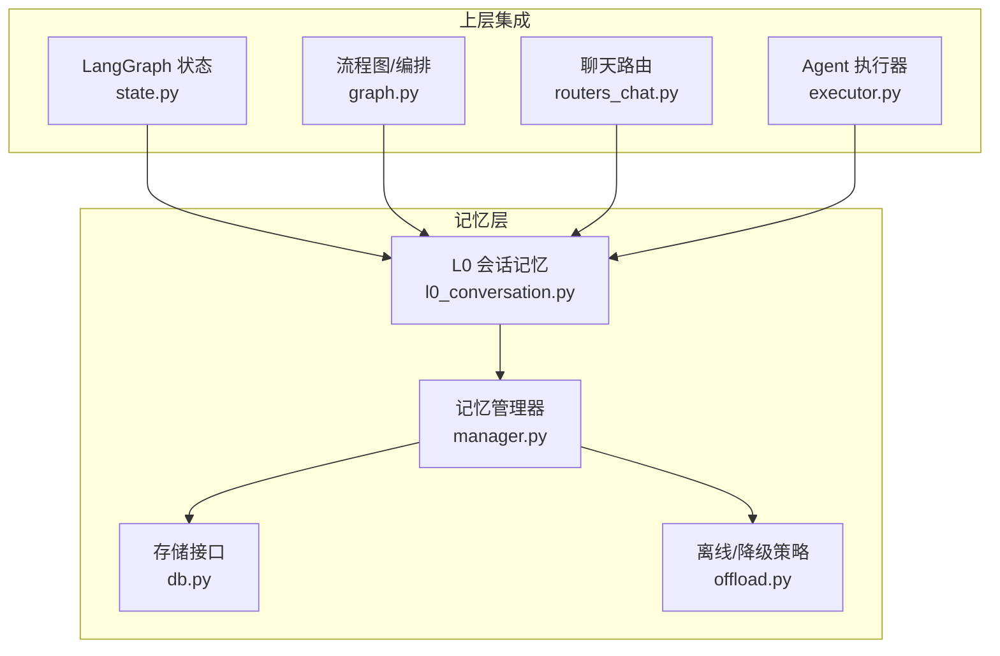
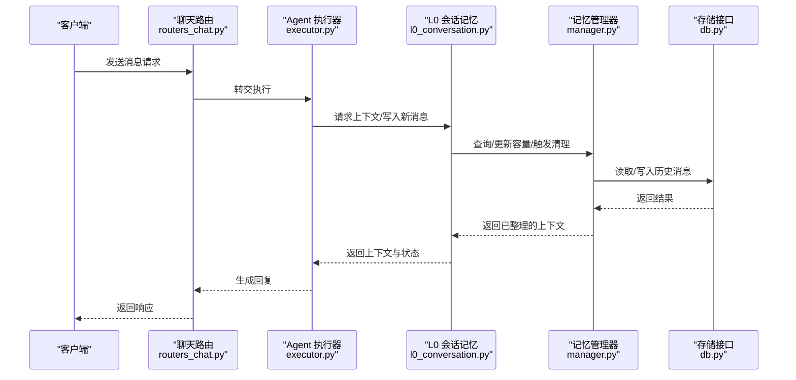
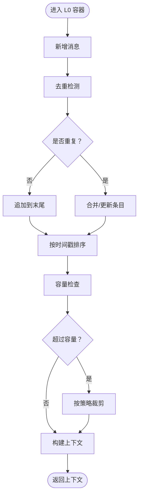
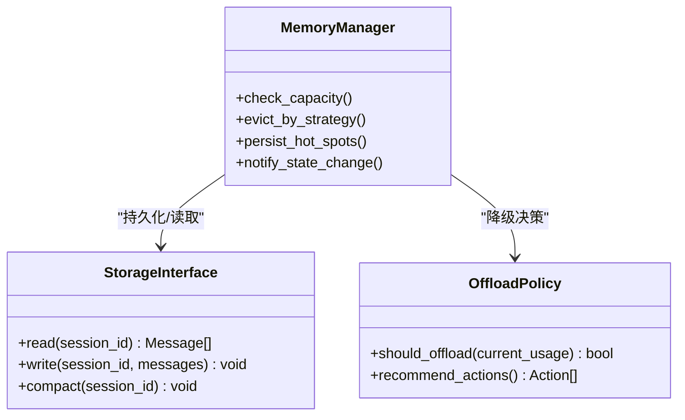
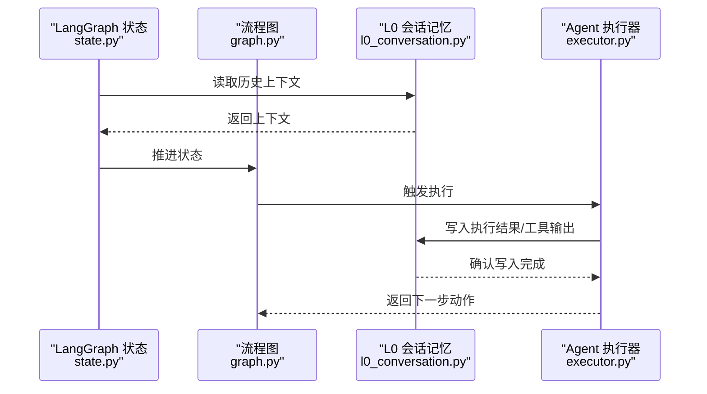
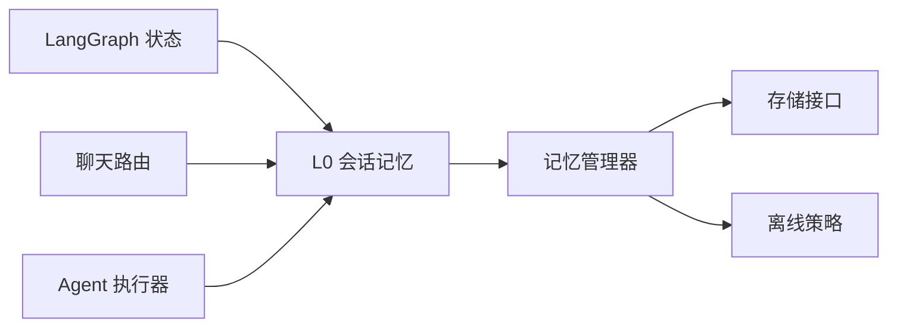

# L0 会话记忆

<cite>
**本文引用的文件**
- [l0_conversation.py](file://backend/app/memory/l0_conversation.py)
- [manager.py](file://backend/app/memory/manager.py)
- [db.py](file://backend/app/memory/db.py)
- [offload.py](file://backend/app/memory/offload.py)
- [test_memory.py](file://backend/tests/test_memory.py)
- [test_memory_extended.py](file://backend/tests/test_memory_extended.py)
- [state.py](file://backend/app/langgraph/state.py)
- [graph.py](file://backend/app/langgraph/graph.py)
- [agent.py](file://backend/app/agent/agent.py)
- [executor.py](file://backend/app/agent/executor.py)
- [llm.py](file://backend/app/agent/llm.py)
- [routers_chat.py](file://backend/app/routers/chat.py)
- [models.py](file://backend/app/api/models.py)
- [common.py](file://backend/app/common.py)
- [config.py](file://backend/app/config.py)
- [dependencies.py](file://backend/app/dependencies.py)
- [exceptions.py](file://backend/app/exceptions.py)
- [main.py](file://backend/app/main.py)
</cite>

## 目录
1. [引言](#引言)
2. [项目结构](#项目结构)
3. [核心组件](#核心组件)
4. [架构总览](#架构总览)
5. [详细组件分析](#详细组件分析)
6. [依赖关系分析](#依赖关系分析)
7. [性能考量](#性能考量)
8. [故障排查指南](#故障排查指南)
9. [结论](#结论)
10. [附录](#附录)

## 引言
本文件面向 L0 会话记忆层，系统性阐述其设计理念、实现机制与工程实践。重点覆盖以下方面：
- 消息记录与存储结构：消息条目如何组织、索引与持久化
- 检索算法与上下文构建：如何按需提取最近或相关的历史消息
- 会话状态管理：如何在多轮对话中维护状态一致性
- 去重与顺序维护：避免重复消息并保持时间序
- 内存限制、自动清理与容量管理：如何在有限资源下稳定运行
- 消息格式规范与数据校验：字段定义、类型约束与校验规则
- 并发访问控制与线程安全：在高并发场景下的保障措施
- 扩展与优化：如何自定义消息格式、扩展存储能力与优化查询性能
- 与聊天历史、上下文理解与对话状态的关系：如何与上层模块协同工作

## 项目结构
L0 会话记忆位于后端应用的记忆子系统中，围绕“消息条目”“会话容器”“存储与清理”“状态同步”等维度展开，并与 LangGraph 状态机、聊天路由、Agent 执行器等模块耦合。

图表来源
- [l0_conversation.py](file://backend/app/memory/l0_conversation.py)
- [manager.py](file://backend/app/memory/manager.py)
- [db.py](file://backend/app/memory/db.py)
- [offload.py](file://backend/app/memory/offload.py)
- [state.py](file://backend/app/langgraph/state.py)
- [graph.py](file://backend/app/langgraph/graph.py)
- [routers_chat.py](file://backend/app/routers/chat.py)
- [executor.py](file://backend/app/agent/executor.py)

章节来源
- [l0_conversation.py](file://backend/app/memory/l0_conversation.py)
- [manager.py](file://backend/app/memory/manager.py)
- [db.py](file://backend/app/memory/db.py)
- [offload.py](file://backend/app/memory/offload.py)
- [state.py](file://backend/app/langgraph/state.py)
- [graph.py](file://backend/app/langgraph/graph.py)
- [routers_chat.py](file://backend/app/routers/chat.py)
- [executor.py](file://backend/app/agent/executor.py)

## 核心组件
- L0 会话记忆（Conversation Memory）：负责消息条目的增删改查、去重、排序与上下文拼接
- 记忆管理器（Memory Manager）：协调 L0 与存储层交互，执行容量控制与清理策略
- 存储接口（DB Layer）：抽象持久化能力，支持本地/远程存储切换
- 离线策略（Offload）：在资源受限时进行降级处理，确保服务可用性
- 上层集成点：LangGraph 状态机、聊天路由、Agent 执行器

章节来源
- [l0_conversation.py](file://backend/app/memory/l0_conversation.py)
- [manager.py](file://backend/app/memory/manager.py)
- [db.py](file://backend/app/memory/db.py)
- [offload.py](file://backend/app/memory/offload.py)

## 架构总览
L0 会话记忆通过“消息容器 + 管理器 + 存储层”的分层设计，向上游提供稳定的上下文构建能力，向下提供可插拔的持久化与清理策略。

图表来源
- [routers_chat.py](file://backend/app/routers/chat.py)
- [executor.py](file://backend/app/agent/executor.py)
- [l0_conversation.py](file://backend/app/memory/l0_conversation.py)
- [manager.py](file://backend/app/memory/manager.py)
- [db.py](file://backend/app/memory/db.py)

## 详细组件分析

### L0 会话记忆（消息容器与上下文）
- 设计理念
  - 将“最近有效对话”作为上下文输入的核心来源，优先保留与当前任务最相关的片段
  - 以“消息条目”为最小单位，统一字段与类型，便于跨模块复用
  - 在内存中维护有序列表，结合去重策略避免重复与噪声
- 关键职责
  - 新增消息：写入用户/助手/系统/工具等角色的消息，按时间戳排序
  - 查询上下文：根据窗口大小、角色过滤、主题相关性等策略返回上下文
  - 去重与合并：基于内容指纹或语义相似度识别重复消息，合并相邻条目
  - 清理与截断：当超过容量阈值时，按策略移除最早或最少相关的条目
- 数据模型（字段与约束）
  - 字段示例：消息 ID、角色（用户/助手/系统/工具）、内容文本、时间戳、元数据（如工具调用参数/结果）、是否可见、是否已去重标记
  - 类型与约束：ID 唯一；角色枚举；时间戳递增；内容非空；元数据 JSON 可选
- 检索算法
  - 最近 N 条：按时间倒序取前 K 条
  - 角色过滤：仅保留指定角色序列
  - 去重策略：基于内容哈希或语义向量阈值判断重复
  - 截断策略：超出容量时从最早条目开始剔除
- 并发与一致性
  - 使用读写锁或队列保护共享消息列表
  - 写操作批量化，减少锁持有时间
  - 读写分离：查询与写入分别在独立缓冲区进行

图表来源
- [l0_conversation.py](file://backend/app/memory/l0_conversation.py)

章节来源
- [l0_conversation.py](file://backend/app/memory/l0_conversation.py)

### 记忆管理器（容量控制与清理）
- 设计理念
  - 将“容量上限、淘汰策略、触发条件”抽象为可配置策略，便于在不同场景下灵活调整
  - 与存储层解耦，支持本地内存、Redis、数据库等多种后端
- 关键职责
  - 统计当前容量与使用率
  - 根据策略触发清理：LRU、LFU、基于角色/时间权重的淘汰
  - 同步持久化：在关键节点将热点消息落盘
- 策略建议
  - 固定窗口：固定最大条数，超出即淘汰最早条目
  - 时间衰减：按时间权重降低旧消息权重，逐步淘汰
  - 语义重要性：结合嵌入向量相似度与主题变化率评估重要性

图表来源
- [manager.py](file://backend/app/memory/manager.py)
- [db.py](file://backend/app/memory/db.py)
- [offload.py](file://backend/app/memory/offload.py)

章节来源
- [manager.py](file://backend/app/memory/manager.py)
- [db.py](file://backend/app/memory/db.py)
- [offload.py](file://backend/app/memory/offload.py)

### 存储接口（抽象与实现）
- 抽象层
  - 提供统一的读写接口，屏蔽底层存储差异
  - 支持批量读写、压缩、分页与增量同步
- 实现建议
  - 本地：内存字典 + 文件快照
  - 远程：Redis 列表/有序集合 + 过期策略
  - 关系型/向量库：按角色/时间分区，支持快速检索

章节来源
- [db.py](file://backend/app/memory/db.py)

### 离线策略（降级与容错）
- 场景
  - 存储不可用、网络抖动、容量超限
- 策略
  - 临时回退到纯内存模式，暂停非必要写入
  - 仅保留最近 N 条热消息，丢弃历史
  - 采用更宽松的去重阈值，提升吞吐

章节来源
- [offload.py](file://backend/app/memory/offload.py)

### 与 LangGraph 状态、聊天路由与 Agent 的集成
- LangGraph 状态
  - 将 L0 输出的上下文注入到状态机的“历史”字段，驱动后续节点决策
- 聊天路由
  - 在路由层调用 L0 获取上下文，再将最终回复写回 L0
- Agent 执行器
  - 在执行前后对消息进行去重与顺序修正，确保上下文一致性

图表来源
- [state.py](file://backend/app/langgraph/state.py)
- [graph.py](file://backend/app/langgraph/graph.py)
- [l0_conversation.py](file://backend/app/memory/l0_conversation.py)
- [executor.py](file://backend/app/agent/executor.py)

章节来源
- [state.py](file://backend/app/langgraph/state.py)
- [graph.py](file://backend/app/langgraph/graph.py)
- [l0_conversation.py](file://backend/app/memory/l0_conversation.py)
- [executor.py](file://backend/app/agent/executor.py)

## 依赖关系分析
- 内部依赖
  - L0 依赖管理器进行容量控制与清理
  - 管理器依赖存储接口进行持久化
  - 离线策略为管理器提供降级建议
- 外部依赖
  - LangGraph 状态机用于状态同步
  - 聊天路由与 Agent 执行器用于消息写回与上下文注入
- 耦合与内聚
  - L0 与管理器高内聚、低耦合，便于替换存储与策略
  - 与上层模块通过明确接口耦合，避免侵入式修改

图表来源
- [l0_conversation.py](file://backend/app/memory/l0_conversation.py)
- [manager.py](file://backend/app/memory/manager.py)
- [db.py](file://backend/app/memory/db.py)
- [offload.py](file://backend/app/memory/offload.py)
- [state.py](file://backend/app/langgraph/state.py)
- [routers_chat.py](file://backend/app/routers/chat.py)
- [executor.py](file://backend/app/agent/executor.py)

章节来源
- [l0_conversation.py](file://backend/app/memory/l0_conversation.py)
- [manager.py](file://backend/app/memory/manager.py)
- [db.py](file://backend/app/memory/db.py)
- [offload.py](file://backend/app/memory/offload.py)
- [state.py](file://backend/app/langgraph/state.py)
- [routers_chat.py](file://backend/app/routers/chat.py)
- [executor.py](file://backend/app/agent/executor.py)

## 性能考量
- 写入路径
  - 批量写入：聚合多条消息一次性写入，降低锁竞争
  - 异步刷盘：后台线程定期持久化，前台只做内存更新
- 读取路径
  - 缓存热点：最近 K 条消息缓存在高频访问区域
  - 分页与懒加载：长历史按需加载，避免全量传输
- 去重与排序
  - 使用索引（时间、角色、指纹）加速查询与去重
  - 对大消息采用延迟解析策略，仅在需要时解码
- 清理策略
  - 预热：在高峰期前预清理，降低突发压力
  - 渐进式：分批次淘汰，避免抖动

## 故障排查指南
- 常见问题
  - 上下文缺失：检查 L0 是否成功写入最新消息，确认路由与执行器链路
  - 重复消息：核查去重逻辑与指纹计算，确认时间戳与角色字段
  - 容量溢出：查看容量阈值与清理策略，确认存储写入是否成功
  - 并发冲突：定位锁粒度与写入批大小，避免长时间持锁
- 排查步骤
  - 开启调试日志：记录 L0 的写入/读取、去重、清理事件
  - 快照对比：比较内存与存储中的消息集合，定位不一致点
  - 压测验证：模拟高并发写入与清理，观察抖动与延迟
- 相关测试
  - 单元测试：覆盖消息格式、去重、容量控制、并发写入
  - 集成测试：验证与 LangGraph、聊天路由、Agent 的协同

章节来源
- [test_memory.py](file://backend/tests/test_memory.py)
- [test_memory_extended.py](file://backend/tests/test_memory_extended.py)
- [exceptions.py](file://backend/app/exceptions.py)

## 结论
L0 会话记忆通过“消息容器 + 管理器 + 存储层”的清晰分层，实现了高效、可扩展且可降级的会话上下文管理。其设计兼顾了实时性与稳定性，在高并发与复杂业务场景下仍能保持良好的性能与一致性。建议在生产环境中结合容量监控、动态策略与可观测性，持续优化清理与写入策略，以获得最佳体验。

## 附录

### 消息格式规范与字段定义
- 字段清单（建议）
  - id：字符串，唯一标识
  - role：枚举，取值包括 user、assistant、system、tool
  - content：字符串，消息正文
  - timestamp：数值/时间戳，严格递增
  - metadata：对象，承载工具调用参数/结果、意图标签等
  - visibility：布尔，是否参与上下文拼接
  - dedup_key：字符串，去重用指纹
- 校验规则
  - id 唯一且非空
  - role 属于枚举集合
  - content 非空
  - timestamp 数值且单调递增
  - metadata 为合法 JSON 对象（可为空）

章节来源
- [models.py](file://backend/app/api/models.py)
- [common.py](file://backend/app/common.py)

### 并发访问控制与一致性
- 锁策略
  - 读写分离：读多写少场景下使用读写锁
  - 批处理：写入合并为事务，减少锁持有时间
- 一致性
  - 版本号/时间戳：写入时携带版本，读取时校验一致性
  - 两阶段提交：关键写入采用预写+确认，失败回滚

章节来源
- [l0_conversation.py](file://backend/app/memory/l0_conversation.py)
- [manager.py](file://backend/app/memory/manager.py)

### 自定义消息格式与扩展存储
- 自定义消息格式
  - 在消息模型中增加可选字段，不影响现有消费方
  - 通过 metadata 承载扩展信息，避免破坏核心字段
- 扩展存储
  - 实现新的存储适配器，遵循统一接口
  - 支持混合存储：热数据驻内存，冷数据落盘/归档

章节来源
- [db.py](file://backend/app/memory/db.py)
- [models.py](file://backend/app/api/models.py)

### 与聊天历史、上下文理解与对话状态的关系
- 聊天历史
  - L0 是聊天历史的“近端快照”，结合存储层形成完整历史
- 上下文理解
  - 通过角色过滤、去重与截断，提升上下文质量与长度可控性
- 对话状态
  - 将 L0 输出注入 LangGraph 状态，驱动后续节点决策与动作

章节来源
- [routers_chat.py](file://backend/app/routers/chat.py)
- [state.py](file://backend/app/langgraph/state.py)
- [graph.py](file://backend/app/langgraph/graph.py)
- [executor.py](file://backend/app/agent/executor.py)