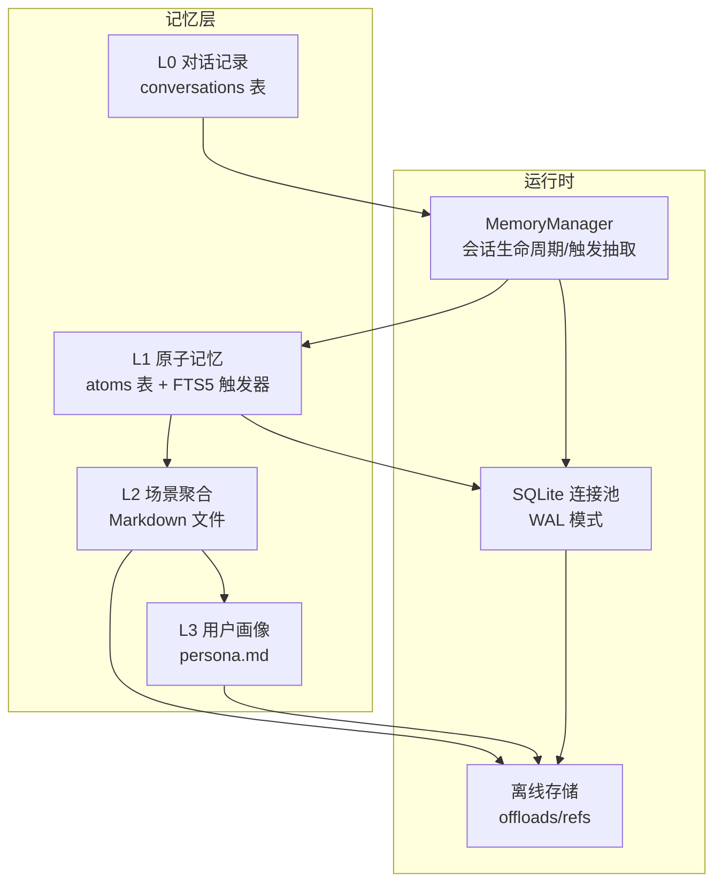
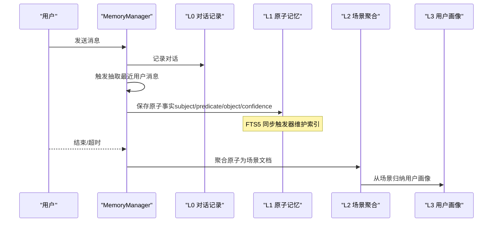
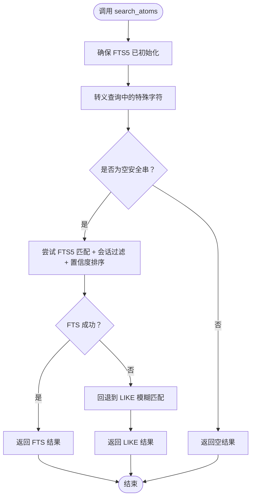
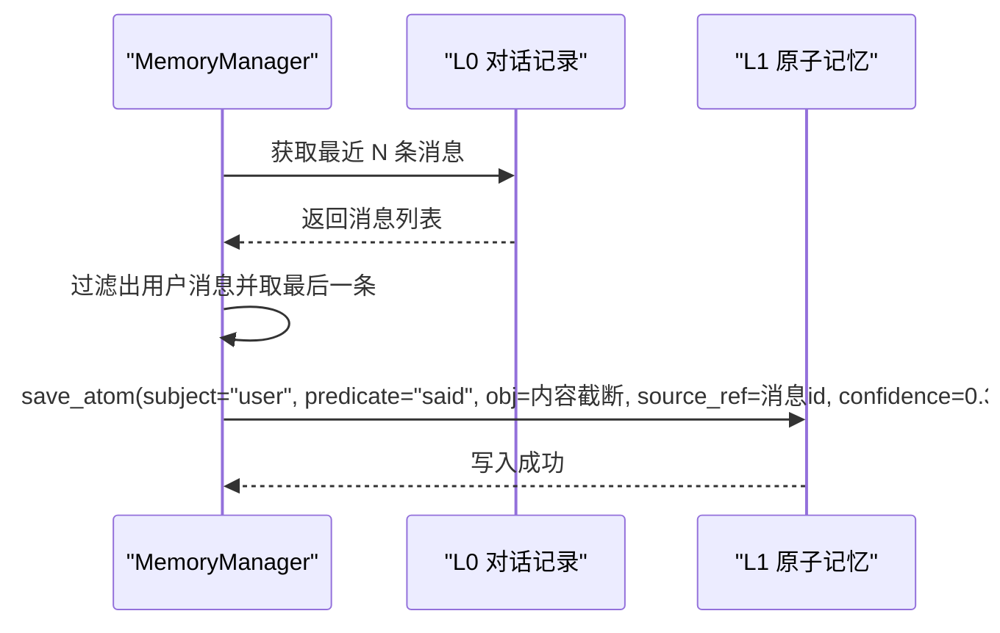
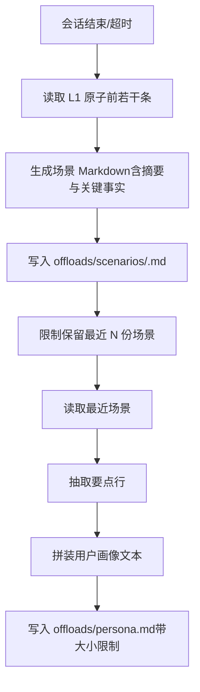
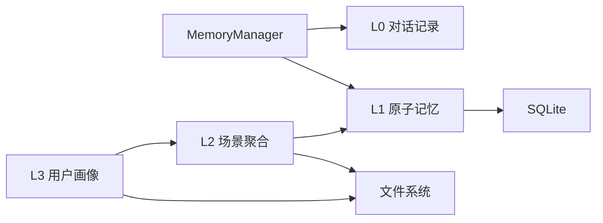

# L1 原子记忆

<cite>
**本文引用的文件**
- [l1_atom.py](file://backend/app/memory/l1_atom.py)
- [db.py](file://backend/app/memory/db.py)
- [manager.py](file://backend/app/memory/manager.py)
- [l0_conversation.py](file://backend/app/memory/l0_conversation.py)
- [l2_scenario.py](file://backend/app/memory/l2_scenario.py)
- [l3_persona.py](file://backend/app/memory/l3_persona.py)
- [offload.py](file://backend/app/memory/offload.py)
- [agent-memory-system.md](file://backend/data/articles/agent-memory-system.md)
- [test_memory.py](file://backend/tests/test_memory.py)
- [query_rewriter.py](file://backend/app/rag/query_rewriter.py)
</cite>

## 目录
1. [引言](#引言)
2. [项目结构](#项目结构)
3. [核心组件](#核心组件)
4. [架构总览](#架构总览)
5. [详细组件分析](#详细组件分析)
6. [依赖分析](#依赖分析)
7. [性能考虑](#性能考虑)
8. [故障排查指南](#故障排查指南)
9. [结论](#结论)
10. [附录](#附录)

## 引言
本文件面向开发者与产品人员，系统化阐述 L1 原子记忆层的设计与实现。L1 记忆以“三元组”（主语-谓词-宾语）形式存储从对话中抽取的结构化事实，支持基于 FTS5 的全文检索、置信度排序与按会话维度隔离。本文将从数据模型、抽取流程、存储机制、查询接口、去重与冲突处理、本体建模与知识图谱构建、与自然语言理解/语义分析/知识推理的关系等方面展开，并提供可扩展的实践建议。

## 项目结构
L1 原子记忆位于后端 Python 应用的 memory 子模块中，围绕 SQLite 数据库进行持久化；与之协同的还有 L0 对话记录、L2 场景聚合、L3 用户画像等层级，形成完整的多层记忆体系。

图表来源
- [manager.py:60-71](file://backend/app/memory/manager.py#L60-L71)
- [l1_atom.py:9-41](file://backend/app/memory/l1_atom.py#L9-L41)
- [db.py:35-62](file://backend/app/memory/db.py#L35-L62)
- [l2_scenario.py:35-66](file://backend/app/memory/l2_scenario.py#L35-L66)
- [l3_persona.py:11-37](file://backend/app/memory/l3_persona.py#L11-L37)

章节来源
- [agent-memory-system.md:10-35](file://backend/data/articles/agent-memory-system.md#L10-L35)
- [db.py:35-62](file://backend/app/memory/db.py#L35-L62)

## 核心组件
- 数据模型与表结构
  - atoms 表：存储三元组事实，包含会话标识、主体、谓词、客体、来源引用、置信度与时间戳。
  - conversations 表：短期对话记录，用于抽取输入。
  - FTS5 虚拟表 atoms_fts：对 atoms 的 session_id、subject、predicate、object 字段建立全文索引，并通过触发器同步插入/删除/更新。
- 关键函数
  - 保存原子事实：save_atom(...)
  - 搜索原子事实：search_atoms(...，支持 FTS5 或 LIKE 回退）
  - 查询会话全部原子：get_atoms_by_session(...)
  - 初始化数据库与索引：init_db()、_ensure_fts()

章节来源
- [db.py:35-62](file://backend/app/memory/db.py#L35-L62)
- [l1_atom.py:9-41](file://backend/app/memory/l1_atom.py#L9-L41)
- [l1_atom.py:43-97](file://backend/app/memory/l1_atom.py#L43-L97)

## 架构总览
L1 原子记忆贯穿于会话生命周期：L0 记录最新对话片段，MemoryManager 在合适时机触发抽取，生成三元组写入 L1；会话结束或超时后，L1 原子被聚合为 L2 场景文档，并进一步提炼为 L3 用户画像。

图表来源
- [manager.py:54-77](file://backend/app/memory/manager.py#L54-L77)
- [l1_atom.py:43-60](file://backend/app/memory/l1_atom.py#L43-L60)
- [l2_scenario.py:35-66](file://backend/app/memory/l2_scenario.py#L35-L66)
- [l3_persona.py:11-37](file://backend/app/memory/l3_persona.py#L11-L37)

## 详细组件分析

### 组件一：原子事实存储与检索（L1）
- 数据模型
  - 主键：id
  - 会话隔离：session_id
  - 三元组：subject、predicate、object
  - 来源引用：source_ref（指向 L0 对话行 id）
  - 置信度：confidence（用于排序）
  - 时间戳：created_at
- FTS5 全文检索
  - 虚拟表 atoms_fts 与 atoms 通过触发器保持一致
  - 支持短语匹配与会话过滤，优先按置信度降序返回
  - 若 FTS5 初始化失败，自动回退到 LIKE 模糊匹配
- 查询接口
  - search_atoms(session_id, query, limit)
  - get_atoms_by_session(session_id)

图表来源
- [l1_atom.py:63-87](file://backend/app/memory/l1_atom.py#L63-L87)

章节来源
- [l1_atom.py:9-41](file://backend/app/memory/l1_atom.py#L9-L41)
- [l1_atom.py:43-97](file://backend/app/memory/l1_atom.py#L43-L97)

### 组件二：会话生命周期与抽取触发（MemoryManager）
- 会话生命周期
  - touch_session：标记最近活跃时间
  - 清理任务：定期检查不活跃会话并自动终结
  - 清理会话：clear_session
- 上下文拼装
  - get_context：整合 L3 画像与近期 L2 场景摘要
- 原子抽取
  - extract_atoms：从 L0 最近用户消息中抽取“用户说了…”类原子，写入 L1 并设置置信度

图表来源
- [manager.py:60-71](file://backend/app/memory/manager.py#L60-L71)
- [l1_atom.py:43-60](file://backend/app/memory/l1_atom.py#L43-L60)

章节来源
- [manager.py:20-127](file://backend/app/memory/manager.py#L20-L127)

### 组件三：场景聚合与用户画像（L2/L3）
- L2 场景聚合
  - finalize_scenario：将 L1 原子导出为 Markdown 文档，限制展示数量并清理过旧文件
  - get_recent_scenarios：读取最近场景摘要
- L3 用户画像
  - update_persona：从近期场景中抽取要点，生成并裁剪用户画像文件
  - get_persona：读取当前画像

图表来源
- [l2_scenario.py:35-66](file://backend/app/memory/l2_scenario.py#L35-L66)
- [l3_persona.py:11-37](file://backend/app/memory/l3_persona.py#L11-L37)

章节来源
- [l2_scenario.py:18-94](file://backend/app/memory/l2_scenario.py#L18-L94)
- [l3_persona.py:1-44](file://backend/app/memory/l3_persona.py#L1-L44)

### 组件四：离线存储与引用读取（Offload）
- 当工具输出超过阈值时，自动离线存储至 offloads/refs，并返回“摘要行 + result_ref”
- 读取时进行路径遍历保护，防止越界访问

章节来源
- [offload.py:11-53](file://backend/app/memory/offload.py#L11-L53)

## 依赖分析
- 组件耦合
  - L1 依赖 SQLite 连接池与 FTS5 触发器；对外暴露 save/search/get 接口
  - MemoryManager 依赖 L0/L1/L2/L3，负责抽取与生命周期管理
  - L2/L3 依赖 L1 输出；L3 依赖 L2 场景
- 外部依赖
  - SQLite（WAL、busy_timeout）
  - 文件系统（offloads 目录）

图表来源
- [manager.py:6-11](file://backend/app/memory/manager.py#L6-L11)
- [db.py:15-32](file://backend/app/memory/db.py#L15-L32)
- [l2_scenario.py:35-66](file://backend/app/memory/l2_scenario.py#L35-L66)
- [l3_persona.py:11-37](file://backend/app/memory/l3_persona.py#L11-L37)

章节来源
- [manager.py:6-11](file://backend/app/memory/manager.py#L6-L11)
- [db.py:15-32](file://backend/app/memory/db.py#L15-L32)

## 性能考虑
- 存储层
  - 使用线程本地连接与 WAL 模式，提升并发读性能；busy_timeout 缓解写竞争
  - 为 atoms.session_id 建立索引，加速按会话过滤
- 检索层
  - FTS5 全文索引 + 触发器同步，优先走 FTS5；失败时回退 LIKE
  - 查询时先进行特殊字符转义与空串校验，避免无效扫描
- 写入层
  - 批量写入建议合并为事务（当前单条写入已 commit），可结合业务在上层批量提交
- 记忆聚合
  - L2 场景与 L3 画像采用文件落盘，避免数据库膨胀；注意控制文件数量与大小

章节来源
- [db.py:15-32](file://backend/app/memory/db.py#L15-L32)
- [db.py:59-61](file://backend/app/memory/db.py#L59-L61)
- [l1_atom.py:63-87](file://backend/app/memory/l1_atom.py#L63-L87)

## 故障排查指南
- FTS5 初始化失败
  - 现象：日志出现警告，随后回退到 LIKE
  - 处理：确认 SQLite 版本支持 FTS5；若不可用，LIKE 回退仍可用
- 查询无结果
  - 检查：查询字符串是否为空或仅包含特殊字符；确认 session_id 正确
  - 处理：对输入进行清洗；确认抽取是否发生（L0 是否有用户消息）
- 写入异常
  - 检查：数据库连接状态、磁盘空间、WAL 文件权限
- 场景/画像未更新
  - 检查：会话是否结束或超时；L1 是否存在原子；文件写入权限

章节来源
- [l1_atom.py:39-40](file://backend/app/memory/l1_atom.py#L39-L40)
- [l1_atom.py:68-70](file://backend/app/memory/l1_atom.py#L68-L70)
- [manager.py:104-127](file://backend/app/memory/manager.py#L104-L127)

## 结论
L1 原子记忆以三元组为核心，结合 FTS5 全文检索与置信度排序，提供了高效、可扩展的事实存储与查询能力。通过与 L0/L2/L3 的协同，实现了从对话到场景再到画像的逐层抽象与沉淀。建议在生产环境中关注 FTS5 可用性、会话生命周期管理与文件系统容量，同时为抽取规则与本体扩展预留接口，以适配更复杂的语义需求。

## 附录

### A. 数据模型与复杂度
- 表结构概览
  - conversations：id、session_id、role、content、tokens、tool_name、tool_args、created_at
  - atoms：id、session_id、subject、predicate、object、source_ref、confidence、created_at
- 索引
  - idx_conv_session：加速 L0 查询
  - idx_atom_session：加速 L1 按会话过滤
- 复杂度
  - 单条写入：O(1)
  - FTS5 查询：取决于匹配集大小与触发器开销
  - LIKE 回退：O(N) 扫描

章节来源
- [db.py:35-62](file://backend/app/memory/db.py#L35-L62)

### B. 知识单元提取与三元组结构
- 提取来源：L0 最近用户消息
- 示例三元组：subject="user"、predicate="said"、object=消息内容截断
- 置信度：由抽取逻辑设定，用于检索排序

章节来源
- [manager.py:60-71](file://backend/app/memory/manager.py#L60-L71)

### C. 语义相似度、去重与冲突
- 相似度与去重
  - 当前实现：基于 FTS5 匹配与置信度排序；未内置语义相似度计算
  - 建议：在抽取阶段引入向量嵌入与余弦相似度，对重复/近似三元组进行去重与合并
- 冲突解决
  - 建议：当同一三元组出现矛盾时，依据置信度与时间戳进行仲裁；或引入版本号/修订策略

### D. 查询接口、过滤与排序
- 接口
  - search_atoms(session_id, query, limit)
  - get_atoms_by_session(session_id)
- 过滤
  - 会话隔离：session_id
  - 文本过滤：FTS5 或 LIKE
- 排序
  - 置信度降序
  - 次优：按创建时间升序（获取全量）

章节来源
- [l1_atom.py:63-97](file://backend/app/memory/l1_atom.py#L63-L97)

### E. 本体建模、关系推理与知识图谱
- 本体建模
  - 建议：定义常用谓词集合（如 prefers、implementedBy、deployedOn 等），统一术语
- 关系推理
  - 建议：基于三元组构建简单规则（如“若 A 谈论 B 且 B 是 X，则 A 偏好 X”）进行轻量推理
- 知识图谱
  - 建议：将 atoms 导出为图结构（节点=实体，边=谓词），结合可视化工具进行探索

### F. 与自然语言理解、语义分析、知识推理的关系
- NLU/语义分析
  - L1 作为结构化事实载体，承接来自 NLU 的实体与关系识别结果
- 知识推理
  - 可在 L1 基础上叠加规则引擎或轻量图算法，实现简单蕴含与推断
- RAG 辅助
  - L1 事实可用于增强检索与提示工程，提升问答一致性与个性化

章节来源
- [agent-memory-system.md:36-39](file://backend/data/articles/agent-memory-system.md#L36-L39)

### G. 开发者实践建议
- 自定义抽取规则
  - 在 MemoryManager.extract_atoms 中扩展抽取逻辑，增加谓词/对象规范化与置信度评估
- 扩展本体定义
  - 新增常用谓词与领域本体，统一术语与取值范围
- 优化存储结构
  - 对高频查询字段增加索引；对长文本对象进行分片或离线存储
- 性能优化
  - 批量写入、合并事务；合理设置 busy_timeout；监控 WAL 文件大小

### H. 测试参考
- 单元测试覆盖
  - L1 保存与检索
  - L0 记录与清理
  - 离线存储与读取
- 测试文件路径
  - [test_memory.py:25-34](file://backend/tests/test_memory.py#L25-L34)

章节来源
- [test_memory.py:25-34](file://backend/tests/test_memory.py#L25-L34)