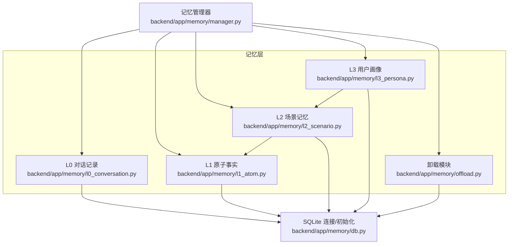
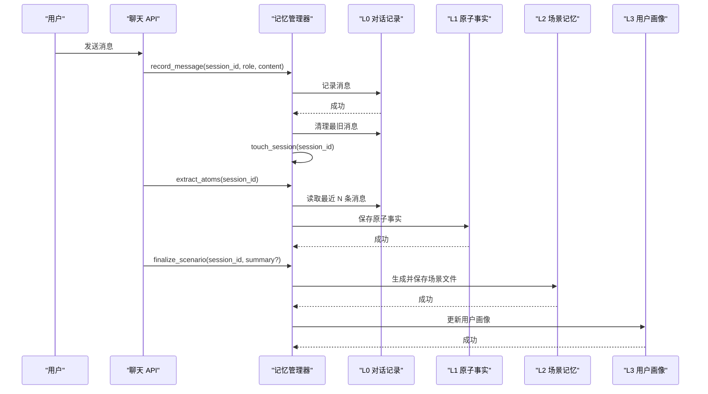
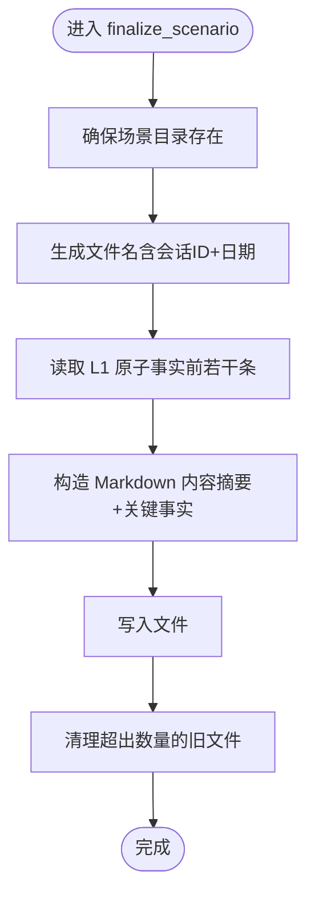
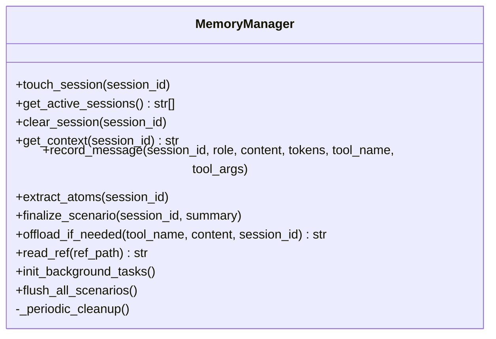
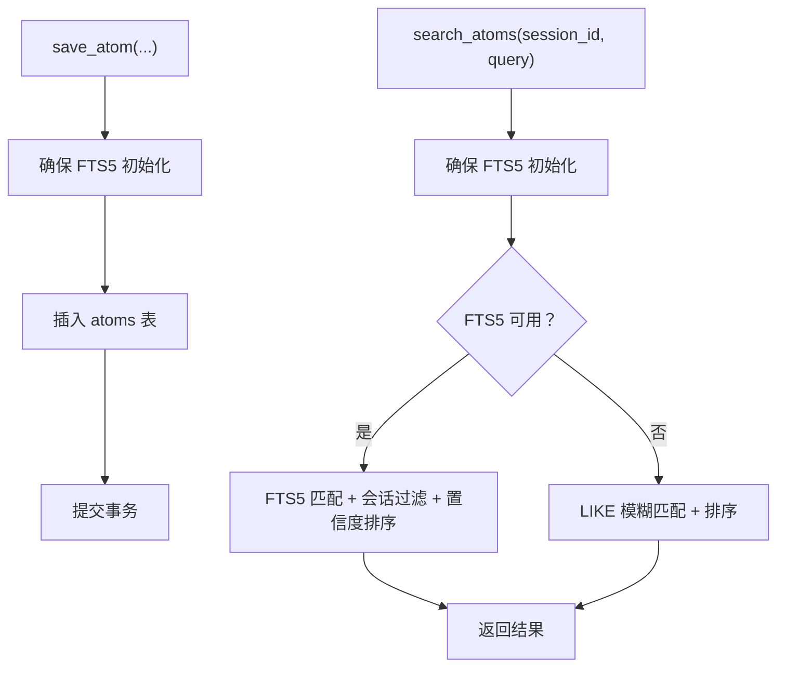
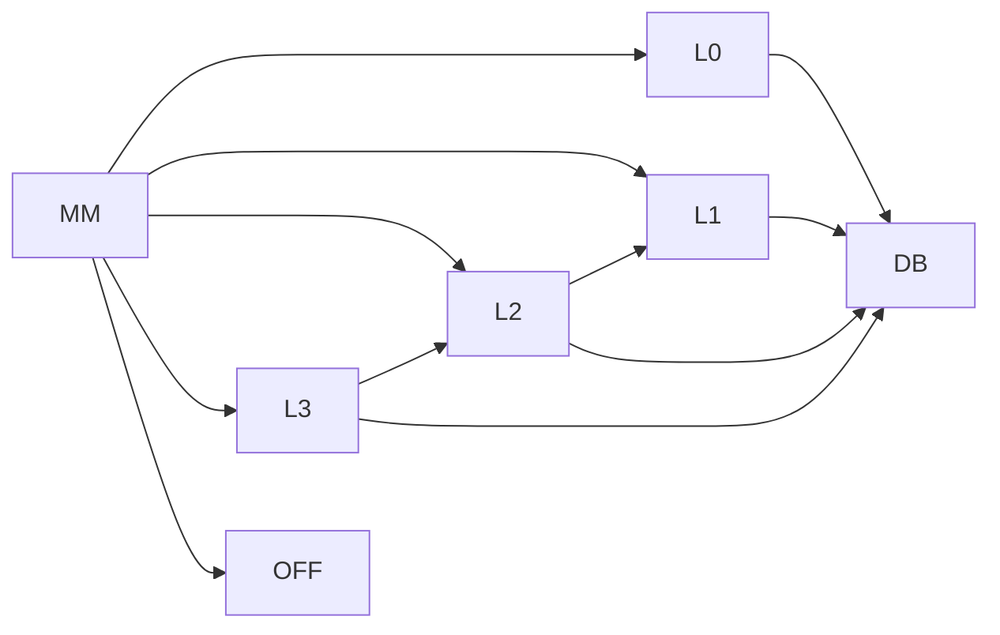

# L2 场景记忆

<cite>
**本文引用的文件**
- [l2_scenario.py](file://backend/app/memory/l2_scenario.py)
- [manager.py](file://backend/app/memory/manager.py)
- [l1_atom.py](file://backend/app/memory/l1_atom.py)
- [l0_conversation.py](file://backend/app/memory/l0_conversation.py)
- [db.py](file://backend/app/memory/db.py)
- [l3_persona.py](file://backend/app/memory/l3_persona.py)
- [offload.py](file://backend/app/memory/offload.py)
- [TECH_DESIGN.md](file://TECH_DESIGN.md)
- [agent-memory-system.md](file://backend/data/articles/agent-memory-system.md)
- [test_manager.py](file://backend/tests/test_manager.py)
- [test_memory_extended.py](file://backend/tests/test_memory_extended.py)
</cite>

## 目录
1. [引言](#引言)
2. [项目结构](#项目结构)
3. [核心组件](#核心组件)
4. [架构总览](#架构总览)
5. [详细组件分析](#详细组件分析)
6. [依赖分析](#依赖分析)
7. [性能考虑](#性能考虑)
8. [故障排查指南](#故障排查指南)
9. [结论](#结论)
10. [附录](#附录)

## 引言
本文件面向开发者与产品人员，系统化阐述 L2 场景记忆层的设计思想、数据模型、处理流程与生命周期管理。L2 场景记忆以“会话”为边界，将短期记忆（L0 原始对话）与原子事实（L1 三元组）进行结构化总结，形成可检索、可沉淀的 Markdown 文档，用于后续上下文增强、任务规划与个性化（L3 画像）构建。本文同时覆盖场景查询、匹配与相似度评估的扩展路径，以及与对话流程、任务管理、上下文理解的关系。

## 项目结构
L2 场景记忆位于后端记忆子系统中，与 L0/L1/L3 及卸载模块协同工作，整体架构参见技术设计图与文章中的层级说明。

图表来源
- [TECH_DESIGN.md](file://TECH_DESIGN.md)
- [agent-memory-system.md](file://backend/data/articles/agent-memory-system.md)
- [manager.py](file://backend/app/memory/manager.py)
- [l0_conversation.py](file://backend/app/memory/l0_conversation.py)
- [l1_atom.py](file://backend/app/memory/l1_atom.py)
- [l2_scenario.py](file://backend/app/memory/l2_scenario.py)
- [l3_persona.py](file://backend/app/memory/l3_persona.py)
- [offload.py](file://backend/app/memory/offload.py)
- [db.py](file://backend/app/memory/db.py)

章节来源
- [TECH_DESIGN.md](file://TECH_DESIGN.md)
- [agent-memory-system.md](file://backend/data/articles/agent-memory-system.md)

## 核心组件
- L2 场景记忆（l2_scenario.py）
  - 负责生成、归档与清理场景文件；提供近期场景内容读取接口；维护场景文件列表缓存。
- 记忆管理器（manager.py）
  - 统一编排 L0/L1/L2/L3 的调用；维护会话活跃状态；周期性检查并自动终结长时间不活跃的会话；提供上下文拼装。
- L1 原子事实（l1_atom.py）
  - 提供原子三元组的持久化、全文检索与会话级聚合查询。
- L0 对话记录（l0_conversation.py）
  - 记录原始对话消息；提供滑动窗口清理。
- 数据库（db.py）
  - 线程本地连接、WAL 模式、索引与表初始化。
- L3 用户画像（l3_persona.py）
  - 基于近期场景摘要与关键事实提炼用户画像。
- 卸载模块（offload.py）
  - 超长内容的落盘与引用读取。

章节来源
- [l2_scenario.py](file://backend/app/memory/l2_scenario.py)
- [manager.py](file://backend/app/memory/manager.py)
- [l1_atom.py](file://backend/app/memory/l1_atom.py)
- [l0_conversation.py](file://backend/app/memory/l0_conversation.py)
- [db.py](file://backend/app/memory/db.py)
- [l3_persona.py](file://backend/app/memory/l3_persona.py)
- [offload.py](file://backend/app/memory/offload.py)

## 架构总览
L2 场景记忆在对话流中的位置与职责如下：

图表来源
- [manager.py](file://backend/app/memory/manager.py)
- [l0_conversation.py](file://backend/app/memory/l0_conversation.py)
- [l1_atom.py](file://backend/app/memory/l1_atom.py)
- [l2_scenario.py](file://backend/app/memory/l2_scenario.py)
- [l3_persona.py](file://backend/app/memory/l3_persona.py)

## 详细组件分析

### L2 场景记忆（l2_scenario.py）
- 设计要点
  - 以会话为单位生成场景文件，文件名包含会话 ID 与日期，便于检索与去重。
  - 场景文件采用 Markdown 结构，包含摘要与关键事实（来自 L1 原子事实）。
  - 文件列表带缓存（60 秒 TTL），避免频繁 IO。
  - 最多保留固定数量的场景文件，超出则按时间顺序删除旧文件。
- 关键函数
  - 列举场景文件：带缓存的目录扫描与排序。
  - 生成场景文件：读取 L1 原子事实，写入 Markdown 文件。
  - 获取近期场景内容：返回最近 N 份场景文件的内容列表。
  - 清理旧场景：基于阈值删除多余文件，并失效缓存。
- 数据与复杂度
  - 列表缓存：O(1) 读取，首次 O(n log n) 排序（n 为场景文件数）。
  - 写入场景：O(k)（k 为 L1 原子事实条数，受上限限制）。
  - 清理策略：O(n) 扫描 + O(m) 删除（m 为超出数量）。

图表来源
- [l2_scenario.py](file://backend/app/memory/l2_scenario.py)

章节来源
- [l2_scenario.py](file://backend/app/memory/l2_scenario.py)

### 记忆管理器（manager.py）
- 会话生命周期
  - touch_session：每次收到消息或操作时更新最后活跃时间。
  - get_active_sessions：返回当前活跃会话列表。
  - clear_session：清理指定会话。
- 上下文拼装
  - get_context：拼接 L3 画像与近期 L2 场景内容。
- 原子事实抽取
  - extract_atoms：从最近用户消息中抽取并保存 L1 原子事实。
- 场景终结与画像更新
  - finalize_scenario：生成 L2 场景并更新 L3 画像。
- 背景任务
  - init_background_tasks：启动周期性清理任务。
  - flush_all_scenarios：服务关闭时批量终结所有活跃会话。
  - _periodic_cleanup：检测超时会话并自动终结。

图表来源
- [manager.py](file://backend/app/memory/manager.py)

章节来源
- [manager.py](file://backend/app/memory/manager.py)

### L1 原子事实（l1_atom.py）
- 功能
  - 三元组持久化（主语-谓词-宾语），支持置信度。
  - 延迟初始化 FTS5 全文索引与触发器，提升检索效率。
  - 提供按会话检索与聚合查询。
- 性能
  - FTS5 匹配优先，失败回退到 LIKE 模糊匹配。
  - 线程本地连接 + WAL 模式，支持并发读取。

图表来源
- [l1_atom.py](file://backend/app/memory/l1_atom.py)

章节来源
- [l1_atom.py](file://backend/app/memory/l1_atom.py)

### L0 对话记录（l0_conversation.py）
- 功能
  - 记录消息（角色、内容、Token、工具名与参数）。
  - 按会话滑动窗口清理最旧消息，控制存储规模。
- 与 L2 的关系
  - 作为 L1 抽取的输入来源；L2 终结时读取 L1 聚合结果。

章节来源
- [l0_conversation.py](file://backend/app/memory/l0_conversation.py)

### 数据库（db.py）
- 连接模型
  - 线程本地连接，避免跨线程共享；WAL 模式支持并发读取；设置 busy_timeout。
- 初始化
  - 创建 conversations 与 atoms 表，并建立会话索引。

章节来源
- [db.py](file://backend/app/memory/db.py)

### L3 用户画像（l3_persona.py）
- 功能
  - 基于近期场景摘要与关键事实提炼 L3 画像，写入固定大小限制的文件。
  - 提供画像读取接口，供上下文拼装使用。
- 与 L2 的关系
  - L2 场景是 L3 画像的主要输入来源之一。

章节来源
- [l3_persona.py](file://backend/app/memory/l3_persona.py)

### 卸载模块（offload.py）
- 功能
  - 当内容超过阈值时，写入 offloads/refs 下的独立文件，并返回简短摘要与引用。
  - 提供安全的引用读取，防止路径穿越。
- 与 L2 的关系
  - 作为上下文与工具输出的外存补充，避免上下文膨胀。

章节来源
- [offload.py](file://backend/app/memory/offload.py)

## 依赖分析
- 组件耦合
  - L2 依赖 L1（读取原子事实）；L3 依赖 L2（读取场景摘要）；MM 统一编排四层与卸载。
  - L0/L1/L2/L3 均依赖 db.py 的连接与表结构。
- 外部依赖
  - SQLite（WAL、FTS5）、文件系统（offloads 目录）。
- 循环依赖
  - 未发现循环依赖；模块间为单向调用链。

图表来源
- [manager.py](file://backend/app/memory/manager.py)
- [l0_conversation.py](file://backend/app/memory/l0_conversation.py)
- [l1_atom.py](file://backend/app/memory/l1_atom.py)
- [l2_scenario.py](file://backend/app/memory/l2_scenario.py)
- [l3_persona.py](file://backend/app/memory/l3_persona.py)
- [offload.py](file://backend/app/memory/offload.py)
- [db.py](file://backend/app/memory/db.py)

## 性能考虑
- 场景文件列表缓存
  - 60 秒 TTL，降低目录扫描开销；清理后主动失效缓存，保证一致性。
- FTS5 检索
  - 优先使用 FTS5 全文匹配，失败回退到 LIKE；合理使用双引号包裹短语，减少特殊字符影响。
- 并发与锁
  - 线程本地连接 + WAL 模式，减少写竞争；busy_timeout 降低锁等待失败概率。
- 存储规模控制
  - L0 消息滑动窗口清理；L2 场景文件数量上限；L3 画像大小上限；避免内存与磁盘压力。
- I/O 优化
  - 场景文件写入 UTF-8；批量读取场景内容时注意异常吞吐，避免阻塞。

## 故障排查指南
- 场景文件未生成
  - 检查场景目录是否存在且可写；确认 finalize_scenario 是否被调用；查看日志错误。
  - 参考测试用例断言场景文件命名与内容片段。
- 场景内容为空
  - 确认 L1 原子事实是否成功保存；检查 L2 读取的原子事实条数上限。
- 场景过多导致磁盘占用
  - 检查清理阈值与清理逻辑是否生效；确认缓存失效时机。
- L3 画像未更新
  - 确认 L2 场景是否生成；检查 L3 画像文件大小限制与写入权限。
- FTS5 初始化失败
  - 观察日志回退到 LIKE 的提示；确认 SQLite 版本与 FTS5 支持。
- 路径穿越与读取失败
  - 使用 offload.read_ref 时检查路径合法性与文件存在性。

章节来源
- [test_manager.py](file://backend/tests/test_manager.py)
- [test_memory_extended.py](file://backend/tests/test_memory_extended.py)
- [l2_scenario.py](file://backend/app/memory/l2_scenario.py)
- [l3_persona.py](file://backend/app/memory/l3_persona.py)
- [l1_atom.py](file://backend/app/memory/l1_atom.py)
- [offload.py](file://backend/app/memory/offload.py)

## 结论
L2 场景记忆通过“会话边界 + 结构化总结”的方式，将短期对话与原子事实转化为可检索、可沉淀的场景文档，为 L3 画像与后续任务规划提供高质量上下文。配合记忆管理器的生命周期管理与后台清理机制，系统在可用性与性能之间取得平衡。开发者可在现有基础上扩展场景模板、优化匹配与检索策略，并结合对话流程与任务管理进一步深化场景的应用价值。

## 附录

### 场景定义、边界与状态转换
- 场景定义
  - 以会话为单位，包含摘要与关键事实两部分，来源于 L1 原子事实的聚合。
- 边界划分
  - 由会话 ID 标识；会话结束或超时触发场景终结。
- 状态转换
  - 进行中（活跃会话）→ 已终结（生成场景文件）→ 可检索（Markdown 文件）。

章节来源
- [l2_scenario.py](file://backend/app/memory/l2_scenario.py)
- [manager.py](file://backend/app/memory/manager.py)

### 场景总结、关键信息提取与模式识别
- 场景总结
  - 由 finalize_scenario 生成，包含摘要与关键事实列表。
- 关键信息提取
  - 由 extract_atoms 从最近用户消息中抽取三元组事实，写入 L1。
- 模式识别
  - 可基于 L1 的谓词分布与实体共现统计进行模式归纳（扩展点）。

章节来源
- [manager.py](file://backend/app/memory/manager.py)
- [l1_atom.py](file://backend/app/memory/l1_atom.py)

### 场景间关联、继承与组合
- 关联关系
  - L2 场景之间通过时间顺序与会话 ID 关联；L3 画像汇总多场景摘要。
- 继承与组合
  - L3 画像可视为对多场景的高层抽象；L2 场景可作为 L3 的输入单元进行组合。

章节来源
- [l3_persona.py](file://backend/app/memory/l3_persona.py)
- [l2_scenario.py](file://backend/app/memory/l2_scenario.py)

### 场景查询、匹配与相似度评估
- 查询与匹配
  - L1 层提供 FTS5 全文检索与 LIKE 回退；L2 层可基于文件内容进行关键词检索。
- 相似度评估
  - 可基于摘要与关键事实的文本相似度（如余弦相似）或三元组集合相似度进行扩展（建议项）。

章节来源
- [l1_atom.py](file://backend/app/memory/l1_atom.py)
- [l2_scenario.py](file://backend/app/memory/l2_scenario.py)

### 生命周期管理、自动终结与手动干预
- 自动终结
  - 超时检测（默认 30 分钟）触发自动场景终结与会话清理。
- 手动干预
  - 通过 finalize_scenario 手动终结；通过 flush_all_scenarios 在服务关闭时批量终结。

章节来源
- [manager.py](file://backend/app/memory/manager.py)

### 开发者指导：自定义场景模板、扩展识别规则与优化匹配性能
- 自定义场景模板
  - 修改场景文件内容结构（摘要、关键事实等字段）与写入逻辑。
- 扩展识别规则
  - 在 extract_atoms 或上游消息解析阶段增加谓词/实体识别规则。
- 优化匹配性能
  - 使用更细粒度的 FTS5 字段拆分；引入向量化索引（扩展点）；缓存热点场景内容。

章节来源
- [l2_scenario.py](file://backend/app/memory/l2_scenario.py)
- [l1_atom.py](file://backend/app/memory/l1_atom.py)
- [manager.py](file://backend/app/memory/manager.py)

### 与对话流程、任务管理、上下文理解的关系
- 对话流程
  - L0 记录消息，L1 抽取事实，L2 生成场景，L3 产出画像，共同构成上下文。
- 任务管理
  - 场景摘要可用于任务规划与状态跟踪；L3 画像辅助个性化决策。
- 上下文理解
  - 场景文件作为结构化背景，提升检索与推理的稳定性与可解释性。

章节来源
- [TECH_DESIGN.md](file://TECH_DESIGN.md)
- [agent-memory-system.md](file://backend/data/articles/agent-memory-system.md)
- [manager.py](file://backend/app/memory/manager.py)