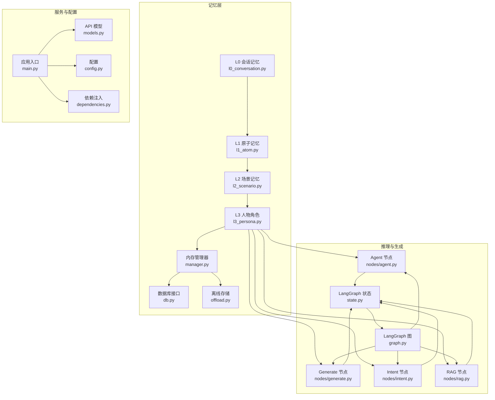
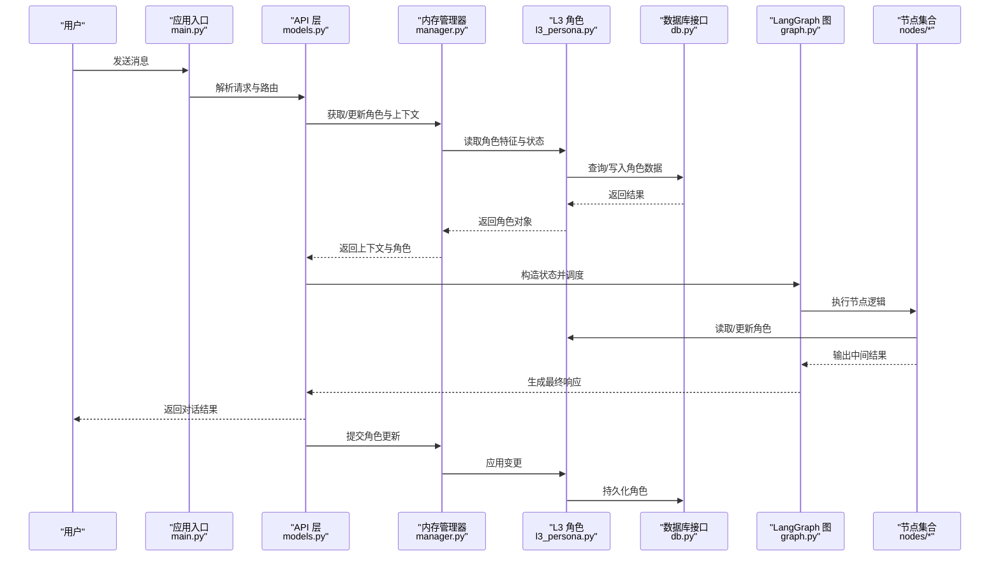
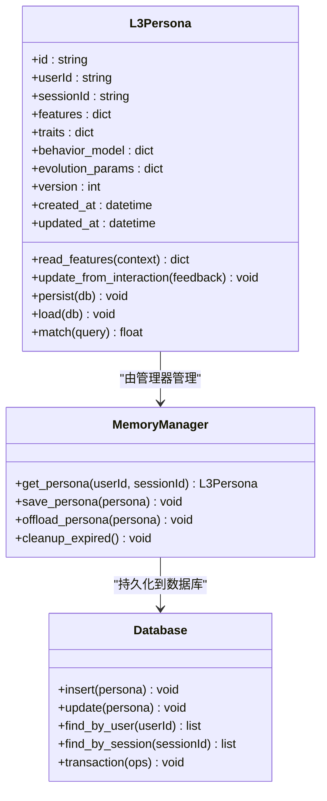
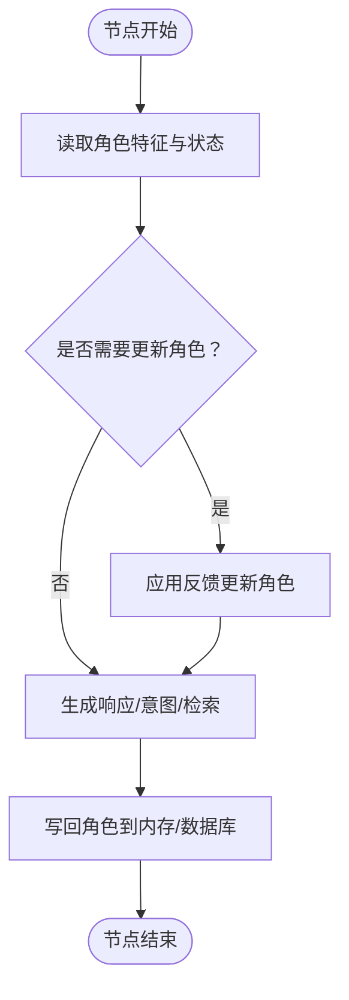
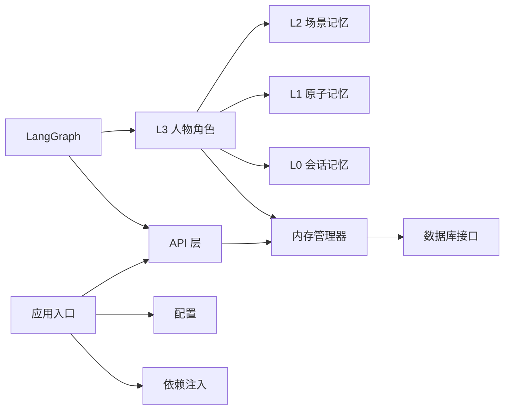

# L3 人物角色记忆

<cite>
**本文引用的文件**
- [l3_persona.py](file://backend/app/memory/l3_persona.py)
- [manager.py](file://backend/app/memory/manager.py)
- [db.py](file://backend/app/memory/db.py)
- [offload.py](file://backend/app/memory/offload.py)
- [l2_scenario.py](file://backend/app/memory/l2_scenario.py)
- [l1_atom.py](file://backend/app/memory/l1_atom.py)
- [l0_conversation.py](file://backend/app/memory/l0_conversation.py)
- [state.py](file://backend/app/langgraph/state.py)
- [graph.py](file://backend/app/langgraph/graph.py)
- [nodes/agent.py](file://backend/app/langgraph/nodes/agent.py)
- [nodes/generate.py](file://backend/app/langgraph/nodes/generate.py)
- [nodes/intent.py](file://backend/app/langgraph/nodes/intent.py)
- [nodes/rag.py](file://backend/app/langgraph/nodes/rag.py)
- [models.py](file://backend/app/api/models.py)
- [main.py](file://backend/app/main.py)
- [config.py](file://backend/app/config.py)
- [dependencies.py](file://backend/app/dependencies.py)
- [exceptions.py](file://backend/app/exceptions.py)
- [streaming.py](file://backend/app/langgraph/streaming.py)
- [vector_store.py](file://backend/app/rag/vector_store.py)
- [qa_chain.py](file://backend/app/rag/qa_chain.py)
- [query_rewriter.py](file://backend/app/rag/query_rewriter.py)
- [test_memory.py](file://backend/tests/test_memory.py)
- [test_memory_extended.py](file://backend/tests/test_memory_extended.py)
- [persona.md](file://offloads/persona.md)
</cite>

## 目录
1. [引言](#引言)
2. [项目结构](#项目结构)
3. [核心组件](#核心组件)
4. [架构总览](#架构总览)
5. [详细组件分析](#详细组件分析)
6. [依赖关系分析](#依赖关系分析)
7. [性能考量](#性能考量)
8. [故障排查指南](#故障排查指南)
9. [结论](#结论)
10. [附录](#附录)

## 引言
本技术文档聚焦于 L3 人物角色记忆层（L3 Persona Memory），系统性阐述人物角色的概念建模、特征提取、个性描述与行为模式；解释角色演化、学习适应与个性化调整；阐明角色与会话的绑定关系、动态更新与持久化；给出角色查询、匹配与相似度计算思路；并覆盖角色冲突检测、一致性维护与冲突解决策略。同时，面向开发者提供自定义角色模板、扩展特征维度与优化更新策略的实践指导，并说明其与用户建模、个性化推荐及情感计算的关系。

## 项目结构
L3 人物角色记忆位于后端内存模块中，与 L0/L1/L2 记忆层级协同工作，并通过 LangGraph 工作流在推理与生成节点中被调用。关键文件包括：
- L3 角色核心：backend/app/memory/l3_persona.py
- 内存管理器：backend/app/memory/manager.py
- 数据库接口：backend/app/memory/db.py
- 离线存储与迁移：backend/app/memory/offload.py
- 上下文层级：l2_scenario.py、l1_atom.py、l0_conversation.py
- 推理图与状态：backend/app/langgraph/state.py、backend/app/langgraph/graph.py
- LangGraph 节点：nodes/agent.py、nodes/generate.py、nodes/intent.py、nodes/rag.py
- API 模型与入口：backend/app/api/models.py、backend/app/main.py
- 配置与依赖：backend/app/config.py、backend/app/dependencies.py
- 测试：backend/tests/test_memory.py、backend/tests/test_memory_extended.py
- 角色模板离线文档：offloads/persona.md

图表来源
- [l3_persona.py](file://backend/app/memory/l3_persona.py)
- [manager.py](file://backend/app/memory/manager.py)
- [db.py](file://backend/app/memory/db.py)
- [offload.py](file://backend/app/memory/offload.py)
- [l2_scenario.py](file://backend/app/memory/l2_scenario.py)
- [l1_atom.py](file://backend/app/memory/l1_atom.py)
- [l0_conversation.py](file://backend/app/memory/l0_conversation.py)
- [state.py](file://backend/app/langgraph/state.py)
- [graph.py](file://backend/app/langgraph/graph.py)
- [nodes/agent.py](file://backend/app/langgraph/nodes/agent.py)
- [nodes/generate.py](file://backend/app/langgraph/nodes/generate.py)
- [nodes/intent.py](file://backend/app/langgraph/nodes/intent.py)
- [nodes/rag.py](file://backend/app/langgraph/nodes/rag.py)
- [models.py](file://backend/app/api/models.py)
- [main.py](file://backend/app/main.py)
- [config.py](file://backend/app/config.py)
- [dependencies.py](file://backend/app/dependencies.py)

章节来源
- [l3_persona.py](file://backend/app/memory/l3_persona.py)
- [manager.py](file://backend/app/memory/manager.py)
- [db.py](file://backend/app/memory/db.py)
- [offload.py](file://backend/app/memory/offload.py)
- [l2_scenario.py](file://backend/app/memory/l2_scenario.py)
- [l1_atom.py](file://backend/app/memory/l1_atom.py)
- [l0_conversation.py](file://backend/app/memory/l0_conversation.py)
- [state.py](file://backend/app/langgraph/state.py)
- [graph.py](file://backend/app/langgraph/graph.py)
- [nodes/agent.py](file://backend/app/langgraph/nodes/agent.py)
- [nodes/generate.py](file://backend/app/langgraph/nodes/generate.py)
- [nodes/intent.py](file://backend/app/langgraph/nodes/intent.py)
- [nodes/rag.py](file://backend/app/langgraph/nodes/rag.py)
- [models.py](file://backend/app/api/models.py)
- [main.py](file://backend/app/main.py)
- [config.py](file://backend/app/config.py)
- [dependencies.py](file://backend/app/dependencies.py)

## 核心组件
- L3 人物角色模型：封装角色特征、个性描述、行为模式、演化参数与持久化字段，支持与会话绑定、动态更新与查询匹配。
- 内存管理器：协调 L0/L1/L2/L3 各层级的记忆写入、检索与清理，提供角色生命周期管理。
- 数据库接口：抽象角色数据的读写、索引与事务处理，支撑角色持久化与一致性。
- 离线存储：提供角色快照、备份与迁移能力，保障大规模角色场景下的可运维性。
- 推理图与节点：在 Agent/Generate/Intent/RAG 节点中按需读取与更新角色，驱动上下文感知的对话行为。
- API 与入口：对外暴露角色 CRUD、查询与匹配接口，统一异常处理与依赖注入。

章节来源
- [l3_persona.py](file://backend/app/memory/l3_persona.py)
- [manager.py](file://backend/app/memory/manager.py)
- [db.py](file://backend/app/memory/db.py)
- [offload.py](file://backend/app/memory/offload.py)
- [nodes/agent.py](file://backend/app/langgraph/nodes/agent.py)
- [nodes/generate.py](file://backend/app/langgraph/nodes/generate.py)
- [nodes/intent.py](file://backend/app/langgraph/nodes/intent.py)
- [nodes/rag.py](file://backend/app/langgraph/nodes/rag.py)
- [models.py](file://backend/app/api/models.py)
- [main.py](file://backend/app/main.py)

## 架构总览
L3 人物角色记忆贯穿“输入—处理—输出—反馈”的完整闭环。用户输入经由 LangGraph 推理图进入各节点，节点根据当前会话与角色信息决定响应策略；角色信息在节点执行过程中被读取、更新与持久化，形成持续演化的个性化体验。

图表来源
- [main.py](file://backend/app/main.py)
- [models.py](file://backend/app/api/models.py)
- [manager.py](file://backend/app/memory/manager.py)
- [l3_persona.py](file://backend/app/memory/l3_persona.py)
- [db.py](file://backend/app/memory/db.py)
- [graph.py](file://backend/app/langgraph/graph.py)
- [nodes/agent.py](file://backend/app/langgraph/nodes/agent.py)
- [nodes/generate.py](file://backend/app/langgraph/nodes/generate.py)
- [nodes/intent.py](file://backend/app/langgraph/nodes/intent.py)
- [nodes/rag.py](file://backend/app/langgraph/nodes/rag.py)

## 详细组件分析

### L3 人物角色模型（l3_persona.py）
- 角色概念与建模
  - 角色作为长期稳定的个性实体，承载用户偏好、行为倾向、知识背景与交互风格等多维特征。
  - 支持动态演化参数（如适应度、权重衰减、学习步长）以模拟“成长”与“遗忘”。
- 特征提取与表示
  - 从 L2 场景记忆与 L1 原子记忆中抽取语义片段，结合 L0 会话上下文进行特征聚合。
  - 使用向量嵌入与关键词索引实现高效检索与相似度计算。
- 个性描述与行为模式
  - 定义个性标签、行为倾向矩阵与风格参数，用于控制回复语气、信息密度与交互节奏。
  - 行为模式与意图识别联动，基于历史交互统计构建概率转移模型。
- 演化、学习与个性化
  - 通过会话反馈对角色权重进行在线更新，采用滑动窗口与指数衰减平衡新旧经验。
  - 支持多目标优化（准确性、一致性、个性化），通过多准则评分驱动角色调整。
- 绑定关系与持久化
  - 角色与用户/会话 ID 绑定，支持跨会话延续；持久化包含版本号、时间戳与校验和。
  - 提供批量更新与事务提交，确保并发安全与一致性。

图表来源
- [l3_persona.py](file://backend/app/memory/l3_persona.py)
- [manager.py](file://backend/app/memory/manager.py)
- [db.py](file://backend/app/memory/db.py)

章节来源
- [l3_persona.py](file://backend/app/memory/l3_persona.py)
- [manager.py](file://backend/app/memory/manager.py)
- [db.py](file://backend/app/memory/db.py)

### 内存管理器（manager.py）
- 协调 L0/L1/L2/L3 的写入与检索，保证上下文一致性与最小必要性。
- 提供角色生命周期管理：创建、加载、更新、归档与清理。
- 实现角色冲突检测与合并策略：当同一用户的多个角色存在冲突时，依据时间戳、版本与权重进行仲裁。
- 支持离线存储与回放：将过期或低活跃角色导出至离线存储，降低在线负载。

章节来源
- [manager.py](file://backend/app/memory/manager.py)
- [offload.py](file://backend/app/memory/offload.py)

### 数据库接口（db.py）
- 抽象角色数据的增删改查与事务处理，支持高并发下的读写分离与缓存穿透防护。
- 提供角色索引与二级索引（用户/会话/版本），加速查询与分页。
- 实现快照与增量备份，保障数据可恢复性与审计追踪。

章节来源
- [db.py](file://backend/app/memory/db.py)

### LangGraph 推理与节点集成
- Agent/Generate/Intent/RAG 节点在执行前从 L3 读取角色特征与行为模式，在执行后将反馈写回角色。
- 节点内部通过状态对象传递角色引用，避免全局状态污染。
- 节点间通过状态图编排，形成“读取角色—生成响应—评估反馈—更新角色”的闭环。

图表来源
- [nodes/agent.py](file://backend/app/langgraph/nodes/agent.py)
- [nodes/generate.py](file://backend/app/langgraph/nodes/generate.py)
- [nodes/intent.py](file://backend/app/langgraph/nodes/intent.py)
- [nodes/rag.py](file://backend/app/langgraph/nodes/rag.py)
- [l3_persona.py](file://backend/app/memory/l3_persona.py)

章节来源
- [state.py](file://backend/app/langgraph/state.py)
- [graph.py](file://backend/app/langgraph/graph.py)
- [nodes/agent.py](file://backend/app/langgraph/nodes/agent.py)
- [nodes/generate.py](file://backend/app/langgraph/nodes/generate.py)
- [nodes/intent.py](file://backend/app/langgraph/nodes/intent.py)
- [nodes/rag.py](file://backend/app/langgraph/nodes/rag.py)

### 角色查询、匹配与相似度计算
- 查询策略：基于用户/会话 ID 的快速定位；基于关键词与向量的混合检索。
- 匹配算法：TF-IDF 与向量余弦相似度加权；支持阈值过滤与 Top-K 排序。
- 相似度计算：结合语义相似度与风格相似度，综合评估候选角色与当前上下文的契合度。

章节来源
- [l3_persona.py](file://backend/app/memory/l3_persona.py)

### 角色冲突检测、一致性维护与冲突解决
- 冲突检测：同一用户多角色的时间戳重叠、版本冲突、特征矛盾。
- 一致性维护：通过事务与版本号确保并发写入的一致性；对不一致状态进行回滚与告警。
- 冲突解决：优先级策略（最新优先、权重优先、人工仲裁）；自动合并与提示用户确认。

章节来源
- [manager.py](file://backend/app/memory/manager.py)
- [db.py](file://backend/app/memory/db.py)

### 开发者指南：自定义角色模板、扩展特征维度与优化更新策略
- 自定义角色模板：参考离线模板文档，定义特征键、行为模式与演化参数。
- 扩展特征维度：新增领域特征（如专业背景、兴趣标签）与交互特征（如偏好强度、敏感度）。
- 更新策略优化：采用异步批处理、增量更新与预热缓存，降低在线延迟与抖动。

章节来源
- [persona.md](file://offloads/persona.md)
- [l3_persona.py](file://backend/app/memory/l3_persona.py)

### 与用户建模、个性化推荐与情感计算的关系
- 用户建模：L3 角色作为用户建模的核心载体，融合显式偏好与隐式行为，形成稳定且可解释的用户画像。
- 个性化推荐：基于角色偏好与历史交互，为内容与服务提供个性化排序与定向推送。
- 情感计算：结合情感词典与上下文情感得分，调节角色语气与表达方式，提升共情与亲和力。

## 依赖关系分析
- L3 依赖 L2/L1/L0 提供的上下文与特征，向上游提供稳定的个性化基线。
- LangGraph 节点依赖 L3 进行上下文感知决策，同时将反馈回传给 L3。
- API 层负责请求解析与路由，依赖内存管理器完成角色生命周期操作。
- 配置与依赖注入模块为各组件提供统一的初始化与环境变量。

图表来源
- [l3_persona.py](file://backend/app/memory/l3_persona.py)
- [manager.py](file://backend/app/memory/manager.py)
- [db.py](file://backend/app/memory/db.py)
- [models.py](file://backend/app/api/models.py)
- [main.py](file://backend/app/main.py)
- [config.py](file://backend/app/config.py)
- [dependencies.py](file://backend/app/dependencies.py)

章节来源
- [models.py](file://backend/app/api/models.py)
- [main.py](file://backend/app/main.py)
- [config.py](file://backend/app/config.py)
- [dependencies.py](file://backend/app/dependencies.py)

## 性能考量
- 查询性能：建立复合索引与向量索引，采用分页与缓存命中策略；对热点角色进行预热。
- 写入性能：批量写入与异步更新；事务拆分与锁粒度优化；写放大控制与去重。
- 推理性能：节点内复用角色缓存；减少不必要的角色读取与序列化；流式输出降低首字延迟。
- 存储成本：角色压缩与增量备份；离线归档与冷热分层；定期清理无效角色。

## 故障排查指南
- 角色加载失败：检查数据库连接、索引完整性与版本兼容性；查看事务回滚日志。
- 并发冲突：启用重试与退避策略；对关键写入加锁；监控死锁与超时。
- 推理异常：核对 LangGraph 状态结构与节点输入；验证角色特征合法性与范围约束。
- API 错误：统一异常处理与错误码映射；记录请求上下文与堆栈信息；区分业务异常与系统异常。

章节来源
- [exceptions.py](file://backend/app/exceptions.py)
- [main.py](file://backend/app/main.py)
- [manager.py](file://backend/app/memory/manager.py)

## 结论
L3 人物角色记忆层通过稳定的特征建模、动态演化机制与严格的持久化策略，实现了长期一致的个性化体验。它与上下文记忆层协同，借助 LangGraph 节点在推理与生成阶段发挥作用，并通过 API 与配置体系提供可扩展的工程化能力。建议在实践中持续优化查询与更新策略，完善冲突检测与一致性维护，以支撑更大规模的个性化场景。

## 附录
- 角色模板参考：见离线模板文档，定义特征键、行为模式与演化参数。
- 测试用例：涵盖角色 CRUD、匹配与一致性测试，建议在本地运行以验证功能。

章节来源
- [persona.md](file://offloads/persona.md)
- [test_memory.py](file://backend/tests/test_memory.py)
- [test_memory_extended.py](file://backend/tests/test_memory_extended.py)