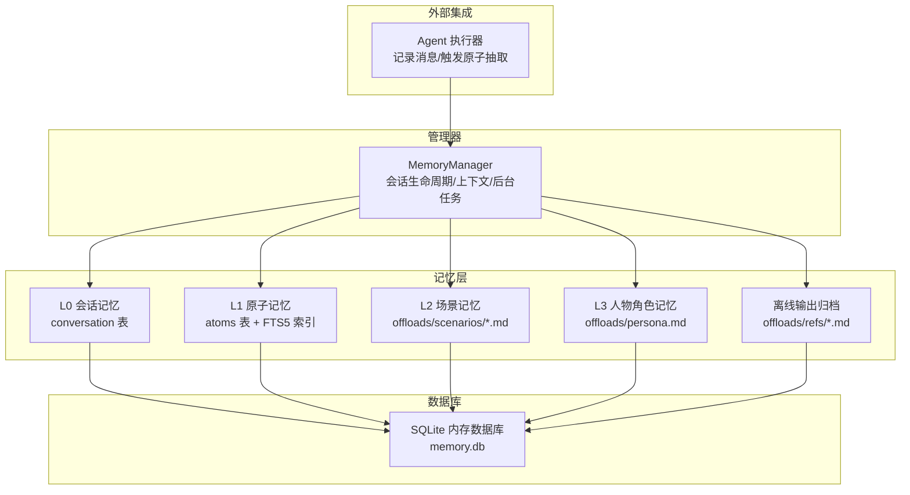
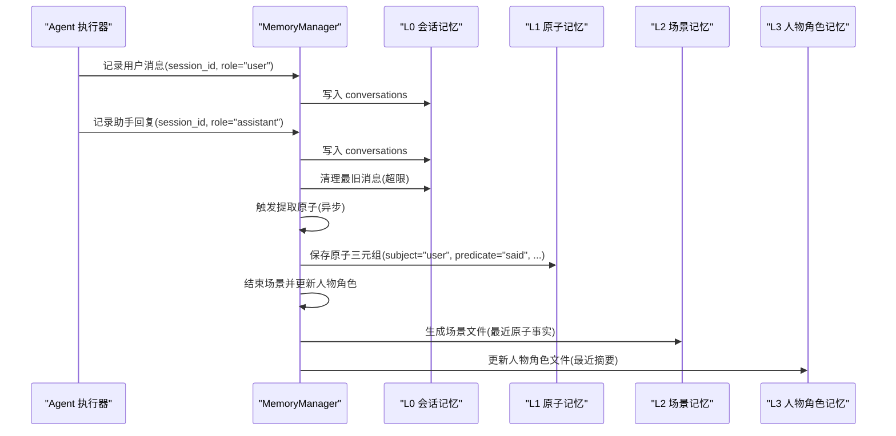
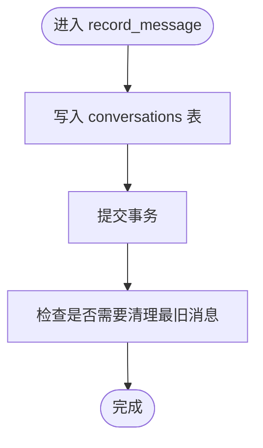
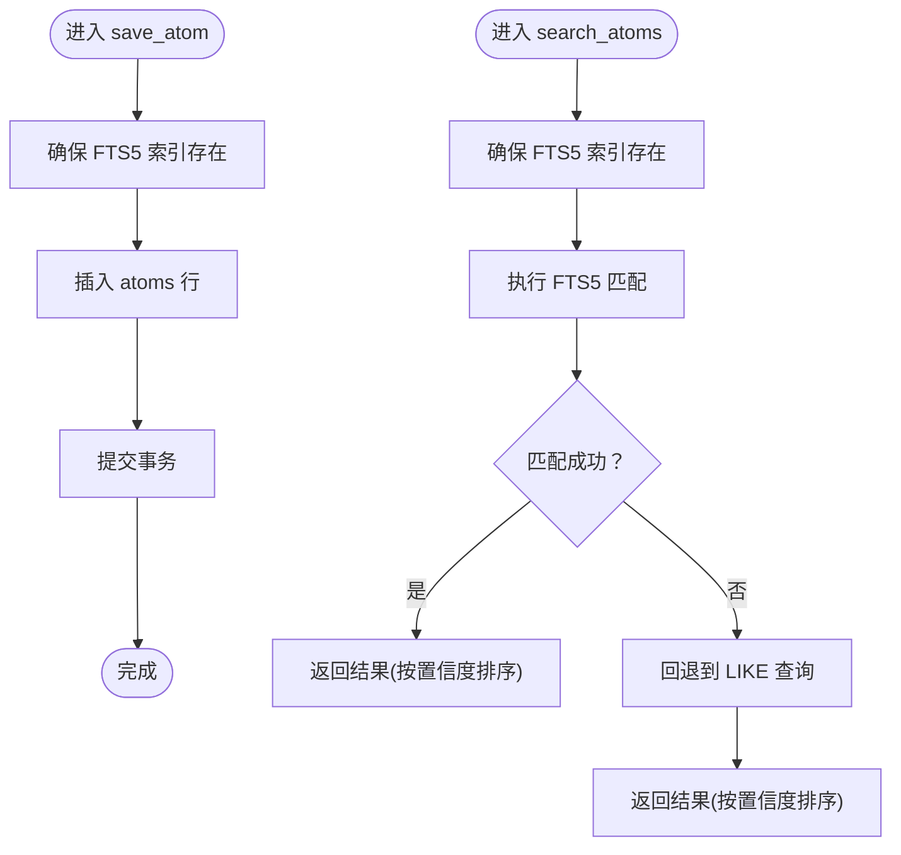
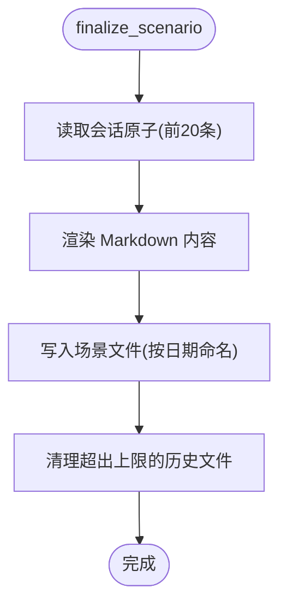
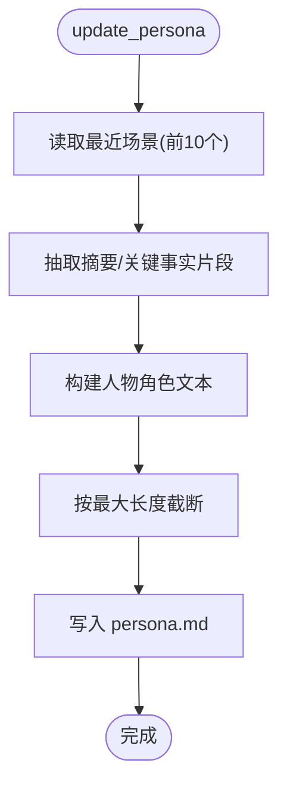
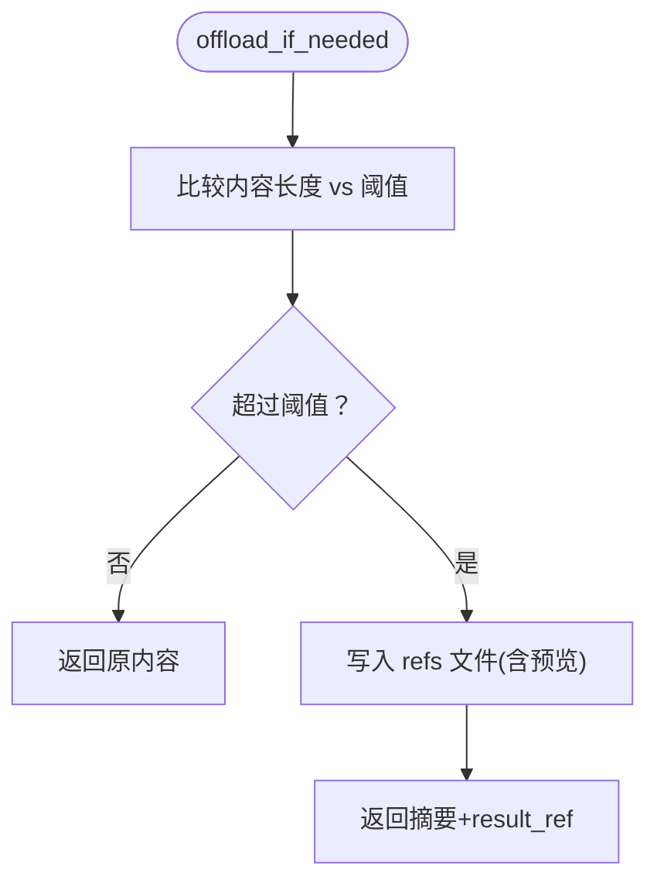
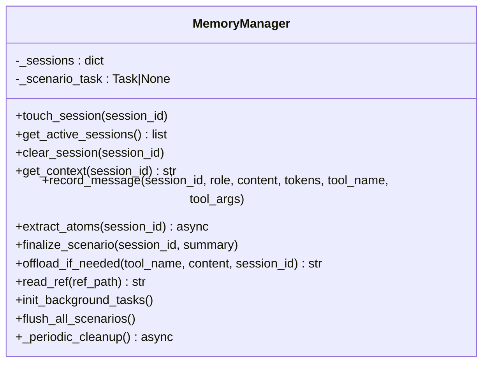
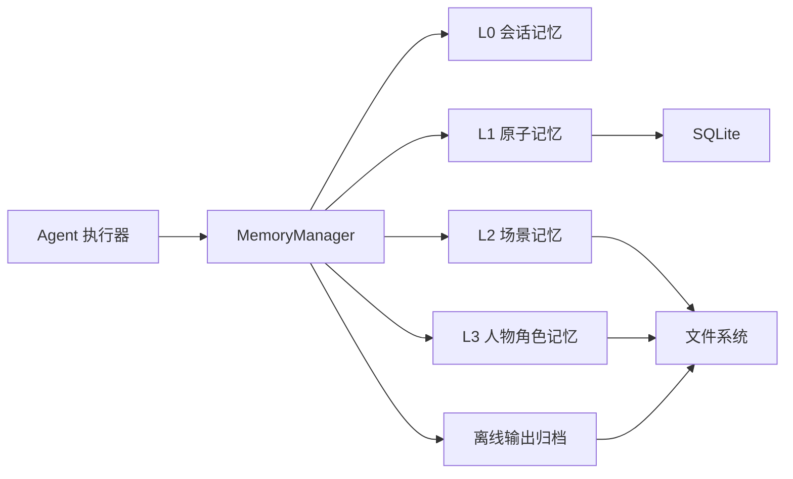

# 多层级记忆系统

<cite>
**本文引用的文件**
- [backend/app/memory/manager.py](file://backend/app/memory/manager.py)
- [backend/app/memory/l0_conversation.py](file://backend/app/memory/l0_conversation.py)
- [backend/app/memory/l1_atom.py](file://backend/app/memory/l1_atom.py)
- [backend/app/memory/l2_scenario.py](file://backend/app/memory/l2_scenario.py)
- [backend/app/memory/l3_persona.py](file://backend/app/memory/l3_persona.py)
- [backend/app/memory/offload.py](file://backend/app/memory/offload.py)
- [backend/app/memory/db.py](file://backend/app/memory/db.py)
- [backend/app/agent/executor.py](file://backend/app/agent/executor.py)
- [backend/tests/test_manager.py](file://backend/tests/test_manager.py)
</cite>

## 目录
1. [引言](#引言)
2. [项目结构](#项目结构)
3. [核心组件](#核心组件)
4. [架构总览](#架构总览)
5. [详细组件分析](#详细组件分析)
6. [依赖关系分析](#依赖关系分析)
7. [性能考量](#性能考量)
8. [故障排查指南](#故障排查指南)
9. [结论](#结论)
10. [附录](#附录)

## 引言
本文件面向开发者与架构师，系统性阐述 Aureon 的多层级记忆系统：L0 会话记忆、L1 原子记忆、L2 场景记忆与 L3 人物角色记忆。文档覆盖各层设计理念、数据模型、持久化策略、检索与相似度计算、更新与清理机制、内存与并发优化、以及与聊天历史、用户偏好和上下文理解的关系。同时提供扩展与性能优化建议。

## 项目结构
记忆系统位于后端 Python 包 app/memory 下，围绕 SQLite 数据库与本地文件系统进行分层存储与检索，并通过 MemoryManager 统一编排生命周期与后台任务。

图示来源
- [backend/app/memory/manager.py:19-129](file://backend/app/memory/manager.py#L19-L129)
- [backend/app/memory/db.py:15-63](file://backend/app/memory/db.py#L15-L63)
- [backend/app/memory/l0_conversation.py:8-35](file://backend/app/memory/l0_conversation.py#L8-L35)
- [backend/app/memory/l1_atom.py:43-97](file://backend/app/memory/l1_atom.py#L43-L97)
- [backend/app/memory/l2_scenario.py:35-77](file://backend/app/memory/l2_scenario.py#L35-L77)
- [backend/app/memory/l3_persona.py:11-43](file://backend/app/memory/l3_persona.py#L11-L43)
- [backend/app/memory/offload.py:11-52](file://backend/app/memory/offload.py#L11-L52)
- [backend/app/agent/executor.py:105-108](file://backend/app/agent/executor.py#L105-L108)

章节来源
- [backend/app/memory/manager.py:19-129](file://backend/app/memory/manager.py#L19-L129)
- [backend/app/memory/db.py:15-63](file://backend/app/memory/db.py#L15-L63)

## 核心组件
- MemoryManager：统一管理会话生命周期、上下文拼装、消息记录、原子抽取、场景收尾与人物角色更新、后台清理任务；负责与 L0/L1/L2/L3 模块交互。
- L0 会话记忆：基于 SQLite conversations 表，按会话 ID 存储消息，支持上限清理。
- L1 原子记忆：基于 atoms 表与 FTS5 全文索引，存储三元组事实（subject/predicate/object），支持全文检索与回退查询。
- L2 场景记忆：将最近原子事实汇总为 Markdown 场景文件，按日期命名，限制数量并定期清理。
- L3 人物角色记忆：从近期场景摘要生成人物角色文件，控制大小并写入本地文件。
- 离线输出归档：超过阈值的工具输出自动落盘为 refs 文件，返回简要摘要与引用路径。
- 数据库层：SQLite + WAL 模式 + 线程局部连接 + 忙等待，确保并发读取与写入稳定性。

章节来源
- [backend/app/memory/manager.py:19-129](file://backend/app/memory/manager.py#L19-L129)
- [backend/app/memory/l0_conversation.py:8-65](file://backend/app/memory/l0_conversation.py#L8-L65)
- [backend/app/memory/l1_atom.py:9-98](file://backend/app/memory/l1_atom.py#L9-L98)
- [backend/app/memory/l2_scenario.py:18-94](file://backend/app/memory/l2_scenario.py#L18-L94)
- [backend/app/memory/l3_persona.py:11-44](file://backend/app/memory/l3_persona.py#L11-L44)
- [backend/app/memory/offload.py:11-53](file://backend/app/memory/offload.py#L11-L53)
- [backend/app/memory/db.py:15-63](file://backend/app/memory/db.py#L15-L63)

## 架构总览
下图展示消息从 Agent 到记忆系统的完整流程，包括会话记录、原子抽取、场景收尾与人物角色更新。

图示来源
- [backend/app/agent/executor.py:105-108](file://backend/app/agent/executor.py#L105-L108)
- [backend/app/memory/manager.py:53-77](file://backend/app/memory/manager.py#L53-L77)
- [backend/app/memory/l0_conversation.py:8-35](file://backend/app/memory/l0_conversation.py#L8-L35)
- [backend/app/memory/l1_atom.py:43-61](file://backend/app/memory/l1_atom.py#L43-L61)
- [backend/app/memory/l2_scenario.py:35-66](file://backend/app/memory/l2_scenario.py#L35-L66)
- [backend/app/memory/l3_persona.py:11-36](file://backend/app/memory/l3_persona.py#L11-L36)

## 详细组件分析

### L0 会话记忆（对话轮次）
- 设计理念：以“会话”为单位保留原始对话，便于后续抽取与回放。
- 数据模型：表字段包含会话标识、角色、内容、Token 数量、工具名与参数、时间戳。
- 关键操作：
  - 记录消息：插入一条新记录。
  - 获取会话：按时间倒序返回最近 N 条消息。
  - 清理最旧：当条数超过阈值时删除最早一批，避免无限增长。
- 并发与一致性：每个线程持有独立连接，WAL 模式允许多读；busy_timeout 避免写竞争阻塞。
- 与 L1 的衔接：在会话末尾抽取用户最后一条消息作为原子事实输入。

图示来源
- [backend/app/memory/l0_conversation.py:8-35](file://backend/app/memory/l0_conversation.py#L8-L35)
- [backend/app/memory/l0_conversation.py:47-65](file://backend/app/memory/l0_conversation.py#L47-L65)

章节来源
- [backend/app/memory/l0_conversation.py:8-65](file://backend/app/memory/l0_conversation.py#L8-L65)
- [backend/app/memory/db.py:15-63](file://backend/app/memory/db.py#L15-L63)

### L1 原子记忆（三元组事实）
- 设计理念：将对话中的关键事实抽象为三元组（主体-谓词-客体），支持快速检索与推理。
- 数据模型：atoms 表存储三元组与置信度、来源引用；FTS5 虚拟表与触发器实现自动索引维护。
- 关键操作：
  - 保存原子：插入三元组，触发 FTS5 同步。
  - 搜索原子：优先使用 FTS5 全文匹配，失败则回退到 LIKE 查询。
  - 获取会话原子：按时间顺序返回该会话全部原子。
- 检索与相似度：
  - 使用 FTS5 匹配短语，按置信度排序；可扩展为向量相似度或语义检索。
  - 回退策略：在 FTS 初始化失败时自动降级为 LIKE 查询，保证可用性。
- 性能要点：FTS5 索引减少全表扫描；触发器保证索引与数据一致。

图示来源
- [backend/app/memory/l1_atom.py:9-41](file://backend/app/memory/l1_atom.py#L9-L41)
- [backend/app/memory/l1_atom.py:43-61](file://backend/app/memory/l1_atom.py#L43-L61)
- [backend/app/memory/l1_atom.py:63-87](file://backend/app/memory/l1_atom.py#L63-L87)

章节来源
- [backend/app/memory/l1_atom.py:9-98](file://backend/app/memory/l1_atom.py#L9-L98)

### L2 场景记忆（会话摘要）
- 设计理念：将一组原子事实归纳为可读的场景摘要，沉淀为结构化知识。
- 数据模型：本地 Markdown 文件，包含会话标识、日期、摘要与关键事实列表。
- 关键操作：
  - 收尾场景：读取会话原子，生成摘要文件，限制最大数量并清理过旧文件。
  - 获取最近场景：按修改时间倒序读取最近 N 份场景。
- 缓存策略：目录扫描结果带 TTL 缓存，降低频繁 IO。
- 与 L3 的关系：L3 从最近场景中抽取摘要片段构建人物角色。

图示来源
- [backend/app/memory/l2_scenario.py:35-66](file://backend/app/memory/l2_scenario.py#L35-L66)
- [backend/app/memory/l2_scenario.py:68-77](file://backend/app/memory/l2_scenario.py#L68-L77)
- [backend/app/memory/l2_scenario.py:80-94](file://backend/app/memory/l2_scenario.py#L80-L94)

章节来源
- [backend/app/memory/l2_scenario.py:18-94](file://backend/app/memory/l2_scenario.py#L18-L94)

### L3 人物角色记忆（长期角色）
- 设计理念：从近期场景摘要中提炼人物角色，作为系统对“用户身份”的长期认知。
- 数据模型：单个 Markdown 文件，包含近期活动摘要。
- 关键操作：
  - 更新人物角色：读取最近场景，抽取摘要与关键事实，截断至最大长度并写入文件。
  - 获取人物角色：直接读取文件内容。
- 与 L2 的关系：L3 是 L2 的高层抽象，聚焦“人物视角”。

图示来源
- [backend/app/memory/l3_persona.py:11-36](file://backend/app/memory/l3_persona.py#L11-L36)
- [backend/app/memory/l3_persona.py:39-43](file://backend/app/memory/l3_persona.py#L39-L43)

章节来源
- [backend/app/memory/l3_persona.py:11-44](file://backend/app/memory/l3_persona.py#L11-L44)

### 离线输出归档（大体量工具输出）
- 设计理念：当工具输出超过阈值时，自动落盘为 refs 文件，返回简要摘要与引用路径，避免污染上下文窗口。
- 关键操作：
  - 归档判断：根据字符阈值决定是否归档。
  - 写入文件：按会话+工具+时间命名，写入 offloads/refs。
  - 读取引用：受路径遍历保护，仅允许在指定目录内访问。

图示来源
- [backend/app/memory/offload.py:11-37](file://backend/app/memory/offload.py#L11-L37)
- [backend/app/memory/offload.py:40-52](file://backend/app/memory/offload.py#L40-L52)

章节来源
- [backend/app/memory/offload.py:11-53](file://backend/app/memory/offload.py#L11-L53)

### MemoryManager（统一编排）
- 会话生命周期：记录活跃会话、触达时间、清理超时会话。
- 上下文拼装：聚合人物角色与最近场景摘要。
- 消息记录：写入 L0 并清理最旧消息。
- 原子抽取：异步从最近用户消息抽取原子事实。
- 场景收尾与人物角色更新：结束会话时生成场景文件并更新人物角色。
- 后台任务：周期性检查不活跃会话并自动收尾。

图示来源
- [backend/app/memory/manager.py:20-129](file://backend/app/memory/manager.py#L20-L129)

章节来源
- [backend/app/memory/manager.py:20-129](file://backend/app/memory/manager.py#L20-L129)

## 依赖关系分析
- 模块耦合：
  - MemoryManager 依赖 L0/L1/L2/L3/offload，形成清晰的分层依赖。
  - L1 对数据库层有强依赖（FTS5）；L2/L3 对文件系统有强依赖。
- 外部集成：
  - Agent 执行器在记录消息后触发原子抽取，体现记忆系统与对话流的深度耦合。
- 数据一致性：
  - SQLite 事务保证原子性；FTS5 触发器保证索引与数据一致；文件写入失败有日志与回退处理。

图示来源
- [backend/app/agent/executor.py:105-108](file://backend/app/agent/executor.py#L105-L108)
- [backend/app/memory/manager.py:53-77](file://backend/app/memory/manager.py#L53-L77)
- [backend/app/memory/db.py:15-63](file://backend/app/memory/db.py#L15-L63)

章节来源
- [backend/app/memory/manager.py:53-77](file://backend/app/memory/manager.py#L53-L77)
- [backend/app/agent/executor.py:105-108](file://backend/app/agent/executor.py#L105-L108)

## 性能考量
- 数据库并发：
  - 线程局部连接避免跨线程共享；WAL 模式允许多读；busy_timeout 提升写入稳定性。
  - 建议：在高并发场景下评估连接池与写入批量化策略。
- FTS5 索引：
  - 优先使用 FTS5 进行全文检索；初始化失败自动回退到 LIKE，保障可用性。
  - 建议：对高频查询字段建立复合索引或引入向量检索。
- 清理与归档：
  - L0 最旧消息清理采用批量删除；L2 限制文件数量并定期清理；L3 控制文件大小。
  - 建议：结合会话活跃度动态调整清理阈值。
- 缓存策略：
  - L2 场景目录扫描带 TTL 缓存，降低 IO 压力。
  - 建议：引入更细粒度的缓存失效策略与预热。
- 内存与序列化：
  - 将长输出归档至 refs，避免上下文膨胀。
  - 建议：对热点场景与原子事实引入内存缓存（需注意一致性）。

章节来源
- [backend/app/memory/db.py:15-63](file://backend/app/memory/db.py#L15-L63)
- [backend/app/memory/l1_atom.py:9-41](file://backend/app/memory/l1_atom.py#L9-L41)
- [backend/app/memory/l2_scenario.py:18-32](file://backend/app/memory/l2_scenario.py#L18-L32)
- [backend/app/memory/offload.py:11-37](file://backend/app/memory/offload.py#L11-L37)

## 故障排查指南
- FTS5 初始化失败：
  - 现象：搜索回退到 LIKE，性能下降。
  - 排查：确认 SQLite 版本支持 FTS5；检查权限与磁盘空间。
- 场景文件写入失败：
  - 现象：日志报错但不影响主流程。
  - 排查：检查 offloads/scenarios 目录权限与磁盘配额。
- 人物角色文件过大：
  - 现象：被截断写入。
  - 排查：确认 PERSONA_MAX_SIZE 设置；必要时调整摘要策略。
- 路径遍历保护触发：
  - 现象：读取引用返回错误提示。
  - 排查：核对 result_ref 是否位于 offloads/refs 下。
- 后台清理任务异常：
  - 现象：任务重启或错误日志。
  - 排查：检查定时任务循环与异常捕获逻辑。

章节来源
- [backend/app/memory/l1_atom.py:39-40](file://backend/app/memory/l1_atom.py#L39-L40)
- [backend/app/memory/l2_scenario.py:62-63](file://backend/app/memory/l2_scenario.py#L62-L63)
- [backend/app/memory/l3_persona.py:28-30](file://backend/app/memory/l3_persona.py#L28-L30)
- [backend/app/memory/offload.py:43-45](file://backend/app/memory/offload.py#L43-L45)
- [backend/app/memory/manager.py:120-126](file://backend/app/memory/manager.py#L120-L126)

## 结论
Aureon 的多层级记忆系统以“会话-事实-场景-角色”为主线，通过 SQLite 与文件系统实现低成本、可扩展的记忆存储与检索。L0 保留原始对话，L1 抽象为三元组，L2 汇总为场景，L3 形成人物角色，最终由 MemoryManager 统一编排生命周期与后台清理。系统具备良好的可用性（FTS5 回退）、可维护性（模块化分层）与可扩展性（可替换检索与存储后端）。建议在生产环境中结合业务特征进一步优化索引、缓存与清理策略，并引入向量检索与内存缓存以提升性能。

## 附录

### 记忆检索与相似度计算
- L1 检索：优先使用 FTS5 短语匹配，按置信度排序；失败回退 LIKE。
- L2/L3：基于文件内容的关键词匹配与摘要抽取。
- 建议扩展：引入嵌入向量相似度、语义检索与混合排序。

章节来源
- [backend/app/memory/l1_atom.py:63-87](file://backend/app/memory/l1_atom.py#L63-L87)
- [backend/app/memory/l2_scenario.py:68-77](file://backend/app/memory/l2_scenario.py#L68-L77)
- [backend/app/memory/l3_persona.py:17-26](file://backend/app/memory/l3_persona.py#L17-L26)

### 记忆更新策略
- L0：消息写入后立即清理最旧条目，保持会话窗口稳定。
- L1：异步抽取用户最后一条消息为原子事实，逐步积累。
- L2：会话结束时生成场景文件，保留最近若干份。
- L3：从最近场景摘要中提炼人物角色，控制大小。

章节来源
- [backend/app/memory/l0_conversation.py:47-65](file://backend/app/memory/l0_conversation.py#L47-L65)
- [backend/app/memory/manager.py:60-71](file://backend/app/memory/manager.py#L60-L71)
- [backend/app/memory/l2_scenario.py:35-66](file://backend/app/memory/l2_scenario.py#L35-L66)
- [backend/app/memory/l3_persona.py:11-36](file://backend/app/memory/l3_persona.py#L11-L36)

### 记忆压缩、清理与归档
- L0：批量删除最旧记录，预留缓冲条数。
- L2：限制文件数量并删除最旧文件，缓存目录扫描结果。
- L3：按最大字节截断，避免过大文件影响加载。
- 离线归档：超过阈值的工具输出写入 refs，返回简要摘要与引用。

章节来源
- [backend/app/memory/l0_conversation.py:47-65](file://backend/app/memory/l0_conversation.py#L47-L65)
- [backend/app/memory/l2_scenario.py:80-94](file://backend/app/memory/l2_scenario.py#L80-L94)
- [backend/app/memory/l3_persona.py:28-30](file://backend/app/memory/l3_persona.py#L28-L30)
- [backend/app/memory/offload.py:11-37](file://backend/app/memory/offload.py#L11-L37)

### 开发者扩展与优化指南
- 扩展记忆类型：
  - 新增层级：参考 L1 的 atoms 表与 FTS5 模式，或参考 L2/L3 的文件模式。
  - 新增检索：在对应模块增加查询函数，必要时补充索引或缓存。
- 自定义记忆规则：
  - 在 MemoryManager 中扩展抽取逻辑（如抽取条件、置信度阈值）。
  - 在 L2/L3 中调整摘要策略（如选择更多原子、合并规则）。
- 性能优化：
  - 引入向量检索与混合排序。
  - 对热点数据引入内存缓存与预热。
  - 批量写入与延迟清理策略。
- 与聊天历史、用户偏好、上下文理解的关系：
  - L0 保留原始上下文；L1 提炼关键事实；L2 形成场景背景；L3 建立人物角色，共同增强上下文理解与个性化体验。

章节来源
- [backend/app/memory/manager.py:53-77](file://backend/app/memory/manager.py#L53-L77)
- [backend/app/memory/l1_atom.py:9-41](file://backend/app/memory/l1_atom.py#L9-L41)
- [backend/app/memory/l2_scenario.py:35-66](file://backend/app/memory/l2_scenario.py#L35-L66)
- [backend/app/memory/l3_persona.py:11-36](file://backend/app/memory/l3_persona.py#L11-L36)