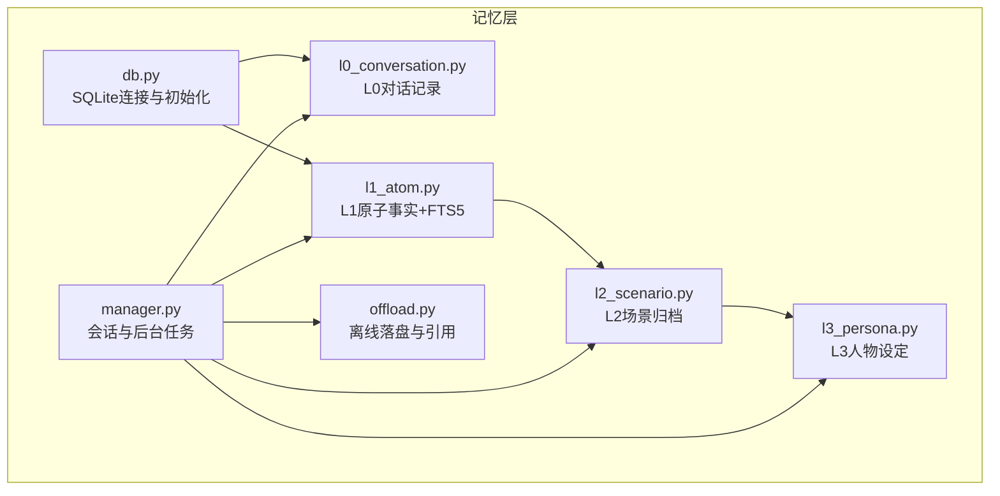
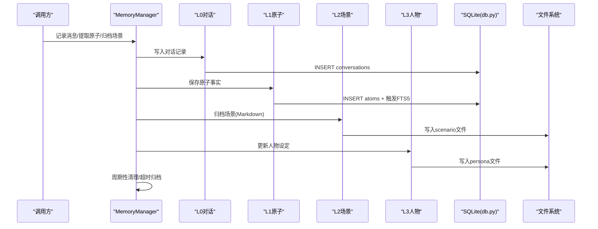
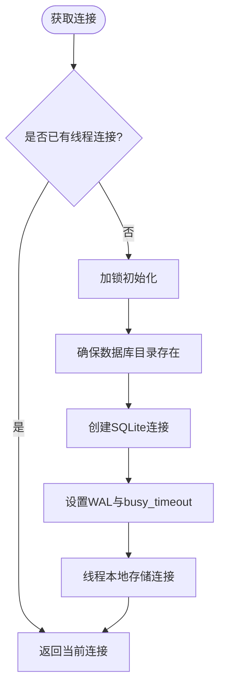
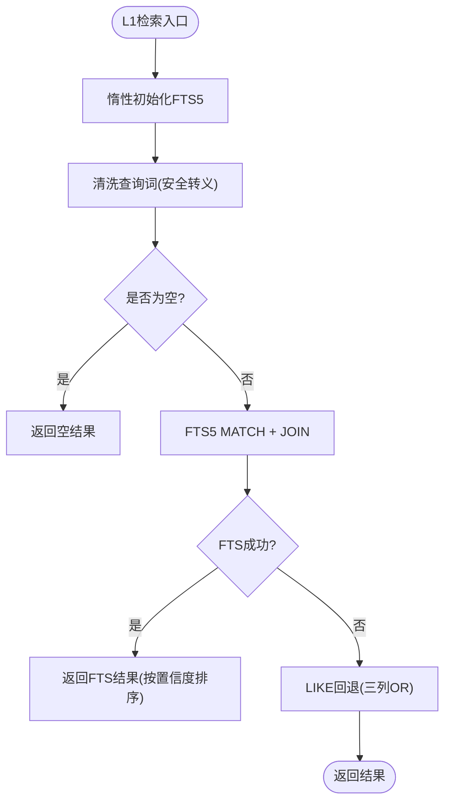
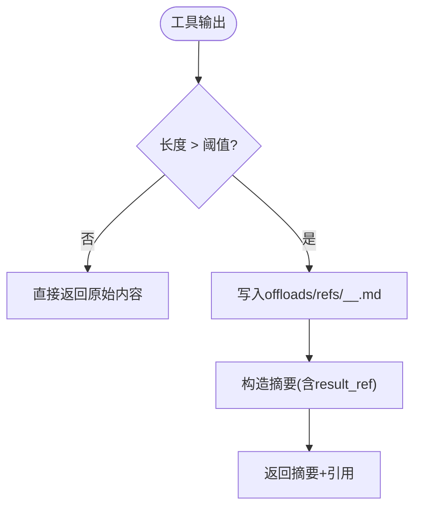
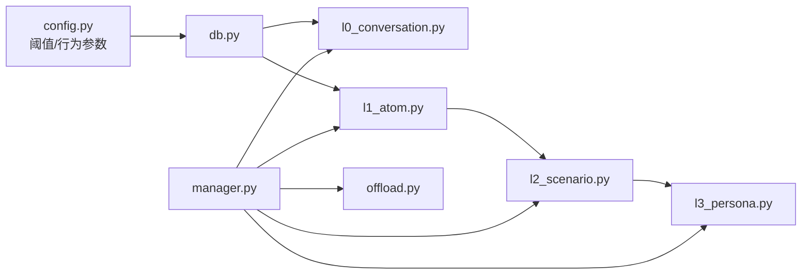

# 记忆数据库层

<cite>
**本文引用的文件**
- [backend/app/memory/db.py](file://backend/app/memory/db.py)
- [backend/app/memory/l0_conversation.py](file://backend/app/memory/l0_conversation.py)
- [backend/app/memory/l1_atom.py](file://backend/app/memory/l1_atom.py)
- [backend/app/memory/l2_scenario.py](file://backend/app/memory/l2_scenario.py)
- [backend/app/memory/l3_persona.py](file://backend/app/memory/l3_persona.py)
- [backend/app/memory/manager.py](file://backend/app/memory/manager.py)
- [backend/app/memory/offload.py](file://backend/app/memory/offload.py)
- [backend/app/config.py](file://backend/app/config.py)
- [backend/tests/test_memory.py](file://backend/tests/test_memory.py)
- [backend/tests/test_memory_extended.py](file://backend/tests/test_memory_extended.py)
</cite>

## 目录
1. [简介](#简介)
2. [项目结构](#项目结构)
3. [核心组件](#核心组件)
4. [架构总览](#架构总览)
5. [详细组件分析](#详细组件分析)
6. [依赖关系分析](#依赖关系分析)
7. [性能考量](#性能考量)
8. [故障排查指南](#故障排查指南)
9. [结论](#结论)
10. [附录](#附录)

## 简介
本文件面向“记忆数据库层”的技术文档，聚焦于SQLite驱动的记忆存储子系统，覆盖数据模型设计、索引与约束、访问模式与查询优化、事务管理、数据迁移与版本兼容、连接池与并发控制、性能监控、备份与恢复、灾难预防，以及与缓存层、文件系统和外部存储的集成关系。文档同时提供开发者扩展数据模型、增强查询能力与平滑迁移的实践指导。

## 项目结构
记忆数据库层位于后端应用的 memory 子模块中，采用分层设计：
- L0：对话记录（conversation）
- L1：原子事实（atom）与全文检索（FTS5）
- L2：场景归档（scenario）——将会话与原子事实落盘为Markdown
- L3：人物设定（persona）——从场景摘要生成并限制大小
- offload：大内容离线落盘与引用读取
- manager：会话生命周期与后台任务编排
- db：SQLite连接与初始化
- config：阈值与行为参数



图表来源
- [backend/app/memory/db.py:15-62](file://backend/app/memory/db.py#L15-L62)
- [backend/app/memory/l0_conversation.py:8-64](file://backend/app/memory/l0_conversation.py#L8-L64)
- [backend/app/memory/l1_atom.py:9-97](file://backend/app/memory/l1_atom.py#L9-L97)
- [backend/app/memory/l2_scenario.py:35-93](file://backend/app/memory/l2_scenario.py#L35-L93)
- [backend/app/memory/l3_persona.py:11-43](file://backend/app/memory/l3_persona.py#L11-L43)
- [backend/app/memory/offload.py:11-52](file://backend/app/memory/offload.py#L11-L52)
- [backend/app/memory/manager.py:20-129](file://backend/app/memory/manager.py#L20-L129)

章节来源
- [backend/app/memory/db.py:15-62](file://backend/app/memory/db.py#L15-L62)
- [backend/app/memory/manager.py:20-129](file://backend/app/memory/manager.py#L20-L129)

## 核心组件
- 数据库连接与初始化：每个线程拥有独立SQLite连接，启用WAL模式与busy_timeout，避免跨线程共享连接；首次访问时创建表与索引。
- L0对话记录：按会话持久化消息，支持清理最旧条目以控制容量。
- L1原子事实：存储三元组（主体-谓词-客体），通过FTS5虚拟表提供全文检索，并在失败时回退到LIKE匹配。
- L2场景归档：将最近若干原子事实与摘要写入Markdown文件，定期清理过期文件。
- L3人物设定：基于最近场景摘要生成并截断至最大字节长度，作为上下文提示的一部分。
- 离线落盘：当工具输出超过阈值时，写入文件并返回简要摘要与引用路径。
- 会话管理器：维护活跃会话、周期性清理不活跃会话、触发场景归档与人物设定更新、调度后台任务。

章节来源
- [backend/app/memory/db.py:15-62](file://backend/app/memory/db.py#L15-L62)
- [backend/app/memory/l0_conversation.py:8-64](file://backend/app/memory/l0_conversation.py#L8-L64)
- [backend/app/memory/l1_atom.py:9-97](file://backend/app/memory/l1_atom.py#L9-L97)
- [backend/app/memory/l2_scenario.py:35-93](file://backend/app/memory/l2_scenario.py#L35-L93)
- [backend/app/memory/l3_persona.py:11-43](file://backend/app/memory/l3_persona.py#L11-L43)
- [backend/app/memory/offload.py:11-52](file://backend/app/memory/offload.py#L11-L52)
- [backend/app/memory/manager.py:20-129](file://backend/app/memory/manager.py#L20-L129)

## 架构总览
记忆层围绕SQLite构建，结合文件系统与内存缓存，形成轻量级但可扩展的记忆体系。FTS5用于L1检索，场景与人物文件用于长文本与上下文复用，离线落盘用于大内容治理。



图表来源
- [backend/app/memory/manager.py:54-127](file://backend/app/memory/manager.py#L54-L127)
- [backend/app/memory/l0_conversation.py:16-24](file://backend/app/memory/l0_conversation.py#L16-L24)
- [backend/app/memory/l1_atom.py:51-60](file://backend/app/memory/l1_atom.py#L51-L60)
- [backend/app/memory/l2_scenario.py:35-65](file://backend/app/memory/l2_scenario.py#L35-L65)
- [backend/app/memory/l3_persona.py:11-36](file://backend/app/memory/l3_persona.py#L11-L36)
- [backend/app/memory/db.py:15-32](file://backend/app/memory/db.py#L15-L32)

## 详细组件分析

### 数据模型与表结构
- conversations（L0）
  - 字段：主键自增id、会话标识session_id、角色role、内容content、token用量tokens、工具名tool_name与参数tool_args、时间created_at。
  - 约束：非空字段与默认时间戳。
  - 索引：对session_id建立普通索引，支持按会话查询与清理。
- atoms（L1）
  - 字段：主键自增id、会话标识session_id、主体subject、谓词predicate、客体object、来源引用source_ref、置信度confidence、时间created_at。
  - 约束：非空字段与默认时间戳。
  - 索引：对session_id建立普通索引；通过FTS5虚拟表atoms_fts提供全文检索。
- 场景文件（L2）
  - 文件命名：session_id_YYYYMMDD.md，内容包含摘要与关键事实列表。
  - 清理策略：保留最近N个文件。
- 人物文件（L3）
  - 文件命名：persona.md，内容来自最近场景摘要，最大字节数限制。

章节来源
- [backend/app/memory/db.py:38-61](file://backend/app/memory/db.py#L38-L61)
- [backend/app/memory/l0_conversation.py:8-35](file://backend/app/memory/l0_conversation.py#L8-L35)
- [backend/app/memory/l1_atom.py:43-60](file://backend/app/memory/l1_atom.py#L43-L60)
- [backend/app/memory/l2_scenario.py:35-65](file://backend/app/memory/l2_scenario.py#L35-L65)
- [backend/app/memory/l3_persona.py:11-36](file://backend/app/memory/l3_persona.py#L11-L36)

### 连接与事务管理
- 连接模型：每个线程持有独立sqlite3.Connection实例，避免跨线程共享导致的锁竞争与状态污染。
- 模式设置：启用WAL模式提升并发读取能力；设置busy_timeout缓解写入竞争。
- 初始化：首次访问时执行DDL脚本创建表与索引；L1的FTS5在首次使用时惰性初始化。
- 事务：各写入接口在本地提交；未显式开启事务块，遵循SQLite默认自动提交语义。



图表来源
- [backend/app/memory/db.py:15-32](file://backend/app/memory/db.py#L15-L32)

章节来源
- [backend/app/memory/db.py:15-32](file://backend/app/memory/db.py#L15-L32)

### 查询与检索优化
- L0查询：按会话过滤并按时间倒序取前N条，适合滚动窗口式上下文拼接。
- L1检索：优先使用FTS5 MATCH进行全文检索；若异常则回退到LIKE组合条件，保障可用性。
- 缓存：L2场景列表带TTL缓存，降低频繁扫描目录带来的开销。
- 预处理：FTS5查询对特殊字符进行安全转义，避免语法错误与性能抖动。



图表来源
- [backend/app/memory/l1_atom.py:63-87](file://backend/app/memory/l1_atom.py#L63-L87)

章节来源
- [backend/app/memory/l1_atom.py:63-87](file://backend/app/memory/l1_atom.py#L63-L87)
- [backend/app/memory/l2_scenario.py:18-32](file://backend/app/memory/l2_scenario.py#L18-L32)

### 事务与一致性
- 写入原子性：单条INSERT/DELETE在当前连接内提交，保证单次操作的原子性。
- 幂等性：FTS5触发器在插入/删除/更新时同步索引，避免脏读。
- 超时与重试：busy_timeout提升写入稳定性；上层逻辑建议在重试场景中捕获异常并降级（如回退到LIKE）。

章节来源
- [backend/app/memory/db.py:25-32](file://backend/app/memory/db.py#L25-L32)
- [backend/app/memory/l1_atom.py:9-41](file://backend/app/memory/l1_atom.py#L9-L41)

### 数据迁移与版本兼容
- 表结构演进：当前DDL在初始化阶段统一执行，新增字段建议添加默认值或迁移脚本；索引变更需考虑重建成本。
- FTS5向后兼容：若FTS5不可用，系统自动回退到LIKE查询，保证功能可用。
- 文件格式演进：场景与人物文件为纯文本，版本升级时建议在解析侧增加兼容分支（如新字段解析失败时忽略）。

章节来源
- [backend/app/memory/l1_atom.py:9-41](file://backend/app/memory/l1_atom.py#L9-L41)
- [backend/app/memory/l2_scenario.py:35-65](file://backend/app/memory/l2_scenario.py#L35-L65)
- [backend/app/memory/l3_persona.py:11-36](file://backend/app/memory/l3_persona.py#L11-L36)

### 大内容治理与离线落盘
- 触发阈值：超过配置阈值的内容将被写入offloads/refs目录，返回包含简要预览与引用路径的结果。
- 引用读取：提供路径遍历防护，仅允许在限定目录内读取文件。
- 清理策略：离线文件由调用方决定何时清理，避免无限增长。



图表来源
- [backend/app/memory/offload.py:11-37](file://backend/app/memory/offload.py#L11-L37)

章节来源
- [backend/app/memory/offload.py:11-52](file://backend/app/memory/offload.py#L11-L52)

### 会话生命周期与后台任务
- 活跃标记：每次消息记录都会刷新会话最后活跃时间。
- 自动归档：超过阈值不活跃时间的会话将被自动归档并移除。
- 周期清理：定时任务每间隔固定秒数扫描一次，执行清理与归档。
- 上下文拼接：获取上下文时优先合并人物设定与最近场景。

```mermaid
sequenceDiagram
participant Loop as "后台任务"
participant Mgr as "MemoryManager"
participant L2 as "L2场景"
participant L3 as "L3人物"
loop 每间隔检查
Loop->>Mgr : 扫描活跃会话
alt 超时未活跃
Mgr->>L2 : 归档场景(摘要)
L2-->>Mgr : 完成
Mgr->>L3 : 更新人物设定
L3-->>Mgr : 完成
Mgr->>Mgr : 移除会话记录
else 正常活跃
Mgr->>Mgr : 继续保持
end
end
```

图表来源
- [backend/app/memory/manager.py:104-127](file://backend/app/memory/manager.py#L104-L127)

章节来源
- [backend/app/memory/manager.py:20-129](file://backend/app/memory/manager.py#L20-L129)

### 与缓存层、文件系统与外部存储的关系
- 缓存层：L2场景列表采用内存缓存（TTL），减少目录扫描开销；FTS5索引由SQLite内部维护。
- 文件系统：场景与人物文件写入offloads目录；离线落盘文件写入offloads/refs；路径遍历严格校验。
- 外部存储：当前未直接接入对象存储；如需扩展，可在离线落盘模块引入上传/下载抽象，保持对外接口一致。

章节来源
- [backend/app/memory/l2_scenario.py:18-32](file://backend/app/memory/l2_scenario.py#L18-L32)
- [backend/app/memory/l3_persona.py:11-36](file://backend/app/memory/l3_persona.py#L11-L36)
- [backend/app/memory/offload.py:40-52](file://backend/app/memory/offload.py#L40-L52)

## 依赖关系分析
- 层间依赖：L0为数据源，L1抽取事实，L2聚合场景，L3生成人物，offload负责大内容治理；manager协调各层交互。
- 外部依赖：SQLite（含FTS5）、Python标准库（pathlib、logging、threading）。
- 配置依赖：通过配置类提供阈值与行为参数，影响离线落盘与会话清理策略。



图表来源
- [backend/app/config.py:48-49](file://backend/app/config.py#L48-L49)
- [backend/app/memory/db.py:15-32](file://backend/app/memory/db.py#L15-L32)
- [backend/app/memory/manager.py:20-129](file://backend/app/memory/manager.py#L20-L129)

章节来源
- [backend/app/config.py:48-49](file://backend/app/config.py#L48-L49)
- [backend/app/memory/manager.py:20-129](file://backend/app/memory/manager.py#L20-L129)

## 性能考量
- 连接与并发
  - 线程本地连接避免锁争用；WAL模式提升并发读取吞吐。
  - busy_timeout缓解写入阻塞，建议在高并发写入场景适当增大。
- 查询优化
  - L0按会话索引查询，LIMIT控制返回量；L1优先FTS5，回退LIKE保障可用性。
  - L2场景列表缓存（TTL）降低目录扫描频率。
- 存储与IO
  - 场景与人物文件为纯文本，建议在高QPS场景配合只追加写入与定期压缩。
  - 离线落盘文件建议定期清理，避免磁盘膨胀。
- 监控指标
  - 建议埋点：写入耗时、FTS5命中率、LIKE回退次数、场景文件数量、persona大小、离线落盘次数与大小分布。

[本节为通用性能建议，无需特定文件引用]

## 故障排查指南
- FTS5初始化失败
  - 现象：FTS5初始化抛出异常，系统回退到LIKE。
  - 排查：确认SQLite版本支持FTS5；检查权限与磁盘空间；观察日志警告信息。
- LIKE回退频繁
  - 现象：FTS5 MATCH报错或性能不佳。
  - 排查：检查查询词是否包含大量特殊字符；确认FTS5触发器是否正常；必要时调整查询策略。
- 场景文件未生成
  - 现象：finalize_scenario未产生文件。
  - 排查：确认SCENARIOS_DIR可写；检查缓存是否过期；验证会话是否存在原子事实。
- 人物文件过大
  - 现象：persona超出最大字节限制。
  - 排查：确认PERSONA_MAX_SIZE配置；检查摘要生成逻辑是否截断。
- 离线落盘失败
  - 现象：offload写入失败或read_ref返回错误。
  - 排查：确认REFS_DIR可写；检查路径遍历保护逻辑；验证文件是否存在。

章节来源
- [backend/app/memory/l1_atom.py:9-41](file://backend/app/memory/l1_atom.py#L9-L41)
- [backend/app/memory/l2_scenario.py:35-65](file://backend/app/memory/l2_scenario.py#L35-L65)
- [backend/app/memory/l3_persona.py:11-36](file://backend/app/memory/l3_persona.py#L11-L36)
- [backend/app/memory/offload.py:40-52](file://backend/app/memory/offload.py#L40-L52)

## 结论
记忆数据库层以SQLite为核心，结合FTS5、文件系统与内存缓存，实现了从对话到原子事实再到场景与人物的多层级记忆体系。其设计强调简单可靠、可扩展与可运维，适合中小规模到中等规模的对话与知识管理场景。对于更高并发与更大体量的数据，建议在保持现有接口不变的前提下，引入分布式KV或对象存储，并在manager层做透明适配。

[本节为总结性内容，无需特定文件引用]

## 附录

### 开发者扩展与迁移指南
- 新增L1字段
  - 在DDL中添加新列并提供默认值；更新FTS5触发器以同步新列；在查询侧兼容旧数据。
- 升级场景/人物文件格式
  - 在解析侧增加版本字段与兼容分支；逐步迁移存量文件。
- 引入外部存储
  - 在offload模块中抽象上传/下载接口；保持对外字符串引用不变；在读取侧支持本地与远端分流。
- 平滑迁移
  - 使用双写策略：先写本地SQLite，再写目标存储；在读取侧兼容两种来源；完成后切换读取策略并清理旧数据。

[本节为通用开发建议，无需特定文件引用]

### 测试参考
- 单元测试覆盖范围
  - L0：记录与检索、清理最旧消息。
  - L1：保存与检索（含FTS5与LIKE回退）。
  - L2/L3：场景归档、人物生成与大小限制。
  - offload：阈值判断、文件写入、引用读取与路径保护。
- 关键断言
  - 结果数量、字段值、文件存在性、错误信息与路径保护生效。

章节来源
- [backend/tests/test_memory.py:14-62](file://backend/tests/test_memory.py#L14-L62)
- [backend/tests/test_memory_extended.py:49-341](file://backend/tests/test_memory_extended.py#L49-L341)