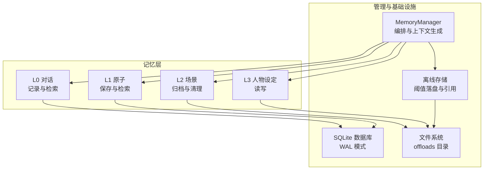
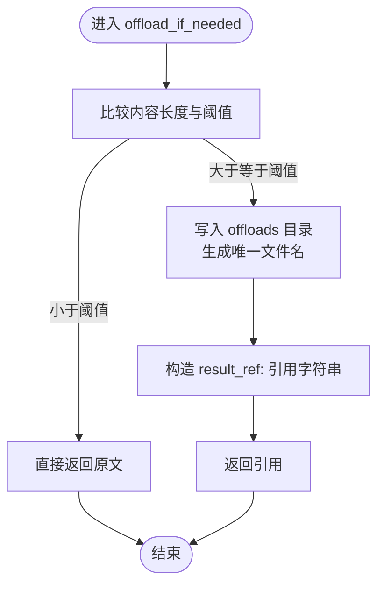
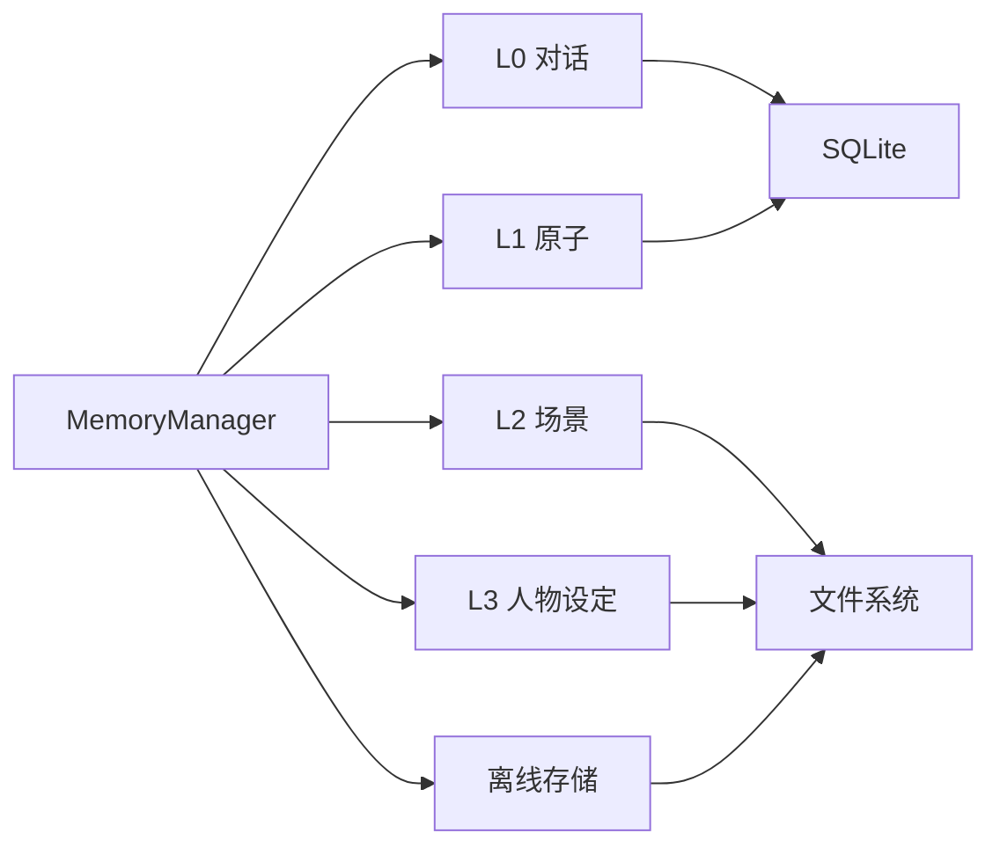

# 记忆离线存储系统

<cite>
**本文引用的文件**
- [backend/app/memory/db.py](file://backend/app/memory/db.py)
- [backend/app/memory/offload.py](file://backend/app/memory/offload.py)
- [backend/app/memory/l0_conversation.py](file://backend/app/memory/l0_conversation.py)
- [backend/app/memory/l1_atom.py](file://backend/app/memory/l1_atom.py)
- [backend/app/memory/l2_scenario.py](file://backend/app/memory/l2_scenario.py)
- [backend/app/memory/l3_persona.py](file://backend/app/memory/l3_persona.py)
- [backend/app/memory/manager.py](file://backend/app/memory/manager.py)
- [backend/tests/test_memory.py](file://backend/tests/test_memory.py)
- [backend/tests/test_memory_extended.py](file://backend/tests/test_memory_extended.py)
- [backend/tests/test_manager.py](file://backend/tests/test_manager.py)
- [backend/app/tools/read_ref.py](file://backend/app/tools/read_ref.py)
</cite>

## 目录
1. [引言](#引言)
2. [项目结构](#项目结构)
3. [核心组件](#核心组件)
4. [架构总览](#架构总览)
5. [详细组件分析](#详细组件分析)
6. [依赖关系分析](#依赖关系分析)
7. [性能考量](#性能考量)
8. [故障排查指南](#故障排查指南)
9. [结论](#结论)
10. [附录](#附录)

## 引言
本技术文档围绕“记忆离线存储系统”展开，聚焦于离线存储的设计理念与实现机制，涵盖大容量数据存储、文件系统管理与路径组织、数据压缩与序列化策略、存储配额与清理回收、离线数据访问接口与并发控制、数据完整性校验与备份恢复、故障转移方案，以及面向开发者的自定义存储格式、扩展存储后端与性能优化建议。文档以仓库中实际存在的后端记忆模块为核心，结合测试用例与工具函数，系统梳理从对话原子到场景与人物设定的多层级记忆体系，并说明其与SQLite数据库及文件系统协同工作的整体架构。

## 项目结构
记忆离线存储系统位于后端应用的 memory 子模块中，采用分层设计：L0（对话）、L1（原子事实）、L2（场景）、L3（人物设定），并通过统一的 MemoryManager 进行编排；离线内容通过 offload 模块按阈值落盘至文件系统，引用以“result_ref:”标记；底层持久化由 SQLite 提供，采用 WAL 模式与线程局部连接避免跨线程竞争。



图表来源
- [backend/app/memory/db.py:1-32](file://backend/app/memory/db.py#L1-L32)
- [backend/app/memory/offload.py](file://backend/app/memory/offload.py)
- [backend/app/memory/l0_conversation.py](file://backend/app/memory/l0_conversation.py)
- [backend/app/memory/l1_atom.py](file://backend/app/memory/l1_atom.py)
- [backend/app/memory/l2_scenario.py](file://backend/app/memory/l2_scenario.py)
- [backend/app/memory/l3_persona.py](file://backend/app/memory/l3_persona.py)
- [backend/app/memory/manager.py](file://backend/app/memory/manager.py)

章节来源
- [backend/app/memory/db.py:1-32](file://backend/app/memory/db.py#L1-L32)
- [backend/app/memory/offload.py](file://backend/app/memory/offload.py)
- [backend/app/memory/l0_conversation.py](file://backend/app/memory/l0_conversation.py)
- [backend/app/memory/l1_atom.py](file://backend/app/memory/l1_atom.py)
- [backend/app/memory/l2_scenario.py](file://backend/app/memory/l2_scenario.py)
- [backend/app/memory/l3_persona.py](file://backend/app/memory/l3_persona.py)
- [backend/app/memory/manager.py](file://backend/app/memory/manager.py)

## 核心组件
- SQLite 数据库与连接管理：提供线程局部连接、WAL 日志模式与忙等待超时，确保并发读取与写入的稳定性。
- 离线存储模块：根据阈值将长文本落盘为独立文件，返回“result_ref:”引用，减少内存占用并支持大文本持久化。
- 记忆层 L0/L1/L2/L3：分别负责短期对话、原子事实、场景归档与人物设定，形成从即时到长期的记忆闭环。
- MemoryManager：统一编排各层操作，生成上下文，处理离线引用读取与回填。
- 工具 read_ref：用于解析并读取离线引用指向的文件内容。

章节来源
- [backend/app/memory/db.py:15-32](file://backend/app/memory/db.py#L15-L32)
- [backend/app/memory/offload.py](file://backend/app/memory/offload.py)
- [backend/app/memory/l0_conversation.py](file://backend/app/memory/l0_conversation.py)
- [backend/app/memory/l1_atom.py](file://backend/app/memory/l1_atom.py)
- [backend/app/memory/l2_scenario.py](file://backend/app/memory/l2_scenario.py)
- [backend/app/memory/l3_persona.py](file://backend/app/memory/l3_persona.py)
- [backend/app/memory/manager.py](file://backend/app/memory/manager.py)
- [backend/app/tools/read_ref.py](file://backend/app/tools/read_ref.py)

## 架构总览
下图展示从调用方到各记忆层、数据库与文件系统的交互流程，以及离线落盘与引用解析的关键节点。

```mermaid
sequenceDiagram
participant Caller as "调用方"
participant MGR as "MemoryManager"
participant L0 as "L0 对话"
participant L1 as "L1 原子"
participant L2 as "L2 场景"
participant L3 as "L3 人物设定"
participant OFF as "离线存储"
participant DB as "SQLite"
participant FS as "文件系统"
Caller->>MGR : 请求生成上下文/执行记忆操作
MGR->>L0 : 记录/查询对话
L0->>DB : 写入/查询消息
MGR->>L1 : 保存/检索原子
L1->>DB : 写入/查询原子
MGR->>L2 : 归档/清理场景
L2->>FS : 创建场景文件
MGR->>OFF : 长文本离线落盘
OFF->>FS : 写入离线文件
MGR->>OFF : 解析 result_ref 引用
OFF->>FS : 读取离线文件
MGR-->>Caller : 返回结果含离线内容
```

图表来源
- [backend/app/memory/manager.py](file://backend/app/memory/manager.py)
- [backend/app/memory/l0_conversation.py](file://backend/app/memory/l0_conversation.py)
- [backend/app/memory/l1_atom.py](file://backend/app/memory/l1_atom.py)
- [backend/app/memory/l2_scenario.py](file://backend/app/memory/l2_scenario.py)
- [backend/app/memory/l3_persona.py](file://backend/app/memory/l3_persona.py)
- [backend/app/memory/offload.py](file://backend/app/memory/offload.py)
- [backend/app/memory/db.py:15-32](file://backend/app/memory/db.py#L15-L32)

## 详细组件分析

### SQLite 连接与并发控制（db.py）
- 设计要点
  - 使用线程局部变量为每个线程维护独立连接，避免跨线程共享导致的竞争与锁争用。
  - 启用 WAL 模式以支持多读取器并发访问，提升读性能。
  - 设置忙等待超时，缓解写入冲突带来的阻塞。
  - 初始化时确保 offloads 目录存在，保证后续落盘可用。
- 并发特性
  - 多线程安全：每线程一连接，天然避免跨线程互斥。
  - 读写分离：WAL 允许多读取器同时读取，写入在 WAL 文件上进行。
- 可靠性
  - 通过 row_factory 统一结果访问方式，便于上层抽象。
  - 忙等待超时参数可按环境调整，平衡吞吐与延迟。

章节来源
- [backend/app/memory/db.py:15-32](file://backend/app/memory/db.py#L15-L32)

### 离线存储与引用解析（offload.py 与 read_ref.py）
- 设计理念
  - 将超过阈值的大文本内容落盘为独立文件，返回“result_ref:”引用，降低内存压力并支持大容量数据持久化。
  - 引用解析由 read_ref 完成，读取时自动回填内容，对上层透明。
- 路径组织
  - 离线文件默认存放于 offloads 目录，按会话与工具名命名，避免冲突并便于清理。
- 测试验证
  - 短文本应原样返回，不触发落盘。
  - 长文本应生成离线文件，引用字符串包含工具与会话标识。
  - 引用读取应返回原始内容，长度小于或等于原文。



图表来源
- [backend/app/memory/offload.py](file://backend/app/memory/offload.py)
- [backend/app/tools/read_ref.py](file://backend/app/tools/read_ref.py)

章节来源
- [backend/app/memory/offload.py](file://backend/app/memory/offload.py)
- [backend/app/tools/read_ref.py](file://backend/app/tools/read_ref.py)
- [backend/tests/test_memory.py:36-46](file://backend/tests/test_memory.py#L36-L46)
- [backend/tests/test_memory_extended.py:181-201](file://backend/tests/test_memory_extended.py#L181-L201)

### 记忆层 L0（对话）（l0_conversation.py）
- 功能职责
  - 记录用户与助手的消息，支持按会话检索与清理最旧条目。
- 数据模型
  - 以会话 ID 为键，存储角色、内容与 token 消耗等元信息。
- 并发与一致性
  - 通过 SQLite 连接池与 WAL 模式保障并发读写稳定。
- 测试覆盖
  - 能正确记录与检索两条消息，角色匹配。

章节来源
- [backend/app/memory/l0_conversation.py](file://backend/app/memory/l0_conversation.py)
- [backend/tests/test_memory.py:10-23](file://backend/tests/test_memory.py#L10-L23)

### 记忆层 L1（原子事实）（l1_atom.py）
- 功能职责
  - 保存主体、谓语、客体等三元组形式的原子事实，支持基于关键词的检索。
- 检索策略
  - 基于关键词匹配，返回包含目标词的事实集合。
- 测试覆盖
  - 能保存并检索指定关键词的事实，字段包含主体等。

章节来源
- [backend/app/memory/l1_atom.py](file://backend/app/memory/l1_atom.py)
- [backend/tests/test_memory.py:25-34](file://backend/tests/test_memory.py#L25-L34)

### 记忆层 L2（场景）（l2_scenario.py）
- 功能职责
  - 归档会话为场景文件，支持列出与清理旧场景，维持长期上下文。
- 清理策略
  - 提供清理旧场景的内部方法，配合定时任务或边界条件触发。
- 路径组织
  - 场景文件位于 offloads/scenarios 目录，按会话 ID 命名。
- 测试覆盖
  - 场景归档后能生成对应文件，测试在特定平台存在竞态提示，需关注环境差异。

章节来源
- [backend/app/memory/l2_scenario.py](file://backend/app/memory/l2_scenario.py)
- [backend/tests/test_memory.py:48-56](file://backend/tests/test_memory.py#L48-L56)
- [backend/tests/test_memory_extended.py:39-168](file://backend/tests/test_memory_extended.py#L39-L168)

### 记忆层 L3（人物设定）（l3_persona.py）
- 功能职责
  - 读写人物设定文件，作为系统提示的一部分参与上下文生成。
- 文件位置
  - 默认路径为 offloads/persona.md。
- 测试覆盖
  - 读取时返回文件完整内容，更新后可被读取到最新内容。

章节来源
- [backend/app/memory/l3_persona.py](file://backend/app/memory/l3_persona.py)
- [backend/tests/test_memory.py:58-62](file://backend/tests/test_memory.py#L58-L62)
- [backend/tests/test_memory_extended.py:169-177](file://backend/tests/test_memory_extended.py#L169-L177)

### MemoryManager 编排（manager.py）
- 功能职责
  - 统一编排 L0/L1/L2/L3 的调用，生成最终上下文字符串。
  - 在上下文中解析“result_ref:”引用，读取离线文件并回填内容。
  - 提供短文本直通与离线引用读取的委托逻辑。
- 测试覆盖
  - 上下文生成包含人物设定片段。
  - 离线引用读取委托至 read_ref 工具，返回文件内容。

章节来源
- [backend/app/memory/manager.py](file://backend/app/memory/manager.py)
- [backend/tests/test_manager.py:67-90](file://backend/tests/test_manager.py#L67-L90)
- [backend/tests/test_manager.py:78-90](file://backend/tests/test_manager.py#L78-L90)

## 依赖关系分析
- 层内依赖
  - L0/L1 依赖 SQLite 数据库；L2/L3 依赖文件系统；离线模块依赖文件系统。
- 层间依赖
  - MemoryManager 依赖 L0/L1/L2/L3 与离线模块，负责组装上下文与处理引用。
- 外部依赖
  - SQLite（WAL 模式）与文件系统（offloads 目录）是核心外部资源。
- 并发耦合
  - SQLite 通过线程局部连接与 WAL 降低耦合；离线文件通过唯一命名避免竞争。



图表来源
- [backend/app/memory/manager.py](file://backend/app/memory/manager.py)
- [backend/app/memory/l0_conversation.py](file://backend/app/memory/l0_conversation.py)
- [backend/app/memory/l1_atom.py](file://backend/app/memory/l1_atom.py)
- [backend/app/memory/l2_scenario.py](file://backend/app/memory/l2_scenario.py)
- [backend/app/memory/l3_persona.py](file://backend/app/memory/l3_persona.py)
- [backend/app/memory/offload.py](file://backend/app/memory/offload.py)
- [backend/app/memory/db.py:15-32](file://backend/app/memory/db.py#L15-L32)

章节来源
- [backend/app/memory/manager.py](file://backend/app/memory/manager.py)
- [backend/app/memory/offload.py](file://backend/app/memory/offload.py)
- [backend/app/memory/l0_conversation.py](file://backend/app/memory/l0_conversation.py)
- [backend/app/memory/l1_atom.py](file://backend/app/memory/l1_atom.py)
- [backend/app/memory/l2_scenario.py](file://backend/app/memory/l2_scenario.py)
- [backend/app/memory/l3_persona.py](file://backend/app/memory/l3_persona.py)
- [backend/app/memory/db.py:15-32](file://backend/app/memory/db.py#L15-L32)

## 性能考量
- 数据库并发
  - WAL 模式显著提升并发读取能力；忙等待超时参数可按负载调优。
- 离线落盘
  - 阈值控制决定内存与磁盘的权衡点；合理设置可避免峰值内存抖动。
- 文件系统 IO
  - 离线文件采用唯一命名与会话隔离，减少目录膨胀；定期清理旧场景可回收空间。
- 序列化与压缩
  - 当前实现以纯文本落盘为主；如需进一步压缩，可在 offload 层引入压缩算法并在引用解析处解压。
- 并发控制
  - SQLite 线程局部连接已解决跨线程竞争；若扩展到多进程或多实例，需引入分布式锁或队列协调。

## 故障排查指南
- SQLite 连接问题
  - 若出现连接异常，检查线程局部连接初始化是否成功，确认 offloads 目录存在且具备写权限。
- 离线引用无法解析
  - 确认引用字符串格式为“result_ref:”前缀，文件存在于 offloads 目录，且文件名包含会话与工具标识。
- 场景归档失败
  - 检查 offloads/scenarios 目录权限与磁盘空间；关注测试中标注的平台竞态提示，必要时在 CI 环境禁用相关测试或增加重试。
- 内存占用过高
  - 检查离线阈值设置是否过低；确认长文本是否正确落盘；监控文件数量与大小，定期清理旧场景。

章节来源
- [backend/app/memory/db.py:15-32](file://backend/app/memory/db.py#L15-L32)
- [backend/app/memory/offload.py](file://backend/app/memory/offload.py)
- [backend/tests/test_memory.py:48-56](file://backend/tests/test_memory.py#L48-L56)

## 结论
该记忆离线存储系统通过分层记忆（L0/L1/L2/L3）与 SQLite/WAL 的数据库设计，结合离线落盘与引用解析机制，在保证高并发读取的同时实现了对大体量文本的高效管理。文件系统路径清晰、清理策略明确，测试覆盖了核心行为。未来可在压缩、序列化、分布式扩展与更细粒度的配额控制方面继续演进，以满足更高性能与更大规模的应用场景。

## 附录
- 自定义存储格式
  - 在 offload 层引入序列化协议（如 JSON/MessagePack），并在引用解析处反序列化，保持“result_ref:”兼容性。
- 扩展存储后端
  - 抽象出存储适配器接口，支持本地文件系统、对象存储（S3/OSS）与数据库表存储，通过配置切换。
- 优化访问性能
  - 引入缓存层（如 LRU）缓存热点场景与人物设定；对频繁检索的原子事实建立二级索引；对长文本落盘采用分块与增量读取。
- 成本控制
  - 通过阈值与清理策略控制磁盘占用；对冷数据迁移至低成本存储；监控与告警空间使用率。